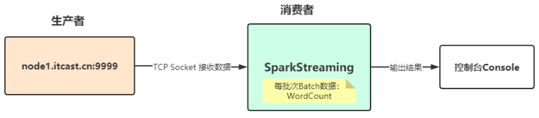

[TOC]


# 1- Spark Streaming概述

​		在传统的数据处理过程中，我们往往先将**数据存入数据库**中，当需要的时候再去数据库中进行检索查询，将处理的结果返回给请求的用户；另外，MapReduce 这类大数据处理框架，更多应用在离线计算场景中。而对于一些实时性要求较高的场景，我们期望延迟在秒甚至毫秒级别，就需要引出一种新的数据计算结构——**流式计算**，对**无边界的数据进行连续不断的处理、聚合和分析**。


## 1-1 新概率

**实时计算: 对流数据进行实时的计算, 在很短的时间内得到想要的结果**

**流数据: 数据源源不断的到来 不知何时结束, 只知道数据不断的涌进来.**

 

**实时计算 == 流式计算**


## 1-2 Streaming 应用场景

- **电商实时大屏**


- **商品推荐**


- **工业大数据**


- **集群监控**


## 1-3 Streaming 计算模式

前置概念:

``` properties
离线计算/批处理计算: 一批有界数据放在那里, 等着你一次性处理掉

流式计算/实时计算: 源源不断的无界数据实时处理

有界数据: 被处理的数据有明确的开始和明确的结束

无界数据: 被处理的数据有明确的开始,没有明确的结束(无界数据也一般称之为流数据)
```


​		流式处理任务是大数据处理中很重要的一个分支，关于流式计算的框架也有很多，如比较出名的Storm流式处理框架，是由Nathan Marz等人于 2010 年最先开发，之后将Storm开源，成为 Apache 的顶级项目，Trident 对Storm进行了一个更高层次的抽象；另外由LinkedIn贡献给社区的 Samza 也是一种流处理解决方案，不过其构建严重依赖于另一个开源项目 Kafka。

​		Spark Streaming 构建在Spark的基础之上的实时流处理框架，随着Spark的发展，Spark Streaming和Structured Streaming也受到了越来越多的关注。


## 1-4 流式计算模式

- 不同的流式处理框架有不同的特点，也适应不同的场景，主要有如下两种模式。

### 1-4-1 模式一：原生流处理（Native）

所有输入记录会**一条接一条地被处理**，上面提到的 **Storm 和 Flink** 都是采用这种方式；

绝对一次一条的模式

 

### 1-4-2 模式二：微批处理（Batch）

​		将输入的数据以某一时间间隔 T，切分成多个微批量数据，然后对每个批量数据进行处理，**Spark Streaming 和StructuredStreaming 采用的是这种方式**；

​		也就是Spark本质上是一个 批处理框架, 但是可以将批做的很小来实现类似流处理的效果.比如间隔是1秒,就一秒钟处理一个批次

 

 


## 1-4 Spark Streaming计算思想

​		Spark Streaming是Spark生态系统当中一个重要的框架，它建立在Spark Core之上，下图也可以看出Sparking Streaming在Spark生态系统中地位。

 

官方定义Spark Streaming模块：

 

**SparkStreaming是一个基于SparkCore之上的实时计算框架，可以从很多数据源消费数据并对数据进行实时的处理，具有高吞吐量和容错能力强等特点**。

 

​		对于Spark Streaming来说，将流式数据封装的数据结构：**DStream（Discretized Stream，离散化数据流，连续不断的数据流）**，代表持续性的数据流和经过各种Spark算子操作后的结果数据流，其实就是**将流式数据按照时间间隔BatchInterval划分为很多Batch批次**，针对每个Batch批次数据当做RDD进行快速分析和处理。

SparkStreaming模块对流式数据处理，介于Batch批处理和RealTime实时处理之间处理数据方式。

 


# 2- SparkStreaming数据抽象-DStream


## 2-1 DStream 是什么

​		Spark Streaming的核心是**DStream**，DStream类似于RDD，它实质上**一系列的RDD的集合，DStream可以按照秒、分等时间间隔将数据流进行批量的划分**。

​		如下图所示：<span style="color:red;background:white;font-size:20px;font-family:楷体;">**将流式数据按照【X seconds】划分很多批次Batch，每个Batch数据封装到RDD中进行处理分析，最后每批次数据进行输出。**</span>


​		对于目前版本的Spark Streaming而言，其最小的Batch Size的选取在0.5~5秒钟之间，所以Spark Streaming能够满足流式准实时计算场景，**对实时性要求非常高的如高频实时交易场景则不太适合**。

- **DStream代表了一种连续的数据流**，要么从某种数据源提取数据，要么从其他数据流映射转换而来。

- **DStream内部是由一系列连续的RDD组成的**，每个RDD都包含了特定时间间隔内的一批数据，

- <span style="color:red;background:white;font-size:20px;font-family:楷体;">**DStream：在时间线上的一组RDD集合**</span>

- <span style="color:red;background:white;font-size:20px;font-family:楷体;">**DStream：是不间断的 连续的数据对象(内容是无边界的)**</span>

  

  如下图所示：


- DStream本质上是一个：
  - <span style="color:red;background:white;font-size:20px;font-family:楷体;">**一系列时间上连续的RDD（Seq[RDD]），DStream = Seq[RDD]**</span>。

``` properties
DStream = Seq[RDD]
DStream相当于一个序列（集合），里面存储的数据类型为RDD（Streaming按照时间间隔划分流式数据）
```


- 对DStream的数据进行操作也是按照RDD为单位进行的。


​		通过WEB UI界面可知，对DStream调用函数操作，底层就是对RDD进行操作，发现很多时候DStream中函数与RDD中函数一样的。

 


​		DStream中每批次数据RDD在处理时，各个RDD之间存在依赖关系，DStream直接也有依赖关系，RDD具有容错性，那么DStream也具有容错性。

 

上图相关说明：

- 1）、每一个椭圆形表示一个RDD
- 2）、椭圆形中的每个圆形代表一个RDD中的一个Partition分区
- 3）、每一列的多个RDD表示一个DStream(图中有三列所以有三个DStream)
- 4）、每一行最后一个RDD则表示每一个Batch Size所产生的中间结果RDD


​		Spark Streaming将流式计算分解成多个Spark Job，对于每一时间段数据的处理都会经过Spark DAG图分解以及Spark的任务集的调度过程。


## 2-2 DStream Operations 算子

- DStream#Output Operations：将DStream中每批次RDD处理结果resultRDD输出

- DStream类似RDD，里面包含很多函数，进行数据处理和输出操作，主要分为两大类：
  - Transformation
  - output(action)(流水线开关)

### 2-2-1 Transformation

- 大多数和RDD中的类似，有一些特殊的针对特定类型应用使用的函数，比如:

  - updateStateByKey状态函数、

  - window窗口函数等

    

参考文档：[http://spark.apache.org/docs/2.4.5/streaming-programming-guide.html#transformations-on-dstreams](#transformations-on-dstreams)

 

 

| **Transformation**                                           | **Meaning**                                                  |
| ------------------------------------------------------------ | ------------------------------------------------------------ |
| map(func)                                                    | 对DStream中的各个元素进行func函数操作，然后返回一个新的DStream |
| flatMap(func)                                                | 与map方法类似，只不过各个输入项可以被输出为零个或多个输出项  |
| filter(func)                                                 | 过滤出所有函数func返回值为true的DStream元素并返回一个新的DStream |
| union(otherStream)                                           | 将源DStream和输入参数为otherDStream的元素合并，并返回一个新的DStream. |
| reduceByKey(func, [numTasks])                                | 利用func函数对源DStream中的key进行聚合操作，然后返回新的(K，V)对构成的DStream |
| join(otherStream, [numTasks])                                | 输入为(K,V)、(K,W)类型的DStream，返回一个新的(K，(V，W)类型的DStream |
| <span style="color:red;background:white;font-size:20px;font-family:楷体;">**transform(func)**</span> | 通过RDD-to-RDD函数作用于DStream中的各个RDD，可以是任意的操作，从而返回一个新的RDD |


### 2-2-2 output(action)(流水线开关)

参考文档:[http://spark.apache.org/docs/2.4.5/streaming-programming-guide.html#output-operations-on-dstreams](#output-operations-on-dstreams)


| Output Operation                                             | Meaning                                                      |
| ------------------------------------------------------------ | ------------------------------------------------------------ |
| <span style="color:red;background:white;font-size:20px;font-family:楷体;">**print()**</span> | 打印到控制台                                                 |
| saveAsTextFiles(prefix, [suffix])                            | 保存流的内容为文本文件，文件名为"prefix-TIME_IN_MS[.suffix]". |
| saveAsObjectFiles(prefix,[suffix])                           | 保存流的内容为SequenceFile，文件名为 "prefix-TIME_IN_MS[.suffix]". |
| saveAsHadoopFiles(prefix,[suffix])                           | 保存流的内容为hadoop文件，文件名为"prefix-TIME_IN_MS[.suffix]". |
| <span style="color:red;background:white;font-size:20px;font-family:楷体;">**foreachRDD(func)**</span> | 对Dstream里面的每个RDD执行func                               |


# 3- SparkStreaming实战

## 3-1 案例1-WordCount

### 3-1-1 需求

从TCP Socket数据源实时消费数据，对每批次Batch数据进行词频统计WordCount，流程图如下：



### 3-1-2 nc 工具

- 1.在node01上安装nc命令

``` shell
# nc是netcat的简称，原本是用来设置路由器,我们可以利用它向某个端口发送数据
yum install -y nc
```


- 2.在node01启动客户端工具发送消息

 ``` shell
[root@node1 sbin]# nc -lk 9999
 ```


### 3-1-2 代码演示

从官方文档可知，提供两种方式构建**StreamingContext**实例对象，如下：

- 第一种方式：构建SparkConf对象

  ​		 


- 第二种方式：构建SparkContext对象


- 完整代码

``` scala
package cn.itcast.streaming

import org.apache.commons.lang3.StringUtils
import org.apache.spark.{SparkConf, SparkContext}
import org.apache.spark.streaming.dstream.{DStream, ReceiverInputDStream}
import org.apache.spark.streaming.{Seconds, StreamingContext}

/**
 * 基于IDEA集成开发环境，编程实现从TCP Socket实时读取流式数据，对每批次中数据进行词频统计。
 */
object SparkStreamingDemo01_WordCount {
  def main(args: Array[String]): Unit = {
    val conf: SparkConf = new SparkConf()
      .setAppName(this.getClass.getSimpleName.stripSuffix("$"))
      .setMaster("local[*]")
      
    val sc: SparkContext = new SparkContext(conf)
      
    sc.setLogLevel("WARN")
    //batchDuration the time interval at which streaming data will be divided into batches
    //流数据将被划分为批的时间间隔,就是每隔多久对流数据进行一次微批划分!
    val ssc: StreamingContext = new StreamingContext(sc, Duration(10000L))

    val inputDStream: ReceiverInputDStream[String] = ssc.socketTextStream("node1", 9999)

    val resultDStream: DStream[(String, Int)] = inputDStream
      .filter(StringUtils.isNotBlank(_))
      .flatMap(_.trim.split("\\s+"))
      .map((_, 1))
      .reduceByKey(_ + _)

    resultDStream.print(10)

    // 启动并等待程序停止
    // 对于流式应用来说，需要启动应用
    ssc.start()
    // 流式应用启动以后，正常情况一直运行（接收数据、处理数据和输出数据），除非人为终止程序或者程序异常停止
    ssc.awaitTermination()
    // 关闭流式应用(参数一：是否关闭SparkContext，参数二：是否优雅的关闭）
    ssc.stop(stopSparkContext = true, stopGracefully = true)
    //注意:
    //上面的代码可以做WordCount,但是只能对当前批次的数据进行累加!
  }
}
```


## 3-2 案例2-有状态计算


### 3-2-1 UpdateStateByKey （饿汉式）

- 概念

  ​		统计全局的key的状态，但是就算没有数据输入，他也会在每一个批次的时候返回之前的key的状态。假设5s产生一个批次的数据，那么5s的时候就会更新一次的key的值，然后返回。

  这样的缺点就是，**如果数据量太大的话，而且我们需要checkpoint数据，这样会占用较大的存储**。

  ​		**如果要使用updateStateByKey,就需要设置一个checkpoint目录，开启checkpoint机制**。因为key的state是在内存维护的，如果宕机，则重启之后之前维护的状态就没有了，所以要长期保存它的话需要启用checkpoint，以便恢复数据。

- 代码演示

``` scala
package com.fiberhom.sparkStreaming

import org.apache.spark.sql.SparkSession
import org.apache.spark.streaming.dstream.ReceiverInputDStream
import org.apache.spark.streaming.{Duration, StreamingContext}

import javax.net.ssl.SSLSessionContext

object Demo2_UpdateStateByKey {

    def main(args: Array[String]): Unit = {

        val spark = SparkSession
            .builder()
            .appName(this.getClass.getSimpleName)
            .master("local[*]")
            .getOrCreate()
        
        val sc = spark.sparkContext;
        sc.setLogLevel("WARN")

        val ssc = new StreamingContext(sc, Duration(10000L))

        // 1- 开启ssc 的checkpoint
        ssc.checkpoint("data/ck")

        // 2- 获取socket数据
        val socketDStream: ReceiverInputDStream[String] = ssc.socketTextStream("node1", 9999)

        // 3- 定义一个函数计算历史结果累加
        val updateFunc: (Seq[Int], Option[Int]) => Option[Int] = (current:Seq[Int], old:Option[Int])=>{
            if (current.nonEmpty){ // 因为流处理， 不是每个批次都会有数据
                // 有数据： 和历史数据聚合 在返回结果
                Option(current.sum + old.getOrElse(0))
            }else{
                // 表示没有数据； （饿汉式）直接返回历史结果  这样就导致： 有没有新数据都会返回结果（印象性能）
                old
            }
        }

        val resultDStream = socketDStream
                .flatMap(_.split("\\s+"))
                .map(_ -> 1)
                // .reduceByKey(_ + _)
                .updateStateByKey(updateFunc)// 完成历史状态的更新

        resultDStream.print()

        ssc.start()
        ssc.awaitTermination()
        ssc.stop(true,true)

    }
}

```


### 3-2-2 mapWithState（懒汉式）

- 概念

  ​		也是用于全局统计key的状态，但是它如果没有数据输入，便不会返回之前的key的状态，**有一点增量的感觉**。

  ​		这样做的好处是，我们可以**只是关心那些已经发生的变化的key，对于没有数据输入，则不会返回那些没有变化的key的数据**。这样的话，即使数据量很大，checkpoint也不会像updateStateByKey那样，占用太多的存储。

- mapWithState 与 UpdateStateByKey  对比


- 代码演示

``` scala
package com.fiberhom.sparkStreaming

import org.apache.spark.streaming.dstream.ReceiverInputDStream
import org.apache.spark.streaming.{Duration, State, StateSpec, StreamingContext}
import org.apache.spark.{SparkConf, SparkContext}

object Demo3_MapWithState {

    def main(args: Array[String]): Unit = {
        val conf = new SparkConf()
                .setAppName(this.getClass.getSimpleName)
                .setMaster("local[*]")
        
        val sc = new SparkContext(conf)
        sc.setLogLevel("WARN")

        val ssc = new StreamingContext(sc, Duration(10000L))

        // 开启checkpoint
        ssc.checkpoint("data/ck")

        // 准备mapWithSate中需要的函数
        // 参数2 ： value 不是一个seq集合了， 要求我们给的数据是当前数据已经预聚合好的结果
        val mappingFunction:(String,Option[Int],State[Int]) =>(String,Int) = (key, current,state) => {
            // 通过当前value + 历史value 计算出新的value
            val newValue = state.getOption().getOrElse(0) + current.getOrElse(0)

            // 手动更新 历史state对象
            state.update(newValue)

            // 返回结果
            key -> newValue // 这个返回值要求带key
        }


        // 获取 socket 流程数据
        val socketDStream: ReceiverInputDStream[String] = ssc.socketTextStream("node1", 9999)


        // 计算
        val resultDStream = socketDStream
                .flatMap(_.split("\\s+"))
                .map(_ -> 1)
                .reduceByKey(_ + _)  // 需要做预聚合
                .mapWithState(StateSpec.function(mappingFunction).numPartitions(10))

        // 打印结果
        resultDStream.print()

        ssc.start()
        ssc.awaitTermination()
        ssc.stop(true,true)
    }

}

```


## 3-3 案例3-状态恢复-扩展

- **实现SparkStreaming程序停止之后,再启动时还能够接着上次的结果进行累加**

- 代码演示

```scala
package com.fiberhom.sparkStreaming

import org.apache.spark.streaming.dstream.{DStream, ReceiverInputDStream}
import org.apache.spark.{SparkConf, SparkContext}
import org.apache.spark.streaming.{Duration, State, StateSpec, StreamingContext}

/**
 * 状态恢复
 */
object Demo4_StateRecovery {

    val CKP_PATH = "data/ck2"
    def main(args: Array[String]): Unit = {


        /**
         * 状态恢复，在Streaming恢复的是StreamingContext对象
         * getOrCreate 方法可以做到：
         * 1- 如果有checkPoint保存，从checkPoint中获取StreamingContext的内容，
         * 2- 如果没有checkPoint,就构建一个新的StreamContext对象
         *
         */
        val ssc = StreamingContext.getOrCreate(CKP_PATH, creatStreamingContext)
        val sc = ssc.sparkContext
        sc.setLogLevel("WARN")

        ssc.start()
        ssc.awaitTermination()
        ssc.stop(true,true)
    }

    /**
     * 定义一个获取StreamingContext 的函数
     *
     * ssc 如果要初始化完成， 必须有ssc的后续执行逻辑， 直接返回是没有意义的。
     */
    val creatStreamingContext : () => StreamingContext = () => {
        val conf = new SparkConf().setMaster("local[*]")
                .setAppName(this.getClass.getSimpleName)
        val sc = new SparkContext(conf)
        sc.setLogLevel("WARN")
        val ssc = new StreamingContext(sc, Duration(10000L))
        ssc.checkpoint(CKP_PATH)

        val socketDStream: ReceiverInputDStream[String] = ssc.socketTextStream("node1", 9999)

        val updateFunc: (Seq[Int], Option[Int]) => Option[Int] = (current:Seq[Int], old:Option[Int]) =>{
            if (current.nonEmpty ){
                Option(current.sum + old.getOrElse(0))
            }else{
                old
            }
        }

        val mappingFunc = (key:String,current:Option[Int],state:State[Int]) =>{
            val newValue = current.getOrElse(0) + state.getOption().getOrElse(0)

            // 更新state
            state.update(newValue)

            // 返回增量数据
            key -> newValue
        }

        val resultDStream: DStream[(String, Int)] = socketDStream
                .flatMap(_.split("\\s+"))
                .map(_ -> 1)
                .updateStateByKey(updateFunc)
//                .reduceByKey(_ + _)
//                .mapWithState(StateSpec.function(mappingFunc)) // 注意： mapWithState 不支持状态恢复

        resultDStream.print()

        ssc
    }

}

```


## 3-4 案例4-窗口计算  

- 设计到的方法：

``` properties
reduceByKeyAndWindow
```


### 3-4-1 需求

使用窗口计算: 每隔5s(滑动间隔)计算最近10s(窗口长度)的数据!


- 回顾窗口:

  - 窗口长度:要计算多久的数据

  - 滑动间隔:每隔多久计算一次

    

- 总结
  - 窗口长度10s > 滑动间隔5s : 	每隔5s计算最近10s的数据--滑动窗口
  - 窗口长度10s = 滑动间隔10s :   每隔10s计算最近10s的数据--滚动窗口
  - 窗口长度10s < 滑动间隔15s :   每隔15s计算最近10s的数据--会丢失数据,开发不用

 

### 3-4-2 代码实现

``` scala
package cn.itcast.streaming

import org.apache.spark.streaming.dstream.{DStream, ReceiverInputDStream}
import org.apache.spark.streaming.{Seconds, StreamingContext}
import org.apache.spark.{SparkConf, SparkContext}

/**
 * 使用SparkStreaming接收Socket数据,node01:9999
 * 窗口长度:要计算多久的数据
 * 滑动间隔:每隔多久计算一次
 * 窗口长度10s > 滑动间隔5s:每隔5s计算最近10s的数据--滑动窗口
 * 窗口长度10s = 滑动间隔10s:每隔10s计算最近10s的数据--滚动窗口
 * 窗口长度10s < 滑动间隔15s:每隔15s计算最近10s的数据--会丢失数据,开发不用
 * 使用窗口计算: 每隔5s(滑动间隔)计算最近10s(窗口长度)的数据!
 */
object SparkStreamingDemo04_Window {
  def main(args: Array[String]): Unit = {
    //1.创建环境
    val conf: SparkConf = new SparkConf()
      .setAppName(this.getClass.getSimpleName.stripSuffix("$"))
      .setMaster("local[*]")
      
    val sc: SparkContext = new SparkContext(conf)
    sc.setLogLevel("WARN")
      
    //batchDuration the time interval at which streaming data will be divided into batches
    //流数据将被划分为批的时间间隔,就是每隔多久对流数据进行一次微批划分!
    val ssc: StreamingContext = new StreamingContext(sc, Seconds(5))

    // The checkpoint directory has not been set. Please set it by StreamingContext.checkpoint()
    //注意:因为涉及到历史数据/历史状态,也就是需要将历史数据/状态和当前数据进行合并,作为新的Value!
    //那么新的Value要作为下一次的历史数据/历史状态,那么应该搞一个地方存起来!
    //所以需要设置一个Checkpoint目录!
    ssc.checkpoint("./ckp")

    //2.接收socket数据
    val linesDS: ReceiverInputDStream[String] = ssc.socketTextStream("node1",9999)

    //3.做WordCount
    val resultDS: DStream[(String, Int)] = linesDS
      .flatMap(_.split(" "))
      .map((_, 1))
      //windowDuration:窗口长度:计算最近多久的数据,必须都是微批间隔的整数倍
      //slideDuration :滑动间隔:就是每隔多久计算一次,,必须都是微批间隔的整数倍
      //使用窗口计算: 每隔5s(滑动间隔)计算最近10s(窗口长度)的数据!
      .reduceByKeyAndWindow((v1:Int, v2:Int)=>v1+v2, Seconds(10),Seconds(5))

    //总结:实际开发中需要学会的是如何设置windowDuration:窗口长度和slideDuration :滑动间隔
    //如进行如下需求:
    //每隔30分钟(slideDuration :滑动间隔),计算最近24小时(windowDuration:窗口长度)的各个广告点击量,应该进行如下设置:
    //.reduceByKeyAndWindow((v1:Int, v2:Int)=>v1+v2, Minutes(24*60),Minutes(30))
    //每隔10分钟(slideDuration :滑动间隔),更新最近1小时(windowDuration:窗口长度)热搜排行榜
    //.reduceByKeyAndWindow((v1:Int, v2:Int)=>v1+v2, Minutes(60),Minutes(10))

    //4.输出
    resultDS.print()

    //5.启动并等待程序停止
    ssc.start()
    ssc.awaitTermination()
    ssc.stop(stopSparkContext = true, stopGracefully = true)
  }
}
```


## 3-5 案例5-TopN-transform

### 3-5-1 需求

使用窗口计算模拟热搜排行榜:

每隔10s计算最近20s的热搜排行榜!

 

- 注意：

  ​		**DStream没有直接排序的方法! 所以应该调用transform方法对DStream底层的RDD进行操作,调用RDD的排序方法!**

<span style="color:red;background:white;font-size:20px;font-family:楷体;">**transform(函数),该函数会作用到DStream底层的RDD上!**</span>


### 3-5-2 代码实现

``` scala
package cn.itcast.streaming

import org.apache.spark.rdd.RDD
import org.apache.spark.streaming.dstream.{DStream, ReceiverInputDStream}
import org.apache.spark.streaming.{Seconds, StreamingContext}
import org.apache.spark.{SparkConf, SparkContext}

/**
 * 使用SparkStreaming接收Socket数据,node01:9999
 * 使用窗口计算模拟热搜排行榜:
 * 每隔10s计算最近20s的热搜排行榜!
 */
object SparkStreamingDemo05_TopN {
  def main(args: Array[String]): Unit = {
    //1.创建环境
    val conf: SparkConf = new SparkConf()
      .setAppName(this.getClass.getSimpleName.stripSuffix("$"))
      .setMaster("local[*]")
      
    val sc: SparkContext = new SparkContext(conf)
    sc.setLogLevel("WARN")
      
    val ssc: StreamingContext = new StreamingContext(sc, Seconds(5))
    ssc.checkpoint("./ckp")

    //2.接收socket数据
    val linesDS: ReceiverInputDStream[String] = ssc.socketTextStream("node1",9999)

    //3.做WordCount
    val wordAndCountDS: DStream[(String, Int)] = linesDS
      .flatMap(_.split(" "))
      .map((_, 1))
      //windowDuration:窗口长度:就算最近多久的数据,必须都是微批间隔的整数倍
      //slideDuration :滑动间隔:就是每隔多久计算一次,,必须都是微批间隔的整数倍
      //每隔10s(slideDuration :滑动间隔)计算最近20s(windowDuration:窗口长度)的热搜排行榜!
      .reduceByKeyAndWindow((v1:Int, v2:Int)=>v1+v2, Seconds(20),Seconds(10))

    //排序取TopN
    //注意:DStream没有直接排序的方法!所以应该调用DStream底层的RDD的排序方法!
    //transform(函数),该函数会作用到DStream底层的RDD上!
    val resultDS: DStream[(String, Int)] = wordAndCountDS.transform(rdd => {
      val sortedRDD: RDD[(String, Int)] = rdd.sortBy(_._2, false)
      val top3: Array[(String, Int)] = sortedRDD.take(3) //取出当前RDD中排好序的前3个热搜词!
      println("======top3--start======")
      top3.foreach(println)
      println("======top3--end======")
      sortedRDD
    })

    //4.输出
    resultDS.print()

    //5.启动并等待程序停止
    ssc.start()
    ssc.awaitTermination()
    ssc.stop(stopSparkContext = true, stopGracefully = true)
  }
}
```


## 3-6 案例6-自定义输出-foreachRDD

### 3-6-1 需求

对上述案例的结果数据输出到控制台外的其他组件,如MySQL/HDFS

注意:

​		**foreachRDD函数属于将DStream中结果数据RDD输出的操作，类似transform函数，针对每批次RDD数据操作，但无返回值**

- 总结

``` properties
写出数据使用foreachRDD
总结：
map :		 	处理每一行数据并返回
mapPartition :	处理每个分区 数据并返回
tranform: 		处理DStream中 每个RDD的数据并返回

foreach :  			处理每行数据无返回
foreachPartition: 	处理每个分区数据无返回
foreachRDD : 		处理DStream中 每个RDD 数据无返回
```


- DStream.print方法源码底层调用的也是foreachRDD：

 


### 3-6-2 代码实现

```scala
package cn.itcast.streaming

import java.sql.{Connection, DriverManager, PreparedStatement, Timestamp}

import org.apache.commons.lang3.time.FastDateFormat
import org.apache.spark.rdd.RDD
import org.apache.spark.streaming.dstream.{DStream, ReceiverInputDStream}
import org.apache.spark.streaming.{Seconds, StreamingContext}
import org.apache.spark.{SparkConf, SparkContext}

/**
 * 使用SparkStreaming接收Socket数据,node01:9999
 * 对上述案例的结果数据输出到控制台外的其他组件,如MySQL/HDFS
 */
object SparkStreamingDemo06_Output {
  def main(args: Array[String]): Unit = {
    //1.创建环境
    val conf: SparkConf = new SparkConf().setAppName(this.getClass.getSimpleName.stripSuffix("$")).setMaster("local[*]")
      //设置数据输出文件系统的算法版本为2
      //https://blog.csdn.net/u013332124/article/details/92001346
      .set("spark.hadoop.mapreduce.fileoutputcommitter.algorithm.version", "2")
    val sc: SparkContext = new SparkContext(conf)
    sc.setLogLevel("WARN")
    val ssc: StreamingContext = new StreamingContext(sc, Seconds(5))
    ssc.checkpoint("./ckp")

    //2.接收socket数据
    val linesDS: ReceiverInputDStream[String] = ssc.socketTextStream("node1",9999)

    //3.做WordCount
    val wordAndCountDS: DStream[(String, Int)] = linesDS
      .flatMap(_.split(" "))
      .map((_, 1))
      //windowDuration:窗口长度:就算最近多久的数据,必须都是微批间隔的整数倍
      //slideDuration :滑动间隔:就是每隔多久计算一次,,必须都是微批间隔的整数倍
      //每隔10s(slideDuration :滑动间隔)计算最近20s(windowDuration:窗口长度)的热搜排行榜!
      .reduceByKeyAndWindow((v1:Int, v2:Int)=>v1+v2, Seconds(20),Seconds(10))

    //排序取TopN
    //注意:DStream没有直接排序的方法!所以应该调用DStream底层的RDD的排序方法!
    //transform(函数),该函数会作用到DStream底层的RDD上!
    val resultDS: DStream[(String, Int)] = wordAndCountDS.transform(rdd => {
      val sortedRDD: RDD[(String, Int)] = rdd.sortBy(_._2, false)
      val top3: Array[(String, Int)] = sortedRDD.take(3) //取出当前RDD中排好序的前3个热搜词!
      println("======top3--start======")
      top3.foreach(println)
      println("======top3--end======")
      sortedRDD
    })

    //4.输出
    resultDS.print()

    resultDS.foreachRDD((rdd,time)=>{
      val df: FastDateFormat = FastDateFormat.getInstance("yyyy-MM-dd HH:mm:ss")
      val batchTime: String = df.format(time.milliseconds)
      println("-------自定义的输出-------")
      println(s"batchTime:${batchTime}")
      println("-------自定义的输出-------")
      if(!rdd.isEmpty()){
        //-1.输出到控制台
        rdd.foreach(println)
        //-2.输出到HDFS
        rdd.coalesce(1).saveAsTextFile(s"hdfs://node1:8020/wordcount/output-${time.milliseconds}")
        //-3.输出到MySQL
        /*
        CREATE TABLE `t_hotwords` (
        `time` timestamp NOT NULL DEFAULT CURRENT_TIMESTAMP ON UPDATE CURRENT_TIMESTAMP,
        `word` varchar(255) NOT NULL,
        `count` int(11) DEFAULT NULL,
        PRIMARY KEY (`time`,`word`)
      ) ENGINE=InnoDB DEFAULT CHARSET=utf8;
         */
        rdd.foreachPartition(iter=>{
          val conn: Connection = DriverManager
            .getConnection("jdbc:mysql://localhost:3306/bigdata?characterEncoding=UTF-8","root","root")
          val sql:String = 
            "REPLACE INTO `t_hotwords` (`time`, `word`, `count`) VALUES (?, ?, ?);"
            
          val ps: PreparedStatement = conn.prepareStatement(sql)//获取预编译语句对象
          iter.foreach(t=>{
            val word: String = t._1
            val count: Int = t._2
            ps.setTimestamp(1,new Timestamp(time.milliseconds) )
            ps.setString(2,word)
            ps.setInt(3,count)
            ps.addBatch()
          })
          ps.executeBatch()
          ps.close()
          conn.close()
        })
      }
    })

    //5.启动并等待程序停止
    ssc.start()
    ssc.awaitTermination()
    ssc.stop(stopSparkContext = true, stopGracefully = true)
  }
}
```


# 4- Spark Streaming整合Kafka

​		在实际项目中，无论使用Storm还是SparkStreaming与Flink，主要**从Kafka实时消费数据**进行处理分析，流式数据实时处理技术架构大致如下：

 

技术栈：<span style="color:red;background:white;font-size:20px;font-family:楷体;">**Flume/SDK/Kafka Producer API  -> KafKa  —>  SparkStreaming/Flink/Storm（Hadoop YARN） -> Redis  -> UI**</span>

``` properties
1）、阿里工具Canal：监控MySQL数据库binlog文件，将数据同步发送到Kafka Topic中
	https://github.com/alibaba/canal
	https://github.com/alibaba/canal/wiki/QuickStart
	
2）、Maxwell：实时读取MySQL二进制日志binlog，并生成 JSON 格式的消息，作为生产者发送给 Kafka，Kinesis、RabbitMQ、Redis、Google Cloud Pub/Sub、文件或其它平台的应用程序。
	http://maxwells-daemon.io/
	https://github.com/zendesk/maxwell
```

- 扩展：Kafka 相关常见面试题：

``` properties
1）、Kafka 集群大小（规模），Topic分区函数名及集群配置？
2）、Topic中数据如何管理？数据删除策略是什么？
3）、如何消费Kafka数据？
4）、发送数据Kafka Topic中时，如何保证数据发送成功？
```

Apache Kafka： 最原始功能【消息队列】，缓冲数据，具有**发布订阅**功能（类似微信公众号）。


## 4-1 Kafka快速回顾

​		Kafka 是一个分布式的基于发布/订阅模式的消息队列（Message Queue），主要应用与大数据实时处理领域。

- **消息队列**：Kafka 本质上是一个 MQ（Message Queue），使用消息队列的好处？（面试会问）：
  - 解耦：允许我们独立的扩展或修改队列两边的处理过程；

  - 可恢复性：即使一个处理消息的进程挂掉，加入队列中的消息仍可以在系统恢复后被处理；

  - 缓冲：有助于解决生产消息和消费消息的处理速度不一致的情况；

  - 灵活性&峰值处理能力：不会因为突发的超负荷的请求而完全崩溃，消息队列能够使关键组件顶住突发的访问压力；

  - 异步通信：消息队列允许用户把消息放入队列但不立即处理它；

    

- **发布/订阅模式**：

 

​		一对多，生产者将消息发布到 Topic 中，有多个消费者订阅该主题，发布到 Topic 的消息会被所有订阅者消费，被消费的数据不会立即从 Topic 清除。

Kafka 框架架构图如下所示：

 

​		Kafka 存储的消息来自任意多被称为 Producer 生产者的进程，数据从而可以被发布到不同的 Topic 主题下的不同 Partition 分区。在一个分区内，这些消息被索引并连同时间戳存储在一起。其它被称为 Consumer 消费者的进程可以从分区订阅消息。Kafka 运行在一个由一台或多台服务器组成的集群上，并且分区可以跨集群结点分布。Kafka 一些重要概念：

- 1）、**Producer**： 消息生产者，向 Kafka Broker 发消息的客户端；

  

- 2）、**Consumer**：消息消费者，从 Kafka Broker 取消息的客户端；

  

- 3）、**Consumer Group**：消费者组（CG），消费者组内每个消费者负责消费不同分区的数据，提高消费能力。一个分区只能由组内一个消费者消费，消费者组之间互不影响。所有的消费者都属于某个消费者组，即消费者组是逻辑上的一个订阅者；

  

- 4）、**Broker**：一台 Kafka 机器就是一个 Broker。一个集群由多个 Broker 组成。一个 Broker 可以容纳多个 Topic；

  

- 5）、**Topic**：可以理解为一个队列，Topic 将消息分类，生产者和消费者面向的是同一个 Topic；


- 6）、**Partition**：为了实现扩展性，提高并发能力，一个非常大的 Topic 可以分布到多个 Broker （即服务器）上，一个 Topic 可以分为多个 Partition，每个 Partition 是一个 有序的队列；


- 7）、**Replica**：副本，为实现备份的功能，保证集群中的某个节点发生故障时，该节点上的 Partition 数据不丢失，且 Kafka 仍然能够继续工作，Kafka 提供了副本机制，一个 Topic 的每个分区都有若干个副本，一个 Leader 和若干个 Follower；


- 8）、**Leader**：每个分区多个副本的“主”副本，生产者发送数据的对象，以及消费者消费数据的对象，都是 Leader；


- 9）、**Follower**：每个分区多个副本的“从”副本，实时从 Leader 中同步数据，保持和 Leader 数据的同步。Leader 发生故障时，某个 Follower 还会成为新的 Leader；

 

- 10）、**Offset**：消费者消费的位置信息，监控数据消费到什么位置，当消费者挂掉再重新恢复的时候，可以从消费位置继续消费；


- 11）、**Zookeeper**：Kafka 集群能够正常工作，需要依赖于 Zookeeper，Zookeeper 帮助 Kafka 存储和管理集群信息；

 

常用命令

- #启动kafka

/export/server/kafka/bin/kafka-server-start.sh -daemon /export/server/kafka/config/server.properties 

 

- #停止kafka

/export/server/kafka/bin/kafka-server-stop.sh 

 

- \#查看topic信息

/export/server/kafka/bin/kafka-topics.sh --list --zookeeper node1:2181

 

- \#创建topic

/export/server/kafka/bin/kafka-topics.sh --create --zookeeper node1:2181 --replication-factor 1 --partitions 3 --topic test

 

- \#查看某个topic信息

/export/server/kafka/bin/kafka-topics.sh --describe --zookeeper node1:2181 --topic streaming-kafka

 

 

- \#删除topic

/export/server/kafka/bin/kafka-topics.sh --zookeeper node1:2181 --delete --topic test

 

**启动生产者--控制台的生产者  (一般用于测试)**

<span style="color:red;background:white;font-size:20px;font-family:楷体;">**/export/server/kafka/bin/kafka-console-producer.sh --broker-list node1:9092 --topic streaming-kafka**</span>


- \# 启动消费者--控制台的消费者

/export/server/kafka/bin/kafka-console-consumer.sh --bootstrap-server node1:9092 --topic spark_kafka --from-beginning 

 

## 4-2 整合说明

### 4-2-1两种方式

#### 4-2-1-1 Receiver-based Approach（过时）

- 1.KafkaUtils.createDstream基于接收器方式，消费Kafka数据，已淘汰，企业中不再使用；

- 2.Receiver作为常驻的Task运行在Executor等待数据，但是一个Receiver效率低，需要开启多个，再手动合并数据(union)，再进行处理，很麻烦；

- 3.Receiver那台机器挂了，可能会丢失数据，所以需要开启WAL(预写日志)保证数据安全，那么效率又会降低；

- 4.Receiver方式是通过zookeeper来连接kafka队列，调用Kafka高阶API，offset存储在zookeeper，由Receiver维护；

- 5.Spark在消费的时候为了保证数据不丢也会在Checkpoint中存一份offset，可能会出现数据不一致；

#### 4-2-1-2 Direct Approach (No Receivers)(常用)


- 1.KafkaUtils.createDirectStream直连方式，Streaming中每批次的每个job直接调用Simple Consumer API获取对应Topic数据，此种方式使用最多，面试时被问的最多；

- 2.Direct方式是直接连接kafka分区来获取数据，从每个分区直接读取数据大大提高并行能力

- 3.Direct方式调用Kafka低阶API(底层API)，offset自己存储和维护，默认由Spark维护在checkpoint中，消除了与zk不一致的情况	；

- 4.当然也可以自己手动维护，把offset存在MySQL/Redis中；

 

 

 

### 4-2-2 两个版本API


- Spark Streaming与Kafka集成，有两套API，原因在于Kafka Consumer API有两套，

- 文档：http://spark.apache.org/docs/2.4.5/streaming-kafka-integration.html

- **Kafka 0.8.x版本-早已淘汰**
  - 底层使用老的KafkaAPI:Old Kafka Consumer API
  - 支持Receiver(已淘汰)和Direct模式：

- **Kafka 0.10.x版本-开发中使用**
  - 底层使用新的KafkaAPI: New Kafka Consumer API
  - 只支持Direct模式


## 4-3 整合Kafka

### 4-3-1 Receiver模式

略......


### 4-3-2 Direct模式

#### 4-3-2-1 原理

目前企业中基本都使用New Consumer API集成，优势如下：


- **1- Direst方式**
  - 直接到Kafka Topic中依据偏移量范围获取数据，进行处理分析；
  - The Spark Streaming integration for Kafka 0.10 is similar in design to the 0.8 Direct Stream approach；

- **2- 简单的并行度1 : 1**
  - 每批次中RDD的分区与Topic分区一对一关系；
  - It provides simple parallelism, 1:1 correspondence between Kafka partitions and Spark partitions, and access to offsets and metadata；
  - 获取Topic中数据的同时，还可以获取偏移量和元数据信息；

 

 

​		采用Direct方式消费数据时，可以设置每批次处理数据的最大量，防止【波峰】时数据太多，导致批次数据处理有性能问题：

- 参数：**spark.streaming.kafka.maxRatePerPartition**

- 含义：**Topic中每个分区每秒中消费数据的最大值**

- 举例说明：
  - <span style="color:red;background:white;font-size:20px;font-family:楷体;">**BatchInterval：5s、Topic-Partition：3、maxRatePerPartition： 10000**</span>
  - <span style="color:red;background:white;font-size:20px;font-family:楷体;">**最大消费数据量：10000 * 3 * 5 = 150000 条**</span>


#### 4-3-2-2 API

http://spark.apache.org/docs/latest/streaming-kafka-0-10-integration.html#obtaining-offsets

添加相关Maven依赖：

``` xml
<dependency>
    <groupId>org.apache.spark</groupId>
    <artifactId>spark-streaming-kafka-0-10_2.11</artifactId>
    <version>${spark.version}</version>
</dependency>
```


 

####  4-3-2-3 代码实现-自动提交偏移量

``` scala
package cn.itcast.streaming

import org.apache.kafka.clients.consumer.ConsumerRecord
import org.apache.kafka.common.serialization.StringDeserializer
import org.apache.spark.streaming.dstream.{DStream, InputDStream}
import org.apache.spark.streaming.kafka010.{ConsumerStrategies, KafkaUtils, LocationStrategies}
import org.apache.spark.{SparkConf, SparkContext}
import org.apache.spark.streaming.{Seconds, StreamingContext}

/**
 * Author itcast
 * Desc 使用spark-streaming-kafka-0-10版本中的Direct模式连接Kafka并自动提交偏移量
 */
object SparkStreaming_Kafka_01 {
  def main(args: Array[String]): Unit = {
    //1.准备SparkStreaming执行环境--StreamingContext
    val conf: SparkConf = new SparkConf()
      .setAppName(this.getClass.getSimpleName.stripSuffix("$"))
      .setMaster("local[*]")
      
    val sc: SparkContext = new SparkContext(conf)
    sc.setLogLevel("WARN")
    val ssc: StreamingContext = new StreamingContext(sc, Seconds(5))

    //2.准备Kafka的连接参数,如集群地址,主题,消费者组名称,是否自动提交,offset重置位置,kv序列化
    val kafkaParams = Map[String, Object](
      "bootstrap.servers" -> "node1:9092,node2:9092,node3:9092",//集群地址
      "key.deserializer" -> classOf[StringDeserializer],//key的反序列化规则
      "value.deserializer" -> classOf[StringDeserializer],//value的反序列化规则
      "group.id" -> "spark",//消费者组名称
      //earliest:表示如果有offset记录从offset记录开始消费,如果没有从最早的消息开始消费
      //latest:表示如果有offset记录从offset记录开始消费,如果没有从最后/最新的消息开始消费
      //none:表示如果有offset记录从offset记录开始消费,如果没有就报错
      "auto.offset.reset" -> "latest",//offset重置位置
      "auto.commit.interval.ms"->"1000",//自动提交的时间间隔
      "enable.auto.commit" -> (true: java.lang.Boolean)//是否自动提交偏移量
    )
    val topics = Array("spark_kafka")//要消费哪个主题

    //3.使用spark-streaming-kafka-0-10中的Direct模式连接Kafka
    // ssc: StreamingContext,
    // locationStrategy: LocationStrategy,位置策略,直接使用源码推荐的优先一致性策略即可,在大多数情况下，它将一致地在所有执行器之间分配分区
    // consumerStrategy: ConsumerStrategy[K, V],消费策略,直接使用源码推荐的订阅模式,通过参数订阅主题即可
    //kafkaDS就是从Kafka中消费到的完整的消息记录!
    val kafkaDS: InputDStream[ConsumerRecord[String, String]] = KafkaUtils
      .createDirectStream[String, String](
          ssc,
          LocationStrategies.PreferConsistent,
          ConsumerStrategies.Subscribe[String, String](topics, kafkaParams)
        )

    //4.从kafkaDS中获取发送的value
    val valuesDS: DStream[String] = kafkaDS.map(_.value)

    //5.输出
    valuesDS.print()

    //6.启动并等待结束
    ssc.start()
    ssc.awaitTermination()
    ssc.stop(stopSparkContext = true, stopGracefully = true)

    //注意:
    //1.启动kafka
    //2.准备主题:/export/server/kafka/bin/kafka-topics.sh --create --zookeeper node1:2181 --replication-factor 1 --partitions 3 --topic spark_kafka
    //3.开启控制台生产者:/export/server/kafka/bin/kafka-console-producer.sh --broker-list node1:9092 --topic spark_kafka

  }
}
```


#### 4-3-2-4 代码实现-手动提交偏移量

``` scala
package cn.itcast.streaming

import org.apache.kafka.clients.consumer.ConsumerRecord
import org.apache.kafka.common.serialization.StringDeserializer
import org.apache.spark.streaming.dstream.{DStream, InputDStream}
import org.apache.spark.streaming.kafka010.{CanCommitOffsets, ConsumerStrategies, HasOffsetRanges, KafkaUtils, LocationStrategies, OffsetRange}
import org.apache.spark.streaming.{Seconds, StreamingContext}
import org.apache.spark.{SparkConf, SparkContext}

/**
 * Author itcast
 * Desc 使用spark-streaming-kafka-0-10版本中的Direct模式连接Kafka并手动提交偏移量
 */
object SparkStreaming_Kafka_02 {
  def main(args: Array[String]): Unit = {
    //1.准备SparkStreaming执行环境--StreamingContext
    val conf: SparkConf = new SparkConf()
      .setAppName(this.getClass.getSimpleName.stripSuffix("$"))
      .setMaster("local[*]")
      
    val sc: SparkContext = new SparkContext(conf)
    sc.setLogLevel("WARN")
    val ssc: StreamingContext = new StreamingContext(sc, Seconds(5))

    //2.准备Kafka的连接参数,如集群地址,主题,消费者组名称,是否自动提交,offset重置位置,kv序列化
    val kafkaParams = Map[String, Object](
      "bootstrap.servers" -> "node1:9092,node2:9092,node3:9092",//集群地址
      "key.deserializer" -> classOf[StringDeserializer],//key的反序列化规则
      "value.deserializer" -> classOf[StringDeserializer],//value的反序列化规则
      "group.id" -> "spark",//消费者组名称
      //earliest:表示如果有offset记录从offset记录开始消费,如果没有从最早的消息开始消费
      //latest:表示如果有offset记录从offset记录开始消费,如果没有从最后/最新的消息开始消费
      //none:表示如果有offset记录从offset记录开始消费,如果没有就报错
      "auto.offset.reset" -> "latest",//offset重置位置
      //"auto.commit.interval.ms"->"1000",//自动提交的时间间隔
      "enable.auto.commit" -> (false: java.lang.Boolean)//是否自动提交偏移量
    )
    val topics = Array("spark_kafka")//要消费哪个主题


    //3.使用spark-streaming-kafka-0-10中的Direct模式连接Kafka
    // ssc: StreamingContext,
    // locationStrategy: LocationStrategy,位置策略,直接使用源码推荐的优先一致性策略即可,在大多数情况下，它将一致地在所有执行器之间分配分区
    // consumerStrategy: ConsumerStrategy[K, V],消费策略,直接使用源码推荐的订阅模式,通过参数订阅主题即可
    //kafkaDS就是从Kafka中消费到的完整的消息记录!
    val kafkaDS: InputDStream[ConsumerRecord[String, String]] = KafkaUtils
      .createDirectStream[String, String](
          ssc,
          LocationStrategies.PreferConsistent,
          ConsumerStrategies.Subscribe[String, String](topics, kafkaParams)
        )

    //4.处理从Kafka中消费到的value
    //手动提交偏移量的时机:
    //1.每隔一段时间提交一次:可以,但是和自动提交一样了,那还不如直接自动提交!
    //2.消费一条消息就提交一次offset:可以但是提交的太频繁了,可能会影响效率!除非对数据安全要求特别高!
    //3.消费一小批消息就提交一次offset:可以!一小批数据在SparkStreaming里面就是DStream底层的RDD(微批)!
    kafkaDS.foreachRDD(rdd=>{
      //该如何消费/处理就如何消费/处理
      //完事之后就应该提交该批次的offset!
      if(!rdd.isEmpty()){//当前批次的rdd不为空,那么就消费该批次数据并提交偏移量
        rdd.foreach(r=>{
          println(s"消费到的消息记录的分区为:${r.partition()},offset为:${r.offset()},key为:${r.key()},value为:${r.value()}")
        })
          
        //代码走到这里说明该批次数据已经消费并处理了,那么应该手动提交偏移量了!
        //要手动提交的偏移量信息都在rdd中,但是我们要提交的仅仅是offset相关的信息,所以将rdd转为方便我们提交的Array[OffsetRange]类型
        val offsetRanges: Array[OffsetRange] = rdd.asInstanceOf[HasOffsetRanges]
          .offsetRanges
        
        //上面的offsetRanges数组中就记录了各个分区的偏移量信息!
        offsetRanges.foreach(o=>{
          println(s"offsetRanges中记录的分区为:${o.partition},开始offset为:${o.fromOffset},结束offset为${o.untilOffset}")
        })
        //手动提交--提交到Kafka的默认主题中!(注:如果设置了Checkpoint,还会储存一份到Checkpoint中)
        kafkaDS.asInstanceOf[CanCommitOffsets].commitAsync(offsetRanges)
        println("当前批次的offset已经提交到默认主题中")
      }
    })

    //5.输出

    //6.启动并等待结束
    ssc.start()
    ssc.awaitTermination()
    ssc.stop(stopSparkContext = true, stopGracefully = true)

    //注意:
    //1.启动kafka
    //2.准备主题:/export/server/kafka/bin/kafka-topics.sh --create --zookeeper node1:2181 --replication-factor 1 --partitions 3 --topic spark_kafka
    //3.开启控制台生产者:/export/server/kafka/bin/kafka-console-producer.sh --broker-list node1:9092 --topic spark_kafka

  }
}
```


#### 4-3-2-5 代码实现-手动提交偏移量到MySQL-扩展

``` scala
package cn.itcast.streaming

import java.sql.{DriverManager, ResultSet}

import org.apache.kafka.clients.consumer.ConsumerRecord
import org.apache.kafka.common.TopicPartition
import org.apache.kafka.common.serialization.StringDeserializer
import org.apache.spark.streaming.dstream.InputDStream
import org.apache.spark.streaming.kafka010._
import org.apache.spark.streaming.{Seconds, StreamingContext}
import org.apache.spark.{SparkConf, SparkContext}

import scala.collection.mutable

/**
 * Author itcast
 * Desc 使用spark-streaming-kafka-0-10版本中的Direct模式连接Kafka并手动提交偏移量到MySQL
 */
object SparkStreaming_Kafka_03 {
  def main(args: Array[String]): Unit = {
    //1.准备SparkStreaming执行环境--StreamingContext
    val conf: SparkConf = new SparkConf().setAppName(this.getClass.getSimpleName.stripSuffix("$")).setMaster("local[*]")
    val sc: SparkContext = new SparkContext(conf)
    sc.setLogLevel("WARN")
    val ssc: StreamingContext = new StreamingContext(sc, Seconds(5))

    //2.准备Kafka的连接参数,如集群地址,主题,消费者组名称,是否自动提交,offset重置位置,kv序列化
    val kafkaParams = Map[String, Object](
      "bootstrap.servers" -> "node1:9092,node2:9092,node3:9092", //集群地址
      "key.deserializer" -> classOf[StringDeserializer], //key的反序列化规则
      "value.deserializer" -> classOf[StringDeserializer], //value的反序列化规则
      "group.id" -> "spark", //消费者组名称
      //earliest:表示如果有offset记录从offset记录开始消费,如果没有从最早的消息开始消费
      //latest:表示如果有offset记录从offset记录开始消费,如果没有从最后/最新的消息开始消费
      //none:表示如果有offset记录从offset记录开始消费,如果没有就报错
      "auto.offset.reset" -> "latest", //offset重置位置
      //"auto.commit.interval.ms"->"1000",//自动提交的时间间隔
      "enable.auto.commit" -> (false: java.lang.Boolean) //是否自动提交偏移量
    )
    val topics = Array("spark_kafka") //要消费哪个主题

    //3.使用spark-streaming-kafka-0-10中的Direct模式连接Kafka
    //连接kafka之前,要先去MySQL看下有没有该消费者组的offset记录,如果有从记录的位置开始消费,如果没有从"auto.offset.reset" -> "latest"位置开始消费!
    //Map[主题分区为key, offset为value]
    val offsetMap: mutable.Map[TopicPartition, Long] = OffsetUtil.getOffsetMap("spark", "spark_kafka")
    val kafkaDS: InputDStream[ConsumerRecord[String, String]] = if (offsetMap.size > 0) {
      println("MySQL中有记录该消费者消费该主题的各个分区的offset信息,所以接着该记录开始消费")
      KafkaUtils.createDirectStream[String, String](
        ssc,
        LocationStrategies.PreferConsistent,
        ConsumerStrategies.Subscribe[String, String](topics, kafkaParams, offsetMap)
      )
    } else {
      println("MySQL没有记录该消费者消费该主题的各个分区的offset信息,所以从auto.offset.reset配置的latest开始消费")
      KafkaUtils.createDirectStream[String, String](
        ssc,
        LocationStrategies.PreferConsistent,
        ConsumerStrategies.Subscribe[String, String](topics, kafkaParams)
      )
    }

    //4.处理从Kafka中消费到的value
    //手动提交偏移量的时机:
    //1.每隔一段时间提交一次:可以,但是和自动提交一样了,那还不如直接自动提交!
    //2.消费一条消息就提交一次offset:可以但是提交的太频繁了,可能会影响效率!除非对数据安全要求特别高!
    //3.消费一小批消息就提交一次offset:可以!一小批数据在SparkStreaming里面就是DStream底层的RDD(微批)!
    kafkaDS.foreachRDD(rdd => {
      //该如何消费/处理就如何消费/处理
      //完事之后就应该提交该批次的offset!
      if (!rdd.isEmpty()) { //当前批次的rdd不为空,那么就消费该批次数据并提交偏移量
        rdd.foreach(r => {
          println(s"消费到的消息记录的分区为:${r.partition()},offset为:${r.offset()},key为:${r.key()},value为:${r.value()}")
        })
        //代码走到这里说明该批次数据已经消费并处理了,那么应该手动提交偏移量了!
        //要手动提交的偏移量信息都在rdd中,但是我们要提交的仅仅是offset相关的信息,所以将rdd转为方便我们提交的Array[OffsetRange]类型
        val offsetRanges: Array[OffsetRange] = rdd.asInstanceOf[HasOffsetRanges].offsetRanges
        //上面的offsetRanges数组中就记录了各个分区的偏移量信息!
        offsetRanges.foreach(o => {
          println(s"offsetRanges中记录的分区为:${o.partition},开始offset为:${o.fromOffset},结束offset为${o.untilOffset}")
        })
        //手动提交--提交到Kafka的默认主题中!(注:如果设置了Checkpoint,还会储存一份到Checkpoint中)
        //kafkaDS.asInstanceOf[CanCommitOffsets].commitAsync(offsetRanges)
        OffsetUtil.saveOffsetRanges("spark", offsetRanges)
        println("当前批次的offset已经提交到MySQL中")
      }
    })

    //5.输出

    //6.启动并等待结束
    ssc.start()
    ssc.awaitTermination()
    ssc.stop(stopSparkContext = true, stopGracefully = true)

    //注意:
    //1.启动kafka
    //2.准备主题:/export/server/kafka/bin/kafka-topics.sh --create --zookeeper node1:2181 --replication-factor 1 --partitions 3 --topic spark_kafka
    //3.开启控制台生产者:/export/server/kafka/bin/kafka-console-producer.sh --broker-list node1:9092 --topic spark_kafka

  }

  /*
  手动维护offset的工具类
  首先在MySQL创建如下表
    CREATE TABLE `t_offset` (
      `topic` varchar(255) NOT NULL,
      `partition` int(11) NOT NULL,
      `groupid` varchar(255) NOT NULL,
      `offset` bigint(20) DEFAULT NULL,
      PRIMARY KEY (`topic`,`partition`,`groupid`)
    ) ENGINE=InnoDB DEFAULT CHARSET=utf8;
   */
  object OffsetUtil {
    //1.将偏移量保存到数据库
    def saveOffsetRanges(groupid: String, offsetRange: Array[OffsetRange]) = {
      val connection = DriverManager.getConnection("jdbc:mysql://localhost:3306/bigdata?characterEncoding=UTF-8", "root", "root")
      //replace into表示之前有就替换,没有就插入
      val ps = connection.prepareStatement("replace into t_offset (`topic`, `partition`, `groupid`, `offset`) values(?,?,?,?)")
      for (o <- offsetRange) {
        ps.setString(1, o.topic)
        ps.setInt(2, o.partition)
        ps.setString(3, groupid)
        ps.setLong(4, o.untilOffset)
        ps.executeUpdate()
      }
      ps.close()
      connection.close()
    }
    
    //2.从数据库读取偏移量
    def getOffsetMap(groupid: String, topic: String) = {
      val connection = DriverManager.getConnection("jdbc:mysql://localhost:3306/bigdata?characterEncoding=UTF-8", "root", "root")
      val ps = connection.prepareStatement("select * from t_offset where groupid=? and topic=?")
      ps.setString(1, groupid)
      ps.setString(2, topic)
      val rs: ResultSet = ps.executeQuery()
      val offsetMap = mutable.Map[TopicPartition, Long]()
      while (rs.next()) {
        offsetMap += new TopicPartition(rs.getString("topic"), rs.getInt("partition")) -> rs.getLong("offset")
      }
      rs.close()
      ps.close()
      connection.close()
      offsetMap
    }
  }
}
```


# 5- 扩展阅读

## 5-1 流式计算架构发展

经过这么多年的发展，

大数据已经从大数据1.0的BI/Datawarehouse时代，

经过大数据2.0的Web/APP过渡，

进入到了IOT的大数据3.0时代，而随之而来的是数据架构的变化。


### 5-1-1 Lambda架构

​		在过去Lambda数据架构成为每一个公司大数据平台必备的架构，它解决了一个公司大数据批量离线处理和实时数据处理的需求。一个典型的Lambda架构如下：

 

 

​		<span style="color:red;background:white;font-size:20px;font-family:楷体;">**数据从底层的数据源开始，经过各种各样的格式进入大数据平台，在大数据平台中经过Kafka、Flume等数据组件进行收集，然后分成两条线进行计算。**</span>

​		<span style="color:red;background:white;font-size:20px;font-family:楷体;">**一条线进入流式计算平台(例如 Storm、Flink或者Spark Streaming)，去计算实时的一些指标;**</span>

​		<span style="color:red;background:white;font-size:20px;font-family:楷体;">**一条线进入批量数据处理离线计算平台(例如Mapreduce、Hive，Spark SQL)，去计算T+1的相关业务指标，这些指标需要隔日才能看见。**</span>

​		Lambda架构经历多年的发展，其优点是稳定，对于实时计算部分的计算成本可控，批量处理可以用晚上的时间来整体批量计算，这样把实时计算和离线计算高峰分开，这种架构支撑了数据行业的早期发展，但是它也有一些致命缺点，并在大数据3.0时代越来越不适应数据分析业务的需求。缺点如下：

● 实时与批量计算结果不一致引起的数据口径问题：因为批量和实时计算走的是两个计算框架和计算程序，算出的结果往往不同，经常看到一个数字当天看是一个数据，第二天看昨天的数据反而发生了变化。


● 批量计算在计算窗口内无法完成：在IOT时代，数据量级越来越大，经常发现夜间只有4、5个小时的时间窗口，已经无法完成白天20多个小时累计的数据，保证早上上班前准时出数据已成为每个大数据团队头疼的问题。


● 数据源变化都要重新开发，开发周期长：每次数据源的格式变化，业务的逻辑变化都需要针对ETL和Streaming做开发修改，整体开发周期很长，业务反应不够迅速。


● 服务器存储大：数据仓库的典型设计，会产生大量的中间结果表，造成数据急速膨胀，加大服务器存储压力。


### 5-1-2 Kappa架构

​		针对Lambda架构的需要维护两套程序等以上缺点，LinkedIn的Jay Kreps结合实际经验和个人体会提出了Kappa架构。

​		<span style="color:red;background:white;font-size:20px;font-family:楷体;">**Kappa架构的核心思想是通过改进流计算系统来解决数据全量处理的问题，使得实时计算和批处理过程使用同一套代码**</span>。

​		此外Kappa架构认为只有在有必要的时候才会对历史数据进行重复计算，而如果需要重复计算时，Kappa架构下可以启动很多个实例进行重复计算。

一个典型的Kappa架构如下图所示：

 

Kappa架构的核心思想，包括以下三点：

1.用Kafka或者类似MQ队列系统收集各种各样的数据，你需要几天的数据量就保存几天。

2.当需要全量重新计算时，重新起一个流计算实例，从头开始读取数据进行处理，并输出到一个新的结果存储中。

3.当新的实例做完后，停止老的流计算实例，并把老的一些结果删除。

Kappa架构的优点在于将实时和离线代码统一起来，方便维护而且统一了数据口径的问题。而Kappa的缺点也很明显：

● 流式处理对于历史数据的高吞吐量力不从心：所有的数据都通过流式计算，即便通过加大并发实例数亦很难适应IOT时代对数据查询响应的即时性要求。

● 开发周期长：此外Kappa架构下由于采集的数据格式的不统一，每次都需要开发不同的Streaming程序，导致开发周期长。

● 服务器成本浪费：Kappa架构的核心原理依赖于外部高性能存储redis,hbase服务。但是这2种系统组件，又并非设计来满足全量数据存储设计，对服务器成本严重浪费。

 

|                    | **lambda 架构**                        | **kappa 架构**                                               |
| ------------------ | -------------------------------------- | ------------------------------------------------------------ |
| 数据处理能力       | 可处理超大规模的历史数据               | 历史数据处理能力有限                                         |
| 机器开销           | 批处理和实时计算需一直运行，机器开销大 | 必要时进行全量计算，机器开销相对较小                         |
| 存储开销           | 只需要保存一份查询结果，存储开销较小   | 需要存储新老实例结果，存储开销相对较大。但如果是多 Job 共用的集群，则只需要预留出一小部分的存储即可 |
| 开发、测试难易程度 | 实现两套代码，开发、测试难度较大       | 只需面对一个框架，开发、测试难度相对较小                     |
| 运维成本           | 维护两套系统，运维成本大               | 只需维护一个框架，运维成本小                                 |

 

### 5-1-3 IOTA架构

​		而在IOT大潮下，智能手机、PC、智能硬件设备的计算能力越来越强，而业务需求要求数据实时响应需求能力也越来越强，过去传统的中心化、非实时化数据处理的思路已经不适应现在的大数据分析需求，提出新一代的大数据IOTA架构来解决上述问题

​		<span style="color:red;background:white;font-size:20px;font-family:楷体;">**整体思路是设定标准数据模型，通过边缘计算技术把所有的计算过程分散在数据产生、计算和查询过程当中，以统一的数据模型贯穿始终，从而提高整体的预算效率，同时满足即时计算的需要，可以使用各种Ad-hoc Query(即席查询)来查询底层数据：**</span>


IOTA整体技术结构分为几部分：

● Common Data Model：贯穿整体业务始终的数据模型，这个模型是整个业务的核心，要保持SDK、cache、历史数据、查询引擎保持一致。对于用户数据分析来讲可以定义为“主-谓-宾”或者“对象-事件”这样的抽象模型来满足各种各样的查询。以大家熟悉的APP用户模型为例，用“主-谓-宾”模型描述就是“X用户 – 事件1 – A页面(2018/4/11 20:00) ”。当然，根据业务需求的不同，也可以使用“产品-事件”、“地点-时间”模型等等。模型本身也可以根据协议(例如 protobuf)来实现SDK端定义，中央存储的方式。此处核心是，从SDK到存储到处理是统一的一个Common Data Model。

● Edge SDKs & Edge Servers：这是数据的采集端，不仅仅是过去的简单的SDK，在复杂的计算情况下，会赋予SDK更复杂的计算，在设备端就转化为形成统一的数据模型来进行传送。例如对于智能Wi-Fi采集的数据，从AC端就变为“X用户的MAC 地址-出现- A楼层(2018/4/11 18:00)”这种主-谓-宾结构，对于摄像头会通过Edge AI Server，转化成为“X的Face特征- 进入- A火车站(2018/4/11 20:00)”。也可以是上面提到的简单的APP或者页面级别的“X用户 – 事件1 – A页面(2018/4/11 20:00) ”，对于APP和H5页面来讲，没有计算工作量，只要求埋点格式即可。

● RealTime Data：实时数据缓存区，这部分是为了达到实时计算的目的，海量数据接收不可能海量实时入历史数据库，那样会出现建立索引延迟、历史数据碎片文件等问题。因此，有一个实时数据缓存区来存储最近几分钟或者几秒钟的数据。这块可以使用Kudu或者Hbase等组件来实现。这部分数据会通过Dumper来合并到历史数据当中。此处的数据模型和SDK端数据模型是保持一致的，都是Common Data Model，例如“主-谓-宾”模型。

● Historical Data：历史数据沉浸区，这部分是保存了大量的历史数据，为了实现Ad-hoc查询，将自动建立相关索引提高整体历史数据查询效率，从而实现秒级复杂查询百亿条数据的反馈。例如可以使用HDFS存储历史数据，此处的数据模型依然SDK端数据模型是保持一致的Common Data Model。

● Dumper：Dumper的主要工作就是把最近几秒或者几分钟的实时数据，根据汇聚规则、建立索引，存储到历史存储结构当中，可以使用map-reduce、C、Scala来撰写，把相关的数据从Realtime Data区写入Historical Data区。

● Query Engine：查询引擎，提供统一的对外查询接口和协议(例如SQL JDBC)，把Realtime Data和Historical Data合并到一起查询，从而实现对于数据实时的Ad-hoc查询。例如常见的计算引擎可以使用presto、impala、clickhouse等。

● Realtime model feedback：通过Edge computing技术，在边缘端有更多的交互可以做，可以通过在Realtime Data去设定规则来对Edge SDK端进行控制，例如，数据上传的频次降低、语音控制的迅速反馈，某些条件和规则的触发等等。简单的事件处理，将通过本地的IOT端完成，例如，嫌疑犯的识别现在已经有很多摄像头本身带有此功能。

IOTA大数据架构，主要有如下几个特点：

● 去ETL化：ETL和相关开发一直是大数据处理的痛点，IOTA架构通过Common Data Model的设计，专注在某一个具体领域的数据计算，从而可以从SDK端开始计算，中央端只做采集、建立索引和查询，提高整体数据分析的效率。

● Ad-hoc即时查询：鉴于整体的计算流程机制，在手机端、智能IOT事件发生之时，就可以直接传送到云端进入realtime data区，可以被前端的Query Engine来查询。此时用户可以使用各种各样的查询，直接查到前几秒发生的事件，而不用在等待ETL或者Streaming的数据研发和处理。

● 边缘计算(Edge-Computing)：将过去统一到中央进行整体计算，分散到数据产生、存储和查询端，数据产生既符合Common Data Model。同时，也给与Realtime model feedback，让客户端传送数据的同时马上进行反馈，而不需要所有事件都要到中央端处理之后再进行下发。

 

如上图，IOTA架构有各种各样的实现方法，为了验证IOTA架构，很多公司也自主设计并实现了“秒算”引擎


​		在大数据3.0时代，Lambda大数据架构已经无法满足企业用户日常大数据分析和精益运营的需要，去ETL化的IOTA大数据架构也许才是未来。


## 5-2 状态计算

计算分为 **有状态**  和  **无状态**两种

 

- **无状态计算**： 
  - 数据无需依赖其它数据，一条数据单独过来即可完成计算
  - 比如，CPU温度超过100度就报警。 这个计算单条就可以判断 是典型的无状态计算。

 

- **有状态计算**： 
  - 数据依赖其它数据才能完成计算。 单条数据单独无法计算。
  - 比如，CPU温度超过100度，并且连续5条数据均是温度上升的趋势，才进行报警。这样一条数据无法计算完成，需要找到前面的5条数据一起判断才可以。这就是有状态计算。

 

- 我们在Spark中使用的多数场景都是有状态的。
  - 比如典型的窗口计算，就是有状态的计算。
  - 以及聚合的场景，分组的场景等都是有状态的。
  - 同时CheckPoint恢复的状态就是有状态计算中需求的外部数据。


# 6- 面试题

## 6-0 简单介绍一下Spark Streaming

- Spark Streaming 是一个**流式计算框架**；
- 对**无界数据**进行连续不断的处理、聚合和分析；
- 底层使用的技术模式是**微批处理模式**；


## 6-1 什么叫离线计算，什么叫流式计算？

- 离线计算/批处理计算：
  - 一批**有界数据**放在那里，等着你一次性处理掉；
- 流式计算/实时计算：
  - 源源不断的**无界数据**实时处理；

- 有界数据：
  - 有明确的开始和结束；
- 无界数据（流数据）：
  - 有明确的开始， 没有明确的结束；

## 6-2 流计算模式有几种？

- **原生流处理(Native)**
  - Storm 和 Flink;
  - 所有输入记录会一条一条的处理；

- **微批处理(Batch)**
  - Spark Streaming 和 Structured Streaming；
  - 将输入的数据以某一时间间隔T,切分多个微批量数据；然后催每个批量数据处理；
  - 缺点： 实时性不够；延迟高；

## 6-3 简单介绍一下Spark Streaming的数据结构DStream（数据抽象）

- 数据结构：**DStream** ；
- DStream可以按照秒、分等时间间隔将数据流进行批量的划分；
- **DStream代表了一种连续的数据流**，要么从某种数据源提取数据，要么从其他数据流映射转换而来。
- **DStream内部是由一系列连续的RDD组成的**，每个RDD都包含了特定时间间隔内的一批数据，

- <span style="color:red;background:white;font-size:20px;font-family:楷体;">**DStream：在时间线上的一组RDD集合（时间轴上的RDD集合）**</span>

- <span style="color:red;background:white;font-size:20px;font-family:楷体;">**DStream：是不间断的 连续的数据对象(内容是无边界的)**</span>


## 6-4 DStream有几种算子？

- **transformation算子；**
- **Output算子；** 就是Action算子；


## 6-5 介绍一下Spark框架的几个执行入口

- **SparkCore : SparkContext;**
- **SparkSQL: SparkSession;**
- **SparkStreaming: StreamingContext;**


## 6-6 介绍一下SparkStreaming的状态计算

- **无状态计算**
  - 数据计算无需依赖历史数据；一批数据单独过来处理即可；
- **有状态计算**
  - 数据依赖历史数据才能完成计算；
  - **UpdateStateByKey（饿汉式）；**
    - **需要设置一个checkpoint目录，开启checkpoint机制；**
    - 缺点：**不管这个key 是否有新数据来，也会返回所有key的数据；**
    - **支持状态恢复**；（重点）
  - **mapWithState（懒汉式）**
    - **需要设置一个checkpoint目录，开启checkpoint机制；**
    - 优点：**只计算更新的数据；**
    - **不支持状态恢复；**
- Spark一般都是用的有状态计算；
  - **窗口计算**；

### 6-6-2 SparkStreaming状态恢复？

- **只有UpdateStateByKey（饿汉式）支持状态恢复；**


## 6-7 介绍一下SparkStreaming 的窗口

- 窗口就是将无界数据流，人为在其中划分出一节节的有界数据；
- **SparkStreaming 中微批是窗口的最小单元；**
  - 比如：StreamingContext的微批处理间隔是5s;
  - 那么在设置窗口的时候，窗口长度必须是微批的整数倍；
  - 

- 窗口长度：表示窗口要处理的数据范围；
- 滑动距离：表示隔多久开一个窗口；
- 窗口类型：
  - **滑动窗口**： 窗口长度 > 滑动距离；数据重复
  - **滚动窗口**： 窗口长度 = 滑动距离；正正好好的窗口
  - 会丢失数据窗口(开发不用): 窗口长度 < 滑动间隔 

## 6-8 在微批时间跟窗口时间一致时，可以使用reduceByKey么？ 

可以；

窗口时间必须是微批时间的整数倍，如果做窗口计算使用**reduceByKeyAndWindow**算子，但是当窗口时间 = 微批时间的时候，就相当于没有做窗口计算了。


## 6-9 map ，mapPartition,transform 区别是什么？

- 处理对象不一样：
  - **map: 一条条数据；**
  - **mapPartition:分区；**
  - **transform：RDD；**
- **DStream 里面是RDD；   RDD 里面是分区；  分区里面是一条条数据；**

- DStream 如果加了窗口，里面就只有一个RDD了；
- 所以在对加了窗口的DStream做排序的时候使用transform,里面只有一个RDD ,对这个RDD 排序就是全局排序；

## 6-10 foreach,foreachPartition,foreachRDD区别是什么？

处理对象不一样：

- **foreach: 一条条数据；**
- **foreachPartition:分区；**
- **foreachRDD ： RDD**

总结：

- map 						处理每一条数据 并返回；
- foreach                    处理每一条数据 无返回；
- mapPartition          处理每个分区数据 并返回；
- foreachPartition     处理每个分区数据 无返回；
- transform                处理DStream中的每个RDD  并返回；
- foreachRDD             处理DStream中的每个RDD  无返回；
- **注意还有一个foreachBatch： 是StructuredStreaming 中的算子，处理流中一个批次的数据；**


## 6-11 SparkStreamging 整合kafka

- 两种模式
  - Receiver：接收器模式；
    - 优点：
      - 使用的是**高级API**;
    - 缺点：
      - 只有一个Receiver 去接收数据，**性能不高**并且一旦Receiver挂了，整个系统崩溃（可靠性差）；
      - 为了不丢失数据有个WAL预写日志功能，但是又会出现**重复消费**的问题；
      - 如果采用多个Receiver,又需要使用**union**操作后才发给DStream;性能再次拉低；
  - Direct : 直连模式；
    - 优点：
      - kafka 与 Streaming之间是**分区对分区的模式，性能非常高，也是分布式的并行计算模式**；
      - **不存在数据丢失**，要处理什么就拉取什么数据即可；
      - **自己管理offset** ；
    - 缺点：
      - 使用的**低等级API;**

- 三种管理offset 模式
  - **自动提交offset** 
    - auto.commit.interval.ms -> "1000" // 自动提交offset时间间隔;
    - enable.auto.commit -> (true:lang.Boolean) // 是否自动提交offset;
  - **手动提交offset**
    - enable.auto.commit -> (false:lang.Boolean) // 是否自动提交offset;
    - CanCommitOffset  // 记录了一些列可以提交的数据；
    - 通过方法commitAsync提交；
- 

