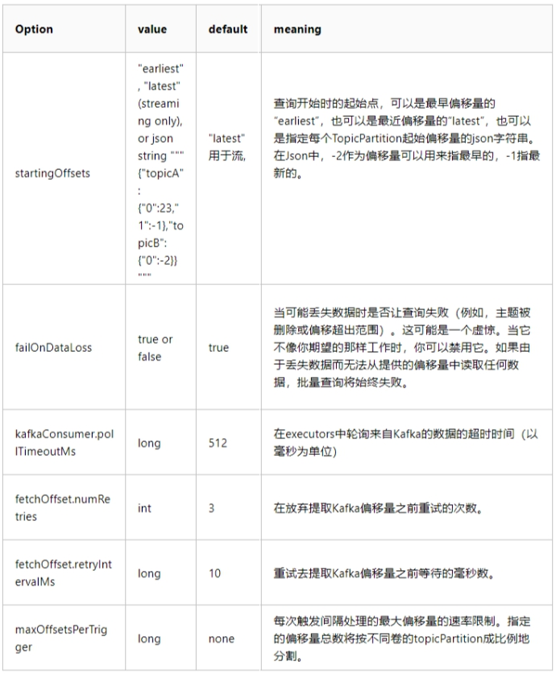
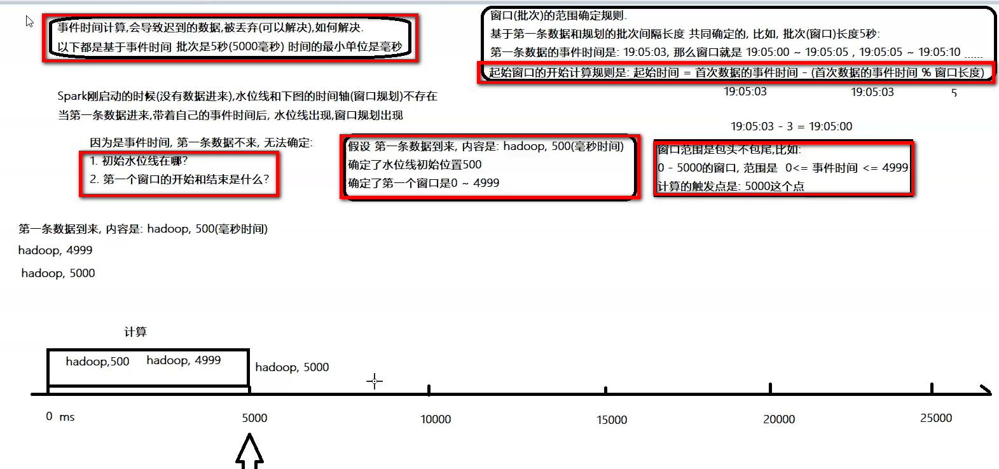

[TOC]


# 1- Structured Streaming概述

官网文档：http://spark.apache.org/docs/2.4.5/structured-streaming-programming-guide.html

<a href="http://spark.apache.org/docs/2.4.5/structured-streaming-programming-guide.html" target="_blank">官网文档</a>

## 1-1 Spark Streaming 不足

​		Spark Streaming **会接收实时数据源的数据，并切分成很多小的batches，然后被Spark Engine执行，产出同样由很多小的batchs组成的结果流。**


​		本质上，这是一种micro-batch（微批处理）的方式处理，用批的思想去处理流数据。这种设计让Spark Streaming面对复杂的流式处理场景时捉襟见肘。


- **Spark Streaming 存在哪些不足，总结一下主要有下面几点**：

  - **使用 Processing Time 而不是 Event Time(很重要,真实场景都会用这个）**

  ``` html
  	Processing Time 是数据到达 Spark 被处理的时间，而 Event Time 是数据自带的属性，一般表示数据产生于数据源的时间。
  	比如 IoT 中，传感器在 12:00:00 产生一条数据，然后在 12:00:05 数据传送到 Spark，那么 Event Time 就是 12:00:00，而 Processing Time 就是 12:00:05。
  	Spark Streaming是基于DStream模型的micro-batch模式，简单来说就是将一个微小时间段（比如说 1s）的流数据当前批数据来处理。如果要统计某个时间段的一些数据统计，毫无疑问应该使用 Event Time，但是因为 Spark Streaming 的数据切割是基于Processing Time，这样就导致使用 Event Time 特别的困难。
  ```

  - **Complex, low-level api**

  ``` html
  	DStream（Spark Streaming 的数据模型）提供的API类似RDD的API，非常的low level；
  	当编写Spark Streaming程序的时候，本质上就是要去构造RDD的DAG执行图，然后通过Spark Engine运行。这样导致一个问题是，DAG 可能会因为开发者的水平参差不齐而导致执行效率上的天壤之别；
  ```

  

  - **reason about end-to-end application**

  ``` html
  	end-to-end指的是直接input到out，如Kafka接入Spark Streaming然后再导出到HDFS中；
  	DStream 只能保证自己的一致性语义是 exactly-once 的，而 input 接入 Spark Streaming 和 Spark Straming 输出到外部存储的语义往往需要用户自己来保证；
  	Kafka的Ack 三个级别就是一致性语义的三个级别
  	- 最高性能(0): 什么也不管, 写就是了,性能最好 安全性最差( 最多一次 的语义)
  	- 中等性能中等安全(1): 写入一个副本表示成功,剩下的慢慢同步( 最终一致性 (最少一次) 语义)
  	- 最高安全, 最低性能(-1): 写入全部副本表示写入成功( 精确一致性语义)
  ```

  

  - **批流代码不统一**

  ``` html
  	尽管批流本是两套系统，但是这两套系统统一起来确实很有必要，有时候确实需要将的流处理逻辑运行到批数据上面；
  	Streaming尽管是对RDD的封装，但是要将DStream代码完全转换成RDD还是有一点工作量的，更何况现在Spark的批处理都用DataSet/DataFrameAPI；
  ```

  

- **总结**


## 1-2 Structured Streaming 介绍


### 1-2-1 模块介绍

​		Structured Streaming 在 Spark 2.0 版本于 **2016 年引入**，设计思想参考很多其他系统的思想，比如区分 processing time 和 event time，使用 relational 

执行引擎提高性能等。同时也考虑了和 Spark 其他组件更好的集成。

 

Structured Streaming 和其他系统的显著区别主要如下：

- **Incremental query model（增量查询模型）**
  - Structured Streaming 将会在新增的流式数据上不断执行增量查询，同时代码的写法和批处理 API（基于Dataframe和Dataset API）完全一样，而且这些API非常的简单。

- **Support for end-to-end application（支持端到端应用）**
  - Structured Streaming 和内置的 connector 使的 end-to-end 程序写起来非常的简单，而且 "correct by default"。数据源和sink满足 "exactly-once" 语义，这样我们就可以在此基础上更好地和外部系统集成。

- **复用 Spark SQL 执行引擎**
  - Spark SQL 执行引擎做了非常多的优化工作，比如执行计划优化、codegen、内存管理等。这也是Structured Streaming取得高性能和高吞吐的一个原因。


### 1-2-2 核心设计

**- Source   			输入源**

**- Transform  	 数据处理**

**- Sink    			   数据输出**


2016年，Spark在2.0版本中推出了**结构化流处理的模块Structured Streaming**，核心设计如下：

#### 1-2-2-1 Input and Output（输入和输出）

- Structured Streaming 内置了很多 connector 来保证 input 数据源和 output sink 保证 exactly-once 语义。

- 实现 exactly-once 语义的前提：
  - Input 数据源必须是可以replay的，比如Kafka，这样节点crash的时候就可以重新读取input数据，常见的数据源包括 Amazon Kinesis, Apache Kafka 和文件系统。
  - Output sink 必须要支持写入是**幂等**的，这个很好理解，如果 output 不支持幂等写入，那么一致性语义就是 at-least-once 了。另外对于某些 sink, Structured Streaming 还提供了原子写入来保证 exactly-once 语义。
  - 补充：**幂等性**：在HTTP/1.1中对幂等性的定义：**一次和多次请求某一个资源对于资源本身应该具有同样的结果**（网络超时等问题除外）。也就是说，其任意多次执行对资源本身所产生的影响均与一次执行的影响相同。**幂等性**是系统服务对外一种承诺（而不是实现），承诺只要调用接口成功，外部多次调用对系统的影响是一致的。声明为幂等的服务会认为外部调用失败是常态，并且失败之后必然会有重试。

#### 1-2-2-2 Program API（编程 API）

- Structured Streaming 代码编写完全复用 Spark SQL 的 batch API，也就是对一个或者多个 stream 或者 table 进行 query。

 

- query 的结果是 result table，可以以多种不同的模式（追加：append, 更新：update, 完全：complete）输出到外部存储中。

- 另外，Structured Streaming 还提供了一些 Streaming 处理特有的 API：Trigger, watermark, stateful operator。

#### 1-2-2-3 Execution Engine（执行引擎）

- 复用 **Spark SQL 的执行引擎**；

- Structured Streaming 默认使用类似 Spark Streaming 的 **micro-batch** 模式，有很多好处，比如动态负载均衡、再扩展、错误恢复以及 straggler （straggler 指的是哪些执行明显慢于其他 task 的 task）重试；

- 提供了基于传统的 long-running operator 的 **continuous（持续） 处理模式**；

- <span style="color:red;background:white;font-size:20px;font-family:楷体;">**提供了自动的微批间隔**</span>(不需要设置,spark会尽快完成批次提交计算)

#### 1-2-2-4 Operational Features（操作特性）

- 利用<span style="color:red;background:white;font-size:20px;font-family:楷体;">**wal（HLog 预写日志）和状态State存储**</span>，开发者可以做到集中形式的 rollback 和错误恢复FailOver。


### 1-2-3 编程模型 - 重点

#### 1-2-3-1 数据结构

​		Structured Streaming**将流式数据当成一个不断增长的table**，然后使用和批处理同一套API，都是基于DataSet/DataFrame的。如下图所示，通过将流式数据理解成一张不断增长的表，从而就可以像操作批的静态数据一样来操作流数据了。

 

在这个模型中，主要存在下面几个组成部分：


- 1：**Input Table（Unbounded Table）**，流式数据的抽象表示，没有限制边界的，表的数据源源不断增加；
- 2：Query（查询），对 Input Table 的增量式查询，只要Input Table中有数据，立即（默认情况）执行查询分析操作，然后进行输出（类似SparkStreaming中微批处理）；
- 3：Result Table，Query 产生的结果表；
- 4：Output，Result Table 的输出，依据设置的输出模式OutputMode输出结果；

 


#### 1-2-3-2 核心思想

​		**Structured Streaming最核心的思想就是将实时到达的数据看作是一个不断追加的unbound table无界表**，到达流的每个数据项就像是表中的一个新行被附加到无边界的表中，**用静态结构化数据的批处理查询方式进行流计算。**

 


以词频统计WordCount案例，Structured Streaming实时处理数据的示意图如下，各行含义：

- 第一行、表示从TCP Socket不断接收数据，使用【**nc -lk 9999**】；

- 第二行、表示时间轴，每隔1秒进行一次数据处理；

- 第三行、可以看成是“input unbound table"，当有新数据到达时追加到表中；

- 第四行、最终的wordCounts是结果表，新数据到达后触发查询Query，输出的结果；

- 第五行、当有新的数据到达时，Spark会执行“增量"查询，并更新结果集；该示例设置为Complete Mode，因此每次都将所有数据输出到控制台；

 

上图中数据实时处理说明：

- 第一、在第1秒时，此时到达的数据为"cat dog"和"dog dog"，因此可以得到第1秒时的结果集cat=1 dog=3，并输出到控制台；

- 第二、当第2秒时，到达的数据为"owl cat"，此时"unbound table"增加了一行数据"owl cat"，执行word count查询并更新结果集，可得第2秒时的结果集为cat=2 dog=3 owl=1，并输出到控制台；

- 第三、当第3秒时，到达的数据为"dog"和"owl"，此时"unbound table"增加两行数据"dog"和"owl"，执行word count查询并更新结果集，可得第3秒时的结果集为cat=2 dog=4 owl=2；

 

​		<span style="color:red;background:white;font-size:20px;font-family:楷体;">**使用Structured Streaming处理实时数据时，会负责将新到达的数据与历史数据进行整合，并完成正确的计算操作，同时更新Result Table。**</span>


## 1-3 总结

- spark streaming 不足
  - 1- 使用的是process Time
  - 2- low elvel(代码复杂) DStream数据模型
  - 3- 最终一致性需要开发者自己去保证
  - 4- 流、批代码不统一
- structured streaming 优点
  - 1- 支持event time
  - 2- 毫秒级的延迟
  - 3- 不断增长的动态表格（unbounded table)
  - 4- DataFram数据模型（spark SQL）
  - 5- 流、批代码80%相似度
  - 6- 增量查询模型
  - 7- 最终一致性（connector） 输入-> 处理-> 输出

# 2- Sources 输入源

​		从Spark 2.0至Spark 2.4版本，目前支持数据源有4种，其中**Kafka 数据源**使用作为广泛，其他数据源主要用于开发测试程序。

<a href="[http://spark.apache.org/docs/2.4.5/structured-streaming-programming-guide.html#input-sources](#input-sources)" target="_blank">官方文档：</a>


- 注意： 
  - 1- File Source 和 kafka Source 可用于生产；
  - 2- <span style="color:red;background:white;font-size:20px;font-family:楷体;">**socketSource 不支持容错（不确保最终一致性，不能状态恢复）；**</span>
  - 3- Rate Source 只用于代码调试；


​		可以认为**Structured Streaming = SparkStreaming + SparkSQL**，对流式数据处理使用SparkSQL数据结构，**应用入口为SparkSession**，对比SparkSQL与SparkStreaming编程：


- Spark Streaming：将流式数据按照时间间隔（BatchInterval）划分为很多Batch，每批次数据封装在RDD中，底层RDD数据，构建StreamingContext实时消费数据；


- Structured Streaming属于SparkSQL模块中一部分，对流式数据处理，构建SparkSession对象，指定读取Stream数据 和 保存Streamn数据 ，具体语法格式：

  - 静态数据
    - 读取spark.read
    - 保存ds/df.write
  - 流式数据
    - 读取spark.readStream
    - 保存ds/df.writeStrem

  

## 2-1 Socket数据源-入门案例

### 2-1-1 需求

[http://spark.apache.org/docs/2.4.5/structured-streaming-programming-guide.html#quick-example](#quick-example)

实时从TCP Socket读取数据（采用nc）实时进行词频统计WordCount，并将结果输出到控制台Console。

 

- Socket 数据源

   	从Socket中读取UTF8文本数据。一般用于测试，使用nc -lk 端口号向Socket监听的端口发送数据，用于测试使用，有两个参数必须指定：

1.host

2.port

 

 

- Console 接收器

  ​	将结果数据打印到控制台或者标准输出，通常用于测试或Bedug使用，三种输出模式OutputMode（**Append、Update、Complete**）都支持，

  

- 两个参数可设置：

  - 1.numRows，<span style="color:red;background:white;font-size:20px;font-family:楷体;">**打印多少条数据，默认为20条；**</span>

  - 2.truncate，<span style="color:red;background:white;font-size:20px;font-family:楷体;">**如果某列值字符串太长是否截取，默认为true，截取字符串；**</span>

    

 

 

### 2-1-2 编程实现

``` scala
package cn.itcast.structedstreaming

import org.apache.commons.lang3.StringUtils
import org.apache.spark.SparkContext
import org.apache.spark.sql.streaming.{OutputMode, StreamingQuery}
import org.apache.spark.sql.{DataFrame, SparkSession}

/**
 * 使用Structured Streaming从TCP Socket实时读取数据，进行词频统计，将结果打印到控制台。
 */
object StructuredWordCount {
  def main(args: Array[String]): Unit = {
      //TODO: 0. 环境
    val spark: SparkSession = SparkSession.builder()
      .appName(this.getClass.getSimpleName.stripSuffix("$"))
      .master("local[*]")
      .config("spark.sql.shuffle.partitions", "2") // 设置Shuffle分区数目
      .getOrCreate()
      
    val sc: SparkContext = spark.sparkContext
    sc.setLogLevel("WARN")
      
    import spark.implicits._
    import org.apache.spark.sql.functions._

    // TODO: 1. 从TCP Socket 读取数据
    val inputStreamDF: DataFrame = spark.readStream
      .format("socket")
      .option("host", "node1")
      .option("port", 9999)
      .load()
    //注意:返回的df不是普通的分布式表,而是实时流数据对应的分布式的无界表!
    //df.show()//注意:该写法是离线的写法,会报错,所以应使用实时的写法:Queries with streaming sources must be executed with writeStream.start();
    
    inputStreamDF.printSchema()

    // TODO: 2. 业务分析：词频统计WordCount
    val resultStreamDF: DataFrame = inputStreamDF
      .as[String]
      .filter(StringUtils.isNotBlank(_))
      .flatMap(_.trim.split("\\s+"))
      .groupBy($"value")
      .count()
    //.orderBy($"count".desc)
      
    resultStreamDF.printSchema()

    // TODO: 3. 设置Streaming应用输出及启动
    val query: StreamingQuery = resultStreamDF.writeStream
      //- append:默认的追加模式,将新的数据输出!只支持简单查询,如果涉及的聚合就不支持了
      //- complete:完整模式,将完整的数据输出,支持聚合和排序
      //- update:更新模式,将有变化的数据输出,支持聚合但不支持排序,如果没有聚合就和append一样
      //.outputMode(OutputMode.Append())
      //.outputMode(OutputMode.Complete())
      .outputMode(OutputMode.Update())
      .format("console")
      .option("numRows", "10")
      .option("truncate", "false")
      // 流式应用，需要启动start
      .start()
    // 流式查询等待流式应用终止
    query.awaitTermination()
    // 等待所有任务运行完成才停止运行
    query.stop()
  }
}
```


## 2-2 文件数据源


将目录中写入的文件作为数据流读取，支持的文件格式为：**text、csv、json、orc、parquet**


### 2-2-1 需求

监听某一个目录，读取csv格式数据，统计年龄小于25岁的人群的爱好排行榜。

- 测试数据

``` properties
jack1;23;running
jack2;23;running
jack3;23;running
bob1;20;swimming
bob2;20;swimming
tom1;28;football
tom2;28;football
tom3;28;football
tom4;28;football
```


### 2-2-2 代码实现

``` scala
package cn.itcast.structedstreaming

import org.apache.spark.SparkContext
import org.apache.spark.sql.streaming.{OutputMode, StreamingQuery}
import org.apache.spark.sql.types.{IntegerType, StringType, StructType}
import org.apache.spark.sql.{DataFrame, Dataset, Row, SparkSession}

/**
 * 使用Structured Streaming从目录中读取文件数据：统计年龄小于25岁的人群的爱好排行榜
 */
object StructuredFileSource {
  def main(args: Array[String]): Unit = {
    val spark: SparkSession = SparkSession.builder()
      .appName(this.getClass.getSimpleName.stripSuffix("$"))
      .master("local[*]")
      .config("spark.sql.shuffle.partitions", "2")
      .getOrCreate()
    val sc: SparkContext = spark.sparkContext
    sc.setLogLevel("WARN")
    import spark.implicits._
    import org.apache.spark.sql.functions._

    // TODO: 从文件系统，监控目录，读取CSV格式数据
    // 数据格式:
    // jack;23;running
    val csvSchema: StructType = new StructType()
      .add("name", StringType, nullable = true)
      .add("age", IntegerType, nullable = true)
      .add("hobby", StringType, nullable = true)

    val inputStreamDF: DataFrame = spark.readStream
      .option("sep", ";")
      .option("header", "false")
      // 指定schema信息
      .schema(csvSchema)
      .csv("data/input/persons")

    // 依据业务需求，分析数据：统计年龄小于25岁的人群的爱好排行榜
    val resultStreamDF: Dataset[Row] = inputStreamDF
      .filter($"age" < 25)
      .groupBy($"hobby")
      .count()
      .orderBy($"count".desc)

    // 设置Streaming应用输出及启动
    val query: StreamingQuery = resultStreamDF.writeStream
      //- append:默认的追加模式,将新的数据输出!只支持简单查询,如果涉及的聚合就不支持了
      //- complete:完整模式,将完整的数据输出,支持聚合和排序
      //- update:更新模式,将有变化的数据输出,支持聚合但不支持排序,如果没有聚合就和append一样
      .outputMode(OutputMode.Complete())
      .format("console")
      .option("numRows", "10")
      .option("truncate", "false")
      .start()
    query.awaitTermination()
    query.stop()
  }
}
```


### 2-3 Rate source

**以每秒指定的行数生成数据，每个输出行包含2个字段** : <span style="color:red;background:white;font-size:20px;font-family:楷体;">**timestamp和value。**</span>


其中timestamp是一个Timestamp含有信息分配的时间类型，并且value是Long（包含消息的计数从0开始作为第一行）类型。此源用于测试和基准测试，可选参数如下：

 


- 演示范例代码如下：

``` scala
package cn.itcast.structedstreaming

import org.apache.spark.SparkContext
import org.apache.spark.sql.streaming.{OutputMode, StreamingQuery, Trigger}
import org.apache.spark.sql.{DataFrame, SparkSession}

/**
 * 数据源：Rate Source，以每秒指定的行数生成数据，每个输出行包含一个timestamp和value。
 */
object StructuredRateSource {
  def main(args: Array[String]): Unit = {
    val spark: SparkSession = SparkSession.builder()
      .appName(this.getClass.getSimpleName.stripSuffix("$"))
      .master("local[*]")
      .config("spark.sql.shuffle.partitions", "2")
      .getOrCreate()
    val sc: SparkContext = spark.sparkContext
    sc.setLogLevel("WARN")
    import spark.implicits._
    import org.apache.spark.sql.functions._

    // TODO：从Rate数据源实时消费数据
    val rateStreamDF: DataFrame = spark.readStream
      .format("rate")
      .option("rowsPerSecond", "10") // 每秒生成数据条数
      .option("rampUpTime", "0s") // 每条数据生成间隔时间
      .option("numPartitions", "2") // 分区数目
      .load()
    rateStreamDF.printSchema()
    //root
    // |-- timestamp: timestamp (nullable = true)
    // |-- value: long (nullable = true)

    // 3. 设置Streaming应用输出及启动
    val query: StreamingQuery = rateStreamDF.writeStream
      //- append:默认的追加模式,将新的数据输出!只支持简单查询,如果涉及的聚合就不支持了
      //- complete:完整模式,将完整的数据输出,支持聚合和排序
      //- update:更新模式,将有变化的数据输出,支持聚合但不支持排序,如果没有聚合就和append一样
      .outputMode(OutputMode.Append())
      .format("console")
      .option("numRows", "10")
      .option("truncate", "false")
      .start()
    query.awaitTermination()
    query.stop()
  }
}
```


# 3- Operations 操作

获得到Source之后的基本数据处理方式和之前学习的DataFrame、DataSet一致，不再赘述

 

●官网示例代码：

``` scala
case class DeviceData(device: String, deviceType: String, signal: Double, time: DateTime)
val df: DataFrame = ... // streaming DataFrame with IOT device data with schema { device: string, deviceType: string, signal: double, time: string }

val ds: Dataset[DeviceData] = df.as[DeviceData]    // streaming Dataset with IOT device data

// Select the devices which have signal more than 10
df.select("device").where("signal > 10")      // using untyped APIs   

ds.filter(_.signal > 10).map(_.device)         // using typed APIs

// Running count of the number of updates for each device type
df.groupBy("deviceType").count()                 // using untyped API

// Running average signal for each device type
import org.apache.spark.sql.expressions.scalalang.typed
ds.groupByKey(_.deviceType).agg(typed.avg(_.signal))    // using typed API
```


- 单词统计案例

``` scala
package com.fiberhom.structured_streaming

import org.apache.spark.sql.{DataFrame, SparkSession}

object Demo04_Operator {
    def main(args: Array[String]): Unit = {
        val spark = SparkSession
                .builder()
                .master("local[*]")
                // 设置在shuffle阶段，默认的分区数量（如果不设置默认为200）
                .config("spark.sql.shuffle.partitions",2)
                .appName(this.getClass.getSimpleName)
                .getOrCreate()

        val sc = spark.sparkContext
        sc.setLogLevel("WARN")

        import spark.implicits._
        import org.apache.spark.sql.functions._

        val socketDF: DataFrame = spark.readStream
                .format("socket")
                .option("host", "node1")
                .option("port", 9999)
                .load()

        val wordDf = socketDF
                .flatMap(row => {
                    row.getString(0).split("\\s+")
                })
                .toDF("word")


        // SQL 风格
        wordDf.createOrReplaceTempView("t_word")

        val sqlResult: DataFrame = spark.sql(
            """
              |select
              | word,
              | count(*) cntSQl
              |from t_word
              |group by word
              |""".stripMargin)

        // DSL风格
        val dslResult = wordDf.groupBy($"word")
                .count()
                .withColumnRenamed("count","cntDSL")

        sqlResult.writeStream
                .format("console")
                .outputMode("complete")
                .option("truncate","false")
                .start()
//                .awaitTermination()


        dslResult.writeStream
                .format("console")
                .outputMode("complete")
                .option("truncate","false")
                .start()
//                .awaitTermination()

        spark.streams.awaitAnyTermination()
        sc.stop()
    }
}

```


# 4- Sink 输出

​		在StructuredStreaming中定义好Result DataFrame/Dataset后，调用***\*writeStream\****()返回DataStreamWriter对象，设置查询Query输出相关属性，启动流式应用运行，相关属性如下：

 

文档：[http://spark.apache.org/docs/2.4.5/structured-streaming-programming-guide.html#starting-streaming-queries](#starting-streaming-queries)

 

- 官网代码

  - **File sink** - Stores the output to a directory.

  ``` scala
  writeStream
      .format("parquet")        // can be "orc", "json", "csv", etc.
      .option("path", "path/to/destination/dir")
      .start()
  ```

  

  - **Kafka sink** - Stores the output to one or more topics in Kafka.

  ```scala
  writeStream
      .format("kafka")
      .option("kafka.bootstrap.servers", "host1:port1,host2:port2")
      .option("topic", "updates")
      .start()
  ```

  

  - **Foreach sink** - Runs arbitrary computation on the records in the output. See later in the section for more details.

  ```scala
  writeStream
      .foreach(...)
      .start()
  ```

  

  - **Console sink (for debugging)** - Prints the output to the console/stdout every time there is a trigger. Both, Append and Complete output modes, are supported. This should be used for debugging purposes on low data volumes as the entire output is collected and stored in the driver’s memory after every trigger.

  ```scala
  writeStream
      .format("console")
      .start()
  ```

  

  - **Memory sink (for debugging)** - The output is stored in memory as an in-memory table. Both, Append and Complete output modes, are supported. This should be used for debugging purposes on low data volumes as the entire output is collected and stored in the driver’s memory. Hence, use it with caution.

  ```scala
  writeStream
      .format("memory")
      .queryName("tableName")
      .start()
  ```


## 4-1 输出模式OutputModel

"Output"是用来定义写入外部存储器的内容，输出可以被定义为不同模式：

- 追加模式（Append mode），默认模式，其中只有自从上一次触发以来，添加到 Result Table 的新行将会是outputted to the sink。只有添加到Result Table的行将永远不会改变那些查询才支持这一点。这种模式保证每行只能输出一次（假设 fault-tolerant sink ）。例如，只有select, where, map, flatMap, filter, join等查询支持 Append mode 。只输出那些将来永远不可能再更新的数据，然后数据从内存移除 。没有聚合的时候，append和update一致；有聚合的时候，一定要有水印，才能使用。

- 完全模式（Complete mode），每次触发后，整个Result Table将被输出到sink，aggregation queries（聚合查询）支持。全部输出，必须有聚合。

- 更新模式（Update mode），只有 Result Table rows 自上次触发后更新将被输出到 sink。与Complete模式不同，因为该模式只输出自上次触发器以来已经改变的行。如果查询不包含聚合，那么等同于Append模式。只输出更新数据(更新和新增)。


注意，不同查询Query，支持对应的输出模式，如下表所示：

 

-  总结：

| 模式     | 输出内容             | 特点                       |
| -------- | -------------------- | -------------------------- |
| Append   | 只输出新增的数据     | **不支持有聚合函数的数据** |
| Complete | 输出所有的数据       | **只支持有聚合函数的数据** |
| Update   | 输出更新和新增的数据 | **不支持排序的数据**       |


## 4-2 触发时间

触发器Trigger决定了多久执行一次查询并输出结果

当不设置时，默认只要有新数据，spark就尽可能快执行查询Query，再进行输出。

目前来说，支持三种触发间隔设置：

 

​		<span style="color:red;background:white;font-size:20px;font-family:楷体;">**其中Trigger.Processing表示每隔多少时间触发执行一次，此时流式处理依然属于微批处理；**</span>从Spark 2.3以后，支持Continue Processing流式处理，设置触发间隔为Trigger.Continuous但不成熟,使用默认的尽可能快的执行即可。

- 官网代码

``` scala
import org.apache.spark.sql.streaming.Trigger
// Default trigger (runs micro-batch as soon as it can)
df.writeStream
  .format("console")
  .start()


// ProcessingTime trigger with two-seconds micro-batch interval
df.writeStream
  .format("console")
  .trigger(Trigger.ProcessingTime("2 seconds"))
  .start()


// One-time trigger
df.writeStream
  .format("console")
  .trigger(Trigger.Once())
  .start()


// Continuous trigger with one-second checkpointing interval
df.writeStream
  .format("console")
  .trigger(Trigger.Continuous("1 second"))
  .start()
```


## 4-3 查询名称(子查询)

查询本质上就是一个批次的计算

一个批次的计算,叫做查询

 可以给每个查询Query设置名称Name，必须是唯一的，直接调用DataFrameWriter中queryName方法即可，实际生产开发建议设置名称，API说明如下：

 


- 理解
  - <span style="color:red;background:white;font-size:20px;font-family:楷体;">**查询名称 就是 二次查询（子查询）**</span>；
  - <span style="color:red;background:white;font-size:20px;font-family:楷体;">**设置的查询名称就是二次查询的表名**</span>设置的查询名称就是二次查询的表名；
  - <span style="color:red;background:white;font-size:20px;font-family:楷体;">**设置查询名称的时候OuputMode 必须是memory**</span>；
  - <span style="color:red;background:white;font-size:20px;font-family:楷体;">**二次查询输入批处理（不是流处理）**</span>;


- 代码演示

``` scala
package com.fiberhom.structured_streaming

import org.apache.commons.lang.StringUtils
import org.apache.spark.sql.streaming.OutputMode
import org.apache.spark.sql.{DataFrame, SparkSession}

object Demo06_QueryName {
    def main(args: Array[String]): Unit = {
        val spark = SparkSession
                .builder()
                .appName(this.getClass.getSimpleName)
                .master("local[*]")
                .config("spark.sql.shuffle.partitions", "2")
                .getOrCreate()
        val sc = spark.sparkContext
        sc.setLogLevel("WARN")

        import  spark.implicits._
        import  org.apache.spark.sql.functions._
        val socketDF = spark.readStream
                .format("socket")
                .option("host", "node1")
                .option("port", 9999)
                .load()
        val wordDF = socketDF.as[String]
                .filter(StringUtils.isNotBlank(_))
                .flatMap(_.trim.split("\\s+"))
                .toDF("word")

        wordDF.createOrReplaceTempView("t_word")
        val resultDF: DataFrame = spark.sql(
            """
              |select word,count(*) as cnt
              |from t_word
              |group by word
              |order by cnt desc
              |
              |""".stripMargin)

        val query = resultDF.writeStream
                .format("memory")
                .outputMode(OutputMode.Complete())
                // 查询名称  (可以理解成是一个子查询，第一次查询的结果临时表名为testQuery)
                .queryName("testQuery")
                .start()

        while (true){
            // 这里就是有界数据的查询了。
            Thread.sleep(1000L)
            spark.sql("select * from testQuery").show()

        }

        spark.streams.awaitAnyTermination()
        sc.stop()
    }
}

```


## 4-4 检查点位置（状态恢复）

​		在Structured Streaming中使用<span style="color:red;background:white;font-size:20px;font-family:楷体;">**Checkpoint 检查点进行故障恢复**</span>。如果实时应用发生故障或关机，可以恢复之前的查询的进度和状态，并从停止的地方继续执行，**使用Checkpoint和预写日志WAL完成**。使用检查点位置配置查询，那么查询将所有进度信息（即每个触发器中处理的偏移范围）和运行聚合（例如词频统计wordcount）保存到检查点位置。此检查点位置必须是HDFS兼容文件系统中的路径，

两种方式设置Checkpoint Location位置：

- **1. DataStreamWrite设置**

streamDF.writeStream.option("checkpointLocation", "path")

- **2. SparkConf设置**

sparkConf.set("spark.sql.streaming.checkpointLocation", "path")

 

修改上述词频统计案例程序，设置**输出模式、查询名称、触发间隔及检查点位置**.

- 演示代码如下：

``` scala
package com.fiberhom.structured_streaming

import org.apache.commons.lang.StringUtils
import org.apache.spark.sql.SparkSession
import org.apache.spark.sql.streaming.OutputMode

object Demo07_CheckPointSet {
    def main(args: Array[String]): Unit = {
        val spark = SparkSession
                .builder()
                .master("local[*]")
                .appName(this.getClass.getSimpleName)
                .config("spark.sql.shuffle.partitions", 1)
                .getOrCreate()
        val sc = spark.sparkContext
        sc.setLogLevel("WARN")

        import spark.implicits._
        import org.apache.spark.sql.functions._
/*
        // 注意： 由于socket数据源不支持容错， 所以不能状态恢复。
        val socketDF = spark.readStream
                .format("socket")
                .option("host", "node1")
                .option("port", 9999)
                .load()


        val wordDF = socketDF.as[String]
                .filter(StringUtils.isNotBlank(_))
                .flatMap(_.trim.split("\\s+"))
                .toDF("word")
        wordDF.createOrReplaceTempView("t_word")
        val resultDF = spark.sql(
            """
              |select
              | word,count(*) as cnt
              |from t_word
              |group by word
              |order by cnt desc
              |""".stripMargin)

        resultDF.writeStream
                .format("console")
                .outputMode(OutputMode.Complete())
                .option("checkpointLocation","data/ck1")
                .start()

        spark.streams.awaitAnyTermination()
        */


        val df = spark.readStream
                .format("csv")
                .option("sep", ";")
                .schema("name String,age Int,hobby String")
                .load("data/input/persons")

        df.createOrReplaceTempView("csv_table")
        val resultDF = spark.sql(
            """
              |select hobby , count(*) as cnt
              |from csv_table
              |group by hobby
              |""".stripMargin)

        resultDF.writeStream
                .format("console")
                .outputMode(OutputMode.Complete())
        		// 设置检查点位置
                .option("checkpointLocation","data/ck1")
                .start()

        spark.streams.awaitAnyTermination()
        sc.stop()
    }
}

```


## 4-5输出终端（位置）

### 4-5-1文件接收器

将输出存储到目录文件中，支持文件格式：parquet、orc、json、csv等，示例如下：

 

相关注意事项如下：

- 支持OutputMode为：**Append追加模式；**

- 必须指定输出目录参数【path】，必选参数，其中格式有parquet、orc、json、csv等等；

- 容灾恢复支持精确一次性语义exactly-once；

- 此外**支持写入分区表**，实际项目中常常按时间划分；


- 代码演示

``` scala
package com.fiberhom.structured_streaming

import org.apache.commons.lang.StringUtils
import org.apache.spark.sql.SparkSession
import org.apache.spark.sql.streaming.OutputMode

object Demo08_FileSInk {
    def main(args: Array[String]): Unit = {
        val spark = SparkSession
                .builder()
                .master("local[*]")
                .appName(this.getClass.getSimpleName)
                .config("spark.sql.shuffle.partitions", 1)
                .config("spark.sql.streaming.checkpointLocation","data/ck2")
                .getOrCreate()
        val sc = spark.sparkContext
        sc.setLogLevel("WARN")

        import spark.implicits._
        import org.apache.spark.sql.functions._

        val socketDF = spark.readStream
                .format("socket")
                .option("host", "node1")
                .option("port", 9999)
                .load()

        val wordDF = socketDF.as[String]
                .filter(StringUtils.isNotBlank(_))
                .flatMap(_.trim.split("\\s+"))
                .toDF("word")

        wordDF.writeStream
                .format("csv")
                .outputMode(OutputMode.Append())
                .option("sep",",")
                .option("path","data/output/csv")
                .start()

        spark.streams.awaitAnyTermination()
        sc.stop()
    }
}

```


### 4-5-2 Memory Sink

​		此种接收器作为调试使用，**输出作为内存表存储在内存中**， 支持Append和Complete输出模式。这应该用于低数据量的调试目的，因为整个输出被收集并存储在驱动程序的内存中，因此，请谨慎使用，<span style="color:red;background:white;font-size:20px;font-family:楷体;">**多用于查询名称（二次查询）功能**</span>


示例如下：

 

 

### 4-5-3 Foreach和ForeachBatch Sink

#### 4-5-3-1 Foreach

​		Structured Streaming提供接口foreach和foreachBatch （[**流转批**]()），允许用户在流式查询的输出上应用任意操作和编写逻辑，比如输出到MySQL表、Redis数据库等外部存系统。其中foreach允许每行自定义写入逻辑，foreachBatch允许在每个微批量的输出上进行任意操作和自定义逻辑，建议使用foreachBatch操作。

​		foreach表达自定义编写器逻辑具体来说，需要编写类class继承ForeachWriter，其中包含三个方法来表达数据写入逻辑：打开，处理和关闭。

https://databricks.com/blog/2017/04/04/real-time-end-to-end-integration-with-apache-kafka-in-apache-sparks-structured-streaming.html

``` scala
streamingDatasetOfString.writeStream.foreach(
  new ForeachWriter[String] {

    def open(partitionId: Long, version: Long): Boolean = {
      // Open connection
    }

    def process(record: String): Unit = {
      // Write string to connection
    }

    def close(errorOrNull: Throwable): Unit = {
      // Close the connection
    }
  }
).start()
```


#### 4-5-3-2 ForeachBatch 流转批

​		方法foreachBatch允许指定在流式查询的**每个微批次**的输出数据上执行的函数，需要两个参数：微批次的输出数据DataFrame或Dataset、微批次的唯一ID。

 


使用foreachBatch函数输出时，以下几个注意事项：

- 1.重用现有的批处理数据源，可以在每个微批次的输出上使用**批处理数据**输出Output；


- 2.写入多个位置，如果要将流式查询的输出写入多个位置，则可以简单地多次写入输出 DataFrame/Dataset 。但是，每次写入尝试都会导致重新计算输出数据（包括可能重新读取输入数据）。要避免重新计算，您应该缓存cache输出 DataFrame/Dataset，将其写入多个位置，然后 uncache 。

 


- 3.应用其他DataFrame操作，流式DataFrame中不支持许多DataFrame和Dataset操作，使用foreachBatch可以在每个微批输出上应用其中一些操作，但是，必须自己解释执行该操作的端到端语义。


- 4.默认情况下，foreachBatch仅提供至少一次写保证。 但是，可以使用提供给该函数的batchId作为重复数据删除输出并获得一次性保证的方法。


- 5.foreachBatch不适用于连续处理模式，因为它从根本上依赖于流式查询的微批量执行。 如果以连续模式写入数据，请改用foreach。

#### 4-5-3-3  代码演示

``` scala
package com.fiberhom.structured_streaming

import org.apache.commons.lang.StringUtils
import org.apache.spark.sql.{Dataset, Row, SaveMode, SparkSession}
import org.apache.spark.sql.streaming.OutputMode

import java.util.Properties

object Demo09_ForeachBatchSInk {
    def main(args: Array[String]): Unit = {
        val spark = SparkSession
                .builder()
                .master("local[*]")
                .appName(this.getClass.getSimpleName)
                .config("spark.sql.shuffle.partitions", 1)
                .config("spark.sql.streaming.checkpointLocation","data/ck2")
                .getOrCreate()
        val sc = spark.sparkContext
        sc.setLogLevel("WARN")

        import spark.implicits._
        import org.apache.spark.sql.functions._


        // 注意： socket 不支持容错， 所以不能状态恢复
        val socketDF = spark.readStream
                .format("socket")
                .option("host", "node1")
                .option("port", 9999)
                .load()

        val resultDF = socketDF.as[String]
                .filter(StringUtils.isNotBlank(_))
                .flatMap(_.trim.split("\\s+"))
                .toDF("word")
                .groupBy($"word")
                .count()
                .withColumnRenamed("count", "cnt")
                .orderBy($"cnt".desc)


        // 定义一个函数 提供给foreachBatch 使用
        val batchFunc = (batchDF:Dataset[Row],batchID:Long ) => {

            // 要注意： 进入foreachbatch 后，每一个批次的数据处理都是批处理， 不在是流计算了
            println("----------  ----------")
            println(s"batchID ==  ${batchID}  ")
            println("----------  ----------")

            // 处理批次数据
            batchDF.show()
/*
            val url = """jdbc:mysql://localhost:3306/bigdata?characterEncoding=UTF-8&Unicode=true"""
            //        val url = """jdbc:mysql://localhost:3306/bigdata?characterEncoding=utf8&Unicode=true"""
            //        val url = """jdbc:mysql://localhost:3306/bigdata?useUnicode=yes&characterEncoding=UTF-8&useSSL=false&serverTimezone=UTC"""
            val properties = new Properties()
            properties.setProperty("user","root")
            properties.setProperty("password","123456")
            properties.setProperty("fetchsize","100")
            properties.setProperty("queryTimeout","30")
            // 写入Mysql  方法1:
            batchDF.write
                    .mode(SaveMode.Overwrite)
                    .jdbc(
                url,
                "t_word",
                properties
            )
*/

            batchDF.write
                    .mode(SaveMode.Overwrite)
                    .format("jdbc")
                    .option("url","jdbc:mysql://localhost:3306/bigdata?characterEncoding=UTF-8&Unicode=true")
                    .option("user","root")
                    .option("password","123456")
                    .option("dbtable","t_word2")
                    .save()

        }
        
        
        resultDF.writeStream
                .outputMode(OutputMode.Complete())
//                .option("checkpointLocation","data/ckp/foreachbatch")
        
        		// 使用foreachBatch将单词统计结果输出到MySQL表中
                .foreachBatch(batchFunc)
                .start()

        spark.streams.awaitAnyTermination()

        sc.stop()
    }
}

```


## 4-6 容错语义（最终一致性）

​		针对任何流式应用处理框架（Storm、SparkStreaming、StructuredStreaming和Flink等）处理数据时，都要考虑语义，任意流式系统处理流式数据三个步骤：

- 1）、**Receiving the data：接收数据源端的数据**

采用接收器或其他方式从数据源接收数据（The data is received from sources using Receivers or otherwise）。


- 2）、**Transforming the data：转换数据，进行处理分析**

针对StructuredStreaming来说就是Stream DataFrame（The received data is transformed using DStream and RDD transformations）。


- **3）、Pushing out the data：将结果数据输出**

最终分析结果数据推送到外部存储系统，比如文件系统HDFS、数据库等（The final transformed data is pushed out to external systems like file systems, databases, dashboards, etc）。

​		

- 在处理数据时，往往需要保证数据处理一致性语义：

​		从数据源端接收数据，经过数据处理分析，到最终数据输出仅被处理一次，是最理想最好的状态。在Streaming数据处理分析中，需要考虑数据是否被处理及被处理次数，称为消费语义，


- 三种语义：
  - **At most once：最多一次**，可能出现不消费，数据丢失；
  - **At least once：至少一次**，数据至少消费一次，可能出现多次消费数据；
  - **Exactly once：精确一次**，数据当且仅当消费一次，不多不少。

 

- Structured Streaming的核心设计理念和目标之一：<span style="color:red;background:white;font-size:20px;font-family:楷体;">**支持一次且仅一次Extracly-Once的语义。**</span>

 

​		

​		为了实现这个目标，Structured Streaming设计**source、sink和execution engine来追踪计算处理的进度**，这样就可以在任何一个步骤出现失败时自动重试。


- 1、每个Streaming source都被设计成**支持offset**，进而可以让Spark来追踪读取的位置；

- 2、Spark基于**checkpoint 和 wal**来持久化保存每个trigger interval内处理的offset的范围；

 

- 3、sink被设计成可以支持在**多次计算处理时保持幂等性**，就是说，用同样的一批数据，无论多少次去更新sink，都会保持一致和相同的状态。

  ​	

  ​		<span style="color:red;background:white;font-size:20px;font-family:楷体;">**综合利用基于offset的source，基于checkpoint和wal的execution engine，以及基于幂等性的sink，可以支持完整的一次且仅一次的语义。**</span>

  

# 5- 整合 Kafka

## 5-1 说明


官方文档：http://spark.apache.org/docs/2.4.5/structured-streaming-kafka-integration.html


​		Apache Kafka 是目前最流行的一个分布式的实时流消息系统，给下游订阅消费系统提供了并行处理和可靠容错机制，现在大公司在流式数据的处理场景，Kafka基本是标配。

​		Structured Streaming很好的集成Kafka，可以从Kafka拉取消息，然后就可以把流数据看做一个DataFrame， 一张无限增长的大表，在这个大表上做查询，Structured Streaming保证了端到端的 exactly-once，用户只需要关心业务即可，不用费心去关心底层是怎么做的StructuredStreaming既可以从Kafka读取数据，又可以向Kafka 写入数据

​		添加Maven依赖：

``` xml
<dependency>
    <groupId>org.apache.spark</groupId>
    <artifactId>spark-sql-kafka-0-10_2.11</artifactId>
    <version>${spark.version}</version>
</dependency>
```

- 注意：
  - 目前仅支持Kafka 0.10.+版本及以上，底层使用Kafka New Consumer API拉取数据


- 消费位置

  ​		Kafka把生产者发送的数据放在不同的分区里面，这样就可以并行进行消费了。**每个分区里面的数据都是递增有序的**，跟structured commit log类似，生产者和消费者使用Kafka 进行解耦，消费者不管你生产者发送的速率如何，只要按照一定的节奏进行消费就可以了。**每条消息在一个分区里面都有一个唯一的序列号offset（偏移量）**，Kafka 会对内部存储的消息设置一个过期时间，如果过期了，就会标记删除，不管这条消息有没有被消费。

  

  ​		Kafka 可以被看成一个无限的流，里面的流数据是短暂存在的，如果不消费，消息就过期滚动没了。如果开始消费，就要定一下从什么位置开始。

 

- 1.**earliest**：从最起始位置开始消费，当然不一定是从0开始，因为如果数据过期就清掉了，所以可以理解为从现存的数据里最小位置开始消费；

- 2.**latest**：从最末位置开始消费；

- 3.**per-partition assignment**：对每个分区都指定一个offset，然后从offset位置开始消费；


​		当第一次开始消费一个Kafka 流的时候，上述策略任选其一，如果之前已经消费了，而且做了 checkpoint ，这时候就会从上次结束的位置开始继续消费。目前StructuredStreaming和Flink框架从Kafka消费数据时，都支持上述的策略。


## 5-2 Kafka特定配置

​		从Kafka消费数据时，相关配置属性可以通过带有kafka.prefix的DataStreamReader.option进行设置，例如前面设置Kafka Brokers地址属性：stream.option("kafka.bootstrap.servers", "host:port")，更多关于Kafka 生产者Producer Config配置属和消费者Consumer Config配置属性，参考文档：

- 生产者配置（Producer Configs）：

[http://kafka.apache.org/20/documentation.html#producerconfigs](#producerconfigs)

- 消费者配置（New Consumer Configs）：

[http://kafka.apache.org/20/documentation.html#newconsumerconfigs](#newconsumerconfigs)


注意：<span style="color:red;background:white;font-size:20px;font-family:楷体;">**以下Kafka参数属性不可以设置，如果设置的话，Kafka source或者sink可能会抛出错误：**</span>

``` properties
group id 
auto.offset.reset
key.deserializer
value.deserializer
key.serializer
value.serializer
enable.auto.commit
interceptor.classes
```


 

1）、**group.id**：<span style="color:red;background:white;font-size:20px;font-family:楷体;">**Kafka source将会自动为每次查询创建唯一的分组ID；**</span>


2）、**auto.offset.reset**：在将source选项**startingOffsets**设置为指定从哪里开始。结构化流管理内部消费的偏移量，而不是依赖Kafka消费者来完成。这将确保在topic/partitons动态订阅时不会遗漏任何数据。注意，**只有在启动新的流式查询时才会应用startingOffsets，并且恢复操作始终会从查询停止的位置启动**；


3）、**key.deserializer/value.deserializer**：Keys/Values总是被反序列化为ByteArrayDeserializer的字节数组，使用DataFrame操作显式反序列化keys/values；


4）、**key.serializer/value.serializer**：keys/values总是使用ByteArraySerializer或StringSerializer进行序列化，使用DataFrame操作将keysvalues/显示序列化为字符串或字节数组；


5）、**enable.auto.commit**：Kafka source不提交任何offset；


6）、**interceptor.classes**：Kafka source总是以字节数组的形式读取key和value。使用ConsumerInterceptor是不安全的，因为它可能会打断查询；


- 注意：

  - <span style="color:red;background:white;font-size:20px;font-family:楷体;">**kafka的消费者负载均衡机制：一个分区只能给一个组内的一个消费者提供服务**</span>

  ``` properties
  所以 消费者数量 <= topic分区(分片)的数量;
  如果 消费者数量 > topic分区(分片)的数量, 一定会有空闲的消费者
  ```

  

## 5-3 KafkaSoure

​		Structured Streaming消费Kafka数据，采用的是poll方式拉取数据，与Spark Streaming中New Consumer API集成方式一致。

- 从Kafka Topics中读取消息;

- 需要指定数据源（kafka）;

- Kafka集群的连接地址（kafka.bootstrap.servers）;

- 消费的topic（subscribe或subscribePattern）;

-  指定topic 的时候，可以使用正则来指定，也可以指定一个 topic 的集合。

  

官方提供三种方式从Kafka topic中消费数据，主要区别在于每次消费Topic名称指定，

- **1消费一个Topic数据**

 

- 2.**消费多个Topic数据**

 

- 3.**消费通配符匹配Topic数据**

 


注意： <span style="color:red;background:white;font-size:20px;font-family:楷体;">**从Kafka 获取数据后Schema字段信息如下，既包含数据信息有包含元数据信息：**</span>

 


​		在实际开发时，往往需要获取每条数据的消息，存储在value字段中，由于是**binary类型**，需要转换为**字符串String类型**；此外了方便数据操作，通常将获取的key和value的DataFrame转换为Dataset强类型，伪代码如下：


 


- 从Kafka数据源读取数据时，可以设置相关参数，**包含必须参数和可选参数**：
  - 必须参数：kafka.bootstrap.servers和subscribe；
  - 可以指定开始消费偏移量assign。

 


- 可选参数：

 

 

## 5-4 KafkaSink

​		往Kafka里面写数据类似读取数据，可以在DataFrame上调用writeStream来写入Kafka，<span style="color:red;background:white;font-size:20px;font-family:楷体;">**设置参数指定value，其中key是可选的，如果不指定就是null。**</span>

- 配置说明

将DataFrame写入Kafka时，Schema信息中所需的字段：

 


需要写入哪个topic，可以像上述所示在操作**DataFrame 的时候在每条record上加一列topic字段**指定，也可以**在DataStreamWriter上指定option配置**。

写入数据至Kafka，需要设置Kafka Brokers地址信息及可选配置：

1.kafka.bootstrap.servers，使用逗号隔开【host:port】字符；

2.**topic**，如果DataFrame中没有topic列，此处指定topic表示写入Kafka Topic。

官方提供示例代码如下：

 

 

## 5-5 案例-实时数据ETL架构

### 5-5-1 准备工作

``` properties
#查看topic信息
/export/server/kafka/bin/kafka-topics.sh --list --zookeeper node1:2181
#删除topic
/export/server/kafka/bin/kafka-topics.sh --delete --zookeeper node1:2181 --topic stationTopic
/export/server/kafka/bin/kafka-topics.sh --delete --zookeeper node1:2181 --topic etlTopic

#创建topic
/export/server/kafka/bin/kafka-topics.sh --create --zookeeper node1:2181 --replication-factor 1 --partitions 3 --topic stationTopic
/export/server/kafka/bin/kafka-topics.sh --create --zookeeper node1:2181 --replication-factor 1 --partitions 3 --topic etlTopic

#模拟生产者
/export/server/kafka/bin/kafka-console-producer.sh --broker-list node1:9092 --topic stationTopic
/export/server/kafka/bin/kafka-console-producer.sh --broker-list node1:9092 --topic etlTopic

#模拟消费者
/export/server/kafka/bin/kafka-console-consumer.sh --bootstrap-server node1:9092 --topic stationTopic --from-beginning
/export/server/kafka/bin/kafka-console-consumer.sh --bootstrap-server node1:9092 --topic etlTopic --from-beginning
```


### 5-5-2 模拟基站日志数据

``` scala
package com.fiberhom.structured_streaming

import org.apache.kafka.clients.producer.{KafkaProducer, ProducerRecord}
import org.apache.kafka.common.serialization.StringSerializer

import java.util.Properties
import scala.util.Random

/**
 * 模拟产生基站日志数据，实时发送Kafka Topic中，数据字段信息：
 * 基站标识符ID, 主叫号码, 被叫号码, 通话状态, 通话时间，通话时长
 */
object MockStationLog {
    def main(args: Array[String]): Unit = {
        // 发送Kafka Topic
        val props = new Properties()
        props.put("bootstrap.servers", "node1:9092")
        props.put("acks", "1")
        props.put("retries", "3")
        props.put("key.serializer", classOf[StringSerializer].getName)
        props.put("value.serializer", classOf[StringSerializer].getName)
        val producer = new KafkaProducer[String, String](props)

        val random = new Random()
        val allStatus = Array(
            "fail", "busy", "barring", "success", "success", "success",
            "success", "success", "success", "success", "success", "success"
        )

        while (true) {
            val callOut: String = "1860000%04d".format(random.nextInt(10000))
            val callIn: String = "1890000%04d".format(random.nextInt(10000))
            val callStatus: String = allStatus(random.nextInt(allStatus.length))
            val callDuration = if ("success".equals(callStatus)) (1 + random.nextInt(10)) * 1000L else 0L

            // 随机产生一条基站日志数据
            val stationLog: StationLog = StationLog(
                "station_" + random.nextInt(10),
                callOut,
                callIn,
                callStatus,
                System.currentTimeMillis(),
                callDuration
            )
            println(stationLog.toString)
            Thread.sleep(100 + random.nextInt(100))

            val record = new ProducerRecord[String, String]("rawTopic", stationLog.toString)
            producer.send(record)
        }

        producer.close() // 关闭连接
    }

    /**
     * 基站通话日志数据
     */
    case class StationLog(
        stationId: String, //基站标识符ID
        callOut: String, //主叫号码
        callIn: String, //被叫号码
        callStatus: String, //通话状态
        callTime: Long, //通话时间
        duration: Long //通话时长
    ) {
        override def toString: String = {
            s"$stationId,$callOut,$callIn,$callStatus,$callTime,$duration"
        }
    }

}

```


### 5-5-3 实时增量ETL

``` scala
package com.fiberhom.structured_streaming

import org.apache.commons.lang3.StringUtils
import org.apache.spark.sql.streaming.OutputMode
import org.apache.spark.sql.{DataFrame, Dataset, SparkSession}

object Demo11_StructuredStreamingWithKafka {
    def main(args: Array[String]): Unit = {


        val spark = SparkSession
                .builder()
                .master("local[*]")
                .appName(this.getClass.getSimpleName)
                .config("spark.sql.shuffle.partitions", 3)
                .getOrCreate()
        val sc = spark.sparkContext
        sc.setLogLevel("WARN")

        import spark.implicits._
        import org.apache.spark.sql.functions._


        val kfk = spark.readStream
                .format("kafka")
                // 必须参数 kafka集群
                .option("kafka.bootstrap.servers", "node1:9092,node2:9092,node3:9093")
                // 必须参数 topic
                .option("subscribe", "rawTopic")
                .load()
                .selectExpr("CAST(value AS String)")
/*

        kfk.printSchema()
        kfk.writeStream
                .outputMode("append")
                .format("console")
                .option("truncate",false)
                .start()
*/

        val resultDF: DataFrame = kfk.selectExpr("CAST(value as String)")
                .as[String]
                .filter(StringUtils.isNotBlank(_))
                .filter(data => {
                    "success".equals(data.trim.split(",")(3))
                })
        		// 在df 中添加topic 列 的方式。 
                .map(_ -> "etlTopic").toDF("value","topic")
/*

        resultDF.writeStream
                .outputMode("append")
                .format("console")
                .option("truncate",false)
                .start()
*/


        resultDF.writeStream
                .format("kafka")
                .option("kafka.bootstrap.servers", "node1:9092,node2:9092,node3:9093")
        		// option的方式指定topic
//                .option("topic","etlTopic")
                .option("checkpointLocation","data/output/kfk/ckp")
                .outputMode(OutputMode.Append())
                .start()

        spark.streams.awaitAnyTermination()

        sc.stop()

    }

}

```


# 6- 物联网设备数据分析


## 6-1 需求、数据准备

- 需求

``` properties
1）、信号强度大于30的设备；
2）、各种设备类型的数量；
3）、各种设备类型的平均信号强度；
```

- 数据

``` properties
{"device":"device_50","deviceType":"bigdata","signal":91.0,"time":1590660338429}
{"device":"device_20","deviceType":"bigdata","signal":17.0,"time":1590660338790}
{"device":"device_32","deviceType":"kafka","signal":93.0,"time":1590660338908}
{"device":"device_82","deviceType":"bigdata","signal":72.0,"time":1590660339380}
{"device":"device_32","deviceType":"kafka","signal":10.0,"time":1590660339972}
{"device":"device_30","deviceType":"kafka","signal":81.0,"time":1590660340442}
{"device":"device_32","deviceType":"kafka","signal":29.0,"time":1590660340787}
{"device":"device_96","deviceType":"bigdata","signal":18.0,"time":1590660343554}
```

### 6-1-1 创建Topic

``` properties
#查看topic信息
/export/server/kafka/bin/kafka-topics.sh --list --zookeeper node1:2181
#删除topic
/export/server/kafka/bin/kafka-topics.sh --delete --zookeeper node1:2181 --topic iotTopic

#创建topic
/export/server/kafka/bin/kafka-topics.sh --create --zookeeper node1:2181 --replication-factor 1 --partitions 3 --topic iotTopic

#模拟生产者
/export/server/kafka/bin/kafka-console-producer.sh --broker-list node1:9092 --topic iotTopic

#模拟消费者
/export/server/kafka/bin/kafka-console-consumer.sh --bootstrap-server node1:9092 --topic iotTopic --from-beginning
```


### 6-1-2 模拟数据

``` scala
package cn.itcast.structedstreaming

import java.util.Properties

import org.apache.kafka.clients.producer.{KafkaProducer, ProducerRecord}
import org.apache.kafka.common.serialization.StringSerializer
import org.json4s.jackson.Json

import scala.util.Random

object MockIotDatas {
  def main(args: Array[String]): Unit = {
      
    // 发送Kafka Topic
    val props = new Properties()
    props.put("bootstrap.servers", "node1:9092")
    props.put("acks", "1")
    props.put("retries", "3")
    props.put("key.serializer", classOf[StringSerializer].getName)
    props.put("value.serializer", classOf[StringSerializer].getName)
      
    val producer = new KafkaProducer[String, String](props)

    val deviceTypes = Array(
      "db", "bigdata", "kafka", "route", "bigdata", "db", "bigdata", "bigdata", "bigdata"
    )

    val random: Random = new Random()
    while (true) {
      val index: Int = random.nextInt(deviceTypes.length)
      val deviceId: String = s"device_${(index + 1) * 10 + random.nextInt(index + 1)}"
      val deviceType: String = deviceTypes(index)
      val deviceSignal: Int = 10 + random.nextInt(90)
        
      // 模拟构造设备数据
      val deviceData = DeviceData(deviceId, deviceType, deviceSignal, System.currentTimeMillis())
        
      // 转换为JSON字符串
      val deviceJson: String = new Json(org.json4s.DefaultFormats).write(deviceData)
      println(deviceJson)
        
      // 睡一觉
      Thread.sleep(100 + random.nextInt(500))

      // 创建 ProducerRecord
      val record = new ProducerRecord[String, String]("iotTopic", deviceJson)
        
	  // 发送消息
      producer.send(record)
    }

    // 关闭连接
    producer.close()
  }

  /**
   * 物联网设备发送状态数据
   */
  case class DeviceData(
      device: String, //设备标识符ID
      deviceType: String, //设备类型，如服务器mysql, redis, kafka或路由器route
      signal: Double, //设备信号
      time: Long //发送数据时间
  )

}
```


## 6-2 SQL风格

``` scala
package com.fiberhom.structured_streaming.review.kafka_iot


import com.alibaba.fastjson.JSON
import com.fiberhom.structured_streaming.review.kafka_iot.MockIotDatas.DeviceData
import org.apache.commons.lang3.StringUtils
import org.apache.spark.sql.streaming.OutputMode
import org.apache.spark.sql.{DataFrame, Dataset, SparkSession}

object IOTStreamingAnalysisSQL {
    def main(args: Array[String]): Unit = {
        val spark = SparkSession
                .builder()
                .master("local[*]")
                .appName(this.getClass.getSimpleName)
                .config("spark.sql.shuffle.partitions", 3)
                .getOrCreate()
        val sc = spark.sparkContext
        sc.setLogLevel("WARN")

        import spark.implicits._
        import org.apache.spark.sql.functions._


        val kfkDF: DataFrame = spark.readStream
                .format("kafka")
                // 必须参数 kafka集群
                .option("kafka.bootstrap.servers", "node1:9092,node2:9092,node3:9093")
                // 必须参数 topic
                .option("subscribe", "iotTopic")
                .load()
                .selectExpr("CAST (value AS String)")

        val deviceDF: Dataset[DeviceData] = kfkDF.as[String]
                .filter(StringUtils.isNotBlank(_))
                .map(data => {
                    // json 转 bean
                    JSON.parseObject(data, classOf[DeviceData])
                })

        deviceDF.createOrReplaceTempView("t_device")
        val resultDF1 = spark.sql(
            """
              |select *
              |from t_device
              |where
              |signal > 30
              |""".stripMargin)

        resultDF1.writeStream
                .format("console")
                .outputMode(OutputMode.Append())
                .option("truncate",false)
                .start()

        val resultDF2 = spark.sql(
            """
              |select
              |deviceType,
              |count(*) as cnt,
              |round(avg(signal),2) as avg_signal
              |from t_device
              |group by deviceType
              |""".stripMargin)

        resultDF2.writeStream
                .format("console")
                .outputMode(OutputMode.Complete())
                .option("truncate",false)
                .start()

        spark.streams.awaitAnyTermination()
        sc.stop()
    }
}

```


## 6-3 DSL风格

``` scala
package com.fiberhom.structured_streaming.review.kafka_iot

import com.alibaba.fastjson.JSON
import com.fiberhom.structured_streaming.review.kafka_iot.MockIotDatas.DeviceData
import org.apache.commons.lang3.StringUtils
import org.apache.spark.sql.streaming.OutputMode
import org.apache.spark.sql.{DataFrame, Dataset, SparkSession}

object IOTStreamingAnalysisDSL {
    def main(args: Array[String]): Unit = {
        val spark = SparkSession
                .builder()
                .master("local[*]")
                .appName(this.getClass.getSimpleName)
                .config("spark.sql.shuffle.partitions", 3)
                .getOrCreate()
        val sc = spark.sparkContext
        sc.setLogLevel("WARN")

        import spark.implicits._
        import org.apache.spark.sql.functions._


        val kfkDF: DataFrame = spark.readStream
                .format("kafka")
                // 必须参数 kafka集群
                .option("kafka.bootstrap.servers", "node1:9092,node2:9092,node3:9093")
                // 必须参数 topic
                .option("subscribe", "iotTopic")
                .load()
                .selectExpr("CAST (value AS String)")

        val deviceDF: Dataset[DeviceData] = kfkDF.as[String]
                .filter(StringUtils.isNotBlank(_))
                .map(data => {
                    JSON.parseObject(data, classOf[DeviceData])
                })


        val resultDF2 = deviceDF.groupBy($"deviceType")
                .agg(
                    count($"deviceType").as("cnt"),
                    round(avg($"signal"), 2).as("avg_signal")
                )

        resultDF2.writeStream
                .format("console")
                .outputMode(OutputMode.Complete())
                .option("truncate",false)
                .start()


        spark.streams.awaitAnyTermination()
        sc.stop()
    }
}

```


# 7- 事件时间窗口分析

​		在SparkStreaming中窗口统计分析：Window Operation（设置窗口大小WindowInterval和滑动大小SlideInterval），按照Streaming 流式应用接收数据的时间进行窗口设计的，其实是不符合实际应用场景的。

​		例如，在物联网数据平台中，每个设备产生的数据，其中包含数据产生的时间，然而数据需要经过一系列采集传输才能被流式计算框架处理：SparkStreaming，此过程需要时间的，再按照处理时间来统计业务的时候，准确性降低，存在不合理性。

​		在结构化流Structured Streaming中窗口数据统计时间是基于数据本身**事件时间EventTime**字段统计，更加合理性，


官方文档：

[http://spark.apache.org/docs/2.4.5/structured-streaming-programming-guide.html#window-operations-on-event-time](#window-operations-on-event-time)


## 7-1 时间概念


在Streaming流式数据处理中，按照时间处理数据，其中时间有三种概念：

- 1）、事件时间EventTime，表示数据本身产生的时间，该<span style="color:red;background:white;font-size:20px;font-family:楷体;">**字段在数据本身**</span>中；

- 2）、注入时间IngestionTime，表示数据到达流式系统时间，简而言之就是流式处理系统接收到数据的时间；

- 3）、处理时间ProcessingTime，表示数据被流式系统真正开始计算操作的时间（上了流水线， 但是还没有开始正在计算）。

 

注入时间和处理时间,都是基于现实世界(服务器系统的)时间来做计算的.

 

注意： 一旦按照**事件时间**来做批次(或者窗口)计算, 那么 <span style="color:red;background:white;font-size:20px;font-family:楷体;">**就所有和时间相关的内容,统统以数据自带的时间为准(和服务器的系统时间 没有任何关系)**</span>


不同流式计算框架支持时间不一样，

- SparkStreaming框架仅仅支持处理时间ProcessTime，

- StructuredStreaming支持事件时间和处理时间，

- Flink框架支持三种时间数据操作，
- 实际项目中往往针对【<span style="color:red;background:white;font-size:20px;font-family:楷体;">**事件时间EventTime**</span>】进行数据处理操作，更加合理化。


总结

``` properties
### 7-1-1 事件时间
​		产生数据的时间， 一般数据都会带上自己产生的时间（其实就是产生这个数据的服务器时间）


### 7-1-2 注入时间
​		进入我们spark程序的时间（source阶段）。（开发中100% 不会使用到）


### 7-1-3 处理时间
​		正在进入spark程序的时间（process阶段），一般我们说的处理时间就是数据进入spark的时间（一般不考虑注入时间）


### 7-1-4 计算时间
​		当水位线到了窗口的末尾触发了计算，这个时间就是计算时间。
```


## 7-2 event-time

​		

​		**基于事件时间窗口聚合操作**：基于窗口的聚合（例如每分钟事件数）只是事件时间列上特殊类型的分组和聚合，其中每个时间窗口都是一个组，并且每一行可以属于多个窗口/组。

​		

​		<span style="color:red;background:white;font-size:20px;font-family:楷体;">**事件时间EventTime是嵌入到数据本身中的时间，数据实际真实产生的时间(就是产生数据服务器的系统时间)。**</span>例如，如果希望获得每分钟由物联网设备生成的事件数，那么可能希望使用生成数据的时间（即数据中的事件时间event time），而不是Spark接收数据的时间（receive time/archive time）。

​		

​		这个事件时间很自然地用这个模型表示，设备中的每个事件（Event）都是表中的一行（Row），而事件时间（Event Time）是行中的一列值（Column Value）。

​		

​		因此，这种基于事件时间窗口的聚合查询既可以在静态数据集（例如，从收集的设备事件日志中）上定义，也可以在数据流上定义，从而使用户的使用更加容易。

​		

​		修改单词统计程序，数据流包含每行数据以及生成每行行的时间。希望在10分钟的窗口内对单词进行计数，每5分钟更新一次，如下图所示：

 


​		单词在10分钟窗口【12:00-12:10、12:05-12:15、12:10-12:20】等之间接收的单词中计数。注意，【12:00-12:10】表示处理数据的事件时间为12:00之后但12:10之前的数据。思考一下，12:07的一条数据，应该增加对应于两个窗口12:00-12:10和12:05-12:15的计数。

基于事件时间窗口统计有两个参数索引：分组键（如单词）和窗口（事件时间字段）。

 

 




## 7-3 event-time 窗口生成


- Structured Streaming中如何依据EventTime事件时间生成窗口的呢？
  - 是由 **首次数据事件时间 和 窗口长度** 确定的
  - <span style="color:red;background:white;font-size:20px;font-family:楷体;">**起始时间 = 首次数据事件时间 - （首次数据事件时间 % 窗口长度）**</span>

例如： 窗口时间 5s, 首次数据事件时间:19:05:03。

起始时间 = 19:05:03 - （19:05:03 % 5s）

​                 = 19:05:03 - 03s

​				 = 19:05:00

时间轴就是：

19:05:00 ~ 19:05:05 ~ 19:05:10 ~ 19:05:15 ~ ......


然后按照窗口滑动宽度逐渐向时间轴前方推进，直到某个窗口不再包含该event-time 为止，最终**以"初始窗口"与"结束窗口"之间的若干个窗口作**为最终生成的 event-time 的时间窗口。


​		每个窗口的起始时间start与结束时间end都是 **前闭后开（左闭右开）的区间**，<span style="color:red;background:white;font-size:20px;font-family:楷体;">**包头不包尾**</span> 。因此初始窗口和结束窗口都不会包含 event-time，最终不会被使用。假设数据为【2019-08-14 10:50:00, dog】，按照上述规则计算窗口示意图如下：


得到窗口如下:

 


## 7-4 延迟数据处理

- Structed Streaming与Spark Streaming相比一大特性就是<span style="color:red;background:white;font-size:20px;font-family:楷体;">**支持基于数据中的时间戳的数据处理**</span>。也就是在处理数据时，可以对记录中的eventTime事件时间字段进行考虑。因为eventTime更好的代表数据本身的信息；
- 可以<span style="color:red;background:white;font-size:20px;font-family:楷体;">**借助eventTime处理比预期晚到达的数据，但是需要有一个限度(阈值)，不能一直等，应该要设定最多等多久。**</span>
- 如何处理延迟的数据？
  - 水位线 = max(事件时间) - 允许延迟时间；


### 7-4-1 延迟数据

​		在很多流计算系统中，数据延迟到达（the events arrives late to the application）的情况很常见，并且很多时候是不可控的，因为很多时候是外围系统自身问题造成的。**Structured Streaming可以保证一条旧的数据进入到流上时，依然可以基于这些“迟到”的数据重新计算并更新计算结果**。


​		上图中在**12:04（即事件时间）**生成的单词可能在12:11被应用程序接收，此时，应用程序应使用时间12:04而不是12:11更新窗口12:00-12:10的旧计数。但是会出现如下两个问题：


- 问题一：**延迟数据计算是否有价值**
  - 如果某些数据，延迟很长时间（如30分钟）才到达流式处理系统，数据还需要再次计算吗？计算的结果还有价值吗？<span style="color:red;background:white;font-size:20px;font-family:楷体;">**原因在于流式处理系统处理数据关键核心在于实时性；**</span>
  - 实践表明，流计算关注的是<span style="color:red;background:white;font-size:20px;font-family:楷体;">**近期数据**</span>，更新一个很早之前的状态往往已经不再具有很大的业务价值；
  
- 问题二：**以前状态保存浪费资源**
  - 实时统计来说，如果保存很久以前的数据状态，很多时候没有作用的，反而<span style="color:red;background:white;font-size:20px;font-family:楷体;">**浪费大量资源**</span>；


​		Spark 2.1引入的watermarking允许用户指定延迟数据的阈值，也允许引擎清除掉旧的状态。即根据watermark机制来设置和判断消息的有效性，如可以获取消息本身的时间戳，然后根据该时间戳来判断消息的到达是否延迟（乱序）以及延迟的时间是否在容忍的范围内（延迟的数据是否处理）。


### 7-4-2 Watermarking 水位

- 水位**watermarking**官方定义:

``` properties
lets the engine automatically track the current event time in the data and attempt to clean up old state accordingly.

翻译：让Spark SQL引擎自动追踪数据中当前事件时间EventTime，依据规则清除旧的状态数据。
```

通过指定event-time列（上一批次数据中EventTime最大值）和 预估事件的延迟时间上限（Threshold）来定义一个查询的水位线watermark。

<span style="color:red;background:white;font-size:20px;font-family:楷体;">**Watermark = MaxEventTime - Threshod**</span>


1：执行第一批次数据时，Watermarker为0，所以此批次中所有数据都参与计算；

2：<span style="color:red;background:white;font-size:20px;font-family:楷体;">**Watermarker值只能逐渐增加，不能减少；**</span>

3：<span style="color:red;background:white;font-size:20px;font-family:楷体;">**Watermark机制主要解决处理聚合延迟数据和减少内存中维护的聚合状态；**</span>

4：<span style="color:red;background:white;font-size:20px;font-family:楷体;">**设置Watermark以后，输出模式OutputMode只能是Append和Update，Complete模式下Watermark无效；**</span>

如下方式设置阈值Threshold，计算每批次数据执行时的水位Watermark：


## 7-5 理解watermark


- 总结
  - complete 模式： 
    - **水位线不生效；**
    - **迟到数据也是100% 被计算；**   
  - update 模式： 
    	**迟到的数据 100% 被丢弃。** 
    	


## 7-5 官方案例演示

编写代码，演示官方案例，如下几点注意：

``` properties
1、该outputMode为update模式或者complete模式，即只会输出那些有更新的数据！！
2、官网案例该开窗窗口长度为10 s，步长10 s，水印为eventtime-10 s，但是测试的时候用秒
3、官网案例trigger(Trigger.ProcessingTime("10 seconds"))，但是测试的时候用秒
```


- Update 模式测试结果
  - 窗口长度10s ， 滑动时间10s , 允许乱序时间10s 
  - 注意：Update 模式下， <span style="color:red;background:white;font-size:20px;font-family:楷体;">**如果超过了允许乱序时间， 窗口是会关闭 历史状态也会被清理， 并且后面再迟到的数据直接丢弃**</span>

``` properties
2019-10-10 12:00:08,owl    00-10  owl  1
2019-10-10 12:00:09,owl    00-10  owl  2
2019-10-10 12:00:18,owl    10-20  owl  1  
2019-10-10 12:00:09,owl    00-10  owl  3
2019-10-10 12:00:28,owl    20-30  owl  1  关闭00-10 的窗口 并清理00-10 的历史状态
2019-10-10 12:00:09,owl    // 数据丢失

```


- Complete 模式测试结果：

  - 窗口长度10s ， 滑动时间10s , 允许乱序时间10s 

  - 注意： <span style="color:red;background:white;font-size:20px;font-family:楷体;">**complete 模式， 窗口会关闭，但是历史状态会一直保留，可以一直累加**</span>。

``` properties
2019-10-10 12:00:08,owl   00-10  owl  1
2019-10-10 12:00:09,owl   00-10  owl  2
2019-10-10 12:00:18,owl   00-10  owl  2   10-20  owl  1  
2019-10-10 12:00:09,owl   00-10  owl  3  10-20  owl  1
2019-10-10 12:00:28,owl   00-10  owl  3  10-20  owl  1    20-30  owl  1   00-10 窗口会关闭
2019-10-10 12:00:09,owl   00-10  owl  4  10-20  owl  1    20-30  owl  1  
```


- 代码实现

``` scala
package com.fiberhom.structured_streaming.review.watermark


import org.apache.commons.lang3.StringUtils
import org.apache.spark.sql.streaming.OutputMode
import org.apache.spark.sql.{DataFrame, Dataset, SparkSession}

import java.sql.Timestamp

object Demo12_Watermark {
    def main(args: Array[String]): Unit = {

        val spark = SparkSession
                .builder()
                .master("local[*]")
                .appName(this.getClass.getSimpleName)
                .config("spark.sql.shuffle.partitions", 3)
                .getOrCreate()
        val sc = spark.sparkContext
        sc.setLogLevel("WARN")

        import spark.implicits._
        import org.apache.spark.sql.functions._

        val socketDF: DataFrame = spark.readStream
                .format("socket")
                .option("host", "node1")
                .option("port", 9999)
                .load()
        val timeWord: DataFrame = socketDF.as[String]
                .filter(StringUtils.isNotBlank(_))
                .map(data => {
                    val time = Timestamp.valueOf(data.trim.split(",")(0))
                    val word = data.trim.split(",")(1)
                    time -> word
                }).toDF("timestamp","word")

        val resultDF: DataFrame = timeWord
                // 进行处理， 我们要加WaterMark
                // 要用事件时间，必须使用watermark,也就是这个withWatermark
                // 也就告诉了spark, 按照事件时间来计算。
                // 参数1 告诉spark事件时间在哪个咧，参数2 ： 最大允许乱序时间
                .withWatermark("timestamp", "10 seconds")
                .groupBy(
                    window($"timestamp","10 seconds"),
                    $"word")
                .count()


        resultDF.writeStream
                .format("console")
//                .outputMode(OutputMode.Update())
                .outputMode(OutputMode.Complete())
                .option("truncate",false)
                .start()

        spark.streams.awaitAnyTermination()
        sc.stop()
    }
}

```


# 8- Streaming Deduplication（去重）

## 8-1  **介绍**

在实时流式应用中，最典型的应用场景：网站UV统计。

1:实时统计网站UV，比如每日网站UV；

2:统计最近一段时间（比如一个小时）网站UV，可以设置水位Watermark；

 

- Structured Streaming可以使用<span style="color:red;background:white;font-size:20px;font-family:楷体;">**deduplication对有无Watermark的流式数据进行去重操作**</span>:
  - 1.**无 Watermark**：对重复记录到达的时间没有限制。查询会保留所有的过去记录作为状态用于去重；
  - **2.有 Watermark**：对重复记录到达的时间有限制。查询会根据水印删除旧的状态数据；

 

官方提供示例代码如下：

 

## 8-2  **需求**

对网站用户日志数据，按照userId和eventType去重统计

数据如下：

``` json
{"eventTime": "2016-01-10 10:01:50","eventType": "browse","userID":"1"}
{"eventTime": "2016-01-10 10:01:50","eventType": "click","userID":"1"}
{"eventTime": "2016-01-10 10:01:55","eventType": "browse","userID":"1"}
{"eventTime": "2016-01-10 10:01:55","eventType": "click","userID":"1"}
{"eventTime": "2016-01-10 10:01:50","eventType": "browse","userID":"1"}
{"eventTime": "2016-01-10 10:01:50","eventType": "click","userID":"1"}
{"eventTime": "2016-01-10 10:02:00","eventType": "click","userID":"1"}
{"eventTime": "2016-01-10 10:01:50","eventType": "browse","userID":"1"}
{"eventTime": "2016-01-10 10:01:50","eventType": "click","userID":"1"}
{"eventTime": "2016-01-10 10:01:51","eventType": "click","userID":"1"}
{"eventTime": "2016-01-10 10:01:50","eventType": "browse","userID":"1"}
{"eventTime": "2016-01-10 10:01:50","eventType": "click","userID":"3"}
{"eventTime": "2016-01-10 10:01:51","eventType": "click","userID":"2"}
```


 

## 8-3  **代码演示**

``` scala
package cn.itcast.structedstreaming

import org.apache.commons.lang3.StringUtils
import org.apache.spark.SparkContext
import org.apache.spark.sql.streaming.{OutputMode, StreamingQuery}
import org.apache.spark.sql.{DataFrame, SparkSession}

object StructuredDeduplication {
  def main(args: Array[String]): Unit = {
    // 1. 构建SparkSession会话实例对象，设置属性信息
    val spark: SparkSession = SparkSession.builder()
      .appName(this.getClass.getSimpleName.stripSuffix("$"))
      .master("local[*]")
      .config("spark.sql.shuffle.partitions", "3")
      .getOrCreate()
    val sc: SparkContext = spark.sparkContext
    sc.setLogLevel("WARN")
    import org.apache.spark.sql.functions._
    import spark.implicits._

    // 1. 从TCP Socket 读取数据
    val inputTable: DataFrame = spark.readStream
      .format("socket")
      .option("host", "node1")
      .option("port", 9999)
      .load()

    // 2. 数据处理分析
    val resultTable: DataFrame = inputTable
      .as[String]
      .filter(StringUtils.isNotBlank(_))
      // 样本数据：{“eventTime”: “2016-01-10 10:01:50”,“eventType”: “browse”,“userID”:“1”}
      .select(
        get_json_object($"value", "$.eventTime").as("event_time"),
        get_json_object($"value", "$.eventType").as("event_type"),
        get_json_object($"value", "$.userID").as("user_id")
      )
      // 按照UserId和EventType去重
      .dropDuplicates("user_id", "event_type")
      .groupBy($"user_id", $"event_type")
      .count()

    // 3. 设置Streaming应用输出及启动
    val query: StreamingQuery = resultTable.writeStream
      .outputMode(OutputMode.Complete())
      .format("console")
      .option("numRows", "10")
      .option("truncate", "false")
      .start()
    query.awaitTermination()
    query.stop()
  }
}
```


 

运行应用结果如下：


# 9- 面试题

## 9-1 对比SparkSteaming 与StructuredStreaming 

- **SparkStreaming 的不足，Struectured Streaming 优点；**

  - **使用 Processing Time 而不是 Event Time(很重要,真实场景都会用这个）**
  - **使用的API是低等级的API，比较复杂；**
  - **不支持end-to-end，端到端精确一致性；**
  - **批流代码不统一；**
  - **默认是无状态计算；** （StructuredStreaming 默认是有状态计算）

- **Structured Streaming 比 SparkStreaming 强大原因？**

  - <span style="color:red;background:white;font-size:20px;font-family:楷体;">**API和SparkSQL基本一致；**</span>
  - <span style="color:red;background:white;font-size:20px;font-family:楷体;">**基于无界DF,完成了自动状态管理；**</span>
  - **默认是有状态计算**；
  - <span style="color:red;background:white;font-size:20px;font-family:楷体;">**数据源和数据输出是Spark内置的，可以确保容错（一致性）；**</span>
  - <span style="color:red;background:white;font-size:20px;font-family:楷体;">**支持事件时间；**</span>(非常重要)

  

## 9-2 Spark 编程三大模块?

- Source 输入源；
- Transform 数据处理； 
- Sink 数据输出；


## 9-3 数据抽象-数据结构总结

### 9-3-1 RDD

- **弹性分布式数据集；**
- **是SparkCore中的数据结构；**
- 类似于List 集合，但是是分布式的；

### 9-3-2 DataFrame

- **是SparkSQL中的数据结构；**SparkSQL 1.3 版本
- **DataFrame 不支持泛型；**
- **RDD转DataFrame  会丢失泛型；**
- **DataFrame反转成RDD,也没有泛型,泛型是Row对象；**
- DataFrame 中每一行数据叫做**Row对象**；所以DataFrame->RDD 变成RDD[Row]


### 9-3-3 DataSet 

- **SparkSQL1.6 版本中的数据结构**；
- **DataSet支持泛型；** ： DataSet[Person]
- DataSet[Person] 可以**直接反转成RDD**[Person]
- **SparkSQL2.0 版本中的数据结构是DataSet;**
  - **DataFrame 实际类已经不存在了；**
  - **DataFrame = DataSet[Row]** ; （就是DataSet[Row] 的**别名** DataFrame）


### 9-3-4 DStream

- **是SparkStreaming 中的数据结构；**

- <span style="color:red;background:white;font-size:20px;font-family:楷体;">**DStream：在时间线上的一组RDD集合（时间轴上的RDD集合）;**</span>
- <span style="color:red;background:white;font-size:20px;font-family:楷体;">**DStream：是不间断的 连续的数据对象(内容是无边界的);**</span>


### 9-3-5 unBoundDataFrame

- **是Stuctured Streaming 中的数据结构；**
- 就是一个**无边界**的DataFrame;


## 9-4 Structured Streaming 支持哪些数据源?

- **FileSource;**
- **SocketSource;  : 不支持容错**

- **RateSource;**
- **KafkaSource;**


## 9-5 常用的隐式转换有哪些？

- import spark.implicits._   
  - toDF;
  - toDS;
- import org.apache.spark.sql.functions._
  - udf();
  - agg();
  - count();
  - $


## 9-6 介绍一下OutputMode 三种输出模式？

- append;

  - 默认的模式；
  - **只会输出新增的数据**；（更新的也不会输出）
  - <span style="color:red;background:white;font-size:20px;font-family:楷体;">**不支持聚合操作；**</span>

- complete;

  - 输出全部数据； 
  - <span style="color:red;background:white;font-size:20px;font-family:楷体;">**只支持带有聚合的操作；**</span> 

- update;

  - 新数据 + 更新数据；
  - <span style="color:red;background:white;font-size:20px;font-family:楷体;">**不支持排序；**</span>

  

## 9-7 Structured Streaming 如何保证精确一致性 ？

- **检查点checkpoint;**
- **WAL;**
- **offset;**

## 9-8 SparkStreaming 与 Stuctured Streaming 微批时间区别？

- **SparkStreaming** 
  - **在获取StreamingContext的时候设置；**
  - **必须设置；**
- **Stuctured Streaming**
  - **默认不设置（全自动模式）：Spark 会尽快的处理数据；**
  - **使用trigger算子设置微批间隔时间；**


## 9-8 介绍一下查询名称？

理解

- <span style="color:red;background:white;font-size:20px;font-family:楷体;">**查询名称 就是 二次查询（子查询）**</span>；
- <span style="color:red;background:white;font-size:20px;font-family:楷体;">**设置的查询名称就是二次查询的表名**</span>设置的查询名称就是二次查询的表名；
- <span style="color:red;background:white;font-size:20px;font-family:楷体;">**设置查询名称的时候OuputMode 必须是memory**</span>； （重点）
- <span style="color:red;background:white;font-size:20px;font-family:楷体;">**二次查询输入批处理（不是流处理）**</span>;


## 9-9 介绍一下检查点位置 checkpointLocation

- 使用<span style="color:red;background:white;font-size:20px;font-family:楷体;">**Checkpoint 检查点进行故障恢复；一个容错的机制**</span>

- 使用Checkpoint和预写日志WAL完成 状态恢复（故障恢复）；
- Checkpoint 里面保存了？
  - 检查点状态state;
  - 预写日志；
    - offsets;
    - commits;

- 两种方式设置Checkpoint Location位置：
  - **1. 流输出时在option 中设置**
    - streamDF.writeStream.option("checkpointLocation", "path")
  - **2. SparkConf设置**
    - sparkConf.set("spark.sql.streaming.checkpointLocation", "path")
- 注意：
  - <span style="color:red;background:white;font-size:20px;font-family:楷体;">**Socket 源是不支持容错的，所以无法使用检查点实现状态恢复；**</span>


## 9-10 介绍一下StructuredStreaming 中Sink？


## 9-11 介绍一下StructuredStreaming 去重

Structured Streaming可以使用<span style="color:red;background:white;font-size:20px;font-family:楷体;">**deduplication对 有无 Watermark的流式数据进行去重操作**</span>:

- **1.无 Watermark：**
  - 对重复记录**到达的时间没有限制**。
  - 查询会**保留所有的过去记录**作为状态用于去重；
- **2.有 Watermark**：
  - 对重复记录**到达的时间有限制**。
  - 查询会根据**水印删除旧的状态**数据；

## 9-12 StructuredStreaming 整合kafka需要注意些什么？ 

- 所有的kafka配置都是通过**option来配置**的；

- 可以消费**多个Topic**中的数据； 

- 可以使用**通配符匹配Topic**数据；

- **kafka获取数据后Schema字段信息如下：**

  - **数据信息：**
    - **key** 
    - **value**
  - **元数据：**
    - **topic**
    - **partition**
    - **offset**

- 获取到的数据信息都是**二进制数据 binary类型**；

  - **df.selectExpr("CAST(key AS STRING)","CAST(value AS STRING)").as[(String,String)]**

  

## 9-13 StructuredStreaming 整合kafka 消费数据时是否需要设置groupID?为什么？

- **不能设置groupID.**
- 原因：
  - **系统会自动生成一个唯一的groupID**;
- <span style="color:red;background:white;font-size:20px;font-family:楷体;">**那么每次重新程序生成的groupID 是不一样的，那怎么确定上次消费到了哪里？offset**</span>
  - 首先这里是一个流程处理，是处理实时的数据；一般都是处理的last数据；
  - 如果重启中间的数据不能丢失，那么可以设置**startingoffsets**: 从那里开始获取数据。
  - 因为每次消费者获取数据的时候都是**可以获取到offset，partition,topic 等元数据**，所以如果需要保证不丢失数据， 就必须**自己保存好offset**等信息，在二次启动的时候设置startingoffsets。

## 9-14 StructuredStreaming 整合kafka[生产]()数据时是否需要设置topic?为什么？

- 不一定需要使用option来设置topic 
  - 如果DataFrame中包含了topic字段就不需要额外的在使用option去设置topic;

## 9-15整合kafka总结：

- 消费kafka数据：

  - <span style="color:red;background:white;font-size:20px;font-family:楷体;">**不能设置group id ;**</span>
  - 不能设置auto.offset.reset;
  - <span style="color:red;background:white;font-size:20px;font-family:楷体;">**不能设置key/value.deserializer/serializer;**</span>
  - <span style="color:red;background:white;font-size:20px;font-family:楷体;">**不能设置enable.auto.commit;**</span>
  - 不能设置interceptor.classes;

  

- 生成kafka数据：

  - <span style="color:red;background:white;font-size:20px;font-family:楷体;">**DataFrame中必须有value 字段；**</span>
  - <span style="color:red;background:white;font-size:20px;font-family:楷体;">**DataFrame中可选择有key, topic 字段；**</span>
  - <span style="color:red;background:white;font-size:20px;font-family:楷体;">**option设置中必须有kafka.bootstrap.servers；**</span>
  - <span style="color:red;background:white;font-size:20px;font-family:楷体;">**option设置中课选择有topic；**</span>

## 9-16 常用方法汇总

-  获取**value**字段的值，转换为**String**类型；(因为获取kafka中的数据时二进制格式)

  - selectExpr("CAST(value AS STRING)")

- 将数据转换**Dataset**  : 原数据抽象是：DataFrame , 泛型是Row,不好处理；

  - as[String] 

- 过滤一些为异常数据

  - **StringUtils**.*isNotBlank*(_)

- **获取json中的数据转换成列**；

  - ``` scala
    .select(
        get_json_object($"value", "$.device").as("device_id"),
        get_json_object($"value", "$.deviceType").as("device_type"),
        get_json_object($"value", "$.signal").cast(DoubleType).as("signal"),
        get_json_object($"value", "$.time").cast(LongType).as("time")
    )
    ```

- **直接将Json字符串转成Bean**；

  - ``` scala
    .map(data => {
        // json 转 bean
        JSON.parseObject(data, classOf[DeviceData])
    })
    ```

- **聚合**算子使用

  - ``` scala
    // 统计数量、评价信号强度
    .agg(
        count($"device_type").as("count_device"),
        round(avg($"signal"), 2).as("avg_signal")
    )
    ```

## 9-17 时间概念

- **事件时间**

```properties
	产生数据的时间， 一般数据都会带上自己产生的时间（其实就是产生这个数据的服务器时间）
```

- 注入时间

```properties
	进入我们spark程序的时间（source阶段）。（开发中100% 不会使用到）
```

- **处理时间**

```properties
	正在进入spark程序的时间（process阶段），一般我们说的处理时间就是数据进入spark的时间（一般不考虑注入时间）
```

- **计算时间**

```properties
	当水位线到了窗口的末尾触发了计算，这个时间就是计算时间。
```


## 9-18 事件时间

- 重点

  - 一旦**按照事件时间来做流或者窗口计算**，那么 <span style="color:red;background:white;font-size:20px;font-family:楷体;">**所有和时间相关的内容统统以数据自带的时间（事件时间）为准**</span>， 和<span style="color:red;background:white;font-size:20px;font-family:楷体;">**服务器的系统时间没有任何关系**</span>；
  - **如果要使用事件时间，就必须使用waterMark水位线；**

  

## 9-19 介绍一下水位线

- 按照事件时间来处理数据时， **水位线也是有数据的事件时间来控制的**；
  - **水位线 = max(事件时间)；**
- **水位线只会前进，不会后退**：也就说延迟数据中的事件时间如果小于当前的水位线，水位线是不会动的；
- **数据时包头不包尾的；**
- 当水位线>= 窗口endTime 就触发当前窗口的计算；


## 9-20 事件时间计算，会导致迟到的数据被丢弃，如何解决？

- 当第一条数据进来后才会有水位线和窗口规划；
  - 窗口的起始时间： 
    - <span style="color:red;background:white;font-size:20px;font-family:楷体;">**起始时间 = 首次数据事件时间 - （首次数据事件时间 % 窗口长度）**</span>
  - 如何处理延迟的数据？**就是延迟去计算窗口；**
    - <span style="color:red;background:white;font-size:20px;font-family:楷体;">**水位线 = max(事件时间) - 允许延迟时间；**</span>

- 水位线跟输出模式配合；
  - complete 模式： 
    - <span style="color:red;background:white;font-size:20px;font-family:楷体;">**水位线不生效；**</span>
    - <span style="color:red;background:white;font-size:20px;font-family:楷体;">**迟到数据也是100% 被计算； **</span>  
  - update 模式： 
    - <span style="color:red;background:white;font-size:20px;font-family:楷体;">**迟到的数据 100% 被丢弃；**</span>

