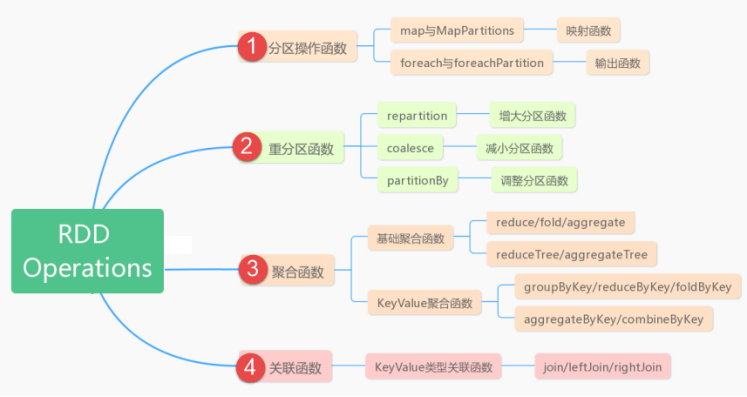

# Spark 角色理解


## 1- 模块

``` properties
Spark:分布式内存迭代计算框架;

Spark Core: 实现了Spark 的基本功能，包含RDD、任务调度、内存管理、错误恢复、与存储系统交互等模块

Spark SQL: Spark 用来操作结构化数据的程序包,可以使用 SQL操作数据.
	数据结构:Dataset/DataFrame = RDD + Schema
	
	Structured Streaming:
Spark Streaming:
	Spark 提供的对实时数据进行流式计算的组件。
	数据结构:DStream = Seq[RDD]
	
Spark GraphX:能在海量数据上自如地运行复杂的图算法
	数据结构:RDD或者DataFrame
	
Spark MLlib: 机器学习(ML)功能的程序库
	数据结构:RDD或者DataFrame


```


## 2- Spark基础

``` properties

Spark-Local环境:Local模式就是，以一个JVM进程，去模拟整个Spark的运行环境，就是将Master和Worker角色以线程的形式运行在这个进程中;


主节点Master:管理整个集群资源，接收提交应用，分配资源给每个应用，运行Task任务

Driver :整个应用管理者，负责应用中所有Job的调度执行. 相当于AppMaster。 运行JVM Process，运行程序的MAIN函数，必须创建SparkContext上下文对象。

SparkContext:spark应用程序的入口，负责调度各个运算资源;

WorkerNode:集群任何可以运行application代码的节点，运行一个或多个Executor进程;

Executors:运行在Worker上的进程，负责运行Task,相当于一个线程池，可以启动多个Task任务（线程）

Task:运行在Executor上的工作单元任务的最小分解;


Job:一个Spark Application中，包含多个Job,每个Action算子就有一个Job.

Stage:每个Job有多个Stage组成， stage根据宽依赖来划分;每个 Stage 是多个 算子 的集合

DAG:有向无环图 ： 每个Job执行按照DAG图进行的

Spark On Yarn
	Client模式: Driver 和 AppMaster 不在一个节点上
	Cluster模式:Driver 和 AppMaster 在一个节点上


```


## 3- Spark Core

``` properties

1- RDD(弹性分布式数据集):RDD 是一种分布式内存抽象，其使得程序员能够在大规模集群中做内存运算，并且有一定的容错方式(- - 使用Scala/Java的本地集合:但是只能完成本地单机版的,如果要实现分布式的,很困难!)

2- RDD 优点:RDD将Spark的底层的细节都隐藏起来（自动容错、位置感知、任务调度执行，失败重试等）

3- RDD五大特性:
	1- RDD是数据集的基本组成单位，一组分区的列表;
	2- 每个算子被作用在每个分区上;
	3- RDD 之间是相互依赖的;
	4- key-value 型的RDD 都会有个分区器（Partitioner） ;
	5- 数据再哪个worker节点，就在哪个节点上计算（移动数据，不如移动计算）;
	
4- RDD持久化(速度快):为了一个程序中二次使用这个RDD(spark的rdd默认都是 过程数据, 临时的,用完就丢的。)

5- RDD Checkpoint(安全性高):	更加可靠的数据持久化

6- 共享变量:
	广播变量:广播变量允许在每个节点（Worker or Executor）缓存只读变量
	累加器:多个节点对一个变量进行共享性的操作
		LongAccumulator用来累加整数型
		DoubleAccumulator用来累加浮点型
		CollectionAccumulator用来累加集合元素
		继承AccumulatorV2实现自定义的累加器
			第一步、继承AccumulatorV2，实现相关方法;
			第二步、创建自定义Accumulator的实例;
			第三部、然后在SparkContext上注册它;
			
	
	
```

### 3-1 常用算子

``` properties
常用算子:
	1- 创建RDD
		parallelize
		makeRDD
		textFile
		wholeTextFiles
		
	2- 获取RDD分区数量
		rdd.getNumPartitions
		rdd.partitions.length
		
	3- RDD操作
		Transformation:返回一个新的RDD（所有Transformation函数都是Lazy，不会立即执行，需要Action函数触发）
			map
			filter
			flatMap
			mapPartitions
			union
			distinct
			groupByKey
			reduceByKey
			sortByKey
			sortBy
			aggregateByKey
			join
			coalesce
			repartition
		
		Action:返回值不是RDD（无返回值或者返回其它的）
			reduce(func)
			collect
			count
			first
			take(n)
			saveASTextFile(path)
			saveAsSequenceFile(path)
			saveAsObjectFile(path)
			countByKey()
			foreach(func)
			foreachPartition(func)
```




### 3-2 Spark内核原理

``` properties
窄依赖:父RDD的一个分区只会被子RDD的一个分区依赖;

宽依赖:父RDD的一个分区会被子RDD的多个分区依赖，涉及Shuffle;

为什么要设计宽窄依赖？？
-  1）、对于窄依赖来说
   - Spark可以并行计算
   - 如果有一个分区数据丢失，只需要从父RDD的对应个分区重新计算即可，不需要重新计算整个任务，提高容错。
-  2）、对应宽依赖来说
   - 划分Stage的依据，产生Shuffle

DAG: 是有向无环图,是一个个的节点(算子)组成的节点迭代流程图。 一个Action产生一个Job。

Stage: 是由一组并行的Task组成;
Stage切割规则:从后往前，遇到宽依赖就切割Stage;
Stage计算模式: pipeline管道计算模式;
pipeline:是一种计算思想、模式，来一条数据然后计算一条数据，把所有的逻辑走完，然后落地

Spark内存迭代:Spark的性能对比MR是划时代的。主要原因是 基于内存的迭代;
Spark比MR效率高主要就是2个原因:
	1- MR算子少;
	2- 数据经常落盘;
Spark为什么可以内存传输或者网络直传呢？
	1- Spark的最小执行单位是Task也就是单个线程。Task运行在Executor内。一个节点可以有多个Executor，一个集群可以有多个节点;
	2- 一个算子可以并行执行;
	3- - 如果算子A的所有Task在Executor1、3中执行，算子B的所有Task运行在Executor2、4中执行。算子AB的关系是 先计算A然后基于A的结果计算B


```

