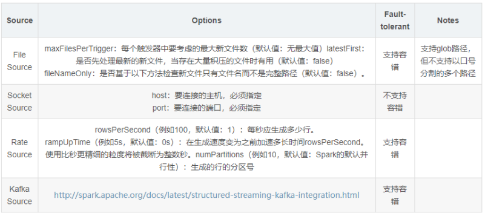

[TOC]


# 1- Spark框架概述

## 1-1 Spark是什么？

- Spark是基于**内存迭代计算的分布式框架**；

- 核心数据结构是**RDD**；

- Spark是**Scala**语言实现的；

  

## 1-2 Spark的四大特征

1. 速度快(内存迭代计算)；
2. 易于使用；(支持多种语言开发：Scala、Java、Python)
3. 通用性强；
4. 多种运行方式：
   - **本地模式；**
   - **集群模式：**
     - **StandAlone;**
     - **Spark On Yarn；**
       - **Client 模式：Driver是一个单独的进程；**
       - **Cluster模式：Driver 跟 AppMaster 在一起；**

## 1-3 Spark 框架模块

- **Spark Core； **
  - 包含**数据结构RDD、任务调度、内存管理、错误恢复、与存储系统交互**等模块
- **Spark SQL；**
  - 用于操作**结构化数据**的程序包，通过 Spark SQL，我们可以使用 SQL操作数据。
  - <span style="color:red;background:white;font-size:20px;font-family:楷体;">**数据结构：Dataset/DataFrame = RDD + Schema;**</span>
  - **Structured Streaming**
- **Spark Streaming；**
  - 用于对**实时数据**进行**流式计算**的组件；
  - <span style="color:red;background:white;font-size:20px;font-family:楷体;">**数据结构：DStream = Seq[RDD]**</span>
- **Spark GraphX；**  图片计算引擎
  - Spark中用于**图计算的API**；
  - <span style="color:red;background:white;font-size:20px;font-family:楷体;">**数据结构：RDD或者DataFrame**</span>
- **Spark MLlib **； 机器学习；
  - **机器学习(ML)**功能的程序库；
  - <span style="color:red;background:white;font-size:20px;font-family:楷体;">**数据结构：RDD或者DataFrame**</span>


## 1-4 你对Spark的 RDD 是如何理解的？

## 1-5 讲解RDD是什么、RDD五大特性

- [**弹性分布式数据集**]();
  - [不可变的集合]()；
  - [分区的集合]()；
  - [并行计算]()；
  - [有依赖关系]()；
- **每个RDD都是有分区的(分布式)**；
- **每个算子作用于每个分区上**；
- **RDD之间相互依赖**;
- **key-value 数据可自定义分区器**；
- **移动数据不如移动算法**;

## 1-6 RDD在工作中怎么使用？

- 有三种方式创建RDD:
  - sc.**textfile**；
  - [**sc.makerdd/paralleise；**]()
  - [**RDD与DataFrame、DataSet之间的转换;**]()

## 1-7 RDD常用的算子

``` properties
Transformation:返回一个新的RDD（所有Transformation函数都是Lazy，不会立即执行，需要Action函数触发）
    map
    mapPartitions
    tranform
    filter
    flatMap
    union
    distinct
    groupByKey
    reduceByKey
    sortByKey
    sortBy
    aggregateByKey
    join
    coalesce
    repartition

Action:返回值不是RDD（无返回值或者返回其它的）
    reduce(func)
    collect
    count
    first
    take(n)
    top(n)
    saveASTextFile(path)
    saveAsSequenceFile(path)
    saveAsObjectFile(path)
    countByKey()
    foreach(func)
    foreachPartition(func)
    foreachRDD
    foreachBatch
```


- 算子的分类：

  - transformation 算子： <span style="color:red;background:white;font-size:20px;font-family:楷体;">**返回一个新的RDD;**</span>
    - <span style="color:red;background:white;font-size:20px;font-family:楷体;">**所有Transformation函数都是Lazy，不会立即执行，需要Action函数触发;**</span>
  - action 算子：<span style="color:red;background:white;font-size:20px;font-family:楷体;">**返回值不是RDD(无返回值或返回其他的)**</span>
    - <span style="color:red;background:white;font-size:20px;font-family:楷体;">**可以在Action时对RDD操作形成DAG有向无环图进行Stage的划分和并行优化，这种设计让Spark更加有效率地运行。**</span>
- 获取RDD分区数目两种方式
  - **rdd.getNumPartitions();**
  - **rdd.partitions.length;**

- 基本算子
  - textfile、map、flatmap、filter、foreach、saveAsTextFile......

- 分区算子
  - mapPartitions 、 foreachPartition ；
  - 像这种带有Partitions 的算子都是**批处理**的算子。

- 重分区算子
  - **repartition;**
    - 此函数使用的谨慎，**会产生Shuffle**。
    - 注意: **repartition底层调用coalesce(numPartitions, shuffle=true)**
  - **coalesce;**
    - **默认是减少分区数**；
    - **如果想增加分区数，第二个参数设置为true;** （**会产生Shuffle**）
    - 函数名称：coalesce，**shuffle参数默认为false,不会产生Shuffle**，默认只能减少分区
  - **partitionBy;**
    - **自定义分区；**
- 聚合算子
  - 不带key聚合算子
    - **sum:简单的求和；**
    - **reduce：可以自定义计算方法（加减乘除）；**
    - **fold:在reduce基础上 + 可初始化值；**
    - **aggregate: 在fold基础上 + 分区内的计算方法 + 分区间的计算方法；**
  - 带key 聚合算子 ： **groupByKey 、 reduceByKey、 foldByKey、aggregateByKey**
    - **groupByKey: 简单的求和；**
    - **reduceByKey：可以自定义计算方法（加减乘除）；**
    - **foldByKey:在reduce基础上 + 可初始化值；**
    - **aggregateByKey: 在fold基础上 + 分区内的计算方法 + 分区间的计算方法；**
  - <span style="color:red;background:white;font-size:20px;font-family:楷体;">**groupByKey 与 reduceByKey的区别是？**</span> 

    - <span style="color:red;background:white;font-size:20px;font-family:楷体;">**reduceByKey 有预聚合；**</span>
    - <span style="color:red;background:white;font-size:20px;font-family:楷体;">**groupByKey 没有预聚合；**</span>

- join关联算子
  - **join: 内关联；**
  - **leftOuterJoin: 左外关联；**
  - **rightOuterJoin: 右外关联；**
  - **fullOuterJoin:全关联；**
  - **union:合并，笛卡尔积；**
  - 关联条件：**以两个RDD 的两个key 关联；** 

- 排序算子 ：sortByKey 、sortBy  、topN 、 orderBy

  - **sortByKey**
    - **按照Key进行排序**，默认升序；
    - **第一个参数为false 时，为降序**；
    - <span style="color:red;background:white;font-size:20px;font-family:楷体;">**注意： 如果不指定第二个参数（分区数），默认只是分区内的排序；**</span>
  - **sortBy**
    - **自定义排序规则**；
    - **参数1：按照谁排序；**
    - **参数2：升序(true),降序(false);**
    - **参数3：指定分区数**,(<span style="color:red;background:white;font-size:20px;font-family:楷体;">**注意： 如果分区数不是1，只做分区内的排序**</span>)
  - **top**
    - 如果是Key/Value对，**按照Key降序排序**;
    - 参数1：求top 几；
    - 参数2：**是个隐士参数，：Ordering.by() 。 指定使用哪个排序；**
    - <span style="color:red;background:white;font-size:20px;font-family:楷体;">**注意：该算子仅用于结果数据比较小的时候，如果数据量大会oom Driver;**</span>

  - **orderby**
    - [**全局排序**]()

### 1-7-1 Spark的Transformation算子有几类？

- **单value**：如mapValue，map，filter；
- **双value**：union，zip，distinct；
- **key-value类型**：reduceBykey(一定不属于Action算子)，foldByKey；


## 1-8 foreach,foreachPartition,foreachRDD区别是什么？

- 处理对象不一样：

  - **foreach: 一条条数据；**
  - **foreachPartition:分区；**
  - **foreachRDD ： RDD**;


- 总结：
  - map 						处理每一条数据 并返回；
  - foreach                    处理每一条数据 无返回；
  - mapPartition          处理每个分区数据 并返回；
  - foreachPartition     处理每个分区数据 无返回；
  - transform(mapRDD)                处理DStream中的每个RDD  并返回；
  - foreachRDD             处理DStream中的每个RDD  无返回；
  - **注意还有一个foreachBatch： 是StructuredStreaming 中的算子，处理流中一个批次的数据；**

## 1-9 引出Spark的RDD的宽窄依赖

- 窄依赖
  - 父RDD 的数据只给一个子的RDD;
  - 可以实现内存迭代计算；
- 宽依赖
  - 父RDD的数据分发给了多个子RDD， 产生了Shuffle阶段；
  - Spark根据宽依赖来划分Stages;

## 1-10 缓存和checkpoint

- 常用的昂贵的算子都会使用**cache或persist方法将数据缓存在内存**或本地磁盘中；
- 如果考虑到**安全性**，需要使用**checkpoint**可以将数据和元数据放置在hdfs的分布式文件系统中


# 2- Spark 集群角色（重点）

**四个角色Master Worker Driver Executor**

- Local模式
  - **一个JVM进程中通过线程模拟整个Spark的运行环境；**
  - JVM 进程能拿到多少资源，就是整个Spark能使用的资源；
  - Local模式下，使用**Driver线程 、Executor线程**来维持集群环境；

- StandAlone模式
  - <span style="color:red;background:white;font-size:20px;font-family:楷体;">**注意： 只有在standalone模式下， 才有master worker  这两个角色**</span>
  - master :  **任务调度/分配   +      资源调度/分配    +     worker管理** ；
  - worker : 计算；
  - **master(管理资源、任务) + worker(计算)**

- Yarn 模式
  - **资源管理和分配，无需spark操心，由Yarn集群管理；**
  - **spark只负责计算即可；**
  - **Yarn(资源管理) + Spark(计算)**
  - **Driver进程：任务管理、调度**
  - **Executor进程：计算；**
  - **client 模式：Driver是独立的进程；**
  - **cluster 模式：Driver 和 Appmaster 在一起；**

# 3- 介绍一下Spark 内存管理

## 3-1 内存分配

- **总内存**
  - **预留内存（300M）当总内存非常大时，可以忽略；**
  - **可用内存：usable memory;**
    - **其他内存：用于用户自定义的数据结构以及spark的元数据存储；**
    - **统一内存：用于Storage 和 Exection 的内存；**
      - **Storage 内存：用于存放RDD 数据；**
      - **Exection内存：用于存放Shuffle时生成的临时数据；**


## 3-2 内存动态占用机制

- 规则如下：
  - 设定基本的**存储内存(storage)和执行内存(execution**)区域:spark.storage.storageFraction
  - 双方的空间**都不足时**， 则**溢写到硬盘**；
  - **若自己的空间不足，而对方有空余时**，<span style="color:red;background:white;font-size:20px;font-family:楷体;">**可借用对方的空间；(存储空间不足：不足存放一个完整的block)**</span>
  - **执行空间不足时，如果有被对方占用的空间**，<span style="color:red;background:white;font-size:20px;font-family:楷体;">**可以让对方将该数据溢写到磁盘中，强制要回空间；**</span>
  - **存储空间不足时，如果有被对方占用的空间**，<span style="color:red;background:white;font-size:20px;font-family:楷体;">**无法让对方“归还”，因为Shuffle过程复杂，优先级高；**</span>


# 4- spark-submit 面试题


# 5- 简单介绍一下DAG

- **DAG 叫做有向无环图；**
- **是根据RDD的一个依赖关系构建的，RDD的迭代关系图；**
- **一个Action算子就是一个DAG/Job;**
- **DAG 根据宽依赖划分Stage;**
- **Stage中的Task分发给Executor去运行计算；**

# 6- 简单介绍一下Job的基本流程


- **Driver 创建入口SparkContext 、DAGScheduler 、TaskScheduler；**
- **SparkContext 向ResouceManager 申请资源；**
- **ResourceManager 分配nodeManager上的资源并启动Executor, Executor与ResourceManager心跳包；**
- **SparkContext 根据RDD 依赖关系构建DAG并交给DAGScheduler；**
- **DAGScheduler **
  - **根据RDD的宽依赖划分Stage和tasks;**
  - **准备提交Stage;**
  - **并将Stage 中的Tasks提交给TaskScheduler 管理；**
- **TaskScheduler**
  - **管理、调度所有Task；**
  - **将Task 分配给Executor 去执行；**
  - **重试一些失败任务**；(对于失败的任务会拉取其他线程执行 （**推测执行**）)
- **Executor执行完后反馈结果给Driver,并释放资源；**
- [**推测执行**]()：
  - 一个stage里面的不同task的执行时间可能不一样，[有的task很快就执行完成了，而有的可能执行很长一段时间也没有完成]()。造成这种情况的原因可能是集群内机器的配置性能不同、网络波动、或者是由于**数据倾斜引起的**。而[**推测执行(speculative)**]()就是[当出现同一个stage里面有task长时间完成不了任务]()，spark就会[在不同的executor上再启动一个task来跑这个任务]()，然后看哪个task先完成，就取该task的结果，并kill掉另一个task。其实对于集群内有不同性能的机器开启这个功能是比较有用的。

# 7- 简单介绍一下Spark的shuffle 机制；

1. 在RDD之间出现了<span style="color:red;background:white;font-size:20px;font-family:楷体;">**宽依赖**</span>的时候会出现Shuffle机制；
2. shuffle分为两个阶段 ： **上游stage的writeshuffle ，下游stage的readshuffle;**
3. shuffle经历阶段:  <font color='red'>Hash </font>-> <font color='red'>sort </font>-> <font color='orange'>钨丝计划(CPU,内存优化)</font> -> **<font color='red'>sort+钨丝(普通模式、bypass模式)</font>**；
4. **Sort Shuffle 实现流程（普通机制）：**
   - **先将数据写入内存数据结构中；**
   - **每写一条数据进入内存数据结构，就会判断是否达到了<font color='red'>Storage内存的临界值</font>；**
   - **如果达到临界值就会将内存数据结构中的数据溢写到磁盘中；**
   - **<font color='red'>再溢写之前需要根据key排序；（方便生成index文件查询使用）</font>**
   - **每次溢写后都会生成一个文件，最后将这些文件合并成一个大的数据文件和一个index文件；** 
   - **最后下游的stage根据index文件去读取数据文件；**


# 8- 介绍一下Spark并行度

- Spark并行度分为两个：

  - **资源的并行度(资源总量)：由节点数(executor)和cpu数(core)决定的**

  - **处理的并行度(计算的时候的分区数)：task的数据，partition大小**

    - task又分为map时的task和reduce(shuffle)时的task；
    - task的数目和很多因素有关:

      - 资源的总core数，
      - spark.default.parallelism参数，
      - spark.sql.shuffle.partitions参数，
      - 读取数据源的类型,
      - shuffle方法的第二个参数,
      - repartition的数目等等。

# 9- Spark如何实现容错？

1. 首先看内存中是否已经**cache或persist** 缓存;
2. 再查看是否**checkpoint值hdfs中**;
3. 最后根据依赖链构建<font color='red'>血缘关系</font>**重建rdd**;


# 10- Spark的任务执行?

- Spark一个Application拥有**多个job**，**一个action**操作会出发**一个Job(DAG)**划分
- Spark**一个Job/DAG有多个Stages**，发生**shuffle**操作触发一个Stage的划分
- **一个Stage有很多个tasksets**，**一个RDD的不同的分区就是代表的taskset**，很多的taskset组成tasksets
- 一个taskset由很多个RDD的分区组成，**一个RDD的分区的数据需要由一个task线程拉取执行，而不是进程**


# 11- 持久化和Checkpoint的区别

- 问题:
  缓存持久化 VS Checkpoint 开发中用哪个?

- 答案:
  **缓存持久化(保证后续再次使用的速度) + Checkpoint(保证安全，是容错机制)** 

- 区别:

  - 1）、**存储位置**
    -  **Persist 和 Cache 只能保存在本地的磁盘和内存中(或者堆外内存)；**
    -  **Checkpoint 可以保存数据到 HDFS 这类可靠的存储上；**

  - 2）、**生命周期**

    - Cache和Persist的RDD会在**程序结束后会被清除或者手动调用unpersist方法**；**或者LRU(最近最少使用机制删除)**
    - Checkpoint的RDD在程序结束后依然存在，**不会被删除**；

  - 3）、**[Lineage]()(血统、依赖链、依赖关系)**
- Persist和Cache，**不会丢掉RDD间的依赖链/依赖关系**；
    - **Checkpoint会斩断依赖链**，

# 12- 如何选择缓存级别？

- **Spark建议如何选择cache或persist的级别？**
  - 尽可能的放到**内存**；
  - 如果内存放不下， 尝试使用基于序列化，可以使用**kryo序列化**；
  - 一般不要放在磁盘，除非这个算子非常昂贵；

- **如何释放缓存？**

  - unpersist();

  - rdd.unpersist或df.uncache，[如果没有显示调用方法，使用什么算法自动释放内存？]()
  - **LRU机制**：最近最少使用；


# 13- 介绍一下Spark中的共享变量

## 13-1 广播变量

- **原因**：
  - rdd1(大) join rdd2(小)；
  - **让一个Executor中的所有task 共用一个公有的数据rdd2；**
- **使用方法**：
  - **Driver端：发布广播变量**：val listBroadcast: Broadcast[List[String]] = **sc.broadcast(list)**
  - **Executor端：获取广播变量**： val listValue = **listBroadcast.value**
- **原理**：
  - **广播变量只在每个节点（Worker or Executor）缓存一份只读变量，共这个节点下的所有Task使用；**


## 13-2 累加器

- 原理：

  - **用于[多个节点对一个变量]()进行共享性的操作**;

- 特性：

  - **多个task对一个变量并行操作的功能；**
  - **task只能对Accumulator进行累加操作，不能读取Accumulator的值；**
  - **只有Driver程序可以读取Accumulator的值**；
  - [**累加器存在于Driver端；**]()

- 种类：

  - <span style="color:red;background:white;font-size:20px;font-family:楷体;">**LongAccumulator用来累加整数型，**</span>
  - <span style="color:red;background:white;font-size:20px;font-family:楷体;">**DoubleAccumulator用来累加浮点型，**</span>
  - <span style="color:red;background:white;font-size:20px;font-family:楷体;">**CollectionAccumulator用来累加集合元素。**</span>
  - **自定义累加器；**

- 使用方法：

  - **定义累加器**：val accumulator: LongAccumulator = **sc.longAccumulator("mycounter")**
  - **累加计算**：accumulator.**add**(1L)；
  - **获取累加值**：accumulator.**value**；

- 扩展：

  - **自定义累加器**

    - **第一步、继承AccumulatorV2，实现相关方法；**
    - **第二步、创建自定义Accumulator的实例，然后在SparkContext上注册它；**

    

- 注意：

  - <span style="color:red;background:white;font-size:20px;font-family:楷体;">**累加器在Driver中；**</span>

## 13-3 使用累加器的坑

- 问题： 定义累计器之后执行累加，只有触发Action操作才能够得到结果；[**如果在触发action之后，又一次触发action会发生什么现象？**]()
- 回答：**累加器会多次累加**；
- 解决方法：
  - [使用Accumulator时，为了保证准确性，只使用一次action操作]()。
  - **如果需要使用多次则使用cache或persist操作切断依赖**。

# 14 - Spark on Yarn 流程详解

1. Client 运行spark-submit提交一个任务；
2. **Client向RM申请启动AM和Driver；**
3. RM选择一个NM中的Container资源容器启动AM和Driver;
4. AM向RM申请资源用于启动Executor；
5. RM返回NM列表；
6. AM连接其它的NM并在Container中启动Executor;
7. Executor 反向注册给Driver;
8. **Driver端创建两个任务：DAGScheduler 、TaskScheduler;**
9. **Driver端根据Action算子划分job,回溯RDD依赖关系构建DAG图；**
10. **DAGScheduler 将DAG图根据宽依赖划分成Stages,每个Stage根据并行度划分Task;**
11. **DAGScheduler 将每组Task提交给TaskScheduler；**
12. **TaskScheduler 将一个个task发送给NM中的executor中去执行；**
13. **TaskScheduler 还会重启失败的task任务；**
14. NM中的Executor执行完任务将结果反馈给TaskScheduler 再重复步骤11；


# 15- 简单介绍一下SparkSQL

- 一句话概括：**写的是SQL ，执行的是Spark**; 让Sql也有分布式执行的能力；
- Spark 1.0版本才有Spark SQL 框架；

- 数据结构： **DataFrame(1.3版本) -> DataSet(1.6版本)->DataFrame=DataSet[Row] (2.0版本)；**

- 现使用的版本：2.4.5


# 16- 介绍一下 SparkSQL 的特性

- **易整合**
  - 支持的语言多：java scala go python
- **统一的数据访问模式**
  - 连接到任何数据源的方式相同: **spark.read**.json/text/csv/parquet(一种序列化数据文件)....
  - 写出时方式相同：**spark.write.mode**.text/json/csv/parquet
- **兼容Hive**
  - 支持Hive HQL的语法，兼容hive(元数据库、SQL语法、UDF、序列化、反序列化机制)。
- **标准的数据连接**
  - 可以使用行业标准的JDBC或ODBC连接。

# 17- 介绍一下SparkSQL 的数据抽象


- SparkCore 中的数据结构是RDD;
  - **RDD 支持泛型 ：RDD[Person]**
- SparkSQL 1.3 版本 中的数据结构是DataFrame （**二维表格**）；
  - **DataFrame 不支持泛型；**
  - **RDD转DataFrame  会丢失泛型；**
  - **DataFrame反转成RDD,也没有泛型；**
  - DataFrame 中每一行数据叫做**Row对象**；所以DataFrame->RDD 变成RDD[Row]

- SparkSQL1.6 版本中的数据结构是DataSet;
  - **DataSet支持泛型；** ： DataSet[Person]
  - DataSet[Person] 可以**直接反转成RDD**[Person]
- SparkSQL2.0 版本中的数据结构是DataSet;
  - **DataFrame 实际类已经不存在了；**
  - **DataFrame = DataSet[Row]** ; （就是DataSet[Row] 的**别名** DataFrame）


# 18- RDD-DataFrame-DataSet相互转换

- **RDD**
  - rdd-->df ：**personRDD.toDF** //注意:DataFrame没有泛型； **注意：需要导包import spark.implicits._**
  - rdd-->ds：**personRDD.toDS()** //注意:Dataset具有泛型;
- **DF**
  - df-->rdd : **personDF.rdd** 
    - **注意:DataFrame没有泛型,也就是不知道里面是Person,所以转为rdd之后统一的使用Row表示里面是很多行**
  - df-->ds : **personDF.as[Person]**
- **DS**
  - ds-->rdd : **personDS.rdd**
  - ds-->df：**personDS.toDF()**


# 19- SparkSQL 的执行环境入口是什么？

- **SparkSession**

``` scala
val spark: SparkSession = SparkSession
      .builder()
      .appName("SparkSQL")
      .master("local[*]")
      .getOrCreate()
```


# 20- RDD、DataSet和DataFrame的区别和联系？

- RDD+Scheme=DataFrame.as[]+泛型=DataSet.rdd=RDD；

- DataFrame是**弱类型**的数据类型，在**运行时**候数据类型检查；

- DataSet是**强类型**的数据类型，在**编译时**候进行类型检查；


# 21- SparkSQL中查询一列的字段的方法有几种？

- df.select( **['id']** )；
- df.select( **col('id')** )；
- df.select( **colomns('id')** )；
- df.select( **'id** )；#注意： **只有一个单引号**
- df.select( **$"id"** )  : 常用；

# 22- SparkSQL中的如何动态增加Schema?

- **Spark中StructedType对象就是Schema ；**
- **Spark中StructedField对象封装每个字段的信息；**

- **StructedType**(**StructedField**(data,name,nullable)::Nil)；
- **new StructedType()**.add(data,name,nullable).add();
- **spark.createDataFrame(rddData, schema)**

# 23- SparkSQL中DSL和SQL风格差异？

- DSL风格df.select；
- SQL风格**需要注册一张临时表或试图**进行展示；


# 24- 全局Session和局部Session的差别是什么？

- 全局的Session可以**跨Session**访问注册的临时试图或表；
- 局部Session**只能访问当前会话中临时试图或表**；


# 25- SparkSQL执行流程-如何执行SQL转化成RDD?（重点）

- SparkSQL的查询引擎分**两步**将SQL转化成RDD
  1. **使用Catalyst优化器 去做优化**
     - 基于**规则**优化（Rule-based optimization, **RBO**）--- **逻辑执行计划**中，进行逻辑计划优化；
       - **列值裁剪**：选择需要查询的字段而不是 * ；
       - **谓词下推**：先filter 在join；
     - 基于**代价**优化（Cost-based optimization, **CBO**）--- **物理执行计划**中 选择最优物理执行计划；
       - 多个物理计划 **使用代价函数优化 选择一个最优的物理计划**；
  2. **最后使用代码生成器生成RDD;**


# 26- 介绍一下Spark 中的自定义UDF

- **分类**：
  - **UDF: 一进一出；**
  - **UDAF: 多进一出；**
  - **UDTF:一进多出；**

- **功能：**

  - **用于HiveSql 中没有的一些功能函数；**

- <span style="color:red;font-size:20px;font-family:黑体;">**定义方式一：udf()**</span>

  ``` scala
  val myfun = (word: String) => word.toUpperCase
          
  val lowCase2UpperCase1: UserDefinedFunction = udf(
      // 这里是一个匿名函数， udf: 一进一出
      // (word: String) => word.toUpperCase
      myfun
  )
  ```

- <span style="color:red;font-size:20px;font-family:黑体;">**定义方式二：spark.udf.register**</span>

  ``` scala
  println("---------- 定义UDF 方式二 用于 DSL 和 SQL ----------")
  val lowCase2UpperCase2 = spark.udf.register(
      name = "lowCase2UpperCase2",
      (word: String) => word.toUpperCase()
  )
  
  ```

- 使用方法：

  - **SQL风格 只能使用spark.udf.register的方式**
  - **DSL风格 两种注册方式都可以使用**

  ``` scala
  // SQL 只能使用spark.udf.register的方式
  spark.sql("select  lowCase2UpperCase2(word) as upWord from words").show()
  
  // DSL 两种注册方式都可以使用
  df.select(lowCase2UpperCase1($"word").as("upWord")).show()
  df.select(lowCase2UpperCase2($"word").as("upWord")).show()
  ```

  

# 27- 简单介绍一下Spark Streaming

- Spark Streaming 是一个**流式计算框架**；
- 对**无界数据**进行连续不断的处理、聚合和分析；
- 底层使用的技术模式是**微批处理模式**；


# 28- 什么叫离线计算，什么叫流式计算？

- 离线计算/批处理计算：
  - 一批**有界数据**放在那里，等着你一次性处理掉；
- 流式计算/实时计算：
  - 源源不断的**无界数据**实时处理；

- 有界数据：
  - 有明确的开始和结束；
- 无界数据（流数据）：
  - 有明确的开始， 没有明确的结束；

# 29- 流计算模式有几种？

- **原生流处理(Native)**
  - **Storm 和 Flink;**
  - **所有输入记录会一条一条的处理**；

- **微批处理(Batch)**
  - **Spark Streaming 和 Structured Streaming；**
  - 将输入的数据以某一时间间隔T,切分多个**微批量数据**；然后催每个批量数据处理；
  - 缺点： **实时性不够；延迟高；**

# 30- 简单介绍一下Spark Streaming的数据结构DStream（数据抽象）

- 数据结构：**DStream** ；
- DStream可以按照秒、分等时间间隔将数据流进行批量的划分；
- **DStream代表了一种连续的数据流**，要么从某种数据源提取数据，要么从其他数据流映射转换而来。
- **DStream内部是由一系列连续的RDD组成的**，每个RDD都包含了特定时间间隔内的一批数据，

- <span style="color:red;background:white;font-size:20px;font-family:楷体;">**DStream：在时间线上的一组RDD集合（时间轴上的RDD集合）**</span>

- <span style="color:red;background:white;font-size:20px;font-family:楷体;">**DStream：是不间断的 连续的数据对象(内容是无边界的)**</span>


# 31- DStream有几种算子？

- **transformation算子；**
- **Output算子；** 就是Action算子；


# 32- 介绍一下Spark框架的几个执行入口

- **SparkCore : SparkContext;**
- **SparkSQL: SparkSession;**
- **SparkStreaming: StreamingContext;**

# 33- 介绍一下SparkStreaming的状态计算

- **无状态计算**
  - 数据计算**无需依赖历史数据**；一批数据单独过来处理即可；
- **有状态计算**
  - 数据**依赖历史数据**才能完成计算；
  - **UpdateStateByKey（饿汉式）；**
    - **需要设置一个checkpoint目录，开启checkpoint机制；**
    - 缺点：**不管这个key 是否有新数据来，也会返回所有key的数据；**
    - **支持状态恢复** ：<font color='red'>程序异常重启后可以恢复</font>（**<font color='orange'>重点</font>**）
  - **mapWithState（懒汉式）**
    - **需要设置一个checkpoint目录，开启checkpoint机制；**
    - 优点：**只计算更新的数据；**
    - **不支持状态恢复；**
- Spark一般都是用的有状态计算；
  - **窗口计算**；


# 34- SparkStreaming如何完成状态恢复？

- 开启checkpoint 机制； 
- 使用updateStateByKey 有状态技术；


# 35- 介绍一下SparkStreaming 的窗口

- **窗口就是将无界数据流**，人为在其中划分出**一节节的有界数据**；
- **SparkStreaming 中微批是窗口的最小单元；**
- **窗口长度**：表示窗口要处理的数据范围；
- **滑动距离**：表示隔多久开一个窗口；
- 窗口类型：
  - **滑动窗口**： 窗口长度 > 滑动距离；数据重复
  - **滚动窗口**： 窗口长度 = 滑动距离；正正好好的窗口
  - 会丢失数据窗口(开发不用): 窗口长度 < 滑动间隔 


# 36- 在微批时间跟窗口时间一致时，可以使用reduceByKey么？

- 可以？

- **<font color='red'>窗口时间必须是微批时间的整数倍</font>**，如果做窗口计算使用**reduceByKeyAndWindow**算子；
- 但是**当窗口时间 = 微批时间**的时候，就**相当于没有做窗口计算**了。

# 37- map ，mapPartition,transform 区别是什么？

- **处理对象**不一样：
  - **map: 一条条数据；**
  - **mapPartition:分区；**
  - **transform：RDD；**
- **DStream 里面是RDD；   RDD 里面是分区；  分区里面是一条条数据；**

- DStream 如果加了窗口，里面就只有一个RDD了；
- **所以在对加了窗口的DStream做排序的时候使用transform,里面只有一个RDD ,对这个RDD 排序就是全局排序；**

# 38- foreach,foreachPartition,foreachRDD区别是什么？

处理对象不一样：

- **foreach: 一条条数据；**
- **foreachPartition:分区；**
- **foreachRDD ： RDD**

总结：

- map 						处理每一条数据 并返回；
- foreach                    处理每一条数据 无返回；
- mapPartition          处理每个分区数据 并返回；
- foreachPartition     处理每个分区数据 无返回；
- transform                处理DStream中的每个RDD  并返回；
- foreachRDD             处理DStream中的每个RDD  无返回；
- **注意还有一个foreachBatch： 是StructuredStreaming 中的算子，处理流中一个批次的数据；**

# 39- SparkStreamging 整合kafka

- **两种连接模式**
  - **Receiver：接收器模式；**
    - 优点：
      - 使用的是**高级API**;
    - 缺点：
      - 只有一个Receiver 去接收数据，**性能不高**并且一旦Receiver挂了，整个系统崩溃（可靠性差）；
      - 为了不丢失数据有个WAL预写日志功能，但是又会出现**重复消费**的问题；
      - 如果采用多个Receiver,又需要使用**union**操作后才发给DStream;性能再次拉低；
  - **Direct : 直连模式**；
    - 优点：
      - kafka 与 Streaming之间是**分区对分区的模式，性能非常高，也是分布式的并行计算模式**；
      - **不存在数据丢失**，要处理什么就拉取什么数据即可；
      - **自己管理offset** ；
    - 缺点：
      - 使用的**低等级API;**

- **三种管理offset 模式**
  - **自动提交offset** 
    - auto.commit.interval.ms -> "1000" // 自动提交offset时间间隔;
    - enable.auto.commit -> (true:lang.Boolean) // 是否自动提交offset;
  - **手动提交offset**
    - enable.auto.commit -> (false:lang.Boolean) // 是否自动提交offset;
    - **CanCommitOffset**  // 记录了一些列可以提交的数据；
    - 通过方法**commitAsync**提交；


# 40- 对比SparkSteaming 与StructuredStreaming 

- **SparkStreaming 的不足，Struectured Streaming 优点；**
  - **使用 Processing Time 而不是 Event Time(很重要,真实场景都会用这个）**
  - **使用的API是低等级的API，比较复杂；**
  - **不支持end-to-end，端到端精确一致性；**
  - **批流代码不统一；**
  - **默认是无状态计算；** （StructuredStreaming 默认是有状态计算）
- **Structured Streaming 比 SparkStreaming 强大原因？**
  - <span style="color:red;background:white;font-size:20px;font-family:楷体;">**批流代码统一: API和SparkSQL基本一致；**</span>
  - <span style="color:red;background:white;font-size:20px;font-family:楷体;">**基于无界DF,完成了自动状态管理；**</span>
  - **默认是有状态计算**；
  - <span style="color:red;background:white;font-size:20px;font-family:楷体;">**数据源和数据输出是Spark内置的，可以确保容错（一致性）；**</span>
  - <span style="color:red;background:white;font-size:20px;font-family:楷体;">**支持事件时间；**</span>(非常重要)


# 41- 数据抽象-数据结构总结

## 41-1 RDD

- **弹性分布式数据集；**
- **是SparkCore中的数据结构；**
- 类似于List 集合，但是是分布式的；

## 41-2 DataFrame

- **是SparkSQL中的数据结构；**SparkSQL 1.3 版本
- **DataFrame 不支持泛型；**
- **RDD转DataFrame  会丢失泛型；**
- **DataFrame反转成RDD,也没有泛型,泛型是Row对象；**
- DataFrame 中每一行数据叫做**Row对象**；所以DataFrame->RDD 变成RDD[Row]


## 41-3 DataSet 

- **SparkSQL1.6 版本中的数据结构**；
- **DataSet支持泛型；** ： DataSet[Person]
- DataSet[Person] 可以**直接反转成RDD**[Person]
- **SparkSQL2.0 版本中的数据结构是DataSet;**
  - **DataFrame 实际类已经不存在了；**
  - **DataFrame = DataSet[Row]** ; （就是DataSet[Row] 的**别名** DataFrame）


## 41-4 DStream

- **是SparkStreaming 中的数据结构；**

- <span style="color:red;background:white;font-size:20px;font-family:楷体;">**DStream：在时间线上的一组RDD集合（时间轴上的RDD集合）;**</span>
- <span style="color:red;background:white;font-size:20px;font-family:楷体;">**DStream：是不间断的 连续的数据对象(内容是无边界的);**</span>


## 41-5 unBoundDataFrame

- **是Stuctured Streaming 中的数据结构；**
- 就是一个**无边界**的DataFrame;

# 42- Structured Streaming 支持哪些数据源?

- **FileSource;**
- **SocketSource;  : 不支持容错**

- **RateSource;**
- **KafkaSource;**



# 43- 常用的隐式转换有哪些？

- import spark.implicits._   
  - toDF;
  - toDS;
- import org.apache.spark.sql.functions._
  - udf();
  - agg();
  - count();
  - $;

# 44- 介绍一下OutputMode 三种输出模式？

- append;

  - 默认的模式；
  - **只会输出新增的数据**；（更新的也不会输出）
  - <span style="color:red;background:white;font-size:20px;font-family:楷体;">**不支持聚合操作；**</span>

- complete;

  - 输出全部数据； 
  - <span style="color:red;background:white;font-size:20px;font-family:楷体;">**只支持带有聚合的操作；**</span> 

- update;

  - 新数据 + 更新数据；
  - <span style="color:red;background:white;font-size:20px;font-family:楷体;">**不支持排序；**</span>

# 45- Structured Streaming 如何保证精确一致性 ？

- **检查点checkpoint;**
- **WAL;**
- **offset;**

# 46- SparkStreaming 与 Stuctured Streaming 微批时间区别？

- **SparkStreaming** 
  - **在获取StreamingContext的时候设置；**
  - **必须设置；**
- **Stuctured Streaming**
  - **默认不设置（全自动模式）：Spark 会尽快的处理数据；**
  - **使用trigger算子设置微批间隔时间；**

# 47- 介绍一下查询名称？

- <span style="color:red;background:white;font-size:20px;font-family:楷体;">**查询名称 就是 二次查询（子查询）**</span>；
- <span style="color:red;background:white;font-size:20px;font-family:楷体;">**设置的查询名称就是二次查询的表名**</span>；
- <span style="color:red;background:white;font-size:20px;font-family:楷体;">**设置查询名称的时候OuputMode 必须是memory**</span>； （重点）
- <span style="color:red;background:white;font-size:20px;font-family:楷体;">**二次查询输入批处理（不是流处理）**</span>;

# 48- 介绍一下检查点位置 checkpointLocation

- 使用<span style="color:red;background:white;font-size:20px;font-family:楷体;">**Checkpoint 检查点进行故障恢复；是一个容错的机制**</span>

- 使用Checkpoint和预写日志WAL完成 状态恢复（故障恢复）；
- Checkpoint 里面保存了？
  - 检查点状态state;（**每个RDD 的状态**）
  - 预写日志；
    - offsets;
    - commits;

- 两种方式设置Checkpoint Location位置：
  - **1. 流输出时在option 中设置**
    - streamDF.writeStream.option("checkpointLocation", "path")
  - **2. SparkConf设置**
    - sparkConf.set("spark.sql.streaming.checkpointLocation", "path")
- 注意：
  - <span style="color:red;background:white;font-size:20px;font-family:楷体;">**Socket 源是不支持容错的，所以无法使用检查点实现状态恢复；**</span>

# 49- 介绍一下StructuredStreaming 中Sink？


# 50- 介绍一下StructuredStreaming 去重

Structured Streaming可以使用<span style="color:red;background:white;font-size:20px;font-family:楷体;">**deduplication对 有无 Watermark的流式数据进行去重操作**</span>:

- **1.无 Watermark：**
  - 对重复记录**到达的时间没有限制**。
  - 查询会**保留所有的过去记录**作为状态用于去重；
- **2.有 Watermark**：
  - 对重复记录**到达的时间有限制**。
  - 查询会根据**水印删除旧的状态**数据；

# 51- StructuredStreaming 整合kafka

## 51-1 需要注意些什么？ 

- 所有的kafka配置都是通过**option来配置**的；

- 可以消费**多个Topic**中的数据； 

- 可以使用**通配符匹配Topic**数据；

- **从kafka获取数据后Schema字段信息如下：**

  - **数据信息：**
    - **key** 
    - **value**
  - **元数据：**
    - **topic**
    - **partition**
    - **offset**

- 获取到的数据信息都是**二进制数据 binary类型**；

  - **df.selectExpr("CAST(key AS STRING)","CAST(value AS STRING)").as[(String,String)]**

  

## 51-2 消费数据时是否需要设置groupID?为什么？

- **不能设置groupID.**
- 原因：
  - **系统会自动生成一个唯一的groupID**;
- <span style="color:red;background:white;font-size:20px;font-family:楷体;">**那么每次重新程序生成的groupID 是不一样的，那怎么确定上次消费到了哪里？offset**</span>
  - 首先这里是**一个流程处理**，是处理实时的数据；**一般都是处理的last数据**；
  - 如果重启中间的数据不能丢失，那么可以设置**startingoffsets**: 从那里开始获取数据。
  - 因为每次消费者获取数据的时候都是**可以获取到offset，partition,topic 等元数据**，所以如果需要保证不丢失数据， 就必须**自己保存好offset（checkPoint保存）**等信息，在二次启动的时候设置**startingoffsets**。

## 51-3 生产数据时是否需要设置topic?为什么？

- **不一定**需要使用option来设置topic 
  - 如果**DataFrame中包含了topic字段就不需要额外的在使用option去设置topic**;

## 51-4 整合kafka总结：

- 消费kafka数据：

  - <span style="color:red;background:white;font-size:20px;font-family:楷体;">**不能设置group id ;**</span>
  - 不能设置auto.offset.reset;
  - <span style="color:red;background:white;font-size:20px;font-family:楷体;">**不能设置key/value.deserializer/serializer;**</span>
  - <span style="color:red;background:white;font-size:20px;font-family:楷体;">**不能设置enable.auto.commit;**</span>
  - 不能设置interceptor.classes;

  

- 生成kafka数据：

  - <span style="color:red;background:white;font-size:20px;font-family:楷体;">**DataFrame中[必须]()有value 字段；**</span>
  - <span style="color:red;background:white;font-size:20px;font-family:楷体;">**DataFrame中[可选择]()有key, topic 字段；**</span>
  - <span style="color:red;background:white;font-size:20px;font-family:楷体;">**option设置中[必须]()有kafka.bootstrap.servers；**</span>
  - <span style="color:red;background:white;font-size:20px;font-family:楷体;">**option设置中[可选择]()有topic；**</span>

# 52- 常用方法汇总

- 获取**value**字段的值，转换为**String**类型；(因为获取kafka中的数据时二进制格式)

  - selectExpr("CAST(value AS STRING)")

- 将数据转换**Dataset**  : 原数据抽象是：DataFrame , 泛型是Row,不好处理；

  - as[String] 

- 过滤一些为异常数据

  - **StringUtils**.*isNotBlank*(_)

- **获取json中的数据转换成列**： **get_json_object**

  - ``` scala
    .select(
        get_json_object($"value", "$.device").as("device_id"),
        get_json_object($"value", "$.deviceType").as("device_type"),
        get_json_object($"value", "$.signal").cast(DoubleType).as("signal"),
        get_json_object($"value", "$.time").cast(LongType).as("time")
    )
    ```

- **直接将Json字符串转成Bean**；

  - ``` scala
    .map(data => {
        // json 转 bean
        JSON.parseObject(data, classOf[DeviceData])
    })
    ```

- **聚合**算子使用

  - ``` scala
    // 统计数量、评价信号强度
    .agg(
        count($"device_type").as("count_device"),
        round(avg($"signal"), 2).as("avg_signal")
    )
    ```

# 53- 时间概念

- **事件时间**

```properties
	产生数据的时间， 一般数据都会带上自己产生的时间（其实就是产生这个数据的服务器时间）
```

- 注入时间

```properties
	进入我们spark程序的时间（source阶段）。（开发中100% 不会使用到）
```

- **处理时间**

```properties
	正在进入spark程序的时间（process阶段），一般我们说的处理时间就是数据进入spark的时间（一般不考虑注入时间）
```

- **计算时间**

```properties
	当水位线到了窗口的末尾触发了计算，这个时间就是计算时间。
```


# 54- 事件时间

- 重点

  - 一旦**按照事件时间来做流或者窗口计算**，那么 <span style="color:red;background:white;font-size:20px;font-family:楷体;">**所有和时间相关的内容统统以数据自带的时间（事件时间）为准**</span>， 和<span style="color:red;background:white;font-size:20px;font-family:楷体;">**服务器的系统时间没有任何关系**</span>；
  - **如果要使用事件时间，就必须使用waterMark水位线；**


# 55- 介绍一下水位线

- 按照事件时间来处理数据时， **水位线也是有数据的事件时间来控制的**；
  - **水位线 = max(事件时间)；**
- **水位线只会前进，不会后退**：也就说延迟数据中的事件时间如果小于当前的水位线，水位线是不会动的；
- **数据是包头不包尾的；**
- 当水位线>= 窗口endTime 就触发当前窗口的计算；


# 56- 事件时间计算，会导致迟到的数据被丢弃，如何解决？

- 当第一条数据进来后才会有水位线和窗口规划；
  - 窗口的起始时间： 
    - <span style="color:red;background:white;font-size:20px;font-family:楷体;">**起始时间 = 首次数据事件时间 - （首次数据事件时间 % 窗口长度）**</span>
  - 如何处理延迟的数据？**就是延迟去计算窗口；**
    - <span style="color:red;background:white;font-size:20px;font-family:楷体;">**水位线 = max(事件时间) - 允许延迟时间；**</span>

- 水位线跟输出模式配合；
  - complete 模式： 
    - <span style="color:red;background:white;font-size:20px;font-family:楷体;">**水位线不生效；**</span>
    - <span style="color:red;background:white;font-size:20px;font-family:楷体;">**迟到数据也是100% 被计算； **</span>  
  - update 模式： 
    - <span style="color:red;background:white;font-size:20px;font-family:楷体;">**迟到的数据 100% 被丢弃；**</span>

# 57- Spark调优

- CPU: 控制Driver 和 Executor 所能使用的CPUcore数量；

- 并行度：并行 task数量，全局并行度；

- 内存：控制Driver、Executor 的内存；

- Shuffle:  spark.sql.shuffle.partitions ：控制shuffle过程中的分区数量； （默认200个）

- <font color='red'>spark.conf.set("spark.sql.autoBroadcastJoinThreshold", "-1")  </font>

  - 报错：[Exception in thread “broadcast-exchange-0” java.lang.OutOfMemoryError: Not enough memory to build and broadcast the table to all worker nodes]()
  - <font color='red'>意思说这个配置的最大字节大小是用于当执行连接时，该表将广播到所有工作节点。通过将此值设置为-1，广播可以被禁用。 </font>

- 小文件控制：控制读取小文件分区数；

- 网络发送buffer大小； 

- Executor 和 Storage 内存分配比例：用于计算的内存和原数据 内存的比例； 

- 数据倾斜：

  - **通用手段**：**随机数方式、广播方式、分批处理方式（多次处理）**
    - **<font color='red'>随机数方式</font>**：
      - 大表：关联字段添加随机数后缀；1-n ;
      - 小表:  每条数据扩大n 倍；
      - 再去做join操作；
    - **<font color='red'>广播方式</font>**：
      - 小表全进Executor的内存（广播变量） 让Executor中的所有task共享这一份数据； 
    - **<font color='red'>分批处理</font>**：
      - 一条SQL中join了太多的表，处理时会导致集群扛不住；
      - eg:

  ``` sql
  -- 原SQL 语句
  select * from A 
  	left join B on xxx
  	left join C on xxx
  	left join D on xxx
  	left join E on xxx ;
  	
  	
  -- 分批处理:	
  1- select * from A left join B on xxx  => 结果输出R1
  2- select * from R1 left join C on xxx => 结果输出R2
  3- select * from R2 left join D on xxx => 结果输出R3
  ......
  ```

  
