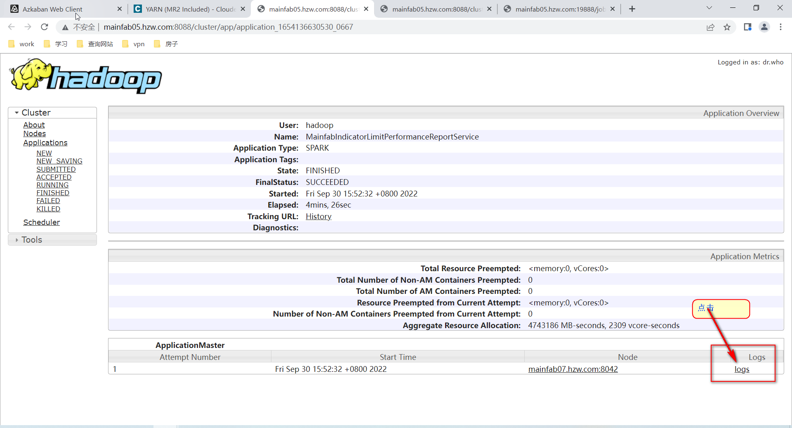

# 1-Driver

- 通过CDH 找到对应Job执行的 applicationId , 点击右键 使用新界面打开；


- 点击 logs



- 点击 here


# 2- executor

- yarn logs -applicationId    xxxxxx
  - 通过CDH 找到该任务的 applicationID


``` shell
yarn logs -applicationId application_1654136630530_0665  > totalLog.log
```


