[TOC]


# 1- Spark简介

Spark是一个 大规模数据处理 的统一**分析引擎**.

- 关键字: **大规模数据处理**
- 关键字: **分析引擎(计算引擎)**

Spark快:

- RDD\DataFram(底层数据结构)
- `分布式执行`(大白话: 群殴)
- **内存计算**


Spark非常典型的 特点: `内存计算`;

Spark对于内存的需求是非常的高的;

基于内存计算, Spark的性能 如果对比MapReduce: 可以达到100倍以上;

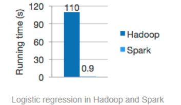


## 1-1 Spark的4大特点:

- **速度超级快(比MR块太多)**
- **易用性强:** API贼简单
- **通用性好**: 支持的编程语言(**R\SQL、Python、Java、Scala**)很多, 可以实现的功能也挺多(**SQL计算、流计算、机器学习计算、图计算**)
- **运行方式**: 可以支持多种运行方式
  - **YARN中运行**
  - Mesos(类似YARN的资源管理框架)中运行
  - K8S
  - 云环境


## 1-2 Spark的框架模块

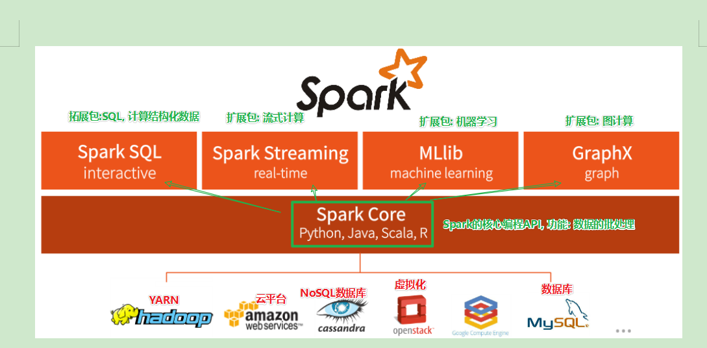

SparkCore: SPark的核心API

基于核心API之上可以提供:

- **SQL**: 扩展包， 计算结构化数据；
- **MLib：** 扩展包 , 机器学习；
- **Streaming：** 扩展包，流式计算；
- **GraphX**：扩展包， 图计算；


课程中主要学习:

- **SparkCore**
- **SparkSQL**


## 1-3 Spark运行模式


### 1-3-1 类库 VS 框架

- 类库: Pandas\Numpy\ PyMySQL 等, 这些都是类库, 功能是提供API供我们开发使用, 类库本身不能运行


- 本质上: **类库就是一堆别人写的代码, 你可以import它用**.


- 底层本质上还是**Python解释器**在跑.


- 框架: 框架是可以独立运行的东西. 可以有独立的框架进程存在, 比如: Hadoop\ Hive


- 本质上, **框架是一个独立的系统, 可以暴露出来API 供我们的编程语言去连接**.


- 底层本质上运行的是, **框架本身的进程**


- 以MapReduce为例,  暴露的API是Map和Reduce 的API , 运行起来的时候, 本质上是 YARN的进程在执行(NodeManager和ResourceManager)


- Spark是一个框架, 不是一个Python的库;


### 1-3-2 运行模式

- Spark主要有三种模式运行:


1. **本地运行** (单机跑, 单机游戏) : 一般用来做开发和测试, 不会正式使用
2. **集群模式** (联网游戏): 一般用于生产环境, 正式使用.
3. **云平台模式**(公有云平台(阿里云)\  KuberNetes容器调度): 也可以运行在生产环境.


- 以后在工作中的开发模式:
  - 开发：**本地模式**；
  - 生产：**集群模式**；


### 1-3-3 本地模式

- 以一个**进程** 模拟整个Spark的运行环境, 内部所需要的所有角色, 都是以`线程`存在；


- 以HDFS举例:
  - 在一个进程中, 以2个线程 分别模拟NameNode和DataNode的功能.


### 1-3-4 集群模式

- 集群模式也分为:
  - **StandAlone集群**: 所需的所有的角色, 都以`进程`存在；
  - **YARN集群**: 所需的所有的角色, 都运行在YARN的容器内；


- 集群模式 就是以 **分布式** 的模式, 去提供完整的Spark运行环境.


## 1-4 Spark的角色

### 1-4-1 HDFS两类角色:

- Master角色: NameNode进程
- Slave角色(Worker): DataNode进程


### 1-4-2 YARN4类角色:

- Master角色: ResourceManager进程
  - 整个集群的大管家
- Slave角色(Worker): NodeManager
- ApplicationMaster角色: 
  - 单个任务的Master
- Container角色(容器): 单个任务的工人(提供运行资源, 任务运行在容器内.)

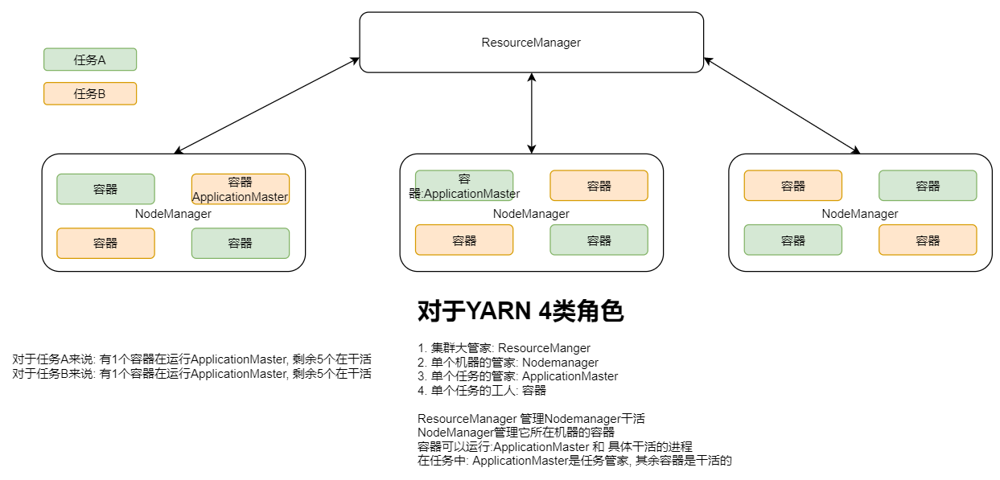


### 1-4-3 Spark中的角色:

- Master角色: 整个集群的大管家
- Worker角色: 提供Executor的大管家
- Driver角色: 单个任务的管理者
- Executor角色: 单个任务的执行者

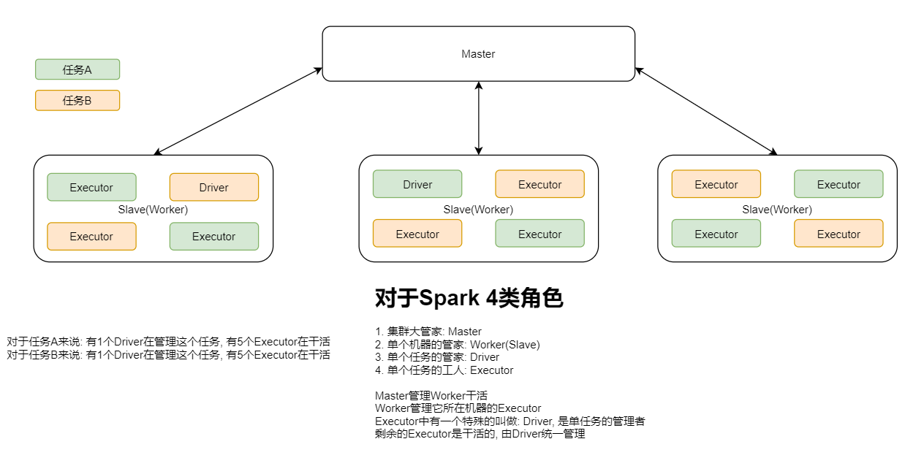


# 2- Spark环境搭建

## 2-1 Local模式的搭建


### 2-1-1 原理

- 将整个Spark环境, 在一个进程中完整的模拟出来, 所有的角色以线程的形式存在


- 在Spark的Local中, 仅有一个进程, 这个进程承担了:
  - Master角色;
  - 同时承担了 Worker角色;

- 这个Spark进程:
  - 整体的资源管理
  - 单任务的任务管理(Driver)
  - 任务的执行: 也是Driver本身在做.

- <font color='red'>也就是Local模式, 没有Executor干活, Driver本身 即管理 也 工作</font>

- Local模式 用来开发和测试,  因为只有Driver没有Executor, 性能不咋地；


- 在一个Local Spark环境中:
  - 如果有2个任务在同时运行, 也就是有2个Driver在跑, 没有Executor, 所有的工作由Driver自己做  (光杆司令, 即管理 也干活)

- <font color='red'>Local虽然简陋, 但是五脏俱全, 功能完善, 虽然性能烂, 但是用来测试 开发 是足够的</font>;


### 2-1-2 条件

- 只要安装好 Java(JVM)即可

- Python3


### 2-1-3 Anaconda3 在Linux的安装

- 上传资料中的:`Anaconda3-2021.05-Linux-x86_64.sh`

- 执行: `sh ./Anaconda3-2021.05-Linux-x86_64.sh`

- 选择安装位置: 建议在:`/export/server/anaconda3`

- 是否初始化, 选择yes

  


安装好anaconda 后 可以执行python3 验证:

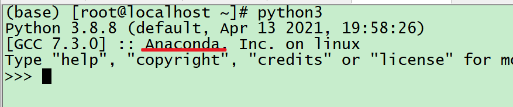


#### 2-1-3-1 配置Conda的仓库地址

步骤1: conda config --set show_channel_urls yes   // 创建`.condarc`配置文件

步骤2: 打开这个文件, 这个文件的路径在: `/root/.condarc`

> 如果你是Windows系统, 这个文件在: C:\Users\用户名\\.condarc

步骤3: 将`.condarc`的内容全部替换为如下内容:

```shell
channels:
  - defaults
show_channel_urls: true
default_channels:
  - https://mirrors.tuna.tsinghua.edu.cn/anaconda/pkgs/main
  - https://mirrors.tuna.tsinghua.edu.cn/anaconda/pkgs/r
  - https://mirrors.tuna.tsinghua.edu.cn/anaconda/pkgs/msys2
custom_channels:
  conda-forge: https://mirrors.tuna.tsinghua.edu.cn/anaconda/cloud
  msys2: https://mirrors.tuna.tsinghua.edu.cn/anaconda/cloud
  bioconda: https://mirrors.tuna.tsinghua.edu.cn/anaconda/cloud
  menpo: https://mirrors.tuna.tsinghua.edu.cn/anaconda/cloud
  pytorch: https://mirrors.tuna.tsinghua.edu.cn/anaconda/cloud
  simpleitk: https://mirrors.tuna.tsinghua.edu.cn/anaconda/cloud
```

步骤4: 创建一个pyspark的虚拟环境: `conda create -n pyspark python=3.8`

步骤5: 切换虚拟换:`conda activate pyspark`

步骤6: 在conda中安装pyspark: `conda install pyspark`


### 2-1-4 安装Spark环境（Local模式）

1. 下载Spark安装包, 资料中提供了`spark-3.1.2-bin-hadoop3.2.tgz`
2. 上传到Linux中, tar -zxvf spark-3.1.2-bin-hadoop3.2.tgz 解压, 老师演示中解压到了: `/export/server`
3. 可选: 软链接`ln -s /export/server/spark-3.1.2-bin-hadoop3.2 /export/server/spark`
4. 解压后的文件夹目录

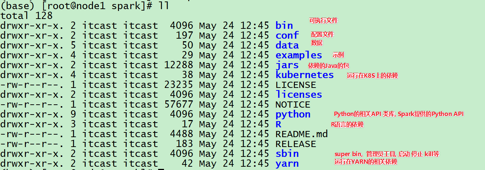


### 2-1-5 启动Local模式

直接在Linux系统中启动:` bin/pyspark` 即可启动Local模式

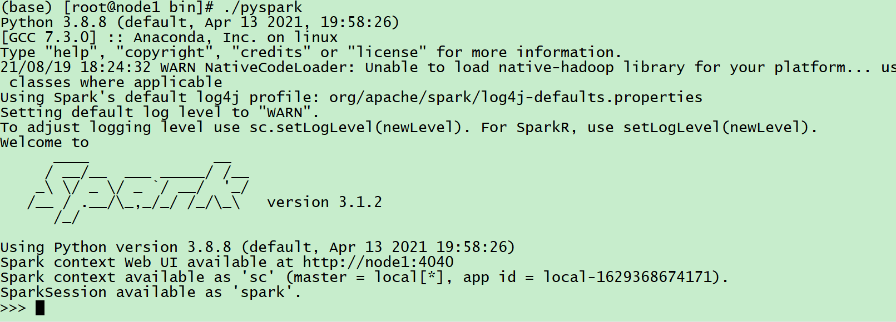


简单的执行WordCount小Demo

```python
# 请先在/root/下创建words.txt文件, 并准备好内容
file = sc.textFile("/root/words.txt")
file.flatMap(lambda line:line.split(" ")).map(lambda word:(word, 1)).reduceByKey(lambda a, b: a + b).collect()
```


### 2-1-6 WEB UI

`pyspark`程序运行起来后, 就在Linux系统上开启了一个Local的Spark环境.

可以打开:`http://node1:4040/`去查看它的监控页面

注意: node1是我的虚拟机的主机名, 你们自己替换成你们自己的


### 2-1-7 参数  --master

- pyspark这个程序, 是运行pythonspark的环境的工具

- 默认启动的是Local模式的Spark环境.

- 这个工具也能连接StandAlone和YARN环境.


- 通过参数控制:


```properties
pyspark这个程序 有一个参数 如下: 叫做--master 用来指定连接的master, 如果不写, 默认就是Local[*]模式

Options:
  --master MASTER_URL         spark://host:port, mesos://host:port, yarn,
                              k8s://https://host:port, or local (Default: local[*]).
```

- 参数理解
  - local[*] 代表, 以全部的资源, 去运行Local模式.
  - 如果以local[2] 表示: 以2个CPU核心去运行Local模式的 Spark
  - 比如: `./pyspark --master local[2]`
  - 也就是`local[x]` 表示控制local模式下可用的资源.


### 2-1-8 spark-submit 工具

- 工具用来<font color='red'>提交Spark任务</font>。
- 这个工具 会连接到指定的Master上( 如果是Local, 会启动一个临时的Local环境)  然后运行你提供的代码.
- 以后我们会通过这个工具向集群提交任务执行

示例:

``` properties
spark-submit --master local[*] /export/server/spark/examples/src/main/python/pi.py 1000

# 如上命令, 提交了Spark官方提供的 计算PI(圆周率)的实例代码. 我们通过SparkSubmit工具 提交它运行.
```


### 2-1-9 windonw 跑spark 环境 （local模式）

- 解压 到D:\java\spark
- cmd  界面 进入 D:\java\spark\spark-3.1.2-hadoop3.2\bin\
- 执行pyspark.cmd

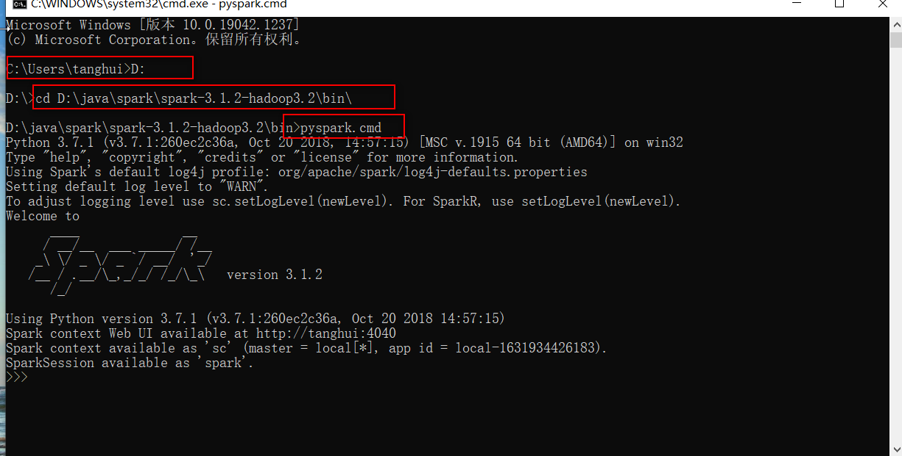

## 2-2 Standalone模式的搭建

### 2-2-1 原理

- StandAlone模式的部署, 是Master和Worker角色以<font color='red'>独立的进程</font>存在.


- 在StandAlone下:
  - Master角色, 会有一个进程存在,  名字叫做: `Master`
  - Worker角色, 会有一个进程存在, 名字叫做:`Worker`
  - Driver角色, 会运行在Master进程中
  - Executor角色,会运行在Worker进程中.


- Master进程, 必须有 且有最少1个


- Worker进程, 必须有, 且最少1个, 多无上限.


### 2-2-2 StandAlone中引出的新角色

- <font color='red'>历史服务器</font>角色(进程)
- 功能: 记录所有已经执行完毕的程序的历史信息.
- 它<font color='red'>不是必须</font>的, 当然有了最好,因为可以<font color='red'>查看历史记录</font>


### 2-2-3 集群规划


- 如图, 我们当前规划为: 
  - 1个Master进程, 3个Worker进程的集群.

- 在课程中, 使用三台Linux虚拟机:
  - node1(192.168.88.101): 运行1个Master 和1个Worker
  - node2(192.168.88.102): 运行1个Worker
  - node3(192.168.88.103): 运行1个Worker


### 2-2-4 集群安装步骤

- 上传Spark安装包到Node1上

- 解压安装包, 进入到conf目录

- 将所有`.template`的文件结尾 的`.template`删除

  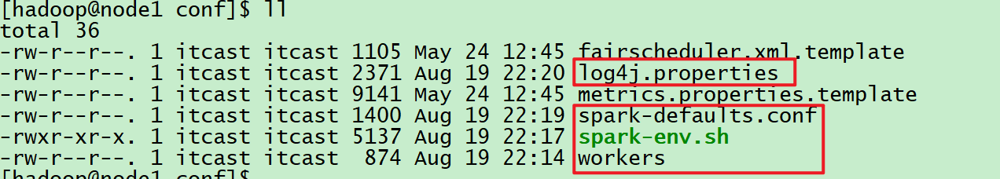

- 修改workers文件, 内容写成:

  ```shell
  node1
  node2
  node3
  ```

- 修改spark-env.sh文件, 追加内容为:

  ```shell
  ## 设置JAVA安装目录
  JAVA_HOME=/export/server/jdk
  
  ## HADOOP软件配置文件目录，读取HDFS上文件和运行YARN集群
  HADOOP_CONF_DIR=/export/server/hadoop/etc/hadoop
  YARN_CONF_DIR=/export/server/hadoop/etc/hadoop
  
  ## 指定spark老大Master的IP和提交任务的通信端口
  # 指定Master所在的机器
  export SPARK_MASTER_HOST=node1
  # 指定Master的端口
  export SPARK_MASTER_PORT=7077
  # 指定Master WEB UI的端口
  SPARK_MASTER_WEBUI_PORT=8080
  
  SPARK_WORKER_CORES=1
  SPARK_WORKER_MEMORY=1g
  SPARK_WORKER_PORT=7078
  SPARK_WORKER_WEBUI_PORT=8081
  
  ## 历史日志服务器
  SPARK_HISTORY_OPTS="-Dspark.history.fs.logDirectory=hdfs://node1:8020/sparklog/ -Dspark.history.fs.cleaner.enabled=true"
  ```

- 上面配置信息中有<font color='red'>历史日志</font>保存路径：hdfs://node1:8020/sparklog/

  - 需要在hadoop上创建对应的目录；
  - 需要<font color='red'>设置 权限</font>；

  ``` properties
  hdfs dfs -mkdir -p /sparklog/
  hdfs dfs -chown hadoop:root /sparklog
  hdfs dfs -chmod 775 /sparklog
  ```

  

  

- 修改spark-defaults.conf, 追加内容如下:

  ```shell
  spark.eventLog.enabled  true
  spark.eventLog.dir       hdfs://node1:8020/sparklog/ 
  spark.eventLog.compress         true
  ```

- 修改log4j.properties文件, 修改:

  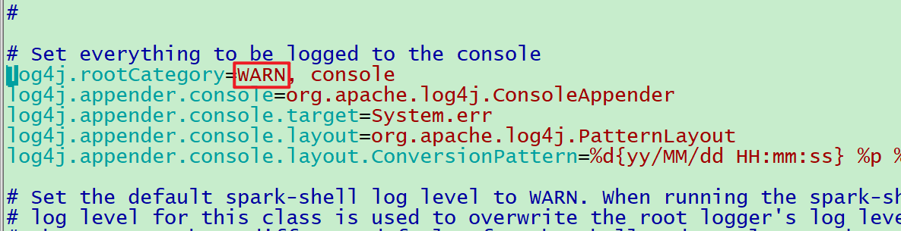

  如图, 将原有的INFO 改成WARN

- 在HDFS上创建历史记录文件夹

  ```shell
  # 创建
  hdfs fs -mkdir /sparklog
  # 授权
  hdfs fs -chmod 777 /sparklog
  ```

- <font color='red'>将node1上的spark 分发到node2和node3上</font>

  ```shell
  scp -r spark-3.1.2-bin-hadoop3.2 node2:/export/server/
  scp -r spark-3.1.2-bin-hadoop3.2 node3:/export/server/
  ```

- 进入到:spark目录中的sbin文件夹, 执行:

  ```shell
  # 启动集群./start-all.sh
  ```

- 启动后, 应该可以看到:

  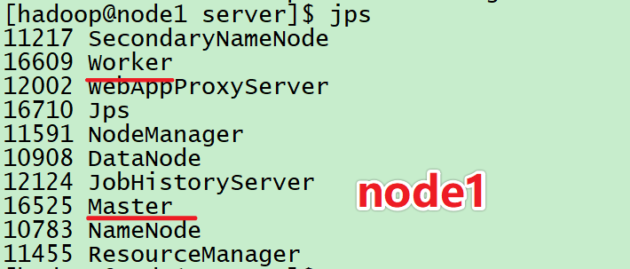

  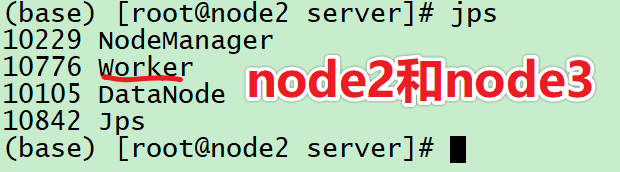

- 打开node1的8080端口, 可以看到master进程的监控页面:

  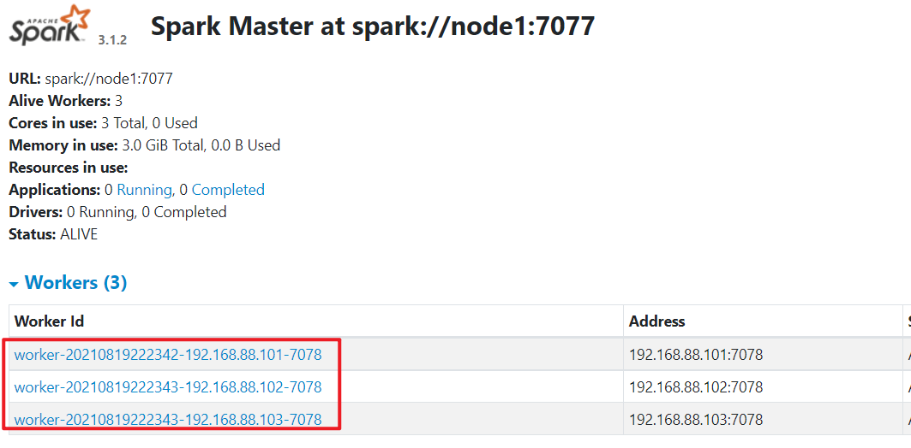

- 配置Spark的环境变量: `SPARK_HOME`

  ```shell
  # SPARK_HOME, 这个是必须的
  export SPARK_HOME=/export/server/spark  # PATH 这个是可选的
  export PATH=$PATH:$SPARK_HOME/bin
  ```


### 2-2-5 历史服务器的启动

- 历史服务器 不仅能看历史任务状态, 而且看到的更加详细, 所以一般启动它最好.


- 启动命令:

  ``` properties
  $SPARK_HOME/sbin/start-history-server.sh
  ```

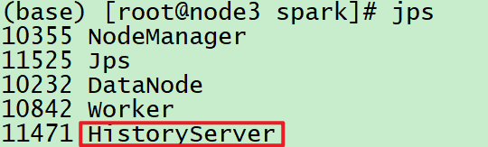

- 启动后, 就有一个叫做`HistoryServer`的进程存在.


- <font color='red'>注意: YARN的历史服务器叫做: JobHistoryServer, 不要混淆</font>

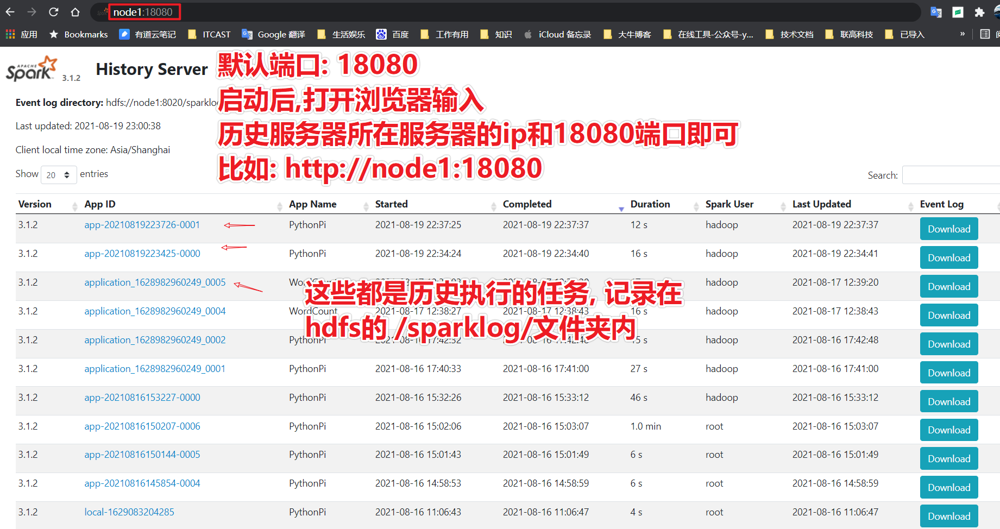

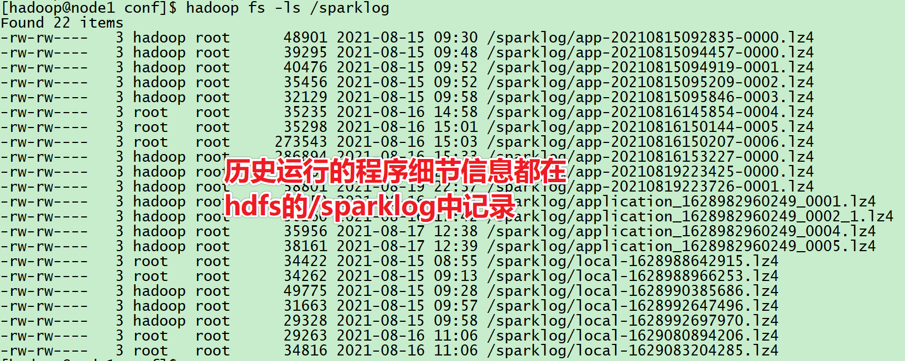


### 2-2-6 PySpark连接StandAlone

- 执行:  即可让交互式的运行Python代码的环境, 可以连接到StandAlone集群中去.

  ``` properties
  $SPARK_HOME/bin/pyspark --master spark://node1:7077
  ```

  


## 2-3 StandAlone HA 的搭建

- 停止原有的集群:`$SPARK_HOME/sbin/stop-all.sh`

- 启动Zookeeper集群: `$ZOOKEEPER_HOME/bin/zkServer.sh start`

- 修改spark-env.sh文件:

  ```shell
  # 1. 删除 下面的这个配置, 或者给注释掉export SPARK_MASTER_HOST=node1
  
  # 2. 在文件底部追加
  SPARK_DAEMON_JAVA_OPTS="-Dspark.deploy.recoveryMode=ZOOKEEPER -Dspark.deploy.zookeeper.url=node1:2181,node2:2181,node3:2181 -Dspark.deploy.zookeeper.dir=/spark-ha"
  
  # 要注意的是 node1 node2 node3 是老师的服务器的主机名, 自行替换成你们环境中的
  ```

- 将spark-env.sh 文件分发到其它两个机器上

  ```shell
  scp spark-env.sh node2:`pwd`/scp spark-env.sh node3:`pwd`/
  ```

- 在node1上启动集群:  $SPARK_HOME/sbin<font color='red'>/start-all.sh</font>

- 在node2上启动备份的master: $SPARK_HOME/sbin/<font color='red'>start-master.sh</font>

- 可以打开两个master的webui, 默认端口是8080, <font color='red'>如果端口被占用, 会顺延到8081 或者8082 .......</font>

- 可以查看日志($SPARK_HOME/logs/)中确定它的端口号:

  

  如图, 可以看到8080 和 8081都被占用了, 最后顺延到8082端口使用.


## 2-4 Spark On YARN 模式

### 2-4-1 原理

- 将Spark的Driver和Executor 运行在YARN的容器内部, 这就是Spark On YARN


- Spark的<font color='red'>Master</font>角色 由 YARN的 <font color='red'>ResourceManager</font>承担；


- Spark的<font color='red'>Worker</font>角色 由 YARN的 <font color='red'>NodeManager</font>承担；
- 如图, Spark的Driver和Executor运行在容器内.

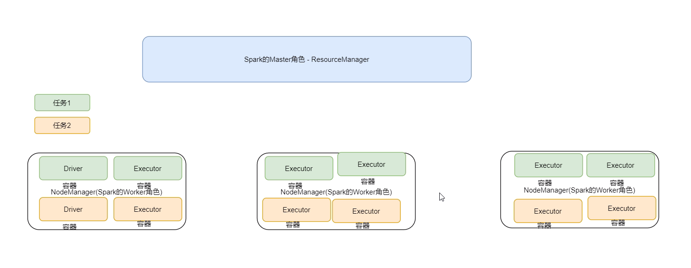

### 2-4-2 Spark On YARN 2个模式

- Cluster模式
- Client模式


#### 2-4-2-1 Cluster模式(集群模式)

- 在Cluster模式下, <font color='red'>Driver运行在 容器内</font>


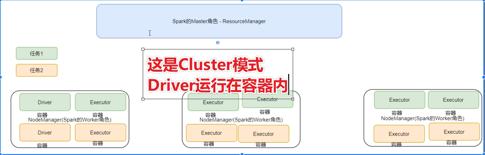


#### 2-4-2-2 Client模式(客户端模式)

- 在Client模式下, <font color='red'>Driver运行在 客户端进程内</font>
  - 目前接触到的客户端

- pyspark 客户端模式
- spark-submit 客户端模式

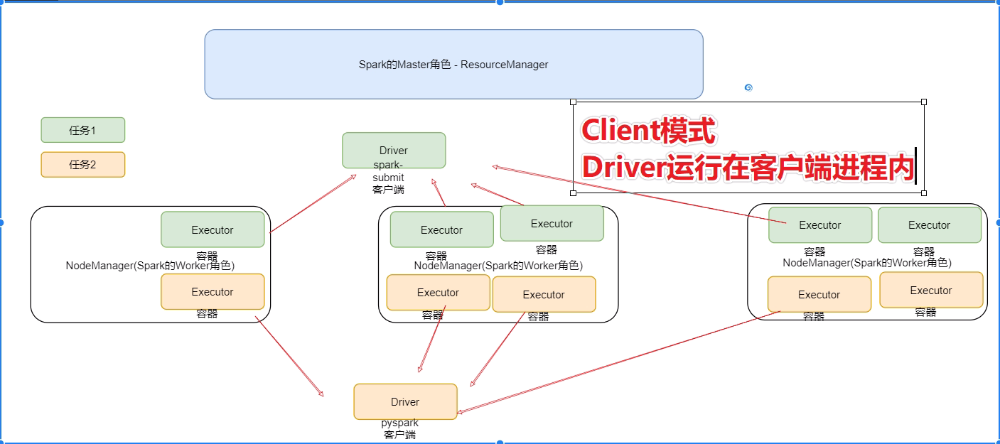


#### 2-4-2-3 两者对比

- 从<font color='red'>性能</font>来看, <font color='red'>cluster集群模式更好</font>(好那么一点), 因为Driver和Executor都在YARN(容器)内, 通讯成本较低；


- 从<font color='red'>方便程度</font>来看, <font color='red'>client客户端</font>会更方便些,;
  - 因为client客户端在YARN外部, <font color='red'>输出结果可以直接在控制台看到</font>;
  - 如果是Cluster模式, 你需要去查看<font color='red'>YARN的容器日志</font>, 比较繁琐;


### 2-4-3 部署

- 修改 spark-env.sh 文件, 确保有如下两个配置:


```shell
HADOOP_CONF_DIR=/export/server/hadoop/etc/hadoop
YARN_CONF_DIR=/export/server/hadoop/etc/hadoop
```

- 将spark-env.sh 分发到其它机器


```shell
scp spark-env.sh node2:`pwd`/scp spark-env.sh node3:`pwd`/
```

- 提交程序到YARN中:


```shell
# Client模式
$SPARK_HOME/bin/spark-submit --master yarn --deploy-mode client  /export/server/spark/examples/src/main/python/pi.py 100

# Cluster模式
$SPARK_HOME/bin/spark-submit --master yarn --deploy-mode cluster  /export/server/spark/examples/src/main/python/pi.py 100

# 注意: 提交到YARN 需要 --master yarn
# 区分client和cluster模式, 通过 --deploy-mode 参数控制
```


