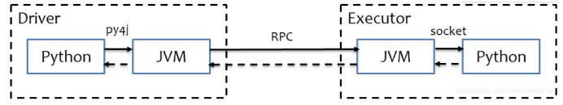

# 0- Spark 各运行环境的对比

| 对比       | Local                       | StandAlone                  | StandAlone HA      | YARN Client                                     | YARN Cluster         |
| ---------- | --------------------------- | --------------------------- | ------------------ | ----------------------------------------------- | -------------------- |
| Master角色 | Local进程本身               | Master独立进程              | Master独立进程     | ResourceManager                                 | ResourceManager      |
| Worker角色 | Local进程本身               | Worker独立进程              | Worker独立进程     | NodeManager                                     | NodeManager          |
| Driver     | 运行在Local进程内           | 运行在Master中              | 运行在Master中     | 运行在提交任务的客户端中(pyspark, spark-submit) | 运行在容器内         |
| Executor   | 无                          | 运行在Worker中              | 运行在Worker中     | 运行在容器内                                    | 运行在容器内         |
| 适用场景   | 开发/测试(不要用于生产环境) | 开发/测试(不要用于生产环境) | 开发/测试/生产均可 | 开发/测试/`生产`均可                            | 开发/测试/`生产`均可 |

> StandAlone HA 和 YARN模式均可以用在生产环境, 但是极少有企业在生产环境中使用StandAlone HA集群
>
> 大多数使用YARN模式的集群. 因为资源利用率好, 方便


# 1- pyspark 和 spark-submit 客户端工具

## 1-1 pyspark

- 我指的是, Spark安装目录中的bin内的pyspark程序；


- pyspark程序 是一个客户端工具, 可以为我们提供 <font color='red'>即时交互</font>的 Python执行环境；


- 这个程序 可以连接:
  - local 模式

    - 如果是lcoal模式, 这个pyspark程序会创建一个local环境 供这个程序用

  - StandAlone\ YARN

    - 可以指定master 用这个工具 去连接已经存在的集群

    - 连接StandAlone   ： 

      ``` properties
      bin/pyspark --master spark://node1:7077
      ```

    - 连接yarn  ： 

      ``` properties
       bin/pyspark --master yarn --deploy-mode client(cluster) 
      ```

      


## 1-2 spark-submit

- 这个是一个  <font color='red'>提交任务</font> 的工具


- 它不提供即时交互环境, 但是可以将你写的Spark代码, 提交给Spark运行;


- 支持:
  - local

    - 临时创建一个Local环境, 运行你提交的代码

  - StandAlone \ YARN

    - 将你的代码 提交到指定的集群环境中

    - 比如, <font color='red'>提交StandAlone</font>:

      ``` properties
      bin/spark-submit --master spark://node1:7077  xxx.py
      ```

    - 比如, <font color='red'>提交到YARN</font>: 

      ``` properties
      bin/spark-submit --master yarn xxx.py
      ```

      

## 1-3 参数

- 以spark-submit 为例

  ``` properties
  bin/spark-submit --master spark://node1:7077  xxx.py
  ```

  

```shell
Usage: spark-submit [options] <app jar | python file | R file> [app arguments]
Usage: spark-submit --kill [submission ID] --master [spark://...]
Usage: spark-submit --status [submission ID] --master [spark://...]
Usage: spark-submit run-example [options] example-class [example args]

Options:
  --master MASTER_URL         spark://host:port, mesos://host:port, yarn,
                              k8s://https://host:port, or local (Default: local[*]).
  --deploy-mode DEPLOY_MODE   yarn 专用 部署模式 client 或者 cluster 默认是client
  --class CLASS_NAME          运行java或者scala class(for Java / Scala apps).
  --name NAME                 程序的名字
  --jars JARS                 Comma-separated list of jars to include on the driver
                              and executor classpaths.
  --packages                  Comma-separated list of maven coordinates of jars to include
                              on the driver and executor classpaths. Will search the local
                              maven repo, then maven central and any additional remote
                              repositories given by --repositories. The format for the
                              coordinates should be groupId:artifactId:version.
  --exclude-packages          Comma-separated list of groupId:artifactId, to exclude while
                              resolving the dependencies provided in --packages to avoid
                              dependency conflicts.
  --repositories              Comma-separated list of additional remote repositories to
                              search for the maven coordinates given with --packages.
  --py-files PY_FILES         指定Python程序依赖的其它python文件;
  --files FILES               Comma-separated list of files to be placed in the working
                              directory of each executor. File paths of these files
                              in executors can be accessed via SparkFiles.get(fileName).
  --archives ARCHIVES         Comma-separated list of archives to be extracted into the
                              working directory of each executor.

  --conf, -c PROP=VALUE       手动指定配置
  --properties-file FILE      Path to a file from which to load extra properties. If not
                              specified, this will look for conf/spark-defaults.conf.

  --driver-memory MEM         Driver的可用内存(Default: 1024M).
  --driver-java-options       Driver的一些Java选项
  --driver-library-path       Extra library path entries to pass to the driver.
  --driver-class-path         Extra class path entries to pass to the driver. Note that
                              jars added with --jars are automatically included in the
                              classpath.

  --executor-memory MEM       Executor的内存 (Default: 1G).

  --proxy-user NAME           User to impersonate when submitting the application.
                              This argument does not work with --principal / --keytab.

  --help, -h                  显示帮助文件
  --verbose, -v               Print additional debug output.
  --version,                  打印版本

 Cluster deploy mode only(集群模式专属):
  --driver-cores NUM          Driver可用的的CPU核数(Default: 1).

 Spark standalone or Mesos with cluster deploy mode only:
  --supervise                 如果给定, 可以尝试重启Driver

 Spark standalone, Mesos or K8s with cluster deploy mode only:
  --kill SUBMISSION_ID        指定程序ID kill
  --status SUBMISSION_ID      指定程序ID 查看运行状态

 Spark standalone, Mesos and Kubernetes only:
  --total-executor-cores NUM  整个任务可以给Executor多少个CPU核心用

 Spark standalone, YARN and Kubernetes only:
  --executor-cores NUM        单个Executor能使用多少CPU核心

 Spark on YARN and Kubernetes only(YARN模式下):
  --num-executors NUM         Executor应该开启几个
  --principal PRINCIPAL       Principal to be used to login to KDC.
  --keytab KEYTAB             The full path to the file that contains the keytab for the
                              principal specified above.

 Spark on YARN only:
  --queue QUEUE_NAME          指定运行的YARN队列(Default: "default").
```


# 2- Windows下配置PySpark类库

## 2-1 安装PySpark类库

1. `conda create -n pyspark python=3.8` 创建一个虚拟环境
2. `conda activate pyspark` 切换虚拟环境
3. `conda install pyspark` 安装pyspark类库

## 2-2 配置环境变量

- **PYSPARK_PYTHON**   指向 你带有pyspark库的 python.exe


# 3- Windows下配置PyCharm

## 3-1 PyCharm 配置PySpark开发环境


## 3-2 配置hadoop 的 dll环境变量

1. 将课程中提供的 hadoop-3.3.0文件夹 复制到, 比如E:\盘下

2. 新建一个环境变量: `HADOOP_HOME`

   

3. 修改PATH环境变量, 增加:

   

4. 将 hadoop-3.3.0 文件夹中的bin文件夹内的`hadoop.dll` 复制到: `C:\Windows\System32` 里面


## 3-3 测试

```python
from pyspark import SparkConf, SparkContext

if __name__ == '__main__':
    conf = SparkConf().setAppName("test").setMaster("local[1]")
    sc = SparkContext(conf = conf)

    print(sc.parallelize([1, 2, 3]).collect())
```

运行如上代码, 不报错 就成功了.


## 3-4 配置远程SSH 执行的Python解释器

### 3-4-1 前置

- 远程的Linux服务器上, 需要有Python3环境 以及PySpark包


- 我们可以通过conda安装


```shell
1. conda create -n pyspark python=3.8 创建一个虚拟环境
2. conda activate pyspark 切换虚拟环境
3. conda install pyspark 安装pyspark类库
```


### 3-4-2 配置

- 这个功能, 是将我们的代码, 通过<font color='red'>SSH 远程提交到 服务器上去执行</font>.


- 意思是: 在Windows的<font color='red'>PyCharm里面写的代码</font>, 右键执行, 可以在<font color='red'>Linux服务器上直接跑</font>


# 4- HelloSpark的入门案例

重点:

- 学会如果导入PySpark


```python
# 导入pyspark的相关包, 导入SparkConf, SparkContext
from pyspark import SparkConf, SparkContext
```


- 学会如何构建Spark的执行环境入口对象: SparkContext对象


```python
# 设置Spark的Master
conf = SparkConf().setAppName("HelloSpark").setMaster("local[*]")       

# sc 就是SparkContext对象, 作为执行环境入口
sc = SparkContext(conf = conf)  
```


- 代码


```python
# coding:utf8

# 程序运行一个简单的单词计数统计, 以PySpark来执行

# 1. 导入pyspark的相关包, 导入SparkConf, SparkContext
from pyspark import SparkConf, SparkContext

# 解释: SparkConf: Spark的相关配置属性, 可以配置当前代码的程序名称, master是谁
# 解释: SparkContext: Spark的上下文环境, 就是Spark程序的执行入口

if __name__ == '__main__':
    # 1. 构建Spark环境的执行入口对象 SparkContext对象
    conf = SparkConf().setAppName("HelloSpark").\
        setMaster("local[*]")       # 设置Spark的Master
    sc = SparkContext(conf = conf)  # sc 就是SparkContext对象, 作为执行环境入口

    # 2. 读取数据文件
    file = sc.textFile("hdfs://node1:8020/input/words.txt")

    # 3. 将所有的单词都取出来
    words = file.flatMap(lambda line: line.split(' '))

    # 4. 将所有单词都加上1作为value
    word_one = words.map(lambda x:(x, 1))

    # 5. 分组并求和
    result = word_one.reduceByKey(lambda a, b: a + b)

    print(result.collect())
```


## 4-1 将程序提交到YARN集群运行

- 要注意, 如果要提交到集群运行, 那么代码中<font color='red'>不要指定master</font>


- 而是通过spark-submit程序的--master选项来决定master是谁;

``` shell
/export/server/spark/bin/spark-submit --master yarn --deploy-mode client --name helloSpark /home/myPython/test.py 
```


如图 通过spark-submit 提交程序执行.


# 5- WordCount代码分析


- Driver 在运行中 , 有且仅有一个


- Executor在运行中, 有0个(Local模式), 也可以是多个(集群模式)


## 5-1 结论

```shell
# Spark 是分布式框架
# 我们写的代码 如果提交到集群模式的Spark中运行
# 那么 底层就会有许多的Executor(服务器)来干活
# 我们写的是一份代码, 但是确实非常多的服务器在执行
```

==代码是一份, 底层跑的可能是多个机器==

也就是:

- 在Spark中<font color='red'> Driver是单机</font>的
- 但是Executor不一定, Executor可能有多个, 如果有多个, 干活的那一部分代码 就有<font color='red'>多个Executor协同执行</font>.


# 6- PySpark的执行原理 - 了解


- 思考: Spark底层语言是`Scala(JVM)`, 运行的进程也是JVM进程.


- 为什么我们写python 它就能认识并执行任务呢?


- **靠 <font color='red'>py4j</font> 的工具完成 Python到Java的转换.**





1. Driver端的运行, 是将Python语言, 通过<font color='red'> Py4J</font> 翻译成JVM可识别的机器码, 运行在JVM之上.也就是: Driver端的代码(Driver), 底层跑的是JVM. 将Python翻译过去运行的；
2. Executor 本身是JVM进程, 通过RPC和 JVM的Driver进行通讯, 由 Driver给Executor指派任务；
3. Executor干活, 是将干活的指令 通过Scoket网络通讯, 发送到一个Python进程上, 由Python执行；


总结:

- **Driver端 由 Python 转 Java 跑的是JVM**

- Executor端, 是以JVM接受Python代码, 将Python代码转交给Python进程去执行,

  **也就是Executor底层干活的是Python**


- **在Driver端 是真的将Python代码翻译成Java去执行的；**
- 在Executor端, Executor内部有2部分组成, 1是JVM 2是Python
  - **Executor的JVM 负责接收Driver发来的工作指令；**
  - **Executor的Python负责执行这个工作指令；**


# 7- 蒙特卡洛求PI 了解


如图:

一句话: 向1/4圆内随机撒点,  计算 落在圆内的点  和 全部撒点的数量的比例


得到这个比例 就可以计算出 1/4圆的面积, 乘以4就能得到 圆的面积


这个比例 就是PI


# 8- RDD部分


## 8-1 什么是RDD - 非常重要

- RDD : <font color='red'>弹性 分布式 数据集</font>


### 8-1-1 数据集: 数据的集合

- 比如Python中: List\ 字典\ 元组；


- 它们就是一个数据结构对象, 里面存放了一堆符合要求的数据；


- RDD也是一个数据集, 和LIST对象一样, 里面也是存放了一堆数据；


### 8-1-2 分布式

- **分布式: 数据集是跨服务器存在的**；

- Python 的List 对象, 能够将数据跨多台服务器存在吗?
  - 不能, Python的List对象 被称之为  `本地集合`

- RDD是分布式数据集合.
  - <font color='red'>数据是跨进程存放</font>, 比如 RDD里面存放了1到100  , 共100个数字那么, 这些数据可能 有50个 在机器1的进程中,  有50个在机器2的进程中

- 举例:
  - 一台电脑有8个G的内存 在Python对象中创建一个List对象, List能存放的数据上限: 8个G的大小;
  - 对于RDD不同, RDD是跨进程的. 比如我们有3台机器, 每一台机器8个G, 这个RDD理论上最大可以存储24G数据;

### 8-1-3 弹性

- RDD的分区是可以<font color='red'>动态缩减</font>的.


- 分区概念还没讲到, 这里以服务器来解释:
  - 有一个RDD 横跨了3台机器 存放数据,  突然临时加了一台, 这个RDD可以将数据 平均到第四台上.突然临时挂了一台, 这个RDD可以将数据平均到仅剩下的2台服务器上；


## 8-2 总结

- RDD:  就是一个**存储数据的集合对象**,  只是这个对象 存储的数据**可以横跨多台服务器(进程)**, **同时可以动态的增缩分区(服务器)**


## 8-3 RDD的5大特性


### 8-3-1 特性1: RDD是有分区的

- <font color='red'>A list of partitions</font>
- RDD作为分布式的数据集, 其划分数据的最小单位叫做: `分区(Partition)`

- 比如, 一个RDD有100GB数据, 其划分了100个分区.

- 就相当于将RDD 均分了100份

- 但是我们只有4个Executor, 那么, 每一个Executor接管 25个分区


<font color='red'>RDD是 逻辑概念</font>

<font color='red'>RDD的物理实体是: 分区</font>

也就是: RDD是逻辑上存在于代码中的 <font color='red'>RDD对象</font> , 它的物理实体 是存在于各个Executor中的具体分区

类比理解:  HDFS中的文件是一个逻辑对象, 它的物理实体, 是分散在各个DataNode之上的Block


### 8-3-2 特性2: 计算方法是作用在<font color='red'>每个</font>分区上

```shell
data = sc.parallelize([1,2,3,4,5,6], 3)
```

得到的data对象, 本质上就是一个RDD对象

现在假设要将data这个RDD里面的所有的数据 ,都 乘以10

```shell
data.map(lambda x: x * 10)
```


data是有3个分区( 上面有参数控制)

我的map方法 是不是作用在每一个分区上.


如图, **map方法是作用在 rdd的每一个分区之上**, 这样才能确保, 底层有多个分区的RDD, 如果要执行操作, 是全部都被执行了.


**结论是:  作用在RDD对象身上的<font color='red'>所有方法</font>  都是作用在每一个分区之上；**


### 8-3-3 特性3: RDD之间是相互依赖的 (RDD之间是有血缘关系的)


上面的WordCount 单词计数的代码中

- 通过textFile读取数据 得到了file对象(RDD)
- file对象调用flatMap方法,结果是words对象(RDD)
- words对象调用map方法得到的结果是word_one对象(RDD)
- word_one对象调用reduceByKey, 得到的结果是result对象 (也是RDD)

这些RDD: file -> words -> word_one -> result   , 形成了一个RDD之间迭代的链条.


可以认为就是: RDD1 -> RDD2-> RDD3 -> ......->RDD.N -> END结束

这种RDD之间前后依赖的关系, 称之为 RDD之间的血缘关系


如图, 对于前面写的WordCount程序, RDD之间的迭代依赖关系, 如上图.


### 8-3-4 特性4: 可选 KeyValue型的RDD可以选择分区器

#### 8-3-4-1 KeyValue

- 在Spark中 一般指代 `二元元组` 也就是有2个元素的元组对象

- 第一个元素 为key, 第二个为value, 比如 ('hadoop', 123).  hadoop是key, 123是value

- KeyValue型的RDD, 指的就是RDD中的数据 是  <font color='red'>二元元组</font>


#### 8-3-4-2 分区器

- 分区器 指的是, 在进行shuffle(规约\分组)的时候分组依据

- <font color='red'>默认分区器是按照Hash进行分区</font>
- 对于keyvalue型的RDD. 默认分区器 是hash分区器

- 当然 你也可以指定 自定义的分区器( 写代码 自己写 ) 


### 8-3-5 特性5 : RDD在构建的时候, 会就近构建用以快速读取数据

- <font color='red'>移动数据, 不如移动计算</font>  就是这个特性的描述


- Spark会在 <font color='red'>启动</font> 任务的时候, 预先计算一下使用的数据在哪里, **尽量让Executor启动在数据所在的机器上, 这样可以就近读取数据, 避免大量的网络传输**


### 8-3-6 特性6: RDD是只读的

- 基于特性3, <font color='red'>RDD的数据如果被修改, 只会产生一个新的RDD</font>, 而不会修改RDD自身；

- 所以RDD是自读的；


## 8-4 RDD编程

### 8-4-1 RDD的创建

#### 8-4-1-1 parallelize方法构建RDD

```python
# coding:utf8
# 演示: 从本地集合中加载数据, 构建RDD
# 本地集合: 没有分布式能力的集合, 比如Python的List对象 或者字典等.

from pyspark import SparkConf, SparkContext

if __name__ == '__main__':
    # 0. 构建Spark的执行环境入口对象SparkContext
    conf = SparkConf().setAppName("test").setMaster("local[*]")
    sc = SparkContext(conf=conf)

    # 1. 从本地集合中加载数据到RDD, 使用parallelize方法
    # parallelize()括号内的是本地, 返回的就是RDD(分布式对象)了
    # 也就是 ,这是一步 从单机 走向分布式的跨越
    rdd = sc.parallelize([1, 2, 3, 4, 5])
    rdd2 = sc.parallelize([1, 2, 3, 4, 5], 3)  # 参数2 表示的是 分区数量

    print(type(rdd))  # <class 'pyspark.rdd.RDD'>
    # 2. 输出2个rdd的分区数
    print('rdd分区数', rdd.getNumPartitions())
    print('rdd2分区数', rdd2.getNumPartitions())

    # 3. 查看RDD中各个分区的数据是啥
    # 使用glom的API 可以输出每个分区的数据
    print('rdd的分区排布', rdd.glom().collect())
    print('rdd2的分区排布', rdd2.glom().collect())
```


### 8-4-2 读取文件API

- 可以使用<font color='red'>textFile</font> 和 <font color='red'>wholeTextFile</font>
- wholeTextFile 读取一堆小文件；
- wholeTextFile 读取的数据, 会形成<font color='red'>一个二元元组</font>,  key是文件路径, value是文件内容的字符串集合体；
- 

```python
# coding:utf8
# 演示读取文件 创建RDD
from pyspark import SparkConf, SparkContext

if __name__ == '__main__':
    # 0. 构建Spark的执行环境入口对象SparkContext
    conf = SparkConf().setAppName("test").setMaster("local[*]")
    sc = SparkContext(conf=conf)

    # 1. 通过textFile对象 来读取文件, 创建RDD 可以读取 本地 也可以读取HDFS
    file_rdd = sc.textFile("../data/words.txt")
    print(file_rdd.collect())

    # 读取HDFS
    file_rdd2 = sc.textFile("hdfs://node1:8020/input/words.txt")
    print(file_rdd2.collect())

    # 读取目录
    print(sc.textFile("../data/tiny_files/").collect())

    # 2. 通过wholeTextFile API 读取文件, 这个API一般用于很多小文件读取
    # 用这个API 读取一堆小文件 性能会好一些, HDFS 本地文件, 目录等 都可以读取和 textFile一致
    file_rdd3 = sc.wholeTextFiles("../data/tiny_files/")
    # wholeTextFile 读取的数据, 会形成一个二元元组,  key是文件路径, value是文件内容的字符串集合体
    print(file_rdd3.map(lambda x: x[1]).collect())
```


## 8-5 RDD的算子

### 8-5-1算子的概念

- 算子(Operators): 应用于 <font color='red'>分布式数据集</font> 上的 API

- 算子就是普通的<font color='red'>方法或者函数</font>, 只不过是作用于分布式数据集的比如RDD\DataFrame(Spark的)\Dataset(Flink的)


### 8-5-2 RDD的算子分类

RDD有两类算子(方法):

- Transformation算子
- Action算子


#### 8-5-2-1 Transformation算子

- 称之为: 转换算子, 功能就是<font color='red'>将一个RDD 转换成另一个RDD 的一种算子</font>


- <font color='red'>方法的返回值是RDD对象的, 通通是Transformation算子</font>

- 特点: Transformation算子 是 <font color='red'>Lazy</font>懒加载的,  只有遇到Action算子才干活


- 分析:


``` properties
由于, 知道RDD之间是有迭代关系(血缘关系), Transformation算子 返回的又是新的RDD

你可以认为, Transformation算子 就是构建RDD前后迭代的  工作蓝图 

相当于画个图而已,  但是不执行

当遇到Action, 这个 工作蓝图 才真正被执行起来.
```


#### 8-5-2-2 Action算子

- 称之为: 动作算子

- 功能: 让Transformation干活

- 特点: 返回值  <font color='red'>不是RDD</font> 的都是Action


- 分析:

Transformation算子 + Action算子 就可以组成一个完整的执行链条


简单来说就是一句话: 计划做好了, 可以干活了.


#### 8-5-2-3 思考?

- 代码中 有一部分是Driver执行的, 有一部分是Executor分布式执行的.


- Transformation算子 铁定是: <font color='red'> Executor执行的</font>


## 8-6 RDD的Transformation算子

### 8-6-1 Map算子

- 概念: map算子, 是将前面的RDD的所有的元素, 被map算子内置的函数所操作, 将每一个返回结果 组合成新的RDD返回；


语法:

```properties
rdd.map(函数 (X) -> Y)
函数要求:
1. 一个传入参数, 一个返回值
```


示例:

将一个RDD中的所有数据, 都+1

```python
# 写法1: 匿名函数 lambda的方式
# coding:utf8
# 演示rdd的map算子
from pyspark import SparkConf, SparkContext

if __name__ == '__main__':
    # 0. 构建Spark的执行环境入口对象SparkContext
    conf = SparkConf().setAppName("test").setMaster("local[*]")
    sc = SparkContext(conf=conf)

    data_rdd = sc.parallelize([1,2,3,4,5])
    # 将rdd的数字都+1
    result_rdd = data_rdd.map(lambda in_args: in_args + 1)

    # 输出
    print(result_rdd.collect())


```

``` python
# 写法2: 非匿名函数的方式
# coding:utf8
# 演示rdd的map算子
from pyspark import SparkConf, SparkContext

if __name__ == '__main__':
    # 0. 构建Spark的执行环境入口对象SparkContext
    conf = SparkConf().setAppName("test").setMaster("local[*]")
    sc = SparkContext(conf=conf)

    data_rdd = sc.parallelize([1,2,3,4,5])
    # 将rdd的数字都+1
    def add(in_args):
        return in_args + 1
    result_rdd = data_rdd.map(add)

    # 输出
    print(result_rdd.collect())

# 简单一行搞定用lamdba最方便
# 复杂一行搞不定, 就定义单独的def 方法来做
```


### 8-6-2 groupBy算子

功能: 自定义逻辑, 让相同结果的数据 在一个组内

函数语法:

```properties
rdd.groupBy(f:(T) ->K)
- 一个参数传入, 一个返回值

依据是: 基于返回值, 相同返回值的数据在一个组
```


示例代码:

```python
# coding:utf8
# 演示rdd的groupBy算子
from pyspark import SparkConf, SparkContext

if __name__ == '__main__':
    # 0. 构建Spark的执行环境入口对象SparkContext
    conf = SparkConf().setAppName("test").setMaster("local[*]")
    sc = SparkContext(conf=conf)

    rdd = sc.parallelize([1, 2, 3])
    # 通过自定义逻辑判断, 让余2为0的  返回oushu,  余2为1的 返回jishu,  这样 相同的返回值在一个组内, 那么偶数和奇数就能分好组了.
    result = rdd.groupBy(lambda x: 'oushu' if (x % 2 == 0) else 'jishu')
    print(result.map(lambda x: (x[0], list(x[1]))).collect())

```


### 8-6-3 flatMap算子

功能: 将数据执行map操作后, 进行解除嵌套(flatten)


解嵌套:

```shell
# 比如:
a = [[1,2,3], [4,5,6], [7,8,9]]
# 解除嵌套后就是:
a = [1,2,3,4,5,6,7,8,9]
```

flatMap就是对RDD先执行map操作, 然后解嵌套

flatMap的传入参数 和map算子一致

语法:

```shell
rdd.flatMap(f:(T) -> V)
```


示例:

```shell
# coding:utf8
# 演示rdd的flatMap算子
from pyspark import SparkConf, SparkContext

if __name__ == '__main__':
    # 0. 构建Spark的执行环境入口对象SparkContext
    conf = SparkConf().setAppName("test").setMaster("local[*]")
    sc = SparkContext(conf=conf)

    rdd = sc.parallelize(["a b c", "d e f", "h i j"])
    # 需求就是将rdd的数据, 中的每一个字母提取出来 组成新的rdd
    print(rdd.map(lambda x: x.split(' ')).collect())    # 结果 [['a', 'b', 'c'], ['d', 'e', 'f'], ['h', 'i', 'j']]

    # 上述结果只需要解除嵌套需求就实现了. 可以用flatMap
    # 先map 后解除嵌套
    print(rdd.flatMap(lambda x: x.split(' ')).collect())

```


