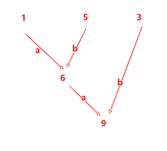
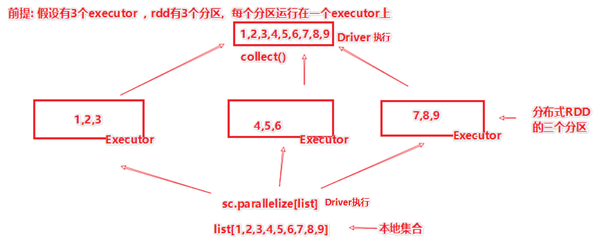
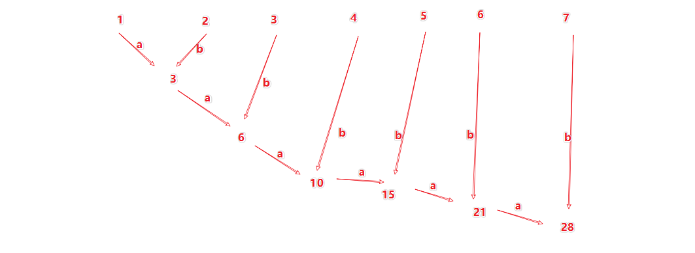
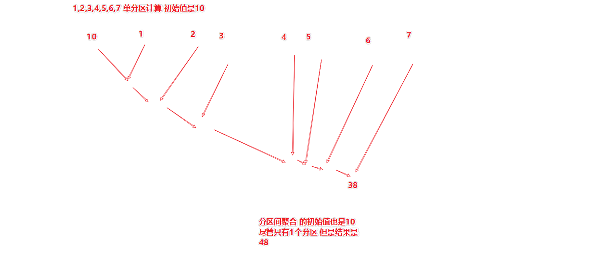
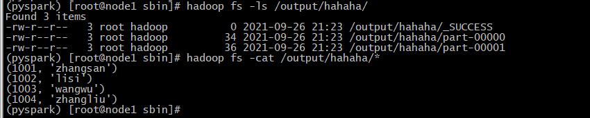

# 1- RDD算子 trasnformation

## 1-1 filter

定义: filter 会将rdd里面的数据, 依次传入filter所附带的方法中, 如果方法返回true 数据被保留, 返回false 数据就不要了.

语法:

```shell
rdd.filter(f: (T) -> boolean)
# filter接受一个方法传入, 方法的要求是  传入1个参数 返回布尔值
# 返回值是新RDD
```

```python
# coding:utf8
# 演示rdd的filter算子
from pyspark import SparkConf, SparkContext

if __name__ == '__main__':
    # 0. 构建Spark的执行环境入口对象SparkContext
    conf = SparkConf().setAppName("test").setMaster("local[*]")
    sc = SparkContext(conf=conf)

    rdd = sc.parallelize([1, 2, 3, 4, 5, 6])
    # 过滤奇数
    print(rdd.filter(lambda x: x % 2 == 1).collect())

    # 过滤小于4的数据
    def less_than_4(x):
        if (x < 4):
            return True
        else:
            return False

    print(rdd.filter(less_than_4).collect())
```


## 1-2 distinct 去重

语法:

```shell
rdd.distinct()
返回值是新RDD
```


```python
>>> rdd1 = sc.parallelize([1,2,3,3,3,5,5,6])
>>> rdd2 = rdd1.distinct()
>>> rdd2.collect()
[2, 6, 1, 3, 5]
```


## 1-3 案例Demo

数据:

```shell
{"id":1,"timestamp":"2019-05-08T01:03.00Z","category":"平板电脑","areaName":"北京","money":"1450"}|{"id":2,"timestamp":"2019-05-08T01:01.00Z","category":"手机","areaName":"北京","money":"1450"}|{"id":3,"timestamp":"2019-05-08T01:03.00Z","category":"手机","areaName":"北京","money":"8412"}
{"id":4,"timestamp":"2019-05-08T05:01.00Z","category":"电脑","areaName":"上海","money":"1513"}|{"id":5,"timestamp":"2019-05-08T01:03.00Z","category":"家电","areaName":"北京","money":"1550"}|{"id":6,"timestamp":"2019-05-08T01:01.00Z","category":"电脑","areaName":"杭州","money":"1550"}
{"id":7,"timestamp":"2019-05-08T01:03.00Z","category":"电脑","areaName":"北京","money":"5611"}|{"id":8,"timestamp":"2019-05-08T03:01.00Z","category":"家电","areaName":"北京","money":"4410"}|{"id":9,"timestamp":"2019-05-08T01:03.00Z","category":"家具","areaName":"郑州","money":"1120"}
{"id":10,"timestamp":"2019-05-08T01:01.00Z","category":"家具","areaName":"北京","money":"6661"}|{"id":11,"timestamp":"2019-05-08T05:03.00Z","category":"家具","areaName":"杭州","money":"1230"}|{"id":12,"timestamp":"2019-05-08T01:01.00Z","category":"书籍","areaName":"北京","money":"5550"}
{"id":13,"timestamp":"2019-05-08T01:03.00Z","category":"书籍","areaName":"北京","money":"5550"}|{"id":14,"timestamp":"2019-05-08T01:01.00Z","category":"电脑","areaName":"北京","money":"1261"}|{"id":15,"timestamp":"2019-05-08T03:03.00Z","category":"电脑","areaName":"杭州","money":"6660"}
{"id":16,"timestamp":"2019-05-08T01:01.00Z","category":"电脑","areaName":"天津","money":"6660"}|{"id":17,"timestamp":"2019-05-08T01:03.00Z","category":"书籍","areaName":"北京","money":"9000"}|{"id":18,"timestamp":"2019-05-08T05:01.00Z","category":"书籍","areaName":"北京","money":"1230"}
{"id":19,"timestamp":"2019-05-08T01:03.00Z","category":"电脑","areaName":"杭州","money":"5551"}|{"id":20,"timestamp":"2019-05-08T01:01.00Z","category":"电脑","areaName":"北京","money":"2450"}
{"id":21,"timestamp":"2019-05-08T01:03.00Z","category":"食品","areaName":"北京","money":"5520"}|{"id":22,"timestamp":"2019-05-08T01:01.00Z","category":"食品","areaName":"北京","money":"6650"}
{"id":23,"timestamp":"2019-05-08T01:03.00Z","category":"服饰","areaName":"杭州","money":"1240"}|{"id":24,"timestamp":"2019-05-08T01:01.00Z","category":"食品","areaName":"天津","money":"5600"}
{"id":25,"timestamp":"2019-05-08T01:03.00Z","category":"食品","areaName":"北京","money":"7801"}|{"id":26,"timestamp":"2019-05-08T01:01.00Z","category":"服饰","areaName":"北京","money":"9000"}
{"id":27,"timestamp":"2019-05-08T01:03.00Z","category":"服饰","areaName":"杭州","money":"5600"}|{"id":28,"timestamp":"2019-05-08T01:01.00Z","category":"食品","areaName":"北京","money":"8000"}|{"id":29,"timestamp":"2019-05-08T02:03.00Z","category":"服饰","areaName":"杭州","money":"7000"}
```


需求, 提取出所有北京的数据, 并将北京和类别组合在一起进行输出:

结果如:

```shell
# 输出为
北京_食品
北京_书籍
北京_电脑
......
```


代码:

```python
from pyspark import  SparkConf, SparkContext
import json
import  sys

if __name__ == '__main__':

    conf = SparkConf().setAppName("demo01")
        #.setMaster("spark://192.168.88.101:7077")
    sc = SparkContext(conf = conf)

    # 1- 读取数据文件
    file_rdd = sc.textFile(sys.argv[1])
    # file_rdd = sc.textFile("hdfs://192.168.88.101:8020/input/order.text")

    # 2- 将json提前出来
    json_rdd = file_rdd.flatMap(lambda line : line.split("|"))
    print(json_rdd.collect())

    # 3- 将json 字符串转换成字典数据
    dict_rdd = json_rdd.map(lambda  json_str : json.loads(json_str))
    print(dict_rdd.collect())

    # 4- 过滤北京
    beijing_rdd = dict_rdd.filter(lambda dict : dict['areaName'] == '北京')
    print(beijing_rdd.collect())

    # 5- 组合结果
    def city_category(data):
        city = data['areaName']
        category = data['category']
        return city + "_" + category

    result = beijing_rdd.map(city_category)
    print(result.collect() )


    result2 = beijing_rdd.map(lambda dict: dict['areaName'] + "_" + dict['category'])
    print(result2.collect())

    sc.stop()

```


## 1-4 Union算子

功能上: 让两个RDD合并在一起

语法:`rdd1.union(rdd2)`

```shell
>>> rdd1 = sc.parallelize([("a",1),("b",2)])
>>> rdd2 = sc.parallelize([("c",1),("b",3)])
>>> rdd1.union(rdd2)
UnionRDD[2] at union at NativeMethodAccessorImpl.java:0
>>> rdd1.union(rdd2).collect()
[('a', 1), ('b', 2), ('c', 1), ('b', 3)]                                        
>>> rdd1 = sc.parallelize([("a",1),("b",2)])
>>> rdd2 = sc.parallelize([1,2,3])          
>>> rdd1.union(rdd2).collect()
[('a', 1), ('b', 2), 1, 2, 3]
# 注意, 如上, 如果类型不一样进行union 也是不报错会成功的, 这里要注意.
```


## 1-5 groupByKey算子

功能: 自动按照key来进行分组,  分组后和groupBy算子是一致的, 不同的在于 groupByKey是自动按照key来分组

语法:`rdd.groupByKey()`

```python
# coding:utf8
import json
# 需求, 提取出所有北京的数据, 并将北京和类别组合在一起进行输出
from pyspark import  SparkConf,SparkContext

if __name__ == '__main__':
    conf = SparkConf().setAppName("groupByKey").setMaster("local[*]")
    sc = SparkContext(conf=conf)

    rdd1 = sc.parallelize([("a",1),("b",2),("a",3),("d",4)])

    print(rdd1.groupByKey().collect())


    result = rdd1.groupByKey().map(lambda t : (t[0],list(t[1])))
    print(result.collect())


    sc.stop()   

"""    
输出结果是:    
[('b', <pyspark.resultiterable.ResultIterable object at 0x7f82b47665b0>), 
('d', <pyspark.resultiterable.ResultIterable object at 0x7f82b474e790>), 
('a', <pyspark.resultiterable.ResultIterable object at 0x7f82b474ed00>)]    
由上可见, key同样的, 会在一个组内
组内的value会被放入一个迭代器中    
如果想把value打印出来, 需要将迭代器 转换成list     
"""    

print(rdd.groupByKey(). \          
      map(lambda x: (x[0], list(x[1]))))    

"""    
结果: [('b', [2]), ('d', [4]), ('a', [1, 3])]    
"""
```


## 1-6 reduceByKey算子

- 功能: 自动按照key分组,   应用传入的计算逻辑, 对同一个组内的数据执行 <font color='red'>聚合计算</font>


语法: 

```shell
rdd.reduceByKey(f:(T, T) -> T)

传入函数的要求:
1. 传入两个参数, 返回一个结果
2. 传入类型和返回类型一致传入的函数是一个聚合用途, 作用是将同一个组内的数据, 按照给定函数进行聚合

# 代码:# coding:utf8
import json
# 需求, 提取出所有北京的数据, 并将北京和类别组合在一起进行输出
import sysfrom pyspark import SparkConf, SparkContext
if __name__ == '__main__':    
# 构建Spark的执行环境    
	conf = SparkConf().setAppName("spark").setMaster("local[*]")    
	sc = SparkContext(conf=conf)    
	rdd = sc.parallelize([('hadoop', 1), ('hadoop', 5), ('hadoop', 3), ('flink', 1), ('flink', 5)])    
	
	print(rdd.reduceByKey(lambda a, b: a + b).collect())
```



如上图, 只看Hadoop组, hadoop的 1 5 3 三个数据, 是如何被reduce聚合的, 如上图.


## 1-7 foldByKey算子

- 功能: 同普通的fold基本相同, 就是会按照key进行分组

- 在组内进行:
  - \- 分区内带初始值聚合
  - \- 分区间<font color='red'>不</font>带初始值聚合

```shell
>>> rdd = sc.parallelize([('hadoop', 1), ('spark', 1), ('flink', 1), ('spark', 1), ('hadoop', 1), ('spark', 1), ('flink', 1), ('spark', 1)], 3)

>>> rdd.glom().collect( )
[[('hadoop', 1), ('spark', 1)], [('flink', 1), ('spark', 1)], [('hadoop', 1), ('spark', 1), ('flink', 1), ('spark', 1)]]

>>> rdd.foldByKey(10, lambda a, b: a + b).collect()
[('hadoop', 22), ('spark', 34), ('flink', 22)]
```

**<font color='red'>注意: foldByKey 分区间不带初始值聚合</font>**

``` python
from pyspark import SparkConf, SparkContext

if __name__ == '__main__':
    conf = SparkConf().setAppName("groupByKey").setMaster("local[*]")
    sc = SparkContext(conf=conf)

    rdd1 = sc.parallelize([('hadoop', 1), ('spark', 1), ('flink', 1), ('spark', 1), ('hadoop', 1), ('spark', 1), ('flink', 1), ('spark', 1)],1)

    print(rdd1.glom().collect())

    print(rdd1.foldByKey(10, lambda x, y: x + y).collect())

    rdd2 = sc.parallelize(
        [('hadoop', 1), ('spark', 1), ('flink', 1), ('spark', 1), ('hadoop', 1), ('spark', 1), ('flink', 1),
         ('spark', 1)], 3)

    print(rdd2.glom().collect())
    print(rdd2.foldByKey(10, lambda x, y: x + y).collect())

    sc.stop()

#结果: 

# 一个分区
[[('hadoop', 1), ('spark', 1), ('flink', 1), ('spark', 1), ('hadoop', 1), ('spark', 1), ('flink', 1), ('spark', 1)]]

[('hadoop', 12), ('spark', 14), ('flink', 12)]


# 3个分区
[[('hadoop', 1), ('spark', 1)], [('flink', 1), ('spark', 1)], [('hadoop', 1), ('spark', 1), ('flink', 1), ('spark', 1)]]

[('hadoop', 22), ('spark', 34), ('flink', 22)]
```


## 1-8 aggregateByKey算子

- 功能上, 和flodByKey基本差不多

- aggregateByKey 可以按照key分组, 并自定义:

- \- <font color='red'>分区内聚合逻辑</font>, 并可以带有初始值

- \- <font color='red'>分区间聚合逻辑</font>, <font color='red'>不</font>带初始值


- 不同点在于 aggregateByKey可以定义分区间的逻辑, 而fold是分区间和分区内是同样的逻辑


```shell
rdd = sc.parallelize([('a', 1), ('b', 1), ('a', 1), ('b', 1), ('a', 1)], 2)
# 常见的加减乘除等数学计算, 可以不用写 lambda a, b: a + b  可以直接用operator.add方法即可.
>>> from operator import add>>> rdd.aggregateByKey(10, add, add).collect()
```

``` python
from pyspark import SparkConf, SparkContext

if __name__ == '__main__':
    conf = SparkConf().setAppName("groupByKey").setMaster("local[*]")
    sc = SparkContext(conf=conf)

    rdd1 = sc.parallelize([('a',1),('b',1),('a',1),('b',1),('a',1)])
    print(rdd1.collect())
 
    # 初始值为0 
    print(rdd1.aggregateByKey(0, lambda x, y: x + y, lambda x, y: x + y).collect())

    # 初始值为 10 
    print(rdd1.aggregateByKey(10, lambda x, y: x + y, lambda x, y: x + y).collect())

    sc.stop()
    
[('a', 1), ('b', 1), ('a', 1), ('b', 1), ('a', 1)]
[('b', 2), ('a', 3)]
[('b', 22), ('a', 23)]

```


## 1-9 sortByKey算子

- 功能: 基于key来做排序

- 语法:


```shell
sortByKey(ascending=True, numPartitions=None, keyfunc=<function RDD.<lambda>>)
```


- 案例代码:


```shell
# 简单排序
>>> tmp = [('a', 1), ('b', 2), ('1', 3), ('d', 4), ('2', 5)]
>>> rdd = sc.parallelize(tmp)
>>> rdd.sortByKey().collect() 

# 升序排序[('1', 3), ('2', 5), ('a', 1), ('b', 2), ('d', 4)]  
>>> rdd.sortByKey(False).collect()	

# 降序排序[('d', 4), ('b', 2), ('a', 1), ('2', 5), ('1', 3)]
# 多分区排序
>>> sc.parallelize(tmp).sortByKey(True, 2).glom().collect()[[('1', 3), ('2', 5), ('a', 1)], [('b', 2), ('d', 4)]]
```

**注意**: 一旦排序的分区不是1个, 那么只能确保 <font color='red'>分区内有序</font>  分区间不确定

<font color='red'>如果要全局有序, 排序的时候一定给分区设置为 1</font>


```shell
# key处理排序
>>> sc.parallelize(tmp2).sortByKey(True, 1).collect()

[('Mary', 1), ('a', 3), ('fleece', 7), ('had', 2), ('lamb', 5), ('little', 4), ('was', 8), ('white', 9), ('whose', 6)]

# Mary是大写开头, 需求是, 要求统一按照小写进行排序, 可以使用第三个参数, key处理函数函数要求是将key穿进去, 你自行处理, 按照你的返回值进行排序

>>> sc.parallelize(tmp2).sortByKey(True, 1, lambda k:k.lower()).collect()

[('a', 3), ('fleece', 7), ('had', 2), ('lamb', 5), ('little', 4), ('Mary', 1), ('was', 8), ('white', 9), ('whose', 6)]

# 上面的lambda k:k.lower() 函数, 就让排序 全部按照小写计算.
```


## 1-10 Intersection算子

功能: 求两个RDD的交集

语法:`rdd1.intersection(rdd2)`

```shell
>>> rdd1 = sc.parallelize([("a",1),("b",2)])>>> rdd2 = sc.parallelize([("a",1),("b",3)])>>> rdd1.intersection(rdd2).collect()[('a', 1)]
```


## 1-11 countByValue 

- 功能: 按照value分组, 统计各个value有几个

- 返回值是: defaultdict (字典)


```python
>>> x = sc.parallelize([1,1,1,2,2,3]).countByValue()
>>> xdefaultdict(<class 'int'>, {1: 3, 2: 2, 3: 1})

# 可以看到, 按照value本身进行分组,计算value的个数
# 数据: [1,1,1,2,2,3]   
# 结果是:    1有3个   2有2个  3有1个
```


## 1-12 collect算子

- 功能: 将RDD的全部分区的数据, 都收集到一个 <font color='red'>本地list集合中</font>

- 语法: <font color='red'>list = rdd.collect()</font>  返回值是list对象

- 注意: 
  - **sc.parallelize是将本地集合 转向分布式；**
  - **collect是相反, 将分布式rdd 转向本地集合**；
- 注意: <font color='red'>collect 会将rdd所有分区的数据 统一收集到Driver内存中, 组合成一个本地list集合.</font>

- 注意: <font color='red'>在Spark代码中, 所有的RDD都运行在Executor,  所有的本地对象, 都运行在Driver上.</font>




## 1-13 reduce算子

- 功能: reduce算子, 会对RDD的数据集 进行两两计算,  计算的逻辑来自reduce接受的函数


- 语法:


```properties
rdd.reduce(f: (T, T) -> T)
返回值类型 是T
T如果是str , 传入参数都是字符串 返回值也是字符串
T如果是int , 传入参数都是int, 返回值也是int
```


```shell
rdd = sc.parallelize([1,2,3,4,5,6,7])rdd.reduce(lambda a, b: a + b)结果是28
```




分区的影响:

你的计算逻辑, 也是分区间做聚合的逻辑


注意: reduce一般用来做累加, 这样不用考虑分区. 如果非累加的话, 一般建议用`aggragate` 这样可以分开设置 分区内聚合 和分区间聚合


## 1-14 flod算子

功能: flod算子, 会对RDD的数据集 进行22计算,  计算的逻辑来自fold接受的函数 , 和reduce不同点在于, fold接收一个计算的初始值

语法:

```properties
rdd.fold(initValue,f: (T, T) -> T)
参数1: 是初始值
参数2: 是聚合逻辑的函数返回值类型 是T
T如果是str , 传入参数都是字符串 返回值也是字符串
T如果是int, 传入参数都是int, 返回值也是int
```


1,2,3,4,5,6,7的单分区聚合



- 1,2,3,4,5,6,7的双分区聚合
  - <font color='red'>多分区聚合的场景下, 我们结果也是需要做分区间聚合的</font>.
  - <font color='red'>分区内聚合 + 分区间聚合</font> 才是最终结果.


> fold一般很少有人用.
>
> 一般做累加 要么是reduce  要么是fold(0, func)


## 1-15 first算子

- 功能: 取RDD第一个元素


- 案例代码


```python
from pyspark import SparkConf, SparkContext

if __name__ == '__main__':
    conf = SparkConf().setAppName("groupByKey").setMaster("local[*]")
    sc = SparkContext(conf=conf)

    rdd1 = sc.parallelize([1,2,3,4,3,5])

    print(rdd1.first()) # 不排序， 直接取第一个元素;
    print(rdd1.take(4)) # 不排序， 直接取前4个元素;
    print(rdd1.top(4)) # 先降序排序， 再取前4个元素;

    sc.stop()
```


## 1-16 take算子

- 功能: 取RDD的前N个元素

- 用法:`rdd.take(N)`


```python
from pyspark import SparkConf, SparkContext

if __name__ == '__main__':
    conf = SparkConf().setAppName("groupByKey").setMaster("local[*]")
    sc = SparkContext(conf=conf)

    rdd1 = sc.parallelize([1,2,3,4,3,5])

    print(rdd1.first()) # 不排序， 直接取第一个元素;
    print(rdd1.take(4)) # 不排序， 直接取前4个元素;
    print(rdd1.top(4)) # 先降序排序， 再取前4个元素;

    sc.stop()
```


## 1-17 top算子

- 功能: 取RDD的前N个元素, 是<font color='red'>降序排序后</font>取的；

- 注意: 仅当<font color='red'>数据比较小</font>的时候才用它, 因为会将所有数据都传输到<font color='red'>Driver内存中排序</font>, <font color='red'>Driver顶不住</font>；

- 用法: 

  ``` python
  rdd.top(n)
  ```

- 案例代码


```python
from pyspark import SparkConf, SparkContext

if __name__ == '__main__':
    conf = SparkConf().setAppName("groupByKey").setMaster("local[*]")
    sc = SparkContext(conf=conf)

    rdd1 = sc.parallelize([1,2,3,4,3,5])

    print(rdd1.first()) # 不排序， 直接取第一个元素;
    print(rdd1.take(4)) # 不排序， 直接取前4个元素;
    print(rdd1.top(4)) # 先降序排序， 再取前4个元素;

    sc.stop()
```


## 1-18 count算子

- 功能: <font color='red'>统计RDD中有几条数据</font>

- 返回值是int


```python
>>> sc.parallelize([2, 3, 4]).count()
3
>>> sc.parallelize([2, 3, 4,1,1]).count()
5
```


## 1-19 takeSample算子

- 功能: 随机从RDD中抽取指定数量的数据, 用于对<font color='red'>RDD进行抽样</font>

- 用法:


```shell
takeSample(参数 1: True or False, 参数 2:采样数, 参数 3:随机数种子)
- 参数1: 是否允许抽样重复, true可以重复, false 不重复;如果抽要要的数据比数据集, 无法提供更多数据;
- 参数2: 你要几条;
- 参数3: 随机数的种子, 无所谓 数字随便给;
```

- 注意: <font color='red'>当给了第三个参数，每次获取的结果就是相同的；</font>

- 案例代码

```shell
rdd = sc.parallelize(range(0, 10))
>>> rdd.takeSample(True, 5) 
[9, 6, 9, 6, 3]
>>> rdd.takeSample(True, 5)
[1, 3, 9, 3, 6]>>> 
rdd.takeSample(True, 5)

# 上面代码, 咩有给随机数种子, 每一次种子是随机产生;

>>> rdd.takeSample(False, 5, 1)
[6, 8, 9, 7, 5]
>>> rdd.takeSample(False, 5, 1)
[6, 8, 9, 7, 5]
>>> rdd.takeSample(False, 5, 1)
[6, 8, 9, 7, 5] 
# 当设定了随机数种子后, 结果也一模一样了;

>>> rdd.takeSample(False, 20, 1)[6, 8, 9, 7, 5, 3, 0, 4, 1, 2]		
# 不允许重复, 要20个也给不了能给多少是多少

>>> rdd.takeSample(True, 20, 1)     
[0, 6, 3, 4, 3, 1, 3, 7, 3, 5, 3, 0, 0, 9, 6, 5, 7, 9, 4, 7] 
# 允许重复, 要多少给多少
```

``` python
from pyspark import SparkConf, SparkContext

if __name__ == '__main__':
    conf = SparkConf().setAppName("groupByKey").setMaster("local[*]")
    sc = SparkContext(conf=conf)

    rdd1 = sc.parallelize(range(0,10))
    print(rdd1.collect())

    list2 = rdd1.takeSample(False,5)  # False:不允许重复 , 并且不给第三个参数, 每次的结果都不一样;
    print(type(list2))
    print(list2)

    print(rdd1.takeSample(True, 5))  # # True:允许重复  , 并且不给第三个参数, 每次的结果都不一样;

    print(rdd1.takeSample(False, 5, 1))  # False:不允许重复 , 并且给定第三个参数, 每次的结果都一样;

    print(rdd1.takeSample(True, 5, 1))  # True:允许重复 , 并且给定第三个参数, 每次的结果都一样;

    sc.stop()
```


## 1-20 takeOrdered算子

- 功能: 按照自然顺序或者自定义的排序器 对rdd数据进行排序并取前N个

- 用法:


```shell
takeOrdered(n, [ordering])
- n 要几个
- [ordering] 排序的方法
```


```shell
>>> rdd.takeOrdered(3)
[1, 3, 5]
# 默认自然排序升序取前N个
# -----------------------------------------
>>> rdd.takeOrdered(3, lambda x:-x)
[13, 10, 9]
# 如果要降序排序, 就需要使用自定义函数 
# 这个函数就是让你处理一下数据, 让其自然排序的依据发生改变
```


``` python
from pyspark import SparkConf, SparkContext

from operator import add

if __name__ == '__main__':
    conf = SparkConf().setAppName("groupByKey").setMaster("local[*]")
    sc = SparkContext(conf=conf)

    rdd1 = sc.parallelize([3,6,2,8,0,11,16,26,36,9,13])

    print(rdd1.collect())

    print(rdd1.takeOrdered(5)) # 自然排序 升序 取前5个数字

    print(rdd1.takeOrdered(5, lambda x: -x)) # 自定义降序 取前5个数字

    sc.stop()
#结果：
[3, 6, 2, 8, 0, 11, 16, 26, 36, 9, 13]
[0, 2, 3, 6, 8]
[36, 26, 16, 13, 11]
	
```


## 1-21 foreach算子

功能: 和map一样, 接受给定的函数, 让rdd的每一个数据都被函数执行, 但是 抛弃返回值, foreach方法没有返回值

一句话理解, 就是一个没有返回值的`map`算子

```shell
words = sc.parallelize (["scala","java","hadoop","spark","akka","spark vs hadoop","pyspark","pyspark and spark and python"] )words.foreach(lambda x:print(x)) 结果:scalajavahadoopsparkakkaspark vs hadooppysparkpyspark and spark and python
```


> 一句话: foreach如果你要做什么操作, 请在函数内就执行了. 不要依靠返回值. 因为不返回东西.
>
> 如果你要返回值, 请用map


## 1-22 saveAsTextFile算子

- 功能: 负责将RDD的数据写出到指定的文件中(支持本地和HDFS以及其它的(S3))

- 用法: `rdd.saveAsTextFile("file:///  或者 hdfs://")`

  

- **注意**: 

  1. 这个算子 是分布式执行的, 也就是数据<font color='red'>不会经过Driver中转.</font> 所以写文件, 是<font color='red'>Executor来执行</font>的；
  2. 如果在集群分布式模式下, 要写出数据 <font color='red'>最好写入到HDFS</font>, 因为分布式下, 写本地的话, 数据是零散保存在各个机器上；

- 案例代码

``` python
from pyspark import SparkConf, SparkContext

from operator import add

if __name__ == '__main__':
    conf = SparkConf().setAppName("groupByKey").setMaster("local[*]")
    sc = SparkContext(conf=conf)
    sc.setLogLevel("WARN")

    rdd1 = sc.parallelize([(1001, "zhangsan"), (1002, "lisi"), (1003, "wangwu"), (1004, "zhangliu")])

    rdd1.saveAsTextFile("hdfs://192.168.88.101:8020/output/hahaha")

    sc.stop()

```


- 结果: 




## 1-23 (重点理解)注意foreach和saveAsTextFile 算子

- foreach和saveAsTextFile 算子, 是由<font color='red'> Executor 所执行的</font>. **数据不会经过Driver**;


## 1-24 mapPartitions算子

- 功能: 将RDD的数据, 按照分区, 一次一整个分区的传递给 函数执行计算;

- 和map差不多, 只不过map是一条条计算, mapPartitions是一次算一整个分区的数据;


代码:

```python
from pyspark import SparkConf, SparkContext

if __name__ == '__main__':
    conf = SparkConf().setAppName("groupByKey").setMaster("local[*]")
    sc = SparkContext(conf=conf)

    rdd1 = sc.parallelize([1,2,3,4,5,6,7,8,9],3)

    print(rdd1.collect())

    # 推导式方法
    def add_one(it):
        print("哈哈哈")
        for i in it:
            yield  i + 1  # 推导式

    # 常规方法
    def addOne(it):
        print("嘿嘿嘿")
        lst = list()
        for i in it:
            lst.append(i + 1)

        return lst


    print(rdd1.mapPartitions(add_one).collect())
    print(rdd1.mapPartitions(addOne).collect())

    sc.stop()
```

### 1-24-2 foreach,foreachPartition,foreachRDD区别是什么？

- 处理对象不一样：

  - **foreach: 一条条数据；**
  - **foreachPartition:分区；**
  - **foreachRDD ： RDD**;


- 总结：
  - map 						处理每一条数据 并返回；
  - foreach                    处理每一条数据 无返回；
  - mapPartition          处理每个分区数据 并返回；
  - foreachPartition     处理每个分区数据 无返回；
  - <font color='red'>transform(mapRDD)                处理DStream中的每个RDD  并返回；</font>
  - <font color='red'>foreachRDD             处理DStream中的每个RDD  无返回；</font>
  - **注意还有一个foreachBatch： 是StructuredStreaming 中的算子，处理流中一个批次的数据；**


## 1-25 foreachPartition算子

- 功能: 和mapPartition一样, 一次处理一整个分区的数据, 不同的是 foreachPartition没有返回值


代码:

```python
from pyspark import SparkConf, SparkContext

if __name__ == '__main__':
    conf = SparkConf().setAppName("groupByKey").setMaster("local[*]")
    sc = SparkContext(conf=conf)

    rdd1 = sc.parallelize([1,2,3,4,5,6,7,8,9],3)

    # 常规方法
    def printNum(it):
        print("嘿嘿嘿")
        for i in it:
            print(i + 1)

    rdd1.foreachPartition(printNum)

    sc.stop()
```

注意: 

- mapPartitions   最后带s
- foreachPartition 最后不带s


## 1-26 repartition算子

- 功能: 重新对RDD执行分区, 返回带有新分区数量的`新`RDD

- 用法: `rdd.repartition(num)`


```shell
rdd = sc.parallelize([1,2,3,4,5,6,7,8,9], 3) 
# 构建3分区rdd

>>> rdd.glom().collect()						
# 打印分区分布[[1, 2, 3], [4, 5, 6], [7, 8, 9]]

>>> rdd.repartition(2).glom().collect()		
# 缩减为2分区[[1, 2, 3, 7, 8, 9], [4, 5, 6]]

>>> rdd.repartition(5).glom().collect()		
# 增加到4分区[[], [1, 2, 3], [7, 8, 9], [4, 5, 6], []]
```


- 注意: 虽然可以对分区进行增加 以及减少

- 但是, 建议 <font color='red'>不要轻易增加分区, 可以减少分区</font>


- 增加分区, 会导致 出现计算的 `shuffle`


- shuffle很消耗性能, 尽量避免.


## 1-27 coalesce算子

- 功能: 对分区数量进行增加或者减少,   <font color='red'>默认是减少分区 </font>, 如果要增加分区, 需要给定特定参数


- 参数1:  新分区数量

- 参数2: 是否运行shuffle ( 是否可以增加分区)


```shell
>>> rdd = sc.parallelize([1,2,3,4,5,6,7,8,9], 3)
>>> rdd.coalesce(2).glom().collect()	# 减少分区没问题
[[1, 2, 3], [4, 5, 6, 7, 8, 9]]

>>> rdd.coalesce(5).glom().collect()  # 增加分区 不响应, 还是三个分区不变
[[1, 2, 3], [4, 5, 6], [7, 8, 9]]>>> 

rdd.coalesce(5, True).glom().collect() # 真的要增加分区, 请给shuffle参数给True才可以
[[], [1, 2, 3], [7, 8, 9], [4, 5, 6], []]
```


- 所以, 一般对于分区的修改, 我们使用这个算子<font color='red'> 更加的安全</font>.


## 1-28 glom算子

- 功能: 将RDD的 **每个分区数据 放入一个集合中**,  这一堆分区的<font color='red'>集合组合在一起,</font> 返回新RDD


```shell
>>> rdd.coalesce(5, True).glom().collect()
[[], [1, 2, 3], [7, 8, 9], [4, 5, 6], []]

# 可以看到, 每个分区的数据, 都在一个[] list中.
# 这样输出出来 可以很明显看到 各个分区的数据排布
```


## 1-29 partitionBy算子

- 惯例: <font color='red'>当我们看到 带有xxxBy的算子 但是没有写 by what, 表示需要你给出 by what</font>.

- 功能: 给定一个函数, 基于这个函数的计算, 来确定对数据的分区划分. 这个函数, 需要范围每一条数据应该所处的分区ID. 
  - 分区ID的范围是 从 <font color='red'>0到 分区数量-1</font>

  - 比如: 有3个分区, 分区ID只能是0, 1, 2


- 这个算子, 如果不给定分区函数, <font color='red'>默认按照Hash分区</font>.


- 用法:


``` properties
rdd.partitionBy(numPartitions, [function: (K) -> int])
```

- 参数1: 要分几个区	


- 参数2: 自定义分区逻辑(可选), <font color='red'>不给默认是Hash分区器</font>
- 注意： 

  - partitionBy算子, <font color='red'>只能对 KeyValue型的RDD执行操作</font>；
  - 参数2  自定义分区逻辑, 接受的是数据的**<font color='red'>key </font>** 


```shell
rdd = sc.parallelize([('a', 1), ('b', 1), ('a', 1)])

>>> rdd.partitionBy(2).glom().collect()
[[('b', 1)], [('a', 1), ('a', 1)]]  # 默认按照Hash分区器分区

>>> rdd = sc.parallelize([('a', 1), ('b', 1), ('c', 1)])    

>>> rdd.partitionBy(2, lambda x:0 if (x == 'a' or x == 'b') else 1).glom().collect()[[('a', 1), ('b', 1)], [('c', 1)]]

#上面代码, 自定义了分区器, 如果是a 和 b 在分区0, 除此之外 在分区1
```

``` python
from pyspark import SparkConf, SparkContext

if __name__ == '__main__':
    conf = SparkConf().setAppName("groupByKey").setMaster("local[*]")
    sc = SparkContext(conf=conf)

    rdd1 = sc.parallelize([('a', 1), ('b', 1), ('c', 2)],2) ## 默认随机分区

    print(rdd1.glom().collect())
    print(rdd1.partitionBy(2).glom().collect())  ## 默认Hash分区

    print(rdd1.partitionBy(2, lambda k: 0 if (k == "a" or k == "b") else 1).glom().collect())  ## 自定义分区规则


    sc.stop()
```


## 1-30 mapValues算子

- 功能: mapValues算子可以 <font color='red'>针对 KV型 (二元元组) </font>数据进行map, map逻辑仅针对value


```shell
rdd = sc.parallelize([("a", 1), ("a", 2), ("b", 3), ("b", 4)])
>>> rdd.groupByKey().collect()
[('b', <pyspark.resultiterable.ResultIterable object at 0x7ff05f669250>), ('a', <pyspark.resultiterable.ResultIterable object at 0x7ff05fe83340>)]

# 想要将分组后的数据, value转换成list可以有# 方法1: 通过map来做,  做的时候可以看到, 只是对value进行处理
>>> rdd.groupByKey().map(lambda x:(x[0], list(x[1])  )).collect()
[('b', [3, 4]), ('a', [1, 2])]

# 方法2: 通过mapValues来做, 仅对value进行处理
>>> rdd.groupByKey().mapValues(lambda x:list(x)).collect() 
# 只将value转换成list 
[('b', [3, 4]), ('a', [1, 2])]
```

``` python
from pyspark import SparkConf, SparkContext

if __name__ == '__main__':
    conf = SparkConf().setAppName("groupByKey").setMaster("local[*]")
    sc = SparkContext(conf=conf)

    rdd1 = sc.parallelize([('a', 1), ('b', 2), ('a', 3),('b',4)])

    print(rdd1.groupByKey().collect())
    print(rdd1.groupByKey().map(lambda t : (t[0],list(t[1]))).collect()) # map 针对于每个元素(二元元组)

    print(rdd1.groupByKey().mapValues(lambda v: list(v)).collect()) # map 针对于每个元素(二元元组) 中的value;

    sc.stop()
```


# 2- 补充: groupByKey 和 reduceByKey的区别

API区别:

- groupByKey是 只关系 分区, <font color='red'>不带有计算逻辑</font>

  `rdd.groupByKey()`

- reduceByKey 即关心分组(按照key分组), 同时<font color='red'>定义 计算逻辑</font>

  `rdd.reduceByKey(lambda a, b: a + b)`


在做数据聚合方面的区别:

- groupByKey 不带聚合逻辑, 后面要接上聚合逻辑

  ```shell
  >>> rdd = sc.parallelize([("a", 1), ("b", 2), ("a", 3), ("b", 4)])>>> rdd.groupByKey().mapValues(lambda x:sum(x)).collect()[('b', 6), ('a', 4)]# 如上代码, groupByKey如果要做聚合, 需要自己后面写上聚合的逻辑, 如上的mapValues
  ```

- reduceByKey ,自带聚合逻辑, 更加方便.


## 2-1 重点核心区别（性能）:

- <font color='red'>性能不同</font>
- **如果做聚合计算, reduceByKey的性能 要远远好于 groupByKey + 自定义聚合逻辑的组合**


- groupByKey
  - 如果, 是groupBykey + 自定义聚合逻辑的执行.
  - 可以看到是, <font color='red'>先分组</font>, 走完全部数据的分组后, 才能让聚合逻辑干活
  - 这个shuffle过程是很大的消耗


- reduceByKey
  - 如图, 这是reduceByKey的逻辑;
  - 由于自带聚合逻辑, 完全可以在 <font color='red'>shuffle之前</font> 先做一下聚合, 然后将结果在分组发送, 最后做最终聚合;
  - 这样的 <font color='red'>预聚合</font> 操作, 可以极大的节省 <font color='red'>shuffle的开销</font>, 极大的提高性能.


## 2-2 Join算子


### 2-2-1 回顾SQL JOIN 

- 内连接 Inner JOIN: 左右两个表都匹配上才能出现结果
- 左外连接: 以左表为准, 左表有的必须出现, 右表必须匹配上左表才能出现
- 右外连接: 和左外相反, 以右表为准


### 2-2-2 JOIN算子

功能: 在两个 KeyValue型的RDD之间 执行内连接, 连接的条件是 key相等.


```shell
>>> x = sc.parallelize([(1001, "zhangsan"), (1002, "lisi"), (1003, "wangwu"), (1004, "zhangliu")])

>>> y = sc.parallelize([(1001, "sales"), (1002, "tech")]) 

>>> x.join(y).collect()[(1001, ('zhangsan', 'sales')), (1002, ('lisi', 'tech'))]

# 如上代码, 自动按照key来进行内连接# 将连接上的数据集的value 组合到一个元组中.
```


### 2-2-3 LeftOuterJoin 算子

功能: 在两个 KeyValue型的RDD之间 执行左外连接, 连接的条件是 key相等.

```shell
>>> x = sc.parallelize([(1001, "zhangsan"), (1002, "lisi"), (1003, "wangwu"), (1004, "zhangliu")])

>>> y = sc.parallelize([(1001, "sales"), (1002, "tech")]) 

>>> x.join(y).collect()
[(1001, ('zhangsan', 'sales')), (1002, ('lisi', 'tech'))]
>>> 
>>> 
>>> x.leftOuterJoin(y).collect()
[(1004, ('zhangliu', None)), (1001, ('zhangsan', 'sales')), (1002, ('lisi', 'tech')), (1003, ('wangwu', None))]

>>>
```


### 2-2-4 RightOuterJoin算子

功能: 是左外连接 反过来 以右边为准

```shell
>>> x.rightOuterJoin(y).collect()

[(1001, ('zhangsan', 'sales')), (1002, ('lisi', 'tech'))]
```


# 3- 补充 - sys模块

通过sys模块的argv属性, 来帮助 获取 执行的时候的动态参数传入

```python
import sysif __name__ == '__main__':  print(sys.argv[0])  print(sys.argv[1])  print(sys.argv[2])  print(sys.argv[3])
```

如上代码, 执行: `python3 a.py haha  heihei hehe`

输出结果是:

```shell
a.pyhahaheiheihehe
```


可以看到, 

- sys.argv[0] 是文件名
- sys.argv[1] 参数1
- sys.argv[2] 参数2
- sys.argv[N] 参数N


