# 1- RDD的持久化\缓存 cache/persist


## 1-1 RDD的数据是过程数据

- 示例代码:


```python
rdd = sc.textFile('xxx')
rdd1 = rdd.map(xxx)
rdd2 = rdd1.flatMap(xxx)
rdd3 = rdd2.reduceByKey()
result = rdd3.collect()

rdd2.fliter().collecet()

# 从编程的角度来看, rdd2对象 是已经构建好的, 所以二次 三次 用它, 都是可以直接用
# 从Spark RDD的角度来看, 当你第二次使用rdd2的时候, 它会执行 读取文件得到rdd, 将rdd执行map得到rdd1, 对rdd1执行flatMap得到rdd2
# 也就是, 会将RDD2前面的流程再走一遍
```


- Spark中的RDD的数据都是 <font color='red'>过程数据 </font>
  - 也就是, 一个RDD1 生成了 RDD2, 那么RDD1的数据就不存在了. RDD2 变成了 RDD3 , 那么RDD2的数据就不存在了；
  - 所以, 上面代码 第七行, 第二次用rdd2的时候, 会将前面的rdd rdd1 都再执行一遍.


## 1-2 缓存\持久化

- RDD的数据 都是<font color='red'>过程数据</font>, 但是我们可以通过 <font color='red'>缓存\持久化的API</font>告知Spark, 某个RDD 我要重复用它, <font color='red'>不要清理数据,</font> 给我保留下来；


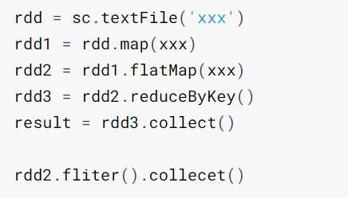

- 对于这个代码, 如果我们将rdd2 标记为缓存, 当第二次使用rdd2的时候, 可以直接用它的数据, rdd2 无需再次计算出来.


- 概念上: 缓存就是将RDD的数据  <font color='red'>临时</font> 的保存下来


### 1-2-1 优缺点

- 优点:
  - 缓存可以<font color='red'>让某个RDD的数据 不会被Spark清理掉</font>, 而是保留下来, 可以重复使用 避免重复计算它；

- 缺点:
  - **缓存是不可靠的, 有可能丢失, 如果丢失, 还是要重新计算**.
  - **缓存对于内存的占用还是有一定的消耗的.**


> **虽然缓存 会额外消耗内存, 在我们知道某个RDD会重复用的时候, 将其缓存下来, 还是能够提高性能的.**


## 1-3 API cache/persist

- 缓存RDD


```shell
from pyspark.storagelevel import StorageLevel
rdd.cache()    # 将RDD的数据, 缓存到内存中.
rdd.persist()  # 将RDD的数据, 缓存到内存中.
rdd.persist(StorageLevel.MEMORY_ONLY)  # 缓存到内存中
rdd.persist(StorageLevel.MEMORY_ONLY_2)# 缓存到内存中, 2个副本
rdd.persist(StorageLevel.MEMORY_AND_DISK)  # 缓存到内存+硬盘, 先内存, 内存不足放硬盘
rdd.persist(StorageLevel.MEMORY_AND_DISK_2)  # 缓存到内存+硬盘, 先内存, 内存不足放硬盘, 2个副本
rdd.persist(StorageLevel.OFF_HEAP)     # 放到系统内存中
rdd.persist(StorageLevel.DISK_ONLY)    # 仅放到硬盘中缓存
rdd.persist(StorageLevel.DISK_ONLY_2)  # 仅放到硬盘中缓存, 2个副本
rdd.persist(StorageLevel.DISK_ONLY_3)  # 仅放到硬盘中缓存, 3个副本
```


- 清理rdd的缓存


```shell
rdd.unpersist()	# 清理这个RDD的缓存
```


## 1-4 特点

1. 缓存会记录下来 被缓存RDD的前置血缘关系

   > 因为缓存不安全, 如果缓存丢失, 可以通过记录的血缘关系, 再次执行前置的流程, 获取到当前RDD的数据

2. 缓存代码 会在之后遇到的第一个Action开始执行.

   本质上是因为, 缓存的RDD, 在遇到Action后才会出现.


为什么缓存不安全:

1. 内存: Spark的计算内存是紧张的, 如果内存不足用以计算, Spark 会将缓存直接删除.
2. 硬盘: 缓存的数据是放到本地硬盘中. 本地硬盘不像HDFS那样安全, 所以也是可能丢失数据的.


# 2- RDD的CheckPoint机制

- 概念: 将当前RDD的数据, 保存到外部存储系统中

- CheckPoint和缓存的对比


| 功能             | 缓存/持久化                       | CheckPoint                        |
| ---------------- | --------------------------------- | --------------------------------- |
| 功能             | 将RDD的数据缓存起来               | 将RDD当前的数据保存到外部系统中   |
| 存储介质         | 内存+本地硬盘                     | 外部存储系统, 比如本地文件\HDFS等 |
| 性能             | 快                                | 慢于缓存                          |
| 是否保留血缘关系 | 保留                              | 不保留                            |
| 定位             | 临时不安全存储RDD数据             | 长期并`安全`存储                  |
| 场景             | 不重要但重复使用的RDD可以缓存下来 | 重要RDD可以使用CheckPoint保留下来 |

> CheckPoint是不保留血缘关系, 而缓存保留
>
> 因为:
>
> 1. CheckPoint从定位上来说, 定位为安全存储 也就是可以放HDFS了, 不保留血缘关系 因为认为不会丢
> 2. CheckPoint保留的数据 可以认为是一个快照, 这个快照比缓存生成更难, 保存起来更容易


## 2-1 API checkpoint

```python
# 1. 先设置CheckPoint保存数据的地方
sc.setCheckpointDir("hdfs://node1:8020/output/ckp")

# 2. 选择你要保存的rdd 调用checkpoint方法保存即可
rdd.checkpoint()

# 3. 和缓存一样, checkpoint也需要action触发, 因为有了action rdd才存在
```


如图, 可以看到, 当前rdd的数据 被写入到了HDFS之上, 做数据安全存储

当用到数据的时候, 是直接从缓存中提取的:

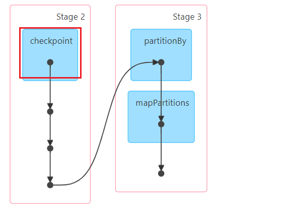


# 3- 对比缓存和CheckPoint的性能

## 3-1 缓存 cache

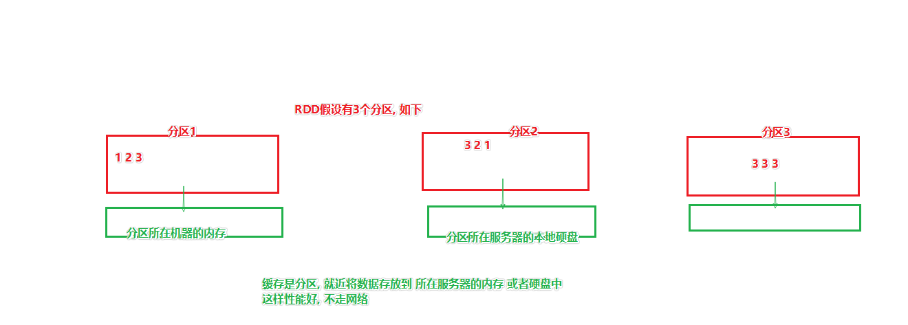


## 3-2 CheckPoint

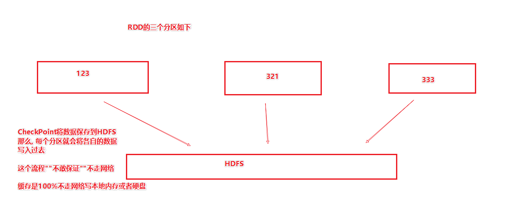


## 3-3 总结

- CheckPoint将<font color='red'>数据写入HDFS</font>, **不能保证 读和写 不网络传输数据**

- 缓存由于<font color='red'>写本地内存或者硬盘</font>, **100% 读和写 不会通过网络传输数据**

- 性能也就在这个地方凸显了.

- 访问时间\t用户ID\t[查询词]\t该URL在返回结果中的排名\t用户点击的顺序号\t用户点击的URL

- 昨天3点,  用户123, 搜索了王者荣耀外挂, 1, 3, xxx.waigua.com


# 4- 案例

## 4-1 安装jieba库

使用:

在你的虚拟环境中执行:

```shell
# 使用python官方的仓库, 而不是conda的库
pip install jieba -i https://pypi.tuna.tsinghua.edu.cn/simple

# 不要使用conda install, 因为conda中没有jieba
```


## 4-2 jieba库的简单入门

```python
# coding:utf8
# 测试 jieba 分词工具库

import jieba

if __name__ == '__main__':
    words = '我明天要去清华报到了, 拜拜小的们'

    # 参数1 是被分词的数据, 参数2: True表示词汇会组合 形成更多关键字, False表示从头到尾过一遍 提取出来就好 不会组合
    segs = jieba.cut(words, True)
    print(','.join(segs))

    segs = jieba.cut(words, False)
    print(','.join(segs))

    # 搜索引擎模式, 尽量的组合关键词, 等同于 cut(True)
    segs = jieba.cut_for_search(words)
    print(','.join(segs))
```


## 4-3 代码实现

```python
# coding:utf8

# 演示RDD算子案例, 搜索引擎数据简单分析

from pyspark import SparkConf, SparkContext
from defs import word_extract, filter, word_transformation, user_with_word
from pyspark.storagelevel import StorageLevel

if __name__ == '__main__':
    # 0. 构建Spark的执行环境入口对象SparkContext
    conf = SparkConf().setAppName("demo").setMaster("local[*]")
    sc = SparkContext(conf=conf)

    # 需求:
    # 1. 对热门关键词找出TOP5
    # 2. 对热门用户+关键词 找出TOP5
    # 3. 统计个各时时间段的热门度

    # 数据 23:00:01	20251553549853485	itcast	2	1	http://www.itcast.cn
    # 时间\用户ID\搜索关键词\返回URL排名\点击URL顺序\访问的URL
    # 数据的分隔符是 \t

    # 0. 读取数据
    file_rdd = sc.textFile("../../data/SogouQ.txt")

    # TODO 需求1: 关键词分析
    # 1.1 提取出来关键词
    split_rdd = file_rdd.map(lambda x: x.split('\t'))

    # 将split_rdd 加入缓存(或者CheckPoint)
    split_rdd.persist(StorageLevel.MEMORY_ONLY)


    search_rdd = split_rdd.map(lambda x: x[2])

    # 1.2 对搜索内容进行分词, 得到关键词列表
    words_rdd = search_rdd.flatMap(word_extract)

    # 1.3 对异常分词进行处理
    # 传智播客 -> 传智播,客
    # 博学谷 -> 博学,谷
    # 院校帮 -> 院校,帮
    # 1.3.1 先过滤掉 客\谷\帮
    filtered_words_rdd = words_rdd.filter(filter)
    # 1.3.2 处理 传智播\博学\院校
    final_words_rdd = filtered_words_rdd.map(word_transformation)
    # 1.4 对单词 附加1 并分组求和
    grouped_rdd = final_words_rdd.map(lambda x: (x, 1)). \
        reduceByKey(lambda a, b: a + b)
    # 1.5 对数据执行排序 并取前5个
    result1 = grouped_rdd.sortBy(lambda x: x[1], False, 1). \
        take(5)

    print('需求1结果:', result1)

    # TODO 需求2: 求热门用户+关键词
    # 2.1 提取出 用户ID + 搜索内容
    user_with_search_rdd = split_rdd.map(lambda x: (x[1], x[2]))
    # 6252780199205116	传智专修学院
    # 6252780199205116_传智
    # 6252780199205116_学员
    # 6252780199205116_传智专修学员
    # 2.2 对用户搜索的内容进行分词, 并将词绑定到用户ID上
    user_with_word_rdd = user_with_search_rdd.flatMap(user_with_word)
    # 2.3 执行 单词计数逻辑
    result2 = user_with_word_rdd.map(lambda x: (x, 1)). \
        reduceByKey(lambda a, b: a + b). \
        sortBy(lambda k: k[1], False, 1). \
        take(5)
    print("需求2的结果:", result2)

    # TODO 需求3: 统计热门时段
    # 3.1 提取出所有的小时
    hours_rdd = split_rdd.map(lambda x: x[0].split(":")[0])
    # 3.2 wordcount
    result3 = hours_rdd.map(lambda x: (x, 1)). \
        reduceByKey(lambda a, b: a + b). \
        sortBy(lambda k: k[1], False, 1). \
        collect()
    print("需求3的结果:", result3)

    # 不要忘记取消缓存
    split_rdd.unpersist()

    sc.stop()
```


## 4-4 提交到集群运行


注意:

1. 将代码中的master删除
2. 将代码中的路径修改为HDFS路径( 文件自行上传到HDFS )


注意:

`每一台服务器都要安装jieba库`

```shell
$ANACONDA_HOME/envs/pyspark/bin/python -m pip install jieba -i https://pypi.tuna.tsinghua.edu.cn/simple
```


简易提交

```shell
/export/server/spark/bin/spark-submit --master yarn --deploy-mode client --py-files /home/hadoop/demo/defs.py /home/hadoop/demo/main.py# 在里面将依赖的defs.py文件, 通过--py-files参数指定/export/server/spark/bin/spark-submit --master yarn --deploy-mode client --py-files /home/hadoop/demo/defs.zip /home/hadoop/demo/main.py# 如上, 你也可以指定 xxx.zip  来将更多的依赖包 装进zip压缩包后使用
```


榨干集群性能提交

```shell
/export/server/spark/bin/spark-submit --master yarn --deploy-mode client --num-executors 6 --executor-memory 2g --executor-cores 1 --py-files /home/hadoop/demo/defs.zip /home/hadoop/demo/main.py经过计算, 当前集群可以提供 12G内存 6个CPU核心可用.计算后: - executor 开6个 --num-executors 6- 每个吃2G内存 --executor-memory 2g- 吃1个CPU核心 --executor-cores 
```


# 5- 广播变量

概念: 将一个变量标记为广播变量后, 这个变量 如果要和RDD的数据进行关联, 这个变量将会被广播到每一个Executor的内存上.


为什么要这样做呢?

因为, 如果不将其标记为广播变量, 这个变量会被发送到 每一个`分区上`

如果标记了, 只给每个Executor发送. 这样, 由于Executor内可以运行许多分区, Executor拿到一份, 就等同于内部分区都能拿到.


通过广播变量优化了:

1. 内存占用, 从每一个分区(Task)都有一份, 变成了 Executor独一份, 内部分区共享
2. 节省了网络IO,  因为发送的数据量少了, 网络的开销也低了.

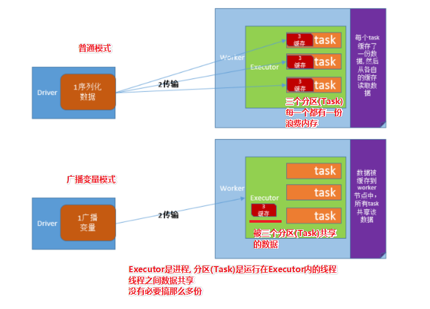


代码

```shell
# 1. 注册广播变量broadcast = sc.broadcast(stu_dict)# 2. 使用广播变量( 在rdd的算子中 )data = broadcast.value就取到了data, 用就行了
```


```python
# coding:utf8# 演示Spark的广播变量from pyspark import SparkConf, SparkContextif __name__ == '__main__':    # 0. 构建Spark的执行环境入口对象SparkContext    conf = SparkConf().setAppName("demo").setMaster("local[*]")    sc = SparkContext(conf=conf)    # 1. 读取数据    # 1.1 读取学生的分数数据    score_rdd = sc.textFile("../data/stu_score.txt").\        map(lambda x:x.split(','))    # 1.2 读取学生的名字数据, 把它转换成字典数据, key是id  value是name    stu_dict = sc.textFile("../data/stu_info.txt").\        map(lambda x:x.split(',')).\        collectAsMap()    # 2. 将stu_dict 字典数据 转变成广播变量 广播出去    # 因为score_rdd 是rdd, 底层是有分区的, 那么 广播变量可以发送到每一个executor上    # 节省内存    # 2.1 将学生信息 注册成广播变量    broadcast = sc.broadcast(stu_dict)    # 3. 执行业务逻辑, 让分数和学生姓名进行匹配    def get_stu_name(data):        stu_id = data[0]        # 在算子内部, 我们用广播变量        stu_names = broadcast.value # 这里要使用广播变量 而不要用普通的stu_dict变量                                    # 因为用stu_dict变量, 就没有用到广播                                    # 这个变量会发送到score_rdd的每一个分区上, 浪费内存        stu_name = stu_names.get(stu_id)        if not stu_name: stu_name = '未知的学生'        return (stu_name, data[1], data[2])    result = score_rdd.map(get_stu_name)    print(result.collect())
```


# 6- 累加器

如果在分布式系统中, 想在RDD计算中完成值的累加, 是比较困难的.

因为, RDD底层是有分区的, 各个分区各自为战, 各自累加各自的

所以, 最终整体结果是不准确的.


如果要进行整体(不理会分区)的累加, 可以使用Spark提供的累加器


不使用累加器的代码

```python
# coding:utf8# 演示没有累加器的累加情况from pyspark import SparkConf, SparkContextif __name__ == '__main__':    # 0. 构建Spark的执行环境入口对象SparkContext    conf = SparkConf().setAppName("test").setMaster("local[*]")    sc = SparkContext(conf=conf)    data = sc.parallelize(range(0, 100), 4)    count = 0    def accumulate(data):        global count        count += 1        print(str(count) + '|||')    data.foreach(accumulate)    # 结果整体不是准确的
```


使用累加器的代码:

```python
# coding:utf8# 演示Spark的累加器from pyspark import SparkConf, SparkContextif __name__ == '__main__':    # 0. 构建Spark的执行环境入口对象SparkContext    conf = SparkConf().setAppName("test").setMaster("local[*]")    sc = SparkContext(conf=conf)    # 1. 注册一个累加器对象, 参数是初始值    acmlt = sc.accumulator(0)    data = sc.parallelize(range(0, 100), 4)    def accumulate(data):        global acmlt        acmlt += 1        print(str(acmlt) + '|||')    data.foreach(accumulate)    print("最终累加器的值:", acmlt)# 直接累加acmlt这个累加器对象即可.# 最终结果准确.
```


## 6-1 累加器的注意事项


由于累加器是作用在RDD的算子内的

要注意, 如果有多个action存在, 那么很有可能累加器所在的算子 会被这多个action 执行多次


如下代码:

```python
# coding:utf8# 演示Spark的累加器from pyspark import SparkConf, SparkContextif __name__ == '__main__':    # 0. 构建Spark的执行环境入口对象SparkContext    conf = SparkConf().setAppName("test").setMaster("local[*]")    sc = SparkContext(conf=conf)    # 1. 注册一个累加器对象, 参数是初始值    acmlt = sc.accumulator(0)    data = sc.parallelize(range(0, 100), 4)    def accumulate(data):        global acmlt        acmlt += 1        print(str(acmlt) + '|||')        return 1    rdd = data.map(accumulate)    rdd.count()	    # rdd这个对象, 这是第二次使用了. 这一次使用, 会导致前面使用累加器的map 第二次执行    rdd.map(lambda x: x + 1).collect()    print("最终累加器的值:", acmlt)	# 结果是200
```


`一定要注意到有这个现象`


如何解决

通过对rdd加缓存 或者放入CheckPoint


## 6-2 累加器和广播变量的案例

### 6-2-1 数据

文本数据

```shell
   hadoop spark # hadoop spark sparkmapreduce ! spark spark hive !hive spark hadoop mapreduce spark %   spark hive sql sql spark hive , hive spark !!  hdfs hdfs mapreduce mapreduce spark hive  #
```


特殊字符规则数据:

```shell
[",", ".", "!", "#", "$", "%"]
```


### 6-2-2 需求

1. 分别对正常单词做WordCount, 求出每个正常单词的数量

2. 以及, 统计一下特殊字符的个数

 

思路:

特殊字符作为匹配规则, 可以用广播变量进行性能优化

同时做计数的话,要用累加器


### 6-2-3 代码

```python
# coding:utf8# 演示Spark的累加器+广播变量的案例from pyspark import SparkConf, SparkContextimport reif __name__ == '__main__':    # 0. 构建Spark的执行环境入口对象SparkContext    conf = SparkConf().setAppName("test").setMaster("local[*]")    sc = SparkContext(conf=conf)    # 1. 先读取数据文件    rdd = sc.textFile("../data/accumulator_broadcast_data.txt") # RDD    # 2. 准备特殊字符匹配规则数据    role = [",", ".", "!", "#", "$", "%"]                       # Python 本地集合 List    # 注册一个累加器    acmlt = sc.accumulator(0)    # 3. 将role对象注册为广播变量, 优化性能    broadcast = sc.broadcast(role)    # 4. 将数据文件中的 空行 先排除    rdd2 = rdd.filter(lambda line: line.strip())    # 5. 将数据开头和结尾的空格去除    rdd3 = rdd.map(lambda line: line.strip())    # 6. 将所有的单词和特殊字符取出    rdd4 = rdd.flatMap(lambda x:re.split('\s+', x)).\        filter(lambda x: x)    # 7. 正常单词计数和特殊字符累加    # 用filter过滤, 只保留正常单词    def filter(data):        global acmlt        role = broadcast.value        if data in role:            acmlt += 1  # 虽然特殊字符不要, 但是在返回False之前, 累加一下还是可以的.            return False        else:            return True    words_rdd = rdd4.filter(filter)    result = words_rdd.map(lambda x: (x, 1)).\        reduceByKey(lambda a, b: a + b).\        collect()    print("正常单词计数:", result)    print("特殊字符数量:", acmlt.value)
```


# 7- Spark原理 - 重要


## 7-1 DAG

DAG: 有向无环图

DAG就是Spark代码中关于算子之间前后调用的一个`图解`

有向: 有前后方向, 就是RDD之间的 血缘关系

无环: 不会形成闭环, 也就是肯定会结束, 靠Action算子结束


DAG 大白话: 有方向的, 能结束的, 任务执行流程

```python
rdd1 = sc.textFile()rdd2 = rdd1.map()rdd3 = rdd2.flatMap()rdd4 = rdd3.reduceByKey()rdd4.collect() # actionrdd5 = rdd3.filter()rdd6 = rdd5.map()rdd6.collect() # actionrdd7 = rdd4.filter()rdd8 = rdd7.map()rdd8.saveAsText() # action
```


如下图, 是上面代码的DAG图

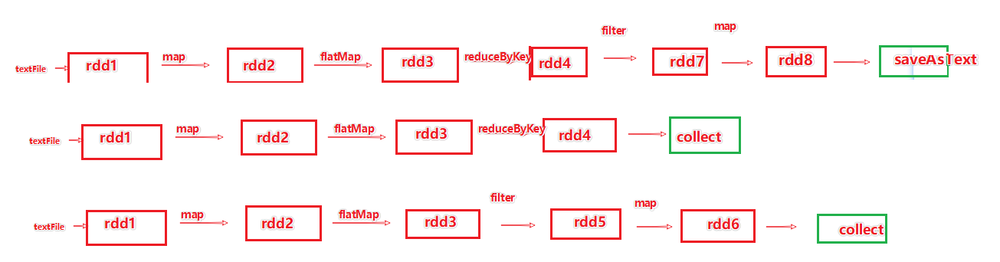


> DAG没什么高深莫测的, 就是代码的算子执行流程
>
> 只有有代码, 不用运行你都能看着代码 画出来DAG


## 7-2 Job 和 Action

从上面图可以看出:

一个Action 会带领一条DAG


如果在一个代码中, 有3个Action, 那么肯定有3个DAG


一个Action带领的一个DAG, 会形成一个执行`Job`


一份代码: 一个Application(一个应用程序)

一个Application中就可以有多个`Job` (Action)


## 7-3 DAG 和 分区

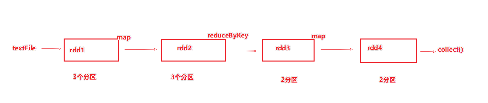

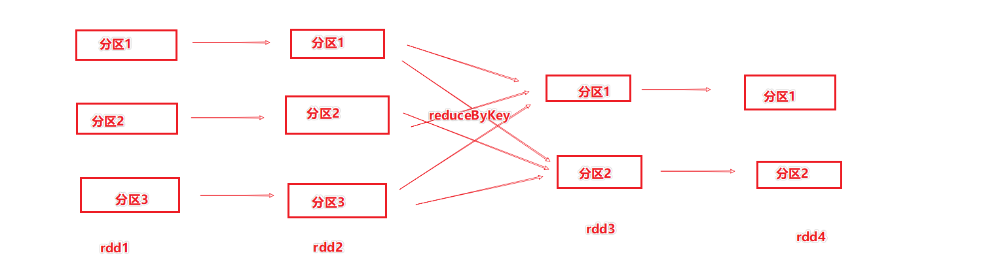

如上2个图, 可以看到, DAG 如果标记为更详细的带有分区的图示 ,可以如上图.

通过上图我们可以看到分区间的数据传递的情况


## 7-4 宽窄依赖

窄依赖: 前面RDD的一个分区, 将其数据`全部给后面`RDD的`某一个`分区


宽依赖: 前面RDD的一个分区, 将其数据给了后面RDD的`多个分区`

宽依赖 也被称之为Shuffle

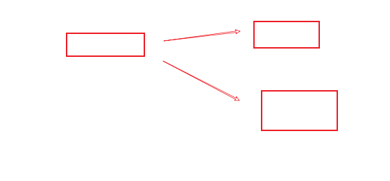


宽依赖和窄依赖简单判断:

从前到后 不分叉, 就是窄依赖

从前到后分叉就是宽依赖


### 7-4-1 有啥用

用途: 基于宽依赖,  将一个DAG(Job) 划分成不同的`阶段`(Stage)

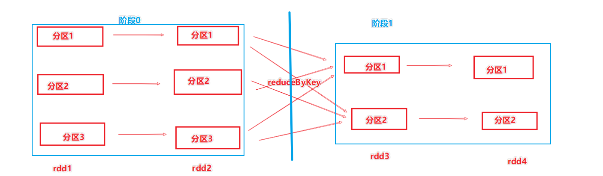

如图, 基于宽依赖, 将DAG划分了2个阶段


## 7-5 划分阶段的用途

划分完阶段后, 阶段内部都是`窄依赖`


阶段内部都是窄依赖有一个好处:

如果分区数量一致, 可以走`内存迭代`.

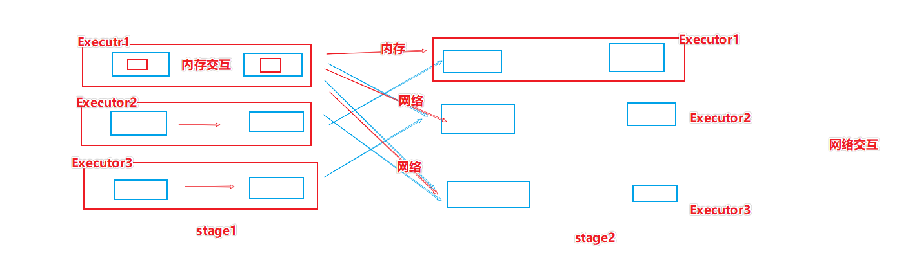

如上图, 在同一个Executor内的 不同RDD的分区, 之间是可以进行内存迭代(内存交互), 无需走网络


尽管, 不同的分区 可以运行在不同的Executor上, 在任务的时候, Driver,会根据集群的规划, 让窄依赖内的不同RDD的分区 都在一个Executor内.


对于Spark来说, 整个DAG的所有的RDD, 前后的一条并行(分区), 可以串成一条线, 那么就可以形成内存迭代.

Spark要做的是, 前后不同RDD的 一个并行在一条线内.

我们要做的就是, 基于机器的资源(Executor的数量), 去提高它的并行度(分区数量)


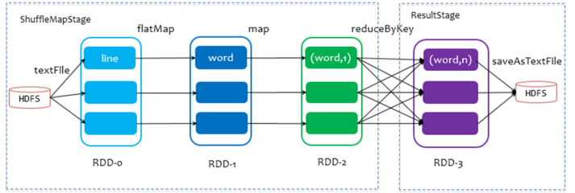

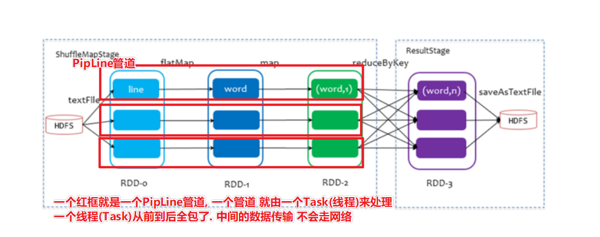


## 7-6 为什么说Spark是内存迭代框架

一句话(背下来):

```properties
Spark基于宽窄依赖, 将DAG划分成不同的Stage(阶段)每一个阶段的内部, 都是窄依赖由于是窄依赖, 从前到后是1对1的, 那么在这个场景下, 我们可以让一个并行组成PipLine一个PipLine可以交由一个Task处理那么这从前到后的处理 统统不需要网络, 直接在内存里面进行计算.只有遇到宽依赖的时候 ,才不得不将数据的一部分通过网络发送给其它的Task
```


### 7-6-1  内存迭代如何提高性能

1. 在硬件资源足够的前提下, 提高并行的PipLine数量, 极大的增加性能
2. 尽量确保 前后RDD的 分区数量一致, 用以确保一个阶段内是100%内存迭代.
3. 尽量减少产生宽依赖的算子, 因为宽依赖是前面的一个分区给后面的多个分区提供数据比如, 前面一个分区 给后面3个分区提供数据, 也就最多1/3可以走内存, 剩下2/3肯定走网络


### 7-6-2 名词

#### 7-6-2-1 PipLine 

**pipline**: <font color='red'>一个Task(线程)所处理的一套流程</font>, 如下图

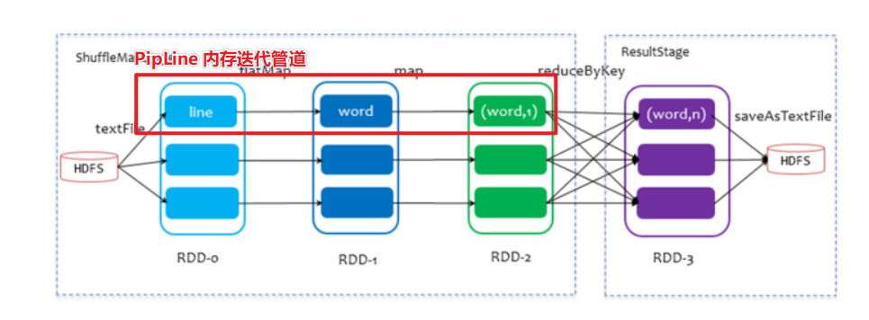


#### 7-6-2-2 Task

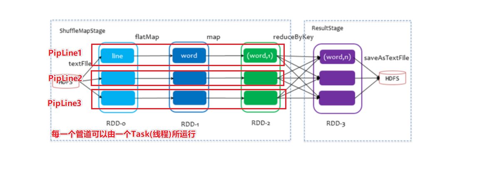

如图, 一个PipLine内的全部RDD分区计算, 可以由一个线程全包(这就是全在这个线程的内存中计算了)


#### TaskSet

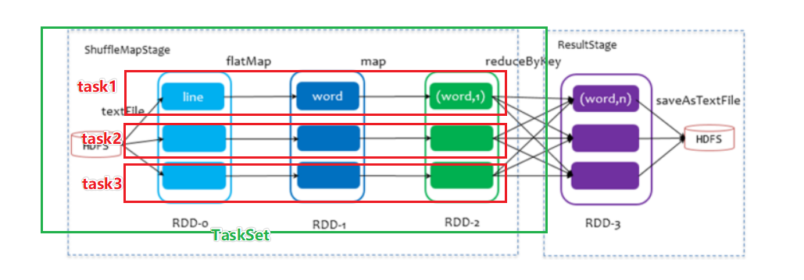

如图, TaskSet 指的是: 一个阶段内,的全部task(PipLine)的统称 叫做TaskSet(Task集合)


## 7-7 面试题: 为什么Spark比MapReduce快


因为, Spark可以做内存迭代

而MapReduce的数据迭代是由HDFS硬盘作为中转. 效率极慢


> 尽管Spark不能100%全内存, 无可避免的还是有宽依赖,  无可避免的还是会遇到网络传输交互
>
> 但是, 网络再慢 也比MapRecuce走硬盘交互快太多


标准回答:

1. Spark基于DGA和宽窄依赖划分, 确保了阶段内都是窄依赖, 可以组成PipLine内存迭代管道, 进行内存迭代.

2. Spark的算子, 实在是比MapReduce多太多. Spark基本上复杂任务都能在一个Application中完成. 但是MapReduce只有2个算子map和reduce

   这个限制导致复杂的计算任务, 写一个MapReduce程序很难做完, 一般会前后串接很多的MapReduce

   Map和Reduce之间都是走硬盘传输, 多个MapReduce之间还是走硬盘传输, 更慢了


# 8-常见的宽依赖算子

```properties
reduceByKey 	: 分组聚合
groupBy 		: 自定义分组
groupByKey 		: 按key分组
repartition 	: (不是100%都是宽依赖)(一般增加分区是宽依赖, 减少分区是窄依赖)
partitionBy 	: 自定义分区(等同于自定义分组, 数据总是乱七八糟互发)
foldByKey 		: 分组聚合
aggragateByKey 	:  分组聚合
sortBy    		: 如果增加分区排序, 也是宽依赖
sortByKey 		: 如果增加分区排序, 也是宽依赖
join      		: 和分组一样, 同样的内容会在一起, 就是洗牌 shuffle
```


> 宽依赖算子
>
> 1. 要么加分区
> 2. 要么分组了 (数据归类)


