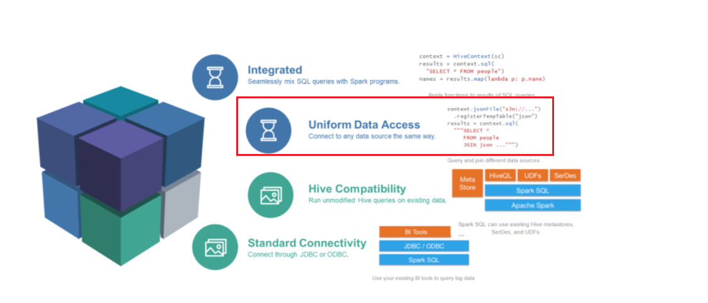

# Spark的任务调度

## Driver内的角色

在Driver中有2个角色:

- DAG Scheduler : DAG调度器
- Task Scheduler: 任务调度器


## DAG调度器

DAG调度器的功能是,:

构建DAG执行图, 基于当前集群中可以用的硬件资源, 来规划 具体的任务应该由哪个具体的Executor来执行.


DAG调度器, 基于代码, 生成第一版DAG


上面的DAG是非常粗略 没有细节


DAG调度器会基于 分区的分布情况 在产生第二版DAG


基于上述第二版的DAG, 结合当前服务器的硬件资源:

有3个Executor, 分属在3台NodeNamanger上


如图, 基于物理服务器的资源提供, 可以规划出 详细的 物理执行图

物理执行图的 最大价值, 就是确定了:

- 具体有哪些Task
- 具体的Task应该处理哪些RDD的分区
- 具体的Task应该扔到哪个Executor上去跑


==注意:==

得到最终的物理执行计划, 只是得到了一个Application(一份代码), 中 一个具体的Job的物理执行计划

一个Application中可以有多个Job(多个Action), 每个Job 都会有一份自己的物理执行计划


假设, 上面的示例Application 有3个Job, 每个Job的到的物理执行计划图 都是一样(上图)

最终我们整个Application会有:

18个Task: 6个属于Job1, 6个属于Job2, 6个属于Job3

这18个Task就分配给 3个Executor去干活.


如下图:


## Task调度器

Task调度器, 就基于DAG调度器所产生的`物理执行计划图`

也就是基于DAG调度器所规划好的 具体Executor运行哪个Task, 以及具体Task应该干什么事


基于这些信息, Task调度器 就开始监控 各个Task的运行情况了.

后续的工作都是Task调度器来做了, DAG调度器就退出了 没他啥事了.


我们说Driver的管理角色, 其实就是来自Task调度器


## 总结

粗略来说:

1. Driver内, 先构建SparkContext入口环境对象, 这和对象为后面执行代码提供支持
2. Driver内的DAG Scheduler 开始基于代码, 构建DAG , 然后基于集群可用资源, 构建最终的`物理执行计划图`
3. Driver内的Task Scheduler 基于`物理执行计划图`, 去监控和管理 各个Executor和各个Task得工作情况


大白话: DAGScheduler构建一个作战计划, 由 将军(TaskScheduler)拿着作战计划去执行去管理


# Spark运行中的概念名词


```shell
官方文档：http://spark.apache.org/docs/2.4.5/cluster-overview.html#glossary
 Application：指的是用户编写的Spark应用程序/代码，包含了Driver功能代码和分布在集群中多个节点上运行的Executor代码；
 Driver：Spark中的Driver即运行上述Application的Main()函数并且创建SparkContext，SparkContext负责和ClusterManager通信，进行资源的申请、任务的分配和监控等；
 Cluster Manager：指的是在集群上获取资源的外部服务，Standalone模式下由Master负责，Yarn模式下ResourceManager负责;
 Executor：是运行在工作节点Worker上的进程，负责运行任务，并为应用程序存储数据，是执行分区计算任务的进程；
 RDD：Resilient Distributed Dataset弹性分布式数据集，是分布式内存的一个抽象概念；
 DAG：Directed Acyclic Graph有向无环图，反映RDD之间的依赖关系和执行流程；
 Job：作业，按照DAG执行就是一个作业，Job==DAG；
 Stage：阶段，是作业的基本调度单位，同一个Stage中的Task可以并行执行，多个Task组成TaskSet任务集；
 Task：任务，运行在Executor上的工作单元，1个Task计算1个分区，包括pipline上的一系列操作；
```


# Spark的并行度

Spark的并行度: 指定是统一时间可以有多少个Task在并行跑


Spark的并行度 就是, 有多少分区, 有多少并行跑的PipLine

宽依赖(Shuffle的时候 单算)


一般并行度指定是: `窄依赖中`pipline的并行数量


`并行度就是有多少个分区`


在窄依赖中 前后分区1:1的场景下 就可以达到:

1个并行 == 1个Task == 1个分区


## 如何去设置并行度

### 全局并行度 推荐

方式1: 在配置文件中设置 :

```shell
# 在spark的 spark-defaults.conf文件中设置
# 全局默认并行度
spark.default.parallelism 200  # 默认的并行度是200
```

表示 默认按照200并行度去构建执行

对于RDD来说, 默认按照200分区构建


注意: 设置并行度200 ,表示 Spark要求在窄依赖中运行200个并行(task) ,因为要200个task ,导致rdd分区默认200个

而不是因为分区200 所以200个task


> 为什么比较推荐全局并行度
>
> 这个设置是全局设置, 设置这一个参数, RDD的分区等就不用理会
>
> 只要可以, 全部都是1:1


方式2: 在代码中设置

`代码的优先级高, 会覆盖配置文件的设置`


```python
conf = SparkConf().setAppName("test").setMaster("local[*]")
conf.set("spark.default.parallelism", "200")
sc = SparkContext(conf=conf)

# 如上代码, 在构建SparkContext对象的时候, 在conf对象中设置这个属性
```


## 针对RDD的并行度设置 - 不推荐

> 首先, 不推荐针对RDD设置并行度
>
> 因为手动修改RDD分区数, 会破坏 1:1的 pipline管道
>
> 甚至 因为你设置的并行度过大(大于原有分区数) 还是额外的shuffle


代码中:

```python
# 通过repartition算子来修改
rdd.repartition()
```


## 在集群中如何规划并行度

基于: 集群的硬件来规划(主要是CPU核心数量)


集群有100个CPU核心可用, 那么你要明白, 最多只能有100个并行在同时运行.


设置参数: `可以设置为 CPU总核心数的2~8倍`

举例: 总共100个核心, 建议设置 200~ 800 的并行度


在规划并行度的时候 要考虑到内存的影响, 一般我们推荐尽量`设置的大一些, 让每一个单独的任务小一些.`


> 这里说的如何规划并行度, 指的是 设置 全局并行度


# 对Spark性能的影响因素 - 拓展

## 软件层面

- 并行能力
- Shuffle


## 硬件层面

CPU

内存

网络


### 数据小于内存总量

CPU和网络影响最大

如果是密集计算 CPU影响最大

如果是shuffle居多,  网络影响最大


### 数据大于内存总量

内存影响最大,  多一个G内存 就能提高1个G的性能


除此以外, 大头在:`网络`

网络对性能的影响是最直观的, 最主要是因为 shuffle对性能的影响是最大的

shuffle会出现太多的网络IO, 网络很影响Shuffle.


对于大规模计算集群, 最低也要上万兆交换机.


# SparkSQL 入门了解


SparkSQL 是一个Spark的模块, 用于处理`结构化`的数据

SparkSQL 处理的数据 是结构化的数据


SparkSQL在企业中是大面积存在的, 工作中使用SQL的比例是非常高的.

100个人写Spark, 其中会有70个工作在SaprkSQL之上.


## 为什么学习SparkSQL

1. 企业用
2. 性能好


**l** ***\*第一、易整合\****

将sql查询与spark程序无缝混合，可以使用java、scala、python、R等语言的API操作。

 

l 第二、***\*统一的数据访问\****

以相同的方式连接到任何数据源。

 

l 第三、***\*兼容Hive\****

  支持Hive HQL的语法，兼容hive(元数据库、SQL语法、UDF、序列化、反序列化机制)。

 

l 第四、***\*标准的数据连接\****

可以使用行业标准的JDBC或ODBC连接。

 

SparkSQL模块官方文档：

http://spark.apache.org/docs/2.4.5/sql-programming-guide.html


## Spark和Hive的关系

### Shark

Spark在最早的时候, 没有SparkSQL, 附带了一个Shark的框架.

这个框架和Hive一样, 功能是: `将sql语言 翻译成SparkRDD代码, 运行Spark程序处理数据`

Hive: sql -> mapreduce

Shark: sql -> spark程序


Shark最早是抄袭hive, 很多东西都是直接copy的.由于hive中做了很多对mapreduce的兼容和优化

对spark的rdd非常不友好, 在后来shark被放弃,  独立出来的SparkSQL模块.


### Spark VS Hive

Hive是 分布式执行SQL界 的 元老

SparkSQL 是分布式SQL界的新兴(老兴)

目前市面上 最火的 分布式sql执行框架 就是SparkSQL


Spark和Hive 就是一种 新老交替的感觉.

虽然目前市面上hive的使用还非常多, 可以见到 以后hive逐步将会被spark蚕食


Hive和Spark 有共性; 都是分布式SQL执行框架


## SparkSQL的发展


了解:

1. 1.0之前是Shark框架
2. 1.0 发布SparkSQL模块 数据结构 SchemaRDD ( 就是RDD)
3. 1.3 发布了DataFrame, 从此开始 数据结构全面迁移到DataFrame
4. 1.6 发布Dataset数据结构, 对Python来说没有意义, 因为用不了
5. 2.0的时候将Dataset和DataFrame合二为一 ,  目前我们用的DataFrame 底层都是Dataset, 对Python语言无意义. 用就是了


Spark的DataFrame是 抄袭Pandas的设计

和Pandas基本相同, 最大的不同就是, Spark的DataFrame是分布式表格而已.


## SparkSession

回想, SparkCore中, 程序执行入口是: `SparkContext`

在SparkSQL的编程中, 程序的执行入口是: `SparkSession`对象.


严格来说, SparkSession入口对象, 是Spark更新至今, 新出的入口对象

是一个统一入口, 不仅可以用它写sql 还能用它写rdd算子


> SparkSession 是目前Spark版本中 的统一程序入口对象


# SparkSQL学习

SparkSQL的定位: `针对大规模结构化数据, 进行SQL分析处理`


Spark定位的三层含义:


如图,

1. SparkSQL 是一个基于SparkCore的模块, 而不是Spark本身
2. SparkSQL中后续所有的数据抽象(数据结构) ,统统用DataFrame描述
3. 引擎, Spark是一个通用计算引擎, SaprkSQL是Spark生态中, 针对分布式SQL计算的引擎


## SparkSQL的数据抽象

### 回顾一下RDD

RDD:

- 分布式
- 弹性
- 数据集( 可以存任意类型, 字符串\数字\字典...)


特点:

- 分区, 算子作用在每个分区上
- 依赖, RDD形成学员关系


### SparkSQL的数据抽象 DataFrame

DataFrame:

- 分布式
- 弹性
- `二维表数据集`( 就是存储表格数据)


特点:

- 分区, 算子作用在每个分区上
- 依赖, DataFrame之间形成血缘关系


总结:

DataFrame和RDD没有太大的区别, 最大的区别就在于: rdd啥都存, DataFrame之存储表格数据, 其它基本一致.


## DataFrame 和 RDD 和 Dataset的区别 - 了解


如上图所示:

如果以一个类对象Person(内含属性 年龄 姓名 身高)

- RDD:  person对象存入RDD, 取出来还是Person对象, 但是RDD无法用SQL来计算
- DataFrame: person对象存入DataFrame, 取出来是 (姓名, 年龄, 身高)的元组, 丢失了person类的信息, 但是可以支持sql计算
- DataSet: person对象存入Dataset, 取出来还是Person对象, 可以支持sql计算


总结来说:

RDD存对象 并且记录泛型信息

DataFrame存二维表, 没有泛型

DataSet 存二维表, 有泛型信息


从这个层面看Dataset更强大, 对于Python来说, Python语言没有泛型, 所以DataFrame完全合适和足够使用.


对于Python来说, DataFrame是唯一选择.


拓展:

>Java: 静态编译,  强类型语言
>
>Python: 动态编译, 弱类型语言


# SparkSQL - DataFrame


## Schema

schema: `约束`,  是对二维表结构数据类型的一种约束, 约束列的类型和列的行为

通俗来说, 我们说Schema就是 二维表的描述:

- 有哪些列
- 列的类型是啥
- 列是否运行为空?


数据库的表 ==  数据 + 约束(Schema)


DataFrame来说, 它就是有约束的

DataFrame = 数据 + 约束


Spark的DataFrame约束, 就约束三种行为:

1. 列的名字, 必须
2. 列的类型, 必须
3. 列是否为空, 可选 默认是允许为空


## Row对象

在DataFrame中, 一行数据 本质上是一个元组, 这个元组 被封装了成为一个叫做: `Row`的对象


如图, 在SparkSQL的DataFrame中, 一条数据是`pyspark.sql.types.Row`对象类型

其内容是:`Row(列名=列值, 列名=列值.......)`


对于DataFrame来说, 你可以认为 里面存的都是一堆 Row对象数据


Row可以被定义为 行

一堆Row就是有行有列

DataFrame就形成了二维表结构.


## SparkSQL HelloWorld

```python
# coding:utf8

# SparkSQL 中的入口对象是SparkSession对象
from pyspark.sql import SparkSession


if __name__ == '__main__':
    # 构建SparkSession对象, 这个对象是 构建器模式 通过builder方法来构建
    spark = SparkSession.builder.\
        appName("local[*]").\
        config("spark.sql.shuffle.partitions", "4").\
        getOrCreate()
    # appName 设置程序名称, config设置一些常用属性
    # 最后通过getOrCreate()方法 创建SparkSession对象

    df = spark.read.csv('../data/sql/stu_score.txt', sep=',', header=False)
    df2 = df.toDF('id', 'name', 'score')
    df2.printSchema()
    df2.show()

    df2.createTempView("score")

    # SQL 风格
    spark.sql("""
        SELECT * FROM score WHERE name='语文' LIMIT 5
    """).show()

    # DSL 风格
    df2.where("name='语文'").limit(5).show()
```

代码简单的 读取了csv文件, 并用sql和dsl两种风格 对数据进行简单查询处理.


这个代码要求学会: 构建SparkSession对象


## API学习

### 创建DF - 通过RDD创建

这种形式 直接将RDD转换成DataFrame

其中DF所需的:

1. 列名, 需要给, 如果不给 ,默认 列名是: `_1, _2 ......_N`
2. 列的类型, 需要从RDD中数据的类型推断
3. 是否为空, 默认全允许为空, 一般用不到


```python
# coding:utf8


from pyspark.sql import SparkSession


if __name__ == '__main__':
    spark = SparkSession.builder.\
        appName("create_df"). \
        config("spark.sql.shuffle.partitions", "4"). \
        getOrCreate()

    # SparkSession对象也可以获取 SparkContext
    sc = spark.sparkContext

    # 创建DF , 首先创建RDD 将RDD转DF
    rdd = sc.textFile("../data/sql/stu_score.txt").\
        map(lambda x:x.split(',')).\
        map(lambda x:(int(x[0]), x[1], int(x[2])))   # 因为类型要靠RDD的数据推断, 所以这里进行了类型转换
        											 # 如果不转, 全部都是String类型

    # 通过sparksession对象的api:createDataFrame
    # 参数1: 是要转成DF的rdd, 参数2: 列名的列表, 顺序和数据的顺序一致
    df = spark.createDataFrame(rdd, ['id', 'subject', 'score'])

    df.printSchema()
    df.show()
```


### 创建DF - 通过RDD创建 - 通过StructType对象描述Schema

对于DataFrame对象, 它的约束(Schema)信息, 是通过StructType对象类定义

可以预先定义好这个对象 来给df赋予schmea:

```python
    # StructType 类
    # 这个类 可以定义整个DataFrame中的Schema
    schema = StructType().\
        add("id", IntegerType(), nullable=False).\
        add("name", StringType(), nullable=True).\
        add("score", IntegerType(), nullable=False)
    # 一个add方法 定义一个列的信息, 如果有3个列, 就写三个add
    # add方法: 参数1: 列名称, 参数2: 列类型, 参数3: 是否允许为空
```


完整代码:

```python
# coding:utf8
# 需求: 基于StructType的方式构建DataFrame 同样是RDD转DF

from pyspark.sql import SparkSession
from pyspark.sql.types import StructType, StringType, IntegerType


if __name__ == '__main__':
    spark = SparkSession.builder.\
        appName("create_df"). \
        config("spark.sql.shuffle.partitions", "4"). \
        getOrCreate()

    # SparkSession对象也可以获取 SparkContext
    sc = spark.sparkContext

    # 创建DF , 首先创建RDD 将RDD转DF
    rdd = sc.textFile("../data/sql/stu_score.txt").\
        map(lambda x:x.split(',')).\
        map(lambda x:(int(x[0]), x[1], int(x[2])))

    # StructType 类
    # 这个类 可以定义整个DataFrame中的Schema
    schema = StructType().\
        add("id", IntegerType(), nullable=False).\
        add("name", StringType(), nullable=True).\
        add("score", IntegerType(), nullable=False)
    # 一个add方法 定义一个列的信息, 如果有3个列, 就写三个add
    # add方法: 参数1: 列名称, 参数2: 列类型, 参数3: 是否允许为空

    df = spark.createDataFrame(rdd, schema)

    df.printSchema()
    df.show()
```


### 创建DF - 通过RDD的toDF方法来创建

方式1:

```python
# 方式1: 只传列名, 类型靠推断, 是否允许为空是truedf = rdd.toDF(['id', 'subject', 'score'])
```

方式2:

```python
schema = StructType().\    add("id", IntegerType(), nullable=False).\    add("name", StringType(), nullable=True).\    add("score", IntegerType(), nullable=False)# 方式2: 传入完整的Schema描述对象StructTypedf = rdd.toDF(schema)df.printSchema()df.show()
```


完整代码:

```python
# coding:utf8# 需求: 使用toDF方法将RDD转换为DFfrom pyspark.sql import SparkSessionfrom pyspark.sql.types import StructType, StringType, IntegerTypeif __name__ == '__main__':    spark = SparkSession.builder.\        appName("create_df"). \        config("spark.sql.shuffle.partitions", "4"). \        getOrCreate()    # SparkSession对象也可以获取 SparkContext    sc = spark.sparkContext    # 创建DF , 首先创建RDD 将RDD转DF    rdd = sc.textFile("../data/sql/stu_score.txt").\        map(lambda x:x.split(',')).\        map(lambda x:(int(x[0]), x[1], int(x[2])))    # StructType 类    # 这个类 可以定义整个DataFrame中的Schema    schema = StructType().\        add("id", IntegerType(), nullable=False).\        add("name", StringType(), nullable=True).\        add("score", IntegerType(), nullable=False)    # 一个add方法 定义一个列的信息, 如果有3个列, 就写三个add    # add方法: 参数1: 列名称, 参数2: 列类型, 参数3: 是否允许为空    # 方式1: 只传列名, 类型靠推断, 是否允许为空是true    df = rdd.toDF(['id', 'subject', 'score'])    df.printSchema()    df.show()    # 方式2: 传入完整的Schema描述对象StructType    df = rdd.toDF(schema)    df.printSchema()    df.show()
```


### 创建DF - 通过pandas的dataframe来构建sparksql的dataframe

```python
# coding:utf8# 需求: 将Pandas的DataFrame转换成SparkSQL的DataFramefrom pyspark.sql import SparkSessionfrom pyspark.sql.types import StructType, StringType, IntegerTypeimport pandas as pdif __name__ == '__main__':    spark = SparkSession.builder.\        appName("create_df"). \        config("spark.sql.shuffle.partitions", "4"). \        getOrCreate()    # 构建pandas的dataframe对象    pdf = pd.DataFrame({        "id": [1, 2, 3],        "subject": ['语文', '数学', '英语'],        'score': [99, 98, 99]    })    # 通过SparkSession对象将pandas的dataframe对象转换成SparkSQL的DataFrame对象    df = spark.createDataFrame(pdf)    df.printSchema()    df.show()
```


### 创建DF - 通过JSON数据

```python
# coding:utf8# 需求: 从JSON中读取构建DFfrom pyspark.sql import SparkSessionfrom pyspark.sql.types import StructType, StringType, IntegerTypeimport pandas as pdif __name__ == '__main__':    spark = SparkSession.builder.\        appName("create_df"). \        config("spark.sql.shuffle.partitions", "4"). \        getOrCreate()    # 通过spark.read.json() 来读取json数据    df = spark.read.json("../data/sql/people.json")        # 另一种写法	df = spark.read.format("json").load("../data/sql/people.json")        df.printSchema()    df.show()
```


#### 统一API

在前面说SparkSQL的特性的时候, 说过, 它支持统一的API访问



如图, SparkSQL, 读取各类数据源 以及写出各类数据源, 其实API都是同一个:


```python
# 读数据spark.read.format(数据源类型).load(数据路径或地址)# 写数据spark.write.format(数据源类型).save(写出路径或地址)数据源类型可以写:    - json    - csv    - parquet    - delta    - hdfs    - file    - jdbc    - odbc    - hbase    - .....
```


### 创建DF - 通过CSV数据读取

注意: CSV指的是 固定分隔符类型的`数据`

而不是`.csv`结尾的文件.


```python
# coding:utf8# 需求: 从CSV中读取构建DFfrom pyspark.sql import SparkSessionfrom pyspark.sql.types import StructType, StringType, IntegerTypeimport pandas as pdif __name__ == '__main__':    spark = SparkSession.builder.\        appName("create_df"). \        config("spark.sql.shuffle.partitions", "4"). \        getOrCreate()    # 读取csv文件    # 方式1: 快捷写法    df = spark.read.csv("../data/sql/people.csv",   # 数据的路径                        sep=';',                    # 列的分隔符                        encoding='utf-8',           # 数据编码                        header=True)                # 是否有标头                        #lineSep="|")                # 行的分隔符, 一般是回车符 \n    df.printSchema()    df.show()    # 方式2: 标准写法 统一API的形式写法    df = spark.read.\        option("sep", ";").\        option("encoding", "utf-8").\        option("header", True).\        format("csv").load("../data/sql/people.csv")    df.show()
```


### parquet类型文件

这是一种文件的序列化格式, 是一种列式存储的文件格式.

和ORC一样, 是一种特殊的文件类型

和ORC一样 都是列存储类型的文件.


parquet类型的文件, 内部是包含了数据的schema

这个文件, 不仅有数据, 还有schema


对比csv:

| 对比项目     | csv        | parquet        |
| ------------ | ---------- | -------------- |
| 数据         | 包含       | 包含           |
| schema       | 没有       | 有             |
| 数据存储形式 | 文本类型   | 二进制         |
| 是否压缩     | 无         | 自带序列化压缩 |
| 行列存储     | 行存储类型 | 列存储类型     |


总结:

parquet数据格式: 性能好, 体积小, 自带schema信息


### 创建DF - 通过parquet文件构建

```python
# coding:utf8# 需求: 从parquet文件中创建dffrom pyspark.sql import SparkSessionfrom pyspark.sql.types import StructType, StringType, IntegerTypeimport pandas as pdif __name__ == '__main__':    spark = SparkSession.builder.\        appName("create_df"). \        config("spark.sql.shuffle.partitions", "4"). \        getOrCreate()    # 方式1: 快捷写法    df = spark.read.parquet("../data/sql/users.parquet")    df.printSchema()    df.show()    # 方式2: 统一形式的API写法    df2 = spark.read.format("parquet").load("../data/sql/users.parquet")    df2.show()
```


## DataFrame的算子

### DSL风格语法

DSL : 领域特定语言, DataFrame这个领域的特定语言,  通俗来说就是API编程


### DSL 和 SQL 入门写法演示

```python
# coding:utf8# 需求: 从parquet文件中创建dffrom pyspark.sql import SparkSessionfrom pyspark.sql.types import StructType, StringType, IntegerTypeimport pandas as pdif __name__ == '__main__':    spark = SparkSession.builder.\        appName("create_df"). \        config("spark.sql.shuffle.partitions", "4"). \        getOrCreate()    df = spark.read.csv("../data/sql/people.csv",  # 数据的路径                        sep=';',  # 列的分隔符                        encoding='utf-8',  # 数据编码                        header=True)  # 是否有标头    # 查询特定的列    df2 = df.select('name')    df2.show()    df.select(df['name']).show()    # 过滤数据    df.filter('age > 11').show()    df.filter(df['age'] > 11).show()    df.where('age > 11').show()    df.where(df['age'] > 11).show()    # 分组    df.groupBy('job').count().show()    df.groupBy(df['job']).count().show()    # SQL 语法    # 将dataframe 注册成一个表格 表名字叫做 person    df.createTempView("person")    # 有了表就可以做sql查询    # spark.sql()的返回值 是新的DataFrame    spark.sql("SELECT name FROM person").show()    spark.sql("SELECT job, count(*) as cnt from person group by job").show()
```


