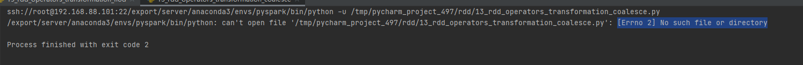
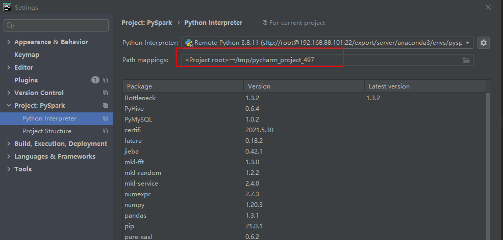
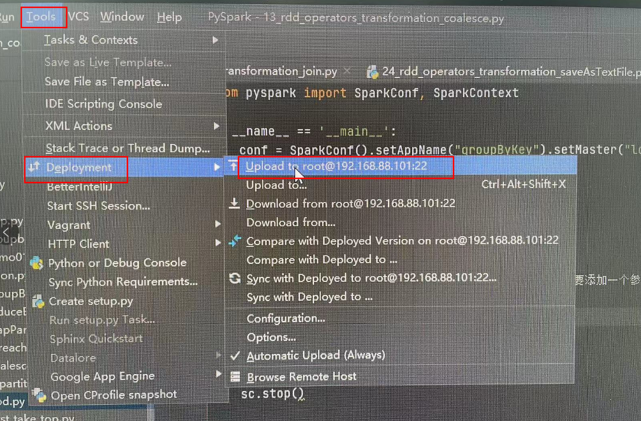
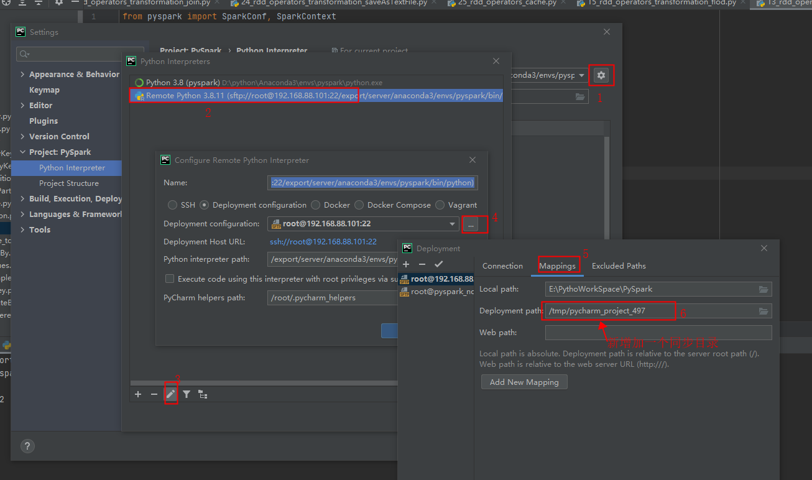

# 1- PySpark实施常见问题


## 1-1 Python3: No Such file or directory


### 1-1-1 Local模式

Linux系统

1. 请安装Python3(官方Python3 或者Anaconda3 都可以)
2. 将Python3执行器软链接到: /usr/bin/python3


Windows系统:

1. 请安装Python3(官方Python3 或者Anaconda3 都可以)
2. 将Python3执行器加入环境变量(在CMD中直接输入python3可以进入标识是成功了)

### 1-1-2 Linux 下StandAlone 或者 YARN模式

将Linux 的Local模式的操作, 在所有的机器上都执行.

也就是集群所有机器都需要Python3的


## 1-2 attribute lookup xxx on __main__ failed

序列化问题

将使用的方法, 单独创建一个文件, 比如叫做defs.py

将方法放入defs文件中


在main方法所在python文件中, import defs


在使用的时候使用 defs.xxx  来使用


## 1-3 Linux安装Anaconda3后没有出现(bash)字样

复制如下内容:

```shell
# .bashrc

# User specific aliases and functions

alias rm='rm -i'
alias cp='cp -i'
alias mv='mv -i'

# Source global definitions
if [ -f /etc/bashrc ]; then
        . /etc/bashrc
fi

# >>> conda initialize >>>
# !! Contents within this block are managed by 'conda init' !!
__conda_setup="$('/export/server/anaconda3/bin/conda' 'shell.bash' 'hook' 2> /dev/null)"
if [ $? -eq 0 ]; then
    eval "$__conda_setup"
else
    if [ -f "/export/server/anaconda3/etc/profile.d/conda.sh" ]; then
        . "/export/server/anaconda3/etc/profile.d/conda.sh"
    else
        export PATH="/export/server/anaconda3/bin:$PATH"
    fi
fi
unset __conda_setup
# <<< conda initialize <<<
```

替换到你机器的 /root/.bashrc 文件, 然后退出CRT 重新打开即可看到

注意: 里面的内容 anaconda是按照安装在: /export/server/anaconda3来设置的, 如果你安装在别的地方, 请修改


## 1-4 Python worker failed to connect back.

遇到这个问题有2个可能性

1. PyCharm的Bug, 可以考虑下载最新版PyCharm 比如2021版, 应该可以解决
2. 没有设置PYSPARK_PYTHON环境变量


针对2的方案解决:

在Windows系统中设置环境变量 PYSPARK_PHTHON


或者在代码中设置:

```
import os
os.environ['PYSPARK_PYTHON'] = '你的python路径, 或者直接填python也可以'
```


## 1-5 运行远程Linux Python的时候提示 JAVA_HOME Not Set

解决方案有2:

1. 在Linux系统当前用户的.bashrc文件, 以root为例, 修改/root/.bashrc文件

添加:

export JAVA_HOME=JDK的路径(Linux系统的哦)

​	2.在Python代码中设置:


## 1-6 StandAlone HA模式 提交任务到Master运行失败

问题可能性:

1. 没有启动Zookeeper, 确保全部的Zookeeper都已经启动了, 然后重启Spark

启动Zookeeper命令 `/Zookeeper的安装目录/bin/zkServer.sh start`

1. 没有在全部的机器安装Python3, 确保全部的机器都安装了Python3

并将Python3执行器软链接到: `/usr/bin/python3`


## 1-7 No Such File Or Directory "/sparklog"

确保在HDFS之上创建了"/sparklog"文件夹


命令:

```
hadoop fs -mkdir /sparklog
```


## 1-8 xxxx.py:[Errno 2] No such file or directory

- 视频：pyspark ->day04->01RDD缓存 视频



原因:  Linux系统中没有同步过来python文件；




解决办法1：<font color='red'>手动同步一次</font>



解决方法2：<font color='red'>新增同步目录， 再手动同步</font>；



