[TOC]


# 1 Flink概述

## 1-1 Flink发展史

2009年诞生

2014年捐献给Apache--开源免费,发展迅速

2019年被阿里收购---成为中国人主导的项目, 可以适合中国国内的发展

之后的发展可以说是乘风破浪,越来越流行--在国内

在全球范围还是Spark是no1,在国内spark vs flink未决胜负


## 1-2 Flink官方介绍

https://flink.apache.org/zh/

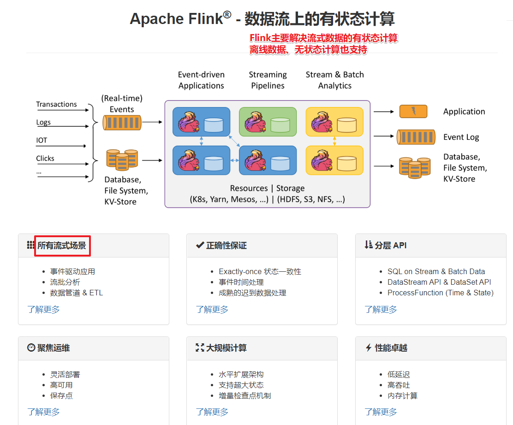


总结:

Flink是支持流式数据的有状态计算的大数据框架, 适合所有的流式计算场景

Spark是统一的大规模数据处理/分析/计算引擎/框架

Hadoop:

HBase:

Kafka:

Hive

.......


## 1-3 Flink组件

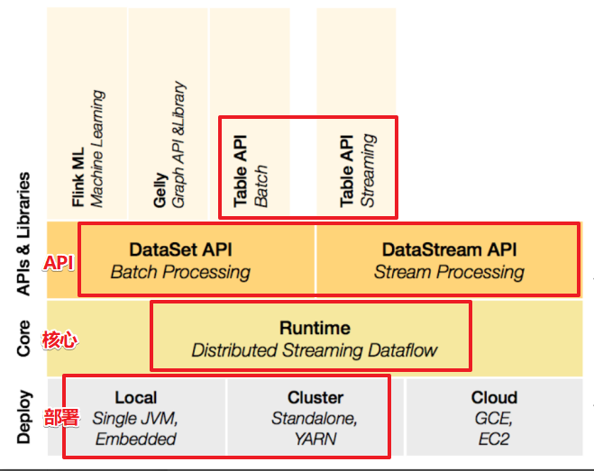

## 1-4 Flink基石

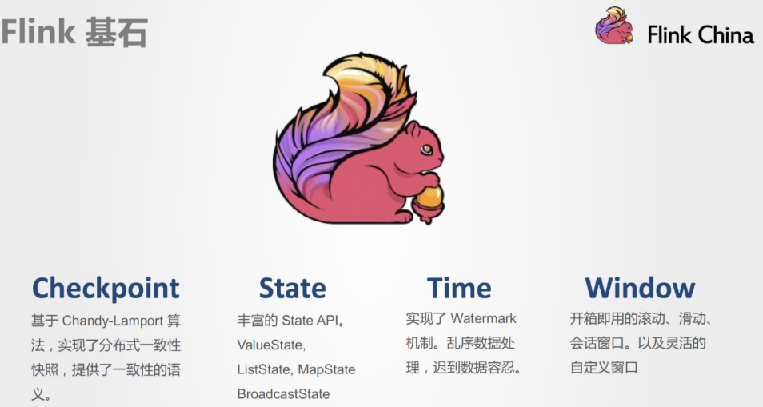


## 1-5 Flink的应用场景

所有的流式应用都可以使用Flink

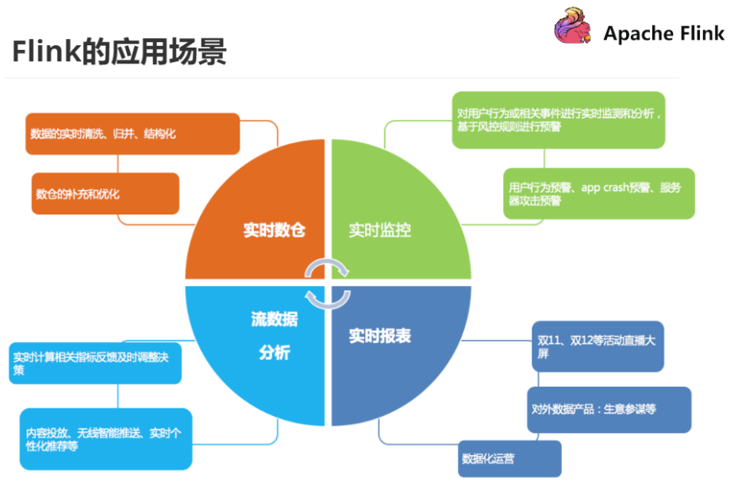


## 1-6 为什么选择Flink?

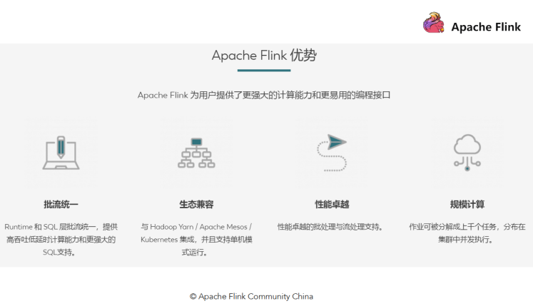

### 1-6-1 主要原因

- 1.<span style="color:red;background:white;font-size:20px;font-family:楷体;">**Flink 具备统一的框架处理有界和无界两种数据流的能力**</span>

- 2.<span style="color:red;background:white;font-size:20px;font-family:楷体;">**部署灵活，Flink 底层支持多种资源调度器**</span>，包括Yarn、Kubernetes 等。Flink 自身带的Standalone 的调度器，在部署上也十分灵活。

- 3.<span style="color:red;background:white;font-size:20px;font-family:楷体;">**极高的可伸缩性**</span>，可伸缩性对于分布式系统十分重要，阿里巴巴双11大屏采用Flink 处理海量数据，使用过程中测得Flink 峰值可达17 亿条/秒。

- 4.<span style="color:red;background:white;font-size:20px;font-family:楷体;">**极致的流式处理性能**</span>。Flink 相对于Storm 最大的特点是将状态语义完全抽象到框架中，支持本地状态读取，避免了大量网络IO，可以极大提升状态存取的性能。

 

### 1-6-2 其他更多的原因:

- 1- <span style="color:red;background:white;font-size:20px;font-family:楷体;">**同时支持高吞吐、低延迟、高性能**</span>
  - <span style="color:blue;background:white;font-size:20px;font-family:楷体;">**Flink 是目前开源社区中唯一一套集高吞吐、低延迟、高性能三者于一身的分布式流式数据处理框架。**</span>
  - <span style="color:blue;background:white;font-size:20px;font-family:楷体;">**Spark 只能兼顾高吞吐和高性能特性，无法做到低延迟保障,因为Spark是用批处理来做流处理**</span>
  - <span style="color:blue;background:white;font-size:20px;font-family:楷体;">**Storm 只能支持低延时和高性能特性，无法满足高吞吐的要求**</span>


​	下图显示了 Apache Flink 与 Apache Storm 在完成流数据清洗的分布式任务的性能对比。

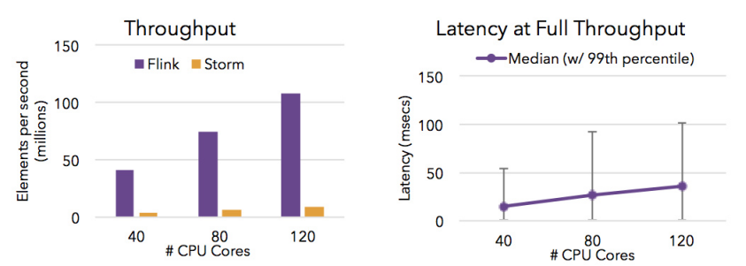 

 

- 2- <span style="color:red;background:white;font-size:20px;font-family:楷体;">**支持事件时间(Event Time)概念**</span>

  在流式计算领域中，窗口计算的地位举足轻重，但目前大多数框架窗口计算采用的都是系统时间(Process Time)，也就是事件传输到计算框架处理时，系统主机的当前时间。

  

  Flink 能够支持基于事件时间(Event Time)语义进行窗口计算


​		这种基于事件驱动的机制使得事件即使乱序到达甚至延迟到达，流系统也能够计算出精确的结果，保持了事件原本产生时的时序性，尽可能避免网络传输或硬件系统的影响。

 

 

- 3- <span style="color:red;background:white;font-size:20px;font-family:楷体;">**支持有状态计算**</span>

  

  Flink1.4开始支持有状态计算

  ​	

  所谓状态就是在流式计算过程中将算子的中间结果保存在内存或者文件系统中，等下一个事件进入算子后可以从之前的状态中获取中间结果，计算当前的结果，从而无须每次都基于全部的原始数据来统计结果，极大的提升了系统性能，状态化意味着应用可以维护随着时间推移已经产生的数据聚合

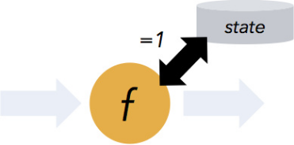 

 

- 4- <span style="color:red;background:white;font-size:20px;font-family:楷体;">**支持高度灵活的窗口(Window)操作**</span>

  Flink 将窗口划分为基于 Time 、Count 、Session、以及Data-Driven等类型的窗口操作，窗口可以用灵活的触发条件定制化来达到对复杂的流传输模式的支持，用户可以定义不同的窗口触发机制来满足不同的需求

 

- 5- <span style="color:red;background:white;font-size:20px;font-family:楷体;">**基于轻量级分布式快照(Snapshot/Checkpoints)的容错机制**</span>

  Flink 能够分布运行在上千个节点上，通过基于分布式快照技术的Checkpoints，将执行过程中的状态信息进行持久化存储，一旦任务出现异常停止，Flink 能够从 Checkpoints 中进行任务的自动恢复，以确保数据处理过程中的一致性


​	Flink 的容错能力是轻量级的，允许系统保持高并发，同时在相同时间内提供强一致性保证。

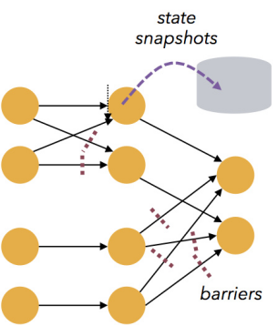 

- 6- <span style="color:red;background:white;font-size:20px;font-family:楷体;">**基于 JVM 实现的独立的内存管理**</span>
  - Flink 实现了自身管理内存的机制，通过使用散列，索引，缓存和排序有效地进行内存管理，通过序列化/反序列化机制将所有的数据对象转换成二进制在内存中存储，降低数据存储大小的同时，更加有效的利用空间。使其独立于 Java 的默认垃圾收集器，尽可能减少 JVM GC 对系统的影响。

 

 

- 7- <span style="color:red;background:white;font-size:20px;font-family:楷体;">**SavePoints 保存点**</span>
  - 对于 7 * 24 小时运行的流式应用，数据源源不断的流入，在一段时间内应用的终止有可能导致数据的丢失或者计算结果的不准确。
  - 比如集群版本的升级，停机运维操作等。
  - 值得一提的是，Flink 通过SavePoints 技术将任务执行的快照保存在存储介质上，当任务重启的时候，可以从事先保存的 SavePoints 恢复原有的计算状态，使得任务继续按照停机之前的状态运行。
  - Flink 保存点提供了一个状态化的版本机制，使得能以无丢失状态和最短停机时间的方式更新应用或者回退历史数据。

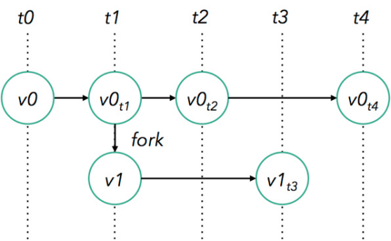 

 

- 8- 灵活的部署方式，支持大规模集群
  - Flink 被设计成能用上千个点在大规模集群上运行
  - 除了支持独立集群部署外，Flink 还支持 YARN 和Mesos 方式部署。

 

- 9- Flink 的程序内在是并行和分布式的
  - 数据流可以被分区成 stream partitions，
  - operators 被划分为operator subtasks; 
  - 这些 subtasks 在不同的机器或容器中分不同的线程独立运行；
  - operator subtasks 的数量就是operator的并行计算数，不同的 operator 阶段可能有不同的并行数；


如下图所示，source operator 的并行数为 2，但最后的 sink operator 为1；

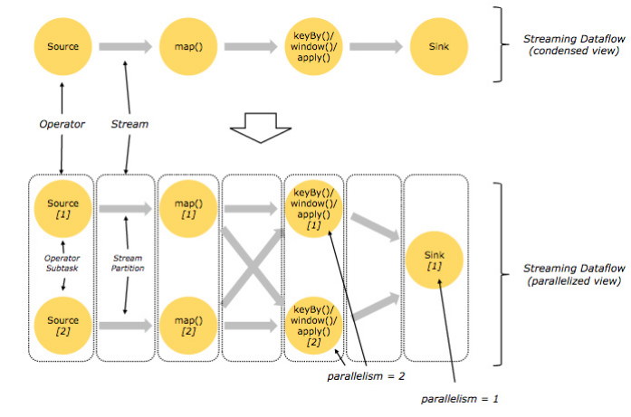 

 

- 10- 丰富的库
  - Flink 拥有丰富的库来进行机器学习，图形处理，关系数据处理等。

## 1-7 流处理 VS 批处理

- 它们的主要区别是：
  - 与批量计算那样慢慢积累数据不同，流式计算立刻计算，数据持续流动，计算完之后就丢弃。
  - 批量计算是维护一张表，对表进行实施各种计算逻辑。流式计算相反，是必须先定义好计算逻辑，提交到流式计算系统，这个计算作业逻辑在整个运行期间是不可更改的。
  - 计算结果上，批量计算对全部数据进行计算后传输结果，流式计算是每次小批量计算后，结果可以立刻实时化展现。


## 1-8 流批统一

在大数据处理领域，**批处理任务 与 流处理任务**一般被认为是两种不同的任务，一个大数据框架一般会被设计为只能处理其中一种任务：

- MapReduce只支持批处理任务；

- Storm只支持流处理任务；

- Spark Streaming采用micro-batch架构，本质上还是基于Spark批处理对流式数据进行处理

- Flink通过灵活的执行引擎，能够同时支持批处理任务与流处理任务

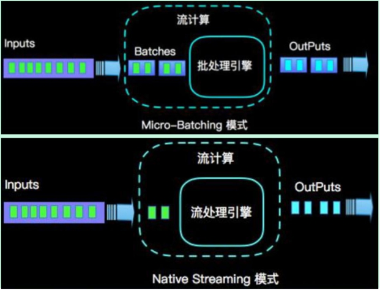 

- 在执行引擎这一层，流处理系统与批处理系统最大不同在于**节点间的数据传输方式**：
  - 1.对于一个**流处理系统**，其节点间数据传输的标准模型是：**当一条数据被处理完成后，序列化到缓存中，然后立刻通过网络传输到下一个节点，由下一个节点继续处理**

    

  - 2.对于一个**批处理系统**，其节点间数据传输的标准模型是：**当一条数据被处理完成后，序列化到缓存中，并不会立刻通过网络传输到下一个节点，当缓存写满，就持久化到本地硬盘上，当所有数据都被处理完成后，才开始将处理后的数据通过网络传输到下一个节点**


​	这两种数据传输模式是两个极端，对应的是**流处理系统对低延迟的要求** 和 **批处理系统对高吞吐量的要求**

 

<span style="color:red;background:white;font-size:20px;font-family:楷体;">**Flink的执行引擎采用了一种十分灵活的方式，同时支持了这两种数据传输模型：**</span>

- Flink以固定的缓存块为单位进行网络数据传输，用户可以通过设置缓存块超时值指定缓存块的传输时机。

  - **如果缓存块的超时值为0**，则Flink的数据传输方式类似上文所提到流处理系统的标准模型，此时系统可以获得最低的处理延迟

  - **如果缓存块的超时值为无限大/-1**，则Flink的数据传输方式类似上文所提到批处理系统的标准模型，此时系统可以获得最高的吞吐量

  - **同时缓存块的超时值也可以设置为0到无限大之间的任意值**。缓存块的超时阈值越小，则Flink流处理执行引擎的数据处理延迟越低，但吞吐量也会降低，反之亦然。通过调整缓存块的超时阈值，用户可根据需求灵活地权衡系统延迟和吞吐量

    

  默认情况下，流中的元素并不会一个一个的在网络中传输，<span style="color:red;background:white;font-size:20px;font-family:楷体;">**而是缓存起来伺机一起发送(默认为32KB，通过taskmanager.memory.segment-size设置)**</span>,这样可以避免导致频繁的网络传输,提高吞吐量;

  但如果数据源输入不够快的话会导致后续的数据处理延迟，所以可以使用<span style="color:red;background:white;font-size:20px;font-family:楷体;">**env.setBufferTimeout(默认100ms)**</span>，来为缓存填入设置一个最大等待时间。等待时间到了之后，即使缓存还未填满，缓存中的数据也会自动发送。 

  

- timeoutMillis > 0 表示最长等待 timeoutMillis 时间，就会flush

- timeoutMillis = 0 表示每条数据都会触发 flush，直接将数据发送到下游，相当于没有Buffer了(避免设置为0，可能导致性能下降)

- timeoutMillis = -1 表示只有等到 buffer满了或 CheckPoint的时候，才会flush。相当于取消了 timeout 策略


总结:

​		<span style="color:red;background:white;font-size:20px;font-family:楷体;">**Flink以缓存块为单位进行网络数据传输,用户可以设置缓存块超时时间和缓存块大小来控制缓冲块传输时机,从而控制Flink的延迟性和吞吐量**</span>


# 2 Flink安装部署

- 前置说明

  Flink1.12版本--2020年发布的里程碑版本, 有很多重大更新/新特性--流批一体

  虚拟机只用之前课程使用的3台即可,如果环境有问题,直接拷贝老师的或者同学的


## 2-1 Local本地模式-了解

### 原理


### 操作

1.下载

https://archive.apache.org/dist/flink/

2.上传

3.解压

tar -zxvf flink-1.12.0-bin-scala_2.12.tgz  -C /export/server

4.改名

mv flink-1.12.0 flink

5.修改权限

chown -R root:root /export/server/flink-1.12.0


### 测试

1.准备测试数据用来做WordCount

vim /root/words.txt

```properties
hello me you her
hello me you
hello me
hello
```


2.启动

 /export/server/flink-1.12.0/bin/start-cluster.sh


3.观察webUI

http://node1:8081/#/overview


4.执行官方示例

```shell
/export/server/flink-1.12.0/bin/flink run /export/server/flink-1.12.0/examples/batch/WordCount.jar --input /root/words.txt --output /root/out
```


5.观察WebUI结果和out文件结果


6.停止local集群

/export/server/flink-1.12.0/bin/stop-cluster.sh


## 2-2 Standalone独立集群模式

### 原理

安装下图在node1上准备master,在node2和node3上准备worker即可

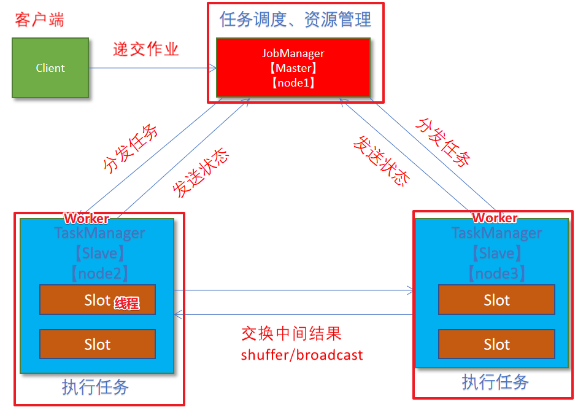

### 操作

1.修改配置

vim /export/server/flink-1.12.0/conf/flink-conf.yaml

```properties
jobmanager.rpc.address: node1
taskmanager.numberOfTaskSlots: 2
web.submit.enable: true

#历史服务器
jobmanager.archive.fs.dir: hdfs://node1:8020/flink/completed-jobs/
historyserver.web.address: node1
historyserver.web.port: 8082
historyserver.archive.fs.dir: hdfs://node1:8020/flink/completed-jobs/
```


vim /export/server/flink-1.12.0/conf/masters

```properties
node1:8081
```


vim /export/server/flink-1.12.0/conf/workers

```properties
node1
node2
node3
```


配置hadoop环境变量,方便后续flink找到hadoop

vim /etc/profile

```properties
export HADOOP_CONF_DIR=/export/server/hadoop-2.7.5-2.7.5/etc/hadoop
```

注意:hadoop的路径


2.分发

```properties
scp -r /export/server/flink-1.12.0 root@node2:$PWD
scp -r /export/server/flink-1.12.0 root@node3:$PWD


注意:  如果node2 node3 与 node1 的profile不一致， 不能直接scp.
scp  /etc/profile node2:/etc/profile
scp  /etc/profile node3:/etc/profile

```


3.source

source /etc/profile


### 测试

- 0.启动hadoop


start-all.sh


- 1.启动集群

	意： 需要先启动hadoop	

  /export/server/flink-1.12.0/bin/start-cluster.sh

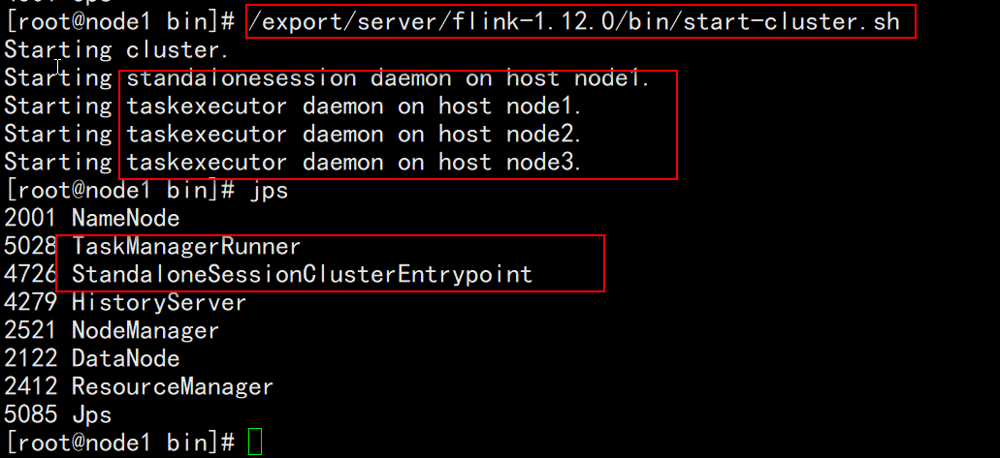

- 2.启动历史服务器

/export/server/flink-1.12.0/bin/historyserver.sh start

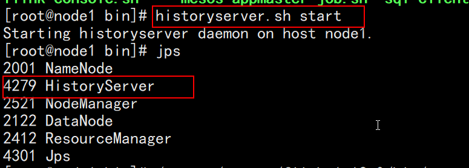

- 补充

如果在启动Flink集群或者history后 jps看不到进程, 查看/export/server/flink/log有如下错误

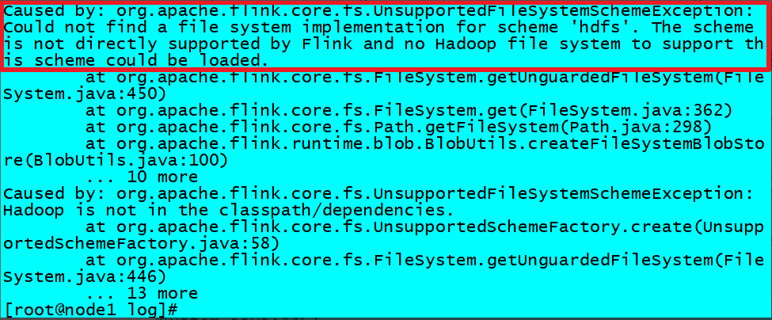

需要注意:

``` properties
1.启动hadoop

2.把资料中的jar放到flink的/export/server/flink/lib中并分发

flink-shaded-hadoop-2-uber-2.7.5-10.0.jar
```


3.观察webUI

http://node1:8081/#/overview   ---Flink集群管理界面

http://node1:8082/#/overview   ---Flink历史服务器管理界面


4.提交官方示例

```
/export/server/flink-1.12.0/bin/flink run  /export/server/flink-1.12.0/examples/batch/WordCount.jar 
```


5.停止集群

/export/server/flink-1.12.0/bin/stop-cluster.sh


## 2-3 Standalone-HA高可用集群模式

### 原理

借助ZK


### 操作

1.修改配置文件

vim /export/server/flink-1.12.0/conf/flink-conf.yaml

```properties
state.backend: filesystem
state.backend.fs.checkpointdir: hdfs://node1:8020/flink-checkpoints
high-availability: zookeeper
high-availability.storageDir: hdfs://node1:8020/flink/ha/
high-availability.zookeeper.quorum: node1:2181,node2:2181,node3:2181
```

解释:

前两行是关于Checkpoint的配置后面会学习,先不用管

后面3行表示使用zk做HA,并指定zk的集群地址,并指定元数据信息存在哪里

所以需要依赖zk和hdfs,需要启动好


vim /export/server/flink-1.12.0/conf/masters

```properties
node1:8081
node2:8081
```


2.同步

```properties
scp -r /export/server/flink-1.12.0/conf/flink-conf.yaml node2:/export/server/flink-1.12.0/conf/
scp -r /export/server/flink-1.12.0/conf/flink-conf.yaml node3:/export/server/flink-1.12.0/conf/
scp -r /export/server/flink-1.12.0/conf/masters node2:/export/server/flink-1.12.0/conf/
scp -r /export/server/flink-1.12.0/conf/masters node3:/export/server/flink-1.12.0/conf/
```


3.修改node2

vim /export/server/flink-1.12.0/conf/flink-conf.yaml

```properties
jobmanager.rpc.address: node2
```


3.启动zk ,在node1/2/3上执行

``` properties
/export/server/zookeeper/bin/zkServer.sh start
或者一键启动
start-zookeepers
```


### 测试

1.重新启动Flink集群,在node1上

/export/server/flink-1.12.0/bin/stop-cluster.sh

/export/server/flink-1.12.0/bin/start-cluster.sh

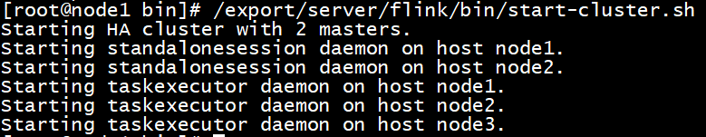


2.观察webUI

http://node1:8081/#/overview   ---Flink集群管理界面

http://node2:8081/#/overview   ---Flink集群管理界面


3.执行官方示例

/export/server/flink-1.12.0/bin/flink run  /export/server/flink-1.12.0/examples/batch/WordCount.jar


4.kill掉其中一个master

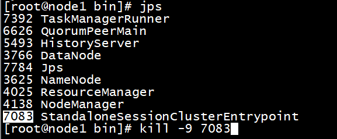


5.再次提交任务

/export/server/flink-1.12.0/bin/flink run  /export/server/flink-1.12.0/examples/batch/WordCount.jar


6.如果在第1步执行完之后,显示Flink进程已经启动了,但是webUI访问不到,或jps查看不到,说明集群没有启动成功,原因是因为如下错误:

cat /export/server/flink-1.12.0/log/flink-root-standalonesession-0-node1.log

发现如下错误

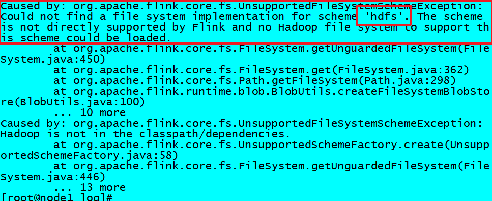

需要在lib目录下传入如下jar包

cd /export/server/flink-1.12.0/lib

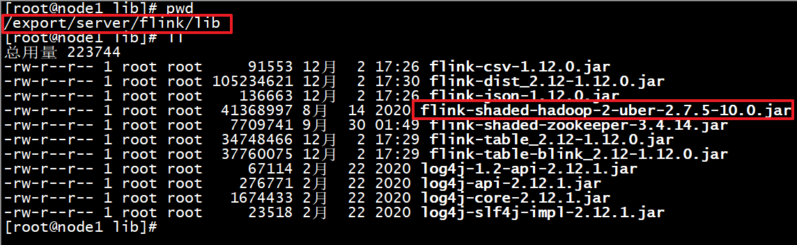

```
scp -r flink-shaded-hadoop-2-uber-2.7.5-10.0.jar node2:$PWD
scp -r flink-shaded-hadoop-2-uber-2.7.5-10.0.jar node3:$PWD
```


7.停止Flink集群

/export/server/flink-1.12.0/bin/stop-cluster.sh


## 2-4 FlinkOnYarn模式-掌握

### 注意

- 1.为什么Spark和Flink都支持OnYarn模式,开发中使用的较多的也是OnYarn模式?

``` properties
-1.Yarn的资源可以按需使用，提高集群的资源利用率（资源管理、任务调度）
-2.Yarn的任务有优先级，根据优先级运行作业
-3.基于Yarn调度系统，能够自动化地处理各个角色的 Failover(容错)
-4.支持多种调度模式: FIFO,Fair,Capacity...(课后记得复习)
```


之前Yarn在公司中使用场景很多,很广, 所以后面的Spark/Flink都支持OnYarn,而且公司中为了统一的管理所有的大数据资源和任务,那么都会使用Yarn

注意: 未来,可能K8S会越来越流行,应用上云(K8S是运维干的活)


- 2.Spark/Flink-On-Yarn的本质是什么? 需要启动Spark/Flink的Standalone集群吗?

不需要启动Spark/Flink原本的集群

<span style="color:red;background:white;font-size:20px;font-family:楷体;">**因为Spark/Flink-On-Yarn的本质是将Spark/Flink程序的jar运行在Yarn的JVM进程中,会在Yarn的JVM中启动相关的进程,如Master/Worker;**</span>


- 3.Flink-On-Yarn的原理图

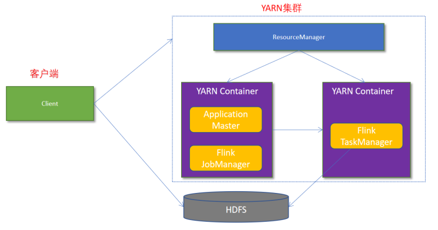


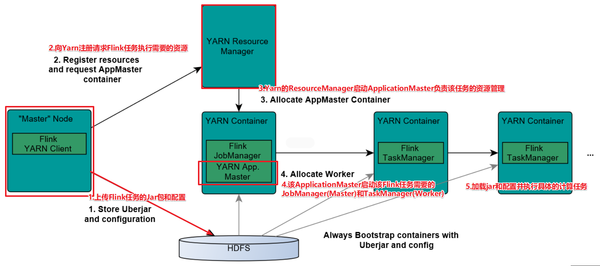

- Yarn运行流程

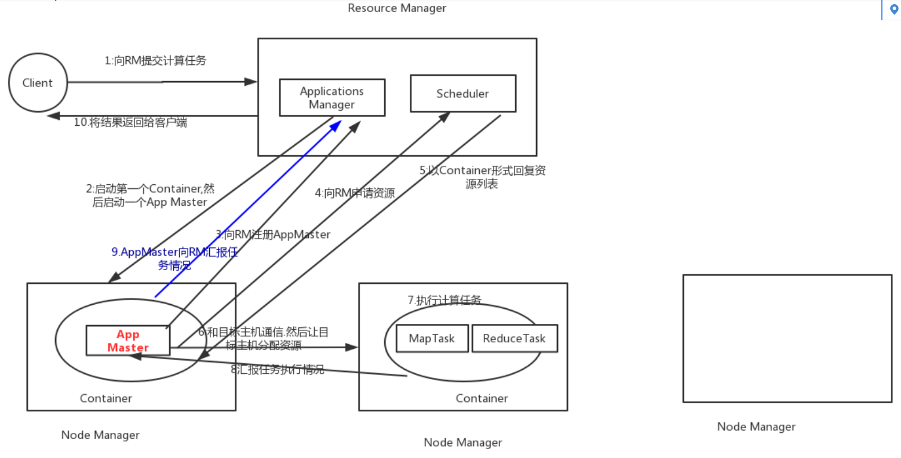


- 语言描述

  

  - 1.Client上传jar包和配置文件到HDFS集群上

    

  - 2.Client向Yarn ResourceManager**提交任务并申请资**

    

  - 3.ResourceManager分配Container资源并**启动ApplicationMaster**,然后AppMaster加载Flink的Jar包和配置构建环境,启动JobManager

    - JobManager和ApplicationMaster运行在同一个container上。

    - 一旦他们被成功启动，AppMaster就知道JobManager的地址(AM它自己所在的机器)。

    - 它就会为TaskManager生成一个新的Flink配置文件(他们就可以连接到JobManager)。

    - 这个配置文件也被上传到HDFS上。

    - 此外，AppMaster容器也提供了Flink的web服务接口。

    - YARN所分配的所有端口都是临时端口，这允许用户并行执行多个Flink

      

  - 4.**ApplicationMaster向ResourceManager申请工作资源,**NodeManager加载Flink的Jar包和配置构建环境并启动TaskManager

  

  - 5.TaskManager启动后向JobManager发送**心跳包**，并等待JobManager向其分配任务

    

- 总结（大白话）

  - 角色分配

  ``` properties
  Client : 客户
  ResourceManager:Fiberhome 公司
  	ApplicationManager:产品线
  	Scheduler:资源管理部门
  ApplicationMaster:项目经理
  JobManager:技术总监
  
  NodeManager: 各个模块资源池
  TaskManager:各个模块技术人才
  
  ```

  - Flink on Yarn 流程介绍：
    1. Client（**客户**） 提交任务（项目）给ResourceManager(**公司**)；
    2. ResourceManager（**产品线**） 会指定一个AppMaster（**项目经理**） 去管理这个任务（项目），在一个nodemanager 上启动AppMaster（**项目经理**）；
    3. AppMaster（**项目经理**） 会向ResourceManager （**公司**）中的ApplicationManager（**产品线**） 去注册任务；
    4. AppMaster（**项目经理**） 会向ResourceManager （**公司**）中的Scheduler（（**项目经理**））申请资源；
    5. Scheduler（**资源管理部门**） 将资源通过Container的方式打包给AppMaster（**项目经理**）；
    6. AppMaster（**项目经理**） 启动一个JobManager （**技术总监**）去管理这个任务的具体细节；
    7. AppMaster（**项目经理**） 根据资源信息去找到各个TaskManager（**模块负责人**）并开始执行计算任务（工作）；
    8. TaskManager（**模块负责人**）启动后向JobManager（**技术总监**）发送**心跳包**（实时沟通）；
    9. JobManager（**技术总监**）与AppMaster（**项目经理**）发送心跳包；
    10. AppMaster（**项目经理**） 与ApplicationsManager（**产品线**）发送心跳包；


### 2-4-1 两种模式

#### Session会话模式

适合较多的小任务


#### Per-Job任务分离模式

适合大任务且有充足的资源


### 2-4-2 操作和测试

注意: 关闭yarn的内存检查

vim /export/server/hadoop-2.7.5/etc/hadoop/yarn-site.xml

```xml
<!-- 关闭yarn内存检查 -->
<property>
<name>yarn.nodemanager.pmem-check-enabled</name>
    <value>false</value>
</property>
<property>
     <name>yarn.nodemanager.vmem-check-enabled</name>
     <value>false</value>
</property>
```

分发并重启yarn

```properties
scp -r /export/server/hadoop-2.7.5/etc/hadoop/yarn-site.xml node2:/export/server/hadoop-2.7.5/etc/hadoop/yarn-site.xml
scp -r /export/server/hadoop-2.7.5/etc/hadoop/yarn-site.xml node3:/export/server/hadoop-2.7.5/etc/hadoop/yarn-site.xml

/export/server/hadoop-2.7.5/sbin/stop-yarn.sh
/export/server/hadoop-2.7.5/sbin/start-yarn.sh
```


####  Session会话模式

##### 1.先在Yarn上启动一个Flink集群

/export/server/flink-1.12.0/bin/yarn-session.sh -n 2 -tm 800 -s 1 -d

说明:

``` properties
申请2个CPU、1600M内存

\# -n 表示申请2个容器，这里指的就是多少个taskmanager

\# -tm 表示每个TaskManager的内存大小

\# -s 表示每个TaskManager的slots数量

\# -d 表示以后台程序方式运行
```


##### 2.观察webUI

http://node1:8088/cluster

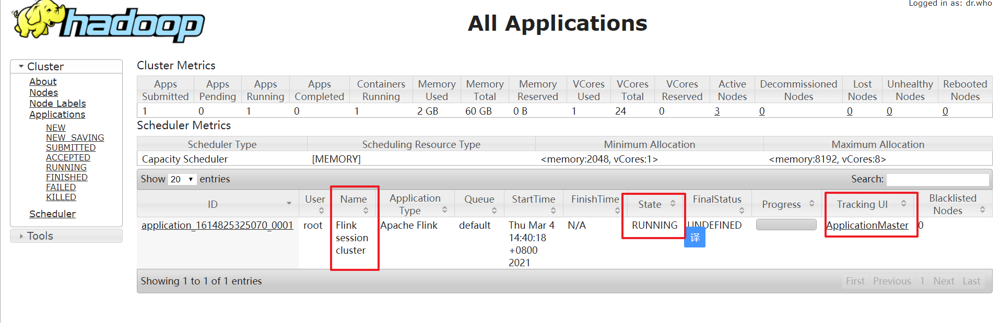


##### 3.提交任务

``` shell
/export/server/flink-1.12.0/bin/flink run  /export/server/flink-1.12.0/examples/batch/WordCount.jar
```

运行完之后再提交另一个(和上一个用的是Yarn上运行的同一个Flink集群)

  ``` shell
  /export/server/flink-1.12.0/bin/flink run  /export/server/flink-1.12.0/examples/batch/WordCount.jar
  ```


##### 4.关闭Yarn上运行的Flink集群

``` shell
yarn application -kill  application_1614825325070_0001
```


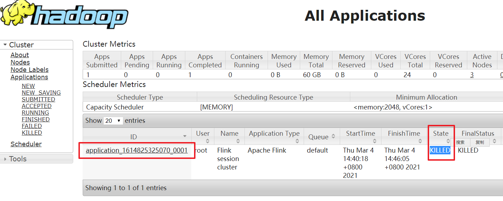


#### Per-Job-任务分离模式

##### flink run 提交任务

直接提交job会在Yarn上新开一个Flink集群运行完该任务自动关闭

``` shell
/export/server/flink-1.12.0/bin/flink run -m yarn-cluster -yjm 1024 -ytm 1024 -c 全包名 /export/server/flink-1.12.0/examples/batch/WordCount.jar
```


``` shell
/export/server/flink-1.12.0/bin/flink run -m yarn-cluster -yjm 1024 -ytm 1024 /export/server/flink-1.12.0/examples/batch/WordCount.jar
```

``` properties
\# -m  jobmanager的地址

\# -yjm 1024 指定jobmanager的内存信息

\# -ytm 1024 指定taskmanager的内存信息
```


2.再次提交,会在Yarn上再开启一个新的Flink集群,运行结束之后自动关闭

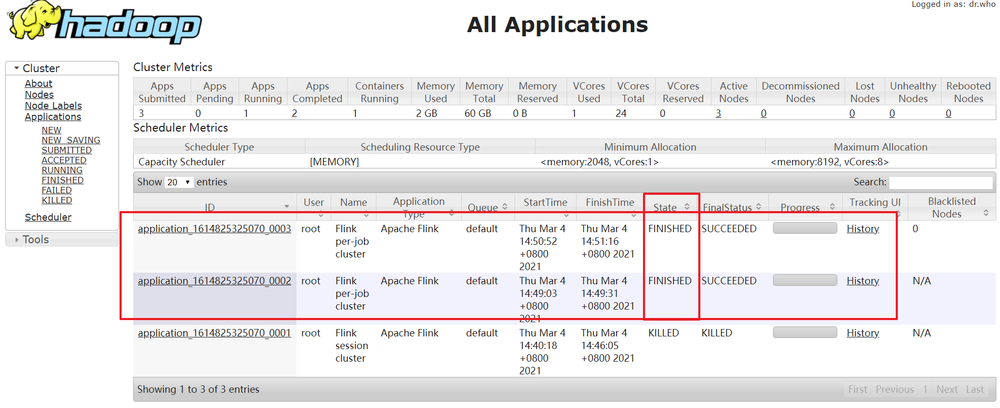


## 2-5 补充

如果在启动Flink集群后 jps看不到进程, 查看/export/server/flink/log有如下错误


需要注意:

1.启动hadoop

2.把资料中的jar放到flink的/export/server/flink/lib中并分发

flink-shaded-hadoop-2-uber-2.7.5-10.0.jar


# 3- Flink任务开发

## 3-1 需求

将我们自己写的/开发的Flink任务打包并提交到Yarn上


## 3-2 准备工作

### 3-2-1 API

注意:

1.Flink支持如下多个层次的API

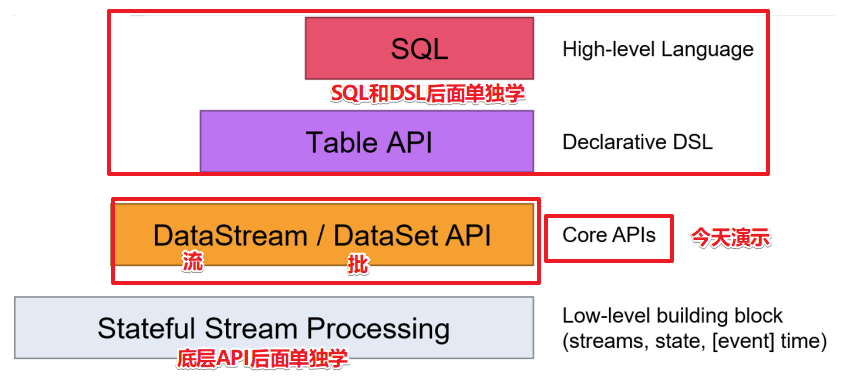

2.在Flink1.12版本中开始支持流批一体,也就是说可以使用DataStream流的API完成DataSet批API的功能,所以只在今天演示一下DataSet和DataStream, 后面课程直接使用DataStream,而且官方也直接说明了DataSet-API未来将被弃用

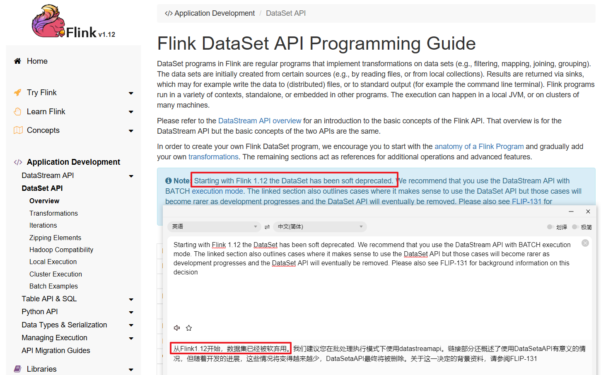


### 3-2-2 编码步骤/模型

Spark:

1.准备环境入口:SparkSession/SparkContext/StreamingContext

2.加载读取数据

3.Transformation操作

4.Action

5.Start启动执行


Flink:

1.env-准备环境

2.source-加载数据

3.transformation-数据处理转换

4.sink-数据输出

5.execute-执行


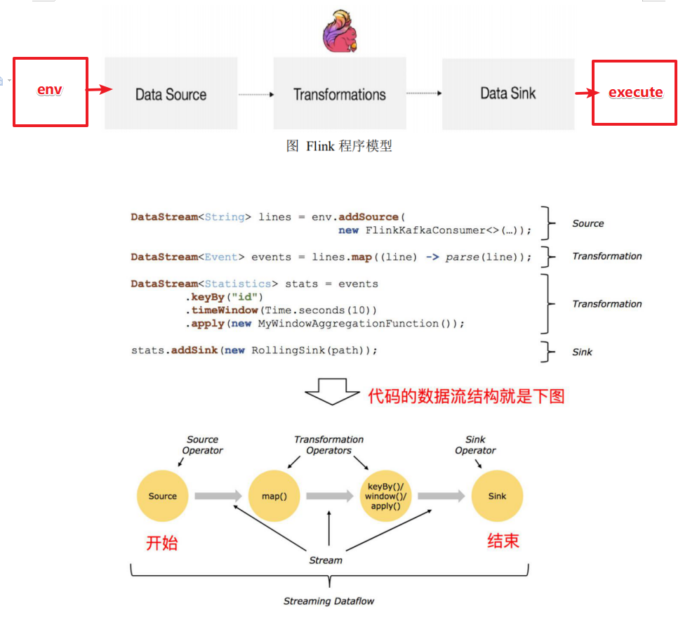

### 3-2-3 准备项目模块

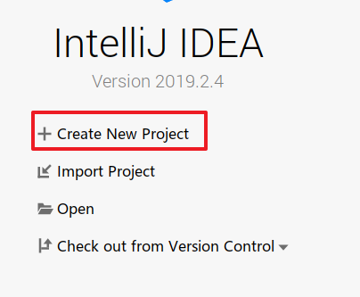


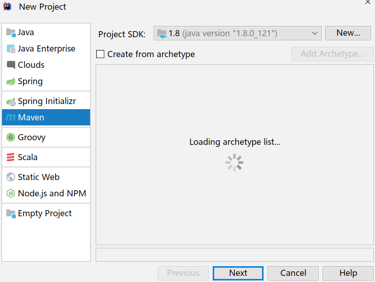


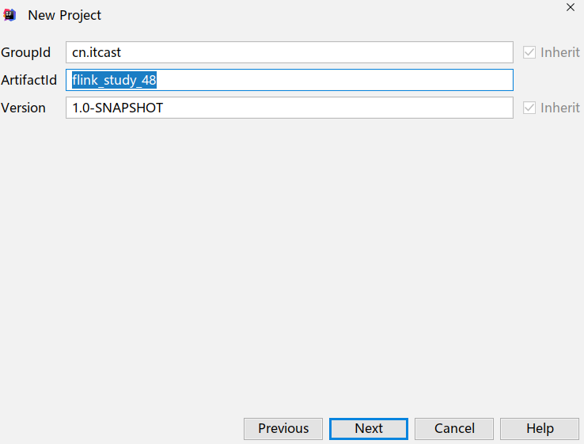


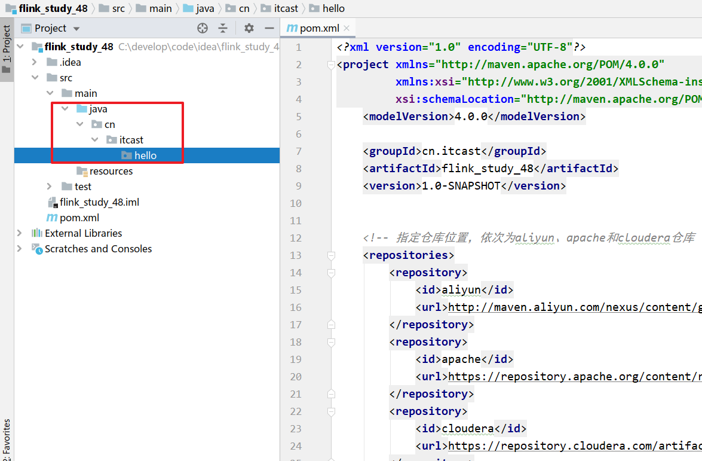


## 3-3 代码实现-1-DataSet

https://ci.apache.org/projects/flink/flink-docs-release-1.12/dev/batch/

```java
package cn.itcast.hello;

import org.apache.flink.api.common.functions.FlatMapFunction;
import org.apache.flink.api.common.functions.MapFunction;
import org.apache.flink.api.java.DataSet;
import org.apache.flink.api.java.ExecutionEnvironment;
import org.apache.flink.api.java.operators.AggregateOperator;
import org.apache.flink.api.java.operators.MapOperator;
import org.apache.flink.api.java.operators.UnsortedGrouping;
import org.apache.flink.api.java.tuple.Tuple2;
import org.apache.flink.util.Collector;

/**
 * Author itcast
 * Desc 演示Flink-DataSet-API完成批处理WordCount
 */
public class WordCount01 {
    public static void main(String[] args) throws Exception {
        //TODO 1.env-准备环境
        ExecutionEnvironment env = ExecutionEnvironment.getExecutionEnvironment();
        //TODO 2.source-加载数据
        //将本地数据转为Flink中的分布式集合
        //DataSet<一行行的数据>
        DataSet<String> dataSet = env.fromElements("itcast hadoop spark", "itcast hadoop spark", "itcast hadoop", "itcast");
        //TODO 3.transformation-数据转换处理
        //3.1对每一行数据进行分割并压扁
        /*
        public interface FlatMapFunction<T, O> extends Function, Serializable {
            void flatMap(T value, Collector<O> out) throws Exception;
         }
         */
        //DataSet<一个个的单词>
        DataSet<String> wordsDS = dataSet.flatMap(new FlatMapFunction<String, String>() {
            @Override
            public void flatMap(String value, Collector<String> out) throws Exception {
                //value就是进来的每一行数据,要切割并收集
                String[] words = value.split(" ");
                for (String word : words) {
                    out.collect(word);
                }
            }
        });
        //3.2每个单词记为<单词,1>
        /*
        public interface MapFunction<T, O> extends Function, Serializable {
            O map(T value) throws Exception;
         }
         */
        //DataSet<Tuple2<String, Integer>> wordAndOneDS =
        MapOperator<String, Tuple2<String, Integer>> wordAndOneDS = wordsDS.map(new MapFunction<String, Tuple2<String, Integer>>() {
            @Override
            public Tuple2<String, Integer> map(String value) throws Exception {
                return Tuple2.of(value, 1);
            }
        });
        //3.3分组
        //按照0号位置的单词进行分组
        UnsortedGrouping<Tuple2<String, Integer>> groupedDS = wordAndOneDS.groupBy(0);

        //3.4聚合
        //按照1号位置的数字进行聚合
        AggregateOperator<Tuple2<String, Integer>> result = groupedDS.sum(1);

        //TODO 4.sink-数据输出
        result.print();

        //TODO 5.execute-执行
        //env.execute();批里面已经有了print就不需要execute了
    }
}
```


## 3-4 代码实现-2-DataStream-掌握

https://ci.apache.org/projects/flink/flink-docs-release-1.12/dev/datastream_api.html

```java
package cn.itcast.hello;

import org.apache.flink.api.common.RuntimeExecutionMode;
import org.apache.flink.api.common.functions.FlatMapFunction;
import org.apache.flink.api.common.functions.MapFunction;
import org.apache.flink.api.java.functions.KeySelector;
import org.apache.flink.api.java.tuple.Tuple2;
import org.apache.flink.streaming.api.datastream.DataStream;
import org.apache.flink.streaming.api.datastream.KeyedStream;
import org.apache.flink.streaming.api.datastream.SingleOutputStreamOperator;
import org.apache.flink.streaming.api.environment.StreamExecutionEnvironment;
import org.apache.flink.util.Collector;

/**
 * Author itcast
 * Desc 演示Flink-DataStream-流批一体API完成批处理WordCount,后面课程会演示流处理
 */
public class WordCount02 {
    public static void main(String[] args) throws Exception {
        //TODO 1.env-准备环境
        StreamExecutionEnvironment env = StreamExecutionEnvironment.getExecutionEnvironment();
        //env.setRuntimeMode(RuntimeExecutionMode.STREAMING);//指定计算模式为流
        //env.setRuntimeMode(RuntimeExecutionMode.BATCH);//指定计算模式为批
        env.setRuntimeMode(RuntimeExecutionMode.AUTOMATIC);//自动
        //不设置的话默认是流模式defaultValue(RuntimeExecutionMode.STREAMING)

        //TODO 2.source-加载数据
        DataStream<String> dataStream = env.fromElements("itcast hadoop spark", "itcast hadoop spark", "itcast hadoop", "itcast");

        //TODO 3.transformation-数据转换处理
        //3.1对每一行数据进行分割并压扁
        /*
        public interface FlatMapFunction<T, O> extends Function, Serializable {
            void flatMap(T value, Collector<O> out) throws Exception;
         }
         */
        DataStream<String> wordsDS = dataStream.flatMap(new FlatMapFunction<String, String>() {
            @Override
            public void flatMap(String value, Collector<String> out) throws Exception {
                String[] words = value.split(" ");
                for (String word : words) {
                    out.collect(word);
                }
            }
        });
        //3.2每个单词记为<单词,1>
        /*
        public interface MapFunction<T, O> extends Function, Serializable {
            O map(T value) throws Exception;
         }
         */
        DataStream<Tuple2<String, Integer>> wordAndOneDS = wordsDS.map(new MapFunction<String, Tuple2<String, Integer>>() {
            @Override
            public Tuple2<String, Integer> map(String value) throws Exception {
                return Tuple2.of(value, 1);
            }
        });
        //3.3分组
        //注意:DataSet中分组用groupBy,DataStream中分组用keyBy
        //KeyedStream<Tuple2<String, Integer>, Tuple> keyedDS = wordAndOneDS.keyBy(0);
        /*
        public interface KeySelector<IN, KEY> extends Function, Serializable {
            KEY getKey(IN value) throws Exception;
        }
         */
        KeyedStream<Tuple2<String, Integer>, String> keyedDS = wordAndOneDS.keyBy(new KeySelector<Tuple2<String, Integer>, String>() {
            @Override
            public String getKey(Tuple2<String, Integer> value) throws Exception {
                return value.f0;
            }
        });

        //3.4聚合
        SingleOutputStreamOperator<Tuple2<String, Integer>> result = keyedDS.sum(1);

        //TODO 4.sink-数据输出
        result.print();

        //TODO 5.execute-执行
        env.execute();
    }
}
```


## 3-5 代码实现-3-DataStream-Lambda-扩展

就是使用Java的函数式编程

```java
package cn.itcast.hello;

import org.apache.flink.api.common.RuntimeExecutionMode;
import org.apache.flink.api.common.typeinfo.Types;
import org.apache.flink.api.java.tuple.Tuple2;
import org.apache.flink.streaming.api.datastream.DataStream;
import org.apache.flink.streaming.api.datastream.KeyedStream;
import org.apache.flink.streaming.api.datastream.SingleOutputStreamOperator;
import org.apache.flink.streaming.api.environment.StreamExecutionEnvironment;
import org.apache.flink.util.Collector;

import java.util.Arrays;

/**
 * Author itcast
 * Desc 演示Flink-DataStream-流批一体API完成批处理WordCount,后面课程会演示流处理
 * 使用Java8的lambda表示完成函数式风格的WordCount
 */
public class WordCount03 {
    public static void main(String[] args) throws Exception {
        //TODO 1.env-准备环境
        StreamExecutionEnvironment env = StreamExecutionEnvironment.getExecutionEnvironment();
        //env.setRuntimeMode(RuntimeExecutionMode.STREAMING);//指定计算模式为流
        //env.setRuntimeMode(RuntimeExecutionMode.BATCH);//指定计算模式为批
        env.setRuntimeMode(RuntimeExecutionMode.AUTOMATIC);//自动
        //不设置的话默认是流模式defaultValue(RuntimeExecutionMode.STREAMING)

        //TODO 2.source-加载数据
        DataStream<String> dataStream = env.fromElements("itcast hadoop spark", "itcast hadoop spark", "itcast hadoop", "itcast");

        //TODO 3.transformation-数据转换处理
        //3.1对每一行数据进行分割并压扁
        /*
        public interface FlatMapFunction<T, O> extends Function, Serializable {
            void flatMap(T value, Collector<O> out) throws Exception;
         }
         */
        /*DataStream<String> wordsDS = dataStream.flatMap(new FlatMapFunction<String, String>() {
            @Override
            public void flatMap(String value, Collector<String> out) throws Exception {
                String[] words = value.split(" ");
                for (String word : words) {
                    out.collect(word);
                }
            }
        });*/
        //注意:Java8的函数的语法/lambda表达式的语法: (参数)->{函数体}
        //dataStream.flatMap((value, out) -> Arrays.stream(value.split(" ")).forEach(word->out.collect(word)));
        DataStream<String> wordsDS = dataStream.flatMap(
                (String value, Collector<String> out) -> Arrays.stream(value.split(" ")).forEach(out::collect)
        ).returns(Types.STRING);


        //3.2每个单词记为<单词,1>
        /*
        public interface MapFunction<T, O> extends Function, Serializable {
            O map(T value) throws Exception;
         }
         */
        /*DataStream<Tuple2<String, Integer>> wordAndOneDS = wordsDS.map(new MapFunction<String, Tuple2<String, Integer>>() {
            @Override
            public Tuple2<String, Integer> map(String value) throws Exception {
                return Tuple2.of(value, 1);
            }
        });*/
        DataStream<Tuple2<String, Integer>> wordAndOneDS = wordsDS.map(
                (String value) -> Tuple2.of(value, 1)
        ).returns(Types.TUPLE(Types.STRING, Types.INT));

        //3.3分组
        //注意:DataSet中分组用groupBy,DataStream中分组用keyBy
        //KeyedStream<Tuple2<String, Integer>, Tuple> keyedDS = wordAndOneDS.keyBy(0);
        /*
        public interface KeySelector<IN, KEY> extends Function, Serializable {
            KEY getKey(IN value) throws Exception;
        }
         */
        /*KeyedStream<Tuple2<String, Integer>, String> keyedDS = wordAndOneDS.keyBy(new KeySelector<Tuple2<String, Integer>, String>() {
            @Override
            public String getKey(Tuple2<String, Integer> value) throws Exception {
                return value.f0;
            }
        });*/
        KeyedStream<Tuple2<String, Integer>, String> keyedDS = wordAndOneDS.keyBy((Tuple2<String, Integer> value) -> value.f0);

        //3.4聚合
        SingleOutputStreamOperator<Tuple2<String, Integer>> result = keyedDS.sum(1);

        //TODO 4.sink-数据输出
        result.print();

        //TODO 5.execute-执行
        env.execute();
    }
}
```


## 3-6 代码实现-4-DataStream-Yarn-掌握

### 3-6-1 修改代码

```java
package cn.itcast.hello;

import org.apache.flink.api.common.RuntimeExecutionMode;
import org.apache.flink.api.common.functions.FlatMapFunction;
import org.apache.flink.api.common.functions.MapFunction;
import org.apache.flink.api.java.functions.KeySelector;
import org.apache.flink.api.java.tuple.Tuple2;
import org.apache.flink.api.java.utils.ParameterTool;
import org.apache.flink.streaming.api.datastream.DataStream;
import org.apache.flink.streaming.api.datastream.KeyedStream;
import org.apache.flink.streaming.api.datastream.SingleOutputStreamOperator;
import org.apache.flink.streaming.api.environment.StreamExecutionEnvironment;
import org.apache.flink.util.Collector;

/**
 * Author itcast
 * Desc 演示Flink-DataStream-流批一体API完成批处理WordCount,后面课程会演示流处理
 * 改造代码使适合Yarn
 */
public class WordCount04 {
    public static void main(String[] args) throws Exception {
        //TODO 0.解析args参数中传入的数据(输入或)输出文件路径
        //String path = args[0];//这样写不好获取这样的格式 --output hdfs://......
        String path = "hdfs://node1:8020/wordcount/output48_";//--output hdfs://node1:8020/wordcount/output48_
        ParameterTool parameterTool = ParameterTool.fromArgs(args);
        if(parameterTool.has("output")){
            path = parameterTool.get("output");
        }
        path = path +  System.currentTimeMillis();

        //TODO 1.env-准备环境
        StreamExecutionEnvironment env = StreamExecutionEnvironment.getExecutionEnvironment();
        env.setRuntimeMode(RuntimeExecutionMode.BATCH);//指定计算模式为批

        //TODO 2.source-加载数据
        DataStream<String> dataStream = env.fromElements("itcast hadoop spark", "itcast hadoop spark", "itcast hadoop", "itcast");

        //TODO 3.transformation-数据转换处理
        //3.1对每一行数据进行分割并压扁
        DataStream<String> wordsDS = dataStream.flatMap(new FlatMapFunction<String, String>() {
            @Override
            public void flatMap(String value, Collector<String> out) throws Exception {
                String[] words = value.split(" ");
                for (String word : words) {
                    out.collect(word);
                }
            }
        });
        //3.2每个单词记为<单词,1>
        DataStream<Tuple2<String, Integer>> wordAndOneDS = wordsDS.map(new MapFunction<String, Tuple2<String, Integer>>() {
            @Override
            public Tuple2<String, Integer> map(String value) throws Exception {
                return Tuple2.of(value, 1);
            }
        });
        //3.3分组
        KeyedStream<Tuple2<String, Integer>, String> keyedDS = wordAndOneDS.keyBy(new KeySelector<Tuple2<String, Integer>, String>() {
            @Override
            public String getKey(Tuple2<String, Integer> value) throws Exception {
                return value.f0;
            }
        });

        //3.4聚合
        SingleOutputStreamOperator<Tuple2<String, Integer>> result = keyedDS.sum(1);

        //TODO 4.sink-数据输出
        result.print();
        //设置操作hadoop的用户为root,防止权限不足,如果还报权限问题,执行: hadoop fs -chmod -R 777  /
        System.setProperty("HADOOP_USER_NAME", "root");
        result.writeAsText(path).setParallelism(1);//生成一个文件

        //TODO 5.execute-执行
        env.execute();
    }
}

```


### 3-6-2 打包

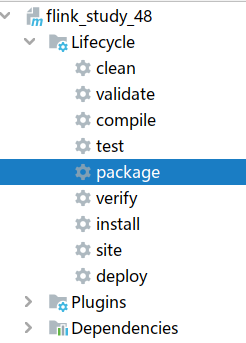

### 3-6-3 改名

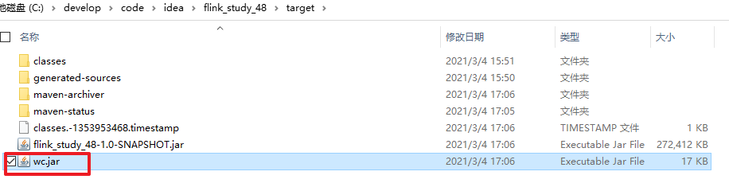


### 3-6-4 上传

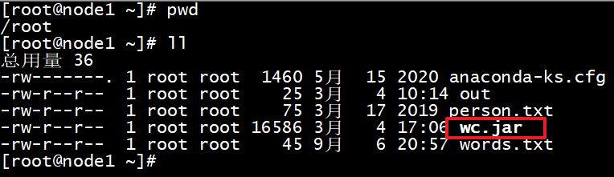


### 3-6-5 提交我们自己开发打包的任务

可以使用Session会话模式或任务分离模式

```properties
/export/server/flink-1.12.0/bin/flink run -m yarn-cluster -yjm 1024 -ytm 1024 -c com.fiberhome.flink.yarn.WordCount /export/data/flinkData/wc.jar --output hdfs://node1:8020/wordcount/output424_
```


6.观察yarn和hdfs


# 4- 作业

1.Flink环境搞定,如果出错调试超过30分钟, 直接拷贝

2.完成Flink-WordCount代码编写

3.复习---Spark原理! DAG Stage TaskSet Task 宽窄依赖....


# 5- 面试题

## 5-1 简单介绍一下Flink

- Flink 是一个**数据流上的有状态计算框架；**
- 适用于所有的流式场景；
- 能保证**精确一致性 (Exactly-once);**
- 真正基于**事件时间**去处理数据；

## 5-2 介绍一下Flink的组件

- 部署层：支持多种部署模式；
  - Local
  - cluster
    - **Standalone**
    - **Flink on yarn**
  - cloud;
- Core层；
- API层；
  - **DataSet ：批处理；**
  - **DataStream：流处理；**
  - Table API Batch;
  - Table API Streaming;
- **注意： 在Flink 1.12 版本 DataStream已经实现了流批统一；**


## 5-3 Flink的四大基石

- **window**
- **time**
- **state**
- **checkpoint**


## 5-5 Flink 的优点

- ​	**Flink同时支持高吞吐、低延迟、高性能；**
  - Spark 不支持低延迟（批处理）；
  - Storm 不支持搞吞吐；
- 真正的基于**事件时间的流式处理**框架；
- 支持**有状态**计算；
- 支**持窗口**操作；
- 支持**Checkpoint容错机制**；
- **流批统一；** （Flink1.12版本开始实行）
- 极高的课伸缩性；
- 部署灵活，支持多种资源调度器；

## 5-5 Flink安装部署

### 5-5-1 Spark

- Local
  - **一个JVM进程中通过线程模拟整个Spark的运行环境；**
  - JVM 进程能拿到多少资源，就是整个Spark能使用的资源；
  - Local模式下，使用**Driver线程 、Executor线程**来维持集群环境；
- Standalone
  - <span style="color:red;background:white;font-size:20px;font-family:楷体;">**注意： 只有在standalone模式下， 才有master worker  这两个角色**</span>
  - master :  **任务调度 、分配 + 资源调度、分配 + worker管理** ；
  - worker : 计算；
  - **master(管理资源、任务) + worker(计算)**
- Standalone-HA
- Spark On Yarn **Client**/**Cluster**
  - **资源管理和分配，无需spark操心，由Yarn集群管理；**
  - **spark只负责计算即可；**
  - **Yarn(资源管理) + Spark(计算)**
  - **Driver进程：任务管理、调度**
  - **Executor进程：计算；**
  - **client 模式：Driver是独立的进程；**
  - **cluster 模式：Driver 和 Appmaster 在一起；**

### 5-5-2 Flink

- **主： JobManager;**
- **从：TaskManager;**

- Local
  - 
- **Standalone**
  - 
- **Standalone-HA**
  - 
- **Flink On Yarn**
  - 
  - **Session会话模式** ：同时只有**一个**任务执行；
    - 
  - **Per-Job任务分离模式**:同时可以有**多个**任务执行；
    - 

## 5-6 为什么大数据任务执行都交给Yarn?

- Mr,Spark,Flink都交给了Yarn;
- 原因：
  - Yarn**成熟稳定**且功能强大；
  - **Yarn做统一的资源管理与调度；**
  - **Yarn支持多种调度策略；**
    - **FIFO; 队列调度器；**
    - **Fair; 公平调度器；** (CDH支持)
    - **capacity;容量调度器；** （apache默认支持）

5-6 Spark/Flink On Yarn 的本质是什么？ 需要单独启动Spark/Flink的Standalone集群么？ 

- **不需要**先单独启动Spark/Flink 的Standalone集群；
- 原因：
  - **Spark/Flink On Yarn 的本质是将Spark/Flink任务的Jar包放到Yarn的Jvm中去执行**；
  - 是在Yarn集群中启动的一些Jvm进程（Spark/Flink的一些角色）


## 5-7 Flink On Yarn案例

### 5-7-1 获取命令行中的参数

- ParameterTool工具类  

``` java
ParameterTool parameterTool = ParameterTool.fromArgs(args);
if(parameterTool.has("output")){
    path = parameterTool.get("output");
}
path = path +  System.currentTimeMillis();
```

### 5-7-2 Flink run 命令

``` shell
/export/server/flink-1.12.0/bin/flink run    	## 主命令
-m yarn-cluster 								## 模式
-yjm 1024 										## jobmanager 内存
-ytm 1024 										## taskManager 内存
-c com.fiberhome.flink.yarn.WordCount /export/data/flinkData/wc.jar   	## 包名和jar 包路径
--output hdfs://node1:8020/wordcount/output424_		## 额外的参数信息
```

