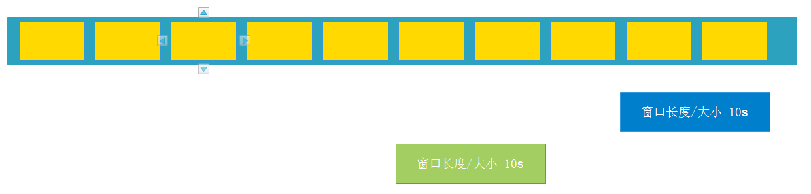
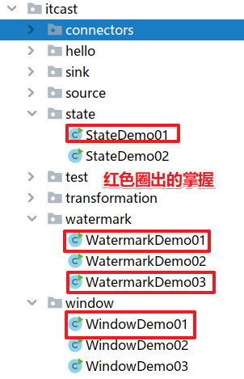

[TOC]


# 1- 复习回顾

- 1.Flink原理/核心概念

  - 流程

  

  - 核心概念/名词

    Client:**[提交任务]()**的客户端

    JobManager:[**资源管理/任务调度**]()的进程

    TaskManager:负责真正的[**执行任务**]()的进程

    Slot:TaskManager中真正执行任务的**[线程]()**

    Operator:Flink中的每一个计算[**操作/算子/步骤/计算单元**]()    **[RDD]()**

    OperatorChain:多个OneToOne的Operator可以合并为一个OperatorChain  **[Stage]()**

    **[StreamingDataFlow]()** :Flink程序中的多个**[Operator串行化]()**之后形成的一条执行流程(**[DAG]()**)

    Partition:每个Operator可以有1个~多个分区

    SubTask:**[分区上的一系列操作]()**

    Parallelism:同时运行的/**[并行的SubTask数量]()**

    Task:合并后的OperatorChain中的(或不能合并的Operator中的)**[多个SubTask组成Task]()**

    TaskSlot:运行[**SubTask的线程**]()

    [**StreamGraph**]():在Clinet端根据Operator的执行顺序串行化的**[流程图]()**

    **[JobGraph]()**:在Clinet端根据Operator的OneToOne关系,**[合并化之后的OperatroChain流程图]()**

    **[ExecutionGraph]()**:在JobManager上根据并行度设置进行**[并行化之后的流程图]()**

    物理执行图:在TaskManager上真正执行的流程图

- 四张图：
  - **[StreamingDataFlow]()** :Flink程序中的多个**[Operator串行化]()**之后形成的一条执行流程(**[DAG]()**)
  - [**StreamGraph**]():在Clinet端根据Operator的执行顺序串行化的**[流程图]()**
  - **[JobGraph]()**:在Clinet端根据Operator的OneToOne关系,**[合并化之后的OperatroChain流程图]()**
  - [**ExecutionGraph**]():在JobManager上根据**并行度**设置进行**[并行化之后的流程图]()**


- 2.Flink-DataStream-API-Source

  - 预定义的File/Dir/Collection/开始结束数字生成器/Socket

  - 自定义的

    

- 3.Flink-DataStream-API-Transformation

  - map/flatMap/filter/reduce/sum...keyBy
  - union和connect
  - sideOutput
  - rebalance


- 4.Flink-DataStream-API-Sink
  - print/File
  - 自定义


- 5.Flink-DataStream-API-Connectors
  - JDBC
  - Kafka
    - Source-FlinkKafkaConsumer("主题",反序列化规则,Properties(集群地址))
    - Sink-FlinkKafkaProducer("主题",序列化规则,Properties(集群地址))
  - Redis


# 2- Flink4大基石


注意: 上面的4个概念在Spark中已经学习过,这里重新讲解的更加深入, 原理会更多一点,但是使用起来很简单! 


# 3- Window

## 3-1 为什么需要Window?

在实时计算领域, 经常会有如下的需求:

每隔xx时间, 计算最近xx时间的数据,

如: 

每隔1min,计算最近24h的热搜词

每隔5s,计算最近1min的股票行情数据

每隔10min,计算最近1h的广告点击量

....

这些实时需求的实现就需要借助窗口!


## 3-2 Window有哪些控制属性?

为了完成上面提到的需求, 需要使用窗口来完成, 但是窗口需要有如下的属性才可以

窗口的长度/大小: 决定了要计算最近多长时间的数据

窗口的间隔:决定了每隔多久计算一次


## 3-3 Window的分类?

### 3-3-1 基于时间的滑动和滚动窗口--掌握

**窗口的长度/大小 > 窗口**的间隔: 如每隔5s, 计算最近10s的数据---**滑动窗口**


**窗口的长度/大小 = 窗口的间隔**: 如每隔10s,计算最近10s的数据---**滚动窗口**


窗口的长度/大小 < 窗口的间隔: 每隔15s,计算最近10s的数据---没有名字,开发不用!!!



### 3-3-2 基于数量的滚动和滑动窗口--了解

窗口的长度/大小 > 窗口的间隔: 如每隔5条/个数据, 就上最近10条/个数据---滑动

窗口的长度/大小 = 窗口的间隔: 如每隔10条/个数据, 就上最近10条/个数据---滚动

窗口的长度/大小 < 窗口的间隔: 如每隔15条/个数据, 就上最近10条/个数据---不用


### 3-3-3 会话窗口--了解

设置一个会话超时时间间隔即可, 如10分钟,那么表示:

**如果10分钟没有数据到来, 就计算上一个窗口的数据**


## 3-4 Window的API


## 3-5 Window代码演示

接下来演示Window的基本用法, 后面案例中和项目中再演示其他复杂用法

### 3-5 -1 基于时间的滑动和滚动

#### 3-5-1-1  需求

```properties
nc -lk 9999
有如下数据表示:
信号灯编号和通过该信号灯的车的数量
9,3
9,2
9,7
4,9
2,6
1,5
2,3
5,7
5,4
需求1:每5秒钟统计一次，最近5秒钟内，各个路口通过红绿灯汽车的数量--基于时间的滚动窗口
需求2:每5秒钟统计一次，最近10秒钟内，各个路口通过红绿灯汽车的数量--基于时间的滑动窗口
```


#### 3-5-1-2 代码实现

```java
package cn.itcast.window;

import lombok.AllArgsConstructor;
import lombok.Data;
import lombok.NoArgsConstructor;
import org.apache.flink.api.common.RuntimeExecutionMode;
import org.apache.flink.api.common.functions.MapFunction;
import org.apache.flink.streaming.api.datastream.DataStream;
import org.apache.flink.streaming.api.datastream.KeyedStream;
import org.apache.flink.streaming.api.environment.StreamExecutionEnvironment;
import org.apache.flink.streaming.api.windowing.assigners.SlidingProcessingTimeWindows;
import org.apache.flink.streaming.api.windowing.assigners.TumblingProcessingTimeWindows;
import org.apache.flink.streaming.api.windowing.time.Time;

/**
 * Author itcast
 * Desc 演示Flink-Window-基于时间的滚动和滑动
 * nc -lk 9999
 * 有如下数据表示:
 * 信号灯编号和通过该信号灯的车的数量
1,5
2,5
3,5
4,5
 * 需求1:每5秒钟统计一次，最近5秒钟内，各个路口通过红绿灯汽车的数量--基于时间的滚动窗口
 * 需求2:每5秒钟统计一次，最近10秒钟内，各个路口通过红绿灯汽车的数量--基于时间的滑动窗口
 */
public class WindowDemo01 {
    public static void main(String[] args) throws Exception {
        //TODO 1.env-准备环境
        StreamExecutionEnvironment env = StreamExecutionEnvironment.getExecutionEnvironment();
        env.setRuntimeMode(RuntimeExecutionMode.AUTOMATIC);

        //TODO 2.source-加载数据
        DataStream<String> socketDS = env.socketTextStream("192.168.88.161", 9999);

        //TODO 3.transformation-数据转换处理
        //将数据信号灯编号和数量: 9,3 解析为 JavaBean :CartInfo
        DataStream<CartInfo> carDS = socketDS.map(new MapFunction<String, CartInfo>() {
            @Override
            public CartInfo map(String value) throws Exception {
                String[] arr = value.split(",");
                String sensorId = arr[0];
                Integer count = Integer.valueOf(arr[1]);
                return new CartInfo(sensorId, count);
            }
        });
        //分组:因为后面的需求中,要计算各个路口的,所以先按照路口id分组
        KeyedStream<CartInfo, String> keyedDS = carDS.keyBy(car -> car.getSensorId());

        //需求1:每5秒钟统计一次，最近5秒钟内，各个路口通过红绿灯汽车的数量--基于时间的滚动窗口
        DataStream<CartInfo> result1 = keyedDS
                .window(TumblingProcessingTimeWindows.of(Time.seconds(5)))
                .sum("count");

        //需求2:每5秒钟统计一次，最近10秒钟内，各个路口通过红绿灯汽车的数量--基于时间的滑动窗口
        //size: The size of the generated windows.--窗口大小
        //slide: The slide interval of the generated windows.--滑动间隔
        DataStream<CartInfo> result2 = keyedDS.window(SlidingProcessingTimeWindows.of(Time.seconds(10), Time.seconds(5)))
                .sum("count");

        //TODO 4.sink-数据输出
        //result1.print();
        result2.print();
/*
1,5
2,5
3,5
4,5
*/

        //TODO 5.execute-执行
        env.execute();
    }
    @Data
    @AllArgsConstructor
    @NoArgsConstructor
    public static class CartInfo {
        private String sensorId;//信号灯id
        private Integer count;//通过该信号灯的车的数量
    }
}

```


### 3-5-2 基于数量的滑动和滚动

#### 3-5-2-1 需求

```
需求1:统计在最近5条消息中,各自路口通过的汽车数量,相同的key每出现5次进行统计--基于数量的滚动窗口
需求2:统计在最近5条消息中,各自路口通过的汽车数量,相同的key每出现3次进行统计--基于数量的滑动窗口
```


#### 3-5-2-2 代码实现

```java
package cn.itcast.window;

import lombok.AllArgsConstructor;
import lombok.Data;
import lombok.NoArgsConstructor;
import org.apache.flink.api.common.RuntimeExecutionMode;
import org.apache.flink.api.common.functions.MapFunction;
import org.apache.flink.streaming.api.datastream.DataStream;
import org.apache.flink.streaming.api.datastream.KeyedStream;
import org.apache.flink.streaming.api.environment.StreamExecutionEnvironment;

/**
 * Author itcast
 * Desc 演示Flink-Window-基于数量的滚动和滑动
 * nc -lk 9999
 * 有如下数据表示:
 * 信号灯编号和通过该信号灯的车的数量
 * 需求1:统计在最近5条消息中,各自路口通过的汽车数量,相同的key每出现5次进行统计--基于数量的滚动窗口
 * 需求2:统计在最近5条消息中,各自路口通过的汽车数量,相同的key每出现3次进行统计--基于数量的滑动窗口
 */
public class WindowDemo02 {
    public static void main(String[] args) throws Exception {
        //TODO 1.env-准备环境
        StreamExecutionEnvironment env = StreamExecutionEnvironment.getExecutionEnvironment();
        env.setRuntimeMode(RuntimeExecutionMode.AUTOMATIC);

        //TODO 2.source-加载数据
        DataStream<String> socketDS = env.socketTextStream("192.168.88.161", 9999);

        //TODO 3.transformation-数据转换处理
        //将数据信号灯编号和数量: 9,3 解析为 JavaBean :CartInfo
        DataStream<CartInfo> carDS = socketDS.map(new MapFunction<String, CartInfo>() {
            @Override
            public CartInfo map(String value) throws Exception {
                String[] arr = value.split(",");
                String sensorId = arr[0];
                Integer count = Integer.valueOf(arr[1]);
                return new CartInfo(sensorId, count);
            }
        });
        //分组:因为后面的需求中,要计算各个路口的,所以先按照路口id分组
        KeyedStream<CartInfo, String> keyedDS = carDS.keyBy(car -> car.getSensorId());

        //需求1:统计在最近5条消息中,各自路口通过的汽车数量,相同的key每出现5次进行统计--基于数量的滚动窗口
        DataStream<CartInfo> result1 = keyedDS.countWindow(5)
                .sum("count");

        //需求2:统计在最近5条消息中,各自路口通过的汽车数量,相同的key每出现3次进行统计--基于数量的滑动窗口
        DataStream<CartInfo> result2 = keyedDS.countWindow(5, 3)
                .sum("count");

        //TODO 4.sink-数据输出
        //result1.print();
        /*
1,1
1,1
1,1
1,1
2,1
1,1
         */
        result2.print();
        /*
需求2:统计在最近5条消息中,各自路口通过的汽车数量,相同的key每出现3次进行统计--基于数量的滑动窗口
1,1
1,1
2,1
1,1
2,1
3,1
4,1
         */


        //TODO 5.execute-执行
        env.execute();
    }
    @Data
    @AllArgsConstructor
    @NoArgsConstructor
    public static class CartInfo {
        private String sensorId;//信号灯id
        private Integer count;//通过该信号灯的车的数量
    }
}

```


### 3-5-3 会话窗口

- 概念
  - 注意:Flink还支持一个特殊的窗口:**[Session会话窗口]()**,需要**[设置一个会话超时时间]()**,如30s,则表示30s内**[没有数据到来,则触发上个窗口的计算]()**

#### 3-5-3-1 需求

设置会话超时时间为10s,10s内没有数据到来,则触发上个窗口的计算

#### 3-5-3-2 代码实现

```java
package cn.itcast.window;

import lombok.AllArgsConstructor;
import lombok.Data;
import lombok.NoArgsConstructor;
import org.apache.flink.api.common.RuntimeExecutionMode;
import org.apache.flink.api.common.functions.MapFunction;
import org.apache.flink.streaming.api.datastream.DataStream;
import org.apache.flink.streaming.api.datastream.KeyedStream;
import org.apache.flink.streaming.api.environment.StreamExecutionEnvironment;
import org.apache.flink.streaming.api.windowing.assigners.ProcessingTimeSessionWindows;
import org.apache.flink.streaming.api.windowing.time.Time;

/**
 * Author itcast
 * Desc 演示Flink-Window-会话窗口
 * nc -lk 9999
 * 有如下数据表示:
 * 信号灯编号和通过该信号灯的车的数量
 * 需求: 设置会话超时时间为10s,10s内没有数据到来,则触发上个窗口的计算
 */
public class WindowDemo03 {
    public static void main(String[] args) throws Exception {
        //TODO 1.env-准备环境
        StreamExecutionEnvironment env = StreamExecutionEnvironment.getExecutionEnvironment();
        env.setRuntimeMode(RuntimeExecutionMode.AUTOMATIC);

        //TODO 2.source-加载数据
        DataStream<String> socketDS = env.socketTextStream("192.168.88.161", 9999);

        //TODO 3.transformation-数据转换处理
        //将数据信号灯编号和数量: 9,3 解析为 JavaBean :CartInfo
        DataStream<CartInfo> carDS = socketDS.map(new MapFunction<String, CartInfo>() {
            @Override
            public CartInfo map(String value) throws Exception {
                String[] arr = value.split(",");
                String sensorId = arr[0];
                Integer count = Integer.valueOf(arr[1]);
                return new CartInfo(sensorId, count);
            }
        });
        //分组:因为后面的需求中,要计算各个路口的,所以先按照路口id分组
        KeyedStream<CartInfo, String> keyedDS = carDS.keyBy(car -> car.getSensorId());

        //需求: 设置会话超时时间为10s,10s内没有数据到来,则触发上个窗口的计算
        //size The session timeout, i.e. the time gap between sessions
        DataStream<CartInfo> result = keyedDS.window(ProcessingTimeSessionWindows.withGap(Time.seconds(10)))
                .sum("count");

        //TODO 4.sink-数据输出
        result.print();
/*
1,1
2,1
 */

        //TODO 5.execute-执行
        env.execute();
    }
    @Data
    @AllArgsConstructor
    @NoArgsConstructor
    public static class CartInfo {
        private String sensorId;//信号灯id
        private Integer count;//通过该信号灯的车的数量
    }
}

```


# 4- Time+Watermark

## 4-1 Time的分类


- 时间概念
  - EventTime:事件时间,是事件/数据真真正正发生时/产生时的时间 --- 用的最多
  - IngestionTime:摄入时间,是事件/数据到达流处理系统的时间
  - ProcessingTime:处理时间,是事件/数据被处理/计算时的系统的时间


- 注意：
  - SparkStreaming 只支持processing time;
  - Structured Streaming 中只支持processing处理时间 和 EventTime 事件时间
  - Flink 中都支持；
  - 但是目前在开发中一般都使用EventTime事件时间；

## 4-2 EventTime的重要性

```properties
假设，你正在去往地下停车场的路上，并且打算用手机点一份外卖。选好了外卖后，你就用在线支付功能付款了，这个时候是11点59分(EventTime)。恰好这时，你走进了地下停车库，而这里并没有手机信号。因此外卖的在线支付并没有立刻成功，而支付系统一直在Retry重试“支付”这个操作。
当你找到自己的车并且开出地下停车场的时候，已经是12点01分了(ProcessingTime)。这个时候手机重新有了信号，手机上的支付数据成功发到了外卖在线支付系统，支付完成。

在上面这个场景中你可以看到，
支付数据的事件时间是11点59分，而支付数据的处理时间是12点01分

问题:
如果要统计12之前的订单金额,那么这笔交易是否应被统计?
答案:
应该被统计,因为该数据的真真正正的产生时间为11点59分,即该数据的事件时间为11点59分,
事件时间能够真正反映/代表事件的本质! 所以一般在实际开发中会以事件时间作为计算标准
```


```properties
一条错误日志的内容为：
2020-11:11 23:59:58 error NullPointExcep --事件时间
进入Flink的时间为2020-11:11 23:59:59    --摄入时间
到达Window的时间为2020-11:12 00:00:01 --处理时间
问题:
对于业务来说，要统计每天的的故障日志个数，哪个时间是最有意义的？
答案:
EventTime事件时间，因为bug真真正正产生的时间就是事件时间,只有事件时间才能真正反映/代表事件的本质! 
```


```properties
某 App 会记录用户的所有点击行为，并回传日志（在网络不好的情况下，先保存在本地，延后回传）。
A用户在 11:01:00 对 App 进行操作，B用户在 11:02:00 操作了 App，
但是A用户的网络不太稳定，回传日志延迟了，导致我们在服务端先接受到B用户的消息，然后再接受到A用户的消息，消息乱序了。
问题:
如果这个是一个根据用户操作先后顺序,进行抢购的业务,那么是A用户成功还是B用户成功?
答案:
应该算A成功,因为A确实比B操作的早,但是实际中考虑到实现难度,可能直接按B成功算
也就是说，实际开发中希望基于事件时间来处理数据，但因为数据可能因为网络延迟等原因，出现了乱序，按照事件时间处理起来有难度！
```


```properties
在实际环境中，经常会出现，因为网络原因，数据有可能会延迟一会才到达Flink实时处理系统。我们先来设想一下下面这个场景:
原本应该被该窗口计算的数据因为网络延迟等原因晚到了,就有可能丢失了
```


- 总结:
  - 1.事件时间确实重要, 因为它能够代表事件/数据的**本质**,是事件/数据真真正正发生/产生的时间
  - 2.按照事件时间进去处理/计算,会存在一定的**难度**, 因为数据可能会因为网路延迟等原因, 发生**乱序或延迟**到达, 那么最后的计算结果就有可能错误或数据丢失
  - 3.需要有技术来解决上面的问题,使用**Watermark技术来解决**!


## 4-3 Watermark是什么?--时间戳

Watermark就是给数据额外添加的一列时间戳! 

Watermark = **当前最大的事件时间  -   最大允许的延迟时间(或最大允许的乱序度时间)**


## 4-4 Watermark能解决什么问题,如何解决的?

- 有了Watermark 就可以 **在一定程度上** 解决数据 **乱序或延迟** 达到问题! 


- 有了Watermark就可以**根据Watermark来决定窗口的触发时机**,满足下面的条件才触发:
  - 1.<span style="color:red;background:white;font-size:20px;font-family:楷体;">**窗口有数据**</span>
  - 2.<span style="color:red;background:white;font-size:20px;font-family:楷体;">**Watermark >= 窗口的结束时间**</span>

满足以上条件则触发窗口计算! 

**以前**窗口触发:**系统时间到了窗口结束时间**就触发

**现在**窗口触发:**Watermark  >= 窗口的结束时间**

而 Watermark =  **当前最大的事件时间  -   最大允许的延迟时间(或最大允许的乱序度时间)**

就意味着, 通过Watermark改变了窗口的触发时机了, 那么接下来我们看如何改变的/如何解决前面的问题的


需要记住:

<span style="color:red;background:white;font-size:20px;font-family:楷体;">**Watermark =  当前最大的事件时间  -   最大允许的延迟时间(或最大允许的乱序度时间)**</span>

<span style="color:red;background:white;font-size:20px;font-family:楷体;">**窗口触发时机 : Watermark >= 窗口的结束时间**</span>


## 4-5 Watermark图解原理


总结: 

1.Watermark 是一个单独计算出来的**时间戳**

2.**Watermark** 当前**最大的事件时间 - 最大允许的延迟时间**(乱序度)

3.Watermark可以通过改变窗口的触发时机 **在 一定程度上解决数据乱序或延迟达到的问题**

4.**Watermark >= 窗口结束时间** 时 就会触发窗口计算(窗口中得有数据)==

5.延迟或乱序严重的数据还是丢失, 但是可以通过调大 最大允许的延迟时间(乱序度) 来解决, 或 使用后面要学习的**侧道输出流**来单独收集延迟或乱序严重的数据,保证数据不丢失! 


## 4-6 Watermark代码演示


### 4-6-1 需求

``` properties
实时模拟生成订单数据,格式为: (订单ID，用户ID，时间戳/事件时间，订单金额)

要求每隔5s,计算5秒内，每个用户的订单总金额

并添加Watermark来解决一定程度上的数据延迟和数据乱序问题。
```


### 4-6-2 代码演示-开发版-掌握

https://ci.apache.org/projects/flink/flink-docs-release-1.12/dev/event_timestamps_watermarks.html

```java
package cn.itcast.watermark;

import lombok.AllArgsConstructor;
import lombok.Data;
import lombok.NoArgsConstructor;
import org.apache.flink.api.common.RuntimeExecutionMode;
import org.apache.flink.api.common.eventtime.WatermarkStrategy;
import org.apache.flink.streaming.api.datastream.DataStream;
import org.apache.flink.streaming.api.datastream.SingleOutputStreamOperator;
import org.apache.flink.streaming.api.environment.StreamExecutionEnvironment;
import org.apache.flink.streaming.api.functions.source.SourceFunction;
import org.apache.flink.streaming.api.windowing.assigners.TumblingEventTimeWindows;
import org.apache.flink.streaming.api.windowing.time.Time;

import java.time.Duration;
import java.util.Random;
import java.util.UUID;

/**
 * Author itcast
 * Desc
 * 实时模拟订单数据(订单id,用户id,订单金额,事件时间)
 * 每隔5s,计算最近5s内,每个用户的订单总金额
 * 并使用Watermark+EventTime来解决一定程度上的数据/延迟到达乱序问题
 */
public class WatermarkDemo01 {
    public static void main(String[] args) throws Exception {
        //TODO 1.env
        StreamExecutionEnvironment env = StreamExecutionEnvironment.getExecutionEnvironment();
        env.setRuntimeMode(RuntimeExecutionMode.AUTOMATIC);
        //TODO 2.source
        DataStream<Order> orderDS = env.addSource(new SourceFunction<Order>() {
            private boolean flag = true;

            @Override
            public void run(SourceContext<Order> ctx) throws Exception {
                Random ran = new Random();
                while (flag) {
                    String oid = UUID.randomUUID().toString();
                    int uid = ran.nextInt(3);
                    int money = ran.nextInt(100);
                    //随机模拟一些延迟
                    long eventTime = System.currentTimeMillis() - (1000 * ran.nextInt(3));
                    ctx.collect(new Order(oid,uid,money,eventTime));
                    Thread.sleep(1000);
                }
            }

            @Override
            public void cancel() {
                this.flag = false;
            }
        });

        //TODO 3.transformation
        //https://ci.apache.org/projects/flink/flink-docs-release-1.12/dev/event_timestamps_watermarks.html
        //实时模拟订单数据(订单id,用户id,订单金额,事件时间)
        //每隔5s,计算最近5s内,每个用户的订单总金额
        //并使用Watermark+EventTime来解决一定程度上的数据/延迟到达乱序问题
        //--1.告诉Flink该使用EventTime来进行窗口计算
        //env.setStreamTimeCharacteristic(TimeCharacteristic.EventTime);//新版本中不用设置,默认就是
        //--2.告诉Flink最大允许的延迟时间(或最大允许的乱序时间)
        SingleOutputStreamOperator<Order> watermarkDS = orderDS.assignTimestampsAndWatermarks(WatermarkStrategy.<Order>forBoundedOutOfOrderness(Duration.ofSeconds(2))
                //--3.哪一列是事件时间(Flink就可以自动计算Watermark了)
               .withTimestampAssigner((order, time) -> order.getEventTime()));
                /*.withTimestampAssigner(new SerializableTimestampAssigner<Order>() {
                    @Override
                    public long extractTimestamp(Order order, long recordTimestamp) {
                        return order.getEventTime();
                    }
                }));*/

        //--4.窗口计算
        SingleOutputStreamOperator<Order> result = watermarkDS.keyBy(Order::getUserId)
                .window(TumblingEventTimeWindows.of(Time.seconds(5)))
                .sum("money");

        //TODO 4.sink
        result.print();
        //TODO 5.execution
        env.execute();
    }
    @Data
    @AllArgsConstructor
    @NoArgsConstructor
    public static class Order {
        private String orderId;
        private Integer userId;
        private Integer money;
        private Long eventTime;
    }
}

```


### 4-6-3 代码演示-验证版-了解

https://ci.apache.org/projects/flink/flink-docs-release-1.12/dev/event_timestamps_watermarks.html

```java
package cn.itcast.watermark;

import lombok.AllArgsConstructor;
import lombok.Data;
import lombok.NoArgsConstructor;
import org.apache.commons.lang3.time.FastDateFormat;
import org.apache.flink.api.common.RuntimeExecutionMode;
import org.apache.flink.api.common.eventtime.*;
import org.apache.flink.streaming.api.datastream.DataStream;
import org.apache.flink.streaming.api.datastream.SingleOutputStreamOperator;
import org.apache.flink.streaming.api.environment.StreamExecutionEnvironment;
import org.apache.flink.streaming.api.functions.source.SourceFunction;
import org.apache.flink.streaming.api.functions.windowing.WindowFunction;
import org.apache.flink.streaming.api.windowing.assigners.TumblingEventTimeWindows;
import org.apache.flink.streaming.api.windowing.time.Time;
import org.apache.flink.streaming.api.windowing.windows.TimeWindow;
import org.apache.flink.util.Collector;

import java.util.ArrayList;
import java.util.List;
import java.util.Random;
import java.util.UUID;

/**
 * Author itcast
 * Desc 演示Flink-EventTime+Watermark在一定程度上解决数据乱序/延迟到达问题---验证原理
 * 实时模拟生成订单数据,格式为: (订单ID，用户ID，时间戳/事件时间，订单金额)
 * 要求每隔5s,计算5秒内，每个用户的订单总金额
 * 并添加Watermark来解决一定程度上的数据延迟和数据乱序问题。
 */
public class WatermarkDemo02 {
    public static void main(String[] args) throws Exception {
        //准备一个格式化时间的工具
        FastDateFormat df = FastDateFormat.getInstance("HH:mm:ss");

        //TODO 1.env-准备环境
        StreamExecutionEnvironment env = StreamExecutionEnvironment.getExecutionEnvironment();
        env.setRuntimeMode(RuntimeExecutionMode.AUTOMATIC);

        //TODO 2.source-加载数据
        DataStream<Order> orderDS = env.addSource(new SourceFunction<Order>() {
            private boolean flag = true;
            @Override
            public void run(SourceContext<Order> ctx) throws Exception {
                Random ran = new Random();
                while (flag){
                    String id = UUID.randomUUID().toString();
                    int uid = ran.nextInt(3);
                    int money = ran.nextInt(101);
                    //模拟数据延迟
                    long createTime = System.currentTimeMillis() - (1000 * ran.nextInt(3));//事件时间
                    System.out.println("发送的数据为: "+uid + " : " + df.format(createTime));
                    ctx.collect(new Order(id,uid,money,createTime));
                    Thread.sleep(1000);
                }
            }

            @Override
            public void cancel() {
                flag = false;
            }
        }).setParallelism(1);//方便观察

        //TODO 3.transformation-数据转换处理
        /*//====下面的需要掌握======
        //https://ci.apache.org/projects/flink/flink-docs-release-1.12/dev/event_timestamps_watermarks.html
        //-1.告诉Flink使用EventTime来进行窗口计算
        env.setStreamTimeCharacteristic(TimeCharacteristic.EventTime);//过期API,新版本中不需要设置,默认就是
        //-2.告诉Flink最大允许的延迟时间/乱序时间为多少
        SingleOutputStreamOperator<Order> orderDSWithWatermark = orderDS
        .assignTimestampsAndWatermarks(WatermarkStrategy.<Order>forBoundedOutOfOrderness(Duration.ofSeconds(3))
                *//*public interface TimestampAssigner<T> {
                	long extractTimestamp(T element, long recordTimestamp);
                }*//*
                //-3.告诉Flink哪一列是事件时间
                .withTimestampAssigner((order, time) -> order.getCreateTime())
        );
        //====上面的需要掌握======
       */

        //下面的代码是为了验证Watermark原理才写的,开发中不需要写
        DataStream<Order> orderDSWithWatermark = orderDS
                .assignTimestampsAndWatermarks(
                        new WatermarkStrategy<Order>() {
                            @Override
                            public WatermarkGenerator<Order> createWatermarkGenerator(WatermarkGeneratorSupplier.Context context) {
                                return new WatermarkGenerator<Order>() {
                                    private int userId = 0;
                                    private long eventTime = 0L;
                                    private final long outOfOrdernessMillis = 3000;//最大允许的延迟时间
                                    private long maxTimestamp = Long.MIN_VALUE + outOfOrdernessMillis + 1;

                                    //每次数据进来就可以获取到当前最大的事件时间
                                    @Override
                                    public void onEvent(Order event, long eventTimestamp, WatermarkOutput output) {
                                        userId = event.userId;
                                        eventTime = event.createTime;
                                        maxTimestamp = Math.max(maxTimestamp, eventTime);
                                    }

                                    @Override
                                    public void onPeriodicEmit(WatermarkOutput output) {
                                        //Watermaker = 当前最大事件时间 - 最大允许的延迟时间或乱序时间
                                        Watermark watermark = new Watermark(maxTimestamp - outOfOrdernessMillis - 1);
                                        System.out.println("key:" + userId + ",系统时间:" + df.format(System.currentTimeMillis()) + ",事件时间:" + df.format(eventTime) + ",水印时间:" + df.format(watermark.getTimestamp()));
                                        output.emitWatermark(watermark);
                                    }
                                };
                            }
                        }.withTimestampAssigner((event, timestamp) -> event.getCreateTime())
                );

        //每隔5s计算每隔用户最近5s的订单总金额
        //KeyedStream<Order, Integer> keyedDS = orderDSWithWatermark.keyBy(order -> order.getUserId());
        //SingleOutputStreamOperator<Order> resultDS = keyedDS.window(TumblingEventTimeWindows.of(Time.seconds(5))).sum("money");


        //下面的代码是为了验证Watermark原理才写的,开发中不需要写
        SingleOutputStreamOperator<String> resultDS = orderDSWithWatermark.keyBy(order -> order.getUserId())
                .window(TumblingEventTimeWindows.of(Time.seconds(5)))
                //把每个窗口中的数据的事件时间输出一下,并获取窗口的开始和结束时间,方便观察原理
                //为了获取这些信息,那么需要使用apply方法
                //把apply中的函数应用在窗口中的数据上
                /*public interface WindowFunction<IN, OUT, KEY, W extends Window> extends Function, Serializable {
                	void apply(KEY key, W window, Iterable<IN> input, Collector<OUT> out) throws Exception;
                }*/
                .apply(new WindowFunction<Order, String, Integer, TimeWindow>() {
                    @Override
                    public void apply(Integer key, TimeWindow window, Iterable<Order> orders, Collector<String> out) throws Exception {
                        //收集属于该窗口的所有数据的事件时间
                        List<String> eventTimeList = new ArrayList<>();
                        for (Order order : orders) {
                            String eventTime = df.format(order.getCreateTime());
                            eventTimeList.add(eventTime);
                        }
                        String start = df.format(window.getStart());
                        String end = df.format(window.getEnd());
                        String outStr = String.format("key:%s,窗口开始结束:[%s~%s),属于该窗口的事件时间:%s", key.toString(), start, end, eventTimeList);
                        out.collect(outStr);
                    }
                });

        //TODO 4.sink-数据输出
        resultDS.print();

        //TODO 5.execute-执行
        env.execute();
    }
    @Data
    @NoArgsConstructor
    @AllArgsConstructor
    public static class Order {
        private String id;
        private Integer userId;
        private Integer money;
        private Long createTime;
    }
}

```


### 4-6-4 代码演示-完美版/企业版-掌握

前面的案例中已经可以使用Watermark 来解决一定程度上的数据延迟和数据乱序问题

但是对于延迟/迟到/乱序严重的数据还是会丢失,所以接下来

使用 **Watermark + AllowedLateness + SideOutput**  ,即使用侧道输出机制来**单独收集延迟/迟到/乱序严重的数据**,避免数据丢失!


```java
package cn.itcast.watermark;

import lombok.AllArgsConstructor;
import lombok.Data;
import lombok.NoArgsConstructor;
import org.apache.flink.api.common.RuntimeExecutionMode;
import org.apache.flink.api.common.eventtime.WatermarkStrategy;
import org.apache.flink.api.common.typeinfo.TypeInformation;
import org.apache.flink.streaming.api.TimeCharacteristic;
import org.apache.flink.streaming.api.datastream.DataStream;
import org.apache.flink.streaming.api.datastream.KeyedStream;
import org.apache.flink.streaming.api.datastream.SingleOutputStreamOperator;
import org.apache.flink.streaming.api.environment.StreamExecutionEnvironment;
import org.apache.flink.streaming.api.functions.source.SourceFunction;
import org.apache.flink.streaming.api.windowing.assigners.TumblingEventTimeWindows;
import org.apache.flink.streaming.api.windowing.time.Time;
import org.apache.flink.util.OutputTag;

import java.time.Duration;
import java.util.Random;
import java.util.UUID;

/**
 * Author itcast
 * Desc 演示Flink-EventTime+Watermark在一定程度上解决数据乱序/延迟到达问题
 * 实时模拟生成订单数据,格式为: (订单ID，用户ID，时间戳/事件时间，订单金额)
 * 要求每隔5s,计算5秒内，每个用户的订单总金额
 * 并添加Watermark来解决一定程度上的数据延迟和数据乱序问题。
 * 使用Watermark + AllowedLateness + SideOutput ,即使用侧道输出机制来单独收集延迟/迟到/乱序严重的数据,避免数据丢失!
 */
public class WatermarkDemo03 {
    public static void main(String[] args) throws Exception {
        //TODO 1.env-准备环境
        StreamExecutionEnvironment env = StreamExecutionEnvironment.getExecutionEnvironment();
        env.setRuntimeMode(RuntimeExecutionMode.AUTOMATIC);

        //TODO 2.source-加载数据
        DataStream<Order> orderDS = env.addSource(new SourceFunction<Order>() {
            private boolean flag = true;
            @Override
            public void run(SourceContext<Order> ctx) throws Exception {
                Random ran = new Random();
                while (flag){
                    String id = UUID.randomUUID().toString();
                    int uid = ran.nextInt(3);
                    int money = ran.nextInt(101);
                    //模拟数据延迟
                    long createTime = System.currentTimeMillis() - (1000 * ran.nextInt(20));//事件时间
                    ctx.collect(new Order(id,uid,money,createTime));
                    Thread.sleep(1000);
                }
            }

            @Override
            public void cancel() {
                flag = false;
            }
        }).setParallelism(1);//方便观察

        //TODO 3.transformation-数据转换处理
        //====下面的需要掌握======
        //https://ci.apache.org/projects/flink/flink-docs-release-1.12/dev/event_timestamps_watermarks.html
        //-1.告诉Flink使用EventTime来进行窗口计算
        env.setStreamTimeCharacteristic(TimeCharacteristic.EventTime);//过期API,新版本中不需要设置,默认就是
        //-2.告诉Flink最大允许的延迟时间/乱序时间为多少
        SingleOutputStreamOperator<Order> orderDSWithWatermark = orderDS.assignTimestampsAndWatermarks(WatermarkStrategy.<Order>forBoundedOutOfOrderness(Duration.ofSeconds(3))
                /*public interface TimestampAssigner<T> {
                	long extractTimestamp(T element, long recordTimestamp);
                }*/
                //-3.告诉Flink哪一列是事件时间
                .withTimestampAssigner((order, time) -> order.getCreateTime())
        );
        //====上面的需要掌握======

        //====下面的代码是使用侧道输出单独收集迟到严重的数据,避免数据丢失,后续想怎么处理就怎么处理!=========
        //-1.准备一个侧道输出标签
        OutputTag latenessTag = new OutputTag("latenessTag", TypeInformation.of(Order.class));
        //每隔5s计算每隔用户最近5s的订单总金额
        //orderDSWithWatermark.keyBy(order->order.getUserId())//传入的是函数
        KeyedStream<Order, Integer> keyedDS = orderDSWithWatermark.keyBy(Order::getUserId);//传入的方法,方法可以转为函数!
        SingleOutputStreamOperator resultDS = keyedDS.window(TumblingEventTimeWindows.of(Time.seconds(5)))
                //-2.允许迟到并设置超过多久算迟到严重的数据
                .allowedLateness(Time.seconds(3))
                //-3.设置迟到严重的数据打什么标签/放在哪
                .sideOutputLateData(latenessTag)
                .sum("money");
        //-4.取出打上标签的数据
        DataStream latenessDS = resultDS.getSideOutput(latenessTag);
        //====上面的代码是使用侧道输出单独收集迟到严重的数据,避免数据丢失,后续想怎么处理就怎么处理!=========

        //TODO 4.sink-数据输出
        resultDS.print("正常的数据");
        latenessDS.print("迟到严重的数据");

        //TODO 5.execute-执行
        env.execute();
    }
    @Data
    @NoArgsConstructor
    @AllArgsConstructor
    public static class Order {
        private String id;
        private Integer userId;
        private Integer money;
        private Long createTime;
    }
}

```


# 5- State

## 5-1 有状态计算和无状态计算


- 无状态计算:
  - **不需要考虑历史数据**, 相同的输入,得到相同的输出!
  - 如:map, 将每个单词记为1, 进来一个hello, 得到(hello,1),再进来一个hello,得到的还是(hello,1)
- 有状态计算:
  - **需要考虑历史数据**, 相同的输入,可能会得到不同的输出!
  - 如:sum/reduce, 对单词按照key分组聚合,进来一个(hello,1),得到(hello,1), 再进来一个(hello,1), 得到的结果为(hello,2)


注意: Flink默认已经支持了无状态和有状态计算!

如下面的代码:已经做好了状态维护, 输入hello,输出(hello,1),再输入hello,输出(hello,2)

```java
package cn.itcast.source;

import org.apache.flink.api.common.RuntimeExecutionMode;
import org.apache.flink.api.common.functions.FlatMapFunction;
import org.apache.flink.api.common.functions.MapFunction;
import org.apache.flink.api.java.functions.KeySelector;
import org.apache.flink.api.java.tuple.Tuple2;
import org.apache.flink.streaming.api.datastream.DataStream;
import org.apache.flink.streaming.api.datastream.KeyedStream;
import org.apache.flink.streaming.api.datastream.SingleOutputStreamOperator;
import org.apache.flink.streaming.api.environment.StreamExecutionEnvironment;
import org.apache.flink.util.Collector;

/**
 * Author itcast
 * Desc 演示Flink-DataStream流批一体API-Source
 */
public class SourceDemo03_Socket {
    public static void main(String[] args) throws Exception {
        //TODO 1.env-准备环境
        StreamExecutionEnvironment env = StreamExecutionEnvironment.getExecutionEnvironment();
        env.setRuntimeMode(RuntimeExecutionMode.AUTOMATIC);

        //TODO 2.source-加载数据
        DataStream<String> socketDS = env.socketTextStream("192.168.88.161", 8888);

        //TODO 3.transformation-数据转换处理
        //3.1对每一行数据进行分割并压扁
        DataStream<String> wordsDS = socketDS.flatMap(new FlatMapFunction<String, String>() {
            @Override
            public void flatMap(String value, Collector<String> out) throws Exception {
                String[] words = value.split(" ");
                for (String word : words) {
                    out.collect(word);
                }
            }
        });
        //3.2每个单词记为<单词,1>
        DataStream<Tuple2<String, Integer>> wordAndOneDS = wordsDS.map(new MapFunction<String, Tuple2<String, Integer>>() {
            @Override
            public Tuple2<String, Integer> map(String value) throws Exception {
                return Tuple2.of(value, 1);
            }
        });
        //3.3分组
        KeyedStream<Tuple2<String, Integer>, String> keyedDS = wordAndOneDS.keyBy(new KeySelector<Tuple2<String, Integer>, String>() {
            @Override
            public String getKey(Tuple2<String, Integer> value) throws Exception {
                return value.f0;
            }
        });

        //3.4聚合-有状态
        SingleOutputStreamOperator<Tuple2<String, Integer>> result = keyedDS.sum(1);

        //TODO 4.sink-数据输出
        result.print();

        //TODO 5.execute-执行
        env.execute();
    }
}

```


## 5-2 有状态计算和无状态计算的应用场景

- 无状态计算:数据**[转换,过滤]()**等操作直接使用无状态的map/filter即可

- 有状态计算:需要做**[聚合/比较]()**的操作得使用有状态的sum/reduce/maxBy/minBy....

注意: Flink中关于状态State全部都维护好了 ,一般情况下都是直接使用,  不需要额外的操心! 特殊业务(后面项目中会被股票的实时数据放入状态方便后续的使用)可能会需要手动处理状态! 所以接下来学习手动处理状态! 


## 5-3 有状态中的状态的分类

### 5-3-1 Managed State & Raw State / 托管状态和原始状态


<span style="color:red;background:white;font-size:20px;font-family:楷体;">**开发只用Managed State**</span>


### 5-3-2 Keyed State & Operator State

- 本质区别：
  - **[KeyedState 有key ; Operator 不需要有key]()**；


## 5-4 代码演示-Managed State-Keyed State-掌握

https://ci.apache.org/projects/flink/flink-docs-stable/dev/stream/state/state.html

需求:

使用KeyState中的ValueState获取数据中的最大值(实际中直接使用maxBy即可)

也就是我们自己使用KeyState中的ValueState来模拟实训maxBy

代码实现:

```java
package cn.itcast.state;

import org.apache.flink.api.common.RuntimeExecutionMode;
import org.apache.flink.api.common.functions.RichMapFunction;
import org.apache.flink.api.common.state.ValueState;
import org.apache.flink.api.common.state.ValueStateDescriptor;
import org.apache.flink.api.java.tuple.Tuple2;
import org.apache.flink.api.java.tuple.Tuple3;
import org.apache.flink.configuration.Configuration;
import org.apache.flink.streaming.api.datastream.DataStream;
import org.apache.flink.streaming.api.environment.StreamExecutionEnvironment;

/**
 * Author itcast
 * Desc 演示Flink-State-Managed State - KeyedState - ValueState
 * 使用KeyState中的ValueState获取数据中的最大值(实际中直接使用maxBy即可)
 * 也就是我们自己使用KeyState中的ValueState来模拟实训maxBy
 */
public class StateDemo01 {
    public static void main(String[] args) throws Exception {
        //TODO 1.env-准备环境
        StreamExecutionEnvironment env = StreamExecutionEnvironment.getExecutionEnvironment();
        env.setRuntimeMode(RuntimeExecutionMode.AUTOMATIC);
        //TODO 2.source-加载数据
        DataStream<Tuple2<String, Long>> tupleDS = env.fromElements(
                Tuple2.of("北京", 1L),
                Tuple2.of("上海", 2L),
                Tuple2.of("北京", 6L),
                Tuple2.of("上海", 8L),
                Tuple2.of("北京", 3L),
                Tuple2.of("上海", 4L)
        );

        //TODO 3.transformation-数据转换处理
        //需求:求每个城市的最大值
        //方式1:使用Flink提供好的API:maxBy--开发中使用这个
        DataStream<Tuple2<String, Long>> result1 = tupleDS.keyBy(0).maxBy(1);

        //方式2:使用KeyState中的ValueState来自己处理/维护状态来实现maxBy的功能
        DataStream<Tuple3<String, Long, Long>> result2 = tupleDS.keyBy(t -> t.f0).map(new RichMapFunction<Tuple2<String, Long>, Tuple3<String, Long, Long>>() {
            //-1.定义一个状态用来存放最大值
            private ValueState<Long> maxValueState = null;

            //-2.初始化状态(一次)
            @Override
            public void open(Configuration parameters) throws Exception {
                //创建状态描述器
                ValueStateDescriptor<Long> stateDescriptor = new ValueStateDescriptor<>("maxValueState", Long.class);
                //根据状态描述器获取状态
                maxValueState = getRuntimeContext().getState(stateDescriptor);
            }

            //-3.使用状态
            @Override
            public Tuple3<String, Long, Long> map(Tuple2<String, Long> value) throws Exception {
                Long currentValue = value.f1;//当前值
                Long maxValue = maxValueState.value();//历史最大值
                if (maxValue == null || currentValue > maxValue) {
                    maxValue = currentValue;//当前值作为最大值
                }
                //-4.更新状态
                maxValueState.update(maxValue);
                return Tuple3.of(value.f0, currentValue, maxValue);
            }
        });

        //TODO 4.sink-数据输出
        result1.print("maxBy");
        //(上海,8)
        //(北京,6)
        result2.print("KeyState中的ValueState来模拟的maxBy的功能");
        //(上海,2,2)
        //(上海,8,8)
        //(上海,4,8)
        //(北京,1,1)
        //(北京,6,6)
        //(北京,3,6)

        //TODO 5.execute-执行
        env.execute();
    }
}

```


## 5-5 代码演示-Managed State-Operator State-了解

https://ci.apache.org/projects/flink/flink-docs-stable/dev/stream/state/state.html

需求:使用Operator State - ListState 存储offset模拟FlinkKafkaConsumer的offset维护

注意:**[开发中还是直接使用FlinkKafkaConsume自带的功能即可]()**

```java
package cn.itcast.state;

import org.apache.flink.api.common.RuntimeExecutionMode;
import org.apache.flink.api.common.restartstrategy.RestartStrategies;
import org.apache.flink.api.common.state.ListState;
import org.apache.flink.api.common.state.ListStateDescriptor;
import org.apache.flink.runtime.state.FunctionInitializationContext;
import org.apache.flink.runtime.state.FunctionSnapshotContext;
import org.apache.flink.runtime.state.filesystem.FsStateBackend;
import org.apache.flink.streaming.api.CheckpointingMode;
import org.apache.flink.streaming.api.checkpoint.CheckpointedFunction;
import org.apache.flink.streaming.api.datastream.DataStreamSource;
import org.apache.flink.streaming.api.environment.CheckpointConfig;
import org.apache.flink.streaming.api.environment.StreamExecutionEnvironment;
import org.apache.flink.streaming.api.functions.source.RichParallelSourceFunction;

import java.util.Iterator;

/**
 * Author itcast
 * Desc 演示Flink-State-Managed State - 使用Operator State - ListState存储offset模拟FlinkKafkaConsumer的offset维护
 * 注意:开发中还是直接使用FlinkKafkaConsume自带的功能即可
 */
public class StateDemo02 {
    public static void main(String[] args) throws Exception {
        //TODO 1.env-准备环境
        StreamExecutionEnvironment env = StreamExecutionEnvironment.getExecutionEnvironment();
        env.setRuntimeMode(RuntimeExecutionMode.AUTOMATIC);
        env.setParallelism(1);

        //配置Checkpoint,明天学习,今天先用
        env.enableCheckpointing(1000);//每隔1s执行一次Checkpoint
        env.setStateBackend(new FsStateBackend("file:///D:/ckp"));
        env.getCheckpointConfig().enableExternalizedCheckpoints(CheckpointConfig.ExternalizedCheckpointCleanup.RETAIN_ON_CANCELLATION);
        env.getCheckpointConfig().setCheckpointingMode(CheckpointingMode.EXACTLY_ONCE);
        //固定延迟重启策略: 程序出现异常的时候，重启2次，每次延迟3秒钟重启，超过2次，程序退出
        env.setRestartStrategy(RestartStrategies.fixedDelayRestart(2, 3000));

        //TODO 2.source-加载数据
        DataStreamSource<String> myKafkaDS = env.addSource(new MyKafkaSource()).setParallelism(1);

        //TODO 3.transformation-数据转换处理

        //TODO 4.sink-数据输出
        myKafkaDS.print();

        //TODO 5.execute-执行
        env.execute();
    }

    //使用Operator State - ListState存储offset模拟FlinkKafkaConsumer的offset维护
    private static class MyKafkaSource extends RichParallelSourceFunction<String> implements CheckpointedFunction {
        private boolean flag = true;
        //-1.声明State用来存放offset
        private ListState<Long> offsetState = null;
        private Long offset = 0L;

        //-2.初始化State
        @Override
        public void initializeState(FunctionInitializationContext context) throws Exception {
            //创建State描述器
            ListStateDescriptor<Long> stateDescriptor = new ListStateDescriptor<>("offsetState", Long.class);
            //根据状态描述器获取状态
            offsetState = context.getOperatorStateStore().getListState(stateDescriptor);
        }

        //不断运行产生数据
        @Override
        public void run(SourceContext<String> ctx) throws Exception {
            Iterator<Long> iterator = offsetState.get().iterator();
            if(iterator.hasNext()){
                offset = iterator.next();
            }
            while (flag){
                offset += 1; //++/+=都不是原子性
                ctx.collect("subTaskId:"+getRuntimeContext().getIndexOfThisSubtask() + " 消费到哪个偏移量了: "+ offset);
                Thread.sleep(2000);
                //注意:睡眠得在这里的原因是:得趁这时候执行每隔1s的快照,然后快照成功了,再出bug,后续恢复才能从快照中正确的恢复出来!
                //也就是要保证在出异常之前已经做好快照了
                //当然我们自己写的模拟FlinkKafkaConsumer维护offset功能比较简单,人家源码中会更加完善一点
                if(offset % 5 == 0){
                    System.out.println("发生异常了");
                    throw new RuntimeException("发生异常了");
                }
            }
        }

        //取消时执行
        @Override
        public void cancel() {
            flag = false;
        }

        //执行Checkpoint快照时执行(Checkpoint明天学,先用),也就是定期将状态信息存入Checkpoint快照中
        @Override
        public void snapshotState(FunctionSnapshotContext context) throws Exception {
            offsetState.clear();//清理State并存入快照
            offsetState.add(offset);
        }

    }
}

```


# 作业



1.把标记为掌握的代码-搞定(看懂,并敲几遍)

2.把标记为了解的代码,能知道在演示什么即可(也就是运行并看懂结果即可)

3.复习Spark中的Checkpoint


# 6- 面试题总结

## 6-1核心概念/名词

- Client:**[提交任务]()**的客户端
- **[JobManager]()**:[**资源管理/任务调度**]()的进程
- **[TaskManager]()**:负责真正的[**执行任务**]()的进程
- Slot:TaskManager中真正执行任务的**[线程]()**
- Operator:Flink中的每一个计算[**操作/算子/步骤/计算单元**]()    **[RDD]()**
- **[OperatorChain]()**:多个OneToOne的Operator可以合并为一个OperatorChain  **[Stage]()**
- [**OneToOne 和 Redistribute**]()  窄依赖 和宽依赖
- **[StreamingDataFlow:Flink]()**程序中的多个**[Operator串行化]()**之后形成的一条执行流程(**[DAG]()**)
- Partition:每个Operator可以有1个~多个**[分区]()**


- SubTask:**[分区上的一系列操作]()**


- Parallelism:同时运行的/**[并行的SubTask数量]()**

- Task:合并后的OperatorChain中的(或不能合并的Operator中的)**[多个SubTask组成Task]()**

- **[TaskSlot]()**:运行[**SubTask的线程**]()
- [**StreamGraph**]():在Clinet端根据Operator的执行顺序串行化的**[流程图]()**
- **[JobGraph]()**:在Clinet端根据Operator的OneToOne关系,**[合并化之后的OperatroChain流程图]()**
- **[ExecutionGraph]()**:在JobManager上根据并行度设置进行**[并行化之后的流程图]()**
- 物理执行图:在TaskManager上真正执行的流程图


## 6-2 Flink中的四张图

- **[StreamingDataFlow]()** :Flink程序中的多个**[Operator串行化]()**之后形成的一条执行流程(**[DAG]()**)
- [**StreamGraph**]():在Clinet端根据Operator的执行顺序串行化的**[流程图]()**
- **[JobGraph]()**:在Clinet端根据Operator的OneToOne关系,**[合并化之后的OperatroChain流程图]()**
- [**ExecutionGraph**]():在JobManager上根据**并行度**设置进行**[并行化之后的物理执行图]()**


## 6-3 Flink 中Source-Transformation-Sink-Connector 常用API

- 2.Flink-DataStream-API-Source

  - 预定义的File/Dir/Collection/开始结束数字生成器/Socket

  - 自定义的 **[addSource]()**

    

- 3.Flink-DataStream-API-Transformation

  - map/flatMap/filter/reduce/sum...keyBy
  - **union和connect**
    - union:合并**相同类型**的DS;
    - connect可以**[合并不同类型]()**的DS;
  - sideOutput : 侧道输出
  - **[rebalance]()** ： （底层原理：轮询）可以一定程度上的解决数据倾斜问题；


- 4.Flink-DataStream-API-Sink
  - print/File
  - 自定义 ： addSink 


- 5.Flink-DataStream-API-Connectors
  - JDBC
  - Kafka
    - Source-**[FlinkKafkaConsumer]()**("主题",反序列化规则,Properties(集群地址))
    - Sink-**[FlinkKafkaProducer]()**("主题",序列化规则,Properties(集群地址))
  - Redis
    - 需要使用第三方工具


## 6-4 介绍一下Flink中的窗口

- Spark窗口
  - 基于时间的**滑动窗口**；
  - 基于时间的**滚动窗口**；
- Flink
  - 基于时间的**滑动窗口**；
    - window(**[SlidingProcessingTimeWindows]()**.of(Time.seconds(10), Time.seconds(5)))
  - 基于时间的**滚动窗口**；
    - window(**[TumblingProcessingTimeWindows]()**.of(Time.seconds(5)))
  - 基于数量的**滑动窗口**；
    - **[countWindow]()**(5, 3)
  - 基于数量的**滚动窗口**；
    - **[countWindow]()**(5)
  - 基于**会话窗口**；
    - window(**[ProcessingTimeSessionWindows.withGap]()**(Time.seconds(10)))
    - **[Session会话窗口]()**,需要**[设置一个会话超时时间]()**,如30s,则表示30s内**[没有数据到来,则触发上个窗口的计算]()**

## 6-5 Flink有关window的算子


## 6-6 介绍一下time

- 时间概念
  - **[EventTime]()**:事件时间,是事件/数据真真正正发生时/产生时的时间 --- 用的最多
  - IngestionTime:摄入时间,是事件/数据**到达流处理系统的时间**
  - **[ProcessingTime]()**:处理时间,是事件/数据**被处理/计算时的系统的时间**


- 注意：
  - [**SparkStreaming**]() 只支持 **processing time**;
  - **[Structured Streaming]()** 中只支持processing**处理时间** 和 EventTime **事件时间**
  - **[Flink 中都支持]()**；
  - 但是目前在开发中一般都使用EventTime事件时间；

- 总结:
  - 1.事件时间确实重要, 因为它能够代表事件/数据的**本质**,是事件/数据真真正正发生/产生的时间
  - 2.按照事件时间进去处理/计算,会存在一定的**难度**, 因为数据可能会因为网路延迟等原因, 发生**乱序或延迟**到达, 那么最后的计算结果就有可能错误或数据丢失
  - 3.需要有技术来解决上面的问题,使用**Watermark技术来解决**!


## 6-7 Watermark是什么?--时间戳

Watermark就是给数据额外添加的一列时间戳! 

Watermark = **[当前最大的事件时间  -   最大允许的延迟时间(或最大允许的乱序度时间)]()**


## 6-8 Watermark能解决什么问题,如何解决的?

- 有了Watermark 就可以 **在一定程度上** 解决数据 **乱序或延迟** 达到问题! 


- 有了Watermark就可以**根据Watermark来决定窗口的触发时机**,满足下面的条件才触发:
  - 1.<span style="color:red;background:white;font-size:20px;font-family:楷体;">**窗口有数据**</span>
  - 2.<span style="color:red;background:white;font-size:20px;font-family:楷体;">**Watermark >= 窗口的结束时间**</span>

满足以上条件则触发窗口计算! 

- **以前**窗口触发:**系统时间到了窗口结束时间**就触发

- **现在**窗口触发:**Watermark  >= 窗口的结束时间**
- 而 Watermark =  **当前最大的事件时间  -   最大允许的延迟时间(或最大允许的乱序度时间)**

- 就意味着, 通过Watermark改变了窗口的触发时机了, 那么接下来我们看如何改变的/如何解决前面的问题的


- 需要记住:


<span style="color:red;background:white;font-size:20px;font-family:楷体;">**Watermark =  当前最大的事件时间  -   最大允许的延迟时间(或最大允许的乱序度时间)**</span>

<span style="color:red;background:white;font-size:20px;font-family:楷体;">**窗口触发时机 : Watermark >= 窗口的结束时间**</span>


## 6-9 Watermark总结: 

1. Watermark 是一个单独计算出来的**时间戳**
2. Watermark 当前**[最大的事件时间 - 最大允许的延迟时间]()**(乱序度)
3. Watermark可以通过改变窗口的触发时机 **[在 一定程度上解决数据乱序或延迟达到的问题]()**

4. **[Watermark >= 窗口结束时间]()** 时 就会触发窗口计算(窗口中得有数据)
5. 延迟或乱序严重的数据还是丢失, 但是可以通过调大 最大允许的延迟时间(乱序度) 来解决, 或 使用后面要学习的**[侧道输出流]()** 来单独收集延迟或乱序严重的数据,保证数据不丢失! 


## 6-10 Watermark  常用API

- 告诉Flink使用EventTime
  - env.[**setStreamTimeCharacteristic**]()(**TimeCharacteristic.EventTime**);

- 告诉Flink最大延迟时间
  - **[forBoundedOutOfOrderness]()**

- 告诉Flink哪一列是事件时间
  - **[withTimestampAssigner]()**((order, time) -> {return order.getCreateTime();})


## 6-11 介绍一下Flink中State 分类

- **无状态**计算
  - 不需要考虑历史数据；
- **有状态**计算
  - 需要考虑历史数据；

- 从管理角度分类：
  - **Managed State** :托管状态
    - Managed State 由 [Flink Runtime 管理，自动存储，自动恢复，在内存管理上有优化]()；
    - 数据结构，如 [Value、List、Map]() 等；
  - **Raw State**：原始状态
    - 而 Raw State 需要[用户自己管理，需要自己序列化]()，Flink 不知道 State 中存入的数据是什么结构，只有用户自己知道，需要最终序列化为可存储的数据结构。
    - 只支持[字节数组]()


- [**从是否有key 角度分类**]()
  - **[Managed State 分为两种，Keyed State 和 Operator State]()** 
  - Keyed State 
    - Keyed State是基于KeyedStream上的状态;
    - **[每一个key，都对应一个state]()**，如stream.keyBy(…)
    - 支持数据结构：[**ValueState ListSate ReducingState AggregatingState MapState**]()
  - Operator State ：案例: 保存**KafkaSource 中的offset**;
    - Operator State又称为 **[non-keyed state;]()**
    - 与Key无关的State，每一个 [operator state 都仅与一个 operator 的实例绑定]()。
    - 支持数据结构：**[ListState]()**;
    - 需要实现**[CheckpointedFunction或者ListCheckpointed]()**


## 6-12 Flink中 max 与 maxBy有和区别？

- max只能[**保证value**]()是对的； [**不能保证key**]() 是对的；
- **maxBy可以[保证key-value 都正确]()；**


## 6-13 使用Keyed State 步骤

- 定义一个状态
  - private **[ValueState]()**<Long> maxValueState = null;  
  - [**MapState**]()<String, StockBean> stockMs = null;

- 创建状态描述器
  - ValueStateDescriptor<Long> stateDescriptor = new **[ValueStateDescriptor]()**<>("maxValueState", Long.class);
  - MapStateDescriptor<String, StockBean> descriptor = new [**MapStateDescriptor**]()<String, StockBean>("stockMs",String.class,StockBean.class);

- 获取状态对象

  - maxValueState = **[getRuntimeContext().getState(stateDescriptor);]()**

  - stockMs = **[getRuntimeContext().getMapState(descriptor);]()**

- 使用状态中的数据
  - Long maxValue = maxValueState.**[value();]()**
  - StockBean lastStockBean = **[stockMs.get(tempCleanBean.getSecCode());]()**

- 更新状态中的数据
  - maxValueState.**[update]()**(maxValue);
  - stockMs.**[put]()**(stockBean.getSecCode(),stockBean);

