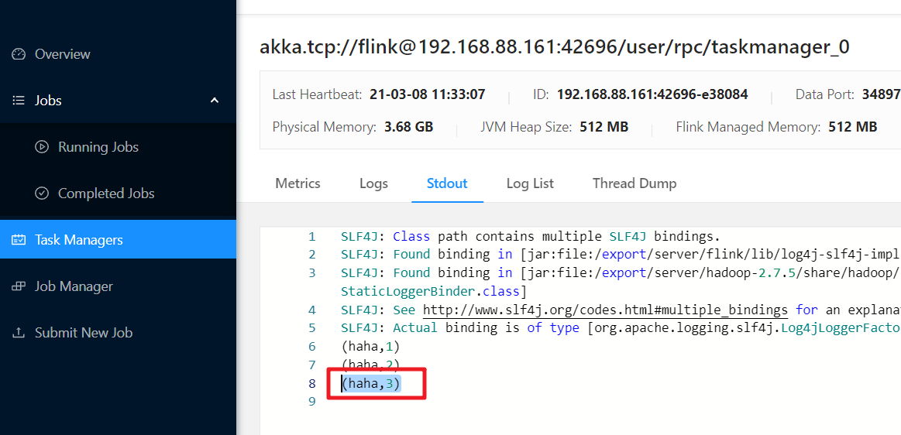

[TOC]

# 1- 复习回顾

- 1.Window

  - 基于时间的滚动和滑动

    ```java
    //需求1:每5秒钟统计一次，最近5秒钟内，各个路口通过红绿灯汽车的数量--基于时间的滚动窗口
    keyedDS              .window(TumblingProcessingTimeWindows.of(Time.seconds(5)))
                    .sum("count");
    
    //需求2:每5秒钟统计一次，最近10秒钟内，各个路口通过红绿灯汽车的数量--基于时间的滑动窗口
            //size: The size of the generated windows.--窗口大小
            //slide: The slide interval of the generated windows.--滑动间隔
    keyedDS              .window(SlidingProcessingTimeWindows.of(Time.seconds(10), Time.seconds(5)))
                    .sum("count");
    ```

    

  - 基于数量的滚动和滑动

    ```java
    //需求1:统计在最近5条消息中,各自路口通过的汽车数量,相同的key每出现5次进行统计--基于数量的滚动窗口
    keyedDS.countWindow(5)
                    .sum("count");
    
    //需求2:统计在最近5条消息中,各自路口通过的汽车数量,相同的key每出现3次进行统计--基于数量的滑动窗口
    keyedDS.countWindow(5, 3)
                    .sum("count");
    ```

    

  - 会话窗口

    ```java
    //需求: 设置会话超时时间为10s,10s内没有数据到来,则触发上个窗口的计算
    //size The session timeout, i.e. the time gap between sessions
    keyedDS              .window(ProcessingTimeSessionWindows.withGap(Time.seconds(10)))
                    .sum("count");
    ```

    

- 2.EventTime+Watermark

  - EventTime:事件时间指的是数据/事件真真正正产生/发生的时间,能够代表事件/数据的本质
  - Watermark:本质上就是一个额外的时间戳, 能够在一定程度上解决数据延迟到达/数据乱序的问题
  - Watermark = 当前最大的事件时间 - 最大允许的延迟时间(最大乱序度)
  - Watermark可以延迟窗口的触发时机
  - Watermark >= 窗口结束时间 触发窗口计算
  - 对于延迟特别严重的数据可以使用**侧道输出机制**单独处理保证数据不丢失

  ```java
  //====下面的需要掌握======
          //https://ci.apache.org/projects/flink/flink-docs-release-1.12/dev/event_timestamps_watermarks.html
          //-1.告诉Flink使用EventTime来进行窗口计算
          env.setStreamTimeCharacteristic(TimeCharacteristic.EventTime);//过期API,新版本中不需要设置,默认就是
          //-2.告诉Flink最大允许的延迟时间/乱序时间为多少
          SingleOutputStreamOperator<Order> orderDSWithWatermark = orderDS
                  .assignTimestampsAndWatermarks(WatermarkStrategy.<Order>forBoundedOutOfOrderness(Duration.ofSeconds(3))
                  /*public interface TimestampAssigner<T> {
                  	long extractTimestamp(T element, long recordTimestamp);
                  }*/
                  //-3.告诉Flink哪一列是事件时间
                  .withTimestampAssigner((order, time) -> order.getCreateTime())
          );
  //====上面的需要掌握======
  
  //====下面的代码是使用侧道输出单独收集迟到严重的数据,避免数据丢失,后续想怎么处理就怎么处理!=========
          //-1.准备一个侧道输出标签
          OutputTag latenessTag = new OutputTag("latenessTag", TypeInformation.of(Order.class));
          //每隔5s计算每隔用户最近5s的订单总金额
          //orderDSWithWatermark.keyBy(order->order.getUserId())//传入的是函数
          KeyedStream<Order, Integer> keyedDS = orderDSWithWatermark.keyBy(Order::getUserId);//传入的方法,方法可以转为函数!
          SingleOutputStreamOperator resultDS = keyedDS.window(TumblingEventTimeWindows.of(Time.seconds(5)))
                  //-2.允许迟到并设置超过多久算迟到严重的数据
                  .allowedLateness(Time.seconds(3))
                  //-3.设置迟到严重的数据打什么标签/放在哪
                  .sideOutputLateData(latenessTag)
                  .sum("money");
          //-4.取出打上标签的数据
          DataStream latenessDS = resultDS.getSideOutput(latenessTag);
  //====上面的代码是使用侧道输出单独收集迟到严重的数据,避免数据丢失,后续想怎么处理就怎么处理!=========
  
          //TODO 4.sink-数据输出
          resultDS.print("正常的数据");
          latenessDS.print("迟到严重的数据");
  ```

  

- 3.State

  - 无状态计算: **不需要考虑历史**数据,如map/filter

  - 有状态计算: **需要考虑历史**数据,如sum/reduce/maxBy/minBy....

  - 有状态计算中的状态的分类

    - ManagedState和RawState
    - ManagedState又分为:KeyedState和OperatorState

  - 代码演示-KeyedState

    ```java
    package cn.itcast.state;
    
    import org.apache.flink.api.common.RuntimeExecutionMode;
    import org.apache.flink.api.common.functions.RichMapFunction;
    import org.apache.flink.api.common.state.ValueState;
    import org.apache.flink.api.common.state.ValueStateDescriptor;
    import org.apache.flink.api.java.tuple.Tuple2;
    import org.apache.flink.api.java.tuple.Tuple3;
    import org.apache.flink.configuration.Configuration;
    import org.apache.flink.streaming.api.datastream.DataStream;
    import org.apache.flink.streaming.api.environment.StreamExecutionEnvironment;
    
    /**
     * Author itcast
     * Desc 演示Flink-State-Managed State - KeyedState - ValueState
     * 使用KeyState中的ValueState获取数据中的最大值(实际中直接使用maxBy即可)
     * 也就是我们自己使用KeyState中的ValueState来模拟实训maxBy
     */
    public class StateDemo01 {
        public static void main(String[] args) throws Exception {
            //TODO 1.env-准备环境
            StreamExecutionEnvironment env = StreamExecutionEnvironment.getExecutionEnvironment();
            env.setRuntimeMode(RuntimeExecutionMode.AUTOMATIC);
            //TODO 2.source-加载数据
            DataStream<Tuple2<String, Long>> tupleDS = env.fromElements(
                    Tuple2.of("北京", 1L),
                    Tuple2.of("上海", 2L),
                    Tuple2.of("北京", 6L),
                    Tuple2.of("上海", 8L),
                    Tuple2.of("北京", 3L),
                    Tuple2.of("上海", 4L)
            );
    
            //TODO 3.transformation-数据转换处理
            //需求:求每个城市的最大值
            //方式1:使用Flink提供好的API:maxBy--开发中使用这个
            DataStream<Tuple2<String, Long>> result1 = tupleDS.keyBy(0).maxBy(1);
    
            //方式2:使用KeyState中的ValueState来自己处理/维护状态来实现maxBy的功能
            DataStream<Tuple3<String, Long, Long>> result2 = tupleDS.keyBy(t -> t.f0).map(new RichMapFunction<Tuple2<String, Long>, Tuple3<String, Long, Long>>() {
                //-1.定义一个状态用来存放最大值
                private ValueState<Long> maxValueState = null;
    
                //-2.初始化状态(一次)
                @Override
                public void open(Configuration parameters) throws Exception {
                    //创建状态描述器
                    ValueStateDescriptor<Long> stateDescriptor = new ValueStateDescriptor<>("maxValueState", Long.class);
                    //根据状态描述器获取状态
                    maxValueState = getRuntimeContext().getState(stateDescriptor);
                }
    
                //-3.使用状态
                @Override
                public Tuple3<String, Long, Long> map(Tuple2<String, Long> value) throws Exception {
                    Long currentValue = value.f1;//当前值
                    Long maxValue = maxValueState.value();//历史最大值
                    if (maxValue == null || currentValue > maxValue) {
                        maxValue = currentValue;//当前值作为最大值
                    }
                    //-4.更新状态
                    maxValueState.update(maxValue);
                    return Tuple3.of(value.f0, currentValue, maxValue);
                }
            });
    
            //TODO 4.sink-数据输出
            result1.print("maxBy");
            //(上海,8)
            //(北京,6)
            result2.print("KeyState中的ValueState来模拟的maxBy的功能");
            //(上海,2,2)
            //(上海,8,8)
            //(上海,4,8)
            //(北京,1,1)
            //(北京,6,6)
            //(北京,3,6)
    
            //TODO 5.execute-执行
            env.execute();
        }
    }
    
    ```

    


# 2- Checkpoint


## 2-1 State Vs Checkpoint-面试题

- State：状态,**是Flink中某一个Operator在某一个时刻的状态**,如maxBy/sum,
  - 注意：
    - **State存的是历史数据/状态**
    - **存在内存中**


- Checkpoint：**检查点/存档点/快照点**, 是Flink中所有有状态的Operator在某一个时刻的**State快照信息/存档信息**, 一般都**存在磁盘上**；
  - 一句话概括: **Checkpoint就是State的快照**


## 2-2 Checkpoint的流程-看懂


1.**JobManager**创建CheckpointCoordinator**检查点协调器**并根据用户设置的时间间隔,向Operator发送检查点信号**Barrier栅栏**

2.SourceOperator接收到检查点信号Barrier栅栏,就**暂停**手里的活,然后将当前Operator的State状态**做一份快照**(一般是存到HDFS上),ok之后向检查点协调器**汇报成功,** 并将Barrier栅栏发送给**下一个Operator**

3.下一个TransformationOperator接收到Barrier之后,同样的也**暂停**工作,将当前Operator的State**做快照**存储(一般是存到HDFS上),ok之后向检查点协调器**汇报成功**, 并将Barrier栅栏发送给**下一个Operator**

4.直到**SinkOperator**也完成上述快照操作, CheckpointCoordinator**检查点协调器接收到所有的Operator汇报达到成功**信息,则认为该次**Checkpoint成功**! （失败可以重发Barrier栅栏， 或认为任务失败）


- 注意:
  -  **数据存储到外部介质**中(一般是HDFS)是使用的**异步**操作
  - 分布式快照执行时的数据一致性由**Chandy-Lamport algorithm**分布式快照算法保证! 


## 2-3 State存储介质/状态存储后端

### 2-3-1 MemoryStateBackend

- **[开发不用]()**


### 2-3-2 FSStateBackend

- [**开发使用-一般情况下使用**]()


### 2-3-3 RocksStateBackend

- [**开发使用-超大状态使用**]()


### 2-3-4 注意

- Checkpoint的配置

  - 可以在配置文件中指定--针对所有程序

    ```properties
    修改flink-conf.yaml
    #这里可以配置
    #jobmanager(即MemoryStateBackend), 
    #filesystem(即FsStateBackend), 
    #rocksdb(即RocksDBStateBackend)
    state.backend: filesystem 
    state.checkpoints.dir: hdfs://namenode:8020/flink/checkpoints
    ```

    

  - 可以在代码中指定--针对每个程序,灵活

    ```properties
    //1.MemoryStateBackend--开发中不用
    env.setStateBackend(new MemoryStateBackend)
    
    //2.FsStateBackend--开发中可以使用--适合一般状态--秒级/分钟级窗口...
    env.setStateBackend(new FsStateBackend("hdfs路径或测试时的本地路径"))
    
    //3.RocksDBStateBackend--开发中可以使用--适合超大状态--天级窗口...
    env.setStateBackend(new RocksDBStateBackend(filebackend, true))
    ```

    注意:如果使用**RocksDB**需要单独引入依赖
    
    ```xml
    <dependency>
           <groupId>org.apache.flink</groupId>
           <artifactId>flink-statebackend-rocksdb_2.11</artifactId>
           <version>1.7.2</version>
    </dependency>
    ```

## 2-4 代码演示

都是一些通用/固定的配置

```java
package com.fiberhome.flinkReview.checkpoint;

import org.apache.commons.lang3.SystemUtils;
import org.apache.flink.api.common.RuntimeExecutionMode;
import org.apache.flink.api.common.functions.FlatMapFunction;
import org.apache.flink.api.common.functions.RichMapFunction;
import org.apache.flink.api.common.serialization.SimpleStringSchema;
import org.apache.flink.api.java.tuple.Tuple2;
import org.apache.flink.runtime.state.filesystem.FsStateBackend;
import org.apache.flink.streaming.api.CheckpointingMode;
import org.apache.flink.streaming.api.datastream.DataStream;
import org.apache.flink.streaming.api.datastream.SingleOutputStreamOperator;
import org.apache.flink.streaming.api.environment.CheckpointConfig;
import org.apache.flink.streaming.api.environment.StreamExecutionEnvironment;
import org.apache.flink.streaming.connectors.kafka.FlinkKafkaProducer;
import org.apache.flink.util.Collector;

import java.util.Properties;

public class Demo01_Checkpoint01 {
    public static void main(String[] args) throws Exception {
        //TODO 1.env-准备环境
        StreamExecutionEnvironment env = StreamExecutionEnvironment.getExecutionEnvironment();
        env.setRuntimeMode(RuntimeExecutionMode.AUTOMATIC);
        //====配置Checkpoint:都是一些固定的通用的配置===
        //===========类型1:必须参数
        //设置Checkpoint的时间间隔为1000ms做一次Checkpoint/其实就是每隔1000ms发一次Barrier!
        env.enableCheckpointing(1000);

        //设置State状态存储介质
        /*if(args.length > 0){
            env.setStateBackend(new FsStateBackend(args[0]));
        }else {
            env.setStateBackend(new FsStateBackend("file:///D:\\data\\ckp"));
        }*/

        // 判断系统工具
        if (SystemUtils.IS_OS_WINDOWS) {
            env.setStateBackend(new FsStateBackend("file:///D:/ckp"));
        } else {
            env.setStateBackend(new FsStateBackend("hdfs://node1:8020/flink-checkpoint"));
        }
        //===========类型2:建议参数===========
        //设置两个Checkpoint 之间最少等待时间,如设置Checkpoint之间最少是要等 500ms
        // (为了避免每隔1000ms做一次Checkpoint的时候,前一次太慢和后一次重叠到一起去了)
        //如:高速公路上,每隔1s关口放行一辆车,但是规定了两车之前的最小车距为500m
        env.getCheckpointConfig().setMinPauseBetweenCheckpoints(500);//默认是0

        //设置如果在做Checkpoint过程中出现错误，是否让整体任务失败：true是  false不是
        //env.getCheckpointConfig().setFailOnCheckpointingErrors(false);//默认是true

        // 设置容忍多少次任务失败。
        env.getCheckpointConfig().setTolerableCheckpointFailureNumber(10);//默认值为0，表示不容忍任何检查点失败

        //设置是否清理检查点,表示 Cancel 时是否需要保留当前的 Checkpoint，默认 Checkpoint会在作业被Cancel时被删除
        //ExternalizedCheckpointCleanup.DELETE_ON_CANCELLATION：true,当作业被取消时，删除外部的checkpoint(默认值)
        //ExternalizedCheckpointCleanup.RETAIN_ON_CANCELLATION：false,当作业被取消时，保留外部的checkpoint

        //当程序停止或者取消时 checkpoint 是否删除 。
        // DELETE_ON_CANCELLATION: 删除；
        // RETAIN_ON_CANCELLATION:不删除
        env.getCheckpointConfig().enableExternalizedCheckpoints(CheckpointConfig.ExternalizedCheckpointCleanup.RETAIN_ON_CANCELLATION);


        //===========类型3:直接使用默认的即可===============
        //设置checkpoint的执行模式为EXACTLY_ONCE(默认)
        env.getCheckpointConfig().setCheckpointingMode(CheckpointingMode.EXACTLY_ONCE);

        //设置checkpoint的超时时间,如果 Checkpoint在 60s内尚未完成说明该次Checkpoint失败,则丢弃。
        env.getCheckpointConfig().setCheckpointTimeout(60000);//默认10分钟

        //设置同一时间有多少个checkpoint可以同时执行
        env.getCheckpointConfig().setMaxConcurrentCheckpoints(1);//默认为1


        //TODO 2.source-加载数据
        DataStream<String> socketDS = env.socketTextStream("node1", 9999);

        //TODO 3.transformation-数据转换处理
        SingleOutputStreamOperator<Tuple2<String, Integer>> resultDS = socketDS.flatMap(new FlatMapFunction<String, Tuple2<String, Integer>>() {
            @Override
            public void flatMap(String value, Collector<Tuple2<String, Integer>> out) throws Exception {
                String[] words = value.split(" ");
                for (String word : words) {
                    if ("bug".equals(word)){
                        System.out.println("模拟bug...");

                        throw  new RuntimeException("模拟bug......");
                    }
                    out.collect(Tuple2.of(word, 1));
                }
            }
        }).keyBy(0).sum(1);


        SingleOutputStreamOperator<String> kafkaData = resultDS.map(new RichMapFunction<Tuple2<String, Integer>, String>() {
            @Override
            public String map(Tuple2<String, Integer> t) throws Exception {
                return t.f0 + ":::" + t.f1;
            }
        });

        Properties properties = new Properties();
        properties.setProperty("bootstrap.servers", "node1:9092");

        kafkaData.addSink(new FlinkKafkaProducer<String>(
                "flink_kafka2",
                new SimpleStringSchema(),
                properties
        ));

        //TODO 4.sink-数据输出
        kafkaData.print();

        //TODO 5.execute-执行
        env.execute();
    }
}

```


## 2-5 Checkpoint 设置总结

### 2-5-1 必须设置 2个

- 设置Checkpoint的时间间隔为1000ms做一次Checkpoint/其实就是每隔1000ms发一次Barrier!

``` java
//设置Checkpoint的时间间隔为1000ms做一次Checkpoint/其实就是每隔1000ms发一次Barrier!
env.enableCheckpointing(1000);

```


- 设置State状态存储介质

``` java
// 判断系统工具
//设置State状态存储介质
/*if(args.length > 0){
env.setStateBackend(new FsStateBackend(args[0]));
}else {
env.setStateBackend(new FsStateBackend("file:///D:\\data\\ckp"));
}*/


if (SystemUtils.IS_OS_WINDOWS) {
	env.setStateBackend(new FsStateBackend("file:///D:/ckp"));
} else {
	env.setStateBackend(new FsStateBackend("hdfs://node1:8020/flink-checkpoint"));
}
```

 

### 2-5-2 建议设置 4个

- 设置两个[**Checkpoint 之间最少等待时间**]()

``` java
//设置两个Checkpoint 之间最少等待时间,如设置Checkpoint之间最少是要等 500ms(为了避免每隔1000ms做一次Checkpoint的时候,前一次太慢和后一次重叠到一起去了)
//如:高速公路上,每隔1s关口放行一辆车,但是规定了两车之前的最小车距为500m

env.getCheckpointConfig().setMinPauseBetweenCheckpoints(500);//默认是0
```


- 设置如果在做Checkpoint过程中出现错误 是否让[**整体任务失败**]()

``` java
//设置如果在做Checkpoint过程中出现错误，是否让整体任务失败：true是  false不是
env.getCheckpointConfig().setFailOnCheckpointingErrors(false);//默认是true
```


- 设置容忍[**多少次Checkpoint任务失败**]()

``` java
// 设置容忍多少次任务失败。
env.getCheckpointConfig().setTolerableCheckpointFailureNumber(10);//默认值为0，表示不容忍任何检查点失败
```


- 设置是否[**清理检查点**]()

``` java
//设置是否清理检查点,表示 Cancel 时是否需要保留当前的 Checkpoint，默认 Checkpoint会在作业被Cancel时被删除
//ExternalizedCheckpointCleanup.DELETE_ON_CANCELLATION：true,当作业被取消时，删除外部的checkpoint(默认值)
//ExternalizedCheckpointCleanup.RETAIN_ON_CANCELLATION：false,当作业被取消时，保留外部的checkpoint
//当程序停止或者取消时， checkpoint 是否删除 。 
//DELETE_ON_CANCELLATION: 删除;
//RETAIN_ON_CANCELLATION: 不删除
       env.getCheckpointConfig().enableExternalizedCheckpoints(CheckpointConfig.ExternalizedCheckpointCleanup.RETAIN_ON_CANCELLATION);
```

 

### 2-5-3 使用默认 3个

- 设置checkpoint的执行模式为[**EXACTLY_ONCE**]()(默认)

``` java
//设置checkpoint的执行模式为EXACTLY_ONCE(默认)
env.getCheckpointConfig().setCheckpointingMode(CheckpointingMode.EXACTLY_ONCE);
```


- 设置checkpoint的[**超时时间**](),如果 Checkpoint在 60s内尚未完成说明该次Checkpoint失败,则丢弃。

``` java
//设置checkpoint的超时时间,如果 Checkpoint在 60s内尚未完成说明该次Checkpoint失败,则丢弃。
env.getCheckpointConfig().setCheckpointTimeout(60000);//默认10分钟
```


- 设置同一时间有多少个checkpoint可以[**同时执行**]()

``` java
//设置同一时间有多少个checkpoint可以同时执行
env.getCheckpointConfig().setMaxConcurrentCheckpoints(1);//默认为1
```


# 3- 状态快照恢复(状态恢复)


## 3-1 全自动恢复-重启策略-掌握

- **自动Checkpoint** + **自动恢复**


### 3-1-1 引入

- 状态的作用是啥? 
  - 保存历史数据(内存),方便后续继续根据历史数据进行计算,如sum/maxBy

- 状态快照的作用是啥?
  - 容错! 也就是程序出错的时候可以从快照(磁盘)中状态恢复! 

- 那么接下来就学习状态快照的自动恢复
  - 错误重启策略

- 就通过配置实现:当程序出错时,能够尝试从快照处进行自动重启恢复!


### 3-1-2 重启策略的分类

- 1- 默认重启策略（无限重启）
  - 配置了Checkpoint,而没有配置重启策略

``` properties
1.默认重启策略
如果配置了Checkpoint,而没有配置重启策略,那么代码中出现了非致命错误时,程序会无限重启
```


- 2- 无重启策略（不重启）
  - RestartStrategies.noRestart()

``` properties
2.无重启策略
 Job直接失败，不会尝试进行重启
 设置方式1:flink-conf.yaml
 restart-strategy: none
 ​
 设置方式2:
 无重启策略也可以在程序中设置
 val env = ExecutionEnvironment.getExecutionEnvironment()
 env.setRestartStrategy(RestartStrategies.noRestart())
```


- 3- 固定延迟重启策略（允许重启N次）
  - RestartStrategies.fixedDelayRestart(3,  Time.of(10, TimeUnit.SECONDS) )

``` properties
3.固定延迟重启策略
 设置方式1:
 重启策略可以配置flink-conf.yaml的下面配置参数来启用，作为默认的重启策略:
 例子:
 restart-strategy: fixed-delay
 restart-strategy.fixed-delay.attempts: 3
 restart-strategy.fixed-delay.delay: 10 s
 
 设置方式2:
 也可以在程序中设置:
 val env = ExecutionEnvironment.getExecutionEnvironment()
 env.setRestartStrategy(RestartStrategies.fixedDelayRestart(
   3, // 最多重启3次数
   Time.of(10, TimeUnit.SECONDS) // 重启时间间隔
 ))
 上面的设置表示:如果job失败,重启3次, 每次间隔10
```


- 4- 失败率重启策略（允许**重启频率**）
  - RestartStrategies.failureRateRestart(
       3, // 每个测量时间间隔最大失败次数
       Time.of(5, TimeUnit.MINUTES), // 失败率测量的时间间隔 (5分钟内部允许重启3次)
       Time.of(10, TimeUnit.SECONDS) // 两次连续重启的时间间隔
     )

``` properties
4.失败率重启策略
设置方式1:
 失败率重启策略可以在flink-conf.yaml中设置下面的配置参数来启用:
 例子:
 restart-strategy:failure-rate
 restart-strategy.failure-rate.max-failures-per-interval: 3
 restart-strategy.failure-rate.failure-rate-interval: 5 min
 restart-strategy.failure-rate.delay: 10 s
 
 设置方式2:
 失败率重启策略也可以在程序中设置:
 val env = ExecutionEnvironment.getExecutionEnvironment()
 env.setRestartStrategy(RestartStrategies.failureRateRestart(
   3, // 每个测量时间间隔最大失败次数
   Time.of(5, TimeUnit.MINUTES), // 失败率测量的时间间隔 (5分钟内部允许重启3次)
   Time.of(10, TimeUnit.SECONDS) // 两次连续重启的时间间隔
 ))
 上面的设置表示:如果5分钟内job失败不超过三次,自动重启, 每次间隔10s (如果5分钟内程序失败超过3次,则程序退出)
```


### 3-1-3 代码演示

```java
package com.fiberhome.flinkReview.checkpoint;

import org.apache.commons.lang3.SystemUtils;
import org.apache.flink.api.common.RuntimeExecutionMode;
import org.apache.flink.api.common.functions.FlatMapFunction;
import org.apache.flink.api.common.functions.RichMapFunction;
import org.apache.flink.api.common.restartstrategy.RestartStrategies;
import org.apache.flink.api.common.serialization.SimpleStringSchema;
import org.apache.flink.api.common.time.Time;
import org.apache.flink.api.java.tuple.Tuple2;
import org.apache.flink.runtime.state.filesystem.FsStateBackend;
import org.apache.flink.streaming.api.CheckpointingMode;
import org.apache.flink.streaming.api.datastream.DataStream;
import org.apache.flink.streaming.api.datastream.SingleOutputStreamOperator;
import org.apache.flink.streaming.api.environment.CheckpointConfig;
import org.apache.flink.streaming.api.environment.StreamExecutionEnvironment;
import org.apache.flink.streaming.connectors.kafka.FlinkKafkaProducer;
import org.apache.flink.util.Collector;

import java.util.Properties;
import java.util.concurrent.TimeUnit;

public class Demo01_Checkpoint02_RestartStrategy {
    public static void main(String[] args) throws Exception {
        //TODO 1.env-准备环境
        StreamExecutionEnvironment env = StreamExecutionEnvironment.getExecutionEnvironment();
        env.setRuntimeMode(RuntimeExecutionMode.AUTOMATIC);
        //====配置Checkpoint:都是一些固定的通用的配置===
        //===========类型1:必须参数
        //设置Checkpoint的时间间隔为1000ms做一次Checkpoint/其实就是每隔1000ms发一次Barrier!
        env.enableCheckpointing(1000);

        //设置State状态存储介质
        /*if(args.length > 0){
            env.setStateBackend(new FsStateBackend(args[0]));
        }else {
            env.setStateBackend(new FsStateBackend("file:///D:\\data\\ckp"));
        }*/

        // 判断系统工具
        if (SystemUtils.IS_OS_WINDOWS) {
            env.setStateBackend(new FsStateBackend("file:///D:/ckp"));
        } else {
            env.setStateBackend(new FsStateBackend("hdfs://node1:8020/flink-checkpoint"));
        }
        //===========类型2:建议参数===========
        //设置两个Checkpoint 之间最少等待时间,如设置Checkpoint之间最少是要等 500ms
        // (为了避免每隔1000ms做一次Checkpoint的时候,前一次太慢和后一次重叠到一起去了)
        //如:高速公路上,每隔1s关口放行一辆车,但是规定了两车之前的最小车距为500m
        env.getCheckpointConfig().setMinPauseBetweenCheckpoints(500);//默认是0

        //设置如果在做Checkpoint过程中出现错误，是否让整体任务失败：true是  false不是
        //env.getCheckpointConfig().setFailOnCheckpointingErrors(false);//默认是true

        // 设置容忍多少次任务失败。
        env.getCheckpointConfig().setTolerableCheckpointFailureNumber(10);//默认值为0，表示不容忍任何检查点失败

        //设置是否清理检查点,表示 Cancel 时是否需要保留当前的 Checkpoint，默认 Checkpoint会在作业被Cancel时被删除
        //ExternalizedCheckpointCleanup.DELETE_ON_CANCELLATION：true,当作业被取消时，删除外部的checkpoint(默认值)
        //ExternalizedCheckpointCleanup.RETAIN_ON_CANCELLATION：false,当作业被取消时，保留外部的checkpoint

        //当程序停止或者取消时 checkpoint 是否删除 。
        // DELETE_ON_CANCELLATION: 删除；
        // RETAIN_ON_CANCELLATION:不删除
        env.getCheckpointConfig().enableExternalizedCheckpoints(CheckpointConfig.ExternalizedCheckpointCleanup.RETAIN_ON_CANCELLATION);


        //===========类型3:直接使用默认的即可===============
        //设置checkpoint的执行模式为EXACTLY_ONCE(默认)
        env.getCheckpointConfig().setCheckpointingMode(CheckpointingMode.EXACTLY_ONCE);

        //设置checkpoint的超时时间,如果 Checkpoint在 60s内尚未完成说明该次Checkpoint失败,则丢弃。
        env.getCheckpointConfig().setCheckpointTimeout(60000);//默认10分钟

        //设置同一时间有多少个checkpoint可以同时执行
        env.getCheckpointConfig().setMaxConcurrentCheckpoints(1);//默认为1


        // TODO 设置重启策略
        // 1- 默认重启策略： 如果配置了checkpoint， 但是没有配置重启策略，那么默认无限重启---不适用

        // 2- 无重启策略，如果有异常，直接程序失败。---不用
        env.setRestartStrategy(RestartStrategies.noRestart());  // 不重启

        // 3- 固定延迟重启策略: 允许重启3次， 每次重启间隔时间10s
        env.setRestartStrategy(RestartStrategies.fixedDelayRestart(
                3,
                Time.of(10, TimeUnit.SECONDS)
            )
        );

        // 4- 失败率重启策略
        env.setRestartStrategy(RestartStrategies.failureRateRestart(
                3,// 每个策略时间间隔最大失败次数
                Time.of(30,TimeUnit.SECONDS),// 失败率测量的时间间隔
                Time.of(10,TimeUnit.SECONDS) // 两次连续重启的时间间隔

        ));


        //TODO 2.source-加载数据
        DataStream<String> socketDS = env.socketTextStream("node1", 9999);

        //TODO 3.transformation-数据转换处理
        SingleOutputStreamOperator<Tuple2<String, Integer>> resultDS = socketDS.flatMap(new FlatMapFunction<String, Tuple2<String, Integer>>() {
            @Override
            public void flatMap(String value, Collector<Tuple2<String, Integer>> out) throws Exception {
                String[] words = value.split(" ");
                for (String word : words) {
                    if ("bug".equals(word)){
                        System.out.println("模拟bug...");

                        throw  new RuntimeException("模拟bug......");
                    }
                    out.collect(Tuple2.of(word, 1));
                }
            }
        }).keyBy(0).sum(1);


        SingleOutputStreamOperator<String> kafkaData = resultDS.map(new RichMapFunction<Tuple2<String, Integer>, String>() {
            @Override
            public String map(Tuple2<String, Integer> t) throws Exception {
                return t.f0 + ":::" + t.f1;
            }
        });

        Properties properties = new Properties();
        properties.setProperty("bootstrap.servers", "node1:9092");

        kafkaData.addSink(new FlinkKafkaProducer<String>(
                "flink_kafka",
                new SimpleStringSchema(),
                properties
        ));

        //TODO 4.sink-数据输出
        kafkaData.print();

        //TODO 5.execute-执行
        env.execute();
    }
}

```


## 3-2 半自动-手动恢复-了解


- 自动Checkpoint + **手动恢复**


- 1.打包/改名并上传


可以将打包好的程序用FlinkOnYarn运行也可以使用Flink的WebUI界面提交


- 2.启动Flink集群(HDFS....)

``` properties
/export/server/flink-1.12.0/bin/start-cluster.sh
```


- 3.访问WebUI

``` properties
http://node1:8081/#/overview

http://node2:8081/#/overview
```


- 4.提交任务执行


- 先执行nc -lk 9999


发送数据


- 5.取消任务


- 6.重新提交任务并从指定的Checkpoint目录进行恢复

hdfs://node1:8020/flink-checkpoint/adbe4a57dcbe12b539424d988c7d98b2/chk-222


- 发送数据并观察结果




- 7.停止任务和集群

``` properties
/export/server/flink-1.12.0/bin/stop-cluster.sh
```


## 3-3 全手动-SavePoint-了解

- **手动Checkpoint** + **手动恢复**


- 1.打包/改名/上传


- 2.使用FlinkOnYarn-Session会话模式来演示

``` properties
启动Hadoop

在Yarn上启动Flink集群

/export/server/flink-1.12.0/bin/yarn-session.sh -n 2 -tm 800 -s 1 -d
```


- 3.去Yarn上查询集群状态

http://node1:8088/cluster


- 4.提交任务

``` properties
先执行

nc -lk 9999

再提交

/export/server/flink-1.12.0/bin/flink run --class com.fiberhome.flink.checkpoint.Demo01_Checkpoint01 /root/ckp.jar

发送数据
```


- 5.执行一次**SavePoint**,也就是**执行一次手动的Checkpoint**

``` properties
/export/server/flink-1.12.0/bin/flink savepoint  14606c094e273e12c124d8a0a36df259 hdfs://node1:8020/flink-savepoint/
```


- 6.取消任务
  - 注意： job Id 根据 实际id修改。

``` properties
/export/server/flink-1.12.0/bin/flink cancel 14606c094e273e12c124d8a0a36df259
```


- 7.重新运行程序并从指定的SavePoint进行恢复
  - **-s + savePoint path**;

``` properties
/export/server/flink-1.12.0/bin/flink run -s hdfs://node1:8020/flink-savepoint/savepoint-14606c-3d8d42cebb93 --class com.fiberhome.flink.checkpoint.Demo01_Checkpoint01 /root/ckp.jar 

```


- 8.继续发送数据


- 9.停止任务和集群

``` properties
# 停止任务:
/export/server/flink-1.12.0/bin/flink cancel 261f07456a8c2e60db13670f913e430a

# 停止集群:
yarn application -kill application_1614825325070_0005
```


# 4- 总结-面试题

## 4-1 对比State和Checkpoint

(如作用.区别.原理...)

| 名称              | 作用                                                    | 区别                     | 原理                                                         |
| ----------------- | ------------------------------------------------------- | ------------------------ | ------------------------------------------------------------ |
| State 状态        | 保存**[某一个operator]()**有状态计算的**历史数据**      | 保存在**[内存]()**中     | 保存Flink中某一个Operator在某个时刻的状态。                  |
| Checkpoint 检查点 | 将某个时刻**[所有operato]()**r的**State快照**（持久化） | 一般保存在**[磁盘]()**中 | 将程序中所有有状态的operator 在某个时刻的State 持久化到磁盘中， 方便程序异常时状态恢复。 |
|                   |                                                         |                          | **Checkpoint就是多个State的快照**                            |


## 4-2 Checkpoint的流程


1.**JobManager**创建CheckpointCoordinator**[检查点协调器]()**并根据用户设置的时间间隔,向Operator发送检查点信号**[Barrier栅栏]()**

2.SourceOperator接收到检查点信号Barrier栅栏,就[**暂停**手里的活](),然后将当前Operator的State状态**[做一份快照]()**(一般是存到HDFS上),ok之后向检查点协调器**[汇报成功](),** 并将Barrier栅栏发送给**[下一个Operator]()**

3.下一个TransformationOperator接收到Barrier之后,同样的也**暂停**工作,将当前Operator的State**做快照**存储(一般是存到HDFS上),ok之后向检查点协调器**汇报成功**, 并将Barrier栅栏发送给**下一个Operator**

4.直到[**SinkOperator**也完成上述快照操作](), CheckpointCoordinator**[检查点协调器接收到所有的Operator汇报达到成功]()**信息,则认为该次**[Checkpoint成功]()**! （失败可以重发Barrier栅栏， 或认为任务失败）


- 注意:
  -  **数据存储到外部介质**中(一般是HDFS)是使用的**异步**操作
  -  分布式快照执行时的数据一致性由**[Chandy-Lamport algorithm]()**分布式快照算法保证! 


## 4-3 State存储介质/状态存储后端

### 2-3-1 MemoryStateBackend

- **[开发不用]()**


### 2-3-2 FSStateBackend

- [**开发使用-一般情况下使用**]()


### 2-3-3 RocksStateBackend

- [**开发偶尔使用-超大状态使用**]()


## 4-4 Flink的重启策略

- 默认重启策略（无限重启）
  - [**配置了Checkpoint,而没有配置重启策略**]()
- 无重启策略（不重启）
  - RestartStrategies.**[noRestart]()**()
- **[固定延迟重启策略]()**（允许重启N次）
  - RestartStrategies.[**fixedDelayRestart**]()(3,  Time.of(10, TimeUnit.SECONDS) )

- [**失败率重启策略**]()（允许**重启频率**）
  - RestartStrategies.**[failureRateRestart]()**(
    	3, // 每个测量时间间隔最大失败次数
    	Time.of(5, TimeUnit.MINUTES), // 失败率测量的时间间隔 ([**5分钟内部允许重启3次**]())
    	Time.of(10, TimeUnit.SECONDS) // 两次连续[**重启的时间间隔**]()
    )


## 4-5 总结Flink如何容错

**State + Checkpoint(Savepoint) + RestartStrategies**

- 注意： Spark如何容错？
  - **checkpoint和 wal预写日志**


## 4-6 Flink VS Spark


| 名称（功能）     | Flink                                                        | Spark Streaming                          | Structured Streaming              |
| ---------------- | ------------------------------------------------------------ | ---------------------------------------- | --------------------------------- |
| 状态State        | 默认有状态计算<br>ManageState+RawState<br>KeyedState+OperatorState | updateStateByKey <br>mapWithState        | 默认有状态计算                    |
| 检查点Checkpoint | env.enableCheckpointing<br>env.setStateBackend<br>    MemoryStateBackend<br>    FSStateBackend<br>    RocksStateBackend<br> | ssc.checkpoint(path)<br>updateStateByKey | option("checkpointLocation",path) |
| 重启策略Restart  | RestartStrategies.noRestart()<br>xxx.[**fixedDelayRestart**]()<br>xxx.failureRateRestart | ssc.checkpoint(path)<br>updateStateByKey | option("checkpointLocation",path) |
|                  |                                                              |                                          |                                   |


