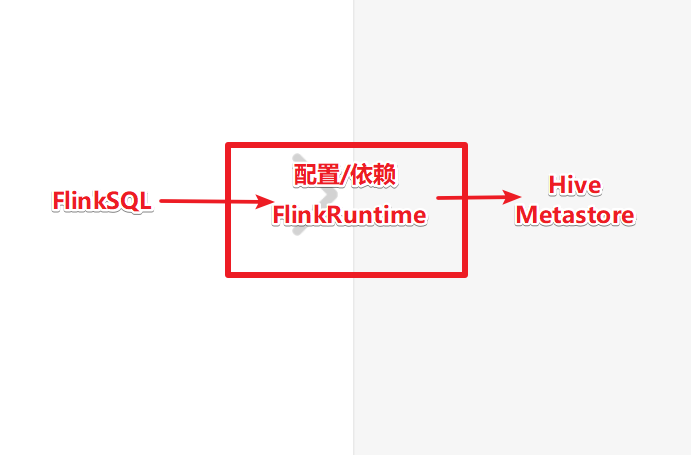

[TOC]


# 1- Flink Table & SQL


## 1-1 注意

- 直到Flink1.11,官网上都直接很老实的承认FlinkTable & SQL的功能还不完善,还在积极开发中

- 在Flink1.12的时候官网上没有这句话了,但是和SparkSQL相比, FlinkTable & SQL还是不完善,很多API和前面不兼容,未来API稳定性未知! 

- 所以后续的项目中只有一点点业务使用FlinkSQL, 但是未来随着Flink的发展,FlinkTable & SQL可能会越来越好

- 但目前还是比不过SparkSQL

- **注意:不管是HiveSQL 还是 SparkSQL 还是FlinkSQL, 重点是SQL**

- **注意:SQL可以很方便快捷的完成一些简单业务逻辑,太复杂的搞不定**

  


## 1-2 为什么很多计算框架都要支持SQL


## 1-3 FlinkSQL的发展史


## 1-4 开发准备

### 1-4-1 FlinkSQL依赖

https://ci.apache.org/projects/flink/flink-docs-release-1.12/dev/table/

注意: 查询计划器使用blink

```xml
		<dependency>
            <groupId>org.apache.flink</groupId>
            <artifactId>flink-table-api-scala-bridge_2.12</artifactId>
            <version>${flink.version}</version>
		</dependency>
        <dependency>
            <groupId>org.apache.flink</groupId>
            <artifactId>flink-table-api-java-bridge_2.12</artifactId>
            <version>${flink.version}</version>
        </dependency>

        <!-- blink执行计划,1.11+默认的-->
        <dependency>
            <groupId>org.apache.flink</groupId>
            <artifactId>flink-table-planner-blink_2.12</artifactId>
            <version>${flink.version}</version>
        </dependency>

        <dependency>
            <groupId>org.apache.flink</groupId>
            <artifactId>flink-table-common</artifactId>
            <version>${flink.version}</version>
        </dependency>
```


### 1-4-2 FlinkSQL开发步骤


### 1-4-3- 创建环境


### 1-4-4- DataStream->表  

- [**createTemporaryView**]()   (SQL 表)
- [**fromDataStream**]()  (Table对象)


### 1-4-5 表->DataStream

- [**toAppendStream**]() :  追加模式(只支持追加， 不支持更新和历史)；
- [**toRetractStream**]()：缩回模式（支持所有数据）；


### 1-4-6 查询

Table风格/DSL风格


SQL风格


### 1-4-7 FlinkSQL核心思想

- **动态表**和**连续查询**

注意: FlinkSQL和Spark-StructuredStreaming的原理类似, 都支持使用SQL来处理批数据和流数据

但是注意: StructuredStreaming是**把流当做批**来处理, 而Flink是**把批当做流**来处理, 但是不管怎么,都有一个核心的模型,叫做**动态表**! 


# 2- FlinkSQL-案例1-掌握


## 2-1 需求

将DataStream注册为Table和View并进行SQL统计


- 创建StreamTableEnvironment

``` java
StreamExecutionEnvironment env = StreamExecutionEnvironment.getExecutionEnvironment();
        //EnvironmentSettings settings = EnvironmentSettings.newInstance().useBlinkPlanner().inStreamingMode().build();
        //StreamTableEnvironment tenv = StreamTableEnvironment.create(env, settings);
        StreamTableEnvironment tenv = StreamTableEnvironment.create(env);
```

- DataStream -> Table

``` java
//将DataStream转为View/Table
//注意tableA是表名
tenv.createTemporaryView("tableA",orderA,$("user"), $("product"), $("amount"));
//注意tableB是变量名
Table tableB = tenv.fromDataStream(orderB, $("user"), $("product"), $("amount"));
```

- SQL风格查询

``` java
Table resultTable = tenv.sqlQuery("select * from tableA\n" +
                //"union all\n" +
                "union \n" +
                "select * from " + tableB);
```


- Table -> DataStream

``` java
//将Table转为DataStream再输出
//toAppendStream:只支持追加
DataStream<Order> resultDS = tenv.toAppendStream(resultTable, Order.class);
//resultDS.print("resultDS");

//toRetractStream:支持所有
DataStream<Tuple2<Boolean, Order>> resultDS2 = tenv.toRetractStream(resultTable, Order.class);
```


## 2-2 代码实现

掌握:

1.env

2.DataStream->table/view

3.table->DataStream

```java
package cn.itcast.sql;

import lombok.AllArgsConstructor;
import lombok.Data;
import lombok.NoArgsConstructor;
import org.apache.flink.api.java.tuple.Tuple2;
import org.apache.flink.streaming.api.datastream.DataStream;
import org.apache.flink.streaming.api.environment.StreamExecutionEnvironment;
import org.apache.flink.table.api.Table;
import org.apache.flink.table.api.bridge.java.StreamTableEnvironment;

import java.util.Arrays;

import static org.apache.flink.table.api.Expressions.$;

/**
 * Author itcast
 * Desc 将DataStream注册为Table和View并进行SQL统计
 */
public class FlinkSQLDemo01 {
    public static void main(String[] args) throws Exception {
        //TODO 1.env
        StreamExecutionEnvironment env = StreamExecutionEnvironment.getExecutionEnvironment();
        //EnvironmentSettings settings = EnvironmentSettings.newInstance().useBlinkPlanner().inStreamingMode().build();
        //StreamTableEnvironment tenv = StreamTableEnvironment.create(env, settings);
        StreamTableEnvironment tenv = StreamTableEnvironment.create(env);

        //TODO 2.source/准备表View/Table
        DataStream<Order> orderA = env.fromCollection(Arrays.asList(
                new Order(1L, "beer", 1),
                new Order(1L, "diaper", 4),
                new Order(3L, "rubber", 2)));

        DataStream<Order> orderB = env.fromCollection(Arrays.asList(
                new Order(2L, "pen", 3),
                new Order(2L, "rubber", 3),
                new Order(1L, "beer", 1)));

        //将DataStream转为View/Table
        //注意tableA是表名
        tenv.createTemporaryView("tableA",orderA,$("user"), $("product"), $("amount"));
        //注意tableB是变量名
        Table tableB = tenv.fromDataStream(orderB, $("user"), $("product"), $("amount"));
        tableB.printSchema();
        //root
        // |-- user: BIGINT
        // |-- product: STRING
        // |-- amount: INT
        System.out.println(tableB);//toString之后才是表名
        //UnnamedTable$0

        //TODO 3.transformation/查询
        //将订单数据进行合并-使用标准SQL语法中的union(会去重) 或 union all(不去重)
/*
    select * from tableA
    union all
    select * from tableB
 */
        Table resultTable = tenv.sqlQuery("select * from tableA\n" +
                //"union all\n" +
                "union \n" +
                "select * from " + tableB);

        //TODO 4.sink
        //将Table转为DataStream再输出
        //toAppendStream:只支持追加
        //DataStream<Order> resultDS = tenv.toAppendStream(resultTable, Order.class);
        //resultDS.print("resultDS");

        //toRetractStream:支持所有
        DataStream<Tuple2<Boolean, Order>> resultDS2 = tenv.toRetractStream(resultTable, Order.class);

        resultDS2.print("resultDS2");

        //TODO 5.execute
        env.execute();
    }

    @Data
    @NoArgsConstructor
    @AllArgsConstructor
    public static class Order {
        public Long user;
        public String product;
        public int amount;
    }
}

```


# 3- FlinkSQL-案例2_WordCount-掌握

## 3-2 需求

使用SQL和Table(DSL)两种方式对DataStream中的单词进行统计


- 注意：**Table风格 有个问题**
  - filter($("frequency").isEqual(2));

``` java
//方式2:Table(DSL)方式查询
Table resultTable2 = table2.groupBy($("word"))
    .select($("word"), $("frequency").sum().as("frequency"))
    .filter($("frequency").isEqual(2));  //无 fuck 说
```


## 3-3 代码实现

掌握

1.**sql风格写法**:tenv.sqlQuery("SQL语句")

2.**dsl风格写法**:table.groupBy()...select().filter.....

```java
package cn.itcast.sql;

import lombok.AllArgsConstructor;
import lombok.Data;
import lombok.NoArgsConstructor;
import org.apache.flink.api.java.tuple.Tuple2;
import org.apache.flink.streaming.api.datastream.DataStream;
import org.apache.flink.streaming.api.environment.StreamExecutionEnvironment;
import org.apache.flink.table.api.Table;
import org.apache.flink.table.api.bridge.java.StreamTableEnvironment;
import org.apache.flink.types.Row;

import static org.apache.flink.table.api.Expressions.$;

/**
 * Author itcast
 * Desc 使用SQL和Table(DSL)两种方式对DataStream中的单词进行统计
 */
public class FlinkSQLDemo02 {
    public static void main(String[] args) throws Exception {
        //TODO 1.env
        StreamExecutionEnvironment env = StreamExecutionEnvironment.getExecutionEnvironment();
        StreamTableEnvironment tenv = StreamTableEnvironment.create(env);

        //TODO 2.source/准备表View/Table
        DataStream<WC> dataStream = env.fromElements(
                new WC("Hello", 1),
                new WC("World", 1),
                new WC("Hello", 1)
        );
        //dataStream->View和Table
        tenv.createTemporaryView("table1",dataStream, $("word"), $("frequency"));
        Table table2 = tenv.fromDataStream(dataStream, $("word"), $("frequency"));

        //TODO 3.transformation/查询
        //方式1:SQL方式查询
        //select word,sum(frequency) from table1 group by word
        Table resultTable1 = tenv.sqlQuery("select word,sum(frequency) as frequency from table1 group by word");
        DataStream<Tuple2<Boolean, WC>> resultDS1 = tenv.toRetractStream(resultTable1, WC.class);

        //方式2:Table(DSL)方式查询
        Table resultTable2 = table2.groupBy($("word"))
                .select($("word"), $("frequency").sum().as("frequency"))
                .filter($("frequency").isEqual(2));  //无 fuck 说
      
        
        resultTable2.printSchema();
        DataStream<Tuple2<Boolean, Row>> resultDS2 = tenv.toRetractStream(resultTable2, Row.class);
        DataStream<Tuple2<Boolean, WC>> resultDS3 = tenv.toRetractStream(resultTable2, WC.class);


        //TODO 4.sink
        resultDS1.print("resultDS1");
        resultDS2.print("resultDS2");
        resultDS3.print("resultDS3");

        //TODO 5.execute
        env.execute();
    }
    @Data
    @NoArgsConstructor
    @AllArgsConstructor
    public static class WC {
        public String word;
        public long frequency;
    }
}

```


# 4- 案例3_Window_WaterMark-掌握

## 4-1 需求

使用Flink SQL来统计5秒内 每个用户的 订单总数、订单的最大金额、订单的最小金额

也就是每隔5秒统计最近5秒的每个用户的订单总数、订单的最大金额、订单的最小金额

上面的需求使用DataStream的Window的基于事件时间的**滚动窗口**就可以搞定!

就是要求使用FlinkTable&SQL-API来实现基于事件时间的窗口


## 4-2 代码实现

```java
package cn.itcast.sql;

import lombok.AllArgsConstructor;
import lombok.Data;
import lombok.NoArgsConstructor;
import org.apache.flink.api.common.eventtime.WatermarkStrategy;
import org.apache.flink.api.java.tuple.Tuple2;
import org.apache.flink.api.java.tuple.Tuple4;
import org.apache.flink.streaming.api.TimeCharacteristic;
import org.apache.flink.streaming.api.datastream.DataStream;
import org.apache.flink.streaming.api.environment.StreamExecutionEnvironment;
import org.apache.flink.streaming.api.functions.source.SourceFunction;
import org.apache.flink.streaming.api.functions.windowing.WindowFunction;
import org.apache.flink.streaming.api.windowing.assigners.TumblingEventTimeWindows;
import org.apache.flink.streaming.api.windowing.time.Time;
import org.apache.flink.streaming.api.windowing.windows.TimeWindow;
import org.apache.flink.table.api.Table;
import org.apache.flink.table.api.Tumble;
import org.apache.flink.table.api.bridge.java.StreamTableEnvironment;
import org.apache.flink.types.Row;
import org.apache.flink.util.Collector;

import java.time.Duration;
import java.util.Random;
import java.util.UUID;

import static org.apache.flink.table.api.Expressions.$;
import static org.apache.flink.table.api.Expressions.lit;

/**
 * Author itcast
 * Desc 使用Flink SQL来统计5秒内 每个用户的 订单总数、订单的最大金额、订单的最小金额
 * 也就是每隔5秒统计最近5秒的每个用户的订单总数、订单的最大金额、订单的最小金额
 * 上面的需求使用DataStream的Window的基于事件时间的滚动窗口就可以搞定!
 * 就是要求使用FlinkTable&SQL-API来实现基于事件时间的窗口
 */
public class FlinkSQLDemo03 {
    public static void main(String[] args) throws Exception {
        //TODO 1.env
        StreamExecutionEnvironment env = StreamExecutionEnvironment.getExecutionEnvironment();
        StreamTableEnvironment tenv = StreamTableEnvironment.create(env);

        //TODO 2.source/准备表View/Table
        DataStream<Order> orderDS = env.addSource(new SourceFunction<Order>() {
            private Boolean flag = true;

            @Override
            public void run(SourceContext<Order> ctx) throws Exception {
                Random random = new Random();
                while (flag) {
                    ctx.collect(new Order(UUID.randomUUID().toString(),
                            random.nextInt(3),
                            random.nextInt(101),
                            System.currentTimeMillis()));
                    Thread.sleep(1000);
                }
            }

            @Override
            public void cancel() {
                flag = false;
            }
        });

        //指定使用事件时间/最大允许的乱序时间/哪一列是事件时间列
        env.setStreamTimeCharacteristic(TimeCharacteristic.EventTime);
        DataStream<Order> orderDSWithWatermark = orderDS.assignTimestampsAndWatermarks(
                WatermarkStrategy.<Order>forBoundedOutOfOrderness(Duration.ofSeconds(3))
                        .withTimestampAssigner((order, time) -> order.getCreateTime())
        );
        //TODO 3.transformation/查询
        DataStream<Object> resultDS = orderDSWithWatermark
                .keyBy(Order::getUserId)
                .window(TumblingEventTimeWindows.of(Time.seconds(5)))
                //WindowFunction<IN, OUT, KEY, W extends Window>
                .apply(new WindowFunction<Order, Object, Integer, TimeWindow>() {
                    @Override
                    public void apply(Integer key, TimeWindow window, Iterable<Order> orders, Collector<Object> out) throws Exception {
                        int size = 0;
                        Integer max = 0;
                        Integer min = Integer.MAX_VALUE;
                        for (Order order : orders) {
                            size++;
                            if (order.getMoney() > max) {
                                max = order.getMoney();
                            }
                            if (order.getMoney() < min) {
                                min = order.getMoney();
                            }
                        }
                        out.collect(Tuple4.of(key, size, max, min));
                        
                        /*ArrayList<Order> list = new ArrayList();
                        for (Order order : orders) {
                            list.add(order);
                        }
                        int count = list.size();
                        Integer max2 = list.stream().max((o1, o2) -> o1.getMoney().compareTo(o2.getMoney())).get().getMoney();
                        Integer min2 = list.stream().min((o1, o2) -> o1.getMoney().compareTo(o2.getMoney())).get().getMoney();*/
                    }
                });

        //上面的是按照DataStream的API完成的! 接下来使用Table & SQL 来搞定

        //方式1 SQL
        //注意需要使用 $("createTime").rowtime()告诉FlinkSQL哪一列是时间列
        //将DataStream转为view
        tenv.createTemporaryView("t_order1",orderDSWithWatermark,$("orderId"), $("userId"), $("money"), $("createTime").rowtime());
        //每隔5s统计5秒内 每个用户的 订单总数、订单的最大金额、订单的最小金额
/*
select userId,count(userId) as orderCounts,max(money) as maxMoney,min(money) as minMoney
from t_order1 group by  TUMBLE(createTime, INTERVAL '5' SECOND),  userId
*/

        Table tableResult1 = tenv.sqlQuery("select userId,count(userId) as orderCounts,max(money) as maxMoney,min(money) as minMoney\n" +
                "from t_order1 group by TUMBLE(createTime, INTERVAL '5' SECOND),  userId");
        DataStream<Tuple2<Boolean, Row>> resultDS1 = tenv.toRetractStream(tableResult1, Row.class);

        //方式2 Table
        //将DataStream转为table
        //Table table = tenv.fromDataStream(orderDSWithWatermark, $("orderId"), $("userId"), $("money"), $("createTime").rowtime());
        //将view转为Table
        Table table = tenv.from("t_order1");
        //.window(Tumble.over(lit(10).minutes()).on($("rowtime")).as("w"));
        Table tableResult2 = table.window(Tumble.over(lit(5).seconds()).on($("createTime")).as("myWindow"))
                .groupBy($("userId"), $("myWindow"))
                .select($("userId"),
                        $("userId").count().as("totalCount"),
                        $("money").max().as("maxMoney"),
                        $("money").min().as("minMoney"));
        DataStream<Tuple2<Boolean, Row>> resultDS2 = tenv.toRetractStream(tableResult2, Row.class);


        //TODO 4.sink
        resultDS.print("resultDS");
        resultDS1.print("resultDS1");
        resultDS2.print("resultDS2");

        //TODO 5.execute
        env.execute();
    }
    @Data
    @AllArgsConstructor
    @NoArgsConstructor
    public static class Order {
        private String orderId;
        private Integer userId;
        private Integer money;
        private Long createTime;
    }
}

```


# 5- FlinkSQL-案例4_kafka

## 5-1 需求

从Kafka的topic1中消费数据并过滤出状态为success的数据再写入到Kafka的topic2

```
{"user_id": "2", "page_id":"1", "status": "success"}
{"user_id": "3", "page_id":"1", "status": "success"}
{"user_id": "4", "page_id":"1", "status": "success"}
{"user_id": "5", "page_id":"1", "status": "success"}
{"user_id": "6", "page_id":"1", "status": "fail"}
```


- kafka常用命名

``` properties
# 创建主题
/export/server/kafka_2.12-2.4.1/bin/kafka-topics.sh --create --zookeeper node1:2181 --replication-factor 2 --partitions 3 --topic finkTopicRead

/export/server/kafka_2.12-2.4.1/bin/kafka-topics.sh --create --zookeeper node1:2181 --replication-factor 2 --partitions 3 --topic finkTopicWrite


# 生产者
/export/server/kafka_2.12-2.4.1/bin/kafka-console-producer.sh --broker-list node1:9092 --topic finkTopicRead

# 消费者
/export/server/kafka_2.12-2.4.1/bin/kafka-console-consumer.sh --bootstrap-server node1:9092 --topic finkTopicWrite --from-beginning
```


- 使用FLinkSQL 连接kafka   executeSql

``` java
TableResult inputTable = tenv.executeSql(
    "CREATE TABLE table1 (\n" +
    "  `user_id` BIGINT,\n" +
    "  `page_id` BIGINT,\n" +
    "  `status` STRING\n" +
    ") WITH (\n" +
    "  'connector' = 'kafka',\n" +
    "  'topic' = 'finkTopicRead',\n" +
    "  'properties.bootstrap.servers' = 'node1:9092',\n" +
    "  'properties.group.id' = 'testGroup',\n" +
    "  'scan.startup.mode' = 'latest-offset',\n" +
    "  'format' = 'json'\n" +
    ")"
);


TableResult outputTable = tenv.executeSql(
    "CREATE TABLE table2 (\n" +
    "  `user_id` BIGINT,\n" +
    "  `page_id` BIGINT,\n" +
    "  `status` STRING\n" +
    ") WITH (\n" +
    "  'connector' = 'kafka',\n" +
    "  'topic' = 'finkTopicWrite',\n" +
    "  'properties.bootstrap.servers' = 'node1:9092',\n" +
    "  'format' = 'json',\n" +
    "  'sink.partitioner' = 'round-robin'\n" +
    ")"
);
```


## 5-2 代码实现

https://ci.apache.org/projects/flink/flink-docs-release-1.12/dev/table/connectors/kafka.html


```java
package cn.itcast.sql;

import org.apache.flink.api.java.tuple.Tuple2;
import org.apache.flink.streaming.api.datastream.DataStream;
import org.apache.flink.streaming.api.environment.StreamExecutionEnvironment;
import org.apache.flink.table.api.Table;
import org.apache.flink.table.api.TableResult;
import org.apache.flink.table.api.bridge.java.StreamTableEnvironment;
import org.apache.flink.types.Row;

/**
 * Author itcast
 * Desc 从Kafka的topic1中消费数据并过滤出状态为success的数据再写入到Kafka的topic2
 * {"user_id": "1", "page_id":"1", "status": "success"}
 * {"user_id": "1", "page_id":"1", "status": "success"}
 * {"user_id": "1", "page_id":"1", "status": "success"}
 * {"user_id": "1", "page_id":"1", "status": "success"}
 * {"user_id": "1", "page_id":"1", "status": "fail"}
 */
public class FlinkSQLDemo04 {
    public static void main(String[] args) throws Exception {
        //TODO 1.env
        StreamExecutionEnvironment env = StreamExecutionEnvironment.getExecutionEnvironment();
        StreamTableEnvironment tenv = StreamTableEnvironment.create(env);

        //TODO 2.source/准备表View/Table
        //可以使用DataStream的从Kafka消费消息/读消息,也可以直接使用Flink-Table&SQL提供的API直接连接Kafka消费数据
        //可以使用DataStream的往Kafka生产消息/写数据,也可以直接使用Flink-Table&SQL提供的API直接连接Kafka写入数据
        //接下来创建2个表,一个表用来从Kafka读数据,一个表用来往Kafka写数据
        //tenv.sqlQuery()//执行查询
        //tenv.executeSql()//可以执行sql,如建表
        //从Kafka读数据
        TableResult table1 = tenv.executeSql(
                "CREATE TABLE table1 (\n" +
                        "  `user_id` BIGINT,\n" +
                        "  `page_id` BIGINT,\n" +
                        "  `status` STRING\n" +
                        ") WITH (\n" +
                        "  'connector' = 'kafka',\n" +
                        "  'topic' = 'topic1',\n" +
                        "  'properties.bootstrap.servers' = '192.168.88.161:9092',\n" +
                        "  'properties.group.id' = 'testGroup',\n" +
                        "  'scan.startup.mode' = 'latest-offset',\n" +
                        "  'format' = 'json'\n" +
                        ")"
        );

        //向Kafka写数据
        TableResult table2 = tenv.executeSql(
                "CREATE TABLE table2 (\n" +
                        "  `user_id` BIGINT,\n" +
                        "  `page_id` BIGINT,\n" +
                        "  `status` STRING\n" +
                        ") WITH (\n" +
                        "  'connector' = 'kafka',\n" +
                        "  'topic' = 'topic2',\n" +
                        "  'properties.bootstrap.servers' = '192.168.88.161:9092',\n" +
                        "  'format' = 'json',\n" +
                        "  'sink.partitioner' = 'round-robin'\n" +
                        ")"
        );

        //TODO 3.transformation/查询
        Table result = tenv.sqlQuery("select user_id,page_id,status from table1 where status='success'");

        //TODO 4.sink
        //输出到控制台
        DataStream<Tuple2<Boolean, Row>> resultDS = tenv.toRetractStream(result, Row.class);
        resultDS.print();
        
        //输出到Kafka
        tenv.executeSql("insert into table2 select * from " + result);

        //TODO 5.execute
        env.execute();
    }
}
//1.准备主题
//2.启动程序
//3.发送数据都topic1
///export/server/kafka_2.12-2.4.1/bin/kafka-console-producer.sh --broker-list node1:9092 --topic topic1
//4.观察topic2
```


# 6- FlinkSQL-Hive 整合

## 6-1 需求


- 整合Hive 官方文档


https://ci.apache.org/projects/flink/flink-docs-release-1.12/dev/table/connectors/hive/


- **原理**  

[**使用hive的元数据服务**]()，[**使用Flink作为执行引擎**]()；



## 6-2 准备操作

- 1.在/etc/profile配置,并分发,并source

```properties
# Flink整合Hive
export HADOOP_CLASSPATH=`hadoop classpath`

```


- 2.下载jar包并上传到flink/lib目录

cd /export/server/flink-1.12.0/lib/ 

``` properties
flink-connector-hive_2.12-1.12.0.jar
hive-exec-2.1.0.jar
```


**三台都上传**


- 3.修改node3上 hive 配置文件

vim /export/server/hive-2.1.0/conf/hive-site.xml

```xml
<property>
    <name>hive.metastore.uris</name>
    <value>thrift://node3:9083</value>
</property>
```


- 4.在node3上启动hive 元数据服务

``` properties
nohup /export/server/hive-2.1.0/bin/hive --service metastore &
```


## 6-3 使用Flink-Cli连接Hive

- 1.在node3上修改flink的配置

vim /export/server/flink-1.12.0/conf/sql-client-defaults.yaml 

```properties
catalogs:
   - name: myhive
     type: hive
     hive-conf-dir: /export/server/hive-2.1.0/conf
     default-database: myhive

```


- 2.在node1启动flink集群

``` properties
/export/server/flink-1.12.0/bin/start-cluster.sh
```


http://192.168.88.161:8081/#/job/running

http://192.168.88.162:8081/#/job/running


- 3.在node3启动**flink-sql客户端**

``` properties
/export/server/flink-1.12.0/bin/sql-client.sh embedded
```


- 4.执行hive sql用Flink去执行

```properties
show catalogs;

use catalog myhive;

show databases;

use myhive;

show tables;

select * from person;
```


## 6-4 使用Flink-代码连接Hive

- 准备工作

  - 1- 在工程下创建一个conf 目录；
  - 2- 将hive的配置文件/export/server/hive-2.1.0/conf/hive-site.xml放入conf目录下

  
  
  - 3- 注意：**根配置文件/export/server/flink-1.12.0/conf/sql-client-defaults.yaml 无关**；

```java
package cn.itcast.sql;

import org.apache.flink.table.api.EnvironmentSettings;
import org.apache.flink.table.api.TableEnvironment;
import org.apache.flink.table.api.TableResult;
import org.apache.flink.table.catalog.hive.HiveCatalog;

/**
 * Author itcast
 * Desc 演示FlinkSQL-连接Hive执行HiveSQL(底层使用Flink作为执行引擎)
 */
public class FlinkSQLDemo05 {
    public static void main(String[] args) throws Exception {
        //TODO 1.env
        EnvironmentSettings settings = EnvironmentSettings.newInstance().useBlinkPlanner().build();
        TableEnvironment tenv = TableEnvironment.create(settings);

        //TODO 2.source/准备表View/Table
        //准备常量
        String name            = "myhive";
        String defaultDatabase = "default";// 指定哪个数据库
        String hiveConfDir     = "./conf";
        //注册并使用HiveCatalog
        HiveCatalog hive = new HiveCatalog(name, defaultDatabase, hiveConfDir);
        tenv.registerCatalog("myhive", hive);
        tenv.useCatalog("myhive");

        //TODO 3.transformation/查询
        String insertSQL = "insert into person select * from person";
        TableResult result = tenv.executeSql(insertSQL);//执行sql并获取结果

        while (true){
            System.out.println(result.getJobClient().get().getJobStatus());//获取结果中的执行状态
            Thread.sleep(1000);
        }
        //TODO 4.sink

        //TODO 5.execute
    }
}
```


# 作业

==复习!!!==

中午有空把Spark复习下


# 7- 面试题总结

## 7-1 为什么很多计算框架都要支持SQL


## 7-2 Flink 1.9之后才实现流批统一（Blink）


## 7-3 DataStream 与 表互转

- DataStream -> 表
  - tenv.[createTemporaryView]()("tableA",orderA,**$("user"), $("product"), $("amount")**);   (SQL 表)
  - tenv.**[fromDataStream]()**(orderB, **$("user"), $("product"), $("amount")**);  (Table对象)   用于DSL 模式

- 表->DataStream
  - tenv.[**toAppendStream**]()(resultTable, Order.class);:  追加模式([**只支持追加， 不支持更新**]())；
  - tenv.[**toRetractStream**]()(resultTable, Order.class);：缩回模式（支持所有数据）；


## 7-4 FlinkSQL核心思想

- **动态表**和**连续查询**

注意: FlinkSQL和Spark-StructuredStreaming的[**原理类似**](), 都支持使用[**SQL来处理批数据和流数据**]()

但是注意: StructuredStreaming是**把流当做批**来处理, 而Flink是**把批当做流**来处理, 但是不管怎么,都有一个核心的模型,叫做**动态表**!  [**Unbounded Table**]()


## 7-5 FlinkSQL 使用窗口

- SQL 风格：[**TUMBLE(createTime, INTERVAL '5' SECOND)**]()

  ``` sql
  select 
  	userId,
  	count(userId) as orderCounts,
  	max(money) as maxMoney,
  	min(money) as minMoney 
  from 
  	t_order1 
  group by 
  	TUMBLE(createTime, INTERVAL '5' SECOND),  userId
  ```

  

- Table/DSL风格

  - DataStream 转成 Table时需要注意 ： [**在事件时间后加.rowtime()**]()

  ``` java
  tenv.createTemporaryView("t_order1",orderDSWithWatermark,$("orderId"), $("userId"), $("money"), $("createTime").rowtime());
  ```

  - Table风格 [**window(Tumble.over(lit(5).seconds()).on($("createTime")).as("myWindow"))**]()

  ``` java
  table.window(Tumble.over(lit(5).seconds()).on($("createTime")).as("myWindow"))
                  .groupBy($("userId"), $("myWindow"))
                  .select($("userId"),
                          $("userId").count().as("totalCount"),
                          $("money").max().as("maxMoney"),
                          $("money").min().as("minMoney"));
  ```

  

## 7-6 FlinkSql 整合Kafka

- 从Kafka读数据

``` java
TableResult table1 = tenv.executeSql(
    "CREATE TABLE table1 (\n" +
    "  `user_id` BIGINT,\n" +
    "  `page_id` BIGINT,\n" +
    "  `status` STRING\n" +
    ") WITH (\n" +
    "  'connector' = 'kafka',\n" +
    "  'topic' = 'topic1',\n" +
    "  'properties.bootstrap.servers' = '192.168.88.161:9092',\n" +
    "  'properties.group.id' = 'testGroup',\n" +
    "  'scan.startup.mode' = 'latest-offset',\n" +
    "  'format' = 'json'\n" +
    ")"
);
```


- 向Kafka写数据

```java
TableResult table2 = tenv.executeSql(
    "CREATE TABLE table2 (\n" +
    "  `user_id` BIGINT,\n" +
    "  `page_id` BIGINT,\n" +
    "  `status` STRING\n" +
    ") WITH (\n" +
    "  'connector' = 'kafka',\n" +
    "  'topic' = 'topic2',\n" +
    "  'properties.bootstrap.servers' = '192.168.88.161:9092',\n" +
    "  'format' = 'json',\n" +
    "  'sink.partitioner' = 'round-robin'\n" +
    ")"
);
```


## 7-7 Flink on Hive

**[核心思想就是让Flink知道Hive的元数据信息]()**

- 在/etc/profile配置,并分发,并source

  - ``` shell
    # Flink整合Hive
    export HADOOP_CLASSPATH=`hadoop classpath`
    ```

- 下载jar包并上传到flink/lib目录

cd /export/server/flink-1.12.0/lib/ 

``` properties
flink-connector-hive_2.12-1.12.0.jar
hive-exec-2.1.0.jar
```

- 修改node3上 hive 配置文件

vim /export/server/hive-2.1.0/conf/hive-site.xml

```xml
<property>
    <name>hive.metastore.uris</name>
    <value>thrift://node3:9083</value>
</property>
```


- 在node3上启动hive 元数据服务

``` properties
nohup /export/server/hive-2.1.0/bin/hive --service metastore &
```

