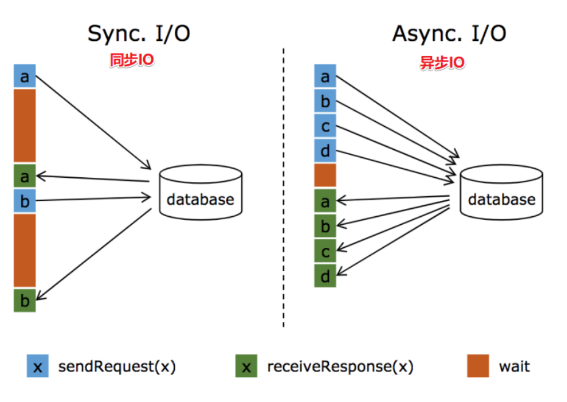
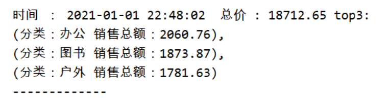
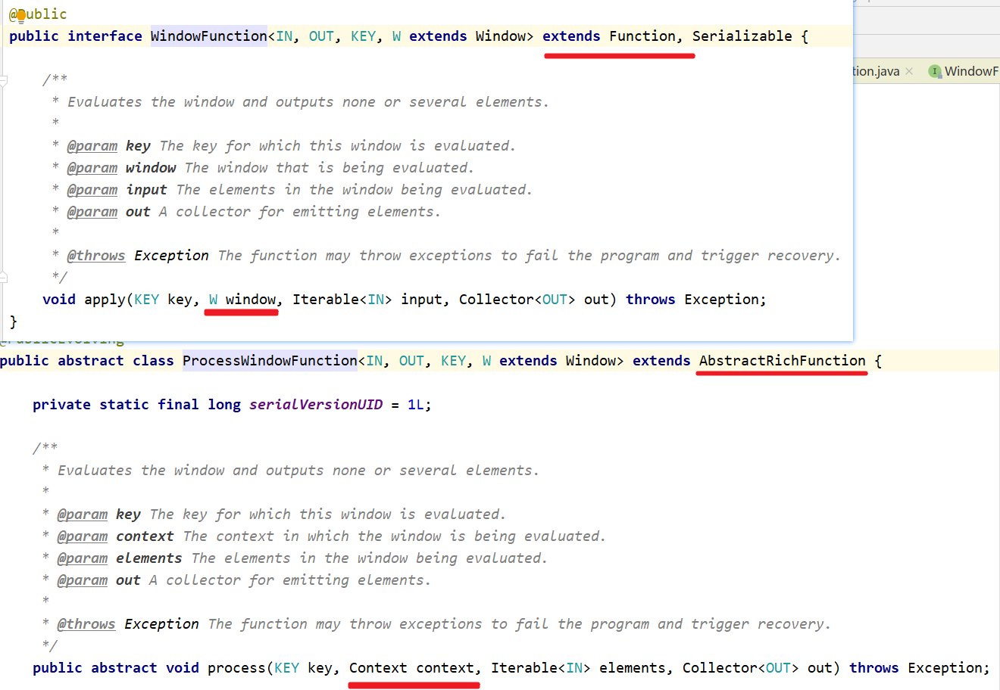
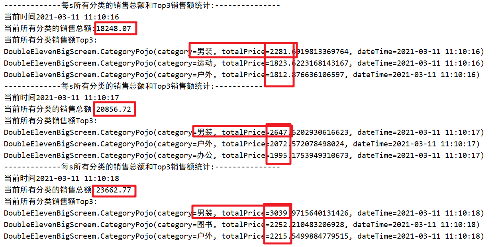
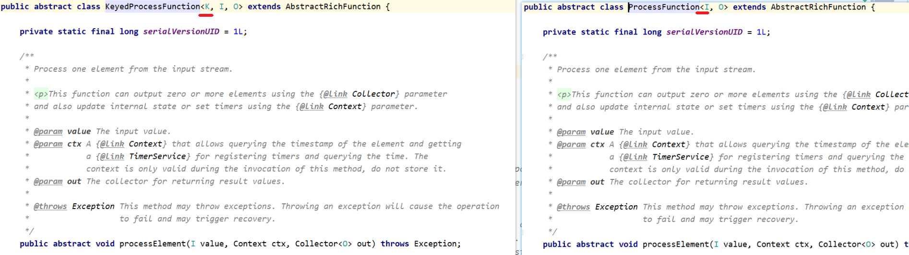
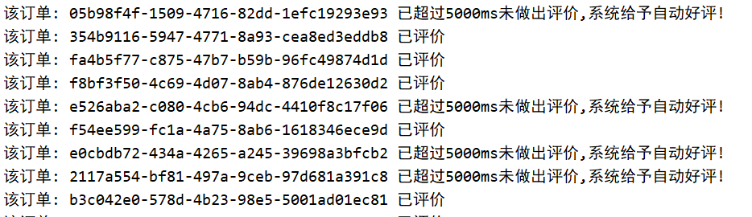
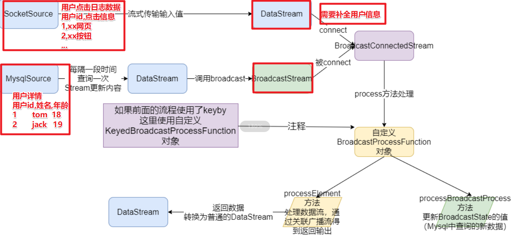
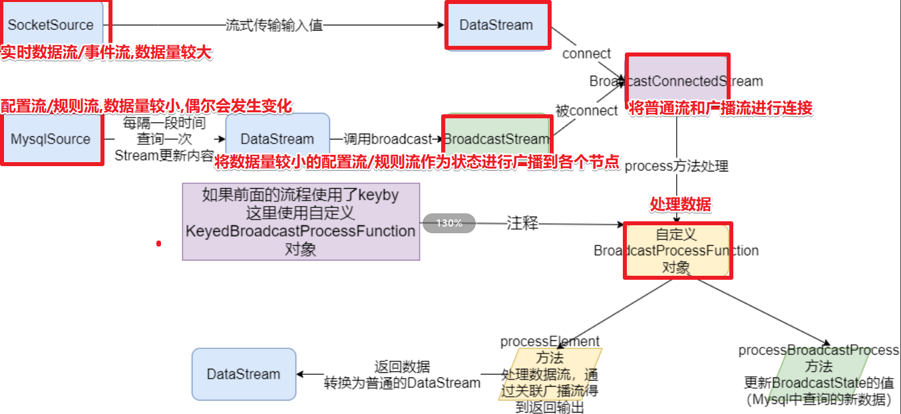
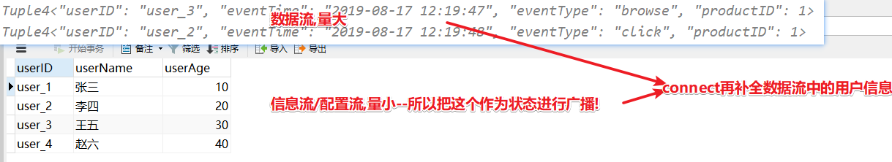
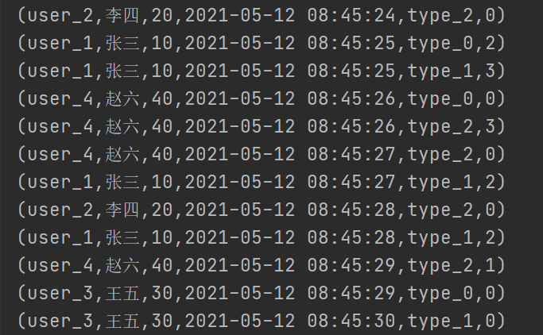

[TOC]


# 1- 复习回顾

- 1.异步IO

  - 为什么使用异步IO? --查询无需等待,异步返回结果,查询效率高

    

  - 如何使用? 

    ​	--对于客户端要支持异步连接(如果不支持得用第三方的工具包装或使用连接池模拟)

    ​	--对于Flink中的操作需要继承RichAsyncFunction然后实行方法


- 2.FileSink和Streaming File Sink

  - 1.7时: 离线数据写入File使用ds.writeAsText, 实时数据使用Streaming File Sink

  - 1.12时:  离线数据和实时数据统一使用FileSink

  - 注意: FileSink写实时文件需要开启Checkpoint功能

  - 代码演示

  - ```java
    package cn.itcast.extend;
    
    import org.apache.flink.api.common.RuntimeExecutionMode;
    import org.apache.flink.api.common.functions.FlatMapFunction;
    import org.apache.flink.api.common.functions.MapFunction;
    import org.apache.flink.api.common.serialization.SimpleStringEncoder;
    import org.apache.flink.api.java.tuple.Tuple2;
    import org.apache.flink.connector.file.sink.FileSink;
    import org.apache.flink.core.fs.Path;
    import org.apache.flink.runtime.state.filesystem.FsStateBackend;
    import org.apache.flink.streaming.api.datastream.DataStream;
    import org.apache.flink.streaming.api.environment.CheckpointConfig;
    import org.apache.flink.streaming.api.environment.StreamExecutionEnvironment;
    import org.apache.flink.streaming.api.functions.sink.filesystem.bucketassigners.DateTimeBucketAssigner;
    import org.apache.flink.streaming.api.functions.sink.filesystem.rollingpolicies.DefaultRollingPolicy;
    import org.apache.flink.util.Collector;
    
    import java.util.concurrent.TimeUnit;
    
    /**
     * Author itcast
     * Desc 演示Flink1.12新特性-FlieSink将数据实时写入到HDFS
     */
    public class FileSinkDemo {
        public static void main(String[] args) throws Exception {
            //TODO 1.env-准备环境
            StreamExecutionEnvironment env = StreamExecutionEnvironment.getExecutionEnvironment();
            env.setRuntimeMode(RuntimeExecutionMode.AUTOMATIC);
            env.setParallelism(10);
            //====配置Checkpoint:都是一些固定的通用的配置===
            env.enableCheckpointing(1000);
            env.setStateBackend(new FsStateBackend("file:///D:/ckp"));
            env.getCheckpointConfig().setMinPauseBetweenCheckpoints(500);//默认是0
            env.getCheckpointConfig().setTolerableCheckpointFailureNumber(10);//默认值为0，表示不容忍任何检查点失败
            env.getCheckpointConfig().enableExternalizedCheckpoints(CheckpointConfig.ExternalizedCheckpointCleanup.RETAIN_ON_CANCELLATION);
    
            //TODO 2.source-加载数据
            DataStream<String> socketDS = env.socketTextStream("192.168.88.161", 9999);
    
            //TODO 3.transformation-数据转换处理
            DataStream<String> resultDS = socketDS.flatMap(new FlatMapFunction<String, Tuple2<String, Integer>>() {
                @Override
                public void flatMap(String value, Collector<Tuple2<String, Integer>> out) throws Exception {
                    String[] words = value.split(" ");
                    for (String word : words) {
                        out.collect(Tuple2.of(word, 1));
                    }
                }
            }).keyBy(0).sum(1).map(new MapFunction<Tuple2<String, Integer>, String>() {
                @Override
                public String map(Tuple2<String, Integer> value) throws Exception {
                    return value.f0 + ":::" + value.f1;
                }
            });
    
    
            //TODO 4.sink-数据输出
            resultDS.print();
            //准备FlinkSink的配置
            //指定路径和编码
            FileSink<String> fileSink = FileSink.forRowFormat(new Path("hdfs://node1:8020/FlinkFileSink/48"), new SimpleStringEncoder<String>("UTF-8"))
                    //指定分桶策略/分文件夹的策略
                    .withBucketAssigner(new DateTimeBucketAssigner<>())
                    //指定滚动策略
                    .withRollingPolicy(DefaultRollingPolicy.builder()
                            .withMaxPartSize(1024 * 1024 * 1024)//单个文件最大大小
                            .withRolloverInterval(TimeUnit.MINUTES.toMillis(15))//文件最多写入的时长
                            .withInactivityInterval(TimeUnit.MINUTES.toMillis(5))//文件最大空闲时间
                            .build())
                    .build();
    
            resultDS.sinkTo(fileSink).setParallelism(100);
    
            //TODO 5.execute-执行
            env.execute();
        }
    }
    
    ```

    

- 3.并行度

  - operator.setParallelism(数字)
  - env.setParallelism(数字)
  - bin/flink run  -p 或 --parallelism
  - conf/flink-conf.yaml 配置 parallelism.default: 1
  - 注意:设置多少并行度和硬件强相关, Source一般和Kafka分区数一致, Transformation和Sink根据实际进行调整


- 4.FlinkSQL
  - 注意: 实际中进行FlinkSQL开发的时候一定要参考官网
  - https://ci.apache.org/projects/flink/flink-docs-release-1.12/dev/table/
  - 案例参考代码


# 2- 综合练习1-双十一实时大屏统计-好好敲!慢慢敲!

## 2-1 需求




在大数据的实时处理中，实时的大屏展示已经成了一个很重要的展示项，比如最有名的双十一大屏实时销售总价展示。除了这个，还有一些其他场景的应用，比如我们在我们的后台系统实时的展示我们网站当前的pv、uv等等，其实做法都是类似的。

今天我们就做一个最简单的模拟电商统计大屏的小例子，

需求如下：

1.实时计算出当天零点截止到当前时间的销售总额

2.计算出各个分类的销售top3

3.每秒钟更新一次统计结果


## 2-2 数据

```java
package cn.itcast.exercise;

import org.apache.flink.api.common.RuntimeExecutionMode;
import org.apache.flink.api.java.tuple.Tuple2;
import org.apache.flink.streaming.api.datastream.DataStream;
import org.apache.flink.streaming.api.environment.StreamExecutionEnvironment;
import org.apache.flink.streaming.api.functions.source.SourceFunction;

import java.util.Random;

/**
 * Author itcast
 * Desc 需求如下：
 * 1.实时计算出当天零点截止到当前时间的销售总额
 * 2.计算出各个分类的销售top3
 * 3.每秒钟更新一次统计结果
 */
public class DoubleElevenBigScreem {
    public static void main(String[] args) throws Exception {
        //TODO 1.env-准备环境
        StreamExecutionEnvironment env = StreamExecutionEnvironment.getExecutionEnvironment();
        env.setRuntimeMode(RuntimeExecutionMode.AUTOMATIC);
        
        //TODO 2.source-加载数据
        DataStream<Tuple2<String, Double>> orderDS = env.addSource(new MySource());

        //TODO 3.transformation-数据转换处理
        
        //TODO 4.sink-数据输出
        
        //TODO 5.execute-执行
        env.execute();
    }
    
    
    
    /**
     * 自定义数据源实时产生订单数据Tuple2<分类, 金额>
     */
    public static class MySource implements SourceFunction<Tuple2<String, Double>> {
        private boolean flag = true;
        private String[] categorys = {"女装", "男装", "图书", "家电", "洗护", "美妆", "运动", "游戏", "户外", "家具", "乐器", "办公"};
        private Random random = new Random();

        @Override
        public void run(SourceContext<Tuple2<String, Double>> ctx) throws Exception {
            while (flag) {
                //随机生成分类和金额
                int index = random.nextInt(categorys.length);//[0~length) ==> [0~length-1]
                String category = categorys[index];//获取的随机分类
                double price = random.nextDouble() * 100;//注意nextDouble生成的是[0~1)之间的随机小数,*100之后表示[0~100)的随机小数
                ctx.collect(Tuple2.of(category, price));
                Thread.sleep(20);
            }
        }

        @Override
        public void cancel() {
            flag = false;
        }
    }
}

```


## 2-3 代码实现




```java
package cn.itcast.exercise;

import lombok.AllArgsConstructor;
import lombok.Data;
import lombok.NoArgsConstructor;
import org.apache.commons.lang3.time.FastDateFormat;
import org.apache.flink.api.common.RuntimeExecutionMode;
import org.apache.flink.api.common.functions.AggregateFunction;
import org.apache.flink.api.java.tuple.Tuple2;
import org.apache.flink.streaming.api.datastream.DataStream;
import org.apache.flink.streaming.api.environment.StreamExecutionEnvironment;
import org.apache.flink.streaming.api.functions.source.SourceFunction;
import org.apache.flink.streaming.api.functions.windowing.ProcessWindowFunction;
import org.apache.flink.streaming.api.functions.windowing.WindowFunction;
import org.apache.flink.streaming.api.windowing.assigners.TumblingProcessingTimeWindows;
import org.apache.flink.streaming.api.windowing.time.Time;
import org.apache.flink.streaming.api.windowing.triggers.ContinuousProcessingTimeTrigger;
import org.apache.flink.streaming.api.windowing.windows.TimeWindow;
import org.apache.flink.util.Collector;

import java.math.BigDecimal;
import java.math.RoundingMode;
import java.util.PriorityQueue;
import java.util.Queue;
import java.util.Random;

/**
 * Author itcast
 * Desc 需求如下：
 * 1.实时计算出当天零点截止到当前时间的销售总额
 * 2.计算出各个分类的销售top3
 * 3.每秒钟更新一次统计结果
 */
public class DoubleElevenBigScreem {
    public static void main(String[] args) throws Exception {
        //TODO 1.env-准备环境
        StreamExecutionEnvironment env = StreamExecutionEnvironment.getExecutionEnvironment();
        env.setRuntimeMode(RuntimeExecutionMode.AUTOMATIC);

        //TODO 2.source-加载数据
        //Tuple2<分类, 金额>
        DataStream<Tuple2<String, Double>> orderDS = env.addSource(new MySource());

        //TODO 3.transformation-数据转换处理/预聚合
        //每s预聚合各个分类从当天0点开始截止到目前为止的各个分类的销售额
        DataStream<CategoryPojo> aggregateResult =
                //keyBy(t->t.f0)
                orderDS.keyBy(t -> t.f0)
                //3.1定义大小为一天的窗口,第二个参数表示中国使用的UTC+08:00时区比UTC时间早
                //下面的窗口表示:从当天的0点开始收集当天的数据,东8区
                //.window(TumblingProcessingTimeWindows.of(Time.days(1)))//之前的普通滚动窗口,这里用不了
                .window(TumblingProcessingTimeWindows.of(Time.days(1), Time.hours(-8)))
                //3.2定义一个1s的触发器
                .trigger(ContinuousProcessingTimeTrigger.of(Time.seconds(1)))
                //3.3聚合结果.aggregate(new PriceAggregate(), new WindowResult());
                //.sum/reduce //可以简单聚合 --学过
                //.apply //自定义聚合/操作 --学过
                .aggregate(new MyAggregate(), new MyWindow());//可以指定如何聚合,如何收集聚合结果
                //3.4看一下聚合的结果
                //aggregateResult.print();
                //CategoryPojo(category=办公, totalPrice=641.4440485668781, dateTime=2021-03-11 10:27:39)
                //CategoryPojo(category=洗护, totalPrice=439.51135186764327, dateTime=2021-03-11 10:27:39)

        //TODO 4.transformation + sink-数据输出
        //使用上面预聚合的结果,实现业务需求:
        //按照时间进行分组方便后续每s更新销售总额,已经每s显示top3
        aggregateResult.keyBy(CategoryPojo::getDateTime)
                //每秒钟更新一次统计结果
                .window(TumblingProcessingTimeWindows.of(Time.seconds(1)))
                //apply--学过
                //在ProcessWindowFunction中实现该复杂业务逻辑并直接输出结果(因为结果内容太多,不好封装)
                .process(new MyProcessWindow());

        //TODO 5.execute-执行
        env.execute();
    }

    /**
     * 自定义窗口处理函数,里面要实现业务逻辑并直接输出
     * 1.实时计算出当天零点截止到当前时间的销售总额
     * 2.计算出各个分类的销售top3
     * 3.每秒钟更新一次统计结果
     * public abstract class ProcessWindowFunction<CategoryPojo, Object, String, TimeWindow> extends AbstractRichFunction {
     * public abstract class ProcessWindowFunction<IN, OUT, KEY, W extends Window> extends AbstractRichFunction {
     * public abstract void process(KEY String时间, Context context, Iterable<IN> categoryPojos, Collector<OUT> out) throws Exception;
     * public abstract void process(KEY key, Context context, Iterable<IN> elements, Collector<OUT> out) throws Exception;
     */
    private static class MyProcessWindow extends ProcessWindowFunction<CategoryPojo,Object,String,TimeWindow> {
        @Override
        public void process(String key, Context context, Iterable<CategoryPojo> categoryPojos, Collector<Object> out) throws Exception {
            //TODO 1.实时计算出当天零点截止到当前时间的销售总额
            Double totalAmount = 0D;//各个分类的销售总额
            //TODO 2.计算出各个分类的销售额最大的Top3
            //注意:可以通过价格排序求出销售额Top3,但是需求只需要取Top3,对所有进来的数据排序太浪费性能,所以可以考虑使用小顶堆!
            //注意:小顶堆取最大的topN,大顶堆取最小的topN
            //https://blog.csdn.net/hefenglian/article/details/81807527
            //1 --堆顶
            //2
            //3 --堆底
            //---
            //如果再加一个数4,>堆顶元素应该把堆顶移除(需要手动移除),并放入4到堆底(放入后根据规则进行比较自动下沉到堆底)
            //如果再加一个数0,<堆顶元素,不需要管
            Queue<CategoryPojo> queue = new PriorityQueue<>(3, (c1, c2) -> c1.getTotalPrice() >= c2.getTotalPrice() ? 1 : -1);
            for (CategoryPojo categoryPojo : categoryPojos) {
                //categoryPojo.setTotalPrice(new BigDecimal(categoryPojo.getTotalPrice()).setScale(2,RoundingMode.HALF_UP).doubleValue());
                totalAmount += categoryPojo.getTotalPrice();
                if(queue.size() < 3){//堆中元素数量<3,直接加入(自动根据规则比较大小下沉)
                    queue.add(categoryPojo);
                }else{//堆中的元素数量>=3,应该要进行比较
                    //取出堆顶(只是看一下堆顶的值,不是移除)
                    CategoryPojo top = queue.peek();//peek表示偷看,不移除堆顶
                    if(categoryPojo.getTotalPrice() > top.getTotalPrice()){//当前进来的元素 > 堆顶元素
                        //移除堆顶元素
                        //queue.remove(top);
                        queue.poll();//移除堆顶
                        //加入当前元素
                        queue.add(categoryPojo);
                    }/*else{ //当前进来的元素 <= 堆顶元素 ,不用管

                    }*/
                }
            }
            //TODO 3.每秒钟更新一次统计结果/直接输出
            System.out.println("-------------每s所有分类的销售总额和Top3销售额统计:---------------");
            System.out.println("当前时间"+ key);
            System.out.println("当前所有分类的销售总额:"+ new BigDecimal(totalAmount).setScale(2, RoundingMode.HALF_UP));
            System.out.println("当前所有分类销售额Top3:");
            //对top3倒序
            //queue.stream().sorted((c1, c2) -> c1.getTotalPrice() <= c2.getTotalPrice() ? 1 : -1).forEach(c-> System.out.println(c));
            //queue.stream().sorted((c1, c2) -> c1.getTotalPrice() <= c2.getTotalPrice() ? 1 : -1).forEach(System.out::println);

            queue.stream().map(c-> {
                        c.setTotalPrice(new BigDecimal(c.getTotalPrice()).setScale(2,RoundingMode.HALF_UP).doubleValue());
                        return c;
            }).sorted((c1, c2) -> c1.getTotalPrice() <= c2.getTotalPrice() ? 1 : -1).forEach(System.out::println);

        }
    }


    /**
     * 自定义聚合操作
     * AggregateFunction<IN, ACC, OUT>
     * AggregateFunction<Tuple2<分类, 金额>, 金额, 金额>
     */
    private static class MyAggregate implements AggregateFunction<Tuple2<String, Double>, Double, Double> {
        //初始化累加器
        @Override
        public Double createAccumulator() {
            return 0D;
        }

        //将数据累加到累加器上
        @Override
        public Double add(Tuple2<String, Double> value, Double accumulator) {
            return value.f1 + accumulator;
        }

        //获取累加结果
        @Override
        public Double getResult(Double accumulator) {
            return accumulator;
        }

        //合并每s的结果
        @Override
        public Double merge(Double a, Double b) {
            return a + b;
        }
    }

    /**
     * 自定义收集窗口
     * //WindowFunction<金额Double, 要返回一个JavaBean-CategoryPojo, 分类, TimeWindow>
     * public interface WindowFunction<IN, OUT, KEY, W extends Window> extends Function, Serializable {
     *  //apply(KEY 分类, W 窗口, Iterable<IN> 该窗口该分类的金额的集合, Collector<OUT> 收集器)
     * 	void apply(KEY key, W window, Iterable<IN> input, Collector<OUT> out) throws Exception;
     */
    private static class MyWindow implements WindowFunction<Double, CategoryPojo, String, TimeWindow> {
        private FastDateFormat df = FastDateFormat.getInstance("yyyy-MM-dd HH:mm:ss");
        @Override
        public void apply(String key, TimeWindow window, Iterable<Double> prices, Collector<CategoryPojo> out) throws Exception {
            double totalPrice = 0D;
            for (Double price : prices) {
                totalPrice += price;
            }
            CategoryPojo categoryPojo = new CategoryPojo();
            categoryPojo.setCategory(key);
            categoryPojo.setTotalPrice(totalPrice);
            categoryPojo.setDateTime(df.format(System.currentTimeMillis()));
            out.collect(categoryPojo);
        }
    }

    /**
     * 用于存储收集到聚合结果
     */
    @Data
    @AllArgsConstructor
    @NoArgsConstructor
    public static class CategoryPojo {
        private String category;//分类名称
        private double totalPrice;//该分类总销售额
        private String dateTime;// 截止到当前时间的时间,本来应该是EventTime,但是我们这里简化了直接用当前系统时间即可
    }

    /**
     * 自定义数据源实时产生订单数据Tuple2<分类, 金额>
     */
    public static class MySource implements SourceFunction<Tuple2<String, Double>> {
        private boolean flag = true;
        private String[] categorys = {"女装", "男装", "图书", "家电", "洗护", "美妆", "运动", "游戏", "户外", "家具", "乐器", "办公"};
        private Random random = new Random();

        @Override
        public void run(SourceContext<Tuple2<String, Double>> ctx) throws Exception {
            while (flag) {
                //随机生成分类和金额
                int index = random.nextInt(categorys.length);//[0~length) ==> [0~length-1]
                String category = categorys[index];//获取的随机分类
                double price = random.nextDouble() * 100;//注意nextDouble生成的是[0~1)之间的随机小数,*100之后表示[0~100)的随机小数
                ctx.collect(Tuple2.of(category, price));
                Thread.sleep(20);
            }
        }

        @Override
        public void cancel() {
            flag = false;
        }
    }
}

```


## 2-4 最终效果




# 3- 综合练习2-订单自动好评-好好敲!慢慢敲!


## 3-1 需求


在电商领域会有这么一个场景，如果用户买了商品，在订单完成之后，一定时间之内没有做出评价，系统自动给与五星好评，我们今天主要使用Flink的定时器来简单实现这一功能。


## 3-2 数据

```java
 /**
     * 自定义source实时产生订单数据Tuple3<用户id,订单id, 订单生成时间>
     */
    public static class MySource implements SourceFunction<Tuple3<String, String, Long>> {
        private boolean flag = true;
        @Override
        public void run(SourceContext<Tuple3<String, String, Long>> ctx) throws Exception {
            Random random = new Random();
            while (flag) {
                String userId = random.nextInt(5) + "";
                String orderId = UUID.randomUUID().toString();
                long currentTimeMillis = System.currentTimeMillis();
                ctx.collect(Tuple3.of(userId, orderId, currentTimeMillis));
                Thread.sleep(500);
            }
        }

        @Override
        public void cancel() {
            flag = false;
        }
    }
```


## 3-3 代码实现



```java
package cn.itcast.exercise;

import org.apache.flink.api.common.RuntimeExecutionMode;
import org.apache.flink.api.common.state.MapState;
import org.apache.flink.api.common.state.MapStateDescriptor;
import org.apache.flink.api.java.tuple.Tuple3;
import org.apache.flink.configuration.Configuration;
import org.apache.flink.streaming.api.datastream.DataStream;
import org.apache.flink.streaming.api.environment.StreamExecutionEnvironment;
import org.apache.flink.streaming.api.functions.KeyedProcessFunction;
import org.apache.flink.streaming.api.functions.source.SourceFunction;
import org.apache.flink.util.Collector;

import java.util.*;

/**
 * Author itcast
 * Desc 在电商领域会有这么一个场景，如果用户买了商品，在订单完成之后，一定时间之内没有做出评价，系统自动给与五星好评，
 * 我们今天主要使用Flink的定时器来简单实现这一功能。
 */
public class OrderAutomaticFavorableComments {
    public static void main(String[] args) throws Exception {
        //TODO 1.env-准备环境
        StreamExecutionEnvironment env = StreamExecutionEnvironment.getExecutionEnvironment();
        env.setRuntimeMode(RuntimeExecutionMode.AUTOMATIC);
        //TODO 2.source-加载数据
        //Tuple3<用户id,订单id, 订单生成时间>
        DataStream<Tuple3<String, String, Long>> orderDS = env.addSource(new MySource());
        //TODO 3.transformation-数据转换处理
        //设置经过interval毫秒用户未对订单做出评价，自动给与好评.为了演示方便，设置5s的时间
        long interval = 5000L;//超过多久没有给予评价,就自动给予好评,为了方便测试这里设置为5s
        //分组后使用自定义KeyedProcessFunction完成定时判断超时订单并自动好评
        orderDS.keyBy(t -> t.f0).process(new MyKeyedProcessFunction(interval));
        //TODO 4.sink-数据输出
        //TODO 5.execute-执行
        env.execute();
        HashMap hashMap = new HashMap();
    }

    /**
     * KeyedProcessFunction<String, Tuple3<String, String, Long>, Object>
     * public abstract class KeyedProcessFunction<K, I, O> extends AbstractRichFunction {
     * public abstract void processElement(I value, Context ctx, Collector<O> out) throws Exception;
     */
    private static class MyKeyedProcessFunction extends KeyedProcessFunction<String, Tuple3<String, String, Long>, Object> {
        private Long interval = 0L;
        public MyKeyedProcessFunction(Long interval){
            this.interval = interval;
        }
        //3.1定义MapState类型的状态，key是订单号，value是订单完成时间
        private MapState<String, Long> mapState = null;
        //初始MapState
        @Override
        public void open(Configuration parameters) throws Exception {
            //创建状态描述器
            MapStateDescriptor<String, Long> stateDescriptor = new MapStateDescriptor<>("mapState", String.class, Long.class);
            //根据状态描述器获取状态
            mapState = getRuntimeContext().getMapState(stateDescriptor);
        }

        //处理进来的每个元素/订单
        //Tuple3<用户id,订单id, 订单生成时间>
        @Override
        public void processElement(Tuple3<String, String, Long> value, Context ctx, Collector<Object> out) throws Exception {
            //3.2现将当前订单信息存入状态中
            mapState.put(value.f1, value.f2);
            //3.3注册定时器
            ctx.timerService().registerProcessingTimeTimer(value.f2 + interval);
        }

        //3.4定时器被触发时执行并输出结果
        @Override
        public void onTimer(long timestamp, OnTimerContext ctx, Collector<Object> out) throws Exception {
            //Iterable<Map.Entry<String, Long>> entries = mapState.entries();//获取map中的kv对组成的集合
            //Iterator<Map.Entry<String, Long>> iterator = entries.iterator();
            Iterator<Map.Entry<String, Long>> iterator = mapState.iterator();
            while (iterator.hasNext()){
                Map.Entry<String, Long> entry = iterator.next();
                String orderId = entry.getKey();
                Long orderTime = entry.getValue();
                //判断是否评价
                //实际中应该调用外部接口/系统,查询该订单是否已评价,我们这里直接调用模拟的方法
                if(isEvaluate(orderId)){
                    //已经评价过了
                    System.out.println("该订单: "+orderId+" 已评价");
                    iterator.remove();//移除当前元素
                    mapState.remove(orderId);//该订单已经评价了,应该从状态中移除
                }else{
                    //判断是否超时
                    if(System.currentTimeMillis() - orderTime >= interval){
                        //超时了,系统给予自动好评
                        //实际中应该调用外部接口/系统,修改订单状态为好评
                        System.out.println("该订单: "+orderId+" 已超过"+ interval +"ms未做出评价,系统给予自动好评!");
                        iterator.remove();//移除当前元素
                        mapState.remove(orderId);//应该从状态中移除
                    }/*else{
                        //没有超时/也没有评价,不用管
                    }*/
                }
            }
            /*for (Map.Entry<String, Long> entry : entries) {

            }*/
            //注意:
            // 1.集合遍历删除要使用迭代器,不能使用for循环一遍遍历一遍删除
            // 2.普通map遍历的使用entrySet,不要使用keySet,values.(mapState对map进行封装,提供了iterator可以直接使用)

        }

        /**
         * 判断订单是否已经评价
         */
        public boolean isEvaluate(String orderId){
            int i = new Random().nextInt(10);
            return  i % 3 == 0 ;
        }
    }


    /**
     * 自定义source实时产生订单数据Tuple3<用户id,订单id, 订单生成时间>
     */
    public static class MySource implements SourceFunction<Tuple3<String, String, Long>> {
        private boolean flag = true;

        @Override
        public void run(SourceContext<Tuple3<String, String, Long>> ctx) throws Exception {
            Random random = new Random();
            while (flag) {
                String userId = random.nextInt(5) + "";
                String orderId = UUID.randomUUID().toString();
                long currentTimeMillis = System.currentTimeMillis();
                ctx.collect(Tuple3.of(userId, orderId, currentTimeMillis));
                Thread.sleep(500);
            }
        }

        @Override
        public void cancel() {
            flag = false;
        }
    }
}

```


## 3-4 最后效果




# 4- 综合练习3-BroadcastState-了解


## 4-1 需求






```properties
实时过滤出配置中的用户，并在事件流中补全这批用户的基础信息。
1.日志事件流：表示用户在某个时刻浏览或点击了某个商品，格式如下。
{"userID": "user_3", "eventTime": "2019-08-17 12:19:47", "eventType": "browse", "productID": 1}
{"userID": "user_2", "eventTime": "2019-08-17 12:19:48", "eventType": "click", "productID": 1}

2.配置数据(数据流较小,偶尔会变化): 表示用户的详细信息，在Mysql中，如下。
DROP TABLE IF EXISTS `user_info`;
CREATE TABLE `user_info`  (
  `userID` varchar(20) CHARACTER SET utf8 COLLATE utf8_general_ci NOT NULL,
  `userName` varchar(10) CHARACTER SET utf8 COLLATE utf8_general_ci NULL DEFAULT NULL,
  `userAge` int(11) NULL DEFAULT NULL,
  PRIMARY KEY (`userID`) USING BTREE
) ENGINE = MyISAM CHARACTER SET = utf8 COLLATE = utf8_general_ci ROW_FORMAT = Dynamic;
-- ----------------------------
-- Records of user_info
-- ----------------------------
INSERT INTO `user_info` VALUES ('user_1', '张三', 10);
INSERT INTO `user_info` VALUES ('user_2', '李四', 20);
INSERT INTO `user_info` VALUES ('user_3', '王五', 30);
INSERT INTO `user_info` VALUES ('user_4', '赵六', 40);
SET FOREIGN_KEY_CHECKS = 1;

3.输出结果:
(user_3,2019-08-17 12:19:47,browse,1,王五,33)
(user_2,2019-08-17 12:19:48,click,1,李四,20)
```


一个数据流A(实时进来数据,且**数据量大**), 

一个用户信息流B(**配置流**)(**数据不经常发生变化,但会变化,且数据量不大**)

现在数据流要根据用户信息流补充数据流中的用户信息,可以:

1.数据流.map(查询)--要查很多次,不合适

2.把用户信息流广播到内存中,并定期更新,然后和数据流进行**conncet**,然后处理进行信息补全

针对这种情况,Flink提供了广播状态! 


<span style="color:red;background:white;font-size:20px;font-family:楷体;">**下游的操作接收这些配置、规则并保存为 BroadcastState, 将这些配置应用到另一个数据流的计算中 。**</span>


- 场景举例
  - 1) **动态更新计算规则**: 如事件流需要根据最新的规则进行计算，则可将规则作为广播状态广播到下游Task中。
  - 2) **实时增加额外字段**: 如事件流需要实时增加用户的基础信息，则可将用户的基础信息作为广播状态广播到下游Task中。


## 4-2 数据

日志数据

```
<"userID": "user_3", "eventTime": "2019-08-17 12:19:47", "eventType": "browse", "productID": 1>
<"userID": "user_2", "eventTime": "2019-08-17 12:19:48", "eventType": "click", "productID": 1>
```


```java
/**
     * <userID, eventTime, eventType, productID>
     */
    public static class MySource implements SourceFunction<Tuple4<String, String, String, Integer>> {
        private boolean isRunning = true;
        @Override
        public void run(SourceContext<Tuple4<String, String, String, Integer>> ctx) throws Exception {
            Random random = new Random();
            SimpleDateFormat df = new SimpleDateFormat("yyyy-MM-dd HH:mm:ss");
            while (isRunning){
                int id = random.nextInt(4) + 1;
                String user_id = "user_" + id;
                String eventTime = df.format(new Date());
                String eventType = "type_" + random.nextInt(3);
                int productId = random.nextInt(4);
                ctx.collect(Tuple4.of(user_id,eventTime,eventType,productId));
                Thread.sleep(500);
            }
        }

        @Override
        public void cancel() {
            isRunning = false;
        }
    }
```


用户信息数据

```
DROP TABLE IF EXISTS `user_info`;
CREATE TABLE `user_info`  (
  `userID` varchar(20) CHARACTER SET utf8 COLLATE utf8_general_ci NOT NULL,
  `userName` varchar(10) CHARACTER SET utf8 COLLATE utf8_general_ci NULL DEFAULT NULL,
  `userAge` int(11) NULL DEFAULT NULL,
  PRIMARY KEY (`userID`) USING BTREE
) ENGINE = MyISAM CHARACTER SET = utf8 COLLATE = utf8_general_ci ROW_FORMAT = Dynamic;
-- ----------------------------
-- Records of user_info
-- ----------------------------
INSERT INTO `user_info` VALUES ('user_1', '张三', 10);
INSERT INTO `user_info` VALUES ('user_2', '李四', 20);
INSERT INTO `user_info` VALUES ('user_3', '王五', 30);
INSERT INTO `user_info` VALUES ('user_4', '赵六', 40);
SET FOREIGN_KEY_CHECKS = 1;
```





## 4-3 重要技术点

- 定义**状态描述器**记录广播信息

``` java
//-1.定义状态描述器(了解复杂嵌套格式的定义)
MapStateDescriptor<Void,Map<String,Tuple2<String,Integer>>> stateDescriptor = new 			MapStateDescriptor<>(
                "user",
                Types.VOID,
                Types.MAP(Types.STRING,Types.TUPLE(Types.STRING,Types.INT)));
```

- 将用户信息通过状态描述器广播出去

``` java
//-2.广播用户信息流/配置流
BroadcastStream<Map<String, Tuple2<String, Integer>>> broadcastDS
    = userDS.broadcast(stateDescriptor);
```

- 两个流连接起来

``` java
//-3.将用户点击日志数据流和广播用户信息流/配置流进行连接
BroadcastConnectedStream<Tuple4<String, String, String, Integer>, Map<String, Tuple2<String, Integer>>> connectDS = logDS.connect(broadcastDS);

```

- 处理连接后的流 BroadcastProcessFunction

```java
//-4.处理连接后的流-根据配置流补全事件流中的用户的信息
connectDS.process(new BroadcastProcessFunction<
                Tuple4<String, String, String, Integer>,    // log流
                Map<String, Tuple2<String, Integer>>,       // user流
                Tuple6<String, String, String, String, String, String>>() {
                    ......
                }
```


## 4-4 代码实现

```java
package com.fiberhome.flink.action;

import org.apache.commons.lang3.time.FastDateFormat;
import org.apache.flink.api.common.RuntimeExecutionMode;
import org.apache.flink.api.common.state.BroadcastState;
import org.apache.flink.api.common.state.MapStateDescriptor;
import org.apache.flink.api.common.state.ReadOnlyBroadcastState;
import org.apache.flink.api.common.typeinfo.Types;
import org.apache.flink.api.java.tuple.Tuple2;
import org.apache.flink.api.java.tuple.Tuple4;
import org.apache.flink.api.java.tuple.Tuple6;
import org.apache.flink.configuration.Configuration;
import org.apache.flink.streaming.api.datastream.BroadcastConnectedStream;
import org.apache.flink.streaming.api.datastream.BroadcastStream;
import org.apache.flink.streaming.api.datastream.DataStreamSource;
import org.apache.flink.streaming.api.datastream.SingleOutputStreamOperator;
import org.apache.flink.streaming.api.environment.StreamExecutionEnvironment;
import org.apache.flink.streaming.api.functions.co.BroadcastProcessFunction;
import org.apache.flink.streaming.api.functions.source.RichSourceFunction;
import org.apache.flink.streaming.api.functions.source.SourceFunction;
import org.apache.flink.util.Collector;

import java.sql.Connection;
import java.sql.DriverManager;
import java.sql.PreparedStatement;
import java.sql.ResultSet;
import java.util.Date;
import java.util.HashMap;
import java.util.Map;
import java.util.Random;

public class Demo03_BroadCastState {
    public static void main(String[] args) throws Exception {

        StreamExecutionEnvironment env = StreamExecutionEnvironment.getExecutionEnvironment();
        env.setRuntimeMode(RuntimeExecutionMode.AUTOMATIC);


        DataStreamSource<Map<String, Tuple2<String, Integer>>> userDS = env.addSource(new MySqlSource());
//        userDS.print();

        DataStreamSource<Tuple4<String, String, String, Integer>> logDS = env.addSource(new MyLogSource());
//        logDS.print();

        //TODO 3.transformation-数据转换处理
        //-1.定义状态描述器(了解复杂嵌套格式的定义)
        MapStateDescriptor<Void,Map<String,Tuple2<String,Integer>>> stateDescriptor = new MapStateDescriptor<>(
                "user",
                Types.VOID,
                Types.MAP(Types.STRING,Types.TUPLE(Types.STRING,Types.INT)));

        //-2.广播用户信息流/配置流
        BroadcastStream<Map<String, Tuple2<String, Integer>>> broadcastDS
                = userDS.broadcast(stateDescriptor);


        //-3.将用户点击日志数据流和广播用户信息流/配置流进行连接
        BroadcastConnectedStream<Tuple4<String, String, String, Integer>, Map<String, Tuple2<String, Integer>>> connectDS = logDS.connect(broadcastDS);


        //-4.处理连接后的流-根据配置流补全事件流中的用户的信息
        SingleOutputStreamOperator<Tuple6<String, String, String, String, String, String>> result = connectDS.process(new BroadcastProcessFunction<
                Tuple4<String, String, String, Integer>,    // log流
                Map<String, Tuple2<String, Integer>>,       // user流
                Tuple6<String, String, String, String, String, String>>() {
            @Override
            public void processElement(Tuple4<String, String, String, Integer> log, ReadOnlyContext context, Collector<Tuple6<String, String, String, String, String, String>> collector) throws Exception {
                ReadOnlyBroadcastState<Void, Map<String, Tuple2<String, Integer>>> broadcastState = context.getBroadcastState(stateDescriptor);
                String userId = log.f0;

//                System.out.println("userId == "+ userId);

                if (broadcastState != null) {
                    Map<String, Tuple2<String, Integer>> map = broadcastState.get(null);// 根据key 获取状态中的map

                    // 判断是否有状态
                    if(map != null && map.size() > 0){
                        Tuple2<String, Integer> user = map.get(userId);
                        String name = user.f0;
                        Integer age = user.f1;
                        Tuple6<String, String, String, String, String, String> result = Tuple6.of(log.f0, user.f0, age + "", log.f1, log.f2, log.f3 + "");
                        collector.collect(result);
                    }

                }

            }

            /**
             * 更新广播状态数据， 每5s查询一次用户信息， 所以5s更新一次广播状态数据
             * @param userInfo
             * @param context
             * @param collector
             * @throws Exception
             */
            @Override
            public void processBroadcastElement(Map<String, Tuple2<String, Integer>> userInfo, Context context, Collector<Tuple6<String, String, String, String, String, String>> collector) throws Exception {

                System.out.println("========================更新广播信息===========================");
                BroadcastState<Void, Map<String, Tuple2<String, Integer>>> broadcastState = context.getBroadcastState(stateDescriptor);
                broadcastState.clear();//清空旧的状态
                broadcastState.put(null, userInfo); //更新用户信息
            }
        });

        result.print();

        env.execute();
    }


    /**
     * 实时用户点击日志数据流
     * <userID, eventTime, eventType, productID>
     * Tuple4<"userID": "user_3", "eventTime": "2019-08-17 12:19:47", "eventType": "browse", "productID": 1>
     * Tuple4<"userID": "user_2", "eventTime": "2019-08-17 12:19:48", "eventType": "click", "productID": 1>
     */
    public static class MyLogSource implements SourceFunction<Tuple4<String,String,String,Integer>>{

        Boolean flag = true;


        @Override
        public void run(SourceContext<Tuple4<String, String, String, Integer>> sourceContext) throws Exception {

            Random random = new Random();
            FastDateFormat df = FastDateFormat.getInstance("yyyy-MM-dd HH:mm:ss");

            while (flag){
                int id = random.nextInt(4) + 1;
                String user_id = "user_" + id;
                String eventTime = df.format(new Date());
                String eventType = "type_" + random.nextInt(3);
                int productId = random.nextInt(4);
                sourceContext.collect(Tuple4.of(user_id,eventTime,eventType,productId));

                Thread.sleep(500L);
            }
        }

        @Override
        public void cancel() {
            flag = false;
        }
    }

    //自定义source完成每隔2s查询MySQL
    //Map<String, Tuple2<String, Integer>
    //Map<用户id, Tuple2<姓名, 年龄>
    public static class MySqlSource extends RichSourceFunction<Map<String, Tuple2<String, Integer>>> {

        private Boolean flag = true;
        private String url = "jdbc:mysql://localhost:3306/bigdata";
        private String username = "root";
        private String password = "123456";
        private Connection connection;
        private PreparedStatement ps;
        private String sql = "select `userID`, `userName`, `userAge` from user_info";

        @Override
        public void open(Configuration parameters) throws Exception {
            connection = DriverManager.getConnection(url, username, password);
            ps = connection.prepareStatement(sql);
        }

        @Override
        public void close() throws Exception {
            if (ps != null)
                ps.close();
            if (connection != null)
                connection.close();
        }

        @Override
        public void run(SourceContext<Map<String, Tuple2<String,Integer>>> sourceContext) throws Exception {

            while (flag){
                HashMap<String, Tuple2<String, Integer>> map = new HashMap<>();
                ResultSet rs = ps.executeQuery();
                while (rs.next()){
                    String userID = rs.getString("userID");
                    String userName = rs.getString("userName");
                    int userAge = rs.getInt("userAge");
                    map.put(userID,Tuple2.of(userName,userAge));
                }
                sourceContext.collect(map);
                Thread.sleep(6000);
            }
        }

        @Override
        public void cancel() {
            flag = false;
        }
    }

}

```


## 4-5 最后效果




