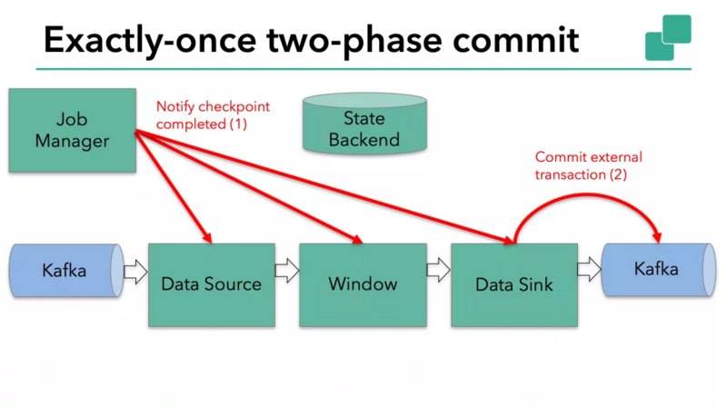

# 1- Flink-kafka-source 源码解析

## 1-1 流程概述

一般在 Flink 中创建 kafka source 的代码如下：

```java
StreamExecutionEnvironment env = StreamExecutionEnvironment.getExecutionEnvironment();
//KafkaEventSchema为自定义的数据字段解析类
env.addSource(new FlinkKafkaConsumer<>("foo", new KafkaEventSchema(), properties)
```

而 Kafka 的 KafkaConsumer API 中消费某个 topic 使用的是 poll 方法如下：

```
KafkaConsumer<String, String> consumer = new KafkaConsumer<>(props);
consumer.poll(Duration.ofMillis(100));
```

下面将分析这两个流程是如何衔接起来的。

### 1-1-1 初始化

初始化执行 env.addSource 的时候会创建 StreamSource 对象，即 final StreamSource<OUT, ?> sourceOperator = new StreamSource<>(function);这里的function 就是传入的 FlinkKafkaConsumer 对象，StreamSource 构造函数中将这个对象传给父类 AbstractUdfStreamOperator 的 userFunction 变量，源码如下：

**■ StreamSource.java**

```
public StreamSource(SRC sourceFunction) {
    super(sourceFunction);
    this.chainingStrategy = ChainingStrategy.HEAD;
}
```

**■ AbstractUdfStreamOperator.java**

```
public AbstractUdfStreamOperator(F userFunction) {
   this.userFunction = requireNonNull(userFunction);
   checkUdfCheckpointingPreconditions();
}
```

### 1-1-2 Task运行

task 启动后会调用到 SourceStreamTask 中的 performDefaultAction() 方法，这里面会启动一个线程 sourceThread.start();，部分源码如下：

```
private final LegacySourceFunctionThread sourceThread;

@Override
protected void performDefaultAction(ActionContext context) throws Exception {
    sourceThread.start();
}
```

在 LegacySourceFunctionThread 的 run 方法中，通过调用 headOperator.run 方法，最终调用了 StreamSource 中的 run 方法，部分源码如下：

```
public void run(final Object lockingObject,
                final StreamStatusMaintainer streamStatusMaintainer,
                final Output<StreamRecord<OUT>> collector,
                final OperatorChain<?, ?> operatorChain) throws Exception {

  //省略部分代码
  this.ctx = StreamSourceContexts.getSourceContext(
    timeCharacteristic,
    getProcessingTimeService(),
    lockingObject,
    streamStatusMaintainer,
    collector,
    watermarkInterval,
    -1);

  try {
    userFunction.run(ctx);
    //省略部分代码
  } finally {
    // make sure that the context is closed in any case
    ctx.close();
    if (latencyEmitter != null) {
      latencyEmitter.close();
    }
  }
}
```

这里最重要的就是 userFunction.run(ctx);，这个 userFunction 就是在上面初始化的时候传入的 FlinkKafkaConsumer 对象，也就是说这里实际调用了 FlinkKafkaConsumer 中的 run 方法，而具体的方法实现在其父类 FlinkKafkaConsumerBase中，至此，进入了真正的 kafka 消费阶段。

### 1-1-3 Kafka消费阶段

在 FlinkKafkaConsumerBase#run 中创建了一个 KafkaFetcher 对象，并最终调用了 kafkaFetcher.runFetchLoop()，这个方法的代码片段如下：

```
/** The thread that runs the actual KafkaConsumer and hand the record batches to this fetcher. */
private final KafkaConsumerThread consumerThread;

@Override
public void runFetchLoop() throws Exception {
  try {
    final Handover handover = this.handover;

    // kick off the actual Kafka consumer
    consumerThread.start();
    
    //省略部分代码
}
```

可以看到实际启动了一个 KafkaConsumerThread 线程。进入到 KafkaConsumerThread#run 中，下面只是列出了这个方法的部分源码，完整代码请参考 KafkaConsumerThread.java。

```
@Override
public void run() {
  // early exit check
  if (!running) {
    return;
  }
  // This method initializes the KafkaConsumer and guarantees it is torn down properly.
  // This is important, because the consumer has multi-threading issues,
  // including concurrent 'close()' calls.
  try {
    this.consumer = getConsumer(kafkaProperties);
  } catch (Throwable t) {
    handover.reportError(t);
    return;
  }
  try {

    // main fetch loop
    while (running) {
      try {
        if (records == null) {
          try {
            records = consumer.poll(pollTimeout);
          } catch (WakeupException we) {
            continue;
          }
        }
      }
      // end main fetch loop
    }
  } catch (Throwable t) {
    handover.reportError(t);
  } finally {
    handover.close();
    try {
      consumer.close();
    } catch (Throwable t) {
      log.warn("Error while closing Kafka consumer", t);
    }
  }
}
```

至此，终于走到了真正从 kafka 拿数据的代码，即 records = consumer.poll(pollTimeout);。因为 KafkaConsumer 不是线程安全的，所以每个线程都需要生成独立的 KafkaConsumer 对象，即 this.consumer = getConsumer(kafkaProperties);。

```
KafkaConsumer<byte[], byte[]> getConsumer(Properties kafkaProperties) {
  return new KafkaConsumer<>(kafkaProperties);
}
```

> **小结：**本节只是介绍了 Flink 消费 kafka 数据的关键流程，下面会更详细的介绍在AT_LEAST_ONCE和EXACTLY_ONCE 不同场景下 FlinkKafkaConsumer 管理 offset 的流程。

## 1-2 非 checkpoint 模式 offset 的提交

消费 kafka topic 最为重要的部分就是对 offset 的管理，对于 kafka 提交 offset 的机制，可以参考 kafka 官方网。

而在 flink kafka source 中 offset 的提交模式有3种：

```
public enum OffsetCommitMode {

   /** Completely disable offset committing. */
   DISABLED,

   /** Commit offsets back to Kafka only when checkpoints are completed. */
   ON_CHECKPOINTS,

   /** Commit offsets periodically back to Kafka, using the auto commit functionality of internal Kafka clients. */
   KAFKA_PERIODIC;
}
```

### 1-2-1 初始化 offsetCommitMode

在 FlinkKafkaConsumerBase#open 方法中初始化 offsetCommitMode:

```
// determine the offset commit mode
this.offsetCommitMode = OffsetCommitModes.fromConfiguration(
                getIsAutoCommitEnabled(),
                enableCommitOnCheckpoints,
        ((StreamingRuntimeContext)getRuntimeContext()).isCheckpointingEnabled());
```

- 方法 getIsAutoCommitEnabled() 的实现如下：

```
protected boolean getIsAutoCommitEnabled() {
   return getBoolean(properties, ConsumerConfig.ENABLE_AUTO_COMMIT_CONFIG, true) &&
      PropertiesUtil.getLong(properties, ConsumerConfig.AUTO_COMMIT_INTERVAL_MS_CONFIG, 5000) > 0;
}
```

- 也就是说只有 enable.auto.commit=true 并且 auto.commit.interval.ms>0 这个方法才会返回 true
- 变量 enableCommitOnCheckpoints 默认是 true，可以调用 setCommitOffsetsOnCheckpoints 改变这个值
- 当代码中调用了 env.enableCheckpointing 方法，isCheckpointingEnabled 才会返回 true

通过下面的代码返回真正的提交模式：

```
/**
 * Determine the offset commit mode using several configuration values.
 *
 * @param enableAutoCommit whether or not auto committing is enabled in the provided Kafka properties.
 * @param enableCommitOnCheckpoint whether or not committing on checkpoints is enabled.
 * @param enableCheckpointing whether or not checkpoint is enabled for the consumer.
 *
 * @return the offset commit mode to use, based on the configuration values.
 */
public static OffsetCommitMode fromConfiguration(
      boolean enableAutoCommit,
      boolean enableCommitOnCheckpoint,
      boolean enableCheckpointing) {

   if (enableCheckpointing) {
      // if checkpointing is enabled, the mode depends only on whether committing on checkpoints is enabled
      return (enableCommitOnCheckpoint) ? OffsetCommitMode.ON_CHECKPOINTS : OffsetCommitMode.DISABLED;
   } else {
      // else, the mode depends only on whether auto committing is enabled in the provided Kafka properties
      return (enableAutoCommit) ? OffsetCommitMode.KAFKA_PERIODIC : OffsetCommitMode.DISABLED;
   }
}
```

暂时不考虑 checkpoint 的场景，所以只考虑 (enableAutoCommit) ? OffsetCommitMode.KAFKA_PERIODIC : OffsetCommitMode.DISABLED;。

也就是如果客户端设置了 enable.auto.commit=true 那么就是 KAFKA_PERIODIC，否则就是 KAFKA_DISABLED。

### 1-2-2 offset 的提交

**■ 自动提交**

这种方式完全依靠 kafka 自身的特性进行提交，如下方式指定参数即可：

```
Properties properties = new Properties();properties.put("enable.auto.commit", "true");properties.setProperty("auto.commit.interval.ms", "1000");new FlinkKafkaConsumer<>("foo", new KafkaEventSchema(), properties)
```

**■ 非自动提交**

通过上面的分析，如果 enable.auto.commit=false，那么 offsetCommitMode 就是 DISABLED 。

kafka 官方文档中，提到当 enable.auto.commit=false 时候需要手动提交 offset，也就是需要调用 consumer.commitSync(); 方法提交。

但是在 flink 中，非 checkpoint 模式下，不会调用 consumer.commitSync();， 一旦关闭自动提交，意味着 kafka 不知道当前的 consumer group 每次消费到了哪。

可以从两方面证实这个问题：

- 源码

KafkaConsumerThread#run 方法中是有 consumer.commitSync();，但是只有当 commitOffsetsAndCallback != null 的时候才会调用。只有开启了checkpoint 功能才会不为 null，这个变量会在后续的文章中详细分析。

- 测试

可以通过消费 __consumer_offsets 观察是否有 offset 的提交
重启程序，还是会重复消费之前消费过的数据

> **小结：**本节介绍了在非 checkpoint 模式下，Flink kafka source 提交 offset 的方式，下文会重点介绍 checkpoint 模式下提交 offset 的流程。

## 1-3 checkpoint 模式下 offset 的提交

上面介绍了在没有开启 checkpoint 的时候，offset 的提交方式，下面将重点介绍开启 checkpoint 后，Flink kafka consumer 提交 offset 的方式。

### 1-3-1 初始化 offsetCommitMode

通过上文可以知道，当调用了 env.enableCheckpointing 方法后 offsetCommitMode 的值就是 ON_CHECKPOINTS，而且会通过下面方法强制关闭 kafka 自动提交功能，这个值很重要，后续很多地方都是根据这个值去判断如何操作的。

```
/**
 * Make sure that auto commit is disabled when our offset commit mode is ON_CHECKPOINTS.
 * This overwrites whatever setting the user configured in the properties.
 * @param properties - Kafka configuration properties to be adjusted
 * @param offsetCommitMode offset commit mode
 */
static void adjustAutoCommitConfig(Properties properties, OffsetCommitMode offsetCommitMode) {
   if (offsetCommitMode == OffsetCommitMode.ON_CHECKPOINTS || offsetCommitMode == OffsetCommitMode.DISABLED) {
      properties.setProperty(ConsumerConfig.ENABLE_AUTO_COMMIT_CONFIG, "false");
   }
}
```

### 1-3-2 保存 offset

在做 checkpoint 的时候会调用 FlinkKafkaConsumerBase#snapshotState 方法，其中 pendingOffsetsToCommit 会保存要提交的 offset。

```
if (offsetCommitMode == OffsetCommitMode.ON_CHECKPOINTS) {
   // the map cannot be asynchronously updated, because only one checkpoint call can happen
   // on this function at a time: either snapshotState() or notifyCheckpointComplete()
   pendingOffsetsToCommit.put(context.getCheckpointId(), currentOffsets);
}
```

同时，下面的变量会作为 checkpoint 的一部分保存下来，以便恢复时使用。

```
/** Accessor for state in the operator state backend. */private transient ListState<Tuple2<KafkaTopicPartition, Long>> unionOffsetStates;在 snapshotState 方法中会同时保存 offset：for (Map.Entry<KafkaTopicPartition, Long> subscribedPartition : subscribedPartitionsToStartOffsets.entrySet()) {    unionOffsetStates.add(Tuple2.of(subscribedPartition.getKey(), subscribedPartition.getValue()));}
```

### 1-3-3 提交 offset

在 checkpoint 完成以后，task 会调用 notifyCheckpointComplete 方法，里面判断 offsetCommitMode == OffsetCommitMode.ON_CHECKPOINTS 的时候，调用fetcher.commitInternalOffsetsToKafka(offsets, offsetCommitCallback); 方法，最终会将要提交的 offset 通过 KafkaFetcher#doCommitInternalOffsetsToKafka 方法中的 consumerThread.setOffsetsToCommit(offsetsToCommit, commitCallback); 保存到 KafkaConsumerThread.java 中的 nextOffsetsToCommit 成员变量里面。

这样就会保证当有需要提交的 offset 的时候，下面代码会执行 consumer.commitAsync，从而完成了手动提交 offset 到 kafka。

```
final Tuple2<Map<TopicPartition, OffsetAndMetadata>, KafkaCommitCallback> commitOffsetsAndCallback = nextOffsetsToCommit.getAndSet(null);

if (commitOffsetsAndCallback != null) {
  log.debug("Sending async offset commit request to Kafka broker");

  // also record that a commit is already in progress
  // the order here matters! first set the flag, then send the commit command.
  commitInProgress = true;
  consumer.commitAsync(commitOffsetsAndCallback.f0, new CommitCallback(commitOffsetsAndCallback.f1));
}
```

> **小结：**本节介绍了在 checkpoint 模式下，Flink kafka source 提交 offset 的方式，后续会介绍 consumer 读取 offset 的流程。

## 1-4 指定 offset 消费

### 1-4-1 消费模式

在 Flink 的 kafka source 中有以下5种模式指定 offset 消费：

```
public enum StartupMode {

   /** Start from committed offsets in ZK / Kafka brokers of a specific consumer group (default). */
   GROUP_OFFSETS(KafkaTopicPartitionStateSentinel.GROUP_OFFSET),

   /** Start from the earliest offset possible. */
   EARLIEST(KafkaTopicPartitionStateSentinel.EARLIEST_OFFSET),

   /** Start from the latest offset. */
   LATEST(KafkaTopicPartitionStateSentinel.LATEST_OFFSET),

   /**
    * Start from user-supplied timestamp for each partition.
    * Since this mode will have specific offsets to start with, we do not need a sentinel value;
    * using Long.MIN_VALUE as a placeholder.
    */
   TIMESTAMP(Long.MIN_VALUE),

   /**
    * Start from user-supplied specific offsets for each partition.
    * Since this mode will have specific offsets to start with, we do not need a sentinel value;
    * using Long.MIN_VALUE as a placeholder.
    */
   SPECIFIC_OFFSETS(Long.MIN_VALUE);
}
```

默认为 GROUP_OFFSETS，表示根据上一次 group id 提交的 offset 位置开始消费。每个枚举的值其实是一个 long 型的负数，根据不同的模式，在每个 partition 初始化的时候会默认将 offset 设置为这个负数。其他的方式和 kafka 本身的语义类似，就不在赘述。


### 1-4-2 指定 offset

此处只讨论默认的 GROUP_OFFSETS 方式，下文所有分析都是基于这种模式。但是还是需要区分是否开启了 checkpoint。在开始分析之前需要对几个重要的变量进行说明：

- subscribedPartitionsToStartOffsets
  - 所属类：FlinkKafkaConsumerBase.java
  - 定义：

```
/** The set of topic partitions that the source will read, with their initial offsets to start reading from. */
private Map<KafkaTopicPartition, Long> subscribedPartitionsToSt
```

说明：保存订阅 topic 的所有 partition 以及初始消费的 offset。

- subscribedPartitionStates
  - 所属类：AbstractFetcher.java
  - 定义：

```
/** All partitions (and their state) that this fetcher is subscribed to. */
private final List<KafkaTopicPartitionState<KPH>> subscribedPar
```

说明：保存了所有订阅的 partition 的 offset 等详细信息，例如：

```
/** The offset within the Kafka partition that we already processed. */
private volatile long offset;
/** The offset of the Kafka partition that has been committed. */
private volatile long committedOffset;
```

每次消费完数据之后都会更新这些值，这个变量非常的重要，在做 checkpoint 的时候，保存的 offset 等信息都是来自于这个变量。这个变量的初始化如下：

```
// initialize subscribed partition states with seed partitions
this.subscribedPartitionStates = createPartitionStateHolders(
  seedPartitionsWithInitialOffsets,
  timestampWatermarkMode,
  watermarksPeriodic,
  watermarksPunctuated,
  userCodeClassLoader);
```

消费之后更新相应的 offset 主要在 KafkaFetcher#runFetchLoop
方法 while 循环中调用 emitRecord(value, partition, record.
offset(), record);。

- restoredState
  - 所属类：FlinkKafkaConsumerBase.java
  - 定义：

```
/**     * The offsets to restore to, if the consumer restores state from a checkpoint.     *     * <p>This map will be populated by the {@link #initializeState(FunctionInitializationContext)} method.     *     * <p>Using a sorted map as the ordering is important when using restored state     * to seed the partition discoverer.     */private transient volatile TreeMap<KafkaTopicPartition, Long> restoredState;
```

说明：如果指定了恢复的 checkpoint 路径，启动时候将会读取这个变量里面的内容获取起始 offset，而不再是使用 StartupMode 中的枚举值作为初始的 offset。

- unionOffsetStates
  - 所属类：FlinkKafkaConsumerBase.java
  - 定义：

```
/** Accessor for state in the operator state backend. */private transient ListState<Tuple2<KafkaTopicPartition, Long>> unionOffsetStates;
```

说明：保存了 checkpoint 要持久化存储的内容，例如每个 partition 已经消费的 offset 等信息

**■ 非 checkpoint 模式**

在没有开启 checkpoint 的时候，消费 kafka 中的数据，其实就是完全依靠 kafka 自身的机制进行消费。

**■ checkpoint 模式**

开启 checkpoint 模式以后，会将 offset 等信息持久化存储以便恢复时使用。但是作业重启以后如果由于某种原因读不到 checkpoint 的结果，例如 checkpoint 文件丢失或者没有指定恢复路径等。

- 第一种情况，如果读取不到 checkpoint 的内容

subscribedPartitionsToStartOffsets 会初始化所有 partition 的起始 offset为 -915623761773L 这个值就表示了当前为 GROUP_OFFSETS 模式。

```
default:
   for (KafkaTopicPartition seedPartition : allPartitions) {
      subscribedPartitionsToStartOffsets.put(seedPartition, startupMode.getStateSentinel());
   }
```

第一次消费之前，指定读取 offset 位置的关键方法是 KafkaConsumerThread#reassignPartitions 代码片段如下：

```
for (KafkaTopicPartitionState<TopicPartition> newPartitionState : newPartitions) {
  if (newPartitionState.getOffset() == KafkaTopicPartitionStateSentinel.EARLIEST_OFFSET) {
    consumerTmp.seekToBeginning(Collections.singletonList(newPartitionState.getKafkaPartitionHandle()));
    newPartitionState.setOffset(consumerTmp.position(newPartitionState.getKafkaPartitionHandle()) - 1);
  } else if (newPartitionState.getOffset() == KafkaTopicPartitionStateSentinel.LATEST_OFFSET) {
    consumerTmp.seekToEnd(Collections.singletonList(newPartitionState.getKafkaPartitionHandle()));
    newPartitionState.setOffset(consumerTmp.position(newPartitionState.getKafkaPartitionHandle()) - 1);
  } else if (newPartitionState.getOffset() == KafkaTopicPartitionStateSentinel.GROUP_OFFSET) {
    // the KafkaConsumer by default will automatically seek the consumer position
    // to the committed group offset, so we do not need to do it.
    newPartitionState.setOffset(consumerTmp.position(newPartitionState.getKafkaPartitionHandle()) - 1);
  } else {
    consumerTmp.seek(newPartitionState.getKafkaPartitionHandle(), newPartitionState.getOffset() + 1);
  }
}
```

因为是 GROUP_OFFSET 模式 ，所以会调用 newPartitionState.setOffset(consumerTmp.position(newPartitionState.getKafkaPartitionHandle()) - 1); 需要说明的是，在 state 里面需要存储的是成功消费的最后一条数据的 offset，但是通过 position 这个方法返回的是下一次应该消费的起始 offset，所以需要减1。这里更新这个的目的是为了 checkpoint 的时候可以正确的拿到 offset。

这种情况由于读取不到上次 checkpoint 的结果，所以依旧是依靠 kafka 自身的机制，即根据__consumer_offsets 记录的内容消费。

- 第二种情况，checkpoint 可以读取到

这种情况下， subscribedPartitionsToStartOffsets 初始的 offset 就是具体从checkpoint 中恢复的内容，这样 KafkaConsumerThread#reassignPartitions 实际走的分支就是：

```
consumerTmp.seek(newPartitionState.getKafkaPartitionHandle(), newPartitionState.getOffset() + 1);
```

这里加1的原理同上，state 保存的是最后一次成功消费数据的 offset，所以加1才是现在需要开始消费的 offset。

> **小结：**本节介绍了程序启动时，如何确定从哪个 offset 开始消费，下文会继续分析 flink kafka sink 的相关源码。

# 2- Flink-kafka-sink 源码解析

## 2-1 初始化

通常添加一个 kafka sink 的代码如下：

```
input.addSink(
   new FlinkKafkaProducer<>(
      "bar",
      new KafkaSerializationSchemaImpl(),
         properties,
      FlinkKafkaProducer.Semantic.AT_LEAST_ONCE)).name("Example Sink");
```

初始化执行 env.addSink 的时候会创建 StreamSink 对象，即 StreamSink<T> sinkOperator = new StreamSink<>(clean(sinkFunction));这里的 sinkFunction 就是传入的 FlinkKafkaProducer 对象，StreamSink 构造函数中将这个对象传给父类 AbstractUdfStreamOperator 的 userFunction 变量，源码如下：

**■ StreamSink.java**

```
public StreamSink(SinkFunction<IN> sinkFunction) {
  super(sinkFunction);
  chainingStrategy = ChainingStrategy.ALWAYS;
}
```

**■ AbstractUdfStreamOperator.java**

```
public AbstractUdfStreamOperator(F userFunction) {
   this.userFunction = requireNonNull(userFunction);
   checkUdfCheckpointingPreconditions();
}
```

## 2-2 Task 运行

StreamSink 会调用下面的方法发送数据：

```
@Override
public void processElement(StreamRecord<IN> element) throws Exception {
   sinkContext.element = element;
   userFunction.invoke(element.getValue(), sinkContext);
}
```

也就是实际调用的是 FlinkKafkaProducer#invoke 方法。在 FlinkKafkaProducer 的构造函数中需要指 FlinkKafkaProducer.Semantic，即：

```
public enum Semantic {   EXACTLY_ONCE,   AT_LEAST_ONCE,   NONE}
```

下面就基于3种语义分别说一下总体的向 kafka 发送数据的流程。

**■ Semantic.NONE**

这种方式不会做任何额外的操作，完全依靠 kafka producer 自身的特性，也就是FlinkKafkaProducer#invoke 里面发送数据之后，Flink 不会再考虑 kafka 是否已经正确的收到数据。

```
transaction.producer.send(record, callback);
```

**■ Semantic.AT_LEAST_ONCE**

这种语义下，除了会走上面说到的发送数据的流程外，如果开启了 checkpoint 功能，在 FlinkKafkaProducer#snapshotState 中会首先执行父类的 snapshotState方法，里面最终会执行 FlinkKafkaProducer#preCommit。

```
@Overrideprotected void preCommit(FlinkKafkaProducer.KafkaTransactionState transaction) throws FlinkKafkaException {   switch (semantic) {      case EXACTLY_ONCE:      case AT_LEAST_ONCE:         flush(transaction);         break;      case NONE:         break;      default:         throw new UnsupportedOperationException("Not implemented semantic");   }   checkErroneous();}
```

AT_LEAST_ONCE 会执行了 flush 方法，里面执行了：

```
transaction.producer.flush();
```

就是将 send 的数据立即发送给 kafka 服务端，详细含义可以参考 KafkaProducer api：
[http://kafka.apache.org/23/ja...](http://kafka.apache.org/23/javadoc/index.html?org/apache/kafka/clients/producer/KafkaProducer.html)

> flush() 
> Invoking this method makes all buffered records immediately available to send (even if linger.ms is greater than 0) and blocks on the completion of the requests associated with these records.

**■ Semantic.EXACTLY_ONCE**

EXACTLY_ONCE 语义也会执行 send 和 flush 方法，但是同时会开启 kafka producer 的事务机制。FlinkKafkaProducer 中 beginTransaction 的源码如下，可以看到只有是 EXACTLY_ONCE 模式才会真正开始一个事务。

```
@Override
protected FlinkKafkaProducer.KafkaTransactionState beginTransaction() throws FlinkKafkaException {
   switch (semantic) {
      case EXACTLY_ONCE:
         FlinkKafkaInternalProducer<byte[], byte[]> producer = createTransactionalProducer();
         producer.beginTransaction();
         return new FlinkKafkaProducer.KafkaTransactionState(producer.getTransactionalId(), producer);
      case AT_LEAST_ONCE:
      case NONE:
         // Do not create new producer on each beginTransaction() if it is not necessary
         final FlinkKafkaProducer.KafkaTransactionState currentTransaction = currentTransaction();
         if (currentTransaction != null && currentTransaction.producer != null) {
            return new FlinkKafkaProducer.KafkaTransactionState(currentTransaction.producer);
         }
         return new FlinkKafkaProducer.KafkaTransactionState(initNonTransactionalProducer(true));
      default:
         throw new UnsupportedOperationException("Not implemented semantic");
   }
}
```

和 AT_LEAST_ONCE 另一个不同的地方在于 checkpoint 的时候，会将事务相关信息保存到变量 nextTransactionalIdHintState 中，这个变量存储的信息会作为 checkpoint 中的一部分进行持久化。


```
if (getRuntimeContext().getIndexOfThisSubtask() == 0 && semantic == FlinkKafkaProducer.Semantic.EXACTLY_ONCE) {
   checkState(nextTransactionalIdHint != null, "nextTransactionalIdHint must be set for EXACTLY_ONCE");
   long nextFreeTransactionalId = nextTransactionalIdHint.nextFreeTransactionalId;

   // If we scaled up, some (unknown) subtask must have created new transactional ids from scratch. In that
   // case we adjust nextFreeTransactionalId by the range of transactionalIds that could be used for this
   // scaling up.
   if (getRuntimeContext().getNumberOfParallelSubtasks() > nextTransactionalIdHint.lastParallelism) {
      nextFreeTransactionalId += getRuntimeContext().getNumberOfParallelSubtasks() * kafkaProducersPoolSize;
   }

   nextTransactionalIdHintState.add(new FlinkKafkaProducer.NextTransactionalIdHint(
      getRuntimeContext().getNumberOfParallelSubtasks(),
      nextFreeTransactionalId));
}
```


# 3- Flink-Kafka-Exactly-Once 


[Apache Flink](https://yq.aliyun.com/go/articleRenderRedirect?url=zh.ververica.com) 自2017年12月发布的1.4.0版本开始，为流计算引入了一个重要的里程碑特性：TwoPhaseCommitSinkFunction（相关的Jira）。它提取了两阶段提交协议的通用逻辑，使得通过Flink来构建端到端的Exactly-Once程序成为可能。同时支持一些数据源（source）和输出端（sink），包括Apache Kafka 0.11及更高版本。它提供了一个抽象层，用户只需要实现少数方法就能实现端到端的Exactly-Once语义。

有关TwoPhaseCommitSinkFunction的使用详见文档: TwoPhaseCommitSinkFunction。或者可以直接阅读Kafka 0.11 sink的文档: kafka。https://flink.apache.org/features/2018/03/01/end-to-end-exactly-once-apache-flink.html

接下来会详细分析这个新功能以及Flink的实现逻辑，分为如下几点。

- 描述[Flink checkpoint机制](https://yq.aliyun.com/go/articleRenderRedirect?url=https://zh.ververica.com/developers/flink-training-course2/)是如何保证Flink程序结果的Exactly-Once的
- 显示Flink如何通过两阶段提交协议与数据源和数据输出端交互，以提供端到端的Exactly-Once保证
- 通过一个简单的示例，了解如何使用TwoPhaseCommitSinkFunction实现Exactly-Once的文件输出

## 3-1 Apache Flink应用程序中的Exactly-Once语义

当我们说『[Exactly-Once](https://yq.aliyun.com/go/articleRenderRedirect?url=https://zh.ververica.com/developers-resources/)』时，指的是每个输入的事件只影响最终结果一次。即使机器或软件出现故障，既没有重复数据，也不会丢数据。

Flink很久之前就提供了Exactly-Once语义。在过去几年中，我们对Flink的checkpoint机制有过深入的描述，这是Flink有能力提供Exactly-Once语义的核心。Flink文档还提供了该功能的全面概述。

在继续之前，先看下对checkpoint机制的简要介绍，这对理解后面的主题至关重要。

- 次checkpoint是以下内容的一致性快照：
- 应用程序的当前状态
- 输入流的位置

Flink可以配置一个固定的时间点，定期产生checkpoint，将checkpoint的数据写入持久存储系统，例如S3或HDFS。将checkpoint数据写入持久存储是异步发生的，这意味着Flink应用程序在checkpoint过程中可以继续处理数据。

如果发生机器或软件故障，重新启动后，Flink应用程序将从最新的checkpoint点恢复处理； Flink会恢复应用程序状态，将输入流回滚到上次checkpoint保存的位置，然后重新开始运行。这意味着Flink可以像从未发生过故障一样计算结果。

在Flink 1.4.0之前，Exactly-Once语义仅限于Flink应用程序内部，并没有扩展到Flink数据处理完后发送的大多数外部系统。Flink应用程序与各种数据输出端进行交互，开发人员需要有能力自己维护组件的上下文来保证Exactly-Once语义。

为了提供端到端的Exactly-Once语义 – 也就是说，除了Flink应用程序内部，Flink写入的外部系统也需要能满足Exactly-Once语义 – 这些外部系统必须提供提交或回滚的方法，然后通过Flink的checkpoint机制来协调。

分布式系统中，协调提交和回滚的常用方法是两阶段提交协议。在下一节中，我们将讨论Flink的TwoPhaseCommitSinkFunction是如何利用两阶段提交协议来提供端到端的Exactly-Once语义。

## 3-2 Flink应用程序端到端的Exactly-Once语义

我们将介绍两阶段提交协议，以及它如何在一个读写[Kafka的Flink程序](https://yq.aliyun.com/go/articleRenderRedirect?url=https://zh.ververica.com/developers/exactly-once/)中实现端到端的Exactly-Once语义。Kafka是一个流行的消息中间件，经常与Flink一起使用。Kafka在最近的0.11版本中添加了对事务的支持。这意味着现在通过Flink读写Kafaka，并提供端到端的Exactly-Once语义有了必要的支持。

Flink对端到端的Exactly-Once语义的支持不仅局限于Kafka，您可以将它与任何一个提供了必要的协调机制的源/输出端一起使用。例如Pravega，来自DELL/EMC的开源流媒体存储系统，通过Flink的TwoPhaseCommitSinkFunction也能支持端到端的Exactly-Once语义。


在今天讨论的这个示例程序中，我们有：

- 从Kafka读取的数据源（Flink内置的KafkaConsumer）
- 窗口聚合
- 将数据写回Kafka的数据输出端（Flink内置的KafkaProducer）

要使数据输出端提供Exactly-Once保证，它必须将所有数据通过一个事务提交给Kafka。提交捆绑了两个checkpoint之间的所有要写入的数据。这可确保在发生故障时能回滚写入的数据。但是在分布式系统中，通常会有多个并发运行的写入任务的，简单的提交或回滚是不够的，因为所有组件必须在提交或回滚时“一致”才能确保一致的结果。Flink使用两阶段提交协议及预提交阶段来解决这个问题。

在[checkpoint](https://yq.aliyun.com/go/articleRenderRedirect?url=https://zh.ververica.com/developers-resources/)开始的时候，即两阶段提交协议的“预提交”阶段。当checkpoint开始时，Flink的JobManager会将checkpoint barrier（将数据流中的记录分为进入当前checkpoint与进入下一个checkpoint）注入数据流。

brarrier在operator之间传递。对于每一个operator，它触发operator的状态快照写入到state backend。


数据源保存了消费Kafka的偏移量(offset)，之后将checkpoint barrier传递给下一个operator。

这种方式仅适用于operator具有『内部』状态。所谓内部状态，是指Flink state backend保存和管理的 -例如，第二个operator中window聚合算出来的sum值。当一个进程有它的内部状态的时候，除了在checkpoint之前需要将数据变更写入到state backend，不需要在预提交阶段执行任何其他操作。Flink负责在checkpoint成功的情况下正确提交这些写入，或者在出现故障时中止这些写入。


## 3-3 示例Flink应用程序启动预提交阶段

但是，当进程具有『外部』状态时，需要作些额外的处理。外部状态通常以写入外部系统（如Kafka）的形式出现。在这种情况下，为了提供Exactly-Once保证，外部系统必须支持事务，这样才能和两阶段提交协议集成。

在本文示例中的数据需要写入Kafka，因此数据输出端（Data Sink）有外部状态。在这种情况下，在预提交阶段，除了将其状态写入state backend之外，数据输出端还必须预先提交其外部事务。


当checkpoint barrier在所有operator都传递了一遍，并且触发的checkpoint回调成功完成时，预提交阶段就结束了。所有触发的状态快照都被视为该checkpoint的一部分。checkpoint是整个应用程序状态的快照，包括预先提交的外部状态。如果发生故障，我们可以回滚到上次成功完成快照的时间点。

下一步是通知所有operator，checkpoint已经成功了。这是两阶段提交协议的提交阶段，JobManager为应用程序中的每个operator发出checkpoint已完成的回调。

数据源和 widnow operator没有外部状态，因此在提交阶段，这些operator不必执行任何操作。但是，数据输出端（Data Sink）拥有外部状态，此时应该提交外部事务。



我们对上述知识点总结下：

- 旦所有operator完成预提交，就提交一个commit。
- 如果至少有一个预提交失败，则所有其他提交都将中止，我们将回滚到上一个成功完成的checkpoint。
- 在预提交成功之后，提交的commit需要保证最终成功 – operator和外部系统都需要保障这点。如果commit失败（例如，由于间歇性网络问题），整个Flink应用程序将失败，应用程序将根据用户的重启策略重新启动，还会尝试再提交。这个过程至关重要，因为如果commit最终没有成功，将会导致数据丢失。

因此，我们可以确定所有operator都同意checkpoint的最终结果：所有operator都同意数据已提交，或提交被中止并回滚。


3-4 在Flink中实现两阶段提交Operator

完整的实现两阶段提交协议可能有点复杂，这就是为什么Flink将它的通用逻辑提取到抽象类TwoPhaseCommitSinkFunction中的原因。

接下来基于输出到文件的简单示例，说明如何使用TwoPhaseCommitSinkFunction。用户只需要实现四个函数，就能为数据输出端实现Exactly-Once语义：

- beginTransaction – 在事务开始前，我们在目标文件系统的临时目录中创建一个临时文件。随后，我们可以在处理数据时将数据写入此文件。
- preCommit – 在预提交阶段，我们刷新文件到存储，关闭文件，不再重新写入。我们还将为属于下一个checkpoint的任何后续文件写入启动一个新的事务。
- commit – 在提交阶段，我们将预提交阶段的文件原子地移动到真正的目标目录。需要注意的是，这会增加输出数据可见性的延迟。
- abort – 在中止阶段，我们删除临时文件。

我们知道，如果发生任何故障，Flink会将应用程序的状态恢复到最新的一次checkpoint点。一种极端的情况是，预提交成功了，但在这次commit的通知到达operator之前发生了故障。在这种情况下，Flink会将operator的状态恢复到已经预提交，但尚未真正提交的状态。

我们需要在预提交阶段保存足够多的信息到checkpoint状态中，以便在重启后能正确的中止或提交事务。在这个例子中，这些信息是临时文件和目标目录的路径。

TwoPhaseCommitSinkFunction已经把这种情况考虑在内了，并且在从checkpoint点恢复状态时，会优先发出一个commit。我们需要以幂等方式实现提交，一般来说，这并不难。在这个示例中，我们可以识别出这样的情况：临时文件不在临时目录中，但已经移动到目标目录了。

在TwoPhaseCommitSinkFunction中，还有一些其他边界情况也会考虑在内，请参考Flink文档了解更多信息。


## 3-5 总结

总结下本文涉及的一些要点：

- Flink的checkpoint机制是支持两阶段提交协议并提供端到端的Exactly-Once语义的基础。
- 这个方案的优点是: Flink不像其他一些系统那样，通过网络传输存储数据 – 不需要像大多数批处理程序那样将计算的每个阶段写入磁盘。
- Flink的TwoPhaseCommitSinkFunction提取了两阶段提交协议的通用逻辑，基于此将Flink和支持事务的外部系统结合，构建端到端的Exactly-Once成为可能。
- 从Flink 1.4.0开始，Pravega和Kafka 0.11 producer都提供了Exactly-Once语义；Kafka在0.11版本首次引入了事务，为在Flink程序中使用Kafka producer提供Exactly-Once语义提供了可能性。
- Kafaka 0.11 producer的事务是在TwoPhaseCommitSinkFunction基础上实现的，和at-least-once producer相比只增加了非常低的开销。

这是个令人兴奋的功能，期待Flink TwoPhaseCommitSinkFunction在未来支持更多的数据接收端。