[TOC]


# 1- 简单介绍一下Flink

- Flink 是一个**数据流上的有状态计算框架；**
- 适用于所有的流式场景；
- 能保证**精确一致性 (Exactly-once);**
- 真正基于**事件时间**去处理数据；

# 2 介绍一下Flink的组件

- **部署层**：支持多种部署模式；
  - Local
  - cluster
    - **Standalone**
    - **Flink on yarn**
  - cloud;
- **Core层**；
- **API层**；
  - **DataSet ：批处理；**
  - **DataStream：流处理；**
  - Table API Batch;
  - Table API Streaming;
- **注意： 在Flink 1.12 版本 DataStream已经实现了流批统一；**


# 3-Flink的四大基石

- **window**  + **watermark**
- **time**
- **state**
- **checkpoint**


# 4-Flink 的优点

- ​	**Flink同时支持高吞吐、低延迟、高性能；**
  - Spark 不支持低延迟（批处理）；
  - Storm 不支持搞吞吐；
- 真正的基于**事件时间的流式处理**框架；
- 支持**有状态**计算；
- 支**持窗口**操作；
- 支持**Checkpoint容错机制**；
- **流批统一；** （Flink1.12版本开始实行）
- 极高的课伸缩性；
- 部署灵活，支持多种资源调度器；

# 5- Flink安装部署

## 5-1 Spark

- **Local**
  - **一个JVM进程中通过线程模拟整个Spark的运行环境；**
  - JVM 进程能拿到多少资源，就是整个Spark能使用的资源；
  - Local模式下，使用**Driver线程 、Executor线程**来维持集群环境；
- **Standalone**
  - <span style="color:red;background:white;font-size:20px;font-family:楷体;">**注意： 只有在standalone模式下， 才有master worker  这两个角色**</span>
  - master :  **任务调度 、分配 + 资源调度、分配 + worker管理** ；
  - worker : 计算；
  - **master(管理资源、任务) + worker(计算)**
- **Standalone-HA**
- Spark On Yarn **Client**/**Cluster**
  - **资源管理和分配，无需spark操心，由Yarn集群管理；**
  - **spark只负责计算即可；**
  - **Yarn(资源管理) + Spark(计算)**
  - **Driver进程：任务管理、调度**
  - **Executor进程：计算；**
  - **client 模式：Driver是独立的进程；**
  - **cluster 模式：Driver 和 Appmaster 在一起；**

## 5-2 Flink

- **主： JobManager;**

- **从：TaskManager;**

- Local

  - 

- **Standalone**

  - 

- **Standalone-HA**

  - 

- **Flink On Yarn**

  - 

  - **Session会话模式** ：同时只有**一个**任务执行；

    - 

  - **Per-Job任务分离模式**:同时可以有**多个**任务执行；

    

# 6-为什么大数据任务执行都交给Yarn?

- Mr,Spark,Flink都交给了Yarn;
- 原因：
  - Yarn**成熟稳定**且功能强大；
  - **Yarn做统一的资源管理与调度；**
  - **Yarn支持多种调度策略；**
    - **FIFO; 队列调度器；**
    - **Fair; 公平调度器；** (CDH支持)
    - **capacity;容量调度器；** （apache默认支持）

5-6 Spark/Flink On Yarn 的本质是什么？ 需要单独启动Spark/Flink的Standalone集群么？ 

- **不需要**先单独启动Spark/Flink 的Standalone集群；
- 原因：
  - **Spark/Flink On Yarn 的本质是将Spark/Flink任务的Jar包放到Yarn的Jvm中去执行**；
  - 是在Yarn集群中启动的一些Jvm进程（Spark/Flink的一些角色）


# 7- 角色分工

- **Client**: 提交任务 --- Spark中的Driver

  - 提交任务；

- **JobManager**:管理任务---Spark中的Master

  - 集群的**协调者**；（任务管理+资源管理）
  - 接收**FlinkJob**;
  - **协调检查点**（checkpoint）；
  - **Failover 故障恢复**；
  - **管理从节点**TaskManager;

  

- **TaskManager**:执行任务---Spark中的Worker/Executor

  - TaskManager 中有多个TaskSlot:线程;
  - 是**实际执行计算**的工作者；
  - 管理**自己的资源**；
  - 启动的时候将**资源汇报**给JobManager;


# 8- 执行流程


- **Flink on Yarn 流程介绍：**

1. Client（**客户**） 提交任务（项目）给ResourceManager(**公司**)；
2. ResourceManager（**产品线**） 会指定一个AppMaster（**项目经理**） 去管理这个任务（项目），在一个nodemanager 上启动AppMaster（**项目经理**）；
3. AppMaster（**项目经理**） 会向ResourceManager （**公司**）中的ApplicationManager（**产品线**） 去注册任务；
4. AppMaster（**项目经理**） 会向ResourceManager （**公司**）中的Scheduler（**资源管理部门**）申请资源；
5. Scheduler（**资源管理部门**） 将资源通过Container的方式打包给AppMaster（**项目经理**）；
6. AppMaster（**项目经理**） 启动一个JobManager （**技术总监**）去管理这个任务的具体细节；
7. AppMaster（**项目经理**） 根据资源信息去找到各个TaskManager（**模块负责人**）并开始执行计算任务（工作）；
8. TaskManager（**模块负责人**）启动后向JobManager（**技术总监**）发送**心跳包**（实时沟通）；
9. JobManager（**技术总监**）与AppMaster（**项目经理**）发送心跳包；
10. AppMaster（**项目经理**） 与ApplicationsManager（**产品线**）发送心跳包；


# 9- StreamingDataFlow（DAG）

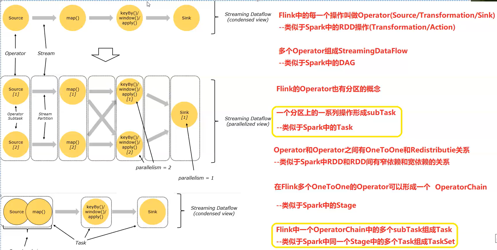


**类似于Spark中的DAG**

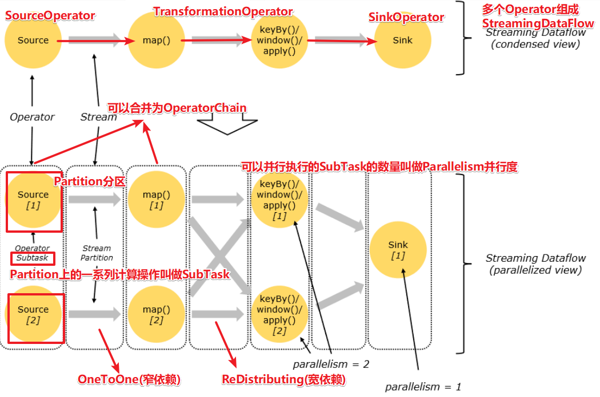


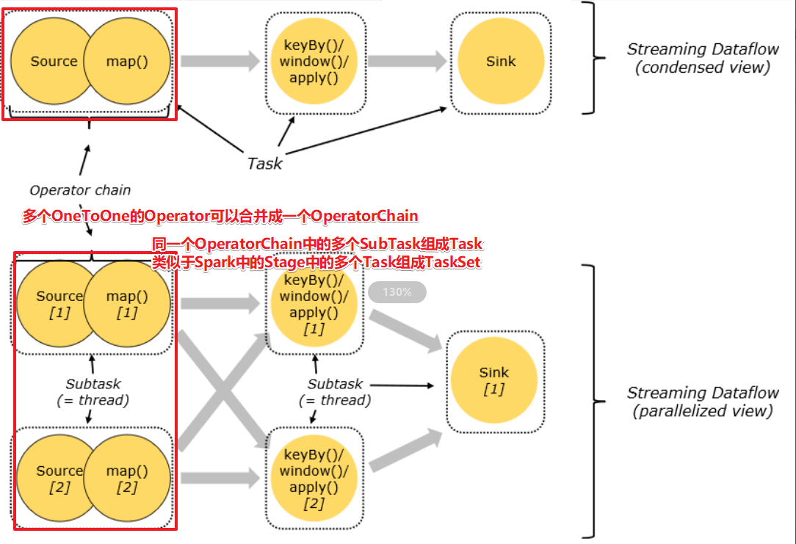


# 10- TaskSlot

- TaskManager 中JVM进程中可以**运行多个线程**，就是TaskSlot;
- **TaskSlot任务槽**：用于运行subTask任务线程的线程槽；
- TaskSlot的数量决定了最多可以同时运行的**线程数量**，也就是**并行度**；

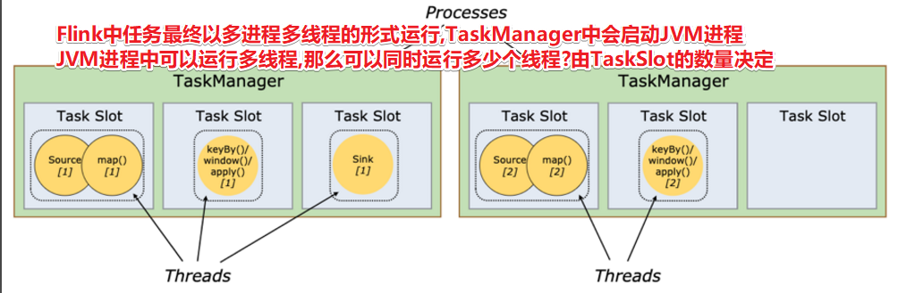


- **TaskSlot 共享**
  - Flink中的TaskSlot可以共享， 也就是[**SlotSharing 机制**]()
  - **原理： 就是map端跑完后，该线程可以接着运行reduce端的任务；**
  - 就是线程复用，这样线程就没有必要回收了。 


# 11- 执行图生成流程


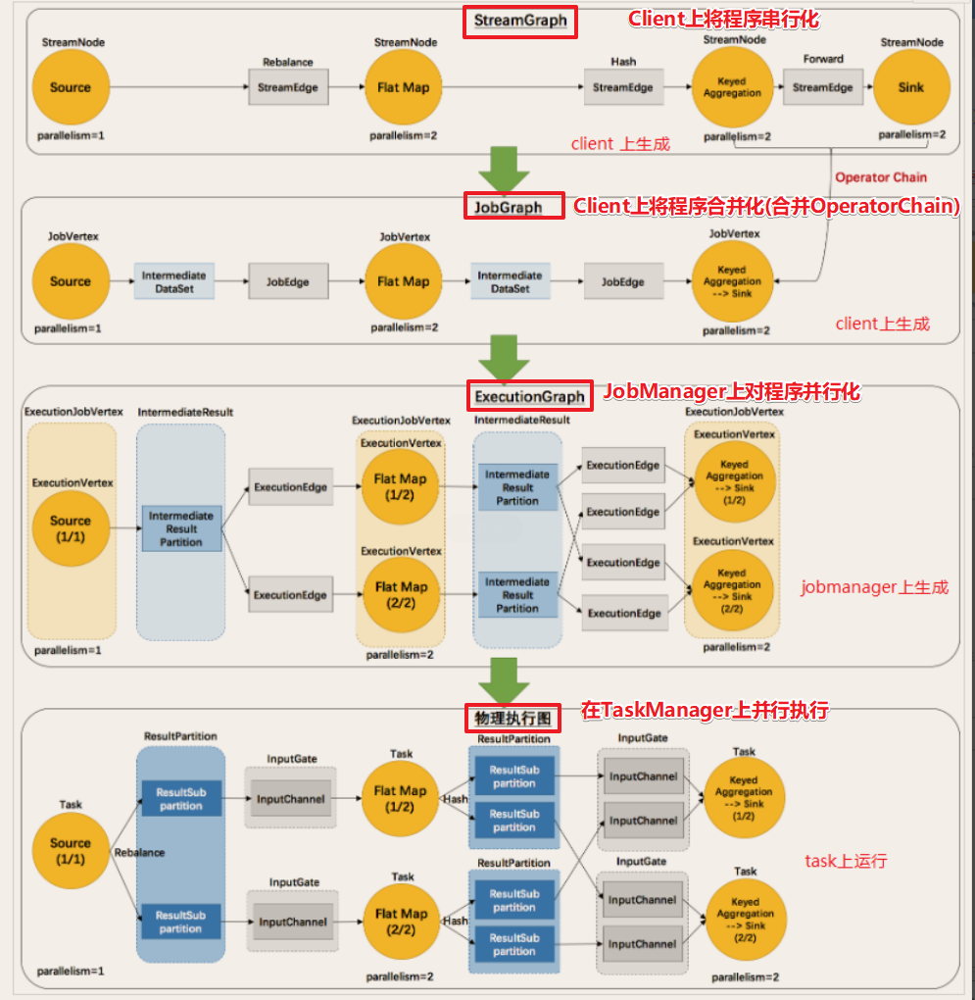


# 12- 总结Spark VS Flink 名词解释


| Flink         | Spark             |                                                   |
| ------------- | ----------------- | ------------------------------------------------- |
| Operator      | RDD               | 弹性分布式数据集                                  |
| DataFlow      | DAG               | 执行流程图                                        |
| OneToOne      | 窄依赖            | 一对一或者多对一传输数据                          |
| Redistribute  | 宽依赖（shuffle） | 一对多的传输数据                                  |
| OperatorChain | Stage             | 根据shuffle依赖划分出来的执行阶段（有多个子任务） |
| SubTask       | Task              | 每个任务(多个操作)                                |
| Task          | TaskSet           | 任务集（同一个Stage中的各个Task组成的集合）       |
| Partition     | Partition         | 分区                                              |
| Parallelism   | Parallelism       | 并行度                                            |

- 注意： 

  - <span style="color:red;background:white;font-size:20px;font-family:楷体;">**OperatorChain 和 Task(Flink) 是从不同的角度，去描述同一个东西；**</span>
  - OperatorChain从operator角度；多个OneToOne的Operator组成OperatorChain。（水平方向）
  - Task从任务的角度；多个subTask 组成Task集（分区，垂直方向）

  - Task 是**动态**的任务；OperatorChain 是**静态**的图；


# 13- Flink如何实现**[低延迟和高吞吐平衡]()**

- <span style="color:red;background:white;font-size:20px;font-family:楷体;">**Flink支持数据来一条处理一条，但是会导致实时性高，但是吞吐量低！ 所以Flink也支持，[缓冲块和超时阈值]()；这样就可以在实时性和吞吐量直接取得平衡。**</span>
- 默认情况下，流中的元素并不会一个一个的在网络中传输，而是缓存起来伺机一起发送(默认为32KB，通过taskmanager.memory.segment-size设置),这样可以避免导致频繁的网络传输,提高吞吐量，但如果数据源输入不够快的话会导致后续的数据处理延迟，所以可以使用env.setBufferTimeout(默认100ms)，来为缓存填入设置一个最大等待时间。等待时间到了之后，即使缓存还未填满，缓存中的数据也会自动发送。 
  timeoutMillis > 0 表示最长等待 timeoutMillis 时间，就会flush;

- **[timeoutMillis = 0 表示每条数据都会触发 flush]()**，直接将数据发送到下游，相当于没有Buffer了(避免设置为0，可能导致性能下降)
- **[timeoutMillis = -1 表示只有等到 buffer满了或 CheckPoint的时候，才会flush]()**。相当于取消了 timeout 策略

- 总结:
  - [Flink以**缓存块** (**默认为32KB**)为单位进行网络数据传输,用户可以设置**缓存块超时时间(默认100ms)和缓存块大小**来控制缓冲块传输时机,从而控制Flink的延迟性和吞吐量]()


# 14- 简单介绍一下Flink的Source

- 预定义source:  一般用于学习测试时编造数据时使用

  - 基于集合
    - 1.env.[fromElements]()(可变参数);
    - 2.env.[fromColletion]()(各种集合);
    - 3.env.[generateSequence]()(开始,结束);
    - 4.env.[fromSequence]()(开始,结束);
  - 基于文件
    - env.[readTextFile]()(本地/HDFS文件/文件夹);//压缩文件也可以
  - 基于socket
    - env.[socketTextStream]()("192.168.88.161", 8888);

- 自定义source:

  - [SourceFunction]():非并行数据源(并行度只能=1)
  - [RichSourceFunction]():多功能非并行数据源(并行度只能=1)	
  - [ParallelSourceFunction]():并行数据源(并行度能够>=1)
  - [RichParallelSourceFunction]():多功能并行数据源(并行度能够>=1)--后续学习的Kafka数据源使用的
  - 例如：自定义MysqlSource 

  ``` java
  public static class MySQLSource  extends RichParallelSourceFunction<Student>{
     // 重写 open , run , cancel,close 方法 
  }
  ```

- 自定义**[kafkaSource]()** （**[使用最多]()**）

  - [FlinkKafkaConsumer]()

  ``` java
  DataStream<String> kfkDS = 
      env.addSource(new FlinkKafkaConsumer<>("flinkTopicRead", new SimpleStringSchema(), properties));
  
  ```

  

# 15- 简单介绍一下Flink 中的Transformation

- 主要分为三大类：

  - 基础的：map,flatMap,filter,sum,reduce,
  - 合并拆分：[union, side Outputs]();
  - 分区：[rebalance]();

- [union]()

  - 可以合并多个**[同类型]()**的流;
  - 返回的结果可以[直接打印]()

- [connect]()

  - 可以连接**[2个不同类型]()**的流；
  - **最后需要处理后再输出** ， 如： map(new CoMapFunction<xxx,yyy,zzz>(){......})

- [Side Outputs]()-侧道输出

- <span style="color:red;background:white;font-size:20px;font-family:楷体;">**分区 [rebalance]() ：可以处理Flink中由于key 导致的数据倾斜；**</span>

- 其它分区算子：

  

# 16- 简单介绍一下Flink中的Sink

- Sink 使用较多的有：[**kafka,mysql,Hbase,Druid**]()；

- **内置Sink**

  - print()
  - [writeAsText]()

  ``` java
  ds.writeAsText("data/output/result").setParallelism(1);//输出到文件
  ds.writeAsText("data/output/result2").setParallelism(2);//输出到文件夹(2个文件)
  ```

- **自定义Sink**

  - [addSink]()(new MySQLSink());

  ``` java
  private static class MySQLSink extends RichSinkFunction<Student>{
      // 重写方法 open close run cancel
  }
  ```

  - [FlinkKafkaProducer]() ： （**Flink中内部实现了**）

  ``` java
  resultDS.addSink(new FlinkKafkaProducer<String>(
      "flinkTopicWrite",
      new SimpleStringSchema(),
      properties2
  ));
  ```


# 17- 简单介绍一下Flink 中的Connector

- **Jdbc**

  - [JdbcSink.sink]()
  - 注意：版本不一样，参数列表都不一样；需要看官网手册；

- **Kafka**

  - **[addSource]()**(new **[FlinkKafkaConsumer]()**<>("flinkTopicRead", new SimpleStringSchema(), properties));

  - resultDS.**[addSink]()**(new **[FlinkKafkaProducer]()**<String>(
        "flinkTopicWrite",
        new SimpleStringSchema(),
        properties2
    ));

- **Redis**

  - [FlinkJedisPoolConfig]();
  - [addSink]()(new [RedisSink]()(conf, new [RedisMapper]()(){..}));

  

# 18- 介绍一下process 和apply的区别？

- process 
  - 用于[**获取上下文context对象**]()；
  - 例如：在[**侧道输出**]()的时候需要使用process;
- apply
  - 用于**[获取窗口信息]()**；
  - 一般与**[窗口配合]()**使用；


# 19- 核心概念/名词

- Client:**[提交任务]()**的客户端
- **[JobManager]()**:[**资源管理/任务调度**]()的进程
- **[TaskManager]()**:负责真正的[**执行任务**]()的进程
- Slot:TaskManager中真正执行任务的**[线程]()**
- Operator:Flink中的每一个计算[**操作/算子/步骤/计算单元**]()    **[RDD]()**
- **[OperatorChain]()**:多个OneToOne的Operator可以合并为一个OperatorChain  **[Stage]()**
- [**OneToOne 和 Redistribute**]()  窄依赖 和宽依赖
- **[StreamingDataFlow:Flink]()**程序中的多个**[Operator串行化]()**之后形成的一条执行流程(**[DAG]()**)
- Partition:每个Operator可以有1个~多个**[分区]()**


- SubTask:**[分区上的一系列操作]()**


- Parallelism:同时运行的/**[并行的SubTask数量]()**
- Task:合并后的OperatorChain中的(或不能合并的Operator中的)**[多个SubTask组成Task]()**
- **[TaskSlot]()**:运行[**SubTask的线程**]()
- [**StreamGraph**]():在Clinet端根据Operator的执行顺序串行化的**[流程图]()**
- **[JobGraph]()**:在Clinet端根据Operator的OneToOne关系,**[合并化之后的OperatroChain流程图]()**
- **[ExecutionGraph]()**:在JobManager上根据并行度设置进行**[并行化之后的流程图]()**
- <font color='red'>物理执行图:在TaskManager上真正执行的流程图</font>


# 20- Flink中的四张图

- **[StreamingDataFlow]()** :Flink程序中的多个**[Operator串行化]()**之后形成的一条执行流程(**[DAG]()**)
- [**StreamGraph**]():在Clinet端根据Operator的执行顺序串行化的**[流程图]()**
- **[JobGraph]()**:在Clinet端根据Operator的OneToOne关系,**[合并化之后的OperatroChain流程图]()**
- [**ExecutionGraph**]():在JobManager上根据**并行度**设置进行**[并行化之后的流程图**
- **[<font color='red'>物理执行图:在TaskManager上真正执行的流程图</font>]()**


# 21- Flink 中Source-Transformation-Sink-Connector 常用API

- 2.Flink-DataStream-API-Source

  - 预定义的File/Dir/Collection/开始结束数字生成器/Socket

  - 自定义的 **[addSource]()**

    

- 3.Flink-DataStream-API-Transformation

  - map/flatMap/filter/reduce/sum...keyBy
  - **union和connect**
    - union:合并**相同类型**的DS;
    - connect可以**[合并不同类型]()**的DS;
  - sideOutput : 侧道输出
  - **[rebalance]()** ： （底层原理：轮询）**可以一定程度上的解决数据倾斜问题**；


- 4.Flink-DataStream-API-Sink
  - print/File
  - 自定义 ： addSink 


- 5.Flink-DataStream-API-Connectors
  - JDBC
  - Kafka
    - Source-**[FlinkKafkaConsumer]()**("主题",反序列化规则,Properties(集群地址))
    - Sink-**[FlinkKafkaProducer]()**("主题",序列化规则,Properties(集群地址))
  - Redis
    - 需要使用第三方工具


# 22- 介绍一下Flink中的窗口

- Spark窗口
  - 基于时间的**滑动窗口**；
  - 基于时间的**滚动窗口**；
- Flink
  - 基于时间的**滑动窗口**；
    - window(**[SlidingProcessingTimeWindows]()**.of(Time.seconds(10), Time.seconds(5)))
  - 基于时间的**滚动窗口**；
    - window(**[TumblingProcessingTimeWindows]()**.of(Time.seconds(5)))
  - 基于数量的**滑动窗口**；
    - **[countWindow]()**(5, 3)
  - 基于数量的**滚动窗口**；
    - **[countWindow]()**(5)
  - 基于**会话窗口**；
    - window(**[ProcessingTimeSessionWindows.withGap]()**(Time.seconds(10)))
    - **[Session会话窗口]()**,需要**[设置一个会话超时时间]()**,如30s,则表示30s内**[没有数据到来,则触发上个窗口的计算]()**

# 23- Flink有关window的算子


# 24- 介绍一下time

- 时间概念
  - **[EventTime]()**:事件时间,是事件/数据真真正正发生时/产生时的时间 --- 用的最多
  - IngestionTime:摄入时间,是事件/数据**到达流处理系统的时间**
  - **[ProcessingTime]()**:处理时间,是事件/数据**被处理/计算时的系统的时间**


- 注意：
  - [**SparkStreaming**]() 只支持 **processing time**;
  - **[Structured Streaming]()** 中只支持processing**处理时间** 和 EventTime **事件时间**
  - **[Flink 中都支持]()**；
  - 但是目前在开发中一般都使用EventTime事件时间；

- 总结:
  - 1.事件时间确实重要, 因为它能够代表事件/数据的**本质**,是事件/数据真真正正发生/产生的时间
  - 2.按照事件时间进去处理/计算,会存在一定的**难度**, 因为数据可能会因为网路延迟等原因, 发生**乱序或延迟**到达, 那么最后的计算结果就有可能错误或数据丢失
  - 3.需要有技术来解决上面的问题,使用**Watermark技术来解决**!


# 25- Watermark是什么?--时间戳

Watermark就是给数据额外添加的一列时间戳! 

Watermark = **[当前最大的事件时间  -   最大允许的延迟时间(或最大允许的乱序度时间)]()**


# 26- Watermark能解决什么问题,如何解决的?

- 有了Watermark 就可以 **在一定程度上** 解决数据 **乱序或延迟** 达到问题! 


- 有了Watermark就可以**根据Watermark来决定窗口的触发时机**,满足下面的条件才触发:
  - 1.<span style="color:red;background:white;font-size:20px;font-family:楷体;">**窗口有数据**</span>
  - 2.<span style="color:red;background:white;font-size:20px;font-family:楷体;">**Watermark >= 窗口的结束时间**</span>

满足以上条件则触发窗口计算! 

- **以前**窗口触发:**系统时间到了窗口结束时间**就触发

- **现在**窗口触发:**Watermark  >= 窗口的结束时间**
- 而 Watermark =  **当前最大的事件时间  -   最大允许的延迟时间(或最大允许的乱序度时间)**

- 就意味着, 通过Watermark改变了窗口的触发时机了, 那么接下来我们看如何改变的/如何解决前面的问题的


- 需要记住:


<span style="color:red;background:white;font-size:20px;font-family:楷体;">**Watermark =  当前最大的事件时间  -   最大允许的延迟时间(或最大允许的乱序度时间)**</span>

<span style="color:red;background:white;font-size:20px;font-family:楷体;">**窗口触发时机 : Watermark >= 窗口的结束时间**</span>


# 27- Watermark总结: 

1. Watermark 是一个单独计算出来的**时间戳**
2. Watermark 当前**[最大的事件时间 - 最大允许的延迟时间]()**(乱序度)
3. Watermark可以通过改变窗口的触发时机 **[在 一定程度上解决数据乱序或延迟达到的问题]()**

4. **[Watermark >= 窗口结束时间]()** 时 就会触发窗口计算(窗口中得有数据)
5. 延迟或乱序严重的数据还是丢失, 但是可以通过调大 最大允许的延迟时间(乱序度) 来解决, 或 使用后面要学习的**[侧道输出流]()** 来单独收集延迟或乱序严重的数据,保证数据不丢失! 


# 28- Watermark  常用API

- 告诉Flink使用EventTime
  - env.[**setStreamTimeCharacteristic**]()(**TimeCharacteristic.EventTime**);

- 告诉Flink最大延迟时间
  - **[forBoundedOutOfOrderness]()**

- 告诉Flink哪一列是事件时间
  - **[withTimestampAssigner]()**((order, time) -> {return order.getCreateTime();})

``` scala
// todo 水印
val watermarkDS = filterData.assignTimestampsAndWatermarks(
    WatermarkStrategy.forBoundedOutOfOrderness(Duration.ofSeconds(3))
    .withTimestampAssigner(new SerializableTimestampAssigner[(String, JSONObject)] {
        override def extractTimestamp(element: (String, JSONObject), recordTimestamp: Long): Long = {
            // 指定事件时间字段
            CommonUtil.getJsonObjectValueWithCoalesce(element._2, "canal_ts", "0").toLong
        }
    }))

// todo 窗口
val windowDs = watermarkDS.keyBy(_._1)
.window(TumblingEventTimeWindows.of(Time.seconds(20)))
.allowedLateness(Time.seconds(10))
.sideOutputLateData(side_output_tag)
.apply(new EtlApplyFunctionWindow(taskId))
```


# 29- 介绍一下Flink中State 分类

- **无状态**计算
  - 不需要考虑历史数据；
- **有状态**计算
  - 需要考虑历史数据；

- 从管理角度分类：
  - **Managed State** :托管状态
    - Managed State 由 [Flink Runtime 管理，自动存储，自动恢复，在内存管理上有优化]()；
    - 数据结构，如 [Value、List、Map]() 等；
  - **Raw State**：原始状态
    - 而 Raw State 需要[用户自己管理，需要自己序列化]()，Flink 不知道 State 中存入的数据是什么结构，只有用户自己知道，需要最终序列化为可存储的数据结构。
    - 只支持[字节数组]()


- [**从是否有key 角度分类**]()
  - **[Managed State 分为两种，Keyed State 和 Operator State]()** 
  - Keyed State 
    - Keyed State是基于KeyedStream上的状态;
    - **[每一个key，都对应一个state]()**，如stream.keyBy(…)
    - 支持数据结构：[**ValueState、 ListSate 、ReducingState 、AggregatingState、 MapState**]()
  - Operator State ：案例: 保存**KafkaSource 中的offset**;
    - Operator State又称为 **[non-keyed state;]()**
    - 与Key无关的State，每一个 [operator state 都仅与一个 operator 的实例绑定]()。
    - 支持数据结构：**[ListState]()**;
    - 需要实现**[CheckpointedFunction或者ListCheckpointed]()**


# 30- Flink中 max 与 maxBy有和区别？

- max只能[**保证value**]()是对的； [**不能保证key**]() 是对的；
- **maxBy可以[保证key-value 都正确]()；**


# 31- 使用Keyed State 步骤

- **定义一个状态**
  - private **[ValueState]()**<Long> maxValueState = null;  
  - [**MapState**]()<String, StockBean> stockMs = null;

- **创建状态描述器**
  - ValueStateDescriptor<Long> stateDescriptor = new **[ValueStateDescriptor]()**<>("maxValueState", Long.class);
  - MapStateDescriptor<String, StockBean> descriptor = new [**MapStateDescriptor**]()<String, StockBean>("stockMs",String.class,StockBean.class);

- **利用状态描述器获取状态对象**
  - maxValueState = **[getRuntimeContext().getState(stateDescriptor);]()**

  - stockMs = **[getRuntimeContext().getMapState(descriptor);]()**

- **使用状态中的数据**
  - Long maxValue = maxValueState.**[value();]()**
  - StockBean lastStockBean = **[stockMs.get(tempCleanBean.getSecCode());]()**

- **更新状态中的数据**
  - maxValueState.**[update]()**(maxValue);
  - stockMs.**[put]()**(stockBean.getSecCode(),stockBean);

# 31-2 ValueState 与 MapState的区别


- ValueState 是全局的；
- MapState 是分区的；


# 32- 对比State和Checkpoint

(如作用.区别.原理...)

| 名称              | 作用                                                    | 区别                     | 原理                                                         |
| ----------------- | ------------------------------------------------------- | ------------------------ | ------------------------------------------------------------ |
| State 状态        | 保存**[某一个operator]()**有状态计算的**历史数据**      | 保存在**[内存]()**中     | 保存Flink中某一个Operator在某个时刻的状态。                  |
| Checkpoint 检查点 | 将某个时刻**[所有operato]()**r的**State快照**（持久化） | 一般保存在**[磁盘]()**中 | 将程序中所有有状态的operator 在某个时刻的State 持久化到磁盘中， 方便程序异常时状态恢复。 |
|                   |                                                         |                          | **Checkpoint就是多个State的快照**                            |


# 32-2 checkpoint 与 savepoint的区别

- checkpoint : 
  - 在同一个时间点对所有算子的 **State状态数据持久化**;
  - 是**间隔性**的会产生checkpoint ;
  - 一旦Flink程序意外崩溃，重新启动程序时可以**从快照中恢复所有算子之前的状态**，从而保证数据是一致性
- savepoint : 
  - 对**整个程序**生成快照；
  - 快照包含**数据源的位置信息**，比如offset；以及整个应用的状态；
  - 手动停止程序一般会**保存savepoint**；
  - 手动启动程序会**指定上次savepoint的全路径**；


# 33- Checkpoint的流程


1.**JobManager**创建CheckpointCoordinator**[检查点协调器]()**并根据用户设置的时间间隔,向Operator发送检查点信号**[Barrier栅栏]()**

2.SourceOperator接收到检查点信号Barrier栅栏,就[**暂停**手里的活](),然后将当前Operator的State状态**[做一份快照]()**(一般是存到HDFS上),ok之后向检查点协调器**[汇报成功](),** 并将Barrier栅栏发送给**[下一个Operator]()**

3.下一个TransformationOperator接收到Barrier之后,同样的也**暂停**工作,将当前Operator的State**做快照**存储(一般是存到HDFS上),ok之后向检查点协调器**汇报成功**, 并将Barrier栅栏发送给**下一个Operator**

4.直到[**SinkOperator**也完成上述快照操作](), CheckpointCoordinator**[检查点协调器接收到所有的Operator汇报达到成功]()**信息,则认为该次**[Checkpoint成功]()**! （失败可以重发Barrier栅栏， 或认为任务失败）


- 注意:
  -  **数据存储到外部介质**中(一般是HDFS)是使用的**异步**操作
  -  分布式快照执行时的数据一致性由**[Chandy-Lamport algorithm]()**分布式快照算法保证! 


# 34- State存储介质/状态存储后端

## 34-1 MemoryStateBackend

- **[开发不用]()**

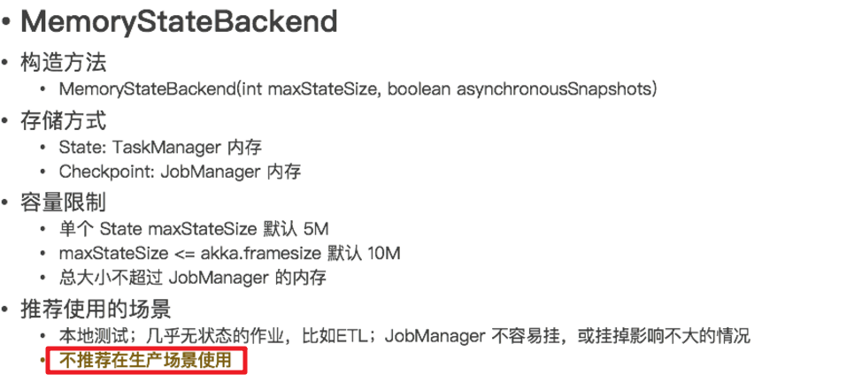


## 34-2 FSStateBackend

- [**开发使用-一般情况下使用**]()


## 34-3 RocksStateBackend

- [**开发偶尔使用-超大状态使用**]()

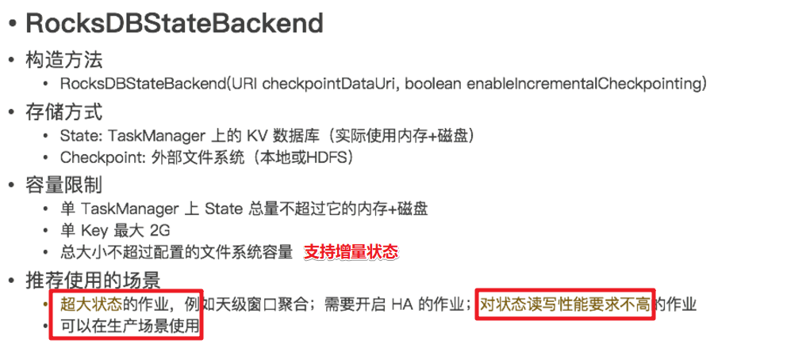


# 35- Flink的重启策略

- 默认重启策略（无限重启）
  - [**配置了Checkpoint,而没有配置重启策略**]()
- 无重启策略（不重启）
  - RestartStrategies.**[noRestart]()**()
- **[固定延迟重启策略]()**（允许重启N次）
  - RestartStrategies.[**fixedDelayRestart**]()(3,  Time.of(10, TimeUnit.SECONDS) )

- [**失败率重启策略**]()（允许**重启频率**）
  - RestartStrategies.**[failureRateRestart]()**(
    	3, // 每个测量时间间隔最大失败次数
    	Time.of(5, TimeUnit.MINUTES), // 失败率测量的时间间隔 ([**5分钟内部允许重启3次**]())
    	Time.of(10, TimeUnit.SECONDS) // 两次连续[**重启的时间间隔**]()
    )


# 36- 总结Flink如何容错

**State + Checkpoint(Savepoint) + RestartStrategies**

- 注意： Spark如何容错？
  - **checkpoint和 wal预写日志**


# 37- Flink VS Spark


| 名称（功能）     | Flink                                                        | Spark Streaming                          | Structured Streaming              |
| ---------------- | ------------------------------------------------------------ | ---------------------------------------- | --------------------------------- |
| 状态State        | 默认有状态计算<br>ManageState+RawState<br>KeyedState+OperatorState | updateStateByKey <br>mapWithState        | 默认有状态计算                    |
| 检查点Checkpoint | env.enableCheckpointing<br>env.setStateBackend<br>    MemoryStateBackend<br>    FSStateBackend<br>    RocksStateBackend<br> | ssc.checkpoint(path)<br>updateStateByKey | option("checkpointLocation",path) |
| 重启策略Restart  | RestartStrategies.noRestart()<br>xxx.[**fixedDelayRestart**]()<br>xxx.failureRateRestart | ssc.checkpoint(path)<br>updateStateByKey | option("checkpointLocation",path) |
|                  |                                                              |                                          |                                   |


# 38- 为什么很多计算框架都要支持SQL


# 39- Flink 1.9之后才实现流批统一（Blink）


# 40- DataStream 与 表互转

- DataStream -> 表
  - tenv.[createTemporaryView]()("tableA",orderA,**$("user"), $("product"), $("amount")**);   (SQL 表)
  - tenv.**[fromDataStream]()**(orderB, **$("user"), $("product"), $("amount")**);  (Table对象)   用于DSL 模式

- 表->DataStream
  - tenv.[**toAppendStream**]()(resultTable, Order.class);:  追加模式([**只支持追加， 不支持更新**]())；
  - tenv.[**toRetractStream**]()(resultTable, Order.class);：缩回模式（支持所有数据）；


# 41- FlinkSQL核心思想

- **动态表**和**连续查询**

注意: FlinkSQL和Spark-StructuredStreaming的[**原理类似**](), 都支持使用[**SQL来处理批数据和流数据**]()

但是注意: StructuredStreaming是**把流当做批**来处理, 而Flink是**把批当做流**来处理, 但是不管怎么,都有一个核心的模型,叫做**动态表**!  [**Unbounded Table**]()


# 42- FlinkSQL 使用窗口

- **SQL 风格**：[**TUMBLE(createTime, INTERVAL '5' SECOND)**]()

  ``` sql
  select 
  	userId,
  	count(userId) as orderCounts,
  	max(money) as maxMoney,
  	min(money) as minMoney 
  from 
  	t_order1 
  group by 
  	TUMBLE(createTime, INTERVAL '5' SECOND),  userId
  ```

  

- **Table/DSL风格**

  - DataStream 转成 Table时需要注意 ： [**在事件时间后加.rowtime()**]()

  ``` java
  tenv.createTemporaryView("t_order1",orderDSWithWatermark,$("orderId"), $("userId"), $("money"), $("createTime").rowtime());
  ```

  - Table风格 [**window(Tumble.over(lit(5).seconds()).on($("createTime")).as("myWindow"))**]()

  ``` java
  table.window(Tumble.over(lit(5).seconds()).on($("createTime")).as("myWindow"))
                  .groupBy($("userId"), $("myWindow"))
                  .select($("userId"),
                          $("userId").count().as("totalCount"),
                          $("money").max().as("maxMoney"),
                          $("money").min().as("minMoney"));
  ```

  

# 43- FlinkSql 整合Kafka

- 从Kafka读数据

``` java
TableResult table1 = tenv.executeSql(
    "CREATE TABLE table1 (\n" +
    "  `user_id` BIGINT,\n" +
    "  `page_id` BIGINT,\n" +
    "  `status` STRING\n" +
    ") WITH (\n" +
    "  'connector' = 'kafka',\n" +
    "  'topic' = 'topic1',\n" +
    "  'properties.bootstrap.servers' = '192.168.88.161:9092',\n" +
    "  'properties.group.id' = 'testGroup',\n" +
    "  'scan.startup.mode' = 'latest-offset',\n" +
    "  'format' = 'json'\n" +
    ")"
);
```


- 向Kafka写数据

```java
TableResult table2 = tenv.executeSql(
    "CREATE TABLE table2 (\n" +
    "  `user_id` BIGINT,\n" +
    "  `page_id` BIGINT,\n" +
    "  `status` STRING\n" +
    ") WITH (\n" +
    "  'connector' = 'kafka',\n" +
    "  'topic' = 'topic2',\n" +
    "  'properties.bootstrap.servers' = '192.168.88.161:9092',\n" +
    "  'format' = 'json',\n" +
    "  'sink.partitioner' = 'round-robin'\n" +
    ")"
);
```


# 44- 介绍一下Flink中的BroadcastState

- **原理：**
  - 下发/广播 [**配置、规则**]() 等 [低吞吐事件流 ]()到 下游 所有 task；
  - 下游的 task [**接收**]()这些配置、规则并[**保存为 BroadcastState**](), 将这些配置[应用到另一个数据流]()的计算中
  - 好处
    - [**减少了数据的传输量**]()；
- 使用场景
  - [动态更新计算规则]()
  - [实时增加额外字段]()

- **使用步骤**
  - 需要定义一个状态描述器 ：[**stateDescriptor**]()；
  - 将某个流（数据小）广播出去：userDS.[**broadcast**]()(stateDescriptor);；
  - 使用另外一个流（数据大）去连接广播流：logDS.[**connect**]()(broadcastDS)
  - 处理合并后的流：connectDS.process
    - processElement()
      - **通过context 和状态描述器获取广播状态；**
      - **使用广播状态中的数据；**
    - processBroadcastElement()
      - **获取老广播状态中的值；**
      - **清空老广播状态的值；**
      - **将新的数据，保存到广播状态中；**

# 45- 介绍一下Flink中的双流join

- Join大体分类只有两种：**Window Join** 和 **Interval Join** （间隔join）。

  - [**Window Join**]()又可以根据Window的类型细分出3种：

    - **Tumbling** Window Join、
    - **Sliding** Window Join、
    - **Session** Widnow Join。
    - Windows类型的join都是利用 **window的机制**，先将数据 **缓存在Window State** 中，当窗口触发计算时，执行join操作；

  - [**interval join**]()

    - 利用 **<font color='red'>state存储 数据</font>**再处理，区别在于state中的数据有失效机制，依靠数据触发数据清理；

    - interval join也是使用[**相同的key来join两个流**]()（流A、流B），

      并且流B中的元素中的时间戳，和流A元素的时间戳，有一个[**时间间隔**]()。

      [b.timestamp ∈ [a.timestamp + lowerBound; a.timestamp + upperBound]]() 

      **或者** 

      [a.timestamp + lowerBound <= b.timestamp <= a.timestamp + upperBound]()

- 原理图：

  - **Tumbling** Window Join；

  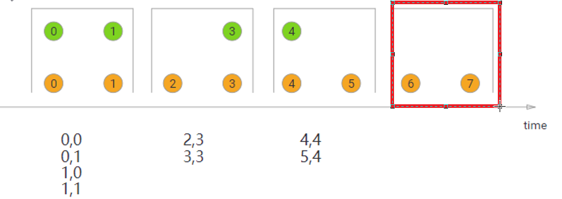

  - **Sliding** Window Join；

  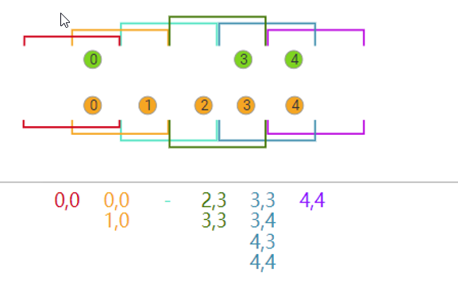

  - **Session** Widnow Join；

  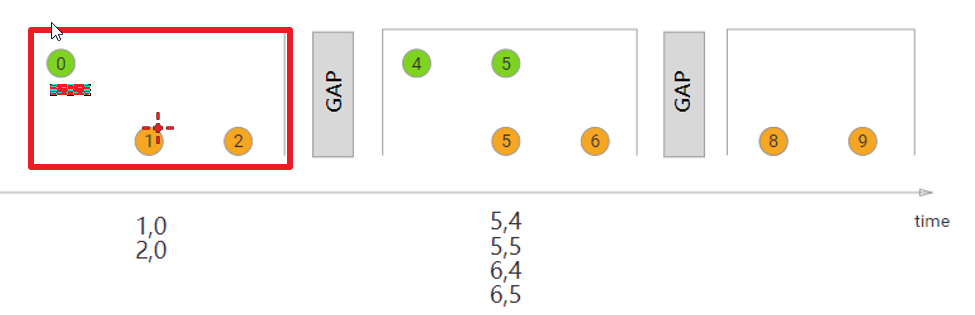

  - [**interval join**]()

  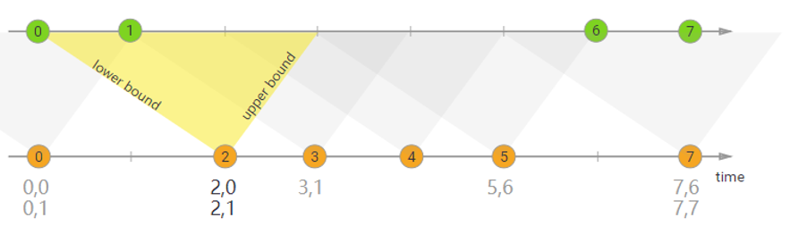

- 代码

  - windown join

  

  - interval join

  


# 46- 介绍一下Flink中的End-to-End Exactly-Once

## 46-1 流处理三种语义

- At-most-once-最多一次,有可能**丢失**,实现起来最简单(不需要做任何处理)

- At-least-once-至少一次,不会丢,但是可能会**重复**(先消费再提交)

- Exactly-Once-恰好一次/精准一次/精确一次,数据**不能丢失且不能被重复**处理(先消费再提交 + 去重)
- Flink中新增一个 [**End-to-End Exactly-Once**]()
  - **端到端**的精确一致性：**source-Transformation-Sink**都可以保证**Exactly Once**;

## 46-2 Flink如何实现的End-to-End Exactly-Once

- 结论：

  - Flink通过 **[Offet + State + Checkpoint + 两阶段事务提交]()** 来实现End-to-End Exactly-Once

- Source

  - 通过**offset**即可保证数据不丢失, 再结合后续的**Checkpoint**保证数据只会被成功处理/计算一次即可;

- Transformation

  - 通过Flink的 **State** + **Checkpoint**就可以完全可以保证;

- Sink:

  - 去重(维护麻烦)或[**幂等性**]()写入(Redis/HBase支持,MySQL和Kafka不支持)都可以, Flink中使用的是[**两阶段事务提交**+**Checkpoint**]()来实现的;

  ``` properties
  Flink+Kafka, Kafka是支持事务的,所以可以使用两阶段事务提交来实现
  FlinkKafkaProducer<IN> extends TwoPhaseCommitSinkFunction  	//两阶段事务提交
  beginTransaction 	// 开启事务
  preCommit  			// 预提交事务
  commit				// 提交事务
  abort				// 回滚事务
  ```

## 46-3 两阶段事务提交 流程

- 1.beginTransaction:开启事务

- 2.preCommit:预提交

- 3.commit:提交

- 4.abort:终止


- 1.Flink程序启动运行,JobManager启动CheckpointCoordinator按照设置的参数**定期执行Checkpoint**

- 2.有数据进来参与计算, **各个Operator(Source/Transformation/Sink)都会执行Checkpoint**

- 3.将数据写入到外部存储的时候**beginTransaction开启事务**

- 4.中间[各个Operator]()执行Checkpoint成功则各自执行**preCommit预提交**

- 5.[所有的Operator]()执行完预提交之后则执行**commit最终提交**

- 6.如果中间有任何preCommit失败则进行**abort终止**


## 47- 介绍一下Flink中的异步IO


# 48- Flink 内存管理

- [**Spark 内存管理**]()


- [**Flink内存管理**]()


- [Flink JVM在大数据环境下存在的问题]()
  1. Java 对象存储密度低;
  2. Java GC可能会被反复触发，其中Full GC或Major GC的开销是非常大的，GC 会达到秒级甚至分钟级;
  3. OOM 问题影响稳定性
- **[Flink内存管理]()**
  1. [**网络缓冲区**]()Network Buffers：用于**[缓存网络数据]()**的内存
  2. [**内存池**]()Memory Manage pool：用于[**运行时的算法**]()（Sort/Join/Shufflt等）默认：70%
  3. [**用户使用内存**]()Remaining (Free) Heap：用于[用户代码以及 TaskManager的数据]()
- **[堆外内存]()**
  - 用于执行一些**[IO操作]()**;
  - [**zero-copy**]();
  - 堆外内存在[**进程间是共享**]()的;


## 48-1 Flink底层内存管理优化总结

- **减少Full GC时间**；
  - 因为所有常用数据都在[**Memory Manager**]() （内存池）里，这部分内存的生命周期是伴随TaskManager管理的而不会被GC回收；
  - 其他的常用数据对象都是用户定义的数据对象，这部分会快速的被GC回收；

- **使用堆外内存，减少OOM**；
  - 所有的运行时的内存应用都从池化的内存中获取，而且运行时的算法可以在[**内存不足的时候将数据写到堆外内存**]()
- **节约空间**；
  - 由于Flink[**自定序列化/反序列化**]()的方法，所有的对象都以[**二进制的形式存储**]()，降低消耗；
  - 对比Spark 也有个自定义的序列化[**kyro**]();
- **高效的[二进制]()操作和缓存友好;**
  - 二进制数据以定义好的格式存储，可以高效地比较与操作。另外，该二进制形式可以把相关的值，以及hash值，键值和指针等相邻地放进内存中。这使得数据结构可以对CPU高速缓存更友好，可以从CPU的 L1/L2/L3 缓存获得性能的提升,也就是Flink的数据存储二进制格式符合CPU缓存的标准,非常[**方便被CPU的L1/L2/L3各级别缓存利用,比内存还要快**]()!


# 49- 总结一下多个框架中分区的作用

## 49-1 各个框架的分区

- HDFS:文件分块
  - 目的是为了**并行读写**,提高**读写效率**,便于**存储,容错**(针对块做副本,便于恢复)
- MR:数据切片 splits
  - 目的是为了**并行计算**
- Hive:**分区(分文件夹)**和**分桶(文件夹下分文件)**
  - 如按照日期分区,按照小时分桶;
  - 目的就是为了提高**查询效率**(**读写效率**)
- HBase:分Region,就是按照rowkey的范围进行分区
  - 目的也是为了提高**读写效率**
- Kafka:分区Partition
  - 目的为了提高**读写效率**
- Spark:分区
  - 目的是为了**并行计算**
- Flink:分区/并行度
  - 目的是为了**并行计算**

总结: **[以后凡是遇到分区/分片/分桶/分Segment/分Region/分Shard...都是为了提高效率]()**

## 49-2 如何设置分区/并行度？

- **Flink**
  - 算子operator.setParallelism(2);

  - env.setParallelism(2);

  - 提交任务时的客户端./bin/flink run -p  2 WordCount-java.jar .......

  - 配置文件中flink-conf.yaml: parallelism.default: 2

  - **[算子级别 > env级别 > Client级别 > 配置文件级别]()**  (越靠前具体的代码并行度的优先级越高)

- **Spark**
  - 算子；
  - sc.setParxxxx；
  - 配置文件；
  - **[算子级别 > sc级别 >  配置文件级别]()**  (越靠前具体的代码并行度的优先级越高)
- **总结**：
  - 设置分区或并行度三板斧：[**算子->程序入口->配置文件**]()；原则：[**就近原则**]()；


# 50- 使用Metrics监控Flink

- **Metrics** 可以在 Flink 内部**[收集一些指标]()**;

- 通过这些指标让开发人员更好地理解作业或[**集群的状态**]();

- 也可以整合第三方工具对Flink进行监控；

  - 如：**[普罗米修斯 和 Grafana 监控Flink运行状态]()**

- Metrics 的类型

  - 1，常用的如 **[Counter]()**，写过 mapreduce 作业的开发人员就应该很熟悉 Counter，其实含义都是一样的，就是对一个计数器进行累加，即对于多条数据和多兆数据一直往上加的过程。
  - 2，**[Gauge]()**，Gauge 是最简单的 Metrics，它反映一个值。比如要看现在 [**Java heap 内存**]()用了多少，就可以每次实时的暴露一个 Gauge，Gauge 当前的值就是heap使用的量。
  - 3，[**Meter**]()，Meter 是指统计吞吐量和单位时间内发生[**“事件”的次数**]()。它相当于求一种速率，即[事件次数除以使用的时间]()。
  - 4，[**Histogram**]()，Histogram 比较复杂，也并不常用，Histogram 用于统计一些数据的分布，比如说 Quantile、Mean、StdDev、Max、Min 等。

   

  Metric 在 Flink 内部有多层结构，以 Group 的方式组织，它并不是一个扁平化的结构，Metric Group + Metric Name 是 Metrics 的唯一标识。


# 51- Flink 性能优化

## 51-1 **[复用对象]()**

- 在apply或者process算子收集数据的时候需要new 对象；可以将这个new对象提到外面去；

``` java
stream.apply(new WindowFunction<WikipediaEditEvent, Tuple2<String, Long>, String, TimeWindow>() {
    // 将创建对象提到外面， 就不用每次都去new了
    private Tuple2<String, Long> result = new Tuple<>();
    
    @Override
    public void apply(String userName, TimeWindow timeWindow, Iterable<WikipediaEditEvent> iterable, Collector<Tuple2<String, Long>> collector) throws Exception {
        long changesCount = ...
        // Set fields on an existing object instead of creating a new one
        result.f0 = userName;
        // Auto-boxing!! A new Long value may be created
        result.f1 = changesCount;
        // Reuse the same Tuple2 object
        collector.collect(result);
    }
}
```

## 51-2 **[数据倾斜优化]()**

- 对key进行均匀的打散处理（[**hash，加盐**]()等）
- [**自定义分区器**]()
- 使用**[Rebalabce]()**

## 51-3 异步IO


## 51-4 合理调整并行度

- 数据**过滤后** 可以**减少并行度**；
- 数据**合并后** 可以**增加并行度**；
- 有**大量小文件**写入HDFS 可以**减少并行度**；


# 52- Flink VS Spark

### 52-1 角色

- Spark Streaming 运行时的角色(standalone 模式)主要有：
  - **Master**:主要负责整体集群**[资源的管理和应用程序调度]()**；
  - **Worker**:负责单个节点的资源管理，driver 和 executor 的启动等；
  - **Driver**:用户入口程序执行的地方，即 SparkContext 执行的地方，主要是 **[DAG 生成、stage 划分、task 生成及调度]()**；
  - **Executor**:负责执行 **[task]()**，反馈执行状态和执行结果。

- Flink 运行时的角色(standalone 模式)主要有:
  - **Jobmanager**: 协调分布式执行，他们[**调度任务、协调 checkpoints、协调故障恢复**]()等。至少有一个 JobManager。高可用情况下可以启动多个 JobManager，其中一个选举为 leader，其余为 standby；
  - **Taskmanager**: 负责执行具体的 [**tasks、缓存、交换数据流**]()，至少有一个 TaskManager；
  - **Slot**: 每个 task slot 代表 TaskManager 的一个固定部分资源，Slot 的个数代表着 taskmanager 可并行执行的 [**task 数**]()。

### 52-2 应用场景

- **Spark**:主要用作**离线批处理** , 对延迟要求不高的实时处理(微批) ,**DataFrame和DataSetAPI 也支持 "流批一体"**
- **Flink**:主要用作**实时处理** ,注意Flink**1.12**开始支持真正的**流批一体**


### 52-3 数据抽象

- Spark : 
  - RDD(不推荐)  SparkCore中的**弹性分布式数据集；**
  - DStream(不推荐) SparkStreaming 中的 **时间轴上的RDD集合；**
  - [**DataFrame和DataSet**]()  SparkSQL/StructuredStreaming 中的；
    - DataFrame：不支持泛型；默认Row
    - DataSet：支持泛型；

- Flink : 
  - DataSet(1.12软弃用) 
  - [**DataStream /Table&SQL**]()(快速发展中)


### 52-4 流程原理

#### 52-4-1 Spark

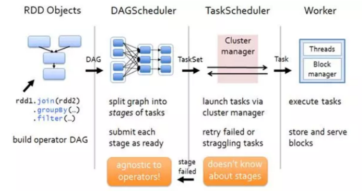

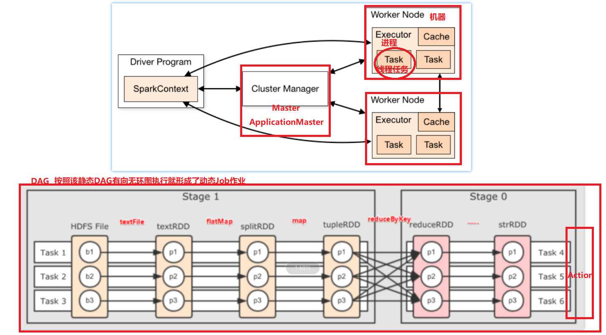

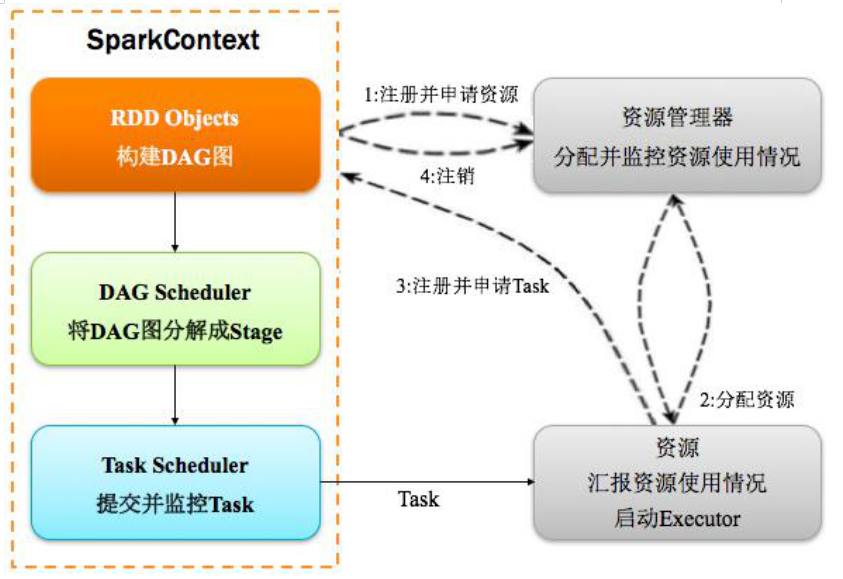

#### 52-4-2 Flink


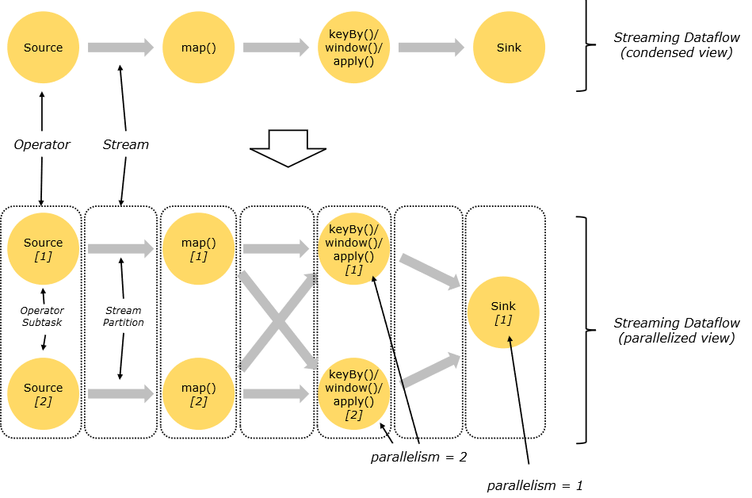


### 52-5 时间机制

- Spark : 
  - SparkStreaming只支持处理时间 
  - StructuredStreaming开始支持事件时间
- Flink : 直接支持事件时间 /处理时间/摄入时间


### 52-6 容错机制

- Spark : 
  - 缓存/持久化 +Checkpoint(应用级别)  
  - StructuredStreaming中的Checkpoint也开始借鉴Flink使用Chandy-Lamport algorithm分布式快照算法

- Flink: State + Checkpoint(Operator级别)  + [**自动重启策略**]() + **[Savepoint]()** + **[两阶段事务提交]()**


### 52-7 窗口

- Spark
  - 支持基于**时间**的**滑动/滚动**  ；
  - 窗口时间必须是微批时间的**倍数**：要求windowDuration和slideDuration必须是batchDuration的倍数

- Flink
  - 窗口机制更加灵活/功能更多
  - 支持基于**时间/数量的滑动/滚动 和 会话窗口**

### 52-8 整合kafka

- **Spark Streaming**
  - 两种模式
    - Receiver：接收器模式；
    - Direct : 直连模式；（**[分区对分区的模式]()**）
  - 两种管理offset模式
    - **自动提交offset** 
    - **手动提交offset**
- **Structured Streaming**
  - 所有的kafka配置都是通过**option来配置**的；
  - 获取到的数据信息都是**二进制数据 binary类型**；
    - df.selectExpr("CAST(key AS STRING)","[**CAST(value AS STRING)**]()")
  - **kafka获取数据后Schema字段信息如下：**
    - **数据信息：**
      - **key** 
      - **value**
    - **元数据：**
      - **topic**
      - **partition**
      - **offset**
- **Flink**
  - addSource  **[FlinkKafkaConsumer]()**
  - addSink **[FlinkKafkaProducer]()**


### 52-9有向无环图

- Spark: **[DAG]()**  
  - 有[driver]()生成；
  - [**每一批数据生成一次DAG**]()；
- Flink: [**StreamingDataFlow**]()
  - **由client端生成；**
  - **只需要生成一次；**


### 52-10 其他的

Flink的高级功能 : [Flink CEP可以实现 实时风控]() .....


# 53- Spark VS Flink 反压/背压

[back pressure]()

- Spark: 
  - Spark消费kafka的数据是**[主动从kafka拉取]()**的；
  - **PIDRateEsimator** ,**[PID算法]()**实现一个[**速率评估器**]()(统计 **DAG调度时间 , 任务处理时间 , 数据条数** 等, 得出一个消息处理**最大速率,** 进而调整根据offset从kafka消费消息的速率);

- Flink: 
  - 基于credit – based 流控机制，在应用层模拟 TCP 的流控机制；
  - 上游发送数据给下游之前会先进行通信,告诉下游要发送的[blockSize]()；
  - 下游就可以准备相应的buffer来接收, 如果准备ok则返回一个[credit凭证]()；
  - 上游收到凭证就发送数据, 如果没有准备ok,则[不返回credit](),上游等待下一次通信返回credit；


[**Ratio:表示有多大的概率不会返回credit;**]()

阻塞占比在 web 上划分了三个等级：

OK: 0 <= Ratio <= 0.10，表示状态良好；

LOW: 0.10 < Ratio <= 0.5，表示有待观察；

HIGH: 0.5 < Ratio <= 1，表示要处理了[**(增加并行度/subTask/检查是否有数据倾斜/增加内存...**]())。

例如，0.01，代表着100次中有一次阻塞在内部调用


