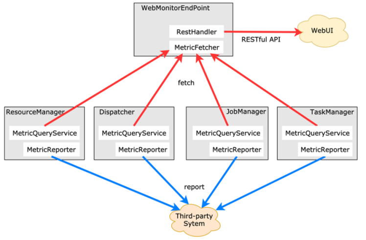

# Flink-Metrics

## 0-Flink-Metrics官网案例

- 1.12
  - https://nightlies.apache.org/flink/flink-docs-release-1.12/ops/metrics.html  -- Metric types
- 1.13
  - https://nightlies.apache.org/flink/flink-docs-release-1.13/docs/ops/metrics/#metric-types

## 1-Flink-Metrics 介绍

- **Metrics** 可以在 Flink 内部**[收集一些指标]()**;
- 通过这些指标让开发人员更好地理解作业或[**集群的状态**]();
- 也可以整合第三方工具对Flink进行监控；

  - 如：**[普罗米修斯 和 Grafana 监控Flink运行状态]()**


## 2- Flink-Metrics 的类型

### 2-1 counter

- 常用的如 **[Counter]()**，写过 mapreduce 作业的开发人员就应该很熟悉 Counter，其实含义都是一样的，就是对一个计数器进行累加，即对于多条数据和多兆数据一直往上加的过程。

### 2-2 Gauge

- **[Gauge]()**，Gauge 是最简单的 Metrics，它反映一个值。比如要看现在 [**Java heap 内存**]()用了多少，就可以每次实时的暴露一个 Gauge，Gauge 当前的值就是heap使用的量。

### 2-3 Meter

- [**Meter**]()，Meter 是指**统计吞吐量**和单位时间内发生[**“事件”的次数**]()。它相当于求一种速率，即[事件次数除以使用的时间]()。

### 2-4 Histogram

- [**Histogram**]()，Histogram 比较复杂，也并不常用，Histogram 用于统计一些数据的分布，比如说 Quantile、Mean、StdDev、Max、Min 等；
- 直方图，用于度量值的统计结果，如：avg,max,min,以及分布情况等；

## 3- Flink-Metrics 架构

- Metric 在 Flink 内部有多层结构，以 Group 的方式组织，它并不是一个扁平化的结构，Metric Group + Metric Name 是 Metrics 的唯一标识。



## 4- Flink-Metrics 案例

### 4-1 counter

- scala

```scala
// 方式一
class MyMapper extends RichMapFunction[String,String] {
  @transient private var counter: Counter = _

  override def open(parameters: Configuration): Unit = {
    counter = getRuntimeContext()
      .getMetricGroup()
      .counter("myCounter")
  }

  override def map(value: String): String = {
    counter.inc()
    value
  }
}

// 方式二
class MyMapper extends RichMapFunction[String,String] {
  @transient private var counter: Counter = _

  override def open(parameters: Configuration): Unit = {
    counter = getRuntimeContext()
      .getMetricGroup()
      .counter("myCustomCounter", new CustomCounter())
  }

  override def map(value: String): String = {
    counter.inc()
    value
  }
}

```

- java

``` java
// 方式一
public class MyMapper extends RichMapFunction<String, String> {
  private transient Counter counter;

  @Override
  public void open(Configuration config) {
    this.counter = getRuntimeContext()
      .getMetricGroup()
      .counter("myCounter");
  }

  @Override
  public String map(String value) throws Exception {
    this.counter.inc();
    return value;
  }
}

// 方式二
public class MyMapper extends RichMapFunction<String, String> {
  private transient Counter counter;

  @Override
  public void open(Configuration config) {
    this.counter = getRuntimeContext()
      .getMetricGroup()
      .counter("myCustomCounter", new CustomCounter());
  }

  @Override
  public String map(String value) throws Exception {
    this.counter.inc();
    return value;
  }
}

```

### 4-2 Gauge

- scala

``` scala
// 方式一
new class MyMapper extends RichMapFunction[String,String] {
  @transient private var valueToExpose = 0

  override def open(parameters: Configuration): Unit = {
    getRuntimeContext()
      .getMetricGroup()
      .gauge[Int, ScalaGauge[Int]]("MyGauge", ScalaGauge[Int]( () => valueToExpose ) )
  }

  override def map(value: String): String = {
    valueToExpose += 1
    value
  }
}
// 方式二


```


- java

``` java
// 方式一
public class MyMapper extends RichMapFunction<String, String> {
  private transient int valueToExpose = 0;

  @Override
  public void open(Configuration config) {
    getRuntimeContext()
      .getMetricGroup()
      .gauge("MyGauge", new Gauge<Integer>() {
        @Override
        public Integer getValue() {
          return valueToExpose;
        }
      });
  }

  @Override
  public String map(String value) throws Exception {
    valueToExpose++;
    return value;
  }
}

// 方式二


```

### 4-3 Meter

- scala

``` scala
// 方式一
class MyMapper extends RichMapFunction[Long,Long] {
  @transient private var meter: Meter = _

  override def open(config: Configuration): Unit = {
    meter = getRuntimeContext()
      .getMetricGroup()
      .meter("myMeter", new MyMeter())
  }

  override def map(value: Long): Long = {
    meter.markEvent()
    value
  }
}

// 方式二
pom.xml
<dependency>
      <groupId>org.apache.flink</groupId>
      <artifactId>flink-metrics-dropwizard</artifactId>
      <version>1.12.7</version>
</dependency>


class MyMapper extends RichMapFunction[Long,Long] {
  @transient private var meter: Meter = _

  override def open(config: Configuration): Unit = {
    val dropwizardMeter: com.codahale.metrics.Meter = new com.codahale.metrics.Meter()
  
    meter = getRuntimeContext()
      .getMetricGroup()
      .meter("myMeter", new DropwizardMeterWrapper(dropwizardMeter))
  }

  override def map(value: Long): Long = {
    meter.markEvent()
    value
  }
}
```


- java

``` java
// 方式一
public class MyMapper extends RichMapFunction<Long, Long> {
  private transient Meter meter;

  @Override
  public void open(Configuration config) {
    this.meter = getRuntimeContext()
      .getMetricGroup()
      .meter("myMeter", new MyMeter());
  }

  @Override
  public Long map(Long value) throws Exception {
    this.meter.markEvent();
    return value;
  }
}

// 方式二

pom.xml
<dependency>
      <groupId>org.apache.flink</groupId>
      <artifactId>flink-metrics-dropwizard</artifactId>
      <version>1.12.7</version>
</dependency>
    
public class MyMapper extends RichMapFunction<Long, Long> {
  private transient Meter meter;

  @Override
  public void open(Configuration config) {
    com.codahale.metrics.Meter dropwizardMeter = new com.codahale.metrics.Meter();

    this.meter = getRuntimeContext()
      .getMetricGroup()
      .meter("myMeter", new DropwizardMeterWrapper(dropwizardMeter));
  }

  @Override
  public Long map(Long value) throws Exception {
    this.meter.markEvent();
    return value;
  }
}
```

### 4-4 Histogram

- scala

``` scala
// 方式一
class MyMapper extends RichMapFunction[Long,Long] {
  @transient private var histogram: Histogram = _

  override def open(parameters: Configuration): Unit = {
    histogram = getRuntimeContext()
      .getMetricGroup()
      .histogram("myHistogram", new MyHistogram())
  }

  override def map(value: Long): Long = {
    histogram.update(value)
    value
  }
}

// 方式二
pom.xml
<dependency>
      <groupId>org.apache.flink</groupId>
      <artifactId>flink-metrics-dropwizard</artifactId>
      <version>1.12.7</version>
</dependency>

class MyMapper extends RichMapFunction[Long, Long] {
  @transient private var histogram: Histogram = _

  override def open(config: Configuration): Unit = {
    com.codahale.metrics.Histogram dropwizardHistogram =
      new com.codahale.metrics.Histogram(new SlidingWindowReservoir(500))
        
    histogram = getRuntimeContext()
      .getMetricGroup()
      .histogram("myHistogram", new DropwizardHistogramWrapper(dropwizardHistogram))
  }
  
  override def map(value: Long): Long = {
    histogram.update(value)
    value
  }
}
```


- java

``` java
// 方式一
public class MyMapper extends RichMapFunction<Long, Long> {
  private transient Histogram histogram;

  @Override
  public void open(Configuration config) {
    this.histogram = getRuntimeContext()
      .getMetricGroup()
      .histogram("myHistogram", new MyHistogram());
  }

  @Override
  public Long map(Long value) throws Exception {
    this.histogram.update(value);
    return value;
  }
}

// 方式二
pom.xml
<dependency>
      <groupId>org.apache.flink</groupId>
      <artifactId>flink-metrics-dropwizard</artifactId>
      <version>1.12.7</version>
</dependency>

public class MyMapper extends RichMapFunction<Long, Long> {
  private transient Histogram histogram;

  @Override
  public void open(Configuration config) {
    com.codahale.metrics.Histogram dropwizardHistogram =
      new com.codahale.metrics.Histogram(new SlidingWindowReservoir(500));

    this.histogram = getRuntimeContext()
      .getMetricGroup()
      .histogram("myHistogram", new DropwizardHistogramWrapper(dropwizardHistogram));
  }
  
  @Override
  public Long map(Long value) throws Exception {
    this.histogram.update(value);
    return value;
  }
}

```


