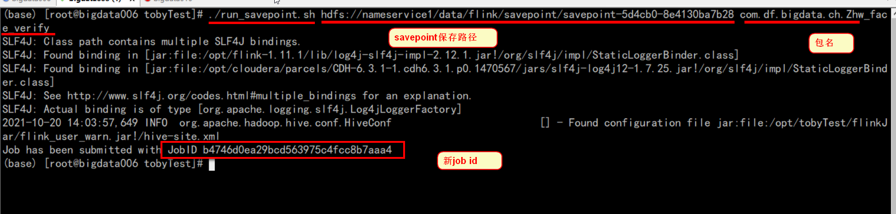

# 1- Flink 之savepoint 

## 1-1 使用savepoint 停止任务

``` shell
#!/bin/bash
/opt/flink-1.11.1/bin/flink cancel -s hdfs://nameservice1/data/flink/savepoint $1

$1: jobId
```


## 1-2 使用savepoint  启动任务

``` shell
#!/bin/bash
/opt/flink-1.11.1/bin/flink run -s $1 -c $2 -n /opt/tobyTest/flinkJar/flink_user_warn.jar
```



