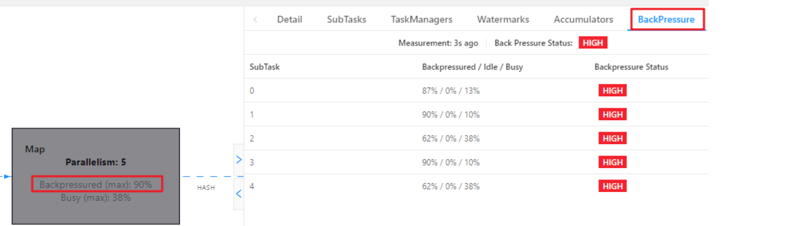

[TOC]

B站地址: https://www.bilibili.com/video/BV1Q5411f76P?p=1&share_medium=iphone&share_plat=ios&share_session_id=CC461920-80FD-48A0-84E8-52A21FF2F497&share_source=WEIXIN&share_tag=s_i&timestamp=1652224332&unique_k=D7y4Ns8


# 1- 资源配置调优

- Flink 性能调优的第一步，就是为任务分配合适的资源，在一定范围内，增加资源的分 配与性能的提升是成正比的；
- 实现了最优的资源配置后，在此基础上再考虑进行后面论述的 性能调优策略；

- 标准的 Flink 任务提交脚本（Generic CLI 模式）

``` properties
bin/flink run \
-t yarn-per-job \
-d \
-p 5 \ 指定并行度
-Dyarn.application.queue=test \ 指定 yarn 队列
-Djobmanager.memory.process.size=1024mb \ 指定 JM 的总进程大小
-Dtaskmanager.memory.process.size=1024mb \ 指定每个 TM 的总进程大小
-Dtaskmanager.numberOfTaskSlots=2 \ 指定每个 TM 的 slot 数
-c com.atguigu.flink.tuning.UvDemo \
/opt/module/flink-1.13.1/myjar/flink-tuning-1.0-SNAPSHOT.jar

```

- 参数列表:

``` url
https://ci.apache.org/projects/flink/flink-docs-release-1.13/deployment/config.html
```


## 1-1 内存设置

### 1-1-1 TaskManager内存模型


#### 1-1-1-1 内存模型详解

- 进程内存
  - JVM内存
    - <font color='green'>JVM元空间  (JVM Metaspace) </font>  默认： 256mb
    - <font color='green'>JVM执行开销  (JVM Overhead)</font>  默认： 0.1（全内存）   min:192M  max: 1G
  - Flink内存
    - 堆内内存   Heap Memory
      - <font color='red'>框架堆上内存 (Framework Heap)</font>   默认: 128MB
      - <font color='red'>Task堆上内存 (Task Heap )</font>  **<font color='red'>默认 none，由 Flink 内存扣除掉其他部分 的内存得到</font>**
    - 堆外内存  off-Heap Memory
      - <font color='orange'>管理内存 （Managed Memory）</font>   默认： 0.4  （Flink内存 ：去除JVM内存）
      - <font color='orange'>框架堆外内存（Framework Off-Heap）</font>  默认: 128MB
      - <font color='orange'>Task堆外内存  (Task Off-Heap)</font>  默认： 0，表示不使用堆外内存
      - <font color='orange'>网络缓冲内存  (Network)</font>  默认： 0.1 （Flink内存 ：去除JVM内存）

- 内存模型详情

  - **JVM 特定内存**：JVM 本身使用的内存，包含 JVM 的 metaspace 和 over-head 

    - JVM metaspace：JVM 元空间 

      ``` properties
      taskmanager.memory.jvm-metaspace.size，默认 256mb 
      ```

    - JVM over-head 执行开销：JVM 执行时自身所需要的内容，包括线程堆栈、IO、编译 缓存等所使用的内存。 

      ``` properties
      taskmanager.memory.jvm-overhead.fraction，默认 0.1 
      taskmanager.memory.jvm-overhead.min，默认 192mb 
      taskmanager.memory.jvm-overhead.max，默认 1gb 
      ```

    - **<font color='red'>总进程内存*fraction，如果小于配置的 min（或大于配置的 max）大小，则使用 min/max 大小</font>**

  - **框架内存**：Flink 框架，即 TaskManager 本身所占用的内存，**不计入 Slot 的资源中**。 

    ``` properties
    - 堆内：taskmanager.memory.framework.heap.size，默认 128MB 
    - 堆外：taskmanager.memory.framework.off-heap.size，默认 128MB
    ```

  - **Task 内存**：Task 执行用户代码时所使用的内存 

    ``` properties
    - 堆内：taskmanager.memory.task.heap.size，默认 none，由 Flink 内存扣除掉其他部分 的内存得到。 
    - 堆外：taskmanager.memory.task.off-heap.size，默认 0，表示不使用堆外内存
    ```

  - **网络内存**：网络数据交换所使用的堆外内存大小，如网络数据交换缓冲区 

    - 堆外：

      ``` properties
      - taskmanager.memory.network.fraction，默认 0.1 
      - taskmanager.memory.network.min，默认 64mb 
      - taskmanager.memory.network.max，默认 1gb 
      ```

    - **<font color='red'>Flink 内存*fraction，如果小于配置的 min（或大于配置的 max）大小，则使用 min/max 大小</font>**

    

  - **托管内存（Managed Memory）**：用于 <font color='red'>K-V 类型的状态，RocksDB State Backend</font> 的本地内存和批的排序、哈希表、缓存中间结果。 

    - 堆外：

      ``` properties
      - taskmanager.memory.managed.fraction，默认 0.4 
      - taskmanager.memory.managed.size，默认 none 
      - 如果 size 没指定，则等于 Flink 内存*fractio
      ```

      

#### 1-1-1-2 案例分析

- 基于Yarn模式，一般参数指定的是总进程内存，<font color='red'>taskmanager.memory.process.size， 比如指定为 4G</font>，每一块内存得到大小如下：

- 计算Flink内存
  - JVM 元空间 256m (默认)
  - JVM 执行开销： 4g*0.1=409.6m，在[192m,1g]之间，最终结果 409.6m
  - <font color='red'>Flink 内存=4g-256m-409.6m=3430.4m</font>
- 网络内存=3430.4m*0.1=343.04m，在[64m,1g]之间，最终结果 343.04m
- 托管内存=3430.4m*0.4=1372.16m
- 框架内存，**堆内** 和 **堆外**都是 128m (默认)
- <font color='red'>Task 堆内内存=3430.4m-128m-128m-343.04m-1372.16m=1459.2m</font>

- 启动打印信息：

  

## 1-2 合理利用 cpu 资源

- Yarn调度器
  - 容量 : 有个配置文件<font color='red'>capacity-scheduler.xml </font>
  - 公平

- Yarn 的**<font color='red'>容量调度器</font>**默认情况下是使用“**<font color='red'>Default</font>ResourceCalculator**”分配策略(资源计算器)，只根据**<font color='red'>内存</font>**调度资源，所以在 Yarn 的资源管理页面上看到每个容器的 vcore 个数还是 1。
- 可以修改策略为 **<font color='red'>Dominant</font>ResourceCalculator**，该资源计算器在计算资源的时候会 综合考虑 **<font color='red'>cpu 和内存</font>**的情况。在 <font color='red'>capacity-scheduler.xml </font>中修改属性：

```xml
<property>
<name>yarn.scheduler.capacity.resource-calculator</name>
<!-- <value>org.apache.hadoop.yarn.util.resource.DefaultResourceCalculator</value> -->
<value>org.apache.hadoop.yarn.util.resource.DominantResourceCalculator</value>
</property>
```


### 1-2-1 使用 <font color='red'>Default</font>ResourceCalculator 策略

bin/flink run \ 

-t yarn-per-job \ 

-d \ 

-<font color='red'>p 5</font> \

-Drest.flamegraph.enabled=true \ 

-Dyarn.application.queue=test \ 

-Djobmanager.memory.process.size=1024mb \ 

-Dtaskmanager.memory.process.size=4096mb \ 

-<font color='red'>Dtaskmanager.numberOfTaskSlots=2</font> \ 

-c com.atguigu.flink.tuning.UvDemo \ 

/opt/module/flink-1.13.1/myjar/flink-tuning-1.0-SNAPSHOT.jar

- 可以看到一个容器只有一个 vcore


### 1-2-2 使用 <font color='red'>Dominant</font>ResourceCalculator 策略

- 修改配置文件 <font color='red'>capacity-scheduler.xml </font>

- 看到容器的 vcore 数变了


- JobManager1 个，占用 1 个容器，vcore=1

- TaskManager3 个，占用 3 个容器，每个容器 vcore=2，总 vcore=2*3=6，因为**<font color='red'>默认单个容器的 vcore 数=单 TM 的 slot 数</font>**


### 1-2-3 使用 DominantResourceCalculator 策 略 并 指 定 容 器 vcore 数


bin/flink run \ 

-t yarn-per-job \ 

-d \ 

<font color='red'>-p 5</font> \ 

-Drest.flamegraph.enabled=true \ 

-Dyarn.application.queue=test \ 

-<font color='red'>Dyarn.containers.vcores=3</font> \

-Djobmanager.memory.process.size=1024mb \ 

-Dtaskmanager.memory.process.size=4096mb \ 

-<font color='red'>Dtaskmanager.numberOfTaskSlots=2</font> \ 

-c com.atguigu.flink.tuning.UvDemo \ 

/opt/module/flink-1.13.1/myjar/flink-tuning-1.0-SNAPSHOT.jar

- JobManager1 个，占用 1 个容器，vcore=1 
- TaskManager3 个，占用 3 个容器，每个容器 **<font color='red'>vcore =3</font>**，总 vcore=3*3=9


## 1-3 并行度设置

- 并行度：
  - 配置文件：默认并行度 1；
  - 提交参数；
  - 代码env设置；
  - 代码算子设置；

### 1-3-1 全局并行度计算

- 通过QPS去获取并行度；
  - <font color='red'>**总 QPS（高峰期）/单并行度的处理能力  * 1.2倍= 并行度**</font>
- QPS最后是每天高峰期的值；
- 单并行度(代码的计算能力)可以在 Metrics 中搜索 ： **<font color='red'>numRecordsOutPerSecond</font>**;

### 1-3-2 Source 端并行度的配置

- **<font color='red'>数据源端是 Kafka，Source 的并行度设置为 Kafka 对应 Topic 的分区数。</font>**

### 1-3-3 Transform 端并行度的配置

- Keyby 之前的算子
  - 一般不会做太重的操作，都是比如 **map、filter、flatmap** 等处理较快的算子;
  - <font color='red'>并行度 可以和 source 保持一致;</font>
- Keyby 之后的算子
  - 如果并发较大，建议设置并行度为 **2 的整数次幂**，例如：16、32、64、128、256、512；
  - 大并发任务如果**<font color='red'>没有 KeyBy</font>**，并行度也无需设置为 2 的整数次幂；

### 1-3-4 Sink 端并行度的配置

- Sink 一般是写到外部系统：kafka, Mysql ,Hologres，Hbase;
- 如果是kafka， 并行度就等于kafka的分区数即可 ； 
- 其它外部系统需要具体分析，需要考虑外部系统是否有这么大数量的抗压能力；
- 比如：HBase 也是需要考虑rowkey的设计，以及分区策略；


# 2- 状态State及 Checkpoint 调优

- checkpoint本质就是给State做一个备份，或者快照 持久化到HDFS；

- 每个算子都会有一个状态,如果这个状态非常大， 就需要使用到RocksDB，将状态存储到本地磁盘中；

  

## 2-1 RocksDB 大状态调优


- RocksDB与Hbase 有点类似；
- 写数据都是**先缓存到内存**中， 所以 RocksDB 的写请求效率比较高；
- RocksDB 使用**内存（托管内存） + 磁盘**的方式来存储数据；
- 读数据： 先从内存 **blockcache** 中查找，如果内存中没有再去**磁盘**中查询；
- **性能瓶颈**主要在于 RocksDB 对磁盘 的读请求，<font color='red'>每次读写操作都必须对数据进行反序列化或者序列化</font>；
- 

### 2-1-1 开启 State 访问性能监控

``` properties
state.backend.latency-track.keyed-state-enabled：true #启用访问状态的性能监控
state.backend.latency-track.sample-interval: 100  #采样间隔  默认值
state.backend.latency-track.history-size: 128  #保留的采样数据个数，越大越精确 默认值
state.backend.latency-track.state-name-as-variable: true #将状态名作为变量

正常开启第一个参数即可:
bin/flink run \
-t yarn-per-job \
-d \
-p 5 \
-Drest.flamegraph.enabled=true \
-Dyarn.application.queue=test \
-Djobmanager.memory.process.size=1024mb \
-Dtaskmanager.memory.process.size=4096mb \
-Dtaskmanager.numberOfTaskSlots=2 \
-Dstate.backend.latency-track.keyed-state-enabled=true \  # 启用访问状态的性能监控
-c com.atguigu.flink.tuning.RocksdbTuning \
/opt/module/flink-1.13.1/myjar/flink-tuning-1.0-SNAPSHOT.jar
```


### 2-1-2 开启增量检查点和本地恢复

- **开启增量检查点** : 只支持 RocksDB ；

  - RocksDB 是目前唯一可用于支持有状态流处理应用程序增量检查点的状态后端，可以 修改参数开启增量检查点

    ``` properties
    state.backend.incremental: true #默认 false，改为 true。
    或代码中指定
    new EmbeddedRocksDBStateBackend(true)
    ```

- **开启本地恢复**

  - 当 Flink 任务失败时，可以基于本地的状态信息进行恢复任务，**可能不需要从 hdfs 拉 取数据**。
  - 本地恢复目前仅RocksDB 支持；
  - MemoryStateBackend 不支持本地恢复并忽略此选项；

  ``` properties
  state.backend.local-recovery: true
  ```

- **设置多目录** (不同磁盘)

  - 如果有多块磁盘，也可以考虑指定本地多目录

  ``` properties
  state.backend.rocksdb.localdir: 
  /data1/flink/rocksdb,/data2/flink/rocksdb,/data3/flink/rocksdb
  ```

- 案例

``` properties
bin/flink run \
-t yarn-per-job \
-d \
-p 5 \
-Drest.flamegraph.enabled=true \
-Dyarn.application.queue=test \
-Djobmanager.memory.process.size=1024mb \
-Dtaskmanager.memory.process.size=4096mb \
-Dtaskmanager.numberOfTaskSlots=2 \                         # 
-Dstate.backend.incremental=true \  						# 开启增量检查点
-Dstate.backend.local-recovery=true \  						# 开启本地恢复
-Dstate.backend.latency-track.keyed-state-enabled=true \	# 启用访问状态的性能监控
-c com.atguigu.flink.tuning.RocksdbTuning \
/opt/module/flink-1.13.1/myjar/flink-tuning-1.0-SNAPSHOT.jar
```


### 2-1-3 调整预定义选项（内存+磁盘）

- 主要是Flink默认设置了一些RockDB的参数：
  - 并行度；
  - 块缓存大小； 
  - 块大小；
  - 文件大小； 
  - 写Buffer大小； 

- 当 前 支 持 的 预 定 义 选 项 有 

  - DEFAULT 
  - SPINNING_DISK_OPTIMIZED 
  - **<font color='red'>SPINNING_DISK_OPTIMIZED_HIGH_MEM</font>** 
  - FLASH_SSD_OPTIMIZED : 有条件上 SSD 的，可以指定为 FLASH_SSD_OPTIMIZED

  ``` properties
  提交任务时参数： 
  tate.backend.rocksdb.predefined-options: SPINNING_DISK_OPTIMIZED_HIGH_MEM 
  #设置为机械硬盘+内存模式
  
  
  代码: 
  EmbeddedRocksDBStateBackend embeddedRocksDBStateBackend = new EmbeddedRocksDBStateBackend();
          embeddedRocksDBStateBackend.setPredefinedOptions(PredefinedOptions.SPINNING_DISK_OPTIMIZED_HIGH_MEM);
          
  env.setStateBackend(embeddedRocksDBStateBackend);
  ```

  

### 2-1-4 增大 block 缓存

- 整个 RocksDB 共享一个 block cache，读数据时内存的 cache 大小；
- 该参数越大读 数据时缓存命中率越高，默认大小为 **8 MB**，建议设置到 <font color='red'>64 ~ 256 MB</font>。

``` properties
state.backend.rocksdb.block.cache-size: 64m #默认 8m
```


### 2-1-5 增大 write buffer 和 level 阈值大小

- RocksDB 中，每个 State 使用一个 Column Family;
- 每个 Column Family 使用<font color='red'>独 占的 write buffer</font>，**默认 64MB**，建议调大;
- 调整这个参数通常要适当增加 L1 层的大小阈值 <font color='red'>max-size-level-base</font>，**默认 256m**;
- 该值**<font color='red'>太小</font>**会造成能存放的 SST 文件过少，层级变多造成查找困难;
- **<font color='red'>太大</font>**会造成文件过多， 合并困难;
- 建议设为 target_file_size_base（默认 64MB）的倍数，且不能太小，例如 **5~10 倍**，即 320~640MB。

``` properties
state.backend.rocksdb.writebuffer.size: 128m   （默认 64MB）
state.backend.rocksdb.compaction.level.max-size-level-base: 320m
```


### 2-1-6 增大 write buffer 数量

- 每个 Column Family 对应的 writebuffer 最大数量，这实际上是内存中“**只读内存表**“的最大数量，默认值是 2。

- 对于机械磁盘来说，如果内存足够大，可以**<font color='red'>调大到 5 左右</font>**;

  ``` properties
  state.backend.rocksdb.writebuffer.count: 5
  ```

  

### 2-1-7 增大后台线程数和 write buffer 合并数

- 增大线程数

  - 用于后台 **flush 和合并 sst 文件的线程数**，默认为 1

  ``` properties
  state.backend.rocksdb.thread.num: 4
  ```

- 增大 writebuffer 最小合并数

  - 将数据从 writebuffer 中 flush 到磁盘时，**需要合并的 writebuffer 最小数量**，默认 值为 1；

  ``` properties
  state.backend.rocksdb.writebuffer.number-to-merge: 3
  ```

  


### 2-1-8 开启分区索引功能


``` properties
state.backend.rocksdb.memory.partitioned-index-filters:true #默认 false
```


### 2-1-9 参数设定案例

``` properties
bin/flink run \
-t yarn-per-job \
-d \
-p 5 \
-Drest.flamegraph.enabled=true \
-Dyarn.application.queue=test \
-Djobmanager.memory.process.size=1024mb \
-Dtaskmanager.memory.process.size=4096mb \
-Dtaskmanager.numberOfTaskSlots=2 \   #
-Dstate.backend.incremental=true \    # 增量检查点
-Dstate.backend.local-recovery=true \ # 本地恢复
-Dstate.backend.rocksdb.predefined-options=SPINNING_DISK_OPTIMIZED_HIGH_MEM \  # 预定义选项
-Dstate.backend.rocksdb.block.cache-size=64m \ # 块缓存大小
-Dstate.backend.rocksdb.writebuffer.size=128m \  # writebuffer 大小
-Dstate.backend.rocksdb.compaction.level.max-size-level-base=320m \  # level阈值大小
-Dstate.backend.rocksdb.writebuffer.count=5 \  # writeBuffer数量
-Dstate.backend.rocksdb.thread.num=4 \  # 溢写磁盘 与 合并文件的线程数
-Dstate.backend.rocksdb.writebuffer.number-to-merge=3 \ # 多少个writeBuffer 合并 成一个文件
-Dstate.backend.rocksdb.memory.partitioned-index-filters=true \  # 分区所有功能
-Dstate.backend.latency-track.keyed-state-enabled=true \  #状态监测
-c com.atguigu.flink.tuning.RocksdbTuning \
/opt/module/flink-1.13.1/myjar/flink-tuning-1.0-SNAPSHOT.jar
```


## 2-2 Checkpoint 设置

- 频率:  Checkpoint **<font color='red'>时间间隔</font>**可以设置为分钟级别（1 ~5 分钟）；
- 间隔: 两次 Checkpoint 之间的**<font color='red'>暂停间隔</font>**；
- checkpoint **<font color='red'>超时时间</font>**；
- 保存 checkpoint；
- 也需要考虑时效性的要求,需要在**<font color='red'>时效性和性能</font>**之间做一个**<font color='red'>平衡</font>**，如果时效性要求高，结合 end- to-end 时长，设置秒级或毫秒级；

``` java
// 使⽤ RocksDBStateBackend 做为状态后端，并开启增量 Checkpoint
RocksDBStateBackend rocksDBStateBackend = new 
RocksDBStateBackend("hdfs://hadoop1:8020/flink/checkpoints", true);
env.setStateBackend(rocksDBStateBackend);
// 开启 Checkpoint，间隔为 3 分钟
env.enableCheckpointing(TimeUnit.MINUTES.toMillis(3));
// 配置 Checkpoint
CheckpointConfig checkpointConf = env.getCheckpointConfig();
checkpointConf.setCheckpointingMode(CheckpointingMode.EXACTLY_ONCE)
// 最小间隔 4 分钟
checkpointConf.setMinPauseBetweenCheckpoints(TimeUnit.MINUTES.toMillis(4))
// 超时时间 10 分钟
checkpointConf.setCheckpointTimeout(TimeUnit.MINUTES.toMillis(10));
// 保存 checkpoint
checkpointConf.enableExternalizedCheckpoints(
CheckpointConfig.ExternalizedCheckpointCleanup.RETAIN_ON_CANCELLATION);
```


# 3- 反压处理

Flink 网络流控及反压的介绍： https://flink-learning.org.cn/article/detail/138316d1556f8f9d34e517d04d670626


## 3-1 反压概念

### 3-1-1 反压的理解

- 短时间的负载高峰导致系统**<font color='red'>接收数据</font>** 的速率远**<font color='red'>高于</font>**它**<font color='red'>处理数据</font>**的速率

### 3-1-2 反压的危害

- 影响 checkpoint 时长；
- 影响 state 大小;
- 甚至导致 OOM （使用 Heap-based StateBackend）或者物理 内存使用超出容器资源（使用 RocksDBStateBackend）的稳定性问题;

## 3-2 定位反压节点

- 排查的时候，先把 operator chain 禁 用，方便定位到具体算子。

``` java
env.disableOperatorChaining();   // 禁用 operator chain
```


### 3-2-1 利用 Flink Web UI 定位

- Web UI 状态显示



- 分析瓶颈算子
  1. **<font color='red'>该节点的发送速率跟不上它的产生数据速率</font>**。这一般会发生在**<font color='red'>一条输入多条输出</font>** 的 Operator（比如 **flatmap**）。这种情况，该节点是反压的根源节点，它是从 Source Task  到 Sink Task 的第一个出现反压的节点。
  2. **<font color='red'>下游的节点接受速率较慢</font>**，通过反压机制限制了该节点的发送速率。这种情况， 需要继续排查下游节点，一直找到第一个为 OK 的一般就是根源节点。


### 3-2-2 利用 Metrics 定位


- 如何判断


- 可以进一步分析数据传输


- 总结： 
  - **floatingBuffersUsage 为高**，则表明反压正在传导至上游 
  - 同时 **exclusiveBuffersUsage 为低**，则表明可能有倾斜
  - 比如，**<font color='red'>floatingBuffersUsage 高、exclusiveBuffersUsage 低为有倾斜</font>**，因为少数 channel 占用了大部分的 Floating Buffer；


## 3-3 反压的原因及处理

- 反压可能是暂时的，可能是由于**负载高峰**、**CheckPoint** 或作业重启引起的数据 积压而导致反压。
- 如果反压是暂时的，应该忽略它。另外，请记住，断断续续的反压会影响 我们分析和解决问题。

### 3-3-1 查看是否数据倾斜


### 3-3-2 使用火焰图分析

- 如果不是数据倾斜，最常见的问题可能是用户**<font color='red'>代码的执行效率问题</font>**（频繁被阻塞或者性 能问题），需要找到瓶颈算子中的哪部分计算逻辑消耗巨大;

- **开启火焰图功能**

  ``` properties
  rest.flamegraph.enabled: true #默认 false
  ```

- **WebUI 查看火焰图**

  - On-CPU: 处于 [RUNNABLE, NEW]状态的线程 
  - Off-CPU: 处于 [TIMED_WAITING, WAITING, BLOCKED]的线程，用于查看在样 本中发现的阻塞调用。


-  **分析火焰图**
  - **纵向是调用链**，从下往上，顶部就是正在执行的函数;
  - 横向是样本出现次数，可以理解为**<font color='red'>执行时长</font>**;
  - **<font color='red'>看顶层的哪个函数占据的宽度最大。只要有"平顶"（plateaus），就表示该函数可能存在性能问题</font>**


### 3-3-3 分析 GC 情况

- 可以通过打印 GC 日志（-XX:+PrintGCDetails）；
- 使用 GC 分析器（GCViewer 工具） 来验证是否处于这种情况；

``` properties
Denv.java.opts="-XX:+PrintGCDetails -XX:+PrintGCDateStamps" \
```


- **下载GC日志**

TaskManager -->Logs --> Stdout 


- **分析 GC 日志**：
  - GCViewer 地址：https://github.com/chewiebug/GCViewer
  - Linux 下分析：<font color='red'>java -jar gcviewer_1.3.4.jar gc.log</font>
  - Windows 下分析：<font color='red'>直接双击 gcviewer_1.3.4.jar，打开 GUI 界面，选择 gc 的 log 打开</font>

### 3-3-4 外部组件交互

- 果发现我们的 Source 端数据读取性能比较低或者 Sink 端写入性能较差，需要检 查第三方组件是否遇到瓶颈，还有就是做维表 join 时的性能问题。 
- 例如： Kafka 集群是否需要扩容，**Kafka 连接器是否并行度较低** ;
- HBase 的 **rowkey 是否遇到热点问题**，是否请求处理不过来 ;
- **ClickHouse 并发能力较弱**，是否达到瓶颈 …… 
- 关于第三方组件的性能问题，需要结合具体的组件来分析;
- **<font color='red'>最常用的思路</font>**： 
  1. **异步 io**  +  热缓存来**优化读写性能** 
  2. **先攒批再读写**
- 维表 join 参考：
  - https://flink-learning.org.cn/article/detail/b8df32fbc6542257a5b449114e137cc3 
  - https://www.jianshu.com/p/a62fa483ff54


# 4- 数据倾斜

## 4-1 判断是否存在数据倾斜

## 4-2 数据倾斜的解决（两端分组聚合思想）

### 4-2-1 keyBy 后的聚合操作存在数据倾斜(无窗口)

- 由于没有窗口，也就没有攒批；所以两次聚合处理的无效的； 
- 使用LocalKeyBy的思想；
  - **先攒批**: 在 keyBy 上游算子数据发送之前，首先在上游算子的本地对数据进行聚合后；
  - **再发送 到下游**，使下游接收到的数据量大大减少，从而使得 keyBy 之后的聚合操作不再是任务的 瓶颈;
  - **<font color='red'>类似 MapReduce 中 Combiner 的思想，但是这要求聚合操作必须是多条数据或 者一批数据才能聚合</font>**，单条数据没有办法通过聚合来减少数据量。
  - 从 Flink LocalKeyBy 实 现原理来讲，必然会存在一个积攒批次的过程，在上游算子中必须攒够一定的数据量，对这 些数据聚合后再发送到下游。
- 代码实现

``` java
package com.atguigu.flink.tuning.function;

import org.apache.flink.api.common.functions.RichFlatMapFunction;
import org.apache.flink.api.common.state.ListState;
import org.apache.flink.api.common.state.ListStateDescriptor;
import org.apache.flink.api.common.typeinfo.Types;
import org.apache.flink.api.java.tuple.Tuple2;
import org.apache.flink.runtime.state.FunctionInitializationContext;
import org.apache.flink.runtime.state.FunctionSnapshotContext;
import org.apache.flink.streaming.api.checkpoint.CheckpointedFunction;
import org.apache.flink.util.Collector;

import java.util.HashMap;
import java.util.Map;
import java.util.concurrent.atomic.AtomicInteger;

public class LocalKeyByFlatMapFunc extends RichFlatMapFunction<Tuple2<String, Long>, Tuple2<String, Long>> implements CheckpointedFunction {

    //Checkpoint 时为了保证 Exactly Once，将 buffer 中的数据保存到该 ListState 中
    private ListState<Tuple2<String, Long>> listState;

    //本地 buffer，存放 local 端缓存的 mid 的 count 信息
    private HashMap<String, Long> localBuffer;

    //缓存的数据量大小，即：缓存多少数据再向下游发送
    private int batchSize;

    //计数器，获取当前批次接收的数据量
    private AtomicInteger currentSize;


    //构造器，批次大小传参
    public LocalKeyByFlatMapFunc(int batchSize) {
        this.batchSize = batchSize;
    }


    @Override
    public void flatMap(Tuple2<String, Long> value, Collector<Tuple2<String, Long>> out) throws Exception {
        // 1、将新来的数据添加到 buffer 中,本地聚合
        Long count = localBuffer.getOrDefault(value.f0, 0L);
        localBuffer.put(value.f0, count + 1);

        // 2、如果到达设定的批次，则将 buffer 中的数据发送到下游
        if (currentSize.incrementAndGet() >= batchSize) {
            // 2.1 遍历 Buffer 中数据，发送到下游
            for (Map.Entry<String, Long> midAndCount : localBuffer.entrySet()) {
                out.collect(Tuple2.of(midAndCount.getKey(), midAndCount.getValue()));
            }

            // 2.2 Buffer 清空，计数器清零
            localBuffer.clear();
            currentSize.set(0);
        }

    }


    @Override
    public void snapshotState(FunctionSnapshotContext context) throws Exception {
        // 将 buffer 中的数据保存到状态中，来保证 Exactly Once
        listState.clear();
        for (Map.Entry<String, Long> midAndCount : localBuffer.entrySet()) {
            listState.add(Tuple2.of(midAndCount.getKey(), midAndCount.getValue()));
        }
    }

    @Override
    public void initializeState(FunctionInitializationContext context) throws Exception {
        // 从状态中恢复 buffer 中的数据
        listState = context.getOperatorStateStore().getListState(
                new ListStateDescriptor<Tuple2<String, Long>>(
                        "localBufferState",
                        Types.TUPLE(Types.STRING, Types.LONG)
                )
        );
        localBuffer = new HashMap();
        if (context.isRestored()) {
            // 从状态中恢复数据到 buffer 中
            for (Tuple2<String, Long> midAndCount : listState.get()) {
                // 如果出现 pv != 0,说明改变了并行度，ListState 中的数据会被均匀分发到新的 subtask中
                // 单个 subtask 恢复的状态中可能包含多个相同的 mid 的 count数据
                // 所以每次先取一下buffer的值，累加再put
                long count = localBuffer.getOrDefault(midAndCount.f0, 0L);
                localBuffer.put(midAndCount.f0, count + midAndCount.f1);
            }
            // 从状态恢复时，默认认为 buffer 中数据量达到了 batchSize，需要向下游发
            currentSize = new AtomicInteger(batchSize);
        } else {
            currentSize = new AtomicInteger(0);
        }

    }
}

```


### 4-2-2 keyBy 之前发生数据倾斜

- 例如：由于某些 原因 Kafka 的 topic 中某些 partition 的数据量较大，某些 partition 的数据量较少；
- 这种情况，需要让 Flink 任务**<font color='red'>强制进行 shuffle</font>**。使用 <font color='orange'>shuffle、rebalance</font> 或 **<font color='red'>rescale</font>** 算子即可将数据均匀分配，从而解决数据倾斜的问题；


### 4-2-3 keyBy 后的窗口聚合操作存在数据倾斜

- 因为**使用了窗口**，变成了**有界数据（攒批）**的处理，窗口默认是触发时才会输出一条结 果发往下游，所以可以使用两阶段聚合的方式；
- 实现思路：
  - 第一阶段聚合：**<font color='red'>key 拼接随机数前缀或后缀</font>**，进行 keyby、开窗、聚合 ； 
    - **<font color='red'>注意</font>**：聚合完不再是 WindowedStream，要获取 **<font color='red'>WindowEnd</font>** 作为窗口标记作为**第二 阶段分组依据**，避免不同窗口的结果聚合到一起；
    - **<font color='red'>随机数范围，需要自己去测，因为 keyby 的分区器是（两次 hash*下游并行度/最大并行度）</font>**
  - 第二阶段聚合：**<font color='red'>按照原来的 key 及 windowEnd 作 keyby、聚合</font>**


# 5- Job 优化


# 6- FlinkSQL 调优

## 6-1 设置空闲状态保留时间


## 6-2 开启 MiniBatch


## 6-3 开启 LocalGlobal

### 6-3-1 原理概述

### 6-3-2  提交案例：统计每天每个 mid 出现次数

### 6-3-3 提交案例：开启 miniBatch 和 LocalGlobal


## 6-4 开启 Split Distinct

### 6-4-1 原理概述

### 6-4-2 提交案例：count(distinct)存在热点问题

### 6-4-3 提交案例：开启 split distinct


## 6-5 多维 DISTINCT 使用 Filter

### 6-5-1 原理概述

### 6-5-2 提交案例：多维 Distinct


## 6-6 设置参数总结

``` java
// 初始化 table environment
TableEnvironment tEnv = ...
// 获取 tableEnv 的配置对象
Configuration configuration = tEnv.getConfig().getConfiguration();
// 设置参数：
// 开启 miniBatch
configuration.setString("table.exec.mini-batch.enabled", "true");
// 批量输出的间隔时间
configuration.setString("table.exec.mini-batch.allow-latency", "5s");
// 防止 OOM 设置每个批次最多缓存数据的条数，可以设为 2 万条
configuration.setString("table.exec.mini-batch.size", "20000");
// 开启 LocalGlobal
configuration.setString("table.optimizer.agg-phase-strategy", "TWO_PHASE");
// 开启 Split Distinct
configuration.setString("table.optimizer.distinct-agg.split.enabled", "true");
// 第一层打散的 bucket 数目
configuration.setString("table.optimizer.distinct-agg.split.bucket-num", "1024");
// 指定时区
configuration.setString("table.local-time-zone", "Asia/Shanghai");
```


# 7- 常见故障排除

## 7-1 非法配置异常

- 如果您看到从 TaskExecutorProcessUtils 或 JobManagerProcessUtils 抛出的 **<font color='red'>IllegalConfigurationException</font>**，通常表明存在无效的配置值（例如负内存大小、大于 1 的 分数等）或配置冲突。请重新配置内存参数。


## 7-2 Java 堆空间异常

- 如果报 OutOfMemoryError: **<font color='red'>Java heap space</font>** 异常，通常表示 JVM Heap 太小。 可以尝试通过增加总内存来增加 JVM 堆大小。也可以直接为 TaskManager 增加任务堆 内存或为 JobManager 增加 JVM 堆内存。


## 7-3 网络缓冲区数量不足

- 如果报 IOException: **<font color='red'>Insufficient number of network buffers</font>** 异常，这仅与 TaskManager 相关。通常表示配置的网络内存大小不够大。您可以尝试增加网络内存。

## 7-4 checkpoint 失败


## 7-5 checkpoint 慢


## 7-6 Watermark 不更新


## 7-7 脏数据导致数据转发失败


## 7-8 依赖冲突