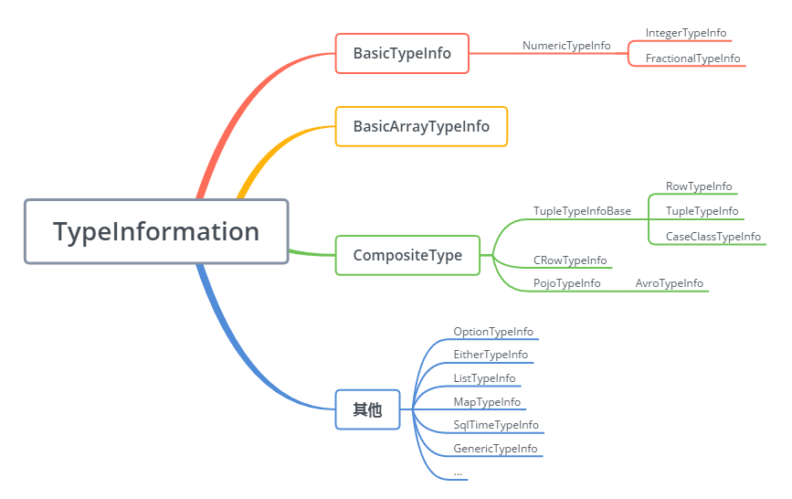
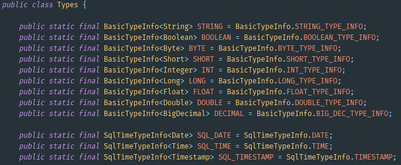

# 0- 资料来源

- https://www.cnblogs.com/qcloud1001/p/9626462.html

# 1- 困惑

- 为什么 Flink 有那么多的类型声明方式？
- **BasicTypeInfo**.STRING_TYPE_INFO、**Types**.STRING 、**Types**.STRING() 有何区别？
- **TypeInfoFactory** 又是什么？
- **TypeInformation**.of 和 **TypeHint **是如何使用的呢？

# 2- Flink 的类型分类

- Flink 的类型系统源码位于flink_core包的 org.apache.flink.api.common.typeinfo 包，让我们对图 1 深入追踪，看一下类的继承关系图：

- 可以看到，图 1 和 图 2 是一一对应的，TypeInformation 类是描述一切类型的公共基类，它和它的所有子类必须可序列化（Serializable），因为类型信息将会伴随 Flink 的作业提交，被传递给每个执行节点。

- 由于 Flink 自己管理内存，采用了一种非常紧凑的存储格式（见[官方博文](https://flink.apache.org/news/2015/05/11/Juggling-with-Bits-and-Bytes.html)），因而类型信息在整个数据处理流程中属于至关重要的元数据。

# 3- 声明类型信息的常见手段

- 通过 TypeInformation.of() 方法，可以简单地创建类型信息对象;

  1. **对于非泛型的类，直接传入 Class 对象即可**; 

     

  2. **对于泛型类，需要借助 TypeHint 来保存泛型类型信息** ; 

     - TypeHint 的原理是创建匿名子类，运行时 TypeExtractor 可以通过 getGenericSuperclass(). getActualTypeArguments() 方法获取保存的实际类型。
     - TypeHint 作为参数，保存泛型信息

     

  3. **预定义的快捷方式** ; 

     - 例如 BasicTypeInfo，这个类定义了一系列**常用类型**的快捷方式，对于 String、Boolean、Byte、Short、Integer、Long、Float、Double、Char 等基本类型的类型声明，可以直接使用；

     

     - 例如下面是对 Row 类型各字段的类型声明，使用方法非常简明，不再需要 new XxxTypeInfo<>(很多很多参数)

       

     - 当然，如果觉得 BasicTypeInfo 还是太长，Flink 还提供了完全等价的 Types 类（org.apache.flink.api.common.typeinfo.Types）：

     

     - 特别需要注意的是，**flink-table 模块也有一个 Types 类**（org.apache.flink.table.api.Types），用于 table 模块内部的类型定义信息，用法稍有不同。使用 IDE 的自动 import 时一定要小心：

     

