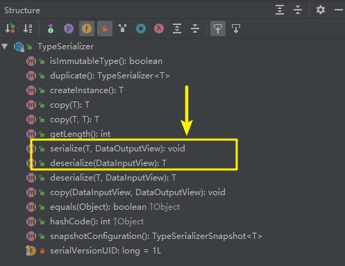

# 1- 本文解决问题

- Flink是使用Java的序列化方式吗？
- Java序列化方式有什么问题？
- Java中是用Class描述类型，Flink也是用Class描述吗？
- 请解释以下Java类型擦除。
- Flink中为什么使用Lambda表达式实现flatMap需要通过returns指定类型呢？
- new ArrayList<String>()和new ArrayList<String>(){}的区别是什么？


# 2- 类型和序列化

- <font color='blue'>类型和序列化是每一个计算引擎非常重要的模块</font>。不管是Hadoop MapReduce、Spark还是Flink。以前，我们写单机Java程序的时候，几乎都<font color='red'>不会太关注</font>这一点。只要会使用类型、创建出来对象就可以了，序列化更只是做一个了解。
- 但大数据计算引擎，为了提高计算性能，需要尤其注意类型和序列化。特别是对于一些新手，写代码的时候，一碰到这方面的错误/异常，就不知道如何处理。大数据计算引擎都是分布式计算，分布式计算中存储和传输是非常重要的，每一个对象都是数据，都需要进行存储和传输，不管是存储在内存还是磁盘。所以，只要涉及到大数据的计算引擎，我们都需要将类型和序列化结合在一起来分析。
- 每一套计算引擎或者存储引擎，都有自己的类型系统。计算框架通过类型系统构建出来了属于自己独特的数据世界。Apache Flink也不例外，它有自己的类型系统，和自己的序列化系统。<font color='red'>简单、易用、结构清晰的类型系统能够保障我们编写Flink代码，就像使用Java语言编写普通程序一样简单，高效、高性能序列化系统能够保障我们编写的Flink程序能够用最快地速度进行存储和传输</font>。
- Flink目前的主要开发语言是Java和Scala。作为框架的设计者，一定会优先考虑基于这两种语言来编写程序的易用性。可以明显感知到的是，我们使用Flink引擎不用像之前的Hadoop MapReduce程序一样，输入输出必须得使用MapReduce框架自带的类型和序列化。这对于开发人员来说，大大减轻了负担。所以很多开发人员几乎感知不到Flink类型系统的存在。但如果涉及到一些复杂场景，特别是引入一些特殊自定义数据类型或者使用其他的序列化方式，我们不了解Flink类型系统和序列化机制，碰见问题时一头雾水。

# 3- Flink类型系统

## 3-1 Flink为什么要自己实现序列化框架

- 目前，绝大多数的**<font color='red'>大数据计算框架</font>**都是基于**<font color='blue'>JVM实现</font>**的，为了快速地计算数据，需要将数据加载到内存中进行处理。当大量数据需要加载到内存中时，<font color='red'>如果使用Java序列化方式来存储对象，占用的空间会较大降低存储传输效率</font>。
- 例如：一个只包含布尔类型的对象需要占用16个字节的内存：对象头要占8个字节、boolean属性占用1个字节、对齐填充还要占用7个字节。
- <font color='red'>Java序列化方式存储对象存储密度是很低</font>的。也是基于此，Flink框架实现了自己的内存管理系统，在Flink自定义内存池分配和回收内存，然后将自己实现的序列化对象存储在内存块中。
- Java生态系统中有挺多的序列化框架，例如：Kryo、Avro、ProtoBuf等。Flink自己实现了一套序列化系统可以让我们编写程序的时候，尽快地发现问题，更加节省内存空间，并直接进行二进制数据的处理。

## 3-2 Flink类型系统

基于Java和Scala语言，Flink实现了一套自己的一套类型系统，它支持很多种类的类型：

- 基本类型
- 数组类型
- 复合类型
- 辅助类型
- 通用类型


对于我们创建的任意的一个POJO类型，看起来它是一个普通的Java Bean，在Java中，使用Class可以用来描述该类型。但其实在Flink引擎中，它被描述为PojoTypeInfo，而PojoTypeInfo是**TypeInformation**的子类；


### 3-2-1 TypeInformation

- TypeInformation是**<font color='red'>Flink类型系统的核心类</font>**。Flink使用TypeInformation来描述所有Flink支持的数据类型，就<font color='blue'>像Java中的Class类型</font>一样。每一种Flink支持的数据类型都对应的是TypeInformation的子类。


例如：POJO类型对应的是PojoTypeInfo、基础数据类型数组对应的是BasicArrayTypeInfo、Map类型对应的是MapTypeInfo、值类型对应的是ValueTypeInfo。

除了对类型地描述之外，TypeInformation还提供了序列化的支撑。在TypeInformation中有一个方法：createSerializer方法，


它用来创建序列化器，序列化器中定义了一系列的方法。其中，通过serialize和deserialize方法，可以将指定类型进行序列化。并且，Flink的这些序列化器会以稠密的方式来将对象写入到内存中。



Flink中也提供了非常丰富的序列化器。


在我们基于Flink类型系统支持的数据类型进行编程时，Flink在运行时会**<font color='red'>推断出数据类型的信息</font>**，程序员在基于Flink编程时，几乎是不需要关心类型和序列化的。


## 3-3 类型与Lambda表达式支持

### 3-3-1 Java类型擦除

- 在编译时，编译器能够从Java源代码中读取到完整的类型信息，并强制执行类型的约束，但生成class字节码时，会将参数化类型信息删除。这就是**<font color='red'>类型擦除</font>**。

注意：**<font color='blue'>泛型只是在编译器编译时能够理解该类型。但编译后执行时，泛型是会被擦除掉的</font>**。（但不总是这样）

例如：如果在Java代码中使用的是ArrayList<String>，而在执行时就没有<String>信息，只有ArrayList类型。类型擦除可以确保不会为泛型创建新的Java类，泛型是不会产生额外的开销的。

- 用以下代码来做一个简单说明：

``` java
public static <T> boolean hasItems(T [] items, T item){
    for (T i : items){
        if(i.equals(item)){
            return true;
        }
    }
    return false;
}
```

以上是一段Java的泛型方法。但在编译后，编译器会将未绑定类型的T擦除掉，替换为Object。也就是变成下面的样子：

``` java
 public static Object boolean hasItems(Object [] items, Object item){
     for (Object i : items){
         if(i.equals(item)){
             return true;
         }
     }
     return false;
 }
```

**<font color='red'>泛型只是能够防止在运行时出现类型错误。</font>**


### 3-3-2 Lambda表达式的支持

下面我用非常简单的一段Flink代码来演示Flink对Lambda表达式的支持。

``` java
public class FlinkTypeDemo {

    public static void main(String[] args) throws Exception {
        StreamExecutionEnvironment env = StreamExecutionEnvironment.getExecutionEnvironment();

        DataStreamSource<List<String>> phoneTypeDS = env.addSource(new SourceFunction<List<String>>() {
            private Boolean isCancel = false;

            public void run(SourceContext<List<String>> sourceContext) throws Exception {
                while (!isCancel) {
                    List<String> phoneTypeList = new ArrayList<String>();
                    phoneTypeList.add("iphone");
                    phoneTypeList.add("xiaomi");
                    phoneTypeList.add("meizu");

                    sourceContext.collect(phoneTypeList);
                    TimeUnit.SECONDS.sleep(3);
                }
            }

            public void cancel() {
                isCancel = true;
            }
        });

        SingleOutputStreamOperator<String> eachTypeDS = phoneTypeDS.flatMap((val, out) -> {
            val.stream().forEach(t -> out.collect(t));
        });

        eachTypeDS.print();

        env.execute("GenericTypeTest");
    }
}
```

上面代码起来没有什么问题。但运行时会出现以下异常。

``` properties
Exception in thread "main"
org.apache.flink.api.common.functions.InvalidTypesException: The return type of function 'main(FlinkTypeDemo.java:37)' could not be determined automatically, due to type erasure. You can give type information hints by using the returns(...) method on the result of the transformation call, or by letting your function implement the 'ResultTypeQueryable' interface.
```

Flink以非常友好的方式提示我们了：

could not be determined automatically, due to type erasure. You can give type information hints by using the <font color='blue'>returns(...) method on the result of the transformation call,</font> or by letting your function implement the 'ResultTypeQueryable' interface.

就是因为**<font color='red'>Java的类型擦除</font>**，所以Flink根本无法推断出来该flatMap要输出的类型是什么。


所以，Flink让我们指定该类型的TypeInformation，给它一个提示（TypeHint）

### 3-3-3 指定TypeInformation或者TypeHint

- 创建**<font color='red'>TypeInformation</font>**：

``` java
phoneTypeDS.flatMap((List<String> val, Collector<String> out) -> {
    val.stream().forEach(t -> out.collect(t));
})
    .returns(TypeInformation.of(String.class))
    .print();
```

- 创建**<font color='red'>TypeHint</font>**：

``` java
phoneTypeDS.flatMap((List<String> val, Collector<String> out) -> {
            val.stream().forEach(t -> out.collect(t));
        })
        .returns(new TypeHint<String>() {})
        .print();
```

大家可能会问，第二种方式不是也会进行类型擦除吗？

嘿嘿！注意TypeHint后面的那对花括号，千万别走开，继续往下看。


### 3-3-4 匿名内部类开启后门

``` java
SingleOutputStreamOperator<String> eachTypeDS = phoneTypeDS.flatMap(new FlatMapFunction<List<String>, String>() {
    @Override
    public void flatMap(List<String> value, Collector<String> out) throws Exception {
        value.stream().forEach(v -> out.collect(v));
    }
});
```

用匿名内部类的方式实现flatMap，我们惊奇地发现，程序居然可以成功运行。说明Flink在运行时确实正确地读取到了类型信息。

<font color='red'>为什么使用匿名内部类就可以呢？我们在匿名内部类中也使用了泛型啊。奇怪！</font>

有一个概念需要大家记住：<font color='blue'>泛型类型可以用于匿名类</font>。javac编译器遇到匿名类时，会在字节码中创建数据结构（注意该结构只在运行时可用），这个数据结构中就包含了实际的泛型参数信息。所以，使用匿名类实例化对象是不会进行类型擦除的。

``` java
ArrayList<String> strings1 = new ArrayList<String>();
ArrayList<String> strings2 = new ArrayList<String>() {};
```

上面两行代码看起来没啥区别，但其实，<font color='blue'>第一行代码会进行编码擦除</font>，而**<font color='red'>第二行代码是不会进行编码擦除的</font>**。


# 4- 总结：

- **Flink是使用Java的序列化方式吗？**

不是。Flink自己实现了一套类型系统和序列化系统。


- **Java序列化方式有什么问题？** 

Java序列化方式对象存储很**<font color='red'>稀疏</font>**，除了存储数据本身外，还需要存储Class header数据、对齐填充数据。针对海量数据，会占用较多额外空间降低存储传输效率。


- **Java中是用Class描述类型，Flink也是用Class描述吗？**

不是。Flink是基于TypeInformation描述类型信息，针对每一种类型Flink都提供了自己的TypeInformation，例如：PojoTypeInfo、ValueTypeInfo等等。


- **请解释一下Java类型擦除。**

Java中使用**<font color='blue'>泛型</font>**只是在<font color='red'>编译时进行强制类型检查</font>，避免因为类型问题出现Runtime异常。而在<font color='blue'>运行过程中</font>，<font color='red'>泛型类型是会被擦除掉</font>的。


- **Flink中为什么使用Lambda表达式实现flatMap需要通过returns指定类型呢？**

flatMap有一个泛型参数Colletor<T>，因为<font color='red'>Java编译器类型擦除的原因</font>，导致Flink在运行时是无法推断出来flatMap任务输出的类型信息，所以需要returns指定输出的类型。


- **new ArrayList<String>()和new ArrayList<String>()<font color='red'>{}</font>的区别是什么？**

使用起来是一样的。但后者是**<font color='red'>匿名内部类，在运行时会保留泛型信息</font>**。

