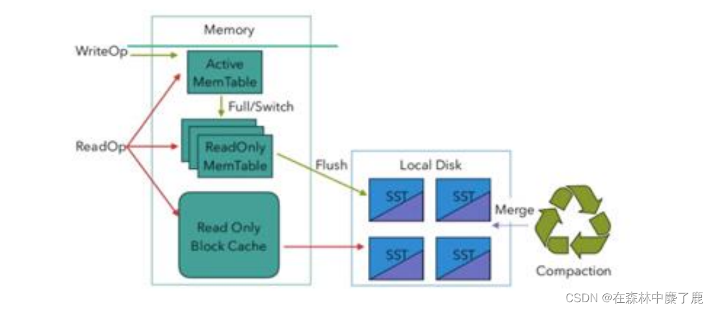
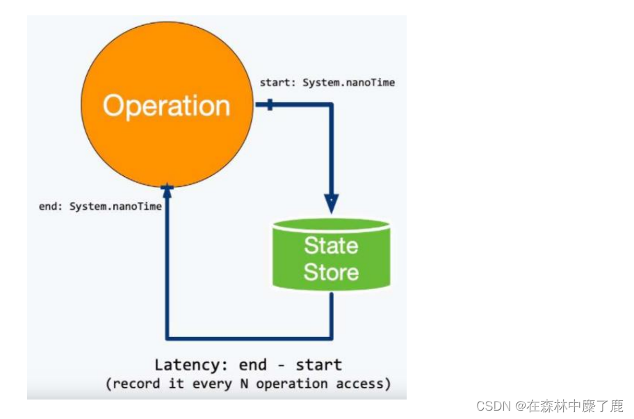

# 状态及 Checkpoint 调优


## 一、RocksDB 大状态调优

​	RocksDB 是基于 LSM Tree 实现的（类似 HBase），写数据都是先缓存到内存中，所以 RocksDB 的写请求效率比较高。RocksDB 使用内存结合磁盘的方式来存储数据，每次获取数据时，先从内存中 blockcache 中查找，如果内存中没有再去磁盘中查询。使用 RocksDB 时，状态大小仅受可用磁盘空间量的限制，性能瓶颈主要在于 RocksDB 对磁盘的读请求，每次读写操作都必须对数据进行反序列化或者序列化。当处理性能不够时，仅需要横向扩展并行度即可提高整个 Job 的吞吐量。


	从 Flink1.10 开始，Flink 默认将 RocksDB 的内存大小配置为每个 task slot 的托管内存。调试内存性能的问题主要是通过调整配置项 taskmanager.memory.managed.size 或者 taskmanager.memory.managed.fraction 以增加 Flink 的托管内存(即堆外的托管内存)。进一步可以调整一些参数进行高级性能调优，这些参数也可以在应用程序中通过RocksDBStateBackend.setRocksDBOptions(RocksDBOptionsFactory)指定。下面介绍提高资源利用率的几个重要配置：

## 1. 开启 State 访问性能监控

​	Flink 1.13 中引入了 State 访问的性能监控，即 latency trackig state。此功能不局限于 State Backend 的类型，自定义实现的 State Backend 也可以复用此功能。


State 访问的性能监控会产生一定的性能影响，所以，默认每 100 次做一次取样(sample)，对不同的 State Backend 性能损失影响不同：

对于 RocksDB State Backend，性能损失大概在 1% 左右
对于 Heap State Backend，性能损失最多可达 10%

```
state.backend.latency-track.keyed-state-enabled：true #启用访问状态的性能监控
state.backend.latency-track.sample-interval: 100 #采样间隔
state.backend.latency-track.history-size: 128 #保留的采样数据个数，越大越精确
state.backend.latency-track.state-name-as-variable: true #将状态名作为变量
```

正常开启第一个参数即可。

```
bin/flink run \
-t yarn-per-job \
-d \
-p 5 \
-Drest.flamegraph.enabled=true \
-Dyarn.application.queue=test \
-Djobmanager.memory.process.size=1024mb \
-Dtaskmanager.memory.process.size=4096mb \
-Dtaskmanager.numberOfTaskSlots=2 \
-Dstate.backend.latency-track.keyed-state-enabled=true \
-c com.fancy.flink.tuning.RocksdbTuning \
/opt/module/flink-1.13.1/myjar/flink-tuning-1.0-SNAPSHOT.jar
```

## 2. 开启增量检查点和本地恢复

**A、开启增量检查点**

RocksDB 是目前唯一可用于支持有状态流处理应用程序增量检查点的状态后端，可以修改参数开启增量检查点：

```
state.backend.incremental: true #默认 false，改为 true。
```

或代码中指定

```
new EmbeddedRocksDBStateBackend(true)
```

**B、开启本地恢复**

当 Flink 任务失败时，可以基于本地的状态信息进行恢复任务，可能不需要从 hdfs 拉取数据。本地恢复目前仅涵盖键控类型的状态后端（RocksDB），MemoryStateBackend 不支持本地恢复并忽略此选项。

```
state.backend.local-recovery: true
```

**C、设置多目录**

如果有多块磁盘，也可以考虑指定本地多目录

```
state.backend.rocksdb.localdir: /data1/flink/rocksdb,/data2/flink/rocksdb,/data3/flink/rocksdb
```

注意：不要配置单块磁盘的多个目录，务必将目录配置到多块不同的磁盘上，让多块磁盘来分担压力。

```
bin/flink run \
-t yarn-per-job \
-d \
-p 5 \
-Drest.flamegraph.enabled=true \
-Dyarn.application.queue=test \
-Djobmanager.memory.process.size=1024mb \
-Dtaskmanager.memory.process.size=4096mb \
-Dtaskmanager.numberOfTaskSlots=2 \
-Dstate.backend.incremental=true \
-Dstate.backend.local-recovery=true \
-Dstate.backend.latency-track.keyed-state-enabled=true \
-c com.fancy.flink.tuning.RocksdbTuning \
/opt/module/flink-1.13.1/myjar/flink-tuning-1.0-SNAPSHOT.jar
```

## 3. 调整预定义选项

Flink 针对不同的设置为 RocksDB 提供了一些预定义的选项集合,其中包含了后续提到的一些参数，如果调整预定义选项后还达不到预期，再去调整后面的 block、writebuffer 等参数。

当前支持的预定义选项有 DEFAULT 、 SPINNING_DISK_OPTIMIZED 、SPINNING_DISK_OPTIMIZED_HIGH_MEM 或 FLASH_SSD_OPTIMIZED。有条件上 SSD
的，可以指定为 FLASH_SSD_OPTIMIZED

```
state.backend.rocksdb.predefined-options： SPINNING_DISK_OPTIMIZED_HIGH_MEM 
#设置为机械硬盘+内存模式
```

## 4. 增大 block 缓存

整个 RocksDB 共享一个 block cache，读数据时内存的 cache 大小，该参数越大读数据时缓存命中率越高，默认大小为 8 MB，建议设置到 64 ~ 256 MB。

```
state.backend.rocksdb.block.cache-size: 64m #默认 8m
```

## 5. 增大 write buffer 和 level 阈值大小

RocksDB 中，每个 State 使用一个 Column Family，每个 Column Family 使用独占的 write buffer，默认 64MB，建议调大。

调整这个参数通常要适当增加 L1 层的大小阈值 max-size-level-base，默认 256m。

该值太小会造成能存放的 SST 文件过少，层级变多造成查找困难，太大会造成文件过多，合并困难。建议设为 target_file_size_base（默认 64MB）的倍数，且不能太小，例如 5 ~ 10倍，即 320~640MB。

```
state.backend.rocksdb.writebuffer.size: 128m
state.backend.rocksdb.compaction.level.max-size-level-base: 320m
```

## 6. 增大 write buffer 数量

每个 Column Family 对应的 writebuffer 最大数量，这实际上是内存中“只读内存表“的最大数量，默认值是 2。对于机械磁盘来说，如果内存足够大，可以调大到 5 左右

```
state.backend.rocksdb.writebuffer.count: 5
```

## 7. 增大后台线程数和 write buffer 合并数

(1) 增大线程数

用于后台 flush 和合并 sst 文件的线程数，默认为 1，建议调大，机械硬盘用户可以改为 4 等更大的值

```
state.backend.rocksdb.thread.num: 4
```

(2) 增大 writebuffer 最小合并数

将数据从 writebuffer 中 flush 到磁盘时，需要合并的 writebuffer 最小数量，默认值为 1，可以调成 3。

```
state.backend.rocksdb.writebuffer.number-to-merge: 3
```

## 8. 开启分区索引功能

Flink 1.13 中对 RocksDB 增加了分区索引功能，复用了 RocksDB 的 partitioned Index & filter 功能，简单来说就是对 RocksDB 的 partitioned Index 做了多级索引也就是将内存中的最上层常驻，下层根据需要再 load 回来，这样就大大降低了数据 Swap 竞争。线上测试中，相对于内存比较小的场景中，性能提升 10 倍左右。如果在内存管控下 Rocksdb 性能不如预期的话，这也能成为一个性能优化点。

```
state.backend.rocksdb.memory.partitioned-index-filters:true #默认 false
```

## 9. 参数设定案例

```
bin/flink run \
-t yarn-per-job \
-d \
-p 5 \
-Drest.flamegraph.enabled=true \
-Dyarn.application.queue=test \
-Djobmanager.memory.process.size=1024mb \
-Dtaskmanager.memory.process.size=4096mb \
-Dtaskmanager.numberOfTaskSlots=2 \
-Dstate.backend.incremental=true \
-Dstate.backend.local-recovery=true \
-Dstate.backend.rocksdb.predefined-options=SPINNING_DISK_OPTIMIZED_HIGH_MEM \
-Dstate.backend.rocksdb.block.cache-size=64m \
-Dstate.backend.rocksdb.writebuffer.size=128m \
-Dstate.backend.rocksdb.compaction.level.max-size-level-base=320m \
-Dstate.backend.rocksdb.writebuffer.count=5 \
-Dstate.backend.rocksdb.thread.num=4 \
-Dstate.backend.rocksdb.writebuffer.number-to-merge=3 \
-Dstate.backend.rocksdb.memory.partitioned-index-filters=true \
-Dstate.backend.latency-track.keyed-state-enabled=true \
-c com.atguigu.flink.tuning.RocksdbTuning \
/opt/module/flink-1.13.1/myjar/flink-tuning-1.0-SNAPSHOT.jar
```

## 二、Checkpoint 设置

一般需求，我们的 Checkpoint 时间间隔可以设置为分钟级别（1 ~ 5 分钟）。对于状态很大的任务每次 Checkpoint 访问 HDFS 比较耗时，可以设置为 5~10 分钟一次Checkpoint，并且调大两次 Checkpoint 之间的暂停间隔，例如设置两次 Checkpoint 之间至少暂停 4 或 8 分钟。同时，也需要考虑时效性的要求,需要在时效性和性能之间做一个平衡，如果时效性要求高，结合 end- to-end 时长，设置秒级或毫秒级。如果 Checkpoint 语义配置为 EXACTLY_ONCE，那么在 Checkpoint 过程中还会存在 barrier 对齐的过程，可以通过 Flink Web UI 的 Checkpoint 选项卡来查看 Checkpoint 过程中各阶段的耗时情况，从而确定到底是哪个阶段导致 Checkpoint 时间过长然后针对性的解决问题。

RocksDB 相关参数在前面已说明，可以在 flink-conf.yaml 指定，也可以在 Job 的代码中调用 API 单独指定，这里不再列出。

```
// 使⽤ RocksDBStateBackend 做为状态后端，并开启增量 Checkpoint
RocksDBStateBackend rocksDBStateBackend = new  RocksDBStateBackend("hdfs://hadoop1:8020/flink/checkpoints", true);
env.setStateBackend(rocksDBStateBackend);
// 开启 Checkpoint，间隔为 3 分钟
env.enableCheckpointing(TimeUnit.MINUTES.toMillis(3));
// 配置 Checkpoint
CheckpointConfig checkpointConf = env.getCheckpointConfig();
checkpointConf.setCheckpointingMode(CheckpointingMode.EXACTLY_ONCE)
// 最小间隔 4 分钟
checkpointConf.setMinPauseBetweenCheckpoints(TimeUnit.MINUTES.toMillis(4))
// 超时时间 10 分钟
checkpointConf.setCheckpointTimeout(TimeUnit.MINUTES.toMillis(10));
// 保存 checkpoint
checkpointConf.enableExternalizedCheckpoints(CheckpointConfig.ExternalizedCheckpointCleanup.RETAIN_ON_CANCELLATION);
```

 