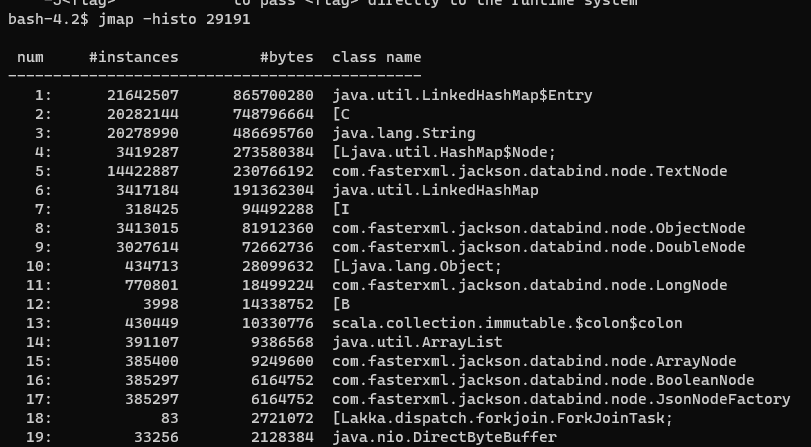
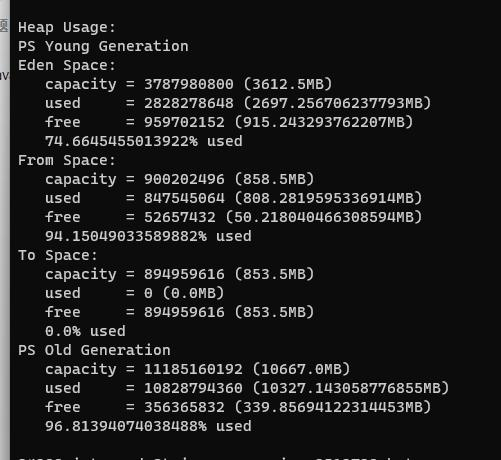

## 1- 确定节点,containerID

- 在CDH上查看对应的Job 并打开taskManager 列表，并选择一个taskManager


## 2- ssh 登陆该服务器


## 3- 查询进程ID

- 根据containerID 查询 进程ID
- containerID   :  container_1671428673955_0719_01_000003 


## 4- 查询top信息

- 根据进程ID 查询top信息


## 5- jinfo 命令 


## 6- jmap命令

- jmap -heap  PID
- jmap -histo PID

``` properties
#查看整个JVM内存状态 
jmap -heap [pid]
#要注意的是在使用CMS GC 情况下，jmap -heap的执行有可能会导致JAVA 进程挂起
 
#查看JVM堆中对象详细占用情况
jmap -histo [pid]
 
#导出整个JVM 中内存信息
jmap -dump:format=b,file=文件名 [pid]
```







