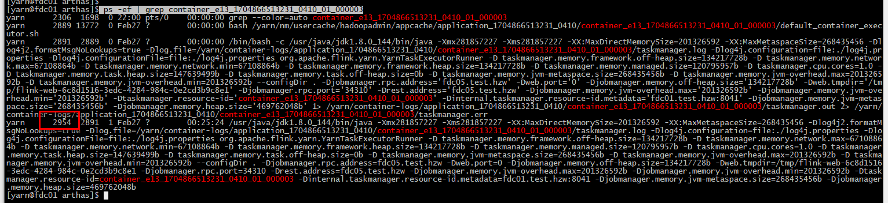
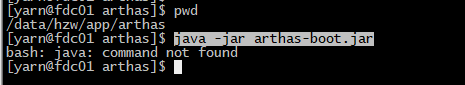
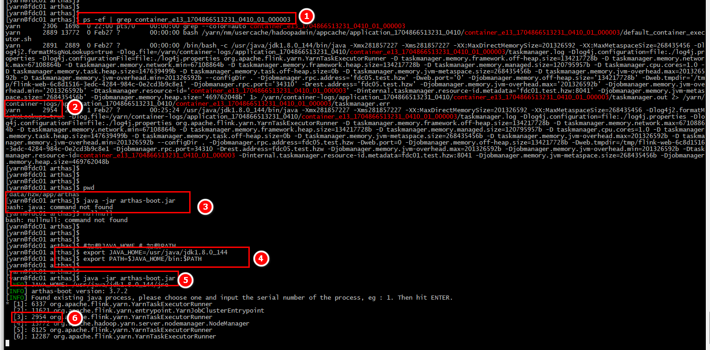
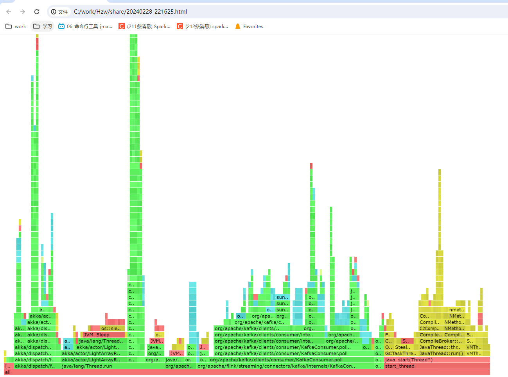

## 1- 确定节点,containerID

- 在CDH上查看对应的Job 并打开taskManager 列表，并选择一个taskManager


## 2- ssh 登陆该服务器


## 3- 查询进程ID

- 根据containerID 查询 进程ID
- containerID   :  container_1671428673955_0719_01_000003 

`ps -ef | grep  container_1671428673955_0719_01_000003`


## 4- 查询top信息

- 根据进程ID 查询top信息

`top -p 5071`

C


## 5- jvm 命令行工具 

``` properties
#登陆服务器节点 密码: Passw00rd
ssh fdc05  

# 登陆yarn 用户
sudo -su yarn 

#加载JAVA_HOME # 加载PATH
export JAVA_HOME=/usr/java/jdk1.8.0_144
export PATH=$JAVA_HOME/bin:$PATH

# jinfo 命令
jinfo -flags 13145

# jstat 命令
jstat -gcutil 13145
jstat -gcutil 13145 1000 3

# jmap 命令
jmap -heap 13145
jmap -histo:live 13145 | grep com.hzw
jmap -finalizerinfo 13145
# 生成dump 文件
jmap -dump:live,format=b,file=/tmp/dump.hprof  13145
cd /tmp
ls -shal 
sz dump.hprof
```


## 6- 使用arthas

### 6-1 切换成yarn 用户

- sudo su yarn

```shell
[hadoopadmin@fdc01 arthas]$ 
[hadoopadmin@fdc01 arthas]$ sudo su yarn
[yarn@fdc01 arthas]$ 
```

### 6-2 查看进程ID 

-  ps -ef | grep container_e13_1704866513231_0410_01_000003




### 6-3 启动arthas

- java -jar arthas-boot.jar



- 报错没有权限！
- 重新加载环境变量；

```shell
#加载JAVA_HOME # 加载PATH
export JAVA_HOME=/usr/java/jdk1.8.0_144
export PATH=$JAVA_HOME/bin:$PATH

```

- 重新启动arthas

```shell
[yarn@fdc01 arthas]$ ps -ef | grep container_e13_1704866513231_0410_01_000003
yarn      2306  1698  0 22:00 pts/0    00:00:00 grep --color=auto container_e13_1704866513231_0410_01_000003
yarn      2889 13772  0 Feb27 ?        00:00:00 bash /yarn/nm/usercache/hadoopadmin/appcache/application_1704866513231_0410/container_e13_1704866513231_0410_01_000003/default_container_executor.sh
yarn      2891  2889  0 Feb27 ?        00:00:00 /bin/bash -c /usr/java/jdk1.8.0_144/bin/java -Xmx281857227 -Xms281857227 -XX:MaxDirectMemorySize=201326592 -XX:MaxMetaspaceSize=268435456 -Dlog4j2.formatMsgNoLookups=true -Dlog.file=/yarn/container-logs/application_1704866513231_0410/container_e13_1704866513231_0410_01_000003/taskmanager.log -Dlog4j.configuration=file:./log4j.properties -Dlog4j.configurationFile=file:./log4j.properties org.apache.flink.yarn.YarnTaskExecutorRunner -D taskmanager.memory.framework.off-heap.size=134217728b -D taskmanager.memory.network.max=67108864b -D taskmanager.memory.network.min=67108864b -D taskmanager.memory.framework.heap.size=134217728b -D taskmanager.memory.managed.size=120795957b -D taskmanager.cpu.cores=1.0 -D taskmanager.memory.task.heap.size=147639499b -D taskmanager.memory.task.off-heap.size=0b -D taskmanager.memory.jvm-metaspace.size=268435456b -D taskmanager.memory.jvm-overhead.max=201326592b -D taskmanager.memory.jvm-overhead.min=201326592b --configDir . -Djobmanager.rpc.address='fdc05.test.hzw' -Dweb.port='0' -Djobmanager.memory.off-heap.size='134217728b' -Dweb.tmpdir='/tmp/flink-web-6c8d1516-3edc-4284-984c-0e2cd3b9c8e1' -Djobmanager.rpc.port='34310' -Drest.address='fdc05.test.hzw' -Djobmanager.memory.jvm-overhead.max='201326592b' -Djobmanager.memory.jvm-overhead.min='201326592b' -Dtaskmanager.resource-id='container_e13_1704866513231_0410_01_000003' -Dinternal.taskmanager.resource-id.metadata='fdc01.test.hzw:8041' -Djobmanager.memory.jvm-metaspace.size='268435456b' -Djobmanager.memory.heap.size='469762048b' 1> /yarn/container-logs/application_1704866513231_0410/container_e13_1704866513231_0410_01_000003/taskmanager.out 2> /yarn/container-logs/application_1704866513231_0410/container_e13_1704866513231_0410_01_000003/taskmanager.err
yarn      2954  2891  1 Feb27 ?        00:25:24 /usr/java/jdk1.8.0_144/bin/java -Xmx281857227 -Xms281857227 -XX:MaxDirectMemorySize=201326592 -XX:MaxMetaspaceSize=268435456 -Dlog4j2.formatMsgNoLookups=true -Dlog.file=/yarn/container-logs/application_1704866513231_0410/container_e13_1704866513231_0410_01_000003/taskmanager.log -Dlog4j.configuration=file:./log4j.properties -Dlog4j.configurationFile=file:./log4j.properties org.apache.flink.yarn.YarnTaskExecutorRunner -D taskmanager.memory.framework.off-heap.size=134217728b -D taskmanager.memory.network.max=67108864b -D taskmanager.memory.network.min=67108864b -D taskmanager.memory.framework.heap.size=134217728b -D taskmanager.memory.managed.size=120795957b -D taskmanager.cpu.cores=1.0 -D taskmanager.memory.task.heap.size=147639499b -D taskmanager.memory.task.off-heap.size=0b -D taskmanager.memory.jvm-metaspace.size=268435456b -D taskmanager.memory.jvm-overhead.max=201326592b -D taskmanager.memory.jvm-overhead.min=201326592b --configDir . -Djobmanager.rpc.address=fdc05.test.hzw -Dweb.port=0 -Djobmanager.memory.off-heap.size=134217728b -Dweb.tmpdir=/tmp/flink-web-6c8d1516-3edc-4284-984c-0e2cd3b9c8e1 -Djobmanager.rpc.port=34310 -Drest.address=fdc05.test.hzw -Djobmanager.memory.jvm-overhead.max=201326592b -Djobmanager.memory.jvm-overhead.min=201326592b -Dtaskmanager.resource-id=container_e13_1704866513231_0410_01_000003 -Dinternal.taskmanager.resource-id.metadata=fdc01.test.hzw:8041 -Djobmanager.memory.jvm-metaspace.size=268435456b -Djobmanager.memory.heap.size=469762048b
[yarn@fdc01 arthas]$ 
[yarn@fdc01 arthas]$ 
[yarn@fdc01 arthas]$ 
[yarn@fdc01 arthas]$ pwd
/data/hzw/app/arthas
[yarn@fdc01 arthas]$ java -jar arthas-boot.jar 
bash: java: command not found
[yarn@fdc01 arthas]$ nullnull
bash: nullnull: command not found
[yarn@fdc01 arthas]$ 
[yarn@fdc01 arthas]$ 
[yarn@fdc01 arthas]$ 
[yarn@fdc01 arthas]$ #加载JAVA_HOME # 加载PATH
[yarn@fdc01 arthas]$ export JAVA_HOME=/usr/java/jdk1.8.0_144
[yarn@fdc01 arthas]$ export PATH=$JAVA_HOME/bin:$PATH
[yarn@fdc01 arthas]$ 
[yarn@fdc01 arthas]$ java -jar arthas-boot.jar 
[INFO] JAVA_HOME: /usr/java/jdk1.8.0_144/jre
[INFO] arthas-boot version: 3.7.2
[INFO] Found existing java process, please choose one and input the serial number of the process, eg : 1. Then hit ENTER.
* [1]: 6337 org.apache.flink.yarn.YarnTaskExecutorRunner
  [2]: 11621 org.apache.flink.yarn.entrypoint.YarnJobClusterEntrypoint
  [3]: 2954 org.apache.flink.yarn.YarnTaskExecutorRunner
  [4]: 13772 org.apache.hadoop.yarn.server.nodemanager.NodeManager
  [5]: 8125 org.apache.flink.yarn.YarnTaskExecutorRunner
  [6]: 12287 org.apache.flink.yarn.YarnTaskExecutorRunner
3
[INFO] arthas home: /var/lib/hadoop-yarn/.arthas/lib/3.7.2/arthas
[INFO] Try to attach process 2954
Picked up JAVA_TOOL_OPTIONS: 
[INFO] Attach process 2954 success.
[INFO] arthas-client connect 127.0.0.1 3658
  ,---.  ,------. ,--------.,--.  ,--.  ,---.   ,---.                           
 /  O  \ |  .--. ''--.  .--'|  '--'  | /  O  \ '   .-'                          
|  .-.  ||  '--'.'   |  |   |  .--.  ||  .-.  |`.  `-.                          
|  | |  ||  |\  \    |  |   |  |  |  ||  | |  |.-'    |                         
`--' `--'`--' '--'   `--'   `--'  `--'`--' `--'`-----'                          

wiki       https://arthas.aliyun.com/doc                                        
tutorials  https://arthas.aliyun.com/doc/arthas-tutorials.html                  
version    3.7.2                                                                
main_class                                                                      
pid        2954                                                                 
time       2024-02-28 22:06:33                                                  

[arthas@2954]$
```




### 6-4 启动火焰图

- profiler start  ： 启动 profiler

  ```properties
  提示
  
  默认情况下，生成的是 cpu 的火焰图，即 event 为cpu。可以用--event参数来指定。
  
  获取已采集的 sample 的数量
  ```

  

- profiler status ：查看 profiler 状态

- profiler getSamples ：获取已采集的 sample 的数量

- profiler  stop --format html：停止 profiler

  ``` properties
  默认情况下，结果文件是html格式，也可以用--format参数指定：profiler stop --format html
  或者在--file参数里用文件名指名格式。比如--file /tmp/result.html;
  ```

  

- stop : 安全退出arthas

``` shell
[arthas@2954]$ 
[arthas@2954]$ profiler start
Profiling started
[arthas@2954]$ p
perfcounter pwd         profiler    plaintext   
[arthas@2954]$ profiler status
Profiling is running for 22 seconds
[arthas@2954]$ profiler getSamples
14
[arthas@2954]$ profiler getSamples
14
[arthas@2954]$ profiler getSamples
16
[arthas@2954]$ profiler getSamples
60
[arthas@2954]$ nullnull
java.lang.IllegalArgumentException: nullnull: command not found
[arthas@2954]$ profiler getSamples
134
[arthas@2954]$ profiler getSamples
182
[arthas@2954]$ profiler  stop --format html
OK
profiler output file: /yarn/nm/usercache/hadoopadmin/appcache/application_1704866513231_0410/container_e13_1704866513231_0410_01_000003/arthas-output/20240228-221625.html
[arthas@2954]$ stop
```




