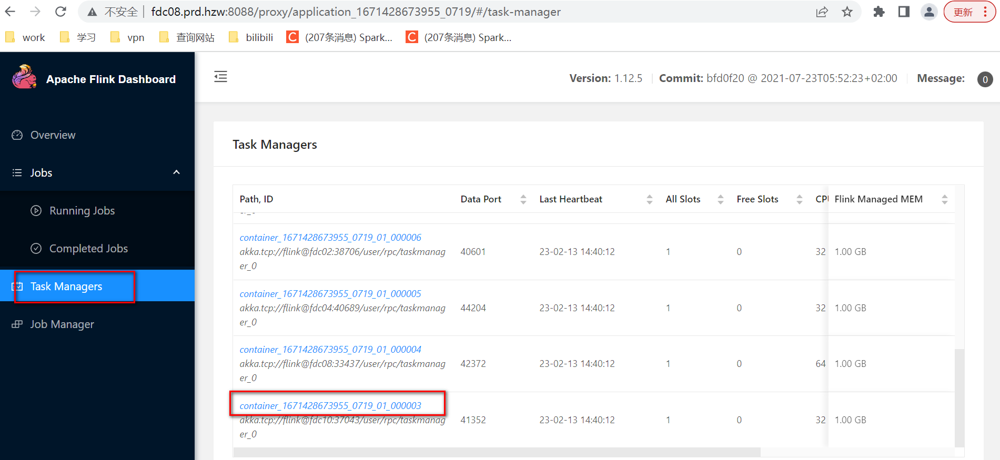
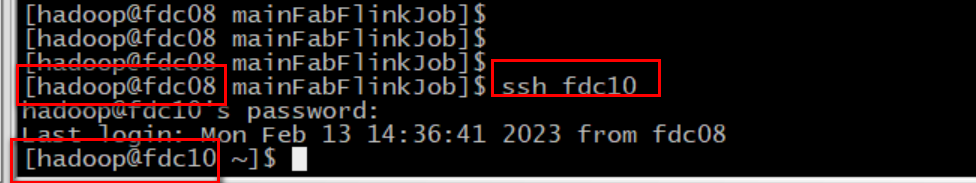
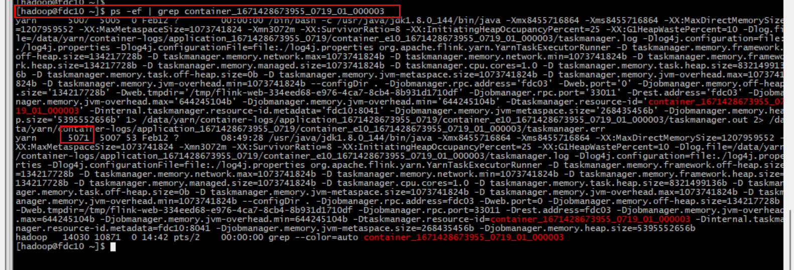
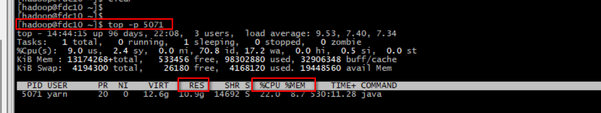

## 1- 确定节点,containerID

- 在CDH上查看对应的Job 并打开taskManager 列表，并选择一个taskManager



## 2- ssh 登陆该服务器



## 3- 查询进程ID

- 根据containerID 查询 进程ID
- containerID   :  container_1671428673955_0719_01_000003 

`ps -ef | grep  container_1671428673955_0719_01_000003`



## 4- 查询top信息

- 根据进程ID 查询top信息

`top -p 5071`

C




## 5- jvm 命令行工具 

``` properties
#登陆服务器节点 密码: Passw00rd
ssh fdc05  

# 登陆yarn 用户
sudo -su yarn 

#加载JAVA_HOME # 加载PATH
export JAVA_HOME=/usr/java/jdk1.8.0_144
export PATH=$JAVA_HOME/bin:$PATH

# jinfo 命令
jinfo -flags 13145

# jstat 命令
jstat -gcutil 13145
jstat -gcutil 13145 1000 3

# jmap 命令
jmap -heap 13145
jmap -histo:live 13145 | grep com.hzw
jmap -finalizerinfo 13145
# 生成dump 文件
jmap -dump:live,format=b,file=/tmp/dump.hprof  13145
cd /tmp
ls -shal 
sz dump.hprof
```


