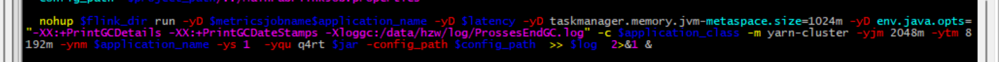
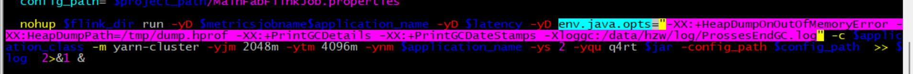

## 0- 常用提交参数

``` shell
bin/flink run \
-t yarn-per-job \
-d \
-p 5 \
-Drest.flamegraph.enabled=true \
-Dyarn.application.queue=test \
-Djobmanager.memory.process.size=1024mb \
-Dtaskmanager.memory.process.size=4096mb \
-Dtaskmanager.numberOfTaskSlots=2 \
-Dstate.backend.incremental=true \
-Dstate.backend.local-recovery=true \
-Dstate.backend.rocksdb.predefined-options=SPINNING_DISK_OPTIMIZED_HIGH_MEM \
-Dstate.backend.rocksdb.block.cache-size=64m \
-Dstate.backend.rocksdb.writebuffer.size=128m \
-Dstate.backend.rocksdb.compaction.level.max-size-level-base=320m \
-Dstate.backend.rocksdb.writebuffer.count=5 \
-Dstate.backend.rocksdb.thread.num=4 \
-Dstate.backend.rocksdb.writebuffer.number-to-merge=3 \
-Dstate.backend.rocksdb.memory.partitioned-index-filters=true \
-Dstate.backend.latency-track.keyed-state-enabled=true \
-c com.atguigu.flink.tuning.RocksdbTuning \
/opt/module/flink-1.13.1/myjar/flink-tuning-1.0-SNAPSHOT.jar
```

### 解释：

- **state.backend.incremental=true**
  - 增量；
- **state.backend.local-recovery=true**
  - 本地恢复 ；
- **state.backend.rocksdb.predefined-options=SPINNING_DISK_OPTIMIZED_HIGH_MEM**
  - 预定义选项 ；
- **state.backend.rocksdb.block.cache-size=64m**
  - 块缓存大小 ；
  - 用于优化**读**场景 ；
  - 默认值8m ；
- **state.backend.rocksdb.writebuffer.size=128m**
  - writebuffer大小 ；
  - 用于优化**写**场景 ；
  - 默认64m ;
- **state.backend.rocksdb.compaction.level.max-size-level-base=320m**
  - writebuffer level ；
  - 用于优化**写**场景 ；
  - 默认为256m ;
- **state.backend.rocksdb.writebuffer.count=5**
  - writebuffer 的个数；
  - 用于优化**写**场景；
  - 默认为2；
- **state.backend.rocksdb.thread.num=4**
  - 刷写磁盘是的并行度；
  - 用于优化**写**场景；
  - 默认为1；
- **state.backend.rocksdb.writebuffer.number-to-merge=3**
  - 多少个文件才开始merge;
  - 用于优化**写**场景；
  - 默认为1；
- **state.backend.rocksdb.memory.partitioned-index-filters=true**
  - 开启分区索引功能；
  - 适用于内存比较小的场景；
  - 一般不用开启；
- **state.backend.latency-track.keyed-state-enabled=true**
  - 开启访问状态的性能监控；
  - 1.13 才有；

## 1- 打印GC 日志信息

``` reStructuredText
-yD env.java.opts=
"-XX:+PrintGCDetails -XX:+PrintGCDateStamps -Xloggc:/data/hzw/log/ProssesEndGC.log"
```




## 2- 设置jvm内存

``` reStructuredText
-yD taskmanager.memory.jvm-metaspace.size=1024m
```


## 3- 设置管理内存

``` reStructuredText
-yD taskmanager.memory.managed.size=2048m
```


## 4- 设置dump文件

``` reStructuredText
-yD env.java.opts=
"-XX:+HeapDumpOnOutOfMemoryError -XX:HeapDumpPath=/tmp/dump.hprof"
```




