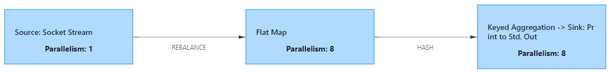
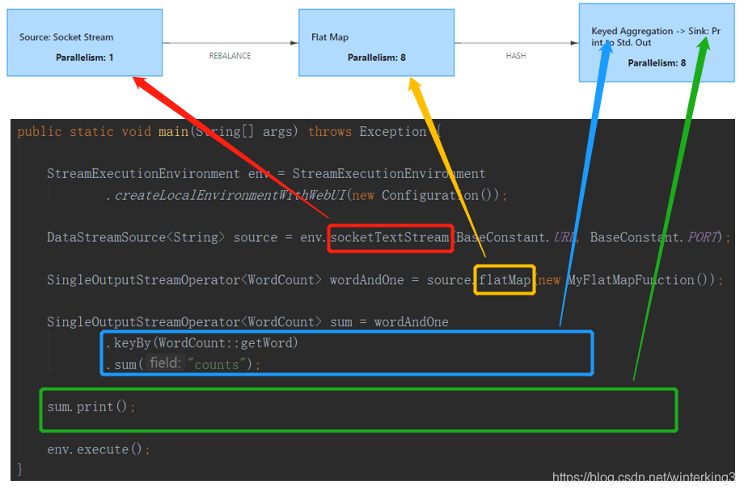
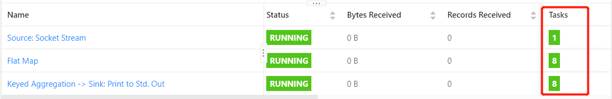
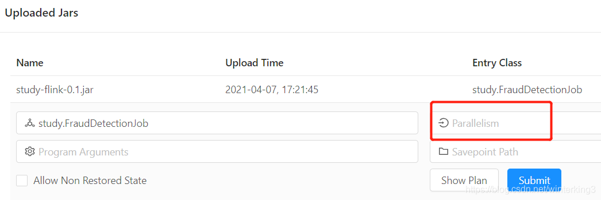
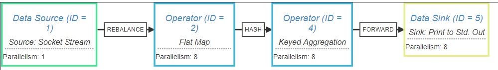
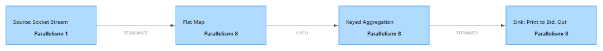
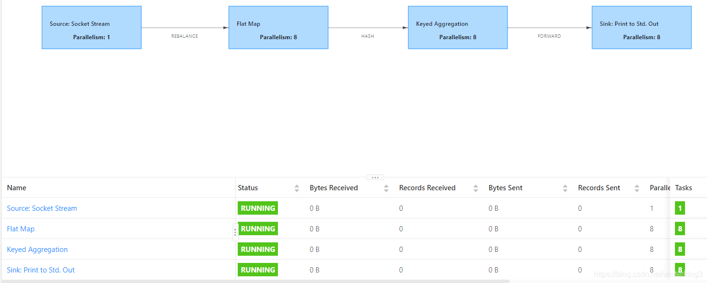
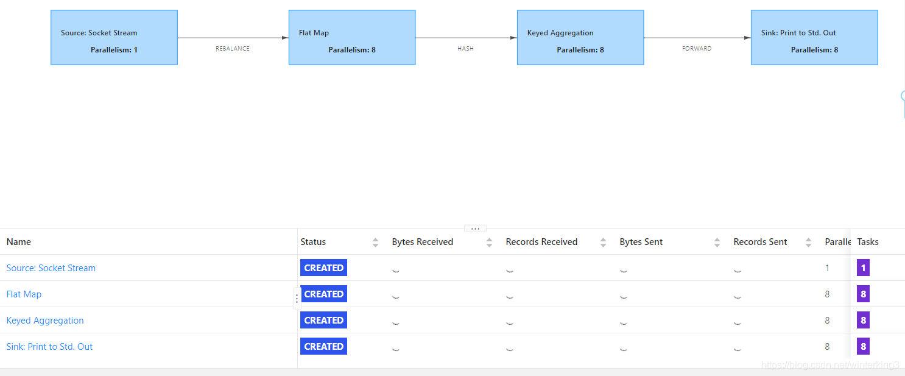

[TOC]


# 详解 算子链 并行度 Task



## 1- WordCount程序的Job Graph(任务图)

```java
public static void main(String[] args) throws Exception {

    StreamExecutionEnvironment env = StreamExecutionEnvironment
    		.createLocalEnvironmentWithWebUI(new Configuration());

    DataStreamSource<String> source = env.socketTextStream(BaseConstant.URL, BaseConstant.PORT);

    SingleOutputStreamOperator<WordCount> wordAndOne = source.flatMap(new MyFlatMapFunction());

    SingleOutputStreamOperator<WordCount> sum = wordAndOne
            .keyBy(WordCount::getWord)
            .sum("counts");

    sum.print();

    env.execute();
}

```

### 1-1  代码和Job Graph(任务图)的对应关系

- **socketTextStream**对应第1个**Source: Socket Stream**
- **flatMap**对应第2个**Flat Map**
- **keyBy和sum**对应第3个中的**Keyed Aggregation**
- **print**对应第3个中的**Sink: Print to Std.Out**



从上图可以清晰看出代码中的算子和任务Task的对应关系了。

- 框中的Parallelism：1和Parallelism：8是什么意思？
- 为什么Socket Stream的Parallelism是1，后面2个的Parallelism是8？
- 为什么第3个的Keyed Aggregation和Sink会在同一个框中？
- 方块之间的箭头上有REBALANCE和HASH是什么意思？
  

### 1-2 什么是并行度Parallelism?


- 上图中**一个框表示一个算子**（是Flink优化过后的算子，例如第3个框中**2个算子优化成了一个算子**）;
- 为了方便理解，这个算子也叫做任务（**Task**），一个Task就是一个**进程** ;
- Flink为了提高性能，一个**Task进程**可分为多个**线程**并行执行;
- **Task进程**内的一个**线程**可以称为**SubTask**;
- 那并行度就是一个**Task进程**内有几个**线程**的意思;
  - 即一个**Task**分为了几个**SubTask** ;



上图Tasks这一列就是说明这个**Task**分为了几个**SubTask**。


### 1-3 为什么[Socket](https://so.csdn.net/so/search?q=Socket&spm=1001.2101.3001.7020) Stream的并行度是1，后面2个的并行度是8？

我的电脑CPU是四核八线程，就是理论上可以同一时间执行8个线程（就当自己CPU有8个核吧）。

那Flink的Task默认的并行度就是CPU的核数，所以FlatMap的并行度是8。

但是Socket是监听某一个端口，并行度固定只能是1。


### 1-4 如何设置并行度？

- 一个Flink程序中，不同的算子可以有不同的并行度；

- 设置并行度的地方也有好几个；

#### 1-4-1 Flink配置文件

` /conf/flink-conf.yaml 文件的  parallelism.defaul数值`


#### 1-4-2 WebUI或者CLI



#### 1-4-3 控制台提交任务时 -p 参数设置

` ./bin/flink run -p 3` 

#### 1-4-4 代码中设置env全局并行度

`env.setParallelism(3);`

#### 1-4-5 代码中设置算子的并行度

- 一些算子后面可以加setParallelism()设置并行度

` sum(1).setParallelism(3)`

#### 1-4-6  并行度的优先级

不同地方设置的并行度的优先级不同，高优先级的会覆盖低优先级的。

**算子 > 全局env > WebUI&CLI (提交任务 参数 -p) > 配置文件**


## 2- 算子合并优化机制


### 2-1 WordCount的[Stream](https://so.csdn.net/so/search?q=Stream&spm=1001.2101.3001.7020) Graph

- 上面3个框的Job Graph(任务图)是由客户端根据Stream Graph优化后生成的。
- 就是说客户端先生成Stream Graph，再生成Job Graph。
- JobJobManager接收到客户端的Job Graph，会生成执行图。
- 因为只有JobManager知道TaskManger的Slot槽数量

在代码中env.execute()上一行添加如下语句。

``` java
添加这条语句，打印执行计划
System.out.println(env.getExecutionPlan());

env.execute();
```

控制台会打印如下JSON：

```json
{
  "nodes" : [ {
    "id" : 1,
    "type" : "Source: Socket Stream",
    "pact" : "Data Source",
    "contents" : "Source: Socket Stream",
    "parallelism" : 1
  }, {
    "id" : 2,
    "type" : "Flat Map",
    "pact" : "Operator",
    "contents" : "Flat Map",
    "parallelism" : 8,
    "predecessors" : [ {
      "id" : 1,
      "ship_strategy" : "REBALANCE",
      "side" : "second"
    } ]
  }, {
    "id" : 4,
    "type" : "Keyed Aggregation",
    "pact" : "Operator",
    "contents" : "Keyed Aggregation",
    "parallelism" : 8,
    "predecessors" : [ {
      "id" : 2,
      "ship_strategy" : "HASH",
      "side" : "second"
    } ]
  }, {
    "id" : 5,
    "type" : "Sink: Print to Std. Out",
    "pact" : "Data Sink",
    "contents" : "Sink: Print to Std. Out",
    "parallelism" : 8,
    "predecessors" : [ {
      "id" : 4,
      "ship_strategy" : "FORWARD",
      "side" : "second"
    } ]
  } ]
}

```

将JSON粘贴到下面的网址，会生成执行图

https://flink.apache.org/visualizer/



**可以发现在客户端优化之前，Keyed Aggregation和Sink是2个不同的算子**。

### 2-2 在Job Graph中，Keyed Aggregation和Sink为啥合并?

- 首先假设不合并它们，那么**Keyed Aggregation**和**Sink**各自为1个进程。那么这2个进程之间的**数据传输和切换**都是比较消耗系统资源的。

- 如果把它们2个合并成一个进程，那么**进程内共享数据**，就**不需要传输数据**，也**没有切换进程**的开销。
- 注意：
  - Keyed Aggregation和Sink的**并行度相同**，且它们的**关系是FORWARD**，那么它们才可以合并。
  - Source: Socket的并行度=1，Flat Map的并行度=8，**关系是REBALANCE**，不能合并。
  - Flat Map和Keyed Aggregation的并行度相同，但是关系是**HASH**，不能合并。
    

## 3- 手动设置算子链

### 3-1 disableChaining取消算子链

如果对一个算子使用了disableChaining（取消任务链），那么该算子就会与前后算子隔离开，不参与任务链的合并。

下面代码设置print算子独立，会发现任务图中Sink: Print的确是独立的。

`sum.print().disableChaining();`




### 3-2 startNewChain

如果一个任务链只是过于庞大，但是算子之间的操作简单，仅想拆开为2个任务链，并且参与任务链组合，就需要对算子使用**startNewChain(开启一个新的任务链)**，意思就是之前该怎么合并就怎么合并，map之后重新合成任务链。

### 3-3 env.disableOperatorChaining

`env.disableOperatorChaining()是全局禁用合并`

在WordCount中设置env.disableOperatorChaining()

``` java
StreamExecutionEnvironment env = StreamExecutionEnvironment
        .createLocalEnvironmentWithWebUI(new Configuration());

// 添加这1行
env.disableOperatorChaining();

DataStreamSource<String> source = env.socketTextStream(BaseConstant.URL, BaseConstant.PORT);

```



注意上图Status的列是**RUUNING，**说明任务已经运行中了。


### 3-4 slotSharingGroup

默认情况下所有Operator的slotGroup都为default，可以通过slotSharingGroup()进行自定义。

Flink会将拥有相同slotGroup名称的Operators运行在相同Slot内，不同slotGroup名称的Operators运行在其他Slot内。
`sum.print().slotSharingGroup("print group");`



从上图看出Status这列是**CREATED**，说明还没有运行起来，任务在**等待足够的slot的资源**才能运行。