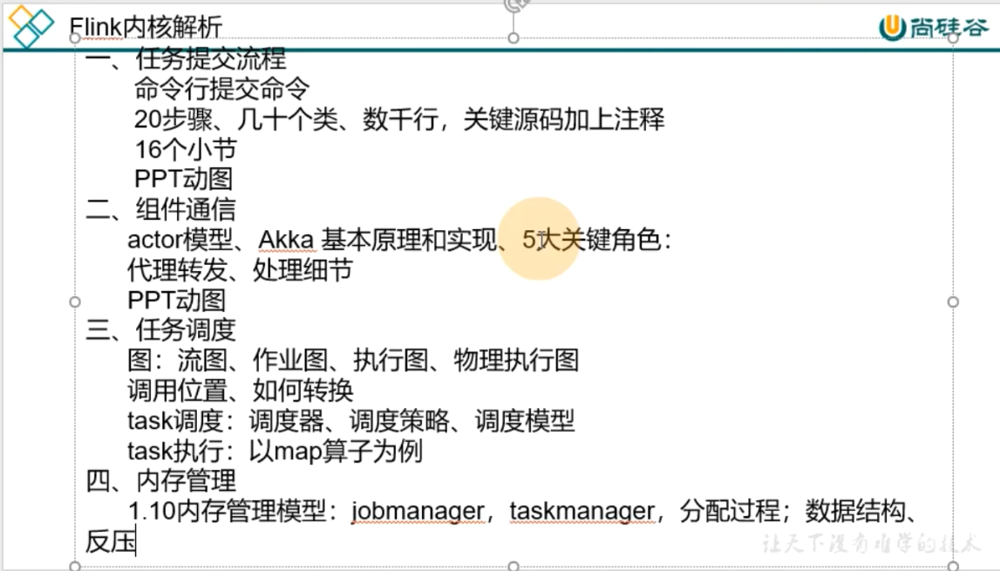

[TOC]

# Flink内核解析

## 1- 任务提交流程

- 命令行提交命令
- 20步骤，几十个类，数千行代码，关键源码加上注释；
- 16个小节
- PPT动图

## 2- 组件通信

- actor模型
- Akka基本原理和实现
- 5大关键角色
- 代理转发
- 处理细节
- PPT动图

## 3- 任务调度

- 图：流图，作业图，执行图，物理执行图
- 调用位置，如何转换
- task调度: 调度器，调度策略，调度模型
- task执行：以map算子为例

## 4- 内存管理

- 1.10版本内存管理模型： jobmanager,taskmanager,
- 分配过程
- 数据结构
- 反压

