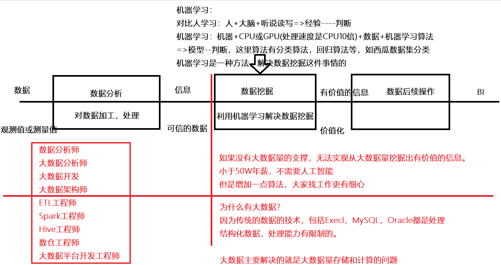
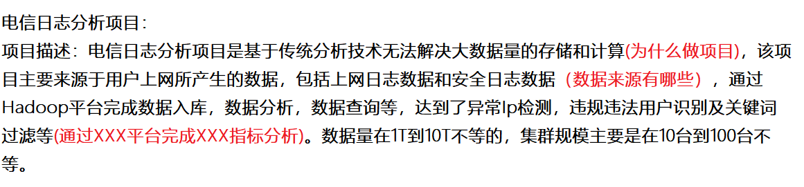
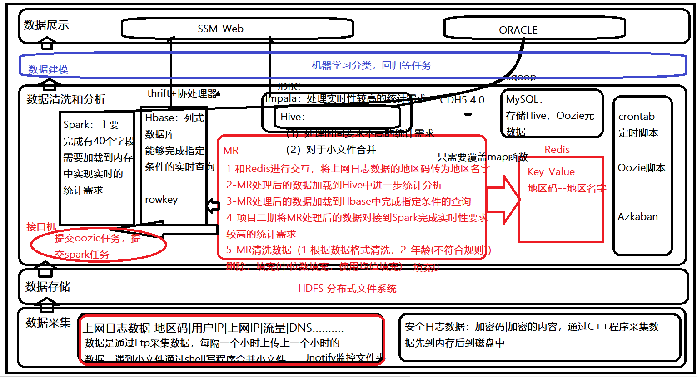
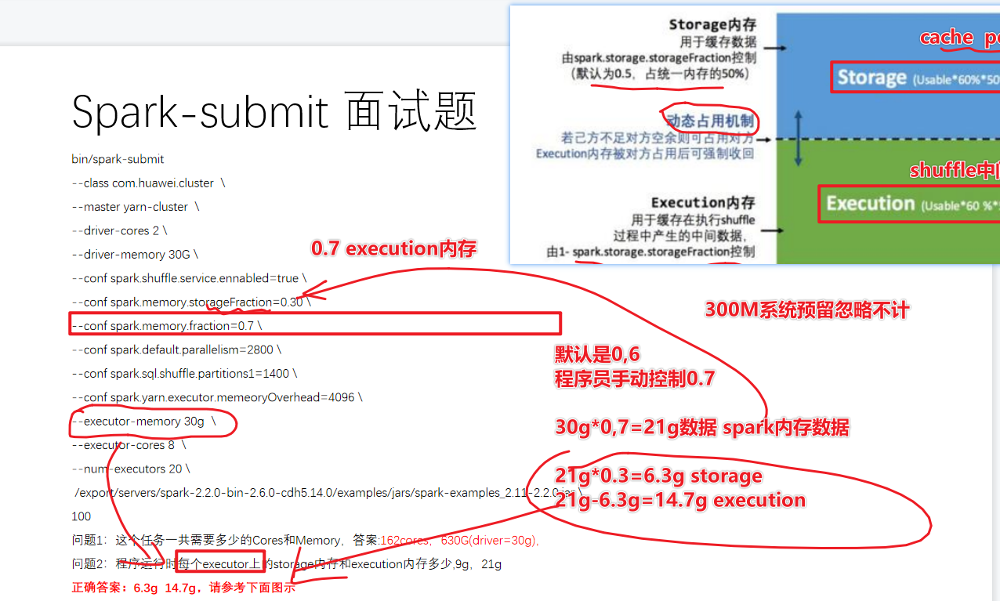

# 课程安排

## 对于数据的认知

什么是数据？
	比如相亲的数据，考试成绩的数据
	数据称之为 **观测值或测量值**
如何实现从数据到信息的过程？
	称之为**数据分析**，也就是对数据加工，处理等过程得到的信息
什么是信息？
	**可信的数据**
如何实现从信息到有价值的信息的过程？
	称之为 **数据挖掘**
	数据挖掘：就是利用机器学习方法，解决数据挖掘这件事情
**有价值的信息**？
	价值化

传统数据存储和计算的问题？
	数据量的增长，**纵向拓展**机器的配置(Hp或Dell小型机，无限增加内存和硬盘，瓶颈)
	大数据的出现，所有的机器是按照**横向拓展**的方式
	分布式：**将若干台机器通过网络将机器连接在一起构建分布式集群**，提供分布式计算和存储
大数据出现：
	1V数据量大---1024KB=1MB，2**10(指数)=1024MB=1GB---数据呈现指数级别增长(必须记住)
			  ---HDFS存储
	2V数据种类多---结构化数据(MySQL，Hive)+半结构化(json，XML，html)+非结构化(图片，视频)
				---对于非结构化数据和半结构化数据需要转化为结构化数据，进而进行分析
				---数据仓库-存放的是结构化的数据-Hive-结构化存储和分析
				---数据湖-既可以存放半结构化，非结构化，结构化
				---HDFS存储，MR计算
	3V速度快：数据增长速度快，数据处理速度快
				---数据呈现指数级别增长
				---离线计算-近实时的计算--实时计算
				---MR-HIve-SparkSQL-SparkCOre-Impala 
				---SparkStreaming
				---StructuredStreaming+FLink
	4V价值密度低：数据挖掘问题，从大量的数据中挖掘出有价值的信息
				---机器学习是一种方法
第一代计算框架：MR
第二代计算框架：部分支持DAG-Hive(底层可以选择Spark，或Tez)
第三代计算框架：完全支持DAG(Spark和Impala)
第四代计算框架：FLink支持批流统一

* 注意事项：所有大数据框架学习
* 1-大数据组件的学习
  * 1-首先将大数据组件的tar.gz的包下载下来，如果没有直接可以编译
  * 2-解压tar.gz
  * 3-更改配置
  * 4-调用JavaAPI
  * 5-调用Scala的API
  * 6-做个案例
  * 如果后续要更多的组件首先查看官网，通过官网下载包并且API学习
* 2-大数据本质上
  * 主从结构-Spark中Master和Worker结构
  * 主备结构-Spark中2个以上Master，一个主ActiVe的Master，一个是StandBy的Master(状态的信息保存zk中)

## 面试软技能-面试的基础指导

* 主要讲解面试技巧或需要做哪些准备

## 项目选择

* 如何从9个项目中实现选择
* 如何讲解项目？
  * 自我介绍
    * 越简单越好：**面试官您好，我是XXX，来自于XXX地方，毕业于XXX大学，之前主要做的是XXX行业大数据相关业务和技术，今天来到咱们公司主要是想看看有合适的机会没有。**
  * 投递简历：
    * 大家需要注意：
    * 1-所有技能点的首字母必须大写
    * 2-技能点的掌握至少需要3个以上的点，熟悉和了解点尽可能少一些
    * 3-尽量将熟悉改为“能够利用XXXXX技术完成XXXX相关分析或数据抽取等等”
    * 4-一定增加1-2个对于技术栈的优化
    * 5-项目部分：描述部分非常重要：
    * **该项目为什么而来？项目的数据源是什么？项目的技术栈？达到了什么业务分析目标？数据量？集群规模？**
    * 6-项目架构：
      * 数据采集
      * 数据存储
      * 数据ETL
      * 数据分析
      * 数据建模
      * 数据展示
  * 讲解项目
    * 
    * 
    * 具体讲解一个业务指标：
      * 需要根据SQL，从数据采集到数据展示全链路讲解
      * **具体讲解思路参考，给大家发在群里的徐顺同学的讲解**
  * 讲解具体技术
    * 模板：
    * 1-是什么
    * 2-原理是什么
    * 3-工作中如何使用
    * 4-工作中优化
    * 5-多场景扩展
    * 
    * 问题，spark的reduceBykey和groupbyKey的区别和联系有啥
    * 0-都是为了根据Key对Value进行操作的算子
    * 1-回答本质问题：
      * reduceBykey有一个mapJoin的构成，提前预聚合
      * groupByKey是全局的聚合
    * 2-两个算子的底层都是基于CombineByKey，(初始值,分区内操作,分区间的操作)
    * 3-对于ByKey类的算子常规情况下会产生Shuffle？
      * 比如对于GroupByKey算子，在分区器一致的情况下，分区个数一致的情况下，不会产生shuffle
      * 只要分区器不同，或者分区个数不一致都会产生shuffle
    * 4-两个算子在工作中应用场景？
      * 更加建议使用reduceByKey，因为预聚合同时可以实现运算
      * 在教育项目中使用reduceByKey解决相同学生的成绩的累加
* 如何讲解知识点？

## 核心面试题准备

* 以1道华为面试题为主，阐述如何多个知识点关联

## Hive及数仓基础知识

* 复习Hive
* 复习数仓

## 教育项目数仓为背景(离线数仓业务)

* 以一条主线为主贯穿教育项目数仓，一个指标
* 关注：数仓业务
* 关注：数仓分层
* 关注：数据的流转
* 关注：如何分析哪些业务指标

## Hbase及Kafka核心架构

* Hbase
* Kafka--面试题重灾区

## Spark的核心基础及核心面试题

* 大家重点掌握把握的部分
* 整个市场更多的使用HIve和Spark部分
* Flink各个厂都在摸索探索的过程

## 用户画像项目核心业务

* 数据仓库+用户画像+推荐系统

## 机器学习算法初步

* 决策树算法
* KMeans聚类算法

## 总结

* 周日根据技术班主任安排分老师模拟面试

* 
* 