# 面试的软技能-面试的基础技巧

## 简历怎么写

### 查看招聘的职责&常见的技能需求

* 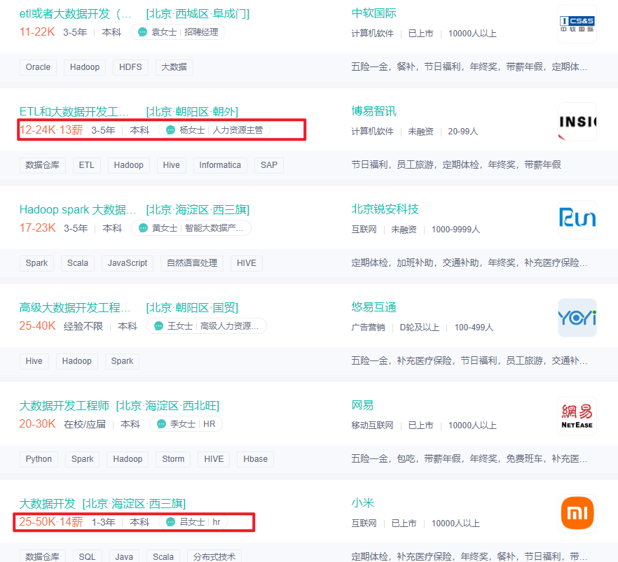
* 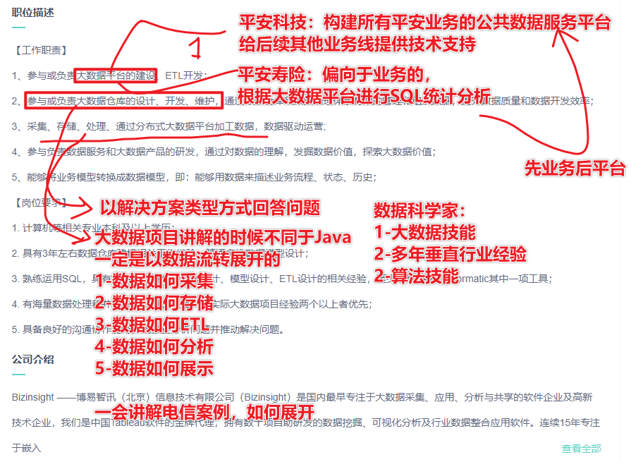

* 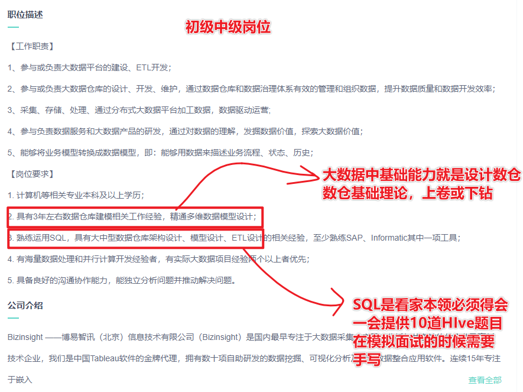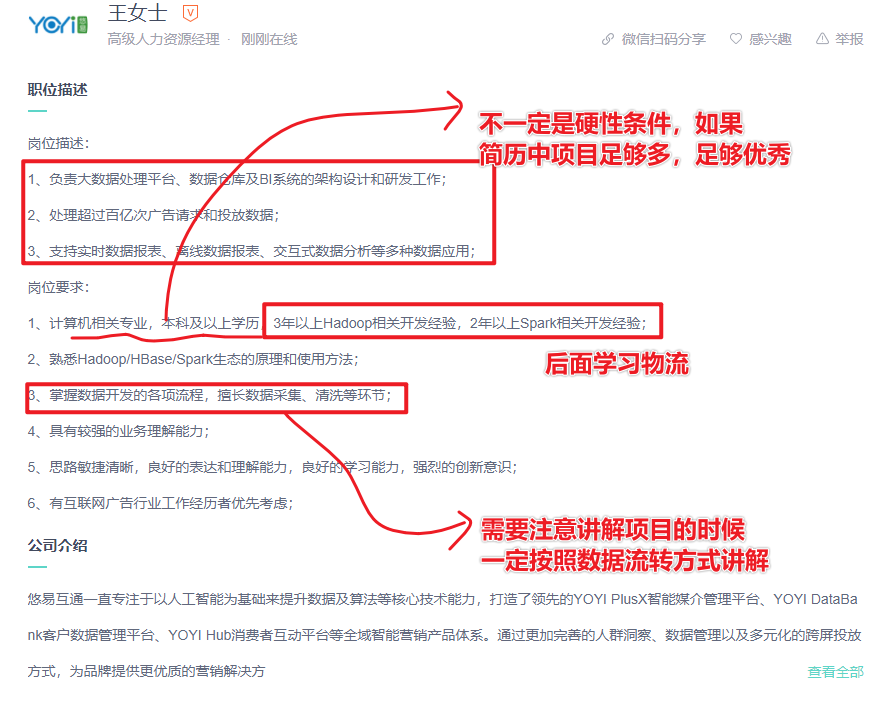
* 
* 初级岗位需求：
* 1-具备1-2门语言基础
* 2-具备数仓理论及构建数仓的经验，了解数仓各种概念和原理
* 3-具备多种大数据存储框架及分析框架基础
* 4-熟悉常用的数据结构，算法，如线性表，链表，排序算法和查找算法
  * 必须掌握的是排序算法中：选择排序和冒泡排序，二分查找方法
* 5-需要了解面试的过程
* 中级岗位：
  * 有行业业务解决方案，会使用Spark或Flink进行数据处理和分析
* 高级岗位：
  * 带团队，有架构设计经验，必须有解决方案思路
* 注意事项：
  * 1-必须掌握的是算法中：选择排序和冒泡排序，二分查找方法
  * 2-面试中肯定手撕代码
    * 1-Hive的wordcount
    * 2-sparkcore的wordcount
    * 3-sparksql的wordcount
    * 4-sparkstreaming的wordcount，手动提交偏移量
    * 5-flink的wordcount
  * 3-需要把握核心的原理
    * HDFS的读写原理
    * MR的计算吧八大步骤
    * Hive转化为MR的步骤？
    * Spark的原理
    * FLink的原理
    * Kafka的原理
    * Hbase的读写原理

### 简历怎么写

* 面试前，以前2个项目的复习关键技术，比如用到Spark和Hive，重点抓这两块

* 简历应该按照什么方式编写？
  * A-应该按照公司的要求是编写简历
    * 误区：一定不要面试一个公司搞一个简历
    * 只需要写好一份完美的简历，投递很多的公司
  * B-应该按照已经具备的项目经验去编写简历
    * 画像项目：海尔，美的
    * 大数据结合画像的业务实现给用户打标签
    * 撰写画像简历
    * 找工作的时候需要根据自己做的画像项目给面试管说清楚
    * 在面试的过程中面试官考察的是你的项目，一般情况给你一个场景场景迁移
  * 以物流项目举例
    * 物流项目-德邦-顺丰
    * 大数据结合物流项目实现智慧物流
    * 撰写物流项目
    * 找工作的视乎结合物流项目说清楚
    * 现在给你一个金融场景，请问如何实现金融场景的大数据分析？场景迁移能力
* 简历撰写的方式？
  * 1-切记切记不要将你的大头贴放到简历中
  * 2-不要找特别花哨的简历模板，就是一个最简单的模板完事，如果实在找不到就用md或word，不要太多留白
  * 3-简历中排班一定给，不要出现在大学中当过学生会主席等无聊的用途，不要出现班级排名，社团活动
  * 4-简历中建议增加CET4或CET6的成绩，因为大数据很多内容都是基于英语的，CET6(500)
  * 5-对于年龄比较小的同学不建议写年龄
  * 6-简历中需要有什么
    * 1-基本的信息(学习经历)
    * 2-工作经验
    * 3-技术要点
    * 4-项目经验
* 技能点如何编写
* 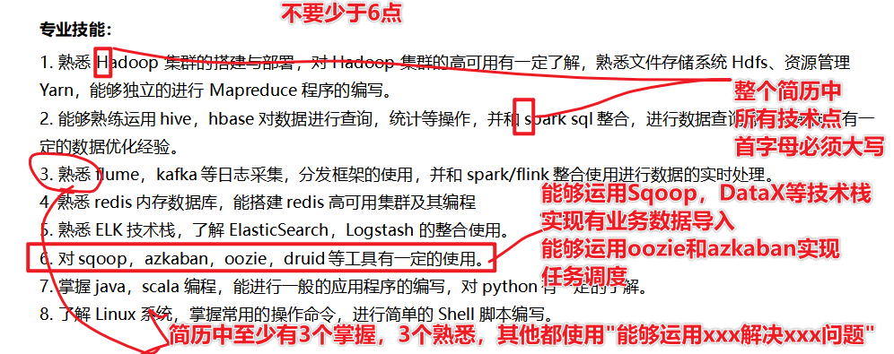
* 项目如何描述？
  * 项目名称：以电信日志分析系统项目为例
  * 项目描述：电信日志分析系统，是以电信用户上网所产生的数据，包括上网日志数据和安全日志数据，通过Hadoop技术栈实现了日志数据入库，分析，查询等目标，为了达到异常IP检测，违规违法用户检测以及关键词过滤等方法。整个项目集群规划从10台到100台，数据量在1T-100T数据量。
  * **该项目如怎么来的？+数据从哪里来+通过什么技术+实现什么业务指标+**数据量和集群规模(可以不写的)
  * 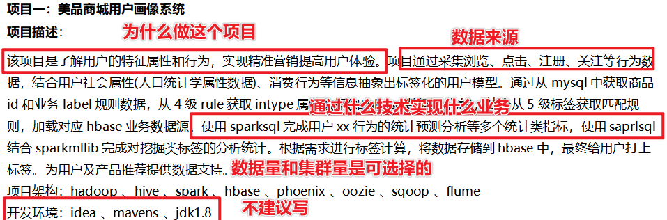
  * 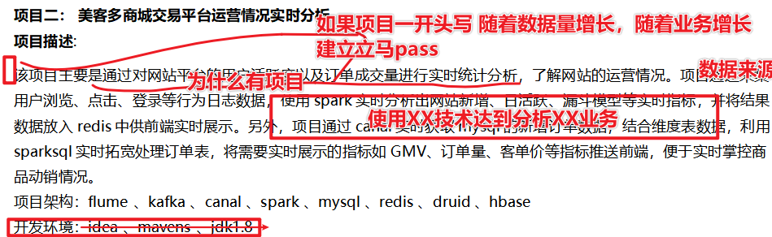
  * 注意：
  * 大家思考、我们是否应该在简历上写项目流程？
    * 没有，如果想应对HR可以写一点，但是不建议写，因为HR不懂技术的，但是这里需要大家猪呢比项目流程和项目架构给面试官看
    * 什么是项目架构？
      * 数据采集：
        * 如何采集：使用FTP采集
        * 采集什么：采集用户日志数据和安全日志数据
        * 采集数据格式：用户日志数据 用户ID|用户IP|访问IP|
        * 什么时候开始采集：每天凌晨1点开始跑批
        * 采集遇到问题：在使用ftp采集的时候遇到大量小文件的问题，可以采用使用shell合并小文件
      * 数据存储
      * 数据ETL
      * 数据分析
      * 数据展示
* 项目职责如何描述？
  * 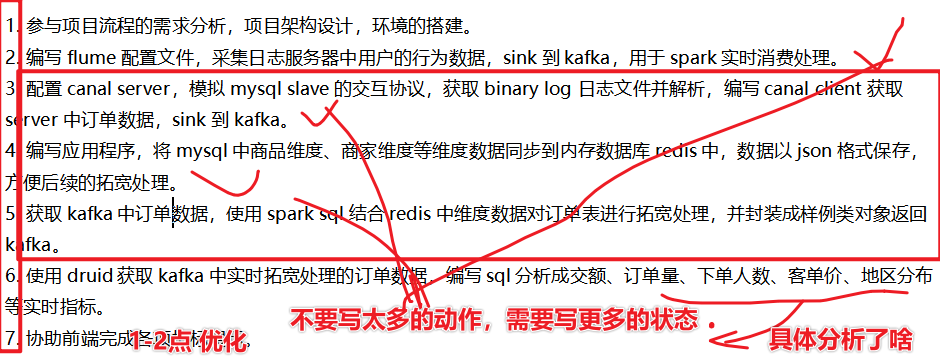
  * 增加项目优化点:
    * 在SparkSQL的基础上优化使用Druid实现电商业务数据的秒级查询
    * 帮助企业提升了10%效率啥的 

## 面试前针对项目如何撰写

* 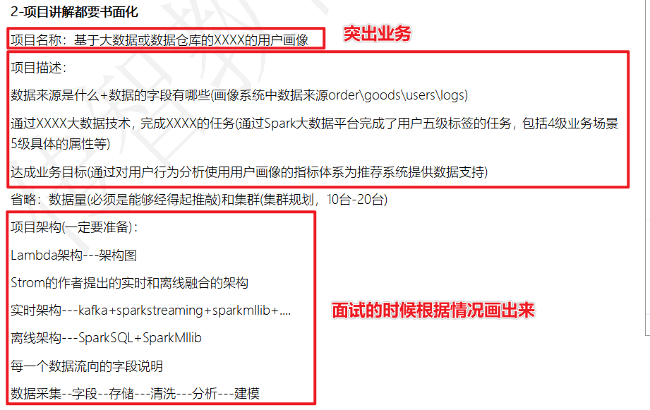

## 面试前对于技能点的撰写

* 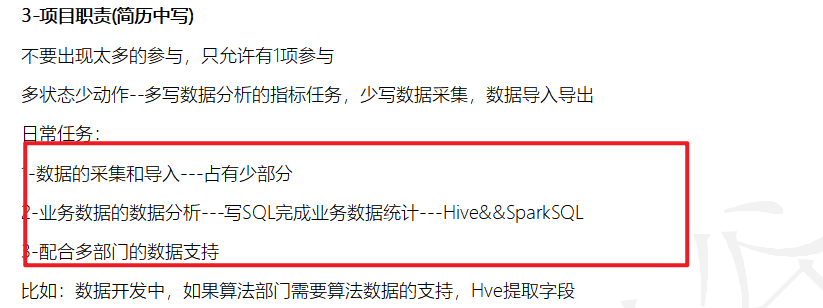

## 面试前的准备

* **准备面试的项目文档**：
* 自我介绍
* 项目介绍
  * 将面试中每一句话都写出来，自己基于这个话更进一步讲解
* 一定准备项目架构图
* 一定准备可能在项目中遇到的问题
  * 准备1-2个问题
* **明天和后天的时间准备**
* 

## 面试前的准备工作

* 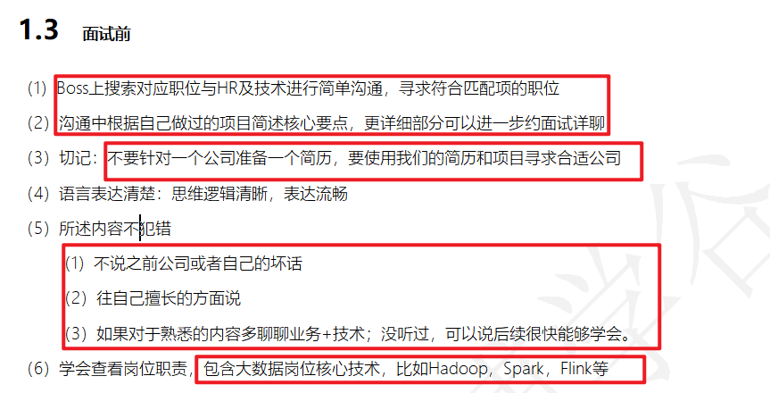

## 面试中的准备工作

* 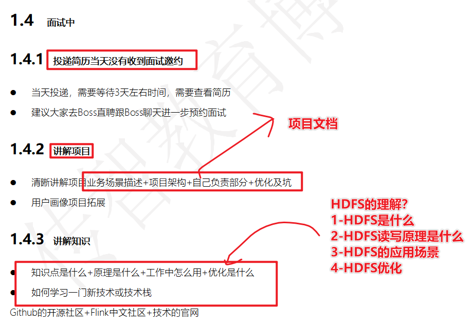

## 面试后应该注意什么

* 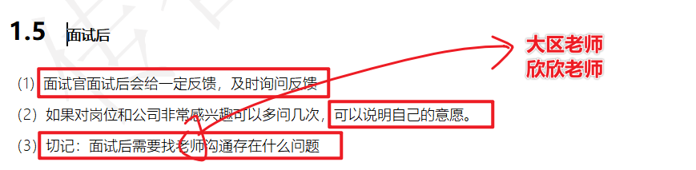

## 完成的任务

* 1-需要大家首先自己修改自己的简历，避开一些坑
* 2-需要大家准备项目文档
* 3-需要搭建选择项目，现在有9个项目如何选择？
  * Hive的项目
    * 教育项目
  * Spark+Hive
    * 千亿级数仓项目离线部分
  * Spark项目
    * DMP广告大数据项目
    * 新冠疫情大数据医疗项目项目
    * 航空反爬虫项目
    * 千亿级数仓项目离线部分-智数电商 
    * 用户画像项目
    * 物流项目
    * 保险项目--正在制作中
    * 案例：教育项目的实时推荐案例
  * Flink项目
    * 千亿级数仓项目实时部分-智数电商 
    * 车联网项目
    * 金融项目
    * 电商案例
    * 案例：陌陌社交数据集分析
* 4-结合自己的工作经验
  * 可以选择N经验年数+1的方式
  * 6年经验，7个项目(3个Java，4个大数据)
  * 如果小于3年的经验，就全部写大数据

## 一道面试题

* 放到下次课