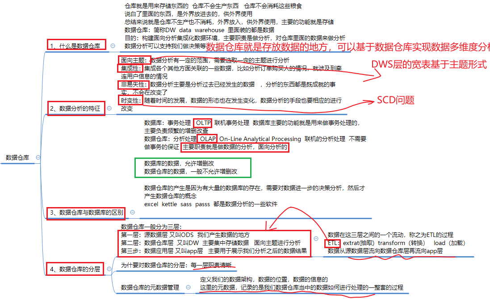
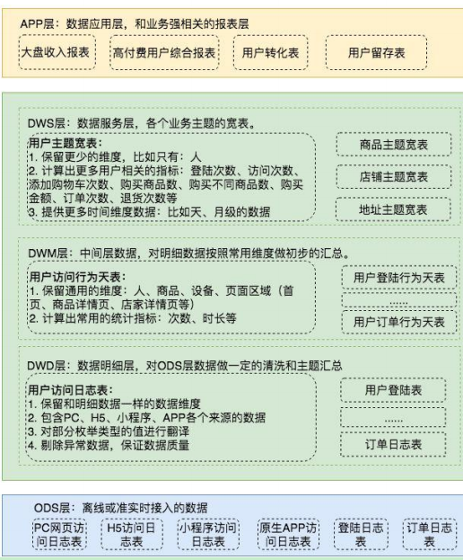
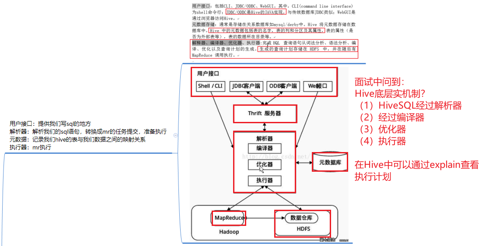
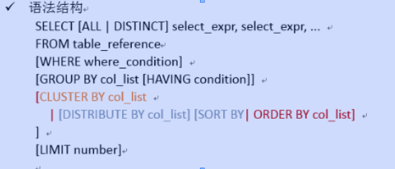
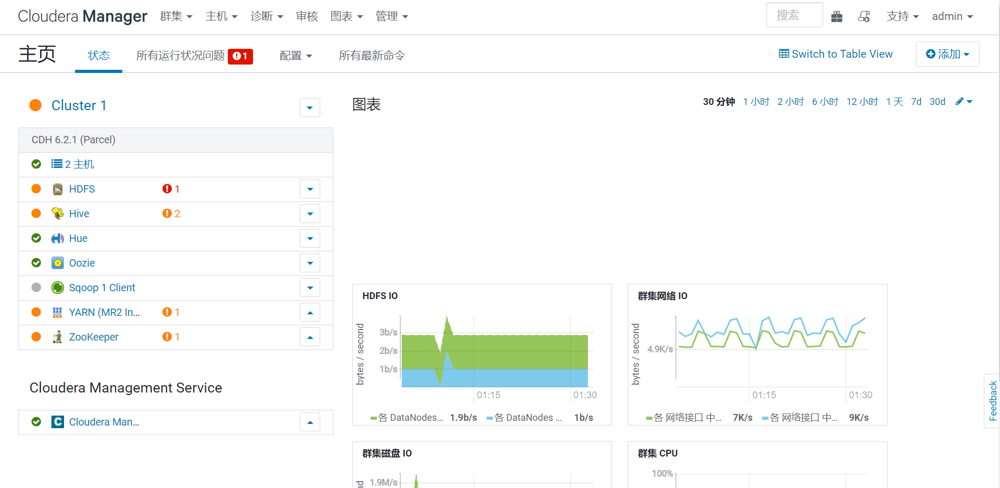
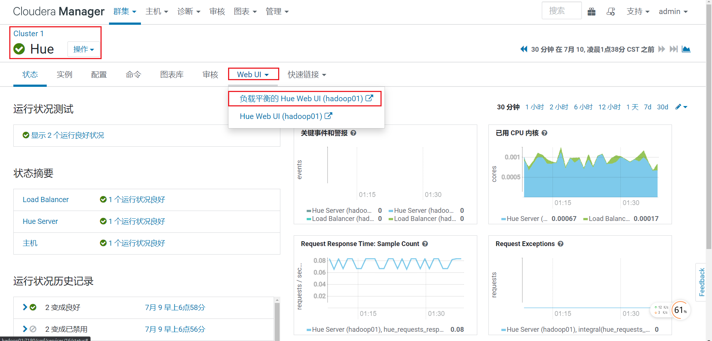
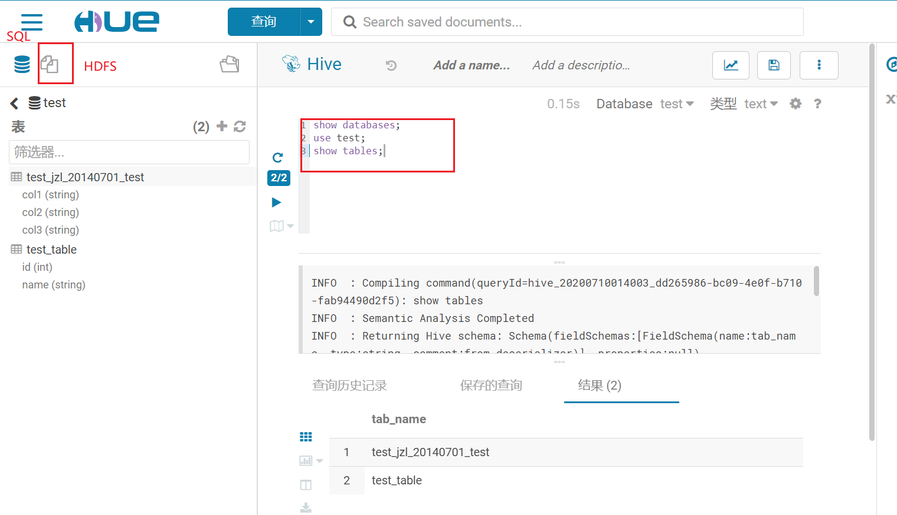
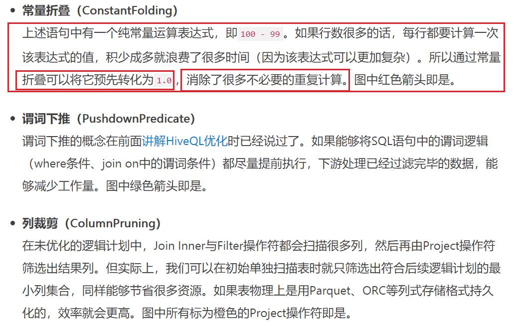
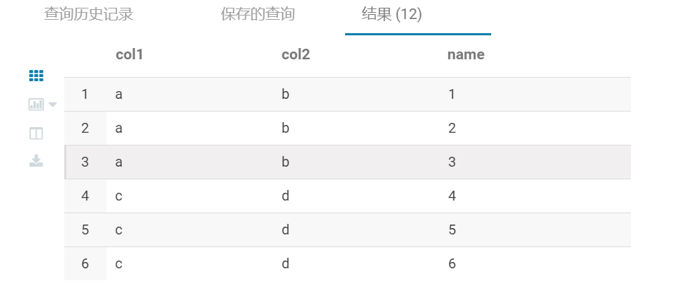

# 02-Hive数仓剖析(教育)

## Hive回顾一下

* 数仓回顾
* 
* 加强：
  * 1-数据仓库：数据仓库就是区别于数据库的频繁增删改，数据仓库是面向主题用于数据分析的
  * 2-数据仓库属于OLAP的分析(面向主题，面向分析)，数据库属于OLTP(事务的频繁增删改查)
  * 3-数据仓库分层是为了更好的分析，每一层职责更加清晰
  * 4-在数据流程流转的过程中ETL对应的数仓的整个过程(ODS-DW-APP)
  * 5-各个分层的作用
    * 传统意义上分层三层
      * 1-ODS层----源数据层，映射了HDFS上的数据
      * 2-DW层----数据仓库层，主要存储数据，面向主题的分析
      * 3-APP层----经过分析之后的数据联合BI报表展示
    * 大多数的项目中分层
      * DW层
        * DWD层-----**数据明细层**(对ODS层数据做一定的清洗和主题的汇总)
        * DWM层-----**中间数据层**(对明细数据按照维度做初步聚合)
        * DWS层------**数据服务层**(对业务主题形成不同主题的看板)
      * 

## 对Hive关键原理在梳理

* Hive如何转化为MR的？

  * **Hive就是MR的客户端**
  * 

* Hive支持的数据格式和压缩的格式？

  * 数据格式：ORC和Parquet
  * 压缩方式：Zlib，Gzip，snappy等
  * 具体在项目中需要结合场景应用

* Hive创建的数据库的默认位置？

  * Hive-site.xml中配置
    *  <value>/user/hive/warehouse</value>
    * create database  语法
    * desc  database  myhive2;

* Hive创建表数据

  * ```properties
    CREATE [EXTERNAL] TABLE [IF NOT EXISTS] table_name 
       [(col_name data_type [COMMENT col_comment], ...)] 列注释 
       [COMMENT table_comment]  表注释
       [PARTITIONED BY (col_name data_type [COMMENT col_comment], ...)] 
       [CLUSTERED BY (col_name, col_name, ...) 
       [SORTED BY (col_name [ASC|DESC], ...)] INTO num_buckets BUCKETS] 
       [ROW FORMAT row_format] 
       [STORED AS file_format] 
       [LOCATION hdfs_path]
    
    external: 定义我们的表为外部表
    location : 指定我们表里面的数据应该存放在hdfs的哪个位置 
    partitioned by : 创建分区表  按照文件夹，将不同的数据，划分到不同的文件夹下面去
    clustered  by  : 分桶表  将我们的数据按照一定的规则，划分到多个文件里面去
    store as : 指定数据的存储格式 text  sequenceFile  parquet  orc
    row  format :指定我们hive建表的分隔符，与我们hdfs的数据的分隔符保持一致，才能够映射hdfs上面的数据到对应的hive的表的字段里面来
    like : 允许用户复制现有的表结构，但是不复制数据
    ```

  * **内部表和外部表有什么区别？**

    * 内部表(管理表)和外部表的最简答的区别就是外部表需要制定**external**
    * [内部表如果删除数据，会将mysql中的元数据和hdfs的数据全部删除]()
    * [而外部表仅仅删除mysql中的元数据，不删除hdfs的数据]()

  * 分区表和分桶表有什么区别？

    * **分区表是分[文件夹]()** 使用 partitioned By
    * **分桶表是分[文件]()**，使用clustered By 按照规则划分到文件中(就是使用MR中的分区)
      * Hive采用的列值取Hash值，然后除以桶的个数决定放在哪个桶中
      * 有几个桶hash之后可以平均划分到几个桶中
      * 好处：可以利用分桶更好的避免数据倾斜
      * 分区更容易产生数据倾斜？因为每一个分区数值较多划分在一个区间造成数据倾斜，分桶比分区更加容易防止数据倾斜现象

  * 将hive表使用分桶的形式，有什么优势？

    * （1）可以使用分桶Bucket的形式以可以获取[**更高的查询效率**]()，[特别是在项目中Map-Join，Bucket-Join, SMB-Join;]()
    * （2）可以使用[**sampling采样技术**]()更高效，在处理大规模数据中，能够拿到一部分数据采样计算比较高效

  * Hive的默认分割符是什么？

    * \001分隔符，使用txt是打不开的，ASCII字符
    * 可以根据源数据使用不同的分隔符
    * **row format delimited fields terminated by** '\t' 

  * 在Hive创建表的时候如何写注释？

    * **comment** “这是一个学生表”

  * Hive创建表的注意事项？

    * 内部表： create  table if not exists stu2(id int ,name string) row format delimited fields terminated by '\t' stored as textfile location '/user/stu2';
    * 外部表：create **external** table techer (t_id string,t_name string) row format delimited fields terminated by '\t';
    * 外部表加载：**load   data   [local]  inpath**  '/export/servers/hivedatas/techer.csv' **into** table techer 
    * 分区表加载数据：**load data local inpath** '/export/servers/hivedatas/score.csv' **into** table score2 **partition(year='2018',month='06',day='01');**
    * 分桶表：**clusterd by**

* Hive的查询若干问题

  

  * 1-四种的查询的区别？order by，sort by，distrubute by，cluster by
    * 1-**order by全局排序**，使用order by最后用一个reduce的task完成全局排序
    * 2-**sort by分区排序**，每个reduce分区内排序，并不保证分区间的有序性
    * 3-**distrubute by 根据某个字段划分到不同的reduce中**，分发是hash散列 （**随机分配到不同的reduce,可以一定程度避免数据倾斜问题**）
    * 4-cluster by除了具备distrubute  by的功能还兼具sort by功能，= **distrubute by + sort by**(**只有当分桶和sort字段是统一个时候**)；
  * 2-Hive中全表查询？
    * select * from table;
  * 3-Hive中如何实现指定列的查询？
    * select id,name from table;
  * 4-对列取值别名
    * select id as myid  from table;
  * 5-Hive中的常用函数？
    * select count(1) from score;
    * select max(t_score) from score
    * select min(t_score) from score
    * select sum(t_score) from score
    * select avg(t_score) from score
  * 6-Limit的语句
    * select id as myid  from table limit 3;
  * 7-Where语句
    * select id as myid  from table whre id >10;
  * 8-group by语句 + 聚合函数
    * groupby一般需要和聚合函数一起使用，按照一列或多列进行聚合
    * 计算每个学生的平均成绩
    * select id，avg(t_score) from table group by id;
    * 计算每个学生的最高的成绩
    * select id，max(t_score) from table group by id;
  * 9-having语句
    * having需要和where区分
      * 1-where针对于**表中列**发挥作用，查询数据，having针对**查询结果中的列**发挥作用
      * 2-where后面不能写分组函数的，而having后面是可以使用分组的函数
      * having只能永不group by分组统计语句
    * 计算每个学生的平均成绩
    * select id，avg(t_score) from table group by id;
    * 在上面的基础上查询一下每个学生成绩大于90分的人
    * select id，avg(t_score) as avgScore from table group by id **having avgScore >90 ;**

* Hive的四种的Join的方式

  * 右外连接right join：Join的操作右边表中符合where条件的所有记录返回
  * 内连接inner join(join)：只有两边的表都存在才能保留下来
  * **左外连接(left join)：Join的操作坐边表中符合where条件的所有记录返回内连接**
  * 满外连接(full join)：返回所有符合where条件的数据，没有条件符合的化也会返回null

* Hive的函数后续增加

## Hive的优化理解

## 教育或电商项目数据仓库构建步骤

## CM+CDH搭建方案

* 去到企业后需要通过CM+CDH完成企业级Hadoop环境的搭建

  * 前置的条件：内存需要达到16-32G，当前的虚拟机用的两台需要16G内存(内存占用率98%)
  * 更改IP段为50.XXX试用CM+CDH
  * http://hadoop01:7180/cmf/login
  * 用户名和密码登录：admin和admin
  * 
  * 可以在企业中需要使用CM+CDH的时候可以直接使文档去搭建

* 如何进入hue操作hive

  * 
  * 这里就实现了Hue操作Hive表数据的实现
  * 

* **Hive的函数后续增加**

  * UDF：一进一出，一表示的是一行数据，一行数据出
  * UDAF：多行进去一行出来
  * UDTF：一行进来多行出去
  * https://blog.csdn.net/ZZQHELLO2018/article/details/102882795

* Hive函数

* ```sql
  show databases;
  use test;
  show tables;
  /*1-HIve的查询长度的函数*/
  SELECT length("abcdfss")
  /*2-Hive的字符串反转函数*/
  SELECT reverse("abcdhdfh")
  --3-字符串的链接函数concat
  select concat("abc","def","ffg");
  select concat("abc",null,"ffg");--NULL,如果有一个是null
  --4-字符串链接函数concnat_ws函数
  select concat_ws("*","ancc","bcbcb")
  --5--字符串截取函数
  select substr("abcde",3)
  select substring("abcde",1,3)
  --6-去重空格trim
  Select trim("abcd      ");
  --7-split函数
  select split("abcdhedhdh","h");
  select explode(split("abcdhedhdh","h")) --行转为列
  --8-实现的是Hive的wordcount
  use test;
  create table hive_wordcount(context string);
  load data  inpath '/test/hive_wordcount.txt' into table hive_wordcount;
  select * from hive_wordcount;
  --实现思路
  select word, count(*) 
  from hive_wordcount 
  lateral view explode(split(context,'\t')) wc as word group by word;
  /*Lateral View一般与用户自定义表生成函数（如explode()）结合使用。
  如内置表生成函数中所述，UDTF为每个输入行生成零个或多个输出行,形成视图或表。 
  Lateral View 首先将UDTF应用于基表的每一行，
  然后将结果输出行连接到输入行，以形成具有提供的表别名的虚拟表。*/
  --9-Hive的with操作，就类似于一个子查询，这个子查询用于使用子查询比较多的地方
  --hive 可以通过with查询来提高查询性能，因为先通过with语法将数据查询到内存，然后后面其它查询可以直接使用
  with test as (
  select 'test' a,split('a,b,c,d,e',',') b --a是test的别名，b是split后的别名
  )
  select a,adid from test LATERAL VIEW explode(b) adTable AS adid
  --10-时间
  --获取当前的unix时间戳
  select unix_timestamp('2020-01-16 17:02:00');
  select unix_timestamp()
  --unix时间转日期--从格林威治时间开始1970年开始的时间
  select from_unixtime(1579165320,"yyyyMMdd")
  --当前的日期转unix时间戳
  select unix_timestamp('2020-01-16 17:02:00');
  --'2020-01-16 17:02:00'的2020-01-16提取出来,仅仅提取日期部分
  SELECT to_date('2020-01-16 17:02:00')
  select year('2020-01-16 17:02:00')
  select month('2020-01-16 17:02:00')
  select day('2020-01-16 17:02:00')
  select hour('2020-01-16 17:02:00')
  --日期的比较函数datadiff
  select datediff('2020-01-16','2020-02-04')
  --日期的增加函数date_add
  select date_add('2020-01-16',19)
  --日期的减少函数data_sub
  select date_sub('2020-01-16',19)
  --11-Hive中如何撰写条件判断
  select if(1=1,1000,2000)
  select if(1=2,1000,2000)
  --如果 case a when b than c 就是指的是如果a=b，别那么返回c
  select case 1 when 1 then 1000 when 2 then 2000 else 0 end;
  select case 2 when 1 then 1000 when 2 then 2000 else 0 end;
  select case when 1=1 then 1000 when 1=2 then 2000 else 0 end;
  --12-cast的类型转换函数
  select cast("2020-9-1" as date) as name;--int string,date
  ```

* 一会练习

* 

* 行转列和列传行的必备面试题 group by + collect_set()   ； lateral view explode()

* ```sql
  use test;
  drop table test_rowtocolumns;
  --建表：
  create table test_rowtocolumns
  (
  col1 string,
  col2 string,
  col3 string
  )
  row format delimited fields terminated by ' '
  stored as textfile;
  --加载数据：
  load data  inpath '/data/test/test.txt' into table test_rowtocolumns;
  select * from test_rowtocolumns;
  --如何执行行专列----laterview expode
  SELECT col1,col2,name 
  FROM test_rowtocolumns 
  lateral VIEW explode(split(col3,",")) cols3 as name;
  
  /*
  hive如何将 列传行--set或list
  a b 1
  a b 2
  a b 3
  c d 4
  c d 5
  c d 6
  变为：
  a b 1,2,3
  c d 4,5,6
  */
  drop table tmp_jiangzl_test;
  建表：
  create table tmp_jiangzl_test
  (
  col1 string,
  col2 string,
  col3 string
  )
  row format delimited fields terminated by '\t'
  stored as textfile;
  加载数据：
  load data inpath '/data/test.txt into table tmp_jiangzl_test;
  SELECT col1,col2,concat_ws(",",collect_set(col3)) 
  FROM test_rowtocolumns 
  --根据相同的col1和col2聚合得到第三列
  group by col1,col2;
  
  ```

* 

## 以项目形式讲解数仓构建的步骤

## 总结

* 作业布置：
* 大家首先还是梳理简历，完善简历，提交到就业老师处，那不准备今天和明天随时问我
* 明天晚上张鹏模拟面试的show展示
* Hive的复习和巩固---------主要针对于面试题结合常用函数
* 对于CM+CDH的方式仅仅需要会用就行，只需要知道有这个东西就可以