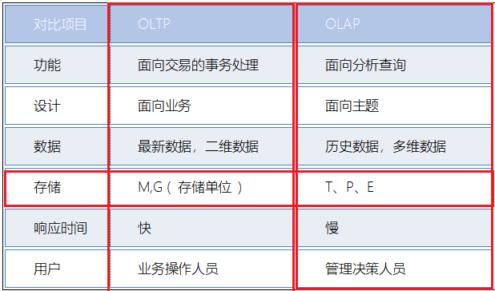
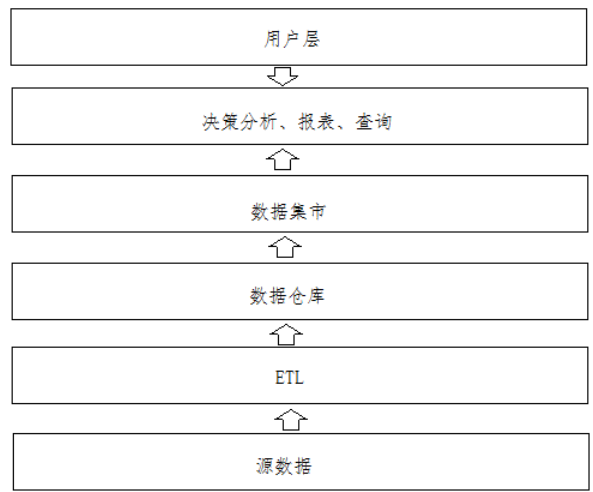
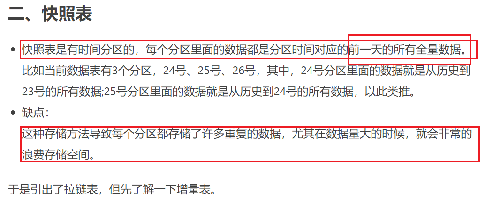
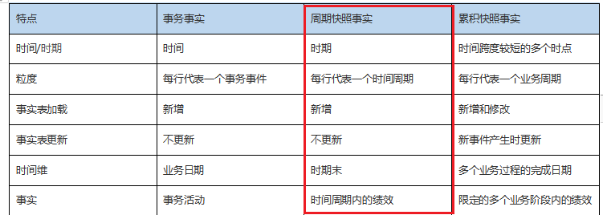
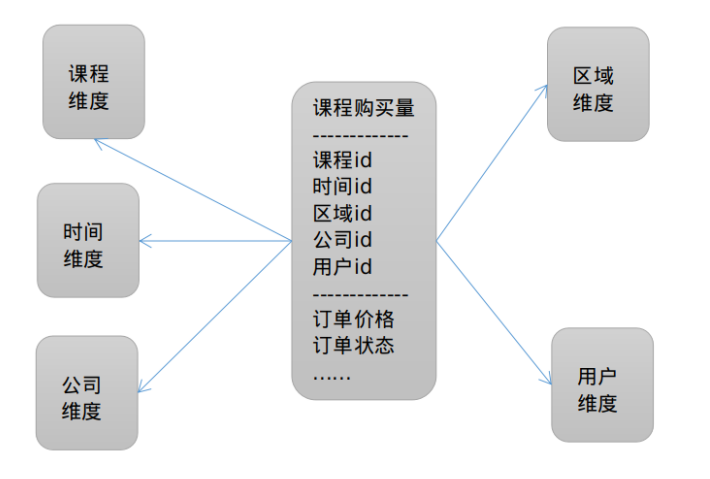
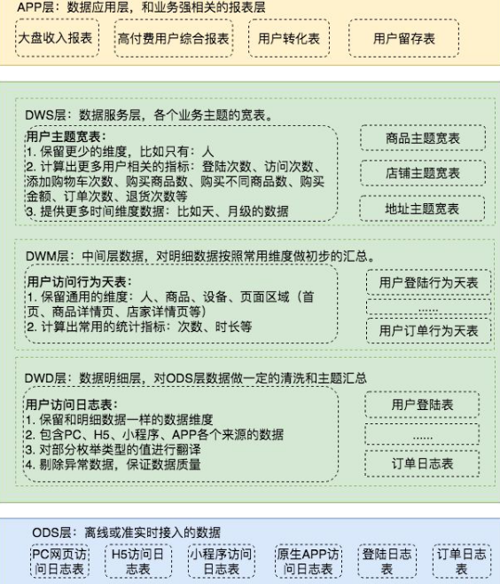

# 数仓理论加深

## 数据仓库的重点知识

* 理解OLTP和OLAP的区别

* 理解数据仓库的特点

* 理解数据仓库系统架构

* 理解数仓的指标与维度

* 理解星型模型和雪花模型

* 掌握数据仓库的分层方法

## 数仓的概念

* OLAP和OLTP区别

* 

* 特点：

  * 面向主题：ERP-进销存系统、人力资源管理系统、财务管理系统、仓库管理系统

  * 时变性：

    * 1）会不断添加新数据

      每年的销售数据会逐渐添加到数据仓库。

      2）删除过期数据

      数据仓库中的数据会保存很长的时间（5--10年），但也有过期时间，到过期 时间会删除过期 数据。

      3）对历史明细数据进行聚合

## 数仓架构图

* 

* 以下系统各部分的执行流程是：

  1、确定分析所依赖的源数据。

  2、通过ETL将源数据采集到数据仓库。

  3、数据按照数据仓库提供的主题结构进行存储。

  4、根据各部门的业务分析要求创建数据集市（数据仓库的子集）。

  5、决策分析、报表等应用系统从数据仓库查询数据、分析数据。

  6、用户通过应用系统查询分析结果、报表。

## 数据仓库各个概念

* 指标和维度

  * X轴表示的是维度，时间，地区，商品
  * Y轴表示的是指标，PV，UV，地区排行榜

* 分层和分级

对于维度讲
*  时间维度：
  
* 一个层次四个级别：年、月、天、小时
  
* 课程维度：

  * 课程名称：只有一个级别，每门课程的名称

    课程分类：两个级别，大类和小类

    课程难度：只有三个级别，简单、一般、难

    课程等级：只有三个级别，初、中、高

* 地区维度：
  
* 个层次三个级别：省、市、县
  
* 下钻和上卷
  * 比如对于时间维度
  * 年 月 日 时 分 秒
  * 由年可以下钻到月份
  * 由月份上卷到年
  * 举例：按天分析课程访问量，现在按照时间维度下钻到小时，也就是统计每天的不同时段的访问量，上卷到年，可以理解为统计每年的访问量
* 数据仓库模型
  * 事实表：用于指标计算的表，数据分析的实质就是基于事实表开展的计算操作。
    * **快照表**
      * **周期快照表**
        * 按照月份构建快照表，也就是把当前月份的结果单独形成一张表；
        * 按照年份构建快照表，也是是吧当前年份的结果单独形成一张表；
      * **累计快照表**
      * 
      * 
    * 拉链表
  * 维度表：由于不同维度组成的表
    * 缓慢变化维：SCD问题
    * 案例：例如一个人的相关信息**，身份证号、姓名和性别等信息数据属于不变的部分**，政治**面貌和婚姻状态属于缓慢变化部分**，而**工作经历、工作单位和培训经历等在某种程度上属于急剧变化字段。**
    * SCD1：直接替换，通过更新维度记录直接覆盖已存在的值。**适用于修改错误值的地方**
    * **SCD2：拉链表，在原来的表的基础上增加了start_time和end_time，Valid To（封链时间）为 NULL 的标识当前数据，也可以用2999，3000，9999等等比较大的年份。**
    * SCD3：只保存了最近两次的历史记录，适合于数据空间不足的地方
  * 星型模型
    * 一个事实表为中心，多个维度表环绕周围。
    * ****
  * 雪花模型
    * 当有一个或多个维表没有直接连接到事实表上，而是通过其他维表连接到事实表上时
    * 

## 数据仓库建模流程

* \1. 选择需要建模的业务流程

  \2. 确认事实

  用户正是通过对事实表的访问获取数据仓库中存储的数据的。

  \3. 声明维度模型的粒度

  在选择维度和事实前必须声明粒度，不同的事实可以有不同的粒度，建议同一事实中不要混用多种不同的粒度。也可以修改粒度级别。

  细粒度：原始粒度（从业务流程直接获取的数据），建议从原始粒度数据开始设计数据模型，满足对细节数据的查询需求。（ODS、DWD）。

  粗粒度：汇总粒度（在原始粒度的基础上进行汇总），对优化查询性能很重要。（DWM、DWS）。

  \4. 确认维度

  维度的粒度要和第二步保持一致。

* 数据仓库分层

  * 为什么需要分层

    * \1. 清晰数据结构：每一个数据分层都有它的作用域和职责，在使用表的时候能更方便地定位和理解

      \2. 减少重复开发：规范数据分层，开发一些通用的中间层数据，能够减少极大的重复计算

      \3. 便于维护：当数据出现问题之后，可以不用修复所有的数据，只需要从有问题的步骤开始修复。

      \4. 统一数据口径：通过数据分层，提供统一的数据出口，统一对外输出的数据口径

      \5. 复杂问题简单化：将一个复杂的任务分解成多个步骤来完成，每一层解决特定的问题

    * 分层：能够通过分层更高效分析数据

  * 如何分层

    * ODS层--源数据映射HDFS的数据
    * DW数据仓库层
      * 明细层DWD（Data Warehouse Detail）：数据清洗和数据转换
        * 数据清洗(缺失数据和异常数据)和数据转换(时间数据转换-年月日时分秒-年月日)：存储明细数据，此数据是最细粒度的事实数据。该层一般保持和ODS层一样的数据粒度，并且提供一定的数据质量保证。同时，为了提高数据明细层的易用性，该层会采用一些维度退化手法，将维度退化至事实表中，减少事实表和维表的关联。、
      * 中间层DWM（Data WareHouse Middle）：为了DWS层减少维度聚合
        * 创建中间表轻度聚合层：存储中间数据，为数据统计需要创建的中间表数据，此数据一般是对多个维度的聚合数据，此层数据通常来源于DWD层的数据。
      * 业务层DWS（Data WareHouse Service）：根据不同的主题形成主题宽表
        * 根据主题划分业务宽表：存储宽表数据，此层数据是针对某个业务领域的聚合数据，业务层的数据通常来源与此层，为什么叫宽表，主要是为了业务层的需要在这一层将业务相关的所有数据统一汇集起来进行存储，方便业务层获取。此层数据通常来源与DWD和DWM层的数据。
      * 在实际计算中，(为什么会划分这么多层)如果直接从DWD或者ODS计算出宽表的统计指标，会存在计算量太大并且维度太少的问题，因此一般的做法是，在DWM层先计算出多个小的中间表，然后再拼接成一张DWS的宽表。由于宽和窄的界限不易界定，也可以去掉DWM这一层，只留DWS层，将所有的数据在放在DWS亦可。
    * APP层-应用层

  * 常见的分几层

    * 一般分为3层，而根据实际业务场景会将DW层会细分为DWD-DWM-DWS层的分层，更进一步细化数据的ETL过程
    * 如何分层还要依赖于实际业务场景

  * 建议大家在分层可以选择5层数仓分层

  * 

## 数据仓库的概念总结

* 什么是数据仓库
  * 数据仓库就是存放数据的地方，可以使用苏数据仓库更好的分析数据，区别于OLTP的面向事务的处理思路，使用的是OLAP的联机分析处理
* 数据仓库的两个概念
  * 指标：Y轴
  * 维度：X轴
    * 维度上卷
    * 维度下钻
* 数据仓库的核心两个表
  * 事实表：周期的事实快照表
  * 维度表：维度的变换问题(SCD1，SCD2-拉链表，SCD3)
* 数据仓库的模型选择：
  * 星型模型：1张事实表关联多个维度表
  * 雪花模型：维度表有相关联关系
* 数据仓库分层：
  * 为什么要分层：通过分层更高效分析数据
  * 分为3层：ODS-DW-APP
  * 分为5层：ODS-DWD-DWM-DWS-APP