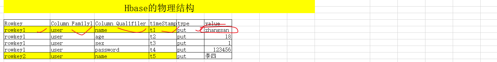
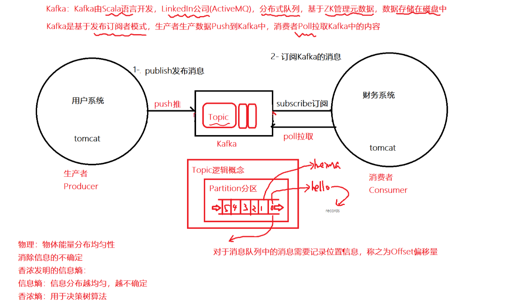

# 重点巩固

## HBase

* Hbase应用

  * Hbase应用**用户画像+推荐系统**，Hbase适合存储稀疏数据

  * ```
    # 总结：
    # create 表名 列族
    create 'student','C1' 
    # put 表名 rowkey  列族：列名  列的取值
    put 'student','00001','C1:name','张三'
    # delete 表名 rowkey 列族：列名
    delete 'student','00001','C1:age'
    # deleteall 表名 rowkey
    deleteall 'student','00001'
    # scan 表名  全表扫描   建议数据量大的时候使用limit或直接get操作
    scan 'student'
    # 具体的参数可以使用help 'scan'
    scan 'student',{COLUMNS => ['C1:name'], LIMIT => 10}
    # get 表名 rowkey 列名
    get 'student','00001'
    get 'student','00001',{COLUMN => 'C1:age'}
    ```

* Hbase原理架构

  * 数据模型：
  * 1-命名空间，类似于数据库
  * 2-Region，类似于数据表
  * 3-Store对应列族
  * 4-Column对应列
  * 5-Timestamp 时间戳，Hbase插入数据按照时间戳给定版本
  * 6-Version 版本
  * 逻辑结构
  * 
  * 物理结构
  * 

* Hbase的JavaAPI

* Hbase原理深入

  * 1-Hbase的Clinet如何理解和ZK以及HBase交互？
    * Clinet三次握手
      * 1-Client跟ZK握手，meta-region-server存储meta表位置
      * 2-Client跟Meta表存储的RegionServer通信获取数据读写位置
      * 3-Client找到对应RegionServer读写
  * 2-Hbase的写原理？
    * 先写入hLog中，记录了操作信息
    * 在写入MemStore中
    * 达到刷写阈值，刷写Storefile(逻辑结构)HFile(物理结构)
    * COmpaction合并
  * 3-Hbase的查询？
    * 1-先从memstore找
    * 2-BlockCache中找
    * 3-HFile，如果找到缓存在BlockCache中
  * 4-MemStore什么时候溢写磁盘？
    * 1-从memstore层面
      * 128M-最大128*4
      * 1个小时
    * 2-从regionser层面
      * javaheap jvm堆内存
      * javaheap*0.4 最大阈值
      * javaheap*0.4*0.95=javaheap*0.38 溢写最小阈值
  * 5-Compaction分为几类？
    * Major：大合并，默认7天，关闭0，会删除数据，触发大量IO
    * Minor：小合并，3-10文件，不会删除数据
  * 6-Region分裂？
    * Min(r、**2、*128M,10G)
    * r=9个region的时候
  * 7-Hbase协处理器
    * Observe：类似于Java的拦截器，运行一项任务的时候先把拦截下来在运行其他任务
    * EndPoint：类似于Java的方法，MySQL的存储过程
      * 将数据计算放在RegionServer上，而不是Client端，符合移动计算不要移动存储

* 架构图


* API

* ```java
  package cn.itcast.hbase;
  
  import org.apache.hadoop.conf.Configuration;
  import org.apache.hadoop.hbase.*;
  import org.apache.hadoop.hbase.client.*;
  import org.apache.hadoop.hbase.filter.FilterList;
  import org.apache.hadoop.hbase.filter.SingleColumnValueFilter;
  import org.apache.hadoop.hbase.util.Bytes;
  import org.junit.Test;
  
  import java.io.IOException;
  import java.util.List;
  
  /**
   * DESCRIPTION:使用Hbase创建表，删除表，增加数据，查找数据
   * STEPS:
   * 创建表的步骤：
   */
  public class _03HbaseCreate {
      @Test
      public void createTable01() throws IOException {
          //1-准备Client
          Configuration conf = HBaseConfiguration.create();
          conf.set("hbase.zookeeper.quorum", "node1.itcast.cn:2181");
          Connection hbaseConn = ConnectionFactory.createConnection(conf);
          //2-获取表对应----Master(表，region) 和RegionServer(数据，Region分裂合并)
          //Admin admin = hbaseConn.getAdmin();//Master(表，region)
          Table table = hbaseConn.getTable(TableName.valueOf("test:MSG"));//RegionServer(数据，Region分裂合并)
          //table.getScanner();
          Put put = new Put("00003".getBytes());
          put.addColumn("C1".getBytes(), "name".getBytes(), "zhangsan".getBytes());
          put.addColumn("C1".getBytes(), "age".getBytes(), "34".getBytes());
          put.addColumn("C1".getBytes(), "sex".getBytes(), "male".getBytes());
          table.put(put);
          //admin.tableExists();
          //admin.createTable();
          //admin.disableTable();
          //admin.deleteTable();
          table.close();
      }
  
      @Test
      public void getScanner02() throws Exception {
          //1-准备Client
          Configuration conf = HBaseConfiguration.create();
          conf.set("hbase.zookeeper.quorum", "node1.itcast.cn:2181");
          Connection hbaseConn = ConnectionFactory.createConnection(conf);
          //2-获取表对应----Master(表，region) 和RegionServer(数据，Region分裂合并)
          //Admin admin = hbaseConn.getAdmin();//Master(表，region)
          Table table = hbaseConn.getTable(TableName.valueOf("test:MSG"));//RegionServer(数据，Region分裂合并)
          //
          Scan scan = new Scan();
          FilterList filterList = new FilterList();
          //final byte [] family, final byte [] qualifier,
          //final CompareOperator op, final byte[] value
          SingleColumnValueFilter filter1 = new SingleColumnValueFilter("C1".getBytes(),
                  "age".getBytes(),
                  CompareOperator.EQUAL,
                  "20".getBytes());
          filterList.addFilter(filter1);
          //
          scan.setFilter(filterList);
          //
          ResultScanner resultScanner = table.getScanner(scan);
          //
          for (Result result : resultScanner) {
              List<Cell> listCells = result.listCells();
              for (Cell cell : listCells) {
                  byte[] cloneRow = CellUtil.cloneRow(cell);
                  byte[] cloneFamily = CellUtil.cloneFamily(cell);
                  byte[] cloneQualifier = CellUtil.cloneQualifier(cell);
                  byte[] cloneValue = CellUtil.cloneValue(cell);
                  //转换成string
                  String rowkey = Bytes.toString(cloneRow);
                  String family = Bytes.toString(cloneFamily);
                  String qualifier = Bytes.toString(cloneQualifier);
                  String value = Bytes.toString(cloneValue);
                  System.out.println("rowkey:"+rowkey+"family:"+family+"qualifier:"+qualifier+"value:"+value);
                  //System.out.printf("rowkey:");
              }
          }//end for
          table.close();
      }
  }
  ```

* 完毕

## Kafka

* 消息：应用之间传递的数据

* 消息队列：应用之间的通信额方式，保证消息可靠性

* 消息队列分类：点对点，发布订阅

* Kakfa特点：

  * Push和Poll模式(基于发布定于模式的Poll拉取Kafka的过程)
  * Kafka是Scala语言，LinkedIn公司(ActiveMQ)，Kafka数据存储在磁盘中，Kafka顺序读写

* Kafka特性

* 

* Kafka数据模型：

* 1-生产者---数据生产者--Producer

* 2-消费者---数据消费者--Consumer

* 3-Kafka集群---Broker

  * Topic主题
  * Partition分区
  * Segment段
  * 
  * log+index+timeindex
  * 

* Kafka简易架构

* 

* Kafka的命令

* 

* kafka-topics.sh --create --topic 'heima3' --bootstrap-server node1.itcast.cn:9092 --replication-factor 3 --partitions 6

* 

* 从kafka设计角度出发

* 目标：ExactlyOnce精确一致

* 生产者：不要重复消费也不要丢失数据

  * 了解生产者端写数据
  * 
  * 
  * 1-leader数据在哪里？
    * /state目录下
  * 2-**副本同步策略**
    * 全部节点同步---延迟----kafka选择
    * 半数以上--冗余
  * 3-**followers和leader同步到什么程度算同步成功？**
    * 
  * 3-**为什么有ISR**
    * 因为Kafka选择的是全部副本同步完成后才ack确认
    * 如果一个follwer挂掉了，一直等待
    * 引入ISR，将长时间和leader不同心followe移除出去
  * 4-**ACK如何设置**
    * 0：任何确认，对于不重要的数据，比如百度热词
    * 1：leader写入后确认，造成数据丢失  at most once
    * -1：follwer从isr中同步，发送ack到leader在到producer 可能重复  at least once
  * **ExactlyOnce精确一致** 
    * **at least once+幂等性** (就是每个消息都有个**分区ID pid + 序列号seq**)
    * 幂等性：**多次写入结果一致**
    * 
  * 

* KafkaBroker

  * 
  * 

* 消费者：不要重复消费也不要丢失数据

  * 了解生产者端读数据
  * 
  * 
  * 粘性分配策略
  * 
  * 完毕

  

## Spark

* 1-Spark使用的版本2.4.5
  因为CDH5.14.0中Spark默认的版本是1.6.0同时阉割了SparkSQL(Impala)，需要重新编译
  2-Spark几种部署方式？
    Local(local[*],所有的cpu cores)，StandAlone(Master-local)，StandAloneHA(多个Master)，Yarn(RS-NM)-Client模式，Cluster模式
  3-Spark的提交任务的方式？
  bin/spark-submit  \
  --master local/spark:node01:7077/spark:node01:7077,node02:7077 \
  --deploy-mode client/cluster \  #client指的是driver启动在本地，cluster指的是driver启动在Worker接点水行
  --class application-main
  --executor-memory	 每个executor的内存，默认是1G
  --total-executor-cores	 所有executor总共的核数。仅仅在 mesos 或者 standalone 下使用
  --executor-core	 每个executor的核数。在yarn或者standalone下使用
  --driver-memory	 Driver内存，默认 1G
  --driver-cores	 Driver 的核数，默认是1。在 yarn 或者 standalone 下使用
  --num-executors	 启动的executor数量。默认为2。在 yarn 下使用
  .....
  jar包地址
  参数1 参数2
  4-使用Spark-shell的方式也可以交互式写Spark代码？
  bin/spark-shell --master local --executor-core 2 --executor-memory 512m
  5-SparkCore：
  什么是RDD？
  （1）RDD是弹性分布式数据集
  （2）RDD有五大属性：1-RDD是可分区的(0-1-2号分区) 2-RDD有作用函数(map) 3-RDD是依赖关系 4-对key-value的类型RDD的默认分区HashPartitoner 5-位置优先性
  （3）RDD的宽依赖和窄依赖：根据父RDD有一个或多个子RDD对应，因为窄依赖可以在任务间并行，宽依赖会发生Shuffle
  （3）RDD血缘关系linage：linage会记录当前rdd依赖于上一个rdd，如果一个rdd失效可以重建RDD，容错关键
  （4）RDD的缓存：cache和persist，cache会将数据缓存在内存中，persist可以指定多种存储级别，cache底层调用的是persist
  （5）RDD的检查点机制：Checkpoint会截断所有的血缘关系，而缓存会将血缘的关系全部保存在内存或磁盘中
  （6）Spark如何实现容错？Spark会首先查看内存中是否已经cache或persist当前的rdd的链条，否则查看linage是否checkpoint值hdfs中，重建rdd
  （7）Spark共享变量？
  累加器(在driver端定义的变量在executor端拿到的是副本，exector执行完计算不会更新到driver)
  广播变量(对于1M的数据，开启1000个maptask，当前的1M的数据会发送到所有的task中进行计算，会产生1G网络数据传输，引入广播变量将1M数据共享在Executor中而不是task中，me米格task共享的是一个变量的副本，广播变量是只读的，不能再exectour端修改)
  （8）Spark的任务执行?
  1-Spark一个Application拥有多个job，一个action操作会出发一个Job划分
  2-Spark一个Job有多个Stages，发生shuffle操作触发一个Stage的划分
  3-一个Stage有很多个tasksets，一个RDD的不同的分区就是代表的taskset，很多的taskset组成tasksets
  4-一个taskset由很多个RDD的分区组成，一个RDD的分区的数据需要由一个task线程拉取执行，而不是进程
  （9）Spark的rdd的几种类型？transformation和action类型
  （10）Spark的Transformation算子有几类？
  3类
  单value：如mapValue，map，filter
  双value：union，zip，distinct
  key-value类型：reduceBykey(一定不属于Action算子)，foldByKey
  （11）RDD创建的三种方法？sc.textfile,sc.makerdd/paralleise,RDD之间的转换
  6-SparkSQL：
  （1）RDD-DataSet和DataFrame的区别和联系？RDD+Scheme=DataFrame.as[]+泛型=DataSet.rdd=RDD，DataFrame是弱类型的数据类型，在运行时候数据类型检查，DataSet是强类型的数据类型，在编译时候进行类型检查
  （2）SparkSQL中查询一列的字段的方法有几种？df.select(['id']),df.select(col('id')),df.select(colomns('id')),df.select('id),df.select($"")
  （3）SparkSQL中的如何动态增加Schema?StructedType(StructedFileld(data,name,nullable)::Nil),new StructedType().add(data,name,nullable).add()
  （4）SparkSQL中DSL和SQL风格差异？DSL风格df.select,SQL风格需要注册一张临时表或试图进行展示
  （5）SparkSQL中SQL风格全局Session和局部的Session的差别是什么？全局的Session可以跨Session访问注册的临时试图或表，局部Session只能访问临时试图或表
  （6）SparkSQL整合Hive：Spark引擎替代了HIve的执行引擎，可以在SPark程序中使用HIve的语法完成SQL的分析
  （7）[非常重要]SparkSQL如何执行SQL的，SQL的查询引擎
  基于规则优化（Rule-based optimization, RBO----过滤下推，常量折叠）-逻辑执行计划中，进行逻辑计划优化
  基于代价优化（Cost-based optimization, CBO）----物理执行计划中选择最优物理执行计划
  CodeGeneration代码生成
  7-SparkStreaming
  （1）SparkStreaming几种编程模式？有状态(updateStateByKey\mapState)、无状态(reduceByKey)、窗口操作(windows，reduceByKeyAndWIndows)
  （2）对于DStream如何使用RDD的方法?(transform)
  （2）SparkStreaming的有状态的几种形式？updateStateByKey\mapState
  （3）SparkStreaming和Kafka的整合，如何获取Offset，010整合
  KafkaUtils.createdirctstream(SSC,Kafka的parititon和Spark的eceutor是否在一个节点，Consumer.subscribe(Array(kafkatopic),params))
  获取Offset：StreamData.asInstanceOf[HasOffSetRanges].offsetRanges
  提交Offset：StreamData.asInstanceOf[CancommitOffSetRanges].async(offSetRanges)
  #http://spark.apache.org/docs/latest/streaming-kafka-0-10-integration.html
  val kafkaParams = Map[String, Object](
    "bootstrap.servers" -> "localhost:9092,anotherhost:9092",
    "key.deserializer" -> classOf[StringDeserializer],
    "value.deserializer" -> classOf[StringDeserializer],
    "group.id" -> "use_a_separate_group_id_for_each_stream",
    "auto.offset.reset" -> "latest",
    "enable.auto.commit" -> (false: java.lang.Boolean)
  )

  val topics = Array("topicA", "topicB")
  val stream = KafkaUtils.createDirectStream[String, String](
    streamingContext,
    PreferConsistent,
    Subscribe[String, String](topics, kafkaParams)
  )
  stream.map(record => (record.key, record.value))
  stream.foreachRDD { rdd =>
    val offsetRanges = rdd.asInstanceOf[HasOffsetRanges].offsetRanges
    // some time later, after outputs have completed
    stream.asInstanceOf[CanCommitOffsets].commitAsync(offsetRanges)
  }
  （4）SparkStreaming有两个时间？
  Spark Streaming接收器接收到的数据在存储到Spark中之前的时间间隔被分成数据块。 最低建议-50毫秒。
  一个时间是接收器接受数据的时间--默认是200ms，数据到来每隔200ms获取一次数据，合并数据形成DStream
  一个时间是SParkStreaming获取到数据后处理时间--StreamingContext(sc,Second(5))，这才是SparkStreaming批处理时间
  （5）当生产者生产数据过多，消费者SparkStreaming来不及消费，请问造成什么现象？背压，或反压
  在SparkStreaming中是默认关闭，在Flink中是默认开启的，背压在SParkStreaing中自动动态的根据接收器接受最大速率和kafka的topic的分区的个数确定

## Flink

# 
*Flink
Flink:task，Spark中taskSet
Spark:task，Flink中对应是subtask
JobManager学校--takManager教室--Slot固定座位100个---task任务逻辑(90个学生)-并行度
面试题1：Slot和并行度的关系
Slot是固定的物理概念，并行度是动态的资源的概念，可以在Application，算子层面各个方面你设置并行度
FLink的并行度是根据任务动态指定的，与分区数是没有关系的，也就是并行度决定task的个数。并行度5分区数10,也是可以执行的
解析：
Slot的数量一般是固定的，可以通过配置文件去设置，一般slot的数量和cores数量是相等，
在当前服务器部署了flink的前提下，同一个Slot在同一时间只能有一个task执行。
这里的task相当于Spark中的taskSet，实际上flink中最小的任务单元是subtask，
subtask数量就是由并行度paralleise决定的，而spark中task的数量由分区的数量决定的，并行度的设置有多重方式，每个application可以单独设置并行度。

* Flink的四大基石：time，window，checkpoint ，stated

* Flink的转换算子：map/FlatMap

* Flink的状态管理分类:
  Flink中有两种基本类型的State
  Keyed State&Operator State
  Keyed State和Operator State，可以以两种形式存在：原始状态(raw state)托管状态(managed state)

* Flink的流处理特性:Exactly-once/低延迟/分布式快照

* Flink的状态存储：目前，Checkpoint持久化存储可以使用如下三种: 
  MemStateBackend
  该持久化存储主要将快照数据保存到JobManager的内存中，仅适合作为测试以及快照的数据量非常小时使用，并不推荐用作大规模商业部署。
  FsStateBackend
  该持久化存储主要将快照数据保存到文件系统中，目前支持的文件系统主要是 HDFS和本地文件。
  RocksDBStateBackend
  RocksDBStatBackend介于本地文件和HDFS之间，平时使用RocksDB的功能，将数 据持久化到本地文件中，当制作快照时，将本地数据制作成快照，并持久化到 FsStateBackend中(FsStateBackend不必用户特别指明，只需在初始化时传入HDFS 或本地路径即可

* FLink on yarn提交方式：Session会话模式/job分离模式

* FLink中的重启策略：默认/无重启/固定延迟/失败率....

* Flink的四大基石的time的分类：EventTime事件时间，Ingestiontime摄入时间，ProcessingTime处理时间

* FLink的分布式缓存和广播变量：
  广播变量：将Flink集合转为本地集合缓存到TaskManager中
  分布式缓存：将还魂的HDFS文件缓存在TaskManager中

* flink中水位线waterMarker技术：
  WaterMarker就是额外的时间戳，WaterMarker=目前该窗口的最大的事件时间-最大允许的延迟时间或乱序时间
  当WaterMarker>=窗口结束时间段额时候出发该窗口计算。在一定程度上可以解决乱序的问题
  对于延迟特别久的数据flink中也提供了侧道输出

* Flink中的几种并行度的设置：算子级别>env级别>client级别>配置文件级别

* 使用Java或Scala开发批或流的wordcount
  //获取flink的执行环境
   val env = ExecutionEnvironment.getExecutionEnvironment
   //导入隐式转换
   import org.apache.flink.api.scala._
   //加载/创建初始数据
   val text = env.fromElements("i love beijing", "i love shanghai")
   //指定这些数据的转换
   val splitWords = text.flatMap(_.toLowerCase().split(" "))
   val filterWords = splitWords.filter(x=> x.nonEmpty)
   val wordAndOne = filterWords.map(x=> (x, 1))
   val groupWords = wordAndOne.groupBy(0)
   val sumWords = groupWords.sum(1)
   /**

     * 触发程序执行
     * 1: 本地输出
     * sumWords.print()
       */
        sumWords.print()

* Flink+Kafka实现流式数据处理
  package cn.itcast.stream.source

  import java.util
  import java.util.Properties

  import org.apache.commons.collections.map.HashedMap
  import org.apache.flink.api.common.serialization.SimpleStringSchema
  import org.apache.flink.streaming.api.scala.StreamExecutionEnvironment
  import org.apache.flink.streaming.connectors.kafka.FlinkKafkaConsumer011
  import org.apache.flink.streaming.connectors.kafka.internals.KafkaTopicPartition

  object StreamingKafkaSourceScala {
    def main(args: Array[String]): Unit = {
  	val env = StreamExecutionEnvironment.getExecutionEnvironment
  	//隐式转换
  	import org.apache.flink.api.scala._

  ```java
  //指定消费者主题
  val topic = "test"
  
  val props = new Properties();
  props.setProperty("bootstrap.servers","node01:9092");
  props.setProperty("group.id","test091601");
  props.setProperty("key.deserializer", "org.apache.kafka.common.serialization.StringDeserializer");
  props.setProperty("value.deserializer", "org.apache.kafka.common.serialization.StringDeserializer");
  
  //动态感知kafka主题分区的增加 单位毫秒
  props.setProperty("flink.partition-discovery.interval-millis", "5000");
  val myConsumer = new FlinkKafkaConsumer011[String](topic, new SimpleStringSchema(), props)
  
  /**
   * Map<KafkaTopicPartition, Long> Long参数指定的offset位置
   * KafkaTopicPartition构造函数有两个参数，第一个为topic名字，第二个为分区数
   * 获取offset信息，可以用过Kafka自带的kafka-consumer-groups.sh脚本获取
   */
  val offsets =  new java.util.HashMap[KafkaTopicPartition, java.lang.Long]();
  offsets.put(new KafkaTopicPartition(topic, 0), 11111111l);
  offsets.put(new KafkaTopicPartition(topic, 1), 222222l);
  offsets.put(new KafkaTopicPartition(topic, 2), 33333333l);
  
  /**
   * Flink从topic中最初的数据开始消费
   */
  myConsumer.setStartFromEarliest();
  
  /**
   * Flink从topic中指定的时间点开始消费，指定时间点之前的数据忽略
   */
  myConsumer.setStartFromTimestamp(1559801580000l);
  
  /**
   * Flink从topic中指定的offset开始，这个比较复杂，需要手动指定offset
   */
  myConsumer.setStartFromSpecificOffsets(offsets);
  
  /**
   * Flink从topic中最新的数据开始消费
   */
  myConsumer.setStartFromLatest();
  
  /**
   * Flink从topic中指定的group上次消费的位置开始消费，所以必须配置group.id参数
   */
  myConsumer.setStartFromGroupOffsets();
  
  //添加消费源
  val text = env.addSource(myConsumer)
  
  text.print()
  env.execute("StreamingFromCollectionScala")
  ```
  
    }
  }
  #FLink和SparkStreaming对比：https://mp.weixin.qq.com/s/jllAegJMYh_by95FhHt0jA
  #FLink架构和Spark架构
  Flink采取的主从式架构，Flink启动程序后输出的是StreamGraph，优化成JobGraah，JobManager根据JobGraph生成ExecutionGraph，ExecutorGraph才是Flink真正执行graph
  #FLink的容错：
  Flink的checkpoint两阶段提交
  Flink checkpointing 开始时便进入到 pre-commit 阶段。具体来说，一旦 checkpoint 开始，Flink 的 JobManager 向输入流中写入一个 checkpoint barrier ，将流中所有消息分割成属于本次 checkpoint 的消息以及属于下次 checkpoint 的，barrier 也会在操作算子间流转。对于每个 operator 来说，该 barrier 会触发 operator 状态后端为该 operator 状态打快照。data source 保存了 Kafka 的 offset，之后把 checkpoint barrier 传递到后续的 operator。
  Flink如何保障Execatly-once，根据barrier以及barrier align对其机制完成FLink的一致性语义
  SparkStreaming除非在一个事务中提交或携带Offset提交才能够摆正一致性语义
  #背压机制：
  Spark Streaming 跟 kafka 结合是存在背压机制的，目标是根据当前 job 的处理情况来调节后续批次的获取 kafka 消息的条数。为了达到这个目的，Spark Streaming 在原有的架构上加入了一个 RateController，利用的算法是 PID
  Flink 的背压与 Spark Streaming 的背压不同的是，Flink 背压是 jobmanager 针对每一个 task 每 50ms 触发 100 次 Thread.getStackTrace() 调用，求出阻塞的占比。
  阻塞占比在 web 上划分了三个等级：
  OK: 0 <= Ratio <= 0.10，表示状态良好；
  LOW: 0.10 < Ratio <= 0.5，表示有待观察；
  HIGH: 0.5 < Ratio <= 1，表示要处理了。
  
* 

* https://mp.weixin.qq.com/s/jllAegJMYh_by95FhHt0jA

* 结合学习的Flink完成对应的原理理解

## 总结

* 大数据架构
* 语言支持：Java+Shell+Scala+...Python
* 存储支持：HDFS，Hbase，Redis，ES，Kudu
* 计算支持：MapReduce，Spark，Impala，Flink
* OLAP：ClickHouse
* 重点：
  * 注意：在复习的时候不是按照技能点复习，需要按照简历项目去复习
  * 计算组件：Hive+Spark必须重点复习
  * 复习：1-原理(基础原理+结合项目优化原理)
  * 如何讲解项目？首先完成简历的稿，在不断完善

