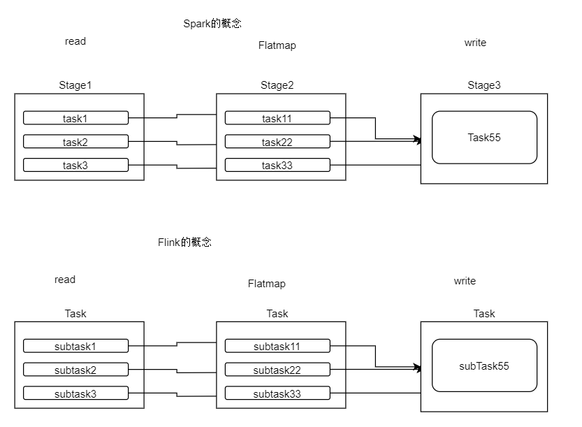
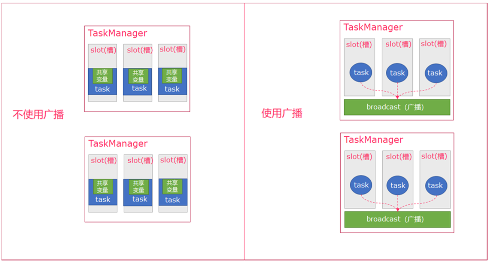
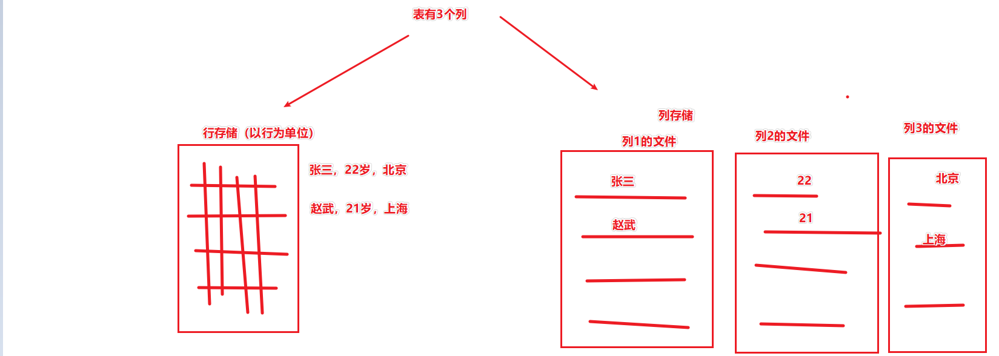
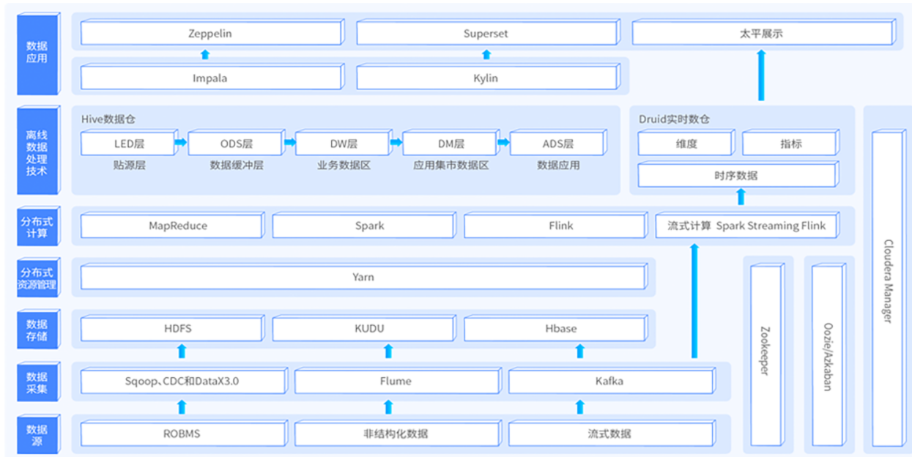
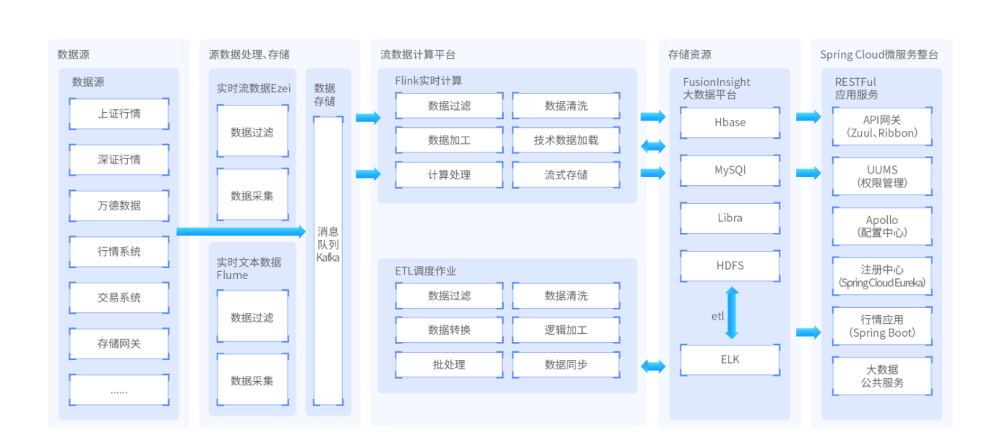

> 面试加强课程3天，面试软技能课程重点。
>
> 同学们可以放松一下，课程整体上是比较轻松的。本课程没有太高深的技术点，主要是聊天的形式给同学们加强关于面试的方方面面。

> 课程很简单，但是很有用，这些都是老师们多年的经验之谈。同学们请把课程中说的都执行下去，拿到高薪。


# 一、面试软技能（本课程重点）

> 大约1~2天的课程时长。

## 1.1 招聘网站岗位JD分析

### JD分析

#### 搜索页分析


如图，在页面里面信息很多。

公司的融资和人数情况：可以判断公司的成熟度以及是否有钱。是否稳定，是否创业等等

公司的行业：可以大体上判断是做什么类型

	- 互联网：节奏快、钱多、融资快、死得快、加班
	- 教育开发：节奏不是很快，迭代比互联网慢，加班也加班。
	- 金额：死的很快。加班。面试如果表现好，可以多要钱。
	- 零售：需求经常变动，加班。工资一般。
	- 国企（机关）：俩字：啥都稳定。


薪资范围：大体感受一下招聘放的需求强度。10-14K范围，可以感受招收初、中级开发

40K-50K 一般也不用投，这是找高级、超高级。


工作年限：

	- 大部分公司都写个3-5. 一般写3-5 也是适合我们的。 
	- 1-3：要求比较低（对广度低，对深度的要求不会低)
	- 5年+：要求高一些（经验阅历上有要求了，深度上也更高）


公司：知名的公司，可以百度搜一下面试的流程和经验。


#### JD详情分析


如上图，通过这两个JD我们可以提取出非常多的重要信息。

这些信息指导我们如何针对这两个岗位进行面试的复习。


如果你分析的JD多，很多技术点就重合了。

你可以看到谁重合的多，整体上，复习更有方向。


### 招聘网站

- Boss、拉勾：比较偏向互联网行业的招聘
- 智联：全行业招聘
- 猎聘:
- 拉勾:
- 领英：全球化的、职场人脉平台，也可以投递简历。


## 1.2 简历

- 技能点

  - 精通（最少1个）
  - 熟练（最多的）
  - 掌握（不要太多）
  - 了解（最多2）

  精通最少1个，多数是熟练，少量的了解和掌握。

  > 需要美化，不要过分美化。
  >
  > 比如了解的知识，写成熟练，那么别人就会问的更细，但你答不出来。

- 项目点

  - 简介

    不要臭长。简单明了说明项目用了什么，要做什么目的即可。

  - 描述

    会什么写什么。==不熟悉的或不会的关键字不要出现。==

  - ==业务（必须熟悉）==

    - 必须把自己简历中的项目，都实现一遍。
    - 背下来业务（理解）

  - 个人职责

    不要臭长。

    以列表的形式列出主要工作职责即可。简洁明了。同样遵循：不懂的不要写。

  - 重点事迹

    > 重点注意：可能会问你，项目中遇到了什么棘手的问题，怎么解决的。
    >
    > 或者项目中有哪些里程碑式的时刻。
    >
    > 提前准备好，最少一个点。

  - 遇到的问题和解决方案


> 对简历中的知识点，和项目中的业务逻辑等所有内容，均可以准备好答案，`背下来`
>
> - 比如项目点, 项目中的数据流转流程, 准备好背下来
> - 比如技术点, 比如Spark内存迭代原理,准备好背下来


## 1.3 面试如何说话

- 自信、阳光
- 不要废话连篇（说一堆，说不到点子上）
- 尽量话多（不是废话）
- 不懂就直说
- 不管你懂不懂，语速都要匀速，不要结巴，不要卡壳。

==双方平等, 正常聊天==

> 训练:
>
> 1. 背知识点以及个人介绍，背多了 说话就顺溜了。
> 2. 同学之间可以两两的一对一模拟。

## 1.4 面试前准备

- 熟悉公司
- ==针对公司优化简历==
  - 针对岗位类型:
  - 数仓类
  - Spark离线类
  - ETL类
  - 实时计算类
  - 觉得麻烦,只有一份也没啥问题.
- 推测面试问题，提前准备答案（背下来）
- 心态放平。

## 1.5 面试中准备

- 个人介绍

  提前准备后，背下来

- 项目介绍

  介绍要简洁，一针见血，同样可以背下来。

- 问题回答

  - 如果不懂不要废话
  - 如果懂，回答的时候，需要`先`一针见血的将问题`正面`回答。然后开始你的表演。

- 手写代码(重要)

  附带单元测试

  一般发生在大型公司或某些外企的面试中。

  而且一般是算法类型的面试题。

  > 刷算法题，练习手写代码
  >
  > [力扣 (leetcode-cn.com)](https://leetcode-cn.com/)

- 思路描述

  背就是了。

  

## 1.6 面试后准备

- ==心态，面试后不要在想了。==

- 总结、错题本

  准备一个错题本，记录面试中的失败场景。

  人不可以在一个地方失败两次。

- 关注、可以适当的询问一下

  > 开发很忙，经常会遗忘一些事情，比如面试的结果。
  >
  > 适当的询问一下让其想起来说不定offer就来了

- 优化简历

  面试完成后，可能会发现简历中的一些坑。尽量去修补它。


## 1.7 如何和HR聊天

- 大公司HR聊天也很重要，小公司技术最重要HR只是一个过程。

- 面对HR，自信、阳光、不要暴露自己的性格缺陷（大的）

- > 其实就是让对方觉得你是一个正常小伙，没啥变态的地方即可。

- HR的任务是压工资，但不会故意刁难

- 薪资范围，HR决定权不高（技术的意见比重很大）

  > 薪资范围大多数公司是技术决定，和HR商讨。HR不懂技术，会从技术那里得到一个大概的薪资范围。
  >
  > HR会尽量不让你的工资突出这个范围的上限。
  >
  > HR的报价，一般是你的允许薪资范围中的中下部分。
  >
  > 我们可以适当的在这个价格提价。
  >
  > 1. HR问你的期望薪资是什么：如实回答。
  > 2. HR会说我们做的薪酬计划是xxx.，你可以在她说这个后 进行提价.(`这是最好的时机，也是唯一的时机`)
  > 3. 千万不要在都聊好了之后 再反悔要加钱。

1. 要钱的时候, 正常要
2. 一次没谈好,不要结束对话,重新报价(降低),询问对方价格. 不谈好, 不要结束.

## 1.8 常见的面试流程：

- 2面+电话（最多）（换了个人，依旧是技术）
  - 做好跑两次的准备
  - 保持手机畅通
- 3、4、5...面（比较少，也存在）
  - 跑断腿的准备
  - 心态放平，因为最终可能不通过很难受
  - 这种类型的可以多要些
- 1面直接确定（不多，也有）
  - `一般`外包居多
  - 急招人的
  - 这种类型的还是可以多要。
- 纯电话面试（有一部分）
  - 打个心眼：有小部分是骗子
  - 除了骗子，正规的一般也是外包居多。这种情况一般你还需要去甲方现场再面一次。


> 招聘去东南亚出国工作的，不要去。

## 1.9 小细节

- 自带纸质简历（多准备一些，或者提前到地方找附近打印）以及`笔`\和白纸
  - 面试的时候观察面试官，它手里没有简历和笔你要主动递上。简历和笔，缺什么递什么
- 不要正装（太正式程序员没好感，略显油腻）
- 衣着放松并`正常`
- 谈吐得当、不卑不亢且对面试官有所尊重
- 什么电影中演的面试捡地上垃圾啥的，都是假牙。但整个流程中你要给人的印象是：素质高、懂礼貌、尊重人、听安排也有主见。

## 1.10 其它

- 有条件的话，将英语锻炼一下。主要是阅读、其次是口语
- 专科学历前几年不影响，后面抓紧搞个学信网本科
- 有自我规划的人，5年后会和别人拉开差距
- 做事不怂，正面刚。折磨的是自己，提升的是工资
- 面多了 就熟了，就不紧张不怂了。说话都顺溜了。
- ==面试同考试，准备充分完全可以吊打面试官。==


## 1.11 样例简历讲解

- 简历里写什么就会被问到什么，能写进去的要确保不怕被问（了解的除外）

- 整体在话术上太过`直白、直给`，可以优化一下话术，比如：

  使用impala进行操作hive数据仓库，完成主要的查询、统计等功能 >> 替换为：

  结合Impala和Hive构建数据仓库，并完成对业务数据的指标开发和分析

  > 话术方面考虑到我们经验不多，可以将写好的简历发给授课老师来优化一下。

- 技能点偏少和偏保守。尽量能多点

  > 技能点能多写，表示个人水平是真实的提升到符合简历的。
  >
  > 而不是不懂但是就往上面写。
  >
  > 需要花时间努力复习和强化自身。


# 二、常见面试问题

> 这个不是面试加强课的重点， 但是是我们来黑马学习的重点。
>
> 面试加强不会太和同学们说一些技术点啥的，这些是你们学习技术课程的重点。
>
> 这里主要是指出方向，同学们课下请努力。
>
> 抽取了一些比较`简单和常见`的面试题，课程附带有一份面试宝典的资料。
>
> 里面包含了非常多的面试题目，要求同学们100%刷一遍。


> 面试就是考试，准备充分，分分钟秒杀90%的面试官（大多都挺水，而且他们无准备）
>
> 不要觉得刷题太枯燥，程序员的真实水平和面试中表现出来的是不一致的。
>
> 我们要做的是让面试表现的最好（当然，工作中你也不能放水啊）
>
> 题目刷烂，月薪过万。

## 2.1 技能性问题

### 2.1.1 Hadoop

NameNode: 主节点, 管理节点

DaataNode: 从节点, 存储管理数据

这是典型的主从架构.

Block块的形式存储在Datanode服务器上.

文件: 逻辑概念, 一堆物理的block块组成的

block块:是hadoop数据的物理存储单位.

副本:默认3份, 每一个block块都会有2个副本, 总的是3份. 副本的份数越多 数据约安全.

丢数据: 如果宕机的DN数量 >= 副本数, 那么就有可能丢失数据了. 宕机越多 几率越高.

如果DN数量 > 副本数的前提下, 宕机数量小于副本数, 不会丢失.


HDFS 是  `分布式文件系统`


#### 数据写入的流程

1. NameNode做权限判断、空间判断等前置操作，判断是否允许执行写入操作。
2. Client请求NameNode，NameNode返回可用的DataNode列表
3. 副本1的选择：
   1. Client本身是DataNode就写到当前DN
   2. Client不是DN，就随机选择一个节点
4. 副本2：和副本1不在一个机架的某个节点
5. 副本3：和副本2同机架的随机节点
6. 副本4、5、6...:纯随机了。
7. Client向副本1所在的DN发送block块数据，同时DN1和DN2和DN3建立连接，组成Pieline
   1. 数据首先被写入FSDataOutputStream对象内部的Buffer中
   2. 数据被分隔为一个个的DataPackage（Packet），每个64K
   3. 每个Packet附带一组chunk和对应的checksum数据用来做数据校验
   4. 当数据流达到了一个Packet大小，这个Packet被构建出来
   5. Packet放入dataQueue中
   6. DataStreamer线程从dataQueue中取出Packet发送到DN1
   7. Packet被放入ackQueue队列
   8. ResponseProcessor线程接受从DN返回的ack，如果成功，从ackQueue中删除Packet
      1. 如果失败，所有失败的Packet都从ackQueue中移除，将Packet重新放入dataQueue
      2. 同时DN之间的Pieline会重新构建，排除失败的DN，构建新的Pieline
      3. 继续流程
   9. 在DN1接受你的Packet的同时会将数据同步给DN2和DN3
   10. 当一个block写入完成后，Client会得到反馈通知
   11. ...重复以上步骤写剩余的block
8. Client写完所有的block后，通知NameNode。
   1. Client会Close连接
   2. NameNode会`更新元数据`
   3. 全流程完成。


#### 读取数据的流程

很简单：

1. Client向NameNode发起读请求
2. NN根据`网络距离`返回block列表
   1. 如果Client本身是DN，优先读取本机
   2. 如果不是DN，优先级是：同一个节点的进程(Docker) -> 同一个机架的其它DN -> 同一个数据中心的不同机架节点 -> 不同数据中心的节点
3. 根据block列表，去读取数据


#### SecondaryNamenode的作用

帮助NameNode合并FSImage和Edit

Namenode在`运行`过程中不会合并，只会在启动的时候合并一下。


==千万不要认为SN 在NN宕机后可以接管, 不是的. SN只是一个辅助进行合并FSImage和Edit的角色==

==在1.x版本中 官方没有原生的HA解决方案==


#### HA的原理

通过奇数的JounalNode节点集群在Active和Standby的NameNode之间同步数据（FSImage和Edit）。

Active复制写Edit文件（新操作），Standby复制FSImage和最新的Edit文件进行合并为一个新的FSImage发送给Active

如果Active宕机，由Standby接管FSImage和Edit文件，提供NameNode的功能。

宕机的如果恢复，会变成Standby负责合并。


#### Block和文件的关系

文件是`逻辑的`

Block是`物理的`

一个文件由一个或多个Block组成。

一个Block只能属于一个文件，一个文件可以有多个Block

#### FSImage和Edit文件的区别

FSImage：某一个时间点的元数据

Edit：在FSImage时间点之后的一系列元数据更改(流水账形式)


Edit会定期和FSImage合并，生成最新的FSImage。


类似HBase的HFile合并

#### SecondaryNamenode有啥用

就是HA中Standby的作用。

定期从NameNode拉取FSImage和Edit合并为一个FSImage发送回NameNode

NameNode接收到新的FSImage后，替换旧的FSImage并清理过期Edit。


> 问题1：如果不启动SecondaryNamenode并且也没配置HA，会怎么样
>
> 答：正常NameNode自身是不会在运行的过程中进行FSImage和Edit的合并的，只会在重启的时候合并。这样会导致Edit越来越多。FSimage不变。
>
> 会导致，读写的时候NameNode索引变慢，以及如果重启集群，合并Edit的过程会很久。

#### 如果不用2.0的HA机制，在1.x版本上也想实现NameNode的高可用怎么做？

> 如果要做HA两个核心点：
>
> 1. 元数据的跨机器同步（可以用NFS）
> 2. 切换NameNode（虚拟IP）
>
> 答：可以用NFS机制，让NameNode的元数据和另外一台机器是同步的。同时将NameNode的IP部署为虚拟IP
>
> 在两台服务器上启动NameNode。让虚拟IP指向其中一个机器，如果发生宕机，就将虚拟IP指向另外一台机器即可。
>
> 基于NFS的同步，元数据两台机器是一致的，可以直接接管。
>
> 只是在虚拟IP切换的间隔会有一段时间服务的中断时间。(HA Active和Standby的切换也有中断时间。)
>
> 这是Hadoop1.x版本中比较常见的解决方案。


#### 谈谈Hadoop序列化和反序列化及自定义bean对象实现序列化?

1. 序列化和反序列化
   序列化就是把内存中的对象,转换成字节序列(或其他数据传输协议)以便于存储(持久化)和网络传输。

   反序列化就是将收到字节序列(或其他数据传输协议)或者是硬盘的持久化数据,转换成内存中的对象。

   Java的序列化是一个重量级序列化框架(Serializable),一个对象被序列化后,会附带很多额外的信息(各种校验信息,header,继承体系等),不便于在网络中高效传输。

   所以,hadoop自己开发了一套序列化机制(Writable),精简、高效。

2. 自定义bean对象要想序列化传输步骤及注意事项:。

   1. 必须实现Writable接口
   2. 反序列化时,需要反射调用空参构造函数,所以必须有空参构造
   3. 重写序列化方法（数据转字节数组）
   4. 重写反序列化方法（字节数组转回普通数据）
   5. 注意反序列化的顺序和序列化的顺序完全一致
   6. 要想把结果显示在文件中,需要重写toString(),且用”\t”分开,方便后续用
   7. 如果需要将自定义的bean放在key中传输,则还需要实现comparable接口,因为mapreduce框中的shuffle过程一定会对key进行排序


### Shuffle的类型

- sort shuffle: 先排序,排好序后, 洗牌就完成了.
- hash shuffle: 不会排序, 挨个将数据取出, 进行分类


#### 为什么会产生yarn,它解决了什么问题,有什么优势?

- 产生YARN基于对资源最大化的需求
- YARN基于容器技术，基于资源隔离，可以让多种计算框架共享集群资源。


Yarn最主要的功能就是解决运行的`用户程序与服务器资源解耦`。

Yarn上可以运行各种类型的分布式运算程序(mapreduce只是其中的一种),比如mapreduce、storm程序,spark程序......


同时Yarn也是一个资源管理框架，可以整合集群的资源，通过YARN来管控各个JOB的运行资源。

做到资源最大化的利用。


表-> Region -> CF -> HFile

### 2.1.2HBase

#### Memstore和HFile的关系


数据先写WAL，然后写入Memstore，在Memstore中排好序，达到一定的阈值后，刷新到HDFS成为HFile

阈值：达到Memstore规定的最大限制，或者被手动指定刷写到硬盘中。

一个Memstore是一个HFile


#### 一条数据数据写入HBase的流程

1. 写HLog(未排序)
2. 基于Rowkey确定自己所应该去的region
3. 确定region后,就确定了RegionServer
4. 数据到达RegionServer后,进入所在region的内存空间
5. 数据进入到region的内存后, 基于数据的列族, 确定进入哪一个Memstore中被排序
6. 在Memstore中被排序,当Memstore达到临界点(太大, 时间太长, 整个RegionServer内存紧张),Memstore被刷新到硬盘
7. 形成一个HFile文件,落入到 所属的region所在的文件夹中,所属的列族所在的文件夹中


#### Memstore和Region的关系

region是逻辑概念

memstore在内存中是物理实体

hfile在硬盘中是物理实体


一个Region拥有`一个或多个`Memstore

如果Region只有一个ColumnFamily那么这个Region只有一个Memstore

如果有多个CF，那么就有几个Memstore

Memstore和CF是一一对应的.


#### HBase整体概念图解


#### 优化案例(背下来带走)

> 这里面的一些优化技巧：
>
> 一个RegionServer的内存是固定的（一般不会变化），Region在一定的时间内也是数量大体上可以确定的。
>
> 那么，基于CF的个数，我们可以推断出某个RegionServer大体上会在内存中存在多少个Memstore。
>
> 如果参数设置的不合理，会导致，每个Memstore均没有达到被刷写到硬盘的大小，但是整体RegionServer的内存占用达到了强制刷写的阈值。
>
> 这样的话会触发，强制刷写所有的Memstore，这样会写入和查询都是很大的影响。
>
> 所以，在配置参数的时候，要确保，所有的Memstore的单个刷写阈值 * 大体上Memstore的个数 是小于RegionServer的强制刷写阈值的。
>
> 这样可以确保Memstore会一个个的写磁盘，而不是被强制全部写硬盘。

> 上面这个如果项目中有着重使用HBase的项目，这个你理解了后可以拿去。
>
> 当别人问你项目中遇到了什么问题，可以以这个来回答。


```shell
hbase.hregion.memstore.flush.size 单个memstore的大小上限，超出后，此Memstore的数据被放入一个生产者队列，有单独的线程从队列中将数据刷新到硬盘形成HFile
hbase.regionserver.global.memstore.lowerLimit 0.35 在upperLimit前，达到这个预置会找到较大的Memstore阻止其写，将其刷新到磁盘，是在upperLimit之前的补救措施
hbase.regionserver.global.memstore.upperLimit 0.40 达到限制，强制所有Memstore刷新，并阻塞写
hfile.block.cache.size 0.2 读缓存占全部heap内存的比例，越大读性能越好，写性能越差
hbase.hregion.memstore.block.multiplier 2  当单个region 的memstore size达到hbase.hregion.memstore.flush.size*hbase.hregion.memstore.block.multiplier时，本region的update会被block。
```


#### 什么时候HBase会将MemStore写入硬盘？

- 每个Memstore都有最大限制（配置项可以修改），达到最大限制会写硬盘。`hbase.hregion.memstore.flush.size`

- 或者Memstore所在的RegionServer的内存整体占用超过了一个阈值，也会导致这个RegionServer上的所有Memstore都刷写硬盘

  ```shell
  hbase.regionserver.global.memstore.lowerLimit 0.35 在upperLimit前，达到这个预置会找到较大的Memstore阻止其写，将其刷新到磁盘，是在upperLimit之前的补救措施
  hbase.regionserver.global.memstore.upperLimit 0.40 达到限制，强制所有Memstore刷新，并阻塞写
  ```

- 或者默认如果1小时都没有写，那么到达一个小时的时候会写硬盘。


#### Memstore写硬盘生成的是什么？

写硬盘生成的是HFile


#### HFile内是排好序的吗？

是的。在Memstore写硬盘之前是先排好序才写的。


#### 多个HFile之间的数据有顺序的关系吗？

没有。单个HFile内是有序的。多个HFile之间就不确定了。


#### 为啥要合并HFile，不合并不行吗？

不合并不行。

这很影响查询性能。

每个HFile内是有序的，相当于有个范围。

但是由于写入的数据内容是不可控的，导致多个HFile之间的数据范围是存在重合的。

这就导致某些查询无法准确的确定某一个HFile，必须这几个范围重合的HFile都去检索才能找到数据。

导致效率低下。


所以合并为一个最好。


#### 什么是WAL，为什么要用WAL

写入顺序：

1. 先写WAL（WAL不排序，按照数据的顺序记录WAL即可）
2. 写入内存，内存中排序（Memstore）
3. 将Memstore写入硬盘为HFile


写入集群之前先写WAL，这是因为HBase是先写入内存的。当内存达到条件后才会刷写到硬盘。

由于内存不能持久化，所以先写WAL避免内存丢失数据，写入的数据丢失。

内存丢失数据可以从WAL中恢复。


#### Region分区有什么用？如何设计Rowkey？应避免什么

1. region分区在查询的时候,可以快速过滤掉绝大部分的数据, 比如分区10个region, 第一次就排除90%数据, 1000个region 第一次就排除99.99%数据
2. 锁定region后,内部hifle在理想状态下,是会合并成`一个有序的`hfile. 有序数据查询单条,是很快 比如二分查找


每个Region都有`开始和结束`的范围。

当查询的时候，可以很快的基于每个Region的范围确定要查询的数据在哪个Region之内。

这样就避免的大多数的数据扫描。

又由于HFile内是`排好序`的，所以准确的定位一条数据是很快的（比如二分查找）


Region的个数和范围可以认为在建表的时候指定，也可以由HBase自动管理（不推荐）

- HBase自动管理虽然省心，但是由于HBase不知道你的数据是啥，所以Region的范围和个数不是很合理会频繁的切分。
- 一般我们建表的时候，自己指定好Region的个数和每个Region的范围，这样可以让Region的分配更合理。


`Rowkey决定了数据写入HBase会去哪个Region`（根据Region的范围，字符串排序来比较）


> 设计rowkey或者设计Region分区需要考虑的是：对未来写入的数据有个认知，尽量设计Region的分区能够满足未来的数据可以均匀的分散在各个Region内

> 举例：假设rowkey、必须用手机号，很难打散，如果不考虑范围，反转手机号作为Rowkey存储就可以打散。

`应当避免：写入的Rowkey是单调递增或递减这种类型的。`

因为这样会导致所有的写入都会涌入某一个Region，造成一个Region热点，而其它的Region没事做。集群的分布式性能被浪费掉了。


#### ColumnFamily在物理上会怎样影响HBase的存储？

每个表的不同ColumnFamily在HDFS上的体现就是 不同的文件夹。


HBase的存储是  表 -》 Region -》 CF -》 HFile

一个HBase有多个表（多个表文件夹）

一个表内有多个Region（一个Region一个文件夹）

一个Region内有多个CF（一个CF一个文件夹）

一个CF文件夹内有多个HFile文件

多个HFile文件会定期合并为1个


> 所以说HBase是列存储，CF是物理列存储的划分依据。


#### HFile中存储的是什么数据？

存储的是一堆Cell单元格。

可以认为 存储的是一行行的数据， 每一行数据就是一个Cell对象


#### 单元格（Cell）是什么，ColumnFamily是什么，Column又是什么

单元格是HBase数据的最小单位，包含：

- Rowkey
- Column（不是CF）(因为HFile在CF的文件夹内，所以无需记录这个，浪费空间)
- 时间戳
- 数据本身


CF是HBase中的列簇。

Column是一个列簇中的不同的列。这是逻辑上的概念，在物理上，同一个列簇的数据`可以`都在同一个HFile(假设合并为1个HFile了)

在HFile中存储的是Cell，Cell中包含Rowkey、Column、TS、data。在这里不同的Column在单元格之间就是不同了。


表 -> region -> cf -> hfile -> cell -> kv 


#### HBase是KV型数据库，K是啥，V是啥

一个KeyValue数据就是一个Cell对象

其中：Key是：`Rowkey + Column + 时间戳` 组成

Value就是当前Column存储的数据


#### 压缩对大数据框架的作用是什么, 为什么都会用压缩?

1. 减少数据的体积, 减少磁盘容量的侵占 以及 极大减少网络传输的开销
2. 尽管压缩会消耗CPU性能(额外的CPU处理时间), 总时间上还是比 未压缩要快

==以CPU 换 空间\网络传输 上的性能==


#### Scala函数式编程的核心价值是什么?

函数式编程的本质是: `传递 执行逻辑`

而非普通编程下的 传递数据


函数式编程可以做到: 计算数据被确定, 但是 计算逻辑待补充.

这个思想下, 其实Java的反射也是这个逻辑.


### 2.1.3 Kafka

#### 分区-副本概念图

zookeeper:kafka集群的协调者

broker:干活的

topic:一类数据的逻辑体现

topic的分区: 将topic的数据,分层几份, 由分布式broker托管(极大的利用分布式性能)

副本: topic的每一个分区,都可以设置副本, 副本是对数据安全的备份.


#### Offset概念图

TTL:数据的生命周期(默认是7天,可以修改)


#### Kafka有啥用？


Kafka作为消息队列的主要作用

- 消峰：消除峰值性能影响
- 解耦：解除两个组件的耦合关系（由消息队列中转）


Kafka本质上也是一个`分布式`、`高吞吐`、`持久化`、`一致性`的`消息队列`，也就是提供了：

- 抗住大数据量的性能（分布式）
- 能够持久化数据（保证消峰的同时能够缓存住数据，让消费者平稳输出）
- 基于ack和多副本，和offset确保数据安全


Kafka有时候会被称之为：`消息中心、事件总线`


#### Kafka的特点？

- 消息队列（消峰、解耦）
- 高吞吐
- 分布式（横向拓展）
- 基于offset指针消费（可重复消费）
- 支持精确一次的一致性（ack机制）
- offset可以自行管理
- 消费者划分group，每个group的offset是相互独立的
- 多分区（一个消费者一个分区）性能好。
- 数据有副本，安全。


缺点:

- 强数据安全的场景下, 不太适用(本质就是只有生产者的ACK,没有消费者的ACK)


#### Kafka支持三种消息投递语义:

1. At most once 消息可能会丢,但绝不会重复传递

2. At least one 消息不会丢,但可能会重复传递

   客户端发送给

3. Exactly once 每条消息肯定会被传输一次且仅传输一次,很多时候这是用户想要的


#### 如何保证Kafka的消息有序？

Kafka对于消息的重复、丢失、错误以及顺序没有严格的要求。
Kafka`只能保证一个partition中的消息被某个consumer消费时是顺序的`,事实上,从Topic角度
来说,当有多个partition时,消息仍然`不是全局有序的`。


#### kafka数据丢失问题,及如何保证

1)数据丢失:
acks=1的时候(只保证写入leader成功),如果刚好leader挂了。数据会丢失。
acks=0的时候,使用异步模式的时候,该模式下kafka无法保证消息,有可能会丢。
2)brocker如何保证不丢失:
acks=all : 所有副本都写入成功并确认。
retries = 一个合理值。
min.insync.replicas=2 消息至少要被写入到这么多副本才算成功。
unclean.leader.election.enable=false 关闭unclean leader选举,即不允许非ISR中的副本被选举为leader,以避免数据丢失。
3)Consumer如何保证不丢失
如果在消息处理完成前就提交了offset,那么就有可能造成数据的丢失。
enable.auto.commit=false 关闭自动提交offset
处理完数据之后`手动提交`。


#### Kafka服务器能接收到的最大信息是多少?

Kafka服务器可以接收到的消息的最大大小是1000000字节。


#### 一个分区可以被多个消费者消费吗？

可以.但是要求消费者是不同组的.

如果是一个消费者组, 只能有一个消费者消费此分区.


#### 一个消费者可以消费多个分区吗？

可以。一个消费者可以消费多个分区，但是一个分区只能给一个消费者服务`哦`。


#### offset和谁有关？

和消费者的group有关。

消费者必须提供自己的group。


#### Kafka ISR概念 | Kafka的副本同步

1、AR（Assigned Repllicas）一个partition的所有副本（就是replica，不区分leader或follower）

2、ISR（In-Sync Replicas）能够和 leader 保持同步的 follower + leader本身 组成的集合。

3、OSR（Out-Sync Relipcas）不能和 leader 保持同步的 follower 集合

公式：AR = ISR + OSR


kafka不是完全同步，也不是完全异步，是一种特殊的ISR（In Sync Replica）

1.leader会维持一个与其保持同步的replica集合，该集合就是ISR，每一个partition都有一个ISR，它时有leader动态维护。

2.我们要保证kafka不丢失message，就要保证ISR这组集合存活（至少有一个存活），并且消息commit成功。


所以我们判定存活的概念时什么呢？分布式消息系统对一个节点是否存活有这样两个条件判断：第一个，节点必须维护和zookeeper的连接，zookeeper通过心跳机制检查每个节点的连接；第二个，如果节点时follower，它必要能及时同步与leader的写操作，不是延时太久。

如果满足上面2个条件，就可以说节点时“in-sync“（同步中的）。leader会追踪”同步中的“节点，如果有节点挂了，卡了，或延时太久，那么leader会它移除，延时的时间由参数replica.log.max.messages决定，判断是不是卡住了，由参数replica.log.time.max.ms决定。


### 2.1.4 Hive数仓


#### 什么是数仓？

数仓：数据仓库（Data Warehouse， DW）

是一个公司的（`结构化`）业务数据的集中存储。

1. 全公司数据的集中化存储(解决了数据孤岛问题)
2. 只能搞结构化数据


数据仓库，既然是仓库，那么就是所有的业务数据都汇集到数仓中做`集中存储`

这样方便统一整合数据进行数据分析，避免了数据孤岛。


- 什么是数仓：数据仓库，既然是仓库，那么就是所有的业务数据都汇集到数仓中做`集中存储`这样方便统一整合数据进行数据分析，避免了数据孤岛。
- 什么是大数据数仓：一般满足：在业务数据集中存储的前提下，`海量存储能力` + `海量分析处理`能力，也就是分部署存储 + 分布式计算
- 为什么数仓都支持SQL：第一：SQl适用人群更多  第二：SQL所见即所得的开发方式更为简单。


#### 常见的数仓分层？


- ODS：数据存储层（原始数据）
- DW：数仓层
  - DWD（数据清洗层）：在ODS基础上清洗数据（空值、脏数据、超过范围极限的等）、维度退化、脱敏等。
  - DWM(维度退化层):退化维度,形成大宽表的层次
  - DWS（以DWD为基础）在业务上做轻度汇总（一般是时间、天）
  - DWT（在DWS或者DWD的基础上），按照主题进行汇总
- ADS：在DW的基础上得到的结果，可以直接对外提供。


一般可以认为数仓的这三个分层可以理解为：

- 输入层（ODS）
- 处理层（DW）
- 输出层（ADS）


> 这只是常见的三层，很多公司由于业务复杂分了很多层。
>
> 也总归脱离不掉：输入、处理、输出三大结构。
>
> 顶多就是三大结构中由细化了很多层而已，但总的就是这三个结构的概念：输入、处理、输出。


#### Hive表关联查询，如何解决数据倾斜的问题？

1）倾斜原因：

map输出数据按`key Hash`的分配到reduce中，由于key分布不均匀、业务数据本身的特、建表时考虑不周、等原因造成的reduce 上的数据量差异过大。

==一句话，不均匀==

如何避免：对于key为空产生的数据倾斜，可以对其赋予一个随机值。

2）解决方案

（1）参数调节：

hive.map.aggr = true

```shell
设置hive.map.aggr=true，提高HiveQL聚合的执行性能。

这个设置可以将顶层的聚合操作放在Map阶段执行，从而减轻清洗阶段数据传输和Reduce阶段的执行时间，提升总体性能。

缺点：该设置会消耗更多的内存。

注：顶层的聚合操作（top-levelaggregation operation）,是指在group by语句之前执行的聚合操作。
```

hive.groupby.skewindata=true	//决定  group by 操作是否支持倾斜数据。


有数据倾斜的时候进行负载均衡，当选项设定位true,生成的查询计划会有两个MR Job。

第一个MR Job中，Map的输出结果集合会随机分布到Reduce中，每个Reduce做部分聚合操作，并输出结果，这样处理的结果是相同的Group By Key有可能被分发到不同的Reduce中，从而达到负载均衡的目的；

第二个MR Job再根据预处理的数据结果按照Group By Key 分布到 Reduce 中（这个过程可以保证相同的 Group By Key 被分布到同一个Reduce中），最后完成最终的聚合操作。

（2）SQL 语句调节：

① 选用join key分布最均匀的表作为驱动表。做好列裁剪和filter操作，以达到两表做join 的时候，数据量相对变小的效果。

② 大小表Join：

使用map join让小的维度表（1000 条以下的记录条数）先进内存。在map端完成reduce.

③ `大表Join大表`：

分为A表和B表来解释

A表，在key后加随机数（固定范围，如1~100范围）

B表，把key所在的数据翻100倍，比如原有key hadoop， 需要生成 hadoop-1, hadoop-2, hadoop-3...hadoop-99, hadoop-100

这样100倍翻倍的数据

这样，A的10000条数据，原本假设对应B的一条， 这样随机后， A的10000条，每一条都带有随机后缀，和B的100条对应

这样，就将倾斜降低了100倍。


所以，这个100的随机数范围，是降低倾斜倍数的利器。但是，缺点是：==导致B表容量增加100倍==

这个数越大，效果越好，但是对于B表的容量增加就越多

A和B一般是复制出来用临时表来做。

在Spark中就是临时视图来做。


参考：[大数据进阶AWS教程丨基于AWS云平台大规模集群千亿数据调优方案_哔哩哔哩 (゜-゜)つロ 干杯~-bilibili](https://www.bilibili.com/video/BV1Tv411B7Cf)

④ 去除空值影响

确保数据中没有空值或者空字符串值，这些数据对JOIN和分组有很大影响。


#### 请谈一下Hive的特点，Hive和RDBMS有什么异同？

hive是基于Hadoop的一个数据仓库工具，可以将结构化的数据文件映射为一张数据库表，并提供完整的sql查询功能，可以将sql语句转换为MapReduce任务进行运行。其优点是学习成本低，可以通过类SQL语句快速实现简单的MapReduce统计，不必开发专门的MapReduce应用，十分适合数据仓库的统计分析，但是Hive不支持实时查询。

​	Hive与关系型数据库的区别：

 

#### 请说明hive中 Sort By，Order By，Cluster By，Distrbute By各代表什么意思？

order by：会对输入做全局排序，因此只有一个reducer（多个reducer无法保证全局有序）。只有一个reducer，会导致当输入规模较大时，需要较长的计算时间。

sort by：不是全局排序，其在数据进入reducer前完成排序。

distribute by：按照指定的字段对数据进行划分输出到不同的reduce中。

cluster by：除了具有 distribute by 的功能外还兼具 sort by 的功能。


#### 简要描述数据库中的 null，说出null在hive底层如何存储，并解释select a.\* from t1 a left outer join t2 b on a.id=b.id where b.id is null; 语句的含义？

null与任何值运算的结果都是null, 可以使用is null、is not null函数指定在其值为null情况下的取值。

null在hive底层默认是用'\N'来存储的，可以通过alter table test SET SERDEPROPERTIES('serialization.null.format' = 'a');来修改。


left join后，b关联不上的都是null，这个过滤找出的是==a有b没有的数据==


#### Hive内部表和外部表的区别？

1）默认创建的表都是管理表，有时也被称为内部表。因为这种表，Hive会（或多或少地）控制着数据的生命周期。Hive默认情况下会将这些表的数据存储在由配置项hive.metastore.warehouse.dir(例如，/user/hive/warehouse)所定义的目录的子目录下。	当我们删除一个管理表时，Hive也会删除这个表中数据。管理表不适合和其他工具共享数据。

2）外部表中，Hive并非认为其完全拥有这份数据。删除该表并不会删除掉这份数据，不过描述表的元数据信息会被删除掉。


回答可以这样说:

1. 内部表删除,数据也没了, 外部表删除,数据还在
2. 内部表是写时模式产物, 外部表是 读时模式产物, 在概念上不同.


#### 写时模式 VS 读时模式

写时模式: 先有Schema, 再将数据存入.  明确了业务需求, 明确了数据组织形式, 进行开发的产物

读时模式: 先有数据, 用的时候给与Schema进行查询.  不明确未来对数据的需求, 先保存着数据, 以后用到再说的思想产物.


#### Hive join过程中大表小表的放置顺序？

将最大的表放置在JOIN语句的最右边，或者直接使用`/*+ streamtable(table_name) */`指出。

在编写带有 join 操作的代码语句时，应该将条目少的表/子查询放在 Join 操作符的左边。因为在 Reduce 阶段，位于 Join 操作符左边的表的内容会被加载进内存，载入条目较少的表可以有效减少 OOM（out of memory）即内存溢出。所以对于同一个 key 来说，对应的 value 值小的放前，大的放后，这便是“小表放前”原则。若一条语句中有多个 Join，依据 Join 的条件相同与否，有不同的处理方法。


==新版Hive中已经优化此问题, 自动优化了==

#### Hive的函数：UDF、UDAF、UDTF的区别？

UDF:  单行进入，单行输出(大部分时候是,无状态计算, 特殊场景是有状态计算,比如去外部加载数据了)

UDAF:  多行进入，单行输出(100%是有状态计算)

UDTF:  单行输入，多行输出


#### Fetch抓取

Fetch抓取是指，Hive中对某些情况的查询可以不必使用MapReduce计算。例如：SELECT * FROM employees;在这种情况下，Hive可以简单地读取employee对应的存储目录下的文件，然后输出查询结果到控制台。

在hive-default.xml.template文件中hive.fetch.task.conversion默认是more，老版本hive默认是minimal，该属性修改为more以后，在全局查找、字段查找、limit查找等都不走mapreduce。

```xml
<property>
    <name>hive.fetch.task.conversion</name>
    <value>more</value>
    <description>
      Expects one of [none, minimal, more].
      Some select queries can be converted to single FETCH task minimizing latency.
      Currently the query should be single sourced not having any subquery and should not have
      any aggregations or distincts (which incurs RS), lateral views and joins.
      0. none : disable hive.fetch.task.conversion
      1. minimal : SELECT STAR, FILTER on partition columns, LIMIT only
      2. more  : SELECT, FILTER, LIMIT only (support TABLESAMPLE and virtual columns)
    </description>
  </property>
```

案例实操：

​	1）把hive.fetch.task.conversion设置成none，然后执行查询语句，都会执行mapreduce程序。

```shell
hive (default)> set hive.fetch.task.conversion=none;

hive (default)> select * from emp;

hive (default)> select ename from emp;

hive (default)> select ename from emp limit 3;
```

​	2）把hive.fetch.task.conversion设置成more，然后执行查询语句，如下查询方式都不会执行mapreduce程序。

```shell
hive (default)> set hive.fetch.task.conversion=more;

hive (default)> select * from emp;

hive (default)> select ename from emp;

hive (default)> select ename from emp limit 3;
```

#### 本地模式

大多数的Hadoop Job是需要Hadoop提供的完整的可扩展性来处理大数据集的。不过，有时Hive的输入数据量是非常小的。在这种情况下，为查询触发执行任务时消耗可能会比实际job的执行时间要多的多。对于大多数这种情况，Hive可以通过本地模式在单台机器上处理所有的任务。对于小数据集，执行时间可以明显被缩短。

用户可以通过设置`hive.exec.mode.local.auto`的值为true，来让Hive在适当的时候自动启动这个优化。

```shell
set hive.exec.mode.local.auto=true;  //开启本地mr//设置local mr的最大输入数据量，当输入数据量小于这个值时采用local  mr的方式，默认为134217728，即128Mset hive.exec.mode.local.auto.inputbytes.max=50000000;//设置local mr的最大输入文件个数，当输入文件个数小于这个值时采用local mr的方式，默认为4set hive.exec.mode.local.auto.input.files.max=10;
```


#### MapJoin

如果不指定Map Join或者不符合Ma pJoin的条件，那么Hive解析器会将Join操作转换成==Common Join，即：在Reduce阶段完成join。==容易发生数据倾斜。可以用MapJoin把==小表==全部加载到内存在map端进行join，避免reducer处理。

1）开启MapJoin参数设置：

（1）设置自动选择Mapjoin

set hive.auto.convert.join = true; 默认为true

（2）大表小表的阀值设置（默认25M一下认为是小表）：

set hive.mapjoin.smalltable.filesize=25000000;

2）MapJoin工作机制

 

首先是Task A，它是一个Local Task（在客户端本地执行的Task），负责扫描小表b的数据，将其转换成一个HashTable的数据结构，并写入本地的文件中，之后将该文件加载到==DistributeCache==中。

接下来是Task B，该任务是一个没有Reduce的MR，启动MapTasks扫描大表a,在Map阶段，根据a的每一条记录去和DistributeCache中b表对应的HashTable关联，并直接输出结果。

由于MapJoin没有Reduce，所以由Map直接输出结果文件，==有多少个Map Task，就有多少个结果文件。==


#### Group By优化（Map端预聚合）

默认情况下，Map阶段同一Key数据分发给一个reduce，当一个key数据过大时就倾斜了。

  并不是所有的聚合操作都需要在Reduce端完成，很多聚合操作都可以先在Map端进行部分聚合，最后在Reduce端得出最终结果。

1）开启Map端聚合参数设置

​	（1）是否在Map端进行聚合，默认为True

hive.map.aggr = true

（2）在Map端进行聚合操作的条目数目

  hive.groupby.mapaggr.checkinterval = 100000

（3）有数据倾斜的时候进行负载均衡（默认是false）

  hive.groupby.skewindata = true

  当选项设定为 true，生成的查询计划会有两个MR Job。第一个MR Job中，Map的输出结果会随机分布到Reduce中，每个Reduce做部分聚合操作，并输出结果，这样处理的结果是相同的Group By Key有可能被分发到不同的Reduce中，从而达到负载均衡的目的；

第二个MR Job再根据预处理的数据结果按照Group By Key分布到Reduce中（这个过程可以保证相同的Group By Key被分布到同一个Reduce中），最后完成最终的聚合操作。


#### 行列过滤（SQL层面优化）(案例记下来)

列处理：在SELECT中，只拿需要的列，如果有，尽量使用分区过滤，少用SELECT *。

行处理：在分区剪裁中，当使用外关联时，如果将副表的过滤条件写在Where后面，那么就会先全表关联，之后再过滤，比如：

```sql
select o.id from bigtable bjoin ori o on o.id = b.idwhere o.id <= 10;# 对比select b.id from bigtable bjoin (select id from ori where id <= 10 ) o on b.id = o.id;
```


#### 动态分区调整相关参数

关系型数据库中，对分区表Insert数据时候，数据库自动会根据分区字段的值，将数据插入到相应的分区中，Hive中也提供了类似的机制，即动态分区(Dynamic Partition)，只不过，使用Hive的动态分区，需要进行相应的配置。

1）开启动态分区参数设置

（1）开启动态分区功能（默认true，开启）

`hive.exec.dynamic.partition=true`

（2）设置为非严格模式（动态分区的模式，默认strict，表示必须指定至少一个分区为静态分区，nonstrict模式表示允许所有的分区字段都可以使用动态分区。）

`hive.exec.dynamic.partition.mode=nonstrict`

（3）在所有执行MR的节点上，最大一共可以创建多少个动态分区。

`hive.exec.max.dynamic.partitions=1000`

​	（4）在每个执行MR的节点上，最大可以创建多少个动态分区。该参数需要根据实际的数据来设定。比如：源数据中包含了一年的数据，即day字段有365个值，那么该参数就需要设置成大于365，如果使用默认值100，则会报错。

`hive.exec.max.dynamic.partitions.pernode=100`

（5）整个MR Job中，最大可以创建多少个HDFS文件。

`hive.exec.max.created.files=100000`

（6）当有空分区生成时，是否抛出异常。一般不需要设置。

`hive.error.on.empty.partition=false`


#### Bucket Map Join

##### **1.1.1.1.1**  ***\*作用\****

两个表join的时候，小表不足以放到内存中，但是又想用map side join这个时候就要用到bucket Map join。其方法是两个join表在join key上都做hash bucket，并且把你打算复制的那个（相对）小表的bucket数设置为大表的倍数。这样数据就会按照key join，做hash bucket。小表依然复制到所有节点，Map join的时候，小表的每一组bucket加载成hashtable，与对应的一个大表bucket做局部join，这样每次只需要加载部分hashtable就可以了。

##### **1.1.1.1.2**  ***\*条件\****

1） set hive.optimize.bucketmapjoin = true;
2） 一个表的bucket数是另一个表bucket数的整数倍
3） ==bucket列 == join列==
4） 必须是应用在map join的场景中

 

注意：如果表不是bucket的，则只是做普通join。


#### SMB Join

全称Sort Merge Bucket Join。

##### **1.1.1.1.1**  ***\*作用\****

大表对小表应该使用MapJoin来进行优化，但是如果是大表对大表，如果进行shuffle，那就非常可怕，第一个慢不用说，第二个容易出异常，此时就可以使用SMB Join来提高性能。

SMB Join基于bucket-mapjoin的***\*有序bucket\****，可实现在map端完成join操作，可以有效地减少或避免shuffle的数据量。SMB join的条件和Map join类似但又不同。


==在Bucket Map Join的基础上，确保Bucket内数据有序，增加Shuffle性能==

##### **1.1.1.1.2**  ***\*条件\****

| ***\*bucket\**** ***\*mapjoin\****         | ***\*SMB join\****                                           |
| ------------------------------------------ | ------------------------------------------------------------ |
| set hive.optimize.bucketmapjoin = true;    | set hive.optimize.bucketmapjoin = true;set hive.auto.convert.sortmerge.join=true;set hive.optimize.bucketmapjoin.sortedmerge = true;set hive.auto.convert.sortmerge.join.noconditionaltask=true; |
| 一个表的bucket数是另一个表bucket数的整数倍 | 小表的bucket数***\*=\****大表bucket数                        |
| bucket列 == join列                         | Bucket 列 == Join 列 == ***\*sort 列\****                    |
| 必须是应用在map join的场景中               | 必须是应用在bucket mapjoin 的场景中                          |

 

##### **1.1.1.1.3**  ***\*确保分桶列排序\****

hive并不检查两个join的表是否已经做好bucket且sorted，需要用户自己去保证join的表数据sorted，否则可能数据不正确。

有两个办法：

1）hive.enforce.sorting 设置为 true。开启强制排序时，插数据到表中会进行强制排序，默认false。

2）插入数据时通过在sql中用==distributed c1 sort by c1 或者 cluster by c1==

 

另外，==表创建时必须是CLUSTERED且SORTED，如下：==

create table test_smb_2(mid string,age_id string)CLUSTERED BY(mid) SORTED BY(mid) INTO 500 BUCKETS;

综上，涉及到分桶表操作的齐全配置为：

```shell
1） 开启相关的参数:	set hive.optimize.bucketmapjoin = true;   -- 开启bucket map Join	--开启 SMB join	set hive.auto.convert.sortmerge.join=true;	set hive.auto.convert.sortmerge.join.noconditionaltask=true;    -- 自动尝试SMB联接    set hive.optimize.bucketmapjoin.sortedmerge = true;   	2） 小表的bucket数=大表bucket数3） Bucket 列 == Join 列 == sort 列	--写入数据强制排序	set hive.enforce.sorting=true;	4） 必须是应用在bucket mapjoin 的场景中5) 表必须是分桶表	--写入数据强制分桶	set hive.enforce.bucketing=true;综上所述. 如果要使用SMB Join:	set hive.auto.convert.join=true;	set hive.enforce.bucketing=true;	set hive.optimize.bucketmapjoin = true; 		set hive.enforce.sorting=true;	set hive.auto.convert.sortmerge.join=true;	set hive.auto.convert.sortmerge.join.noconditionaltask=true;	set hive.optimize.bucketmapjoin.sortedmerge = true;	同时在建分桶表的时候 , 必须显现将 sort by 进行设置, sort by必须是分桶的字段create table test_smb_2(mid string,age_id string)CLUSTERED BY(mid) SORTED BY(mid) INTO 500 BUCKETS;
```


### 2.1.5 JAVA、JVM

####  HashMap和HashTable区别

1)线程安全性不同
HashMap 是线程不安全的,HashTable 是线程安全的,其中的方法是 Synchronize 的,在多线程
并发的情况下,可以直接使用 HashTabl,但是使用 HashMap 时必须自己增加同步处理。
2)是否提供 contains 方法
HashMap 只有 containsValue 和 containsKey 方法;HashTable 有 contains、containsKey 和
containsValue 三个方法,其中 contains 和 containsValue 方法功能相同。
3)key 和 value 是否允许 null 值
Hashtable 中,key 和 value 都不允许出现 null 值。HashMap 中,null 可以作为键,这样的键只
有一个;可以有一个或多个键所对应的值为 null。
4)数组初始化和扩容机制
HashTable 在不指定容量的情况下的默认容量为 11,而 HashMap 为 16,Hashtable 不要求底层
数组的容量一定要为 2 的整数次幂,而 HashMap 则要求一定为 2 的整数次幂。
Hashtable 扩容时,将容量变为原来的 2 倍加 1,而 HashMap 扩容时,将容量变为原来的 2 倍。


####  `==`和Equals区别

`== `: 

如果比较的是`基本数据类型`,那么比较的是变量的值
如果比较的是`引用数据类型`,那么比较的是地址值(两个对象是否指向同一块内存)

equals:

如果`没重写 equals` 方法比较的是两个对象的`地址值`。
如果重写了 equals 方法后我们往往比较的是对象中的属性的内容
equals 方法是从 Object 类中继承的,默认的实现就是使用


#### Java类加载过程?


Java类加载需要经历一下几个过程:

1. 加载
   加载时类加载的第一个过程,在这个阶段,将完成一下三件事情:

   1. 通 过一个类的`全限定名`获取该类的二进制流。

   2. 在内存中生成该类的Class`对象`,作为该类的数据访问入口。

      > 这个Class对象只是一个数据的入口，在内存记录了类的信息的数据，这个时候还没有真正的构造这个类（没执行构造方法）

2. 验证
   验证的目的是为了确保Class文件的字节流中的信息不回危害到虚拟机.在该阶段主要完成以下四钟
   验证:

   1. 文件格式验证:验证字节流是否符合Class文件的规范,如主次版本号是否在当前虚拟机范围
      内,常量池中的常量是否有不被支持的类型.
   2. 元数据验证:对字节码描述的信息进行语义分析,如这个类是否有父类,是否集成了不被继承
      的类等。
   3. 字节码验证:是整个验证过程中最复杂的一个阶段,通过验证数据流和控制流的分析,确定程
      序语义是否正确,主要针对方法体的验证。如:方法中的类型转换是否正确,跳转指令是否正
      确等。
   4. 符号引用验证:这个动作在后面的解析过程中发生,主要是为了确保解析动作能正确执行。

3. 准备：进行内存的分配（针对类变量），并赋予`初值`

   特别需要注意，**初值，不是代码中具体写的初始化的值**，而是Java虚拟机根据不同变量类型的默认初始值。

   比如8种**基本类型**的初值，默认为0；**引用类型**的初值则为null；**常量**的初值即为代码中设置的值，final static tmp = 456， 那么该阶段tmp的初值就是456

4. 解析
   该阶段主要完成`符号引用`到`直接引用`的转换动作

   - **符号引用**。即一个字符串(如类名、对象名），但是这个字符串给出了一些能够唯一性识别一个方法，一个变量，一个类的相关信息。

     [JVM里的符号引用如何存储？ - 知乎 (zhihu.com)](https://www.zhihu.com/question/30300585)

   - **直接引用**。可以理解为一个内存地址，或者一个偏移量。

5. 初始化
   初始化类的过程。也就是执行构造方法的过程。

   如果有继承关系，顺序是先初始化构造父类，然后再构造子类，依次向下。

6. 使用

7. 销毁


#### 简述Java内存分配与回收策略以及Minor GC和Major GC(full GC)


内存分配:

1. 栈区:栈分为java虚拟机栈和本地方法栈\
2. 堆区:堆被所有线程共享区域,在虚拟机启动时创建,唯一目的存放对象实例。堆区是gc的主
   要区域,通常情况下分为两个区块`年轻代`和`年老代`。更细一点年轻代又分为`Eden区`,主要放
   新创建对象,`From survivor` 和 `To survivor` 保存gc后幸存下的对象,默认情况下各自占比
   8:1:1。
3. 方法区:被所有线程共享区域,用于存放已被虚拟机加载的类信息,常量,静态变量等数据。被Java虚拟机描述为zhan的一个逻辑部分。习惯是也叫它永久代(permanment generation)
4. 程序计数器:当前线程所执行的行号指示器。通过改变计数器的值来确定下一条指令,比如循环,分支,跳转,异常处理,线程恢复等都是依赖计数器来完成。线程私有的。


回收策略以及Minor GC和Major GC:
1)
 对象优先在堆的Eden区分配。
2)
 大对象直接进入老年代。
3)
 长期存活的对象将直接进入老年代。


当Eden区没有足够的空间进行分配时,虚拟机会执行一次Minor GC.

Minor GC通常发生在新生代的Eden区,在这个区的对象生存期短,往往发生GC的频率较高,回收速度比较快;


Full Gc/Major GC 发生在老年代,一般情况下,触发老年代GC的时候不会触发Minor GC,但是通过配置,可以在Full GC
之前进行一次Minor GC这样可以加快老年代的回收速度。


#### Synchronized与Lock的区别


1)Synchronized能实现的功能Lock都可以实现,而且Lock比Synchronized更好用,更灵活。
2)Synchronized可以自动上锁和解锁;Lock需要手动上锁和解锁（类似事务的提交）


#### List、Set、Map 是否继承自Collection 接口?

答:List、Set 是,Map 不是。

Map是键值对映射容器,与List和Set有明显的区别

而Set存储的零散的元素且不允许有重复元素(数学中的集合也是如此),List是线性结构的容器,适用于按数值索引访问元素的情形。


#### ArrayList LinkedList 区别(背)

ArrayList底层是线性表, 检索快, 插入慢.

LinkedList底层是链表,  插入超级快, 检索慢


线性表和链表的概念, 去百度, 10分钟包会.


### 2.1.6 Spark

#### RDD是什么，和普通的List有什么区别？

RDD是弹性分布式数据集。

本质上是一个数据结构。只是这个数据结构是分布式的，数据是零散的分散在集群的各个机器上的。

普通的List一般我们叫做本地集合。也就是代码所在的客户端进程的内存中存在。不会跨机器，不是分布式的。


其相同点就是都是数据结构，都能支持对数据的存取等操作，只是底层的实现不同而已。


Flink: JobManager TaskManager

#### Spark\Flink有几种部署方式?请分别简要论述

1. Local:运行在一台机器上,通常是练手或者测试环境。

   > 核心点：一个JVM进程中多个线程模拟出整个Spark\Flink环境

   

2. Standalone：Spark\Flink环境中的`各个角色都是独立的进程`

   根据进程分布可以划分为：

   1. 单机
   2. 伪分布式
   3. 完全分布式

   

3. Yarn: Spark\Flink环境中的各个角色是`YARN容器内的一个进程`，整个Spark环境是多个YARN容器内的进程组成的。

   

   


#### 为什么要用Yarn来部署Spark?

因为 Yarn 可以管控整个集群的资源。


如果是StandAlone那么集群资源是独占的。


用YARN后，没有SparkJOB的时候，资源可以给别人用。

哪怕并行执行也可以基于YARN来调度来分配资源。


总体上是对资源利用的最大化。

另外：也方便。


一般公司的计算集群可能就一个，可能会跑Spark、Flink、MR等多个计算框架，这样YARN的优势就体现出来了。


#### 数据倾斜

数据倾斜：分布式集群资源没有被充分的利用，在计算的过程中，只有少部分资源被频繁使用，多数资源属于空闲状态

这就是数据倾斜带来的问题。


数据倾斜：没有通用的解决场景，因为各种业务的具体业务逻辑不同，方案也是不同的。但是：`有通用的解决思路`：把数据打散


简单一句: Spark 数据倾斜的几种场景以及对应的解决方案,包括避免数据源倾斜,调整并行度,使用自定义 Partitioner,使用 Map 侧 Join 代替 Reduce 侧 Join(内存表合并),给倾斜 Key加上随机前缀等。


[大数据进阶AWS教程丨基于AWS云平台大规模集群千亿数据调优方案_哔哩哔哩 (゜-゜)つロ 干杯~-bilibili](https://www.bilibili.com/video/BV1Tv411B7Cf)


#### Job 和 Task 怎么理解

Job Spark 的 Job 来源于用户执行 action 操作(这是 Spark 中实际意义的 Job),就是从 RDD中获取结果的操作,而不是将一个 RDD 转换成另一个 RDD 的 transformation 操作。

Task 一个 Stage 内,最终的 RDD 有多少个 partition,就会产生多少个 task。


> Stage是对一个JOb的竖向切分(Flink中的Task)
>
> Task是对一个Stage的横向切分（Flink中Subtask）
>
> 

> 一个Stage将一个Job划分成多个阶段
>
> 一个阶段内，被多个Task划分成多并行度执行，每个Task是一个线程。


#### 简述Spark的宽窄依赖,以及Spark如何划分stage,每个stage又根据什么决定task个数? (笔试重点)

Stage:根据RDD之间的依赖关系的不同将Job划分成不同的Stage,遇到一个宽依赖则划分一个Stage。
Task: Stage是一个TaskSet,将Stage根据分区数划分成一个个的Task。


### 2.1.7 Flink

####  Flink相比传统的Spark Streaming区别?

```shell
这个问题是一个非常宏观的问题,因为两个框架的不同点非常之多。但是在面试时有非常重要的一点一定要回答出来:# Flink 是标准的实时处理引擎,基于事件驱动。而 Spark Streaming 是微批(Micro-Batch)的模型。# 在批方面，Spark（CORE）是纯正的批处理，Flink的批是将流作为一个特殊流（有开始有结束的有限流），以流的形式完成计算（也是批计算的效果）# 下面我们就分几个方面介绍两个框架的主要区别:
```

```shell
1. 架构模型Spark Streaming 在运行时的主要角色包括:Master、Worker、Driver、Executor,Flink 在运行时主要包含:Jobmanager、Taskmanager和Slot。2. 任务调度Spark Streaming 连续不断的生成微小的数据批次,构建有向无环图DAG,SparkStreaming 会依次创建 DStreamGraph、JobGenerator、JobScheduler。Flink 根据用户提交的代码生成 StreamGraph,经过优化生成 JobGraph,然后提交给 JobManager进行处理,JobManager会根据 JobGraph 生成 ExecutionGraph,ExecutionGraph 是 Flink 调度最核心的数据结构,JobManager 根据 ExecutionGraph 对 Job 进行调度。3. 时间机制Spark Streaming 支持的时间机制有限,只支持处理时间。 Flink 支持了流处理程序在时间上的三个定义:处理时间、事件时间、注入时间。同时也支持 watermark 机制来处理滞后数据。4. 容错机制对于 Spark Streaming 任务,我们可以设置 checkpoint,然后假如发生故障并重启,我们可以从上次 checkpoint 之处恢复,但是这个行为只能使得数据不丢失,可能会重复处理,不能做到恰好一次处理语义。Flink 则使用两阶段提交协议来解决这个问题。
```


#### 分布式计算框架的发展、SparkFlink和MR的本质区别

```shell
第一代：MapReduce + HDFS第二代：Tez（MR）：将MR作为DAG的节点，多个MR形成一个DAG的执行流程第三代：Spark\Flink： 将DAG作为核心的计算流程，DAG的每个节点是一个个算子。（计算无需关心模型，开发人员只需要关心基于框架提供的算子来完成数据的处理即可，框架会通过你使用的算子关系来完成DAG的构建和物理执行流程的构建）
```

SparkFlink和MR的本质区别：

1. Spark Flink是 DAG框架，同时算子丰富，一个DAG图就足够完成业务开发。MR算子匮乏，只有map 和 reduce两个算子。

   匮乏的算子数量，导致一个业务无法在一个MR程序中完成，需要串联MR程序进行迭代计算。

2. Spark Flink是DAG框架，DAG中的节点（算子）之间的通讯和数据传输是基于内存+网络来进行的。

   MR的串联（或者Tez的DAG MR）它们之间的数据传输是基于硬盘（MR要将结果写入HDFS，供下一个MR读取）


#### 有界和无界数据

```shell
离线数据：数据已确定（有界）流数据：源源不断（无界的数据流）有界数据：数据有确定的边界，有开始有结束无界数据：数据没有确定的别介，有开始无结束
```

> 流计算可以处理有界数据和无界数据，处理有界数据的时候就是在无界数据的流中人为划分出边界，也就是窗口

#### Flink、Spark、MR的性能对比


在同样的测试条件下，Spark和Flink是同级别的性能。MR是落后了太多


MR性能低下的主要原因：

```shell
1. 多个MR迭代计算（MR构建的DAG），中间数据的传输是基于硬盘（HDFS），Spark/Flink的算子之间数据传输是基于内存2. MapReduce框架可以说就两个算子（Map算子和Reduce算子），算子太少，导致同样的业务需求计算生成的DAG更加复杂，最终导致计算复杂性能低下。
```

#### Flink架构体系

```shell
Flink是一个典型的主从结构的框架主：JobManager ( Master)从：TaskManager ( worker, slave)
```


JobManager:主（Master）的角色，主要做任务调度，任务分配，心跳监控，数据传输等管理者的工作

TaskManager：从（Worker）的角色，它就是干活的，接受Master分配的具体任务，完成任务的计算


#### 槽 - Slot

在TaskManager的内部又细化出一个概念叫做：`槽Slot`

在TM(TaskManager)内部，会划分出一个个的Slot，这些Slot会均分TM的内存资源

比如：一个TM有1G的内存可用，如果有10个Slot的话，每个Slot均分TM的内存也就是每个Slot得到102.4M内存

> Slot是物理概念，它是物理上真的均分了`内存` CPU是共用的
>
> 同时Slot的数量没有限制，爱怎么分就怎么分

> 一般Slot的划分按照CPU核数或者CPU核数*2 *3 *4等来划分即可


> 同时，一个槽只能运行一个任务（SubTask），一个TaskManager中有几个槽，就是可以同时运行几个任务


#### 任务 - Task & SubTask

在FLink中一个程序（比如打包的JAR）叫做`JOB`

一个JOB会划分出多个Task（任务）（类似Spark的阶段）

一个Task会划分出多个SubTask（子任务）（类似Spark的Task）


> Task（阶段） 是逻辑概念
>
> Subtask是物理概念，它是具体的干货的任务
>
> 举例：一个Job要经过`Read,flatmap,write`三部分来完成，我们可以划分三个Task（阶段）
>
> 1. read
> 2. flatmap
> 3. write
>
> 每一个Task（阶段）也可以多个并行度执行，比如read读数据，可以让三个线程去同时读
>
> 那么这三个线程就是read这个task的三个subtask
>
> -------------------
>
> 那么，在TaskManager中每个Slot中运行的就是具体的某个subtask




#### 一个具体的3阶段（Task）任务和Slot的关系图解


#### 并行度

一个Task有多少个SubTask，那么我们就称这个Task有多少并行度

1个并行度，就是一个Task里面的某个Subtask，就是一个线程。


> Slot是物理概念，并行度是动态概念
>
> Slot是TaskManager启动前指定，启动后无法修改，控制的是TaskManager的槽位数量
>
> 并行度是和具体要执行的JOB绑定的，控制的是某个JOB的Task有多少Subtask


并行度是一个动态的概念，可以在多个地方设置并行度：

\-   配置文件默认并行度：conf/flink-conf.yaml的parallelism.default

\-   启动Flink任务，动态提交参数：比如：bin/flink run -p 3

\-   在代码中设置全局并行度：env.setParallelism(3);　

\-   针对每个算子进行单独设置：sum(1).setParallelism(3)


#### Flink的任务提交流程 - YARN


提交流程：

1. 客户端提交jar到HDFS
2. 客户端将jar提交到ResourceManager
3. RM根据客户端提交时候的资源请求，找到一个NodeManager，创建第一个容器
4. 这个容器内先构建ApplicationMaster，基于AM构建JobManager（AM和JM是运行在一个容器内的）
5. 计算需要多少个TaskManager，根据这个数量构建对于数量的容器，在容器内部构建对应的TaskManager
6. 从HDFS取出运行的jar包运行这个flink程序
7. 运行完成后

------------

`如果是会话模式`：

1. 所有的TM所在的容器回收，JM所在的容器`保留`，如果提交新任务，继续上述的流程，不过第3、4两步是跳过的


`如果是独立模式`：

1. 所有的容器都回收，整个YARN任务结束，资源释放
2. 如果在提交，上面的1 2 3 4 5 6 7再次运行


#### Flink中Task（阶段）划分依据

1. 当算子并行度不同的时候，会划分Task（阶段）
2. 当遇到Redistributing （宽依赖）会划分阶段
   1. One To One 的算子关系 (窄依赖)
   2. Redistributing 的算子（宽依赖）


#### 任务链

> 任务链：一个Task内会有多个算子，条件是：
>
> 1. 正向条件：当算子之间是`One to One`关系，同时并行度一致，那么这几个算子会合并到一个Task（阶段）中。
>
> 2. 反向条件：遇到Redistributing划分Task以及并行度划分Task后，剩下的算子会合并到一个Task内
>
> 


任务链的好处：

1. 多个算子合并到一个Task内，其实就是减少了槽的需求

   因为如果一个算子要1个槽，那对槽的需求更大，但是两个算子合并为一个Task那么这两个算子的一个并行度只需要一个槽了

2. 两个算子在一个槽内，共享数据简单。如果不在一个槽内，就有可能`跨网络传输数据`（两个槽在两个TaskManager上）

#### FLink的任务流程图（DAG）的演变


```shell
	StreamGraph：是根据用户通过 Stream API 编写的代码生成的最初的图。表示程序的拓扑结构。	JobGraph：StreamGraph经过优化后生成了 JobGraph，提交给 JobManager 的数据结构。主要的优化为，将多个符合条件的节点 chain 在一起作为一个节点，这样可以减少数据在节点之间流动所需要的序列化/反序列化/传输消耗。	ExecutionGraph：JobManager 根据 JobGraph 生成ExecutionGraph。ExecutionGraph是JobGraph的并行化版本，是调度层最核心的数据结构。	物理执行图：JobManager 根据 ExecutionGraph 对 Job 进行调度后，在各个TaskManager 上部署 Task 后形成的“图”，并不是一个具体的数据结构。可以简单理解为：-	StreamGraph：最初的程序执行逻辑流程，也就是算子之间的前后顺序（全部都是task）-	JobGraph：将部分可以合并的合并成一个Task, 目的是减少DAG的节点，让程序尽量简洁-	ExecutionGraph：为Task赋予并行度，也就是将TASK级别的DAG，拉宽为Subtask级别的DAG-	物理执行图：确定具体的Subtask在哪个机器的哪个Slot上运行，以及通过图确定slot之间的通讯的流程
```


#### 广播变量

> 当两份数据集要进行关联（join）的时候，如果直接join会导致每个槽（slot）内都会复制一份数据，造成内存的浪费
>
> 如果将其中一份数据作为广播变量广播出去，那么这个数据集就会在每个TaskManager内只保留一份，这个TaskManager内的所有Slot共享这一份数据.




#### 分布式缓存

> 分布式缓存会将文件分发到每一个TaskManager的本地硬盘上

这样做的好处：

1. 将文件分发到每个TaskManager的`磁盘`中，避免了读取的时候，一堆机器请求某个DataNode造成堵塞
2. 文件进入TaskManager的磁盘，`就可以被Linux系统的内存buffer机制所优化`，第二次使用的时候，读取很快


#### StreamingFileSink

流数据持续写出文件的一种功能


StreamingFileSink文件写出支持两种类型：

- 行编码类型（行数据，csv、txt）：`StreamingFileSink.forRowFormat`
- 批量编码类型（块数据、parquet、avro）：`StreamingFileSink.forBulkFormat`


持续写出分为：

- 桶概念
- 文件概念

桶：类似文件夹，Flink会划分许多桶（许多文件夹），隔一段时间就会切换桶写出文件

文件：滚动文件，可以按照大小、时间来完成对文件的滚动写出


自带的桶策略：

- [DateTimeBucketAssigner](https://ci.apache.org/projects/flink/flink-docs-release-1.11/api/java/org/apache/flink/streaming/api/functions/sink/filesystem/bucketassigners/DateTimeBucketAssigner.html) ：默认基于时间的分配器（按照时间换桶）
- [BasePathBucketAssigner](https://ci.apache.org/projects/flink/flink-docs-release-1.11/api/java/org/apache/flink/streaming/api/functions/sink/filesystem/bucketassigners/BasePathBucketAssigner.html) ：将所有部分文件（part file）存储在基本路径中的分配器（单个全局桶）、


自带的文件滚动策略：

```shell
•	DefaultRollingPolicy核心策略：1.	当没有正在写入的part文件的时候，不工作,2.	当文件达到最大桶大小的时候关闭文件完成写入 (by default 128MB),  可设置3.	当前写入文件写入时长超过默认间隔 (by default 60 sec), 或者		  可设置4.	当前文件一定时间内没有写入(by default 60 sec).					  可设置•	OnCheckpointRollingPolicy核心策略：当进行一次CheckPoint活动的时候，完成当前文件的写入（跟随检查点的节奏走）
```


#### WaterMark

##### 事件时间计算窗口的逻辑

> 事件时间指的是，数据内自带时间属性，Flink可以基于数据自带的时间来控制窗口的开启关闭触发等等一系列和时间相关的操作
>
> `一切根据数据自带的时间来做计算，和现实世界中的时间毫无关系`


如果基于事件时间来计算的话，在Flink内部有一个`水位线(WaterMark)`，这个水位线它是一个时间戳，只有这个水位线的时间戳

满足了大于等于窗口结束的条件，才会触发关闭某个窗口


水位线如何的得来：如果没有设置`延迟`，那么水位线 == 数据的事件时间

> 本质上：`水位线 =  事件时间 - 延迟时间`
>
> 如果没有延迟时间，延迟时间是0 所以：水位线 == 事件时间

> 水位线`只能向前走(加大），不会后退（减小）`
>
> 当前水位线到达5000这个时间戳了
>
> 那么进来了一个事件时间是4000的数据，水位线不会退回到4000，依旧是5000
>
> 如果Flink又接受了一个新数据，这个数据的事件时间是5050，那么水位线会被推进到5050


##### 带有延迟的水位线（watermark）

当我们设置了延迟时间那么，水位线的推进，就不等同于事件时间了


比如，延迟时间是2秒，那么 事件时间6000的数据到达Flink会推进水位线到：4000  （6000 - 2000）


```shell
举例：设置延迟时间是2000(毫秒)，窗口长度5秒，窗口是0-5000 5000-10000 这样的窗口-- 数据到达Flink的顺序是 1 -> 2 -> 3数据1：事件时间3000，到达Flink推进水位到1000数据2：事件时间6000，到达Flink推进水位到4000数据3：事件时间4000，到达Flink水位不变数据3，比数据2，更早产生，但是因为网络等原因，导致数据2先进入Flink数据3后进入。由于数据2只将水位推进到4000，属于数据3的0-5000窗口依旧存在，那么数据3哪怕比数据2后来，依旧可以有窗口用> 如果没有设置延迟时间，那么数据2到达的时候，就会将水位推进到6000，导致数据3无窗口用被丢弃> 所以上面设置了2000的延迟，就解救了数据3
```


> 当我们设置了延迟时间，就可以延缓每一个窗口的关闭和触发

> 尽管这个功能能够帮助处理因数据乱序到达Flink导致的数据被丢弃，但是延迟时间不要设置太大，因为：
>
> 1. 真实环境中，多数的乱序都在几秒内，一般根据窗口大小设置延迟为 几秒或者几十秒即可解决绝大多数乱序
> 2. 因为这个可以解决乱序，但是本质上是延缓了窗口的计算


举例说明概念：

大学开学报到，由于人多，来报到的学生都给分配了一个号

报名处按照号的范围来处理，比如：

下午1点处理1-100号

下午2点开始处理101- 200号

......

但是教务处设置了允许迟到10分钟。

那么如果号码为99的同学，2点05分才到，依旧可以被处理


##### 多线程下的水位线触发窗口规则

> 多线程下（多并发度）每个线程都会有自己的水位线
>
> 多线程下，要求某个窗口的所有线程的水位线都满足关闭触发窗口的条件，才能触发窗口


> 基于这个特性，哪怕没有延迟时间，由于1个窗口有多个线程在跑，那么也能达到处理乱序数据的效果


##### keyby下的事件时间窗口触发

> 当一个分流的窗口满足条件触发，所有分流的窗口统统触发


##### 水位线计算的两个模式

```shell
With Periodic Watermarks：周期性的计算一批新到数据的水印是多少性能比较好，但是窗口可能会延迟一会计算，因为水位线诞生的不及时，业务只要能接受这个延迟，那么就可以用这个With Punctuated Watermarks：每条数据都会进行水印的处理水位线生成的非常及时，由于计算过多，总会消耗一些额外的性能
```

##### allowedLateness方法


窗口对象有一个allowedLateness方法，可以设置窗口的关闭时间点，在触发计算时间点后面延迟多久

> 窗口默认有两个步骤：
>
> 1. 触发计算
> 2. 关闭
>
> 这两个步骤正常情况是同步的
>
> 当我们设置了allowedLateness方法后，窗口的关闭点，就比计算点延后了

> 比如设置了allowedLateness为5秒，当数据达到触发计算点的时候，窗口正常计算，但是不会关闭
>
> 在此之间，来了所有本窗口的数据，每一条都会再次触发窗口计算
>
> 当水位线推进到了窗口关闭点（延后5秒的那个点），窗口才会关闭


示例代码：


> 有个弊端：
>
> 当我们不开启CheckPoint的时候，那么对内存有额外消耗，因为窗口不关闭，窗口的数据就在内存中留着。

##### sideOutput功能 - 侧输出

当水印的延迟以及allowedLateness方法，两者的功能都无法hold这些超级迟到数据的话

这些超级迟到的数据，就可以放入一个对象中记录着

Flink会将这个对象变成DataStream提供给你。自行处理吧


#### 当开启CheckPoint但是没有写State的代码，Flink会帮助我们保存状态吗？


看情况


- FlinkAPI内置的，如框架给你的匿名内部类传递的参数等，这些由Flink管理的对象会有状态保存（由Flink框架代码保护）

- 你自己在匿名内部类中自定义的对象如果不调用State的代码，那么不会被CheckPoint所保护


#### BroadcastState广播状态

广播状态表示：可以将一个流变成广播流，让这个广播流和另外的流联结

然后，另外的流就能及时获取广播流的数据。如果广播流的数据发生更新，另外的流也能及时获取到这个更新


> 大白话：
>
> 1个字典流，1个数据流，数据流要关联字典查询，同时字典经常发生改变
>
> 那么，将字典注册为广播流和数据流连接起来使用最好


#### CheckPoint Barrier

```shell
为了使 Flink 的状态具有良好的容错性，Flink 提供了**检查点机制 (CheckPoints)**  。通过检查点机制，**Flink** **定期在数据流上生成 checkpoint barrier** ，当某个算子收到 **barrier** 时，即会基于当前状态生成一份快照，然后再将该 barrier 传递到下游算子，下游算子接收到该 barrier 后，也基于当前状态生成一份快照，依次传递直至到最后的 Sink 算子上。当出现异常后，Flink 就可以根据最近的一次的快照数据将所有算子恢复到先前的状态。
```

 

1. CheckpointCoordinator**周期性的向该流应用的所有source算子发送**barrier**。 **
2. **当某个source算子收到一个barrier时，便暂停数据处理过程，然后将自己的当前状态制作成快照，并保存到指定的持久化存储中，最后向**CheckpointCoordinator**报告 自己快照制作情况，同时向自身所有下游算子广播该**barrier**，恢复数据处理 **
3. **下游算子收到barrier之后，会暂停自己的数据处理过程，然后将自身的相关状态制作成快照，并保存到指定的持久化存储中，最后向CheckpointCoordinator报告自身 快照情况，**同时向自身所有下游算子广播该barrier，恢复数据处理**。 
4. 每个算子按照步骤3不断制作快照并向下游广播，直到最后barrier传递到sink算子，快照制作完成。 
5. 当**CheckpointCoordinator**收到所有算子的报告之后，认为该周期的快照制作成功; 否则，如果在规定的时间内没有收到所有算子的报告，则认为本周期快照制作失败 

 

##### 单流的Barrier

Flink 分布式快照的核心概念之一就是数据栅栏（**barrier**）。

这些 barrier 被插入到数据流中，作为数据流的一部分和数据一起向下流动。

```shell
- 你可以认为barrier就是一个特殊的插队数据，跟着数据流走，它前面的数据如果没有处理掉，barrier也不会前进- 当barrier跟随者数据流走到具体的operator的时候，就要告知operator干活（快照）- Barrier在那里阻塞后面的数据，等它当前的operator完成快照后，barrier告知检查点协调器某个operator完成快照，然后继续跟随数据流向后- 到下个算子后继续告知算子干活- Barrier会阻塞它后面的数据流（但是很快不会很慢）- Barrier 不会干扰正常数据，数据流严格有序。Barrier 永远不会赶超通常的流记录，它会严格遵循顺序。- 一个 barrier 把数据流分割成两部分：一部分进入到当前快照，另一部分进入下一个快照。- 每一个 barrier 都带有快照 ID，并且 barrier 之前的数据都进入了此快照。- Barrier 不会干扰数据流处理，所以非常轻量。- 当barrier走完全部的算子后，通知检查点协调器，整体任务完成- 多个不同快照的多个 barrier 会在流中同时出现，即多个快照可能同时创建。- 由于某些原因比如Flink执行过慢，或者CheckPoint设置的过于频繁等可能会出现，上一个barrier可能还未完成它的任务（比如进度90%），新发送的barrier已经跟随着数据流排队走到第一个operator了。这样的情况是Flink允许的，这两个barrier各自干活互不影响
```


 

##### 两个输入源checkpoint实现流程

如果一个算子有两个输入源，则暂时阻塞先收到 barrier 的输入源，等到第二个输入源相同编号的 barrier 到来时，再制作自身快照并向下游广播该 barrier。具体如下图所示


A的barrier还未到来，B的barrier跟随着数据，就快走到第一个operator了

 

当B的barrier走到operator的时候，会阻塞B通道，然后operator会正常处理A通道的数据


等待一会，A通道的barrier姗姗来迟

 

当A通道的barrier也走到了operator的时候，A 和 B两个通道都被barrier堵住了。

这个时候，operator就开始进入快照制作的阶段了

 

如图，operator快照制作完成，barrier继续跟随数据流，向后走。

```shell
- 可以看出，barrier跟随数据流走动。- 当barrier加入数据流后，在barrier后面的数据，不管barrier走到哪，它们永远在barrier后面，它们就属于下个checkpoint的事情了
```


#### 端到端一致性语义的实现条件

> 我们说Flink内部实现了精确一致，但是如果和外部系统交互可能会产生
>
> 1. 重复消费Source
> 2. 重复输出Sink
>
> 也就是和外部系统的交互无法做到精确一致

> 端到端的一致性语义目的就是让Flink和外部系统之间也达到精确一致性


如果想要完成和外部系统的精确一次语义，需要满足：

- 内部保证 —— 依赖checkpoint的机制保证，Flink已经做到

- source 端 —— 发生故障时，可重设数据的读取位置（类似Kafka消费者可以基于offset重新消费，或者如我们自己实现的重设累加器基数）

- sink 端 —— 需要满足
  - 幂等写入  或者
  - 事务写入 （依靠事务，也就是Sink出去的地方必须支持事务回滚机制）

 

基于如上3个条件，才能完成 外部和Flink在执行结果上(Sink)整体的一致性

**也就是，Source可能会重复消费，但是不管怎么重复消费Source，可以保证的是Sink出去的数据不会多也不会少，正好精确一条（基于事务）**

 

#### 两阶段提交协议

https://zh.wikipedia.org/wiki/%E4%BA%8C%E9%98%B6%E6%AE%B5%E6%8F%90%E4%BA%A4

```shell
比如数据id从1开始，一直向后累加（后面的新数据id +1）上一次双端一致性语义，确保了数据id5的位置，被Flink成功处理并成功的提交到sink后的外部系统。那么，当前流程的数据从id6开始。那么，当前Source位置收到了一个barrier，barrier处于id10和id11之间表示前面的6,7,8,9,10 5个数据均是本次CheckPoint要处理的当barrier开始后，所有的barrier前面的数据，均在Sink这里被预提交（MySQL的execute，但是没有commit）当barrier走到sink端并完成CheckPoint后，才提交事务。可能会产生如下情况：1.	Sink的CheckPoint成功，事务提交失败，那么事务回滚，回滚到上一次的CheckPoint由于本次的所有数据6,7,8,9,10均是预提交的，那么回滚事务后，这些数据不会写出，sink外部系统最新状态依旧是数据id5写入完成同时上一次的CheckPoint也是记录的id5完成处理，那么重启后继续从6开始处理从6开始重新处理可能导致Source会重复消费从6开始的数据，比如6,7,8,9,10但是保证了Sink端不会重复写出2.	Sink的CheckPoint不成功，那么事务不会提交，事务会回滚，CheckPoint也会回滚到上一次成功的CheckPoint中那么，整体还是从id6开始继续处理3. Sink的checkpo成功，事务也提交成功，那么这是一次完美的配合。那么，当前整个系统Flink的CheckPoint推到了id10处理完成。Sink的外部系统也是记录的id10写入成功。后面继续处理id11开始。
```


#### Flink有没有重启策略?说说有哪几种?

```shell
Flink 实现了多种重启策略。- 固定延迟重启策略(Fixed Delay Restart Strategy)- 故障率重启策略(Failure Rate Restart Strategy)- 没有重启策略(No Restart Strategy)
```


#### Flink是如何保证End To End Exactly-once语义的?

Flink通过实现两阶段提交和状态保存来实现端到端的一致性语义。 分为以下几个步骤:

```shell
开始事务(beginTransaction)创建一个临时文件夹,来写把数据写入到这个文件夹里面预提交(preCommit)将内存中缓存的数据写入文件并关闭正式提交(commit)将之前写完的临时文件放入目标目录下。这代表着最终的数据会有一些延迟丢弃(abort)丢弃临时文件若失败发生在预提交成功后,正式提交前。可以根据状态来提交预提交的数据,也可删除预提交的数据。
```


### 2.1.8 其它

- OLAP、OLTP

  - OLTP : Online Transaction Process ： 联机事务处理
  - OLAP：Online analysis Process：联机分析处理

- 列存储、行存储

  

  - 列存储，每个文件存储一个列，多个文件存储多个列，多个文件合成一张二维表

    - 优点：列过滤，列查找，针对列相关操作更快。扩展列，增删列很容易。列单独存储

      - 列相关查询、过滤性能更快
      - 扩展列、删除列更简单
      - 列单独存储，每个列均可以进行单独排序，性能更好
      - 列单独存储，可以针对每个列的数据类型设置针对性的压缩算法，使得压缩率更好
      - 数据加载可以选择指定的列加载到内存中。更加节省内存。

      > 数仓的特性很大一部分是针对列的过滤，列的搜索，列的匹配，所以很多数仓结构比较适合使用列存储
      >
      > 列存储也比较适合做OLAP

    - 缺点：整行相关操作性能低。同时对事务的支持性不行（因为把列都拆开存储，每个列单独做事务，整体还要同步很麻烦）

  - 行存储，数据行存储，一个文件可表达一个二维表。

    - 优点：

      - `概念简单容易理解`，和很多现实中的数据模型概念相通，比如CSV文件，文本数据文件等

        > 概念简单容易理解是一个很大的优势，毕竟性能低点可以忍，难以理解就不可以忍了。
        >
        > 人天生懒。

      - 针对行操作更快捷

      - 事务支持比较好

    - 缺点：

      - 针对列的操作性能比列存储低，因为无论操作哪个列都要取出来整行数据
      - 只能针对整行数据选定压缩算法，无法针对列选定，压缩率不高（对比列存储）
      - 排序只可基于某一个列排序，然后整体行和行之间排序（索引等额外的解决方案除外，这里只是指原始状态下）
      - 扩展列、删除列不方便

- 一致性

  - 强一致性：无论何时，数据都是一致的（基于事务控制）
  - 弱一致性：
    - 弱一致性：某个时刻，数据可能不一致，未来也可能不一致
    - 最终一致性：某个时刻，数据可能不一致，未来一定一致
      - KAKFA ACK=1 就是最终一致性
      - KAFKA ACK=-1 就是强一致性


## 2.2 项目性问题（无答案）

> 这一部分的问题，没有答案。同学们根据自己简历中的项目来决定答案是什么。。
>
> 无论怎么回答，没有标准对错，只要你能说服面试官即可（当然，技术点说错了不行）

> 同学们愿意的可以将你们的项目内容发给我，将你们思索的答案发给我，我来参考一下。
>
> 这些问题经常问，可以准备好，你们前面也经历了很多老师，哪个都可以微信聊聊，把这些内容准备好，背下来。


### 你在项目中扮演什么角色？负责什么？

```shell
以数仓为例：我主要承担了 主力开发的角色，并参与了一些架构方面的设计。主要负责：1. 开发并维护数据管道，确保数据管道的畅通。（Kafka、Flume、Spark、Flink等ETL）2. 在数据仓库中完成数据清洗、预处理、预聚合等业务场景3. 针对业务需求完成数据指标的开发。4. 协助解决一些项目运行中的异常问题，如数据倾斜、结果校验、异常数据处理等。
```


### 项目中xxx为什么这样设计呢？有什么好处或者什么原因在其中？

以数据管道、采集、实时流为例

```shell
在最早的架构中，数据采集的接口是直接将数据写入到HDFS和HBase中，每天、每小时完成指标的计算和一些高频次的数据预处理。在时效性上不太好。最主要的是，后台接口直连大数据框架，导致两个系统的直接耦合。有时候接口在高压的状况下会产生数据丢失。或者HDFS出现问题的时候，接口的设计不太好，也导致了数据丢失。后来在改进的设计中，我们加入了Kafka作为消息队列，最初的目的就是为接口和大数据集群之间做一个缓冲（消峰），并将两者解耦合。借助Kafka的高吞吐以及可持久化存储数据的特性，确保了接口到Kafka端的长久稳定和畅通。同时，借助Kafka（消息队列）的消峰特性，我们可以很平稳的从Kafka中消费数据到HDFS和HBase中。后来，我们加入了Flink实时流计算程序的支持，实时的从Kafka中消费数据，实时的完成部分数据的预聚合和清洗工作，确保了数据清洗预聚合的时效性。并借由双端提交协议，将数据稳定的反写回Kafka，然后将数据消费到HDFS。针对HBase的幂等写入特性，直接由Flink输出到HBase中。同时一些原本批处理的指标分析（如半小时频次或分钟级别的高频分析）也迁移到Flink中借由事件时间窗口来完成对数据的处理。并基于Flink的双端提交协议，将一些处理结果稳定的直接写出到MySQL中，供业务系统和BI系统去使用。同时基于Flink的WaterMark、AllowedLateness特性，极大的缓解了针对迟到数据的处理。业务流程运转的更为流畅。
```


### 这个项目架构是你设计的吗？如果是，为什么这样设计，思考在哪里？如果不是，你能理解这个设计的优缺点吗？

#### 你觉得你的项目架构有什么缺点吗？

如果有信心可以回答是。

如果信心不足，可以说你参与了这个设计。

以上一个案例为例:

```shell
项目的设计在加入Kafka完成消息队列的核心功能：消峰、解耦后，整个项目的架构就更为开放了我们借由Kafka的实时流处理特性，后接Flink，更为简单的完成了业务数据的实时聚合、实时分析、实时结果输出。比原有的MR批处理架构更为高效。
```

```shell
缺点在于，目前项目的架构中很多指标的计算还是基于老旧的MR（或者Spark、Flink批处理均可）完成批处理计算。目前公司的数据量在逐步增加，很多新的指标需求也被提出。这些指标的时效性需求越来越高。基于批处理那一套难以完成。我们在考虑再Flink上实施 实时数仓，对许多指标希望能够做出实时的指标统计。> 套入实时数仓的概念。
```


#### 你觉得这个项目中的架构还有哪些可以改进的地方呢？

可以思考一下你们自己准备的项目中的架构哪些需要改进。

最好`必须`准备好一个点，应对面试的需求。

这个问题被问到很多呢。


#### 为什么某个业务用这个技术方案去解决呢？用xxx会不会更好些？你怎么看？

`如果xxx你很熟悉`，那么可以按照你的理解去回答。比如问：为什么不用Flink做实时处理，而是用Spark呢？现在不是Flink很火吗。

可以回答：Spark和Flink实时上的区别（微批处理和真正的实时处理），然后说，目前SparkStreaming运转良好，可以解决当下的数据需求。

暂时没有需求去更换到Flink。不过我们也了解到了Flink的一些牛啤特性，比如WaterMark和AllowedLateness等API以及广播状态流等，可以解决很多实际场景。

目前的业务需求或许在未来会需要这些技术点的支持，我们也一直在关注。


如果xxx你不熟悉：我对xxx不是很了解，不确定是否xxx可以更好的xxx。

但是目前项目中运行的xxx很稳定，也很好的解决了目前业务中的需求。

我们对新技术xxx等也一直在关注，期待着新的行业技术解决方案的到来。

在后续的业务中或者在我们的预测中，或许未来会需要一些新技术来解决一些新的挑战，我们也非常的关注新技术的发展，或许以后我们会再次更新架构，让其再上一个台阶。


#### 项目到目前为止，进展到什么地步了？有什么里程碑或重大时刻被你记住吗？

可以说：基本完结，刚刚起步，稳定运行满足当下业务需求等 均可。

主要是：重大里程碑和时刻，这个要准备好。


比如：在架构的更新中，某某日期，我们完成了架构的更新，上线了Flink实时处理技术，完成在流处理中进行数据的预处理、预聚合。

从那一刻，我们的一些指标数据抛弃了MR（批处理），走向了实时的赛道。在时效性上取得了一个巨大的提升。

这个进展或许对项目的提升不够大，但是对整个架构是一个里程碑的。

代表我们以批为核心的架构，在逐步拥抱流式计算。在这个快一步永远快的年代，效率、时效、性能等全方位的提升是有意义的。


#### 项目中为什么用xxx？我觉得不用也行啊。

你可以反驳，也可以赞同。具体取决于你的xxx的理解。这个需要随机应变。

比如，你公司的数据量不大，面试官说：以你们公司的数量不一定需要Spark这种技术，或许传统的MR或者乃至单机的应用程序也足以满足需求了吧。

可以回答：

```shell
是的，我们的数据量或许还不足以完全发挥分布式计算的全部能力，不过在架构的设计上总是要提前想一步。目前的这个架构虽然在当下有些浪费，不过目前公司正处于快速发展的时期，我们要为未来数据量的增长做好准备。
```


#### 项目中为什么不用xxx？我觉得这个地方用了xxx会更好一些吧。

比如：目前你们的数据量也不小了，为何还在用MR，或者批处理技术，没有考虑过流的相关技术吗？

回答：

```shell
这个我们确实考虑了。也在思考架构迭代的方案。目前短期内，这个架构还是可以扛得住的。不过缺点也很明显，比如MR的运转效率低下，批处理虽然很猛一次处理一大堆，但在时效性上是会差那么一点。我们在考虑以实时技术来完成技术迭代。或许目前的业务场景还不一定能发挥实时处理的全部性能，但也要为以后多准备一些性能余量和架构余量。
```


## 2.3 算法类问题


### 数据结构和算法

首先抛出一点，算法和数据结构是密不可分的。

强烈建议同学们学习一下数据结构，你会发现，短短的十几个小时的视频学习，给你带来的提升是巨大的。


很多方面的思路都通了，这就是数据结构的巨大魅力：常年人人都说干程序员用不到数据结构，常年面试都要求你会数据结构。

这也就侧面说明了数据结构的重要性。

> 数据结构是一切算法的基石。

系统的快速学习数据结构以及学习常见的排序算法

- 二分查找
- 选择排序
- 冒泡排序
- 插入排序
- 堆排序等

参见黑马程序员大数据中心出品：[深入系统的学习数据结构与算法_哔哩哔哩 (゜-゜)つロ 干杯~-bilibili](https://www.bilibili.com/video/BV1jT4y1c73B)


基本数据结构,最好学习到: 线性表\链表(单链表\循环链表)\树\堆\栈\队列


### 示例

[7. 整数反转 - 力扣（LeetCode） (leetcode-cn.com)](https://leetcode-cn.com/problems/reverse-integer/)

```java
class Solution {    public int reverse(int x) {        String s = x + "";        String reverse = new StringBuilder(s).reverse().toString();        if (s.contains("-")) reverse = "-" + reverse.replace("-", "");        long longX = Long.parseLong(reverse);        if (longX > Integer.MAX_VALUE || longX < Integer.MIN_VALUE) return 0;        else return (int)longX;    }}
```


#### 简单题目

`][]]][]][]a3你好][[][]],[]][]][]我好][][[][[][]]],[][][]]][[]][][]大家好][[[][][]]][]`

提取单词

1. 逗号分隔
2. 每一段2个REPLACE替换,第一次替换[  第二次替换]


#### 稍难一点题目

把上题目中的`,`去除后，如何做


```shell
1. for循环挨个比较2. 不是[]的符号就是目标3. 将目标组合成一个字符串，存入list4. 最终得到3个目标单词
```


### 刷题

[初级算法 - LeetBook - 力扣（LeetCode）全球极客挚爱的技术成长平台 (leetcode-cn.com)](https://leetcode-cn.com/leetbook/detail/top-interview-questions-easy/)

[「简单」题目合集 - 力扣（LeetCode） (leetcode-cn.com)](https://leetcode-cn.com/problemset/all/?difficulty=简单)

[ 面试会出哪些经典算法题？ - 知乎 (zhihu.com)](https://www.zhihu.com/question/34814570)


## 2.5 HR类问题

> 千万不要诋毁（说坏话）同事和领导和上家公司

你觉得自己的技术水平在你们团队里是怎样的？


你觉得你们团队技术实力如何？


你觉得你们团队相处比较舒服吗？


`为什么要离职`？

> 不要诋毁老东家，不要说为了钱
>
> 要么是你不得不走，比如公司黄了，投资人撤资了没钱了
>
> 要么就是你主动走，但是理由要好，比如来学习新技术，老东家很好，但是技术不更新了。


你对我们公司了解吗？我们公司有哪些吸引你的地方吗？

真实回答（如果能提前了解一下最好）


如何评价你的直属领导？

> 不能诋毁，但不能过分舔


你怎么看待加班？

> 理性回答即可


我们会有一些加班，你接受吗？

> 委婉接受


你有什么需要问我的吗？

1. 社保怎么交？
2. 加班付费或调休吗？
3. 一些福利政策？年假、下午茶、运动时间等。
4. 有没有内部培训？
5. 晋升通道有吗？如何设计的。
6. 上下班时间呢？有没有弹性工作？
7. 出差多吗？
8. 。。。。。。


# 三、面试官的情况

1. （大多数）`正在干活中被叫去面试别人`。

   1. 面试官没有准备、

   2. 一般会让你先自我介绍，然后他开始看简历

   3. 一般情况下，它也没有详细的计划去准备问你啥

      1. 想到啥问啥
      2. 看到你简历里面提到了什么，问什么。
      3. 可以去主动的把握面试方向。将话题向你熟悉的方向`引导`

      > 引导是指：将话题向你想去的引导，`引导他问你`，而不是自己主动开始说某个方向的具体内容了。

2. (一般常见)2个或多个面试官一起面你（一般节省时间、或者某个主面试官比较虚）

   1. 不要被吓到，正常当一个人看到就Ok了。
   2. 或者某个面试官比较怂，拉个人壮胆。
   3. 对于多人面你的情况，可以尽量将主动权抓住。向你的主场引导。

3. （少部分）提前几天知道要面试你，针对你的面试做好了准备

4. （少部分）职业面试官。这种很少见，很少公司会招聘一个技术不干活只面试别人的。

5. （大部分）职业HR，这种就不用多说，非常常见。多数HR都很专业。和她们聊天自信、真诚即可

   > PS:（极少数）遇到xx HR 对你有所冒犯啥的，怼就是了（礼貌点、不卑不亢）


> 难度，2最难一些。


# 四、架构解析

## 4.1 存储、计算

大数据本质上就是`存储和计算`

如何存储+如何计算 + `服务于存储和计算的消息通道工具`


存储

- 海量高吞吐分布式存储 HDFS
- 高性能、低延迟缓存型存储 Redis
- 低延迟、高吞吐存储 HBase


计算

- 分布式、高吞吐计算：MR
- 分布式、高吞吐、迭代优化计算：Spark、Flink
- 分布式、高吞吐、低延迟流计算：Spark、Flink
- 分布式、高容错、资源管控、统一接口：YARN
- 分部署、高吞吐计算：Hive、SparkSQL、FlinkSQL、Impala


消息通道

- 流处理、分布式、多副本、持久化、消息队列：KAFKA
- 流处理、持久化、事务ack、数据采集管道：Flume
- 流处理、数据采集：canal
- 批处理、简单、拖拽化配置：KETTLE、Sqoop


存储 + 计算分离（高性能内网组件，或者一般云实现），云平台的时候说一下。


## 4.2 数据管道


### 4.2.1 批处理数据采集、传输

Sqoop、Kettle、MR（DISTCP）、Spark、Flink


### 4.2.2 流数据采集、传输

- 分布式、一致性、解耦合、高吞吐、持久化的消息队列：Kafka
- 流式传输、持久化、解耦合、高吞吐的数据采集工具：Flume
- 低延迟、高吞吐、分布式的流式数据处理：Flink、Spark


### 对应架构

统一数据采集中心服务


## 4.3 ETL

- 为什么要有ETL：`为了海量存储和海量计算构建数据的通道，让数据可以任意流转。`
- 批和流的ETL
  - sqoop、kettle
  - flume、kafka、spark、flink


## 4.4 读时模式、写时模式

写时模式：写的时候Scheam已经确定：MySQL、Hive内部表

读时模式：读的时候才确定Schema：CSV、Hive外部表、SparkSQL等


## 4.5 架构设计原则（补充、了解）

N+1设计：系统中的每个组件都应做到没有单点故障；

回滚设计：`尽量`确保系统可以向前兼容，在系统升级时应能有办法回滚版本；

禁用设计：应该提供控制具体功能是否可用的配置，在系统出现故障时能够快速下线功能；

监控设计：在设计阶段就要考虑监控的手段；

多活数据中心设计：若系统需要极高的高可用，应考虑在多地实施数据中心进行多活，至少在一个机房断电的情况下系统依然可用；

采用成熟的技术：刚开发的或开源的技术往往存在很多隐藏的bug，出了问题没有商业支持可能会是一个灾难；

资源隔离设计：应避免单一业务占用全部资源；

架构应能水平扩展：系统只有做到能水平扩展，才能有效避免瓶颈问题；

非核心则购买：非核心功能若需要占用大量的研发资源才能解决，则考虑购买成熟的产品；

使用商用硬件：商用硬件能有效降低硬件故障的机率；

快速迭代：系统应该快速开发小功能模块，尽快上线进行验证，早日发现问题大大降低系统交付的风险；

`无状态设计`：服务接口应该做成无状态的，当前接口的访问不依赖于接口上次访问的状态。


## 架构分析

### 智数电商



所有架构都可以分析为：存储、计算、通道

通道一般会有：批通道和流通道

存储和计算针对业务的不同会有不同的组件来构成。


架构缺点：`流通道中，Flume的数据截然而止，到了KUDU就不走了。`

后续Spark Flink想要计算Flume采集的数据，就很麻烦

Flume本身是流计算阵营，发送一份给Kafka没有问题


### 今日指数



前置流通道，经过流计算，结果转离线存储供接口调用。

也有ETL调度批处理作业。


### 客快物流


典型的 流批一体架构。

批有批的通道：SQOOP -> HDFS -> Spark批处理

流通道：OGG Flume Canal -> Kafka -> Spark流计算


结果汇总到各式存储中适应各种场景的查询和处理


### 针对 批流双通道和存储+计算

#### 通道

批转流：Flume

流对流：Flume

批对批：Sqoop、Kettle

流对流：Kafka

消息队列：Kafka、消峰、解耦


#### 存储

HBase：快速低延迟的单条查询，`高吞吐`低延迟的批量查询

Redis：超高性能单条查询效率，内存缓存工具

HDFS：分布式存储，集中存储，万物之源


KV型：HBase、DynamoDB

文档型：MongoDB


#### 计算

DAG框架、内存迭代：Spark、Flink

批处理计算：Spark、Flink、MR、Hive、SparkSQL、Impala

流处理计算：SparkStreaming，Flink

结构化处理：Spark、SparkSQL、Flink、Hive、Impala、MR

全能型处理（包含非结构化）：MR、Spark、Flink、


# 五、新概念补充

## 5.1 云平台

云平台简介：基于AWS，参见：[大数据进阶教程丨基于AWS云平台实现云上数仓开发_哔哩哔哩 (゜-゜)つロ 干杯~-bilibili](https://www.bilibili.com/video/BV1aD4y127fy)


云平台非常适合做存储计算的分离。


## 5.2 数据湖

数据湖概念想要达到的一个理想状态：在企业内构建一个 杂食（结构、非结构、半结构）的`海量`集中存储，也有能力对各种数据有海量的分析能力，能得出结果


实现方案：

1. HDFS + Spark + Flink等工具


部分学员反馈面试有被问到，这里给同学们补充一下这部分的概念。

[从零快速掌握数据湖架构开发_哔哩哔哩 (゜-゜)つロ 干杯~-bilibili](https://www.bilibili.com/video/BV16y4y1C7Po)


读时模式：用的时候再给Schema

写时模式：写的时候Schema都已经准备好了


