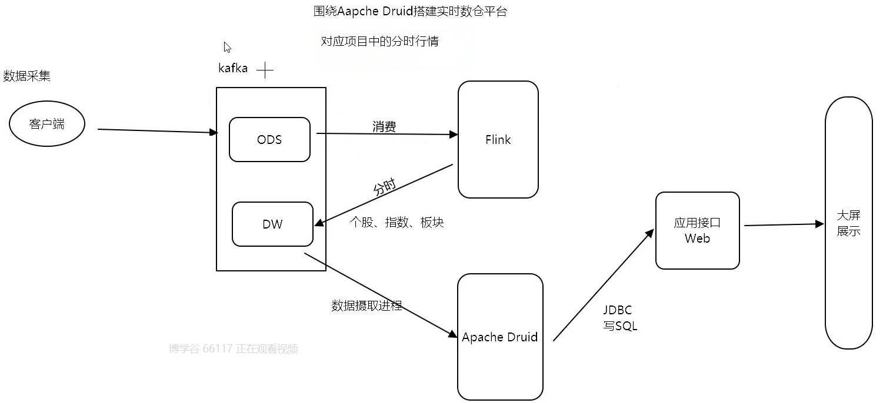
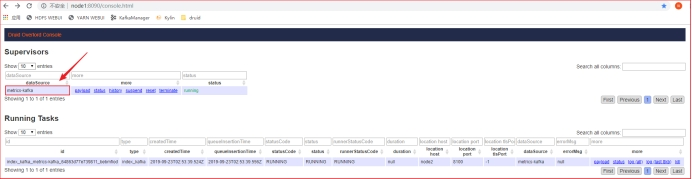

# Apache Druid

## 介绍

- apache druid是一个**实时数仓平台**：
  - 支持亚秒级数据查询；
  - 支持OLAP分析；
  - 支持SQL数据库查询,性能高效；
  - 不支持复杂查询（join）,不支持DDL  , 不支持DML；

- 特点
  - 需要摄取数据，摄取数据的格式是json
  - 高性能：
    - 存储
      - 支持HDFS存储
      - 支持本地磁盘存储
      - 支持Kafka存储
    - 查询
      - 数据预聚合好之后，提供用户查询结果数据
      - 可以作为实时明细数据读写平台
      - 性能是亚秒级


## 实时数仓技术架构


## 对应项目中分时行情业务流程图




## 架构体系


三大组件：

- **索引组件**：
  - 主节点： overload
  - 从节点：middlemanager
  - 索引服务：
    - **负责数据的摄取；** （数据摄取的时候， 一个任务对应一个peon线程）
    - **表的创建和销毁；**
    - **管理segment**；
- **存储组件：**
  - 主节点：coordinator
  - 从节点：historical
  - 存储服务：**负责数据的存储和数据的删除**，
    - 是按照**时间范围**存储数据（**chunk**）；
    - 每一个chunk包含多个**segment**(物理概念)；
    - 每个segment包含三部分：**1-时间列；2-指标列；3-维度列**；

``` properties
1.Druid中的数据存储在被称为 DataSource 中，DataSource 类似 RDMS中的table

2.每个DataSource按照时间划分，每个时间范围称为一个 chunk（(比如按天分区，则一个chunk为一天)）。

3.在chunk中数据被分为一个或多个segment；

4.segment是数据实际存储结构，Datasource、Chunk只是一个逻辑概念；

5.每个segment都是一个单独的文件，通常包含几百万行数据；

6.segment是按照时间组织成的chunk，所以在按照时间查询数据时，效率非常高。
```


- **查询组件：**
  - 主节点：router（分发请求）
  - 从节点：broker
  - 查询服务：broker是一个查询服务，**接收查询请求，将结果数据返回给客户端**；


## 位图索引 （支持亚秒级查询）

- Druid之所以快的原因：
  - **对数据库中的每个列的每个值做了一个位图定位**：
- **位图的数据结构**：
  - Map<key,BitMap>
    - key ： 就是维度列；
    - bitMap： 就是坐标；


## Apache Druid角色分配

- **索引组件：管理摄取进程，创建/管理segment，创建/管理dataSource**
  - **overload（主节点）**
  - **middlemanager（从节点）**
- **存储组件:负责数据的存储和数据的删除**
  - **coordinator（主节点）:**
  - **historical（从节点）:**
- **查询组件: 接收查询请求，将结果数据返回给客户端**
  - **router（主节点）**
  - **broker（从节点）**
- **dataSource(table)**
- **chunk (每个时间范围):  一个chunck下有过个segment**
- **segment(实际存储数据的文件): 每个segment包含三部分：1-时间列；2-指标列；3-维度列；**


## 启动服务

cd /export/servers/imply-3.0.4

~~~shell
bin/supervise -c conf/supervise/quickstart.conf 
~~~

> 此服务是采用前端方式启动，关闭服务:ctrl+c

> 启动此服务之前，一定要先启动zookeeper


## WEB UI

存储服务：

http://node01:8081/index.html#/

索引服务：

http://node01:8090/console.html

查询服务：

http://node01:8888/


#  Druid入门案例

需求：订单数据测试

 

1、上传测试数据到每台Linux服务器

mkdir -p /export/servers/tmp/druid

 

使用Druid 分析 2019年5月8日 按照商品分类、商品区域的产品订单总额

 

实现步骤：

将”4.资料\druid\2.druid测试数据源\0.商品订单数据\order.json"上传到服务器的 /export/servers/tmp/druid 目录中，并将 /export/servers/tmp/druid 分发到每一台服务器

 

2、摄取数据到Druid中

 

2.1 打开postman，请求地址设置为

http://node01:8090/druid/indexer/v1/task

 

2.2 请求方式选择为POST

2.3 body > raw > JSON(application/json)

2.4 将 资料中的index_order.json文件 粘贴到 postman中

2.5 发送请求

 

 

 

3、执行 SQL 查询

3.1 打开 Druid 控制台 http://node03:8888

3.2 打开 Query 选项卡，执行以下SQL实现 按照商品分类、商品区域的产品订单总额

-- 分析2019年5月8日，按照商品分类、商品区域的产品订单总额SELECT category, areaName, SUM(money) AS total_money, SUM("count") AS total_countFROM "demo_order"WHERE TIME_FORMAT("__time", 'yyyyMMdd') = '20190508'GROUP BY category, areaName

 

# Druid数据摄取  

Druid支持流式和批量两种方式的数据摄入，针对不同类型的数据，Druid将外部数据源分为两种形式：

 

1.流式数据源

 指的是持续不断地生产数据的数据源。例如：消息队列、日志、文件等

2.静态数据源

 指的是数据已经生产完毕，不会有新数据产生的数据源。例如：文件系统的文件

 

## 批量（离线）数据摄取

流式数据可以通过两种方式来摄入：本地文件和远程文件

### 摄取本地文件

需求：

将摄取服务器本地上的 ad_event.json 数据到Druid中

 

操作步骤：

- 1、在某一个服务器节点中创建 /export/servers/tmp/druid 文件夹

- 2、上传数据文件和摄取配置文件

 

将资料：”druid测试数据源\广告点击数据中\ad_event.json“ 上传到 /export/servers/tmp/druid目录中

将 /export/servers/tmp/druid 目录分发到每个服务器节点

 

3、使用postman提交本地批量索引任务

方式一：

​	将index_ad_event.json文件中的内容拷贝到 postman 中;

``` json
{
  "spec": {
  	  "dataSchema": {
	    "dataSource": "ad_event",
	    "parser": {
	      "type": "String",
	      "parseSpec": {
	        "format": "json",
	        "dimensionsSpec": {
	          "dimensions": [
	            "city",
	            "platform"
	          ]
	        },
	        "timestampSpec": {
	          "column": "timestamp",
	          "format": "auto"
	        }
	      }
	    },
	    "metricsSpec": [
	      {
	        "type": "count",
	        "name": "count"
	      },
	      {
	        "type": "longSum",
	        "name": "click",
	        "fieldName": "click",
	        "expression": null
	      }
	    ],
	    "granularitySpec": {
	      "type": "uniform",
	      "segmentGranularity": "DAY",
	      "queryGranularity": "HOUR",
	      "rollup": true,
	      "intervals": [
	        "2018-12-01T00:00:00.000Z/2018-12-03T00:00:00.000Z"
	      ]
	    },
	    "transformSpec": {
	      "filter": null,
	      "transforms": []
	    }
	  },
	  "ioConfig": {
	    "type": "index",
	    "firehose": {
	      "type": "local",
	      "baseDir": "/export/servers/tmp/druid",
	      "filter": "ad_event.json",
	      "parser": null
	    },
	    "appendToExisting": false
	  },
	  "tuningConfig": {
	    "type": "index",
	    "maxRowsPerSegment": null,
	    "maxRowsInMemory": 1000000,
	    "maxBytesInMemory": 0,
	    "maxTotalRows": null,
	    "numShards": null,
	    "partitionDimensions": [],
	    "indexSpec": {
	      "bitmap": {
	        "type": "concise"
	      },
	      "dimensionCompression": "lz4",
	      "metricCompression": "lz4",
	      "longEncoding": "longs"
	    },
	    "maxPendingPersists": 0,
	    "buildV9Directly": true,
	    "forceGuaranteedRollup": false,
	    "reportParseExceptions": false,
	    "pushTimeout": 0,
	    "segmentWriteOutMediumFactory": null,
	    "logParseExceptions": false,
	    "maxParseExceptions": 2147483647,
	    "maxSavedParseExceptions": 0
	  }
  },
  "type": "index"
}
```


​	发送post请求到http://node01:8090/druid/indexer/v1/task

方式二：

将测试脚本“4.资料\druid\2.druid测试数据源\test.postman_collection.json”导入到 postman 中

 

 

4、可以在Overlord（http://node01:8090/console.html） 中查看到任务信息

 

 

 

5、在 http://node3:8888中测试查询数据

SELECT  *FROM "ad_event"LIMIT 1

 

### 摄取HDFS文件

Druid支持加载HDFS上的数据。它会使用 HadoopDruidIndexer 加载批量数据，将数据生成 segments 文件，存放在HDFS上，再从HDFS下载 segments 文件到本地。然后遍可从Druid中查询数据。

需求：

摄取HDFS上的wikiticker-2015-09-12-sampled.json文件到Druid中

操作步骤：

- 1、启动HDFS集群、YARN集群
- 2、上传 “druid测试数据源\维基百科访问日志数据”到任意服务器 /export/servers/tmp/druid 目录，再将wikiticker-2015-09-12-sampled.json 文件上传到HDFS hdfs dfs -put wikiticker-2015-09-12-sampled.json /tmp/druid
- 3、修改 index_wikiticker-2015-9-12-sample.json 文件中配置 HDFS 的地址
- 4、使用 postman 提交索引任务将index_wikiticker-2015-9-12-sample.json文件中的内容拷贝到 postman 中-发送post请求到[http://node01:8090/druid/indexer/v1/task](http://node1:8090/druid/indexer/v1/task)

``` json
{
    "type": "index_hadoop",
	"spec": {
		"dataSchema": {
			"dataSource": "wikiticker",
			"parser": {
				"type": "hadoopyString",
				"parseSpec": {
					"format": "json",
					"dimensionsSpec": {
						"dimensions": [
							"channel",
							"cityName",
							"comment",
							"countryIsoCode",
							"countryName",
							"isAnonymous",
							"isMinor",
							"isNew",
							"isRobot",
							"isUnpatrolled",
							"metroCode",
							"namespace",
							"page",
							"regionIsoCode",
							"regionName",
							"user"
						]
					},
					"timestampSpec": {
						"format": "auto",
						"column": "time"
					}
				}
			},
			"metricsSpec": [
				{
					"name": "count",
					"type": "count"
				},
				{
					"name": "added",
					"type": "longSum",
					"fieldName": "added"
				},
				{
					"name": "deleted",
					"type": "longSum",
					"fieldName": "deleted"
				},
				{
					"name": "delta",
					"type": "longSum",
					"fieldName": "delta"
				}
			],
			"granularitySpec": {
				"type": "uniform",
				"segmentGranularity": "day",
				"queryGranularity": "none",
				"intervals": [
					"2015-09-12/2015-09-13"
				],
				"rollup": false
			}
		},
		"ioConfig": {
			"type": "hadoop",
			"inputSpec": {
				"type": "static",
				"paths": "/tmp/druid/wikiticker-2015-09-12-sampled.json"
			}
		},
		"tuningConfig": {
			"type": "hadoop",
			"partitionsSpec": {
				"type": "hashed",
				"targetPartitionSize": 5000000
			},
			"jobProperties": {
				"fs.default.name": "hdfs://node01:8020",
				"fs.defaultFS": "hdfs://node01:8020",
				"dfs.datanode.address": "node01",
				"dfs.client.use.datanode.hostname": "true",
				"dfs.datanode.use.datanode.hostname": "true",
				"yarn.resourcemanager.hostname": "node01",
				"yarn.nodemanager.vmem-check-enabled": "false",
				"mapreduce.map.java.opts": "-Duser.timezone=UTC -Dfile.encoding=UTF-8",
				"mapreduce.job.user.classpath.first": "true",
				"mapreduce.reduce.java.opts": "-Duser.timezone=UTC -Dfile.encoding=UTF-8",
				"mapreduce.map.memory.mb": 1024,
				"mapreduce.reduce.memory.mb": 1024
			}
		}
	},
    "hadoopDependencyCoordinates": [
        "org.apache.hadoop:hadoop-client:2.8.3"
    ]
}
```


- 5、到 Druid控制台中执行SQL查询
  - SELECT *FROM "wikiticker"LIMIT 1


## 流式（实时）数据摄取

### Kafka索引服务方式摄取

需求：

实时摄取Kafka中 metrics topic的数据到 Druid中

操作步骤：

- 1、启动 Kafka 集群

- 2、在Kafka集群上创建一个名为metrics的topic

``` properties
bin/kafka-topics.sh --create --zookeeper node01:2181 --partitions 1 --replication-factor 1 --topic metrics
```


 

- 3、定义摄取配置文件

  修改 druid测试数据源\kafka实时摄取数据中的 index-metrics-kafka.json 文件中的kafka服务器地址

  ``` json
  {
  	"type": "kafka",
  	"dataSchema": {
  		 "dataSource": "metrics-kafka",
  		 "parser": {
  			 "type": "string",
  			 "parseSpec": {
  				 "timestampSpec": {
  					 "column": "time",
  					 "format": "auto"
  				 },
  				 "dimensionsSpec": {
  					 "dimensions": ["url", "user"]
  				 },
  				 "format": "json"
  			 }
  		 },
  		 "granularitySpec": {
  			 "type": "uniform",
  			 "segmentGranularity": "HOUR",
  			 "queryGranularity": "NONE"
  		 },
  		 "metricsSpec": [
  			{
  				 "type": "count",
  				 "name": "views"
  			 },
  			 {
  				 "name": "latencyMs",
  				 "type": "doubleSum",
  				 "fieldName": "latencyMs"
  			 }
  		 ]
  	},
  	"ioConfig": {
  		 "topic": "metrics",
  		 "consumerProperties": {
  			 "bootstrap.servers": "node01:9092",
  			 "group.id": "kafka-indexing-service"
  		 },
  		 "taskCount": 1,
  		 "replicas": 1,
  		 "taskDuration": "PT1H"
  	},
  	"tuningConfig": {
  		 "type": "kafka",
  		 "maxRowsInMemory": "100000",
  		 "workerThreads": 2
  	}
  }
  
  ```

  

- 4、打开postman提交索引任务

  ​	将 index-metrics-kafka.json 文件中的内容拷贝到 postman 中

  ​	发送post请求到[http://node01:8090/druid/indexer/v1/supervisor](http://node1:8090/druid/indexer/v1/supervisor)

  ​	在Overlord中可以看到

 

 

- 6、在Kafka集群上开启一个控制台producer

bin/kafka-console-producer.sh --broker-list node01:9092 --topic metrics

- 7、在Kafka producer控制台中粘贴如下数据

{"time":"2019-07-23T17:57:58Z","url":"/foo/bar","user":"alice","latencyMs":32}{"time":"2019-07-23T17:57:59Z","url":"/","user":"bob","latencyMs":11}{"time":"2019-07-23T17:58:00Z","url": "/foo/bar","user":"bob","latencyMs":45}

- 8、在 Druid Console中执行以下SQL查询

SELECT *from "metrics-kafka"LIMIT 1

 

### 索引文件分析


## 摄取配置文件结构说明

### 主体结构

摄取配置文件主要由以下几个部分组成：

type：文件上传方式（**index、index_hadoop、kafka**）


- spec：

``` properties
type: "kafka"  文件上传方式 : 从kafka摄取数据
dataSchema : 数据解析模式
	dataSource : 表名称
	parser:
		type:
		parseSpec:
			timestampSpec:
			dimensionsSpec:
			format:"json"
	granularitySpec:设置规则粒度：存储规则、查询规则
	metricsSpec:指标列

ioConfig : 数据源的配置
	topic:
	consumerProperties
		bootstrap.servers:
		group.id:
	taskCount:
	replicas:
	taskDuration:

turningConfig : 优化配置（分区规则、分区大小）
```


 

``` properties
{
    // ① 文件拉取方式
    // 1.1 index 		- 拉取本地文件
    // 1.2 index_hadoop - 拉取HDFS文件
    // 1.3 kafka		- 拉取Kafka流数据
    "type": "index",
    "spec": {
            // ② 数据解析模式
            "dataSchema": {...},
            // ③ 摄取数据源
            "ioConfig": {...},
            // ④ 摄取过程优化配置
            "tuningConfig": {...}
    }
}
```


 

### 数据解析模式

数据解析模式，主要为针对数据文件，定义了一系列规则：

 

1. 获取时间戳属性

2. 维度属性

3. 度量属性

4. 定义如何进行指标计算

5. 配置粒度规则

 ``` properties
 // ② 数据摄取模式
 "dataSchema": {
     // 2.1 数据源
     "dataSource": "ad_event_local",
     // 2.2 解析器
     "parser": {
         // 2.2.1 解析字符串文本
         "type": "String",
         "parseSpec": {
             // 2.2.1.1 字符串文本格式为JSON
             "format": "json",
             // 2.2.1.2 指定维度列名
             "dimensionsSpec": {
                 "dimensions": [
                     "city",
                     "platform"
                 ]
             },
             // 2.2.1.3 指定时间戳的列，以及时间戳格式化方式
             "timestampSpec": {
                 "format": "auto",
                 "column": "timestamp"
             }
         }
     },
     // 2.3 指标计算规则
     "metricsSpec": [
         {
             "name": "count",
             "type": "count"
         },
         {
             // 2.3.1 聚合计算后指标的列名
             "name": "click",
             // 2.3.2 聚合函数：count、longSum、doubleSum、longMin、doubleMin、doubleMax
             "type": "longSum",
             "fieldName": "click"
         }
     ]
     // 2.4 粒度规则
     "granularitySpec": {
         "type": "uniform",
         // 2.4.1 按天来生成 segment （每天生成一个segment）
         "segmentGranularity": "day",
         // 2.4.2 查询的最小粒度（最小粒度为小时）
         "queryGranularity": "hour",
         // 2.4.3 加载原始数据的时间范围，批量数据导入需要设置/流式导入无需设置
         "intervals": [
             "2018-12-01/2018-12-03"
         ]
     },
     
 }
 ```


### 数据源配置

数据源配置主要指定：

要加载数据的类型,从哪儿加载数据

``` properties
"ioConfig": {
    "type": "index",
    "inputSpec": {
        // 3.1 本地文件 local/ HDFS使用 hadoop
        "type": "local",
        // 3.2 路径
        "baseDir": "/root/data/",
        // 3.3 只过滤出来哪个文件
        "filter": "ad_event.json"
    }
}
```


 

### 优化配置

通常在优化配置中可以指定一些优化选项

``` properties
"tuningConfig": {
    "type": "index",
    // 4.1 分区类型
    "partitionsSpec": {
        "type": "hashed",
        // 4.2 每个分区的目标行数（这里配置每个分区500W行）
        "targetPartitionSize": 5000000
    }
}
```


 

### 了解Druid WebUI生成 spec

 

 


## 查看摄取文件


>   index 		- 拉取本地文件
>
>   index_hadoop - 拉取HDFS文件
>
>   kafka		- 拉取Kafka流数据


# Druid数据查询

下面以 「 广告点击数据 」为例，演示在Druid中使用不同方式来进行数据查询、分析。

1、JSON API方式

2、SQL方式（重点）

## JSON API方式

### **JSON查询语法结构**

Druid最早提供JSON API地方式查询数据，通过JSON格式来定义各种查询组件实现数据查询。

将JSON数据提交请求到: [http://node01:8082/druid/v2?pretty](http://node03:8082/druid/v2?pretty)

``` properties
{
    "queryType":"search",
    // 1. 指定要查询的数据源
    "dataSource":"ad_event",
    // 2. 聚合器，描述如何进行聚合
    // 2.1 对哪个指标字段进行聚合
    // 2.2 进行哪种聚合
    // 2.3 指定聚合后的列名
    "aggregations":[
        {
            "type":"longSum",   
            "name":"click",     
            "fieldName":"click"   
        },{
            "type":"longSum",
            "name":"pv",
            "fieldName":"count"
        }
    ],
    // 3. 指定查询的时间范围，前闭后开
    "intervals":["2018-06-02/2019-06-06"]
}
```


 

### 使用Postman来测试JSON API查询

``` json
{
    "queryType":"search",
    "dataSource":"ad_event",
    "aggregations":[
        {
            "type":"longSum",		
            "name":"click",			
            "fieldName":"click"		
        },{
            "type":"longSum",
            "name":"pv",
            "fieldName":"count"
        }
    ],
    "intervals":["2018-06-02/2019-06-06"]
}
```

复制用于查询的JSON数据 

发送请求到 [http://node03:8082/druid/v2?pretty](http://node3:8082/druid/v2?pretty)

 

 

 

## SQL 方式

​		使用Druid SQL查询，可以使用SQL查询来代替Druid原生基于JSON的查询方式,Druid SQL将SQL语句解析为原生JSON API方式，再执行查询。

### Druid SQL可视化界面

Druid 提供了一个图形界面SQL查询接口

 

 

### 语法结构

Druid SQL支持的SELECT查询语法结构

``` properties
[ EXPLAIN PLAN FOR ]
[ WITH tableName [ ( column1, column2, ... ) ] AS ( query ) ]
SELECT [ ALL | DISTINCT ] { * | exprs }
FROM table
[ WHERE expr ]
[ GROUP BY exprs ]
[ HAVING expr ]
[ ORDER BY expr [ ASC | DESC ], expr [ ASC | DESC ], ... ]
[ LIMIT limit ]
[ UNION ALL <another query> ]
```


- EXPLAIN PLAN FOR

``` properties
在SELECT语句前面添加EXPLAIN PLAN FOR，可以查看到Druid SQL是如何解释为Druid JSON API查询的，SELECT语句并没有真正地执行。
```


- WITH tableName

``` properties
定义一个SQL片断，该SQL片断会被整个SQL语句所用到

WITH cr1 AS(SELECT city, SUM(click) as click from ad_event GROUP BY 1)select * from cr1 where city = 'beijing'
```


- GROUP BY

``` properties
GROUP BY 语句可以使用 1、2、...位置来替代

SELECT  city,  SUM(click) as click from  ad_event GROUP BY 1

ORDER BY 也支持类似GROUP BY 的语法
```


- UNION ALL

``` properties
UNION ALL操作符表示将多个SELECT语句放在一起（并集），每个SELECT语句都会一个接一个单独执行（并不是并行执行），Druid当前并不支持 UNION（不支持去重）

```


### Druid SQL不支持的功能：

- [**JOIN语句和DDL/DML语句**]()


### 聚合函数

Druid SQL中的聚合函数可以使用以下语法：

``` properties
AGG(expr) FILTER(WHERE whereExpr)
```

这样聚合函数只会聚合符合条件的行数据

``` properties
SELECT city, sum("count") filter(where city != 'beijing') FROM "ad_event_local" GROUP BY city;
```


 

## JDBC查询

使用JDBC查询Druid中的数据

Druid提供了JDBC接口，JavaWeb项目可以直接使用 JDBC 连接Druid进行实时数据分析。

 

 

需求：

 

获取 metrics-kakka 数据源中，不同用户的访问次数

 

实现步骤：

``` properties
1、创建 druid_jdbc Maven模块

2、导入依赖

3、编写JDBC代码连接Druid获取数据

3.1.加载Druid JDBC驱动

3.2.获取Druid JDBC连接

3.3.构建SQL语句

3.4.构建Statement，执行SQL获取结果集

3.5关闭Druid连接
```


具体实现：

1、导入依赖

``` xml
<dependency>
    <groupId>org.apache.calcite.avatica</groupId>
    <artifactId>avatica</artifactId>
    <version>1.13.0</version>
</dependency>
<dependency>
    <groupId>org.apache.calcite.avatica</groupId>
    <artifactId>avatica-core</artifactId>
    <version>1.13.0</version>
</dependency>
```


 

2、获取数据

driver：org.apache.calcite.avatica.remote.Driver

url: jdbc:avatica:remote:url=http://node01:8888/druid/v2/sql/avatica/ 

``` properties
/**
 * 使用JDBC操作Druid，获取实时分析结果
 */
public class Main {
    public static void main(String[] args) throws Exception {
        // 1. 加载Druid JDBC驱动
        Class.forName("org.apache.calcite.avatica.remote.Driver");
        // 2. 获取Druid JDBC连接
           Connection connection = 
DriverManager.getConnection("jdbc:avatica:remote:url=http://node03:8888/druid/v2/sql/avatica/", new Properties());
​
        // 3. 构建SQL语句
        String sql = 
"SELECT user, sum(views) as view_count FROM \"metrics-kafka\" GROUP BY 1 ORDER BY 1";​
        // 4. 构建Statement，执行SQL获取结果集
        Statement statement = connection.createStatement();
        ResultSet resultSet = statement.executeQuery(sql);
​
        // 5. 迭代ResultSet
        while(resultSet.next()) {
            String user = resultSet.getString("user");
            long view_count = resultSet.getLong("view_count");
            System.out.println(user + " -> " + view_count);
        }
​
        // 6. 关闭Druid连接
        resultSet.close();
        statement.close();
        connection.close();
    }
}
```


 

 

 

 

 

 

 


## JDBC操作数据库


``` java
//1.加载驱动
Class.forName("org.apache.calcite.avatica.remote.Driver");

//2.创建JDBC连接对象
String url = "jdbc:avatica:remote:url=http://node01:8888/druid/v2/sql/avatica/";
```


~~~java
package cn.itcast;

import java.sql.Connection;
import java.sql.DriverManager;
import java.sql.ResultSet;
import java.sql.Statement;

/**
 * @Date 2021
 */
public class JdbcTest {

    public static void main(String[] args) throws Exception {

        /**
         * 开发步骤：
         * 1.加载驱动
         * 2.创建JDBC连接对象
         * 3.SQL查询
         * 4.获取查询结果
         * 5.关流
         */
        //1.加载驱动
        Class.forName("org.apache.calcite.avatica.remote.Driver");
        //2.创建JDBC连接对象
        String url = "jdbc:avatica:remote:url=http://node01:8888/druid/v2/sql/avatica/";
        Connection conn = DriverManager.getConnection(url);
        Statement st = conn.createStatement();
        //3.SQL查询
        ResultSet rs = st.executeQuery("SELECT * FROM \"wikiticker\"");
        while (rs.next()){
           //4.获取查询结果
            System.out.println(rs.getString(1)+"======"+rs.getString(3));
        }
        //5.关流
        if(rs !=null){
            rs.close();
        }
        if(st !=null){
            st.close();
        }
        if(conn != null){
            conn.close();
        }
    }
}
~~~

# 


# ApacheDruid总结

## 1- ApacheDruid介绍

- apache druid是一个**实时数仓平台**；
- OLAP分析型数据库；
- 支持SQL数据库查询，性能高新；
- 摄取数据的格式为json；
- [**不支持复杂的join查询**](),不支持DDL，不支持DML；


## 2- 实时数仓技术架构


## 3- 架构体系


三大组件：

- **索引组件**：
  - 主节点： overload
  - 从节点：middlemanager
  - 索引服务：
    - **负责数据的摄取；** （数据摄取的时候， 一个任务对应一个peon线程）
    - **表的创建和销毁；**
    - **管理segment**；
- **存储组件：**
  - 主节点：coordinator
  - 从节点：historical
  - 存储服务：**负责数据的存储和数据的删除**，
    - 是按照**时间范围**存储数据（**chunk**）；
    - 每一个chunk包含多个**segment**(物理概念)；
    - 每个segment包含三部分：**1-时间列；2-指标列；3-维度列**；

``` properties
1.Druid中的数据存储在被称为 DataSource 中，DataSource 类似 RDMS中的table

2.每个DataSource按照时间划分，每个时间范围称为一个 chunk（(比如按天分区，则一个chunk为一天)）。

3.在chunk中数据被分为一个或多个segment;

4.segment是数据实际存储结构，Datasource、Chunk只是一个逻辑概念;

5.每个segment都是一个单独的文件，通常包含几百万行数据;

6.segment是按照时间组织成的chunk，所以在按照时间查询数据时，效率非常高;

7.每个segment包含三部分：1-时间列；2-指标列；3-维度列;
```


## 4- 位图索引 （支持亚秒级查询）

- Druid之所以快的原因：
  - **对数据库中的每个列的每个值做了一个位图定位**：
- **位图的数据结构**：
  - Map<key,BitMap>
    - key ： 就是维度列；
    - bitMap： 就是坐标；


## 5- Apache Druid角色分配

- **索引组件：管理摄取进程，创建/管理segment，创建/管理dataSource**
  - **overload（主节点）**
  - **middlemanager（从节点）**
- **存储组件:负责数据的存储和数据的删除**
  - **coordinator（主节点）:**
  - **historical（从节点）:**
- **查询组件: 接收查询请求，将结果数据返回给客户端**
  - **router（主节点）**
  - **broker（从节点）**
- **dataSource(table)**
- **chunk (每个时间范围):  一个chunck下有过个segment**
- **segment(实际存储数据的文件): 每个segment包含三部分：1-时间列；2-指标列；3-维度列；**


