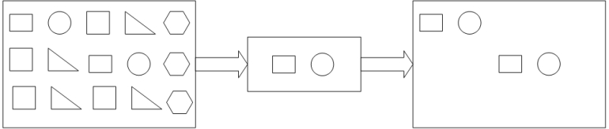

# 1. FlinkCEP监控预警

## **1.1.** Flink CEP介绍

​		FlinkCEP是在Flink之上实现的复杂事件处理（CEP）库，它是Flink的一个分支, CEP库（即Complex Event Processing库）。它允许你在无界的事件流中检测事件模式，让你有机会掌握数据中重要的事项。它允许你指定要在流中检测的模式，然后检测匹配事件序列并对其进行操作。复杂事件处理实际上就是基于事件流进行数据处理，把要分析的数据抽象成事件，然后将数据发送到CEP引擎，得到事件处理结果。


### 1.1.1. **什么是Flink CEP**

​		一个或多个由简单事件构成的事件流通过一定的规则匹配，然后输出用户想得到的数据，满足规则的复杂事件。具备如下的特征：

目标：从有序的简单事件流中发现一些规则特征

输入：一个或多个由简单事件构成的事件流

处理：识别简单事件之间的内在联系，多个符合一定规则的简单事件构成复杂事件

输出：满足规则的复杂事件

 

CEP用于分析低延迟、频繁产生的不同来源的事件流。 CEP 可以帮助在复杂的、不相关的事件流中找出有意义的模式和复杂的关系，以接近实时或准实时的获得通知并阻止一些行为。

CEP支持在流 上进行模式匹配，根据模式的条件不同，分为连续的条件或不连续的条件；模式的条件允许有时间的限制，当在条件范围内没有达到满足的条件时，会导致模式匹配超时。

 

### 1.1.2. **特点**

Flink的CEP是基于Flink Runtime构建的实时数据规则引擎，擅长解决跨事件的匹配问题, 是一套极具通用性、易于使用的实时流式事件处理方案。

- 优势：
  - 继承了 Flink 高吞吐的特点
  - 查询是静态的，数据是动态的，满足实现和连续查询的需求
  -  擅长解决跨事件的匹配
  - Api友好

- 劣势：
  - 无法动态更新规则（痛点）

 

### 1.1.3. **使用场景**

Flink cep应用于实时数据流的业务场景，可以应用于规则匹配，数据监控，实时预警、异常行为监测、风控等业务范围，具体由如下应用场景：

1.实时股票曲线预测

2.网站恶意攻击登陆行为

3.电子商务实时营销，对用户行为实时分析

4.滴滴打车异常行为检测

5.物流订单实时追踪

6.网络欺诈

7.故障检测

8.风险规避

9.智能营销等领域

 

l 实时反作弊和风控

对于电商来说，羊毛党是必不可少的，国内拼多多曾爆出 100 元的无门槛券随便领，当晚被人褥几百亿，对于这种情况肯定是没有做好及时的风控。另外还有就是商家上架商品时通过频繁修改商品的名称和滥用标题来提高搜索关键字的排名、批量注册一批机器账号快速刷单来提高商品的销售量等作弊行为，各种各样的作弊手法也是需要不断的去制定规则去匹配这种行为。

l 实时营销

分析用户在手机 APP 的实时行为，统计用户的活动周期，通过为用户画像来给用户进行推荐。比如用户在登录 APP 后 1 分钟内只浏览了商品没有下单；用户在浏览一个商品后，3 分钟内又去查看其他同类的商品，进行比价行为；用户商品下单后 1 分钟内是否支付了该订单。如果这些数据都可以很好的利用起来，那么就可以给用户推荐浏览过的类似商品，这样可以大大提高购买率。

l 实时网络攻击检测

当下互联网安全形势仍然严峻，网络攻击屡见不鲜且花样众多，这里我们以 DDOS（分布式拒绝服务攻击）产生的流入流量来作为遭受攻击的判断依据。对网络遭受的潜在攻击进行实时检测并给出预警，云服务厂商的多个数据中心会定时向监控中心上报其瞬时流量，如果流量在预设的正常范围内则认为是正常现象，不做任何操作；如果某数据中心在 10 秒内连续 5 次上报的流量超过正常范围的阈值，则触发一条警告的事件；如果某数据中心 30 秒内连续出现 30 次上报的流量超过正常范围的阈值，则触发严重的告警。

 

## **1.2.** Flink CEP API

### 1.2.1. **模式与模式序列**

- 模式API定义从输入流中提取符合规则的数据
- 每个复杂模式序列是由多个简单模式组成，例如：
  - 模式：寻找具有相同属性的单个事件

- 将简单模式称为模式，将最终在数据流中进行搜索匹配的复杂模式序列称为模式序列
- 匹配是一系列输入事件，这些事件通过一系列有效的模式转换，能够访问复杂模式图的所有模式

- 每个模式必须具有唯一的名称，我们可以使用模式名称来标识该模式匹配到的事件

- 将相互独立的模式进行组合然后形成模式序列。各个模式之间通过邻近条件进行连接

 

### 1.2.2. **单个模式**

- 一个模式既可以是单例的，也可以是循环的
  - 单例模式接受单个事件
  - 循环模式可以接受多个事件

- 示例：
  - 在模式匹配符号中，模式 a b+ c？d
    - a后跟一个或多个 b
    - 可选地后跟 c 
    - 后跟 d 
  - a、c? 、d是单例模式，b+ 是循环模式
  - 一般情况下，模式都是单例模式，可以使用量词（Quantifiers）将其转换为循环模式
  - 每个模式可以带有一个或多个条件，这些条件是基于事件接收进行定义的。或者说，每个模式通过一个或多个条件来匹配和接收事件

 

#### 1.2.2.1.量词

在FlinkCEP中，可以使用以下方式指定循环模式：

- pattern.oneOrMore() 一个给定的事件有**一次或多次**出现，例如上面提到的b+

- pattern.times(#ofTimes) 一个给定类型的事件出现了**指定次数**，例如4次

- pattern.times(#fromTimes, #toTimes) 一个给定类型的事件出现的次数在指**定次数范围**内，例如2~4次。

- 可以使用pattern.greedy()方法将模式变**成循环模式**，但是不能让一组模式都变成循环模式。

- 使用pattern.optional()方法将循环模式变成**可选**的，即可以是循环模式也可以是单个模式。

- greedy：repeating as many as possible 所谓贪婪的意思就是**尽可能的重复**

 

| **类型** | **API**                             | **含义**                                                     |
| -------- | ----------------------------------- | ------------------------------------------------------------ |
| 量词API  | times() timesOrMore（） oneOrMore() | 模式发生次数 示例： **pattern.times(2,4)**，模式发生2,3,4次 模式发生大于等于N次 示例： **pattern.timesOrMore(2)**，模式发生大于等于2次 |
| 量词API  | optional()                          | 模式可以不匹配  示例： **pattern.times(2).optional()**，模式发生2次或者0次 |
| 量词API  | greedy()                            | 模式发生越多越好 示例： **pattern.times(2).greedy()**，模式发生2次且重复次数越多越好 |

 

#### **1.2.2.2.** 案例-量词

- 用户如果在10s内，输入了TMD 5次，就认为用户为恶意攻击，识别出该用户

- 使用 Flink CEP检测刷屏用户

 

在test源码目录下创建测试类：cn.itcast.MaliceUser 

开发步骤：

 1.获取流处理执行环境

 2.设置事件时间

 **3.构建数据源**

 **4.定义模式规则**

 **5.将规则应用到数据流**

 **6.获取符合规则的数据**

 7.打印查询到的数据

 8.执行任务

 

数据源样例：

``` properties
Arrays.asList(

  new Message("1", "TMD", 1558430842000L),//2019-05-21 17:27:22

  new Message("1", "TMD", 1558430843000L),//2019-05-21 17:27:23

  new Message("1", "TMD", 1558430845000L),//2019-05-21 17:27:25

  new Message("1", "TMD", 1558430850000L),//2019-05-21 17:27:30

  new Message("1", "TMD", 1558430851000L),//2019-05-21 17:27:30

  new Message("2", "TMD", 1558430851000L),//2019-05-21 17:27:31

  new Message("1", "TMD", 1558430852000L)//2019-05-21 17:27:32

 )
```


参考代码：

``` java
package cn.itcast.review;

import cn.itcast.bean.Message;
import org.apache.flink.cep.CEP;
import org.apache.flink.cep.PatternSelectFunction;
import org.apache.flink.cep.PatternStream;
import org.apache.flink.cep.pattern.Pattern;
import org.apache.flink.cep.pattern.conditions.SimpleCondition;
import org.apache.flink.streaming.api.TimeCharacteristic;
import org.apache.flink.streaming.api.datastream.DataStreamSource;
import org.apache.flink.streaming.api.datastream.SingleOutputStreamOperator;
import org.apache.flink.streaming.api.environment.StreamExecutionEnvironment;
import org.apache.flink.streaming.api.functions.timestamps.BoundedOutOfOrdernessTimestampExtractor;
import org.apache.flink.streaming.api.windowing.time.Time;

import java.util.Arrays;
import java.util.List;
import java.util.Map;

public class MaliceUser {

    public static void main(String[] args) throws Exception {

        /**
         * 开发步骤：
         *  1.获取流处理执行环境
         *  2.设置事件时间
         *  3.构建数据源
         *  4.定义模式规则
         *  5.将规则应用到数据流
         *  6.获取符合规则的数据
         *  7.打印查询到的数据
         *  8.执行任务
         */

        // todo 1.获取流处理执行环境
        StreamExecutionEnvironment env = StreamExecutionEnvironment.getExecutionEnvironment();
        env.setParallelism(1);

        // todo 2.设置事件时间
        env.setStreamTimeCharacteristic(TimeCharacteristic.EventTime);

        // todo 3.构建数据源
        DataStreamSource<Message> messageSource = env.fromCollection(Arrays.asList(
                new Message("1", "TMD", 1558430842000L),//2019-05-21 17:27:22
                new Message("1", "TMD", 1558430843000L),//2019-05-21 17:27:23
                new Message("1", "TMD", 1558430845000L),//2019-05-21 17:27:25
                new Message("1", "TMD", 1558430850000L),//2019-05-21 17:27:30
                new Message("1", "TMD", 1558430851000L),//2019-05-21 17:27:30
                new Message("2", "TMD", 1558430851000L),//2019-05-21 17:27:31
                new Message("1", "TMD", 1558430852000L)//2019-05-21 17:27:32
        ));

        // todo 设置水位线
        SingleOutputStreamOperator<Message> watermarkSource = messageSource.assignTimestampsAndWatermarks(new BoundedOutOfOrdernessTimestampExtractor<Message>(Time.seconds(0)) {
            @Override
            public long extractTimestamp(Message element) {
                return element.getEventTime();
            }
        });

        // todo 4.定义模式规则
        Pattern<Message, Message> pattern = Pattern.<Message>begin("begin")
                .where(new SimpleCondition<Message>() {
                    @Override
                    public boolean filter(Message value) throws Exception {
                        return value.getMsg().equals("TMD");
                    }
                })
                .oneOrMore() // 一次或者多次
//                .times(5)  // 5次
                .within(Time.seconds(10)); // 滑动窗口

        // todo 5.将规则应用到数据流
        PatternStream<Message> cep = CEP.pattern(watermarkSource.keyBy(Message::getId), pattern);

        // todo 6.获取符合规则的数据
        SingleOutputStreamOperator<List<Message>> result = cep.select(new PatternSelectFunction<Message, List<Message>>() {
            @Override
            public List<Message> select(Map<String, List<Message>> pattern) throws Exception {

                // map 的key 键就是模式的名称
                return pattern.get("begin");
            }
        });

        // todo 7.打印查询到的数据
        result.print("匹配到的数据::::");

        env.execute();

    }
}

```


 

#### **1.2.2.3.** 条件

为了让传入事件被模式所接受，给模式指定传入事件必须满足的条件，这些条件由事件本身的属性或者前面匹配过的事件的属性统计量等来设定。比如，事件的某个值大于5，或者大于先前接受事件的某个值的平均值。

可以使用pattern.where()、pattern.or()、pattern.until()方法来指定条件。条件既可以是迭代条件IterativeConditions，也可以是简单条件SimpleConditions

| **类型** | **API** | **含义**                                                     |
| -------- | ------- | ------------------------------------------------------------ |
| 条件API  | where() | 模式的条件 示例： pattern.where(_.ruleId=43322)，模式的条件为ruleId=433322 |
| 条件API  | or()    | 模式的或条件 示例： pattern.where(_.ruleId=43322).or(_.ruleId=43333)，模式条件为ruleId=43322或者43333 |
| 条件API  | util()  | 模式发生直至X条件满足为止 示例： pattern.oneOrMore().util(condition)模式发生一次或者多次，直至condition满足为止 |

 

##### 1.2.2.3.1. **迭代条件**

迭代条件：该条件基于先前接收事件的属性或其子集的统计信息来进行遍历取值。

 

需求：查询匹配用户登陆状态是fail，且失败次数大于8的数据

 

在test源码目录下创建测试类：cn.itcast.ConditionDemo

开发步骤（java）：

1.获取流处理执行环境

2.设置但并行度

3.加载数据源

4.设置匹配模式连续where，

​	先匹配状态（多次），再匹配数量

5.匹配数据提取，返回集合

6.数据打印

7.触发执行

数据源：

 ``` java
 DataStream<LoginEvent> loginEventStream = env.fromCollection(Arrays.asList(
 
 ​        new LoginEvent("1", "192.168.0.1", "fail", 8),
 
 ​        new LoginEvent("1", "192.168.0.2", "fail", 9),
 
 ​        new LoginEvent("1", "192.168.0.3", "fail", 10),
 
 ​        new LoginEvent("1", "192.168.0.4", "fail", 10),
 
 ​        new LoginEvent("2", "192.168.10.10", "success", -1),
 
 ​        new LoginEvent("3", "192.168.10.10", "fail", 5),
 
 ​        new LoginEvent("3", "192.168.10.11", "fail", 6),
 
 ​        new LoginEvent("4", "192.168.10.10", "fail", 6),
 
 ​        new LoginEvent("4", "192.168.10.11", "fail", 7),
 
 ​        new LoginEvent("4", "192.168.10.12", "fail", 8),
 
 ​        new LoginEvent("5", "192.168.10.13", "success", 8),
 
 ​        new LoginEvent("5", "192.168.10.14", "success", 9),
 
 ​        new LoginEvent("5", "192.168.10.15", "success", 10),
 
 ​        new LoginEvent("6", "192.168.10.16", "fail", 6),
 
 ​        new LoginEvent("6", "192.168.10.17", "fail", 8),
 
 ​        new LoginEvent("7", "192.168.10.18", "fail", 5),
 
 ​        new LoginEvent("6", "192.168.10.19", "fail", 10),
 
 ​        new LoginEvent("6", "192.168.10.18", "fail", 9)
 
 ​    ));
 ```


1.LoginEvent 

``` java
private String id; //用户id

private String ip;//用户ip

private String status;//用户状态

private int count;//失败次数
```


 

注意：需要无参构造器

``` java
package cn.cep;
public class LoginEvent {
    private String id; //用户id
    private String ip;//用户ip
    private String status;//用户状态
    private int count;//失败次数
    public LoginEvent() {
    }
    public LoginEvent(String id, String ip, String status, int count) {
        this.id = id;
        this.ip = ip;
        this.status = status;
        this.count = count;
    }
    public String getId() {
        return id;
    }
    public void setId(String id) {
        this.id = id;
    }
    public String getIp() {
        return ip;
    }
    public void setIp(String ip) {
        this.ip = ip;
    }
    public String getStatus() {
        return status;
    }
    public void setStatus(String status) {
        this.status = status;
    }
    public int getCount() {
        return count;
    }
    public void setCount(int count) {
        this.count = count;
    }
    @Override
    public String toString() {
        return "LoginEvent{" +
                "id='" + id + '\'' +
                ", ip='" + ip + '\'' +
                ", status='" + status + '\'' +
                ", count=" + count +
                '}';
    }
}
```


 

2.IterativeDemo

``` java
import org.apache.flink.cep.CEP;
import org.apache.flink.cep.PatternSelectFunction;
import org.apache.flink.cep.PatternStream;
import org.apache.flink.cep.pattern.Pattern;
import org.apache.flink.cep.pattern.conditions.IterativeCondition;
import org.apache.flink.streaming.api.datastream.DataStream;
import org.apache.flink.streaming.api.datastream.SingleOutputStreamOperator;
import org.apache.flink.streaming.api.environment.StreamExecutionEnvironment;
import java.util.Arrays;
import java.util.List;
import java.util.Map;

public class ConditionDemo{
    public static void main(String[] args) throws Exception {
        StreamExecutionEnvironment env = StreamExecutionEnvironment.getExecutionEnvironment();
        env.setParallelism(1);
        // 模拟数据源
        DataStream<LoginEvent> loginEventStream = env.fromCollection(Arrays.asList(
                new LoginEvent("1", "192.168.0.1", "fail", 8),
                new LoginEvent("1", "192.168.0.2", "fail", 9),
                new LoginEvent("1", "192.168.0.3", "fail", 10),
                new LoginEvent("1", "192.168.0.4", "fail", 10),
                new LoginEvent("2", "192.168.10.10", "success", -1),
                new LoginEvent("3", "192.168.10.10", "fail", 5),
                new LoginEvent("3", "192.168.10.11", "fail", 6),
                new LoginEvent("4", "192.168.10.10", "fail", 6),
                new LoginEvent("4", "192.168.10.11", "fail", 7),
                new LoginEvent("4", "192.168.10.12", "fail", 8),
                new LoginEvent("5", "192.168.10.13", "success", 8),
                new LoginEvent("5", "192.168.10.14", "success", 9),
                new LoginEvent("5", "192.168.10.15", "success", 10),
                new LoginEvent("6", "192.168.10.16", "fail", 6),
                new LoginEvent("6", "192.168.10.17", "fail", 8),
                new LoginEvent("7", "192.168.10.18", "fail", 5),
                new LoginEvent("6", "192.168.10.19", "fail", 10),
                new LoginEvent("6", "192.168.10.18", "fail", 9)
        ));
        // 定义模式
        Pattern<LoginEvent, LoginEvent> pattern = Pattern.<LoginEvent>begin("begin").where(new IterativeCondition<LoginEvent>() {
            @Override
            public boolean filter(LoginEvent value, Context<LoginEvent> ctx) throws Exception {

                return value.getStatus().equals("fail");
            }
        }).where(new IterativeCondition<LoginEvent>() {
            @Override
            public boolean filter(LoginEvent value, Context<LoginEvent> ctx) throws Exception {

                return value.getCount() > 8;
            }
        }).times(2);


        PatternStream<LoginEvent> cep = CEP.<LoginEvent>pattern(loginEventStream.keyBy("id"), pattern);
        SingleOutputStreamOperator<List<LoginEvent>> follow = cep.select(new PatternSelectFunction<LoginEvent, List<LoginEvent>>() {

            @Override
            public List<LoginEvent> select(Map<String, List<LoginEvent>> map) throws Exception {
                List<LoginEvent> follow1 = map.get("follow");
                return follow1;
            }
        });

        follow.print();
        env.execute();
    }
}
```


匹配结果：

``` properties
[LoginEvent{id='1', ip='192.168.0.2', status='fail', count=9}, LoginEvent{id='1', ip='192.168.0.3', status='fail', count=10}]
[LoginEvent{id='1', ip='192.168.0.3', status='fail', count=10}, LoginEvent{id='1', ip='192.168.0.4', status='fail', count=10}]
[LoginEvent{id='6', ip='192.168.10.19', status='fail', count=10}, LoginEvent{id='6', ip='192.168.10.18', status='fail', count=9}]
```


##### 1.2.2.3.2. **简单条件**

简单条件：继承IterativeCondition，只需要判断事件属性是否符合相应条件即可。

``` java
 .where(new SimpleCondition<LoginEvent>() {
           @Override
           public boolean filter(LoginEvent value) throws Exception {
              return value.getCount() > 8;
           }
   })
```


##### 1.2.2.3.3. **组合条件**

使用OR对多个条件进行组合，当然也可以写在一个条件里面。

``` java
// 定义模式
Pattern<LoginEvent, LoginEvent> pattern = Pattern.<LoginEvent>begin("begin").where(new IterativeCondition<LoginEvent>() {
	@Override
	public boolean filter(LoginEvent value, Context<LoginEvent> ctx) throws Exception {

		return value.getStatus().equals("fail");
	}
}).or(new SimpleCondition<LoginEvent>() {
	@Override
	public boolean filter(LoginEvent value) throws Exception {
		return value.getCount() > 8;
	}
})
.times(2);
```


匹配结果：

``` properties
[LoginEvent{id='1', ip='192.168.0.1', status='fail', count=8}, LoginEvent{id='1', ip='192.168.0.2', status='fail', count=9}]
[LoginEvent{id='1', ip='192.168.0.2', status='fail', count=9}, LoginEvent{id='1', ip='192.168.0.3', status='fail', count=10}]
[LoginEvent{id='1', ip='192.168.0.3', status='fail', count=10}, LoginEvent{id='1', ip='192.168.0.4', status='fail', count=10}]
[LoginEvent{id='3', ip='192.168.10.10', status='fail', count=5}, LoginEvent{id='3', ip='192.168.10.11', status='fail', count=6}]
[LoginEvent{id='4', ip='192.168.10.10', status='fail', count=6}, LoginEvent{id='4', ip='192.168.10.11', status='fail', count=7}]
[LoginEvent{id='4', ip='192.168.10.11', status='fail', count=7}, LoginEvent{id='4', ip='192.168.10.12', status='fail', count=8}]
[LoginEvent{id='5', ip='192.168.10.14', status='success', count=9}, LoginEvent{id='5', ip='192.168.10.15', status='success', count=10}]
[LoginEvent{id='6', ip='192.168.10.16', status='fail', count=6}, LoginEvent{id='6', ip='192.168.10.17', status='fail', count=8}]
[LoginEvent{id='6', ip='192.168.10.17', status='fail', count=8}, LoginEvent{id='6', ip='192.168.10.19', status='fail', count=10}]
[LoginEvent{id='6', ip='192.168.10.19', status='fail', count=10}, LoginEvent{id='6', ip='192.168.10.18', status='fail', count=9}]

```


##### 1.2.2.3.4. **停止条件**

可以理解为匹配跳过某个符合条件的事件。

注意：until前要跟上循环条件，比如oneOrMore

``` java
// 定义模式
Pattern<LoginEvent, LoginEvent> pattern = Pattern.<LoginEvent>begin("begin").where(new IterativeCondition<LoginEvent>() {
	@Override
	public boolean filter(LoginEvent value, Context<LoginEvent> ctx) throws Exception {

		return value.getStatus().equals("fail");
	}
}).oneOrMore().until(new SimpleCondition<LoginEvent>() {
	@Override
	public boolean filter(LoginEvent value) throws Exception {
		return value.getCount() == 10;
	}
});
```


匹配结果

``` properties
[LoginEvent{id='1', ip='192.168.0.1', status='fail', count=8}]
[LoginEvent{id='1', ip='192.168.0.1', status='fail', count=8}, LoginEvent{id='1', ip='192.168.0.2', status='fail', count=9}]
[LoginEvent{id='1', ip='192.168.0.2', status='fail', count=9}]
[LoginEvent{id='3', ip='192.168.10.10', status='fail', count=5}]
[LoginEvent{id='3', ip='192.168.10.10', status='fail', count=5}, LoginEvent{id='3', ip='192.168.10.11', status='fail', count=6}]
[LoginEvent{id='3', ip='192.168.10.11', status='fail', count=6}]
[LoginEvent{id='4', ip='192.168.10.10', status='fail', count=6}]
[LoginEvent{id='4', ip='192.168.10.10', status='fail', count=6}, LoginEvent{id='4', ip='192.168.10.11', status='fail', count=7}]
[LoginEvent{id='4', ip='192.168.10.11', status='fail', count=7}]
[LoginEvent{id='4', ip='192.168.10.10', status='fail', count=6}, LoginEvent{id='4', ip='192.168.10.11', status='fail', count=7}, LoginEvent{id='4', ip='192.168.10.12', status='fail', count=8}]
[LoginEvent{id='4', ip='192.168.10.11', status='fail', count=7}, LoginEvent{id='4', ip='192.168.10.12', status='fail', count=8}]
[LoginEvent{id='4', ip='192.168.10.12', status='fail', count=8}]
[LoginEvent{id='6', ip='192.168.10.16', status='fail', count=6}]
[LoginEvent{id='6', ip='192.168.10.16', status='fail', count=6}, LoginEvent{id='6', ip='192.168.10.17', status='fail', count=8}]
[LoginEvent{id='6', ip='192.168.10.17', status='fail', count=8}]
[LoginEvent{id='7', ip='192.168.10.18', status='fail', count=5}]
[LoginEvent{id='6', ip='192.168.10.18', status='fail', count=9}]
```


 

### 1.2.3. **组合模式**

将单一模式组合成完整的模式序列。一个模式序列有一个初始模式begin开始。

```properties
Pattern<Event, ?> start = Pattern.<Event>begin("start");
```


然后使用特定的临近条件将单一模式追加到初始模式及其他模式的后面。


FlinkCEP支持事件之间的三种临近条件：

- next() notNext() 严格临近 匹配到的事件严格地一个挨着一个出现，在事件之间没有任何未匹配到的事件。


- followedBy() notFollowedBy() 宽松临近 忽略事件之间未匹配到的事件。


- followedByAny() 非确定性宽松临近，进一步放宽连续性，允许额外的忽略一些匹配事件。


| API                       | 含义                                                         |
| ------------------------- | ------------------------------------------------------------ |
| next（）                  | 严格的满足条件 示例： 模式为begin("first").where(_.name='a').next("second").where(.name='b') 当且仅当数据为a,b时，模式才会被命中。如果数据为a,c,b，由于a的后面跟了c，所以a会被直接丢弃，模式不会命中。 |
| followedBy()              | 松散的满足条件 示例： 模式为begin("first").where(_.name='a').followedBy("second").where(.name='b') 当且仅当数据为a,b或者为a,c,b，，模式均被命中，中间的c会被忽略掉。 |
| followedByAny（）         | 非确定的松散满足条件 模式为begin("first").where(_.name='a').followedByAny("second").where(.name='b') 当且仅当数据为a,c,b,b时，对于followedBy模式而言命中的为{a,b}，对于followedByAny而言会有两次命中{a,b},{a,b} |
| within（）                | 模式命中的时间间隔限制                                       |
| notNext() notFollowedBy() | 后面的模式不命中（严格/非严格）                              |

#### **1.2.3.1.** consecutive 

连续模式：匹配到的数据需要是**连续**出现的，如果不连续就会中断匹配。

 注意：

``` properties
配合使用：
	followedBy.where.oneOrMore.consecutive
```


需求：从数据源中依次提取"c","a","b"元素

 

在test源码目录下创建测试类：cn.itcast.ConsecutiveDemo 


开发步骤（java）：

``` properties
1.获取流处理执行环境

2.设置但并行度

3.加载数据源

4.设置匹配模式，匹配"c","a","b"

 多次匹配"a"：组合模式

5.匹配数据提取Tuple3

6.数据打印

7.触发执行
```


 

数据源：

"c", "d", "a", "a", "a", "d", "a", "b"

 

``` java
public class ConsecutiveDemo {

    public static void main(String[] args) throws Exception {

        StreamExecutionEnvironment env = StreamExecutionEnvironment.getExecutionEnvironment();
        env.setParallelism(1);
        // 模拟数据源
        //输入事件：c d a a a d a b
        DataStreamSource<String> source = env.fromElements("c", "d", "a", "a", "a", "d", "a", "b");

        //设置模式
        Pattern<String, String> pattern = Pattern.<String>begin("start")
                .where(new SimpleCondition<String>() {
                    @Override
                    public boolean filter(String value) throws Exception {
                        return value.equals("c");
                    }
                })
                // 此处是宽松临近 第一个匹配到的a 只能穿透非a事件，不能穿透其他a事件
                .followedBy("middle").where(new SimpleCondition<String>() {
                    @Override
                    public boolean filter(String value) throws Exception {
                        return value.equals("a");
                    }
                })
                .oneOrMore()
                .consecutive() // 第二个和之后匹配到的a 为严格临近
                .followedBy("end").where(new SimpleCondition<String>() {
                    @Override
                    public boolean filter(String value) throws Exception {
                        return value.equals("b");
                    }
                });

        PatternStream<String> cep = CEP.pattern(source, pattern);
        SingleOutputStreamOperator<Object> res = cep.select(new PatternSelectFunction<String, Object>() {
            @Override
            public Object select(Map<String, List<String>> map) throws Exception {

                List<String> middle = map.get("middle");
                List<String> start = map.get("start");
                List<String> end = map.get("end");
                Tuple3 tuple3 = new Tuple3(start, middle, end);
                return tuple3;
            }
        });
        res.print();
        env.execute();
    }
}
```


输入事件：c d a a a d a b

1) 使用consecutive()【next()】：

([c],[a, a, a],[b])

([c],[a, a],[b])

([c],[a],[b])


2) 不使用consecutive()：

([c],[a, a, a, a],[b])

([c],[a, a, a],[b])

([c],[a, a],[b])

([c],[a],[b])


#### **1.2.3.2.** allowCombinations

允许组合模式：匹配到的数据可以是**不连续**出现的。

 

开发步骤：

``` properties
1.获取流处理执行环境

2.设置但并行度

3.加载数据源

4.设置匹配模式，匹配"c","a","b"

 多次匹配"a"：允许组合模式

5.匹配数据提取Tuple3

6.数据打印

7.触发执行
```

``` java
package cn.itcast.review;


import org.apache.flink.api.java.tuple.Tuple3;
import org.apache.flink.cep.CEP;
import org.apache.flink.cep.PatternSelectFunction;
import org.apache.flink.cep.PatternStream;
import org.apache.flink.cep.pattern.Pattern;
import org.apache.flink.cep.pattern.conditions.SimpleCondition;
import org.apache.flink.streaming.api.TimeCharacteristic;
import org.apache.flink.streaming.api.datastream.DataStreamSource;
import org.apache.flink.streaming.api.datastream.SingleOutputStreamOperator;
import org.apache.flink.streaming.api.environment.StreamExecutionEnvironment;

import java.util.List;
import java.util.Map;

/**
 * 需求：从数据源中依次提取"c","a","b"元素
 */
public class ConsecutiveDemo {
    public static void main(String[] args) throws Exception {
        /**
         * 开发步骤：
         * 1.获取流处理执行环境
         * 2.设置但并行度
         * 3.加载数据源
         * 4.设置匹配模式，匹配"c","a","b"
         *   多次匹配"a"：组合模式
         * 5.匹配数据提取Tuple3
         * 6.数据打印
         * 7.触发执行
         */

        StreamExecutionEnvironment env = StreamExecutionEnvironment.getExecutionEnvironment();
        env.setParallelism(1);

// env.setStreamTimeCharacteristic(TimeCharacteristic.EventTime);

        //3.加载数据源
        DataStreamSource<String> source = env.fromElements(
                "c", "d", "a", "a", "a", "d", "a", "b");
        //4.设置匹配模式，匹配"c","a","b"
        //  多次匹配"a"：组合模式
        Pattern<String, String> pattern = Pattern.<String>begin("begin").where(new SimpleCondition<String>() {
            @Override
            public boolean filter(String value) throws Exception {
                return value.equals("c");
            }
        }).followedBy("middle").where(new SimpleCondition<String>() {
            @Override
            public boolean filter(String value) throws Exception {
                return value.equals("a");
            }
        }).oneOrMore()
//        .consecutive() // 连续匹配， 需要配合量词使用
          .allowCombinations() // 允许匹配的数据时不连续的。也是需要配合量词使用
        .followedBy("end").where(new SimpleCondition<String>() {
            @Override
            public boolean filter(String value) throws Exception {
                return value.equals("b");
            }
        });


        // todo 匹配
        PatternStream<String> cep = CEP.pattern(source, pattern);
        SingleOutputStreamOperator<Object> result = cep.select(new PatternSelectFunction<String, Object>() {
            @Override
            public Object select(Map<String, List<String>> pattern) throws Exception {
                List<String> begin = pattern.get("begin");
                List<String> middle = pattern.get("middle");
                List<String> end = pattern.get("end");

                return Tuple3.of(begin, middle, end);
            }
        });

        result.print("result :: ");


        env.execute();
    }
}

```


输入事件：c d a1 a2 a3 d a4 b

1) 使用allowCombinations()

([c],[a, a, a, a],[b])

([c],[a, a, a],[b])

([c],[a, a, a],[b])

([c],[a, a],[b])

([c],[a, a, a],[b])

([c],[a, a],[b])

([c],[a, a],[b])

([c],[a],[b])

## **1.3.** CEP案例

 

### 1.3.1. 用户登录案例

需求：

``` properties
有一个业务系统，用户要使用该业务系统必须要先登陆

过滤出来在2秒内连续登陆失败的用户
```


 

在test源码目录下创建测试类：cn.itcast.LoginFailDemo 

开发步骤：

``` properties
1.获取流处理执行环境

2.设置并行度,设置事件时间

3.加载数据源,提取事件时间

4.定义匹配模式，设置时间长度

5.匹配模式（分组）

6.数据处理

7.打印

8.触发执行
```


 

数据源：

``` java
Arrays.asList(

​    new LoginUser (1, "192.168.0.1", "fail", 1558430842000L),		//2019-05-21 17:27:22

​    new LoginUser (1, "192.168.0.2", "fail", 1558430843000L),		//2019-05-21 17:27:23

​    new LoginUser (1, "192.168.0.3", "fail", 1558430844000L),		//2019-05-21 17:27:24

​    new LoginUser (2, "192.168.10.10", "success", 1558430845000L)	//2019-05-21 17:27:25

)
```


 

参考代码

```java
/**
 * 使用CEP实现三秒内登录失败两次的用户
 */
public class LoginFailDemo {

    public static void main(String[] args) throws Exception {
        //1：初始化流式运行环境
        StreamExecutionEnvironment env = StreamExecutionEnvironment.getExecutionEnvironment();
        //2：设置并行度为1
        env.setParallelism(1);
        //3：指定数据按照事件时间进行处理
        env.setStreamTimeCharacteristic(TimeCharacteristic.EventTime);
        //4：构建数据源
        DataStream<LoginUser > LoginUserStream = env.fromCollection(Arrays.asList(
                new LoginUser (1, "192.168.0.1", "fail", 1558430842000L),//2019-05-21 17:27:22
                new LoginUser (1, "192.168.0.2", "fail", 1558430843000L),//2019-05-21 17:27:23
                new LoginUser (1, "192.168.0.3", "fail", 1558430844000L),//2019-05-21 17:27:24
                new LoginUser (2, "192.168.10.10", "success", 1558430845000L)//2019-05-21 17:27:25
        )).assignTimestampsAndWatermarks(new BoundedOutOfOrdernessTimestampExtractor<LoginUser>(Time.seconds(0)) {
            @Override
            public long extractTimestamp(LoginUser element) {
                return element.getEventTime();
            }
        });

        //5.1：定义规则模型
        Pattern<LoginUser, LoginUser > LoginUserPattern = Pattern.<LoginUser >begin("begin")
                .where(new IterativeCondition<LoginUser>() {
                    @Override
                    public boolean filter(LoginUser loginUser, Context<LoginUser > context) throws Exception {
                        return loginUser.getEventType().equals("fail");
                    }

                })//匹配第一个事件，匹配的是登录失败
                .next("next") //匹配到第一个事件以后，紧跟着一个事件数据，next表示两个事件必须严格的临近
                .where(new IterativeCondition<LoginUser >() {
                    @Override
                    public boolean filter(LoginUser loginUser, Context<LoginUser> context) throws Exception {
                        return loginUser.getEventType().equals("fail");
                    }
                })//匹配第二个事件，匹配的是登录失败
                .within(Time.seconds(3));//定义结束状态，结束状态可以是时间触发也可以是满足了某个事件触发

        //5.2：将规则模型应用到数据流中
        PatternStream<LoginUser > patternDataStream = CEP.pattern(LoginUserStream.keyBy(LoginUser ::getUserId), LoginUserPattern);
        //5.3：获取到符合规则模型的数据
        /**
           * IN：传入的数据类型
           * OUT：返回值的数据类型
           *  (Long, String, String, Long):(用户id, 登录ip，登录状态，登录时间)
           */

        SingleOutputStreamOperator<Tuple4<Integer, String, String, Long>> loginFailDataStream = patternDataStream.select(new PatternSelectFunction<LoginUser, Tuple4<Integer, String, String, Long>>() {
            @Override
            public Tuple4<Integer, String, String, Long> select(Map<String, List<LoginUser>> pattern) throws Exception {
                //根据刚才的分析，符合规则的数据会存储到状态集合中，也就是state中，所以查找匹配的时候需要在state中获取数据
                LoginUser loginUser = pattern.getOrDefault("next", null).iterator().next();

                //返回匹配到的数据
                return Tuple4.of(loginUser.getUserId(), loginUser.getIp(), loginUser.getEventType(), loginUser.getEventTime());
            }
        });

        //打印出来符合条件的数据
        loginFailDataStream.print("连续两次登录失败的用户>>>");
        //执行任务
        env.execute();
    }
```


 

登陆对象：

  ```java
  public int userId; //用户id
  
  public String ip;//用户Ip
  
  public String eventType; //状态
  
  public Long eventTime;//事件时间
  ```


 ```java
  /**
      * 构建登录对象
      */
     public static class LoginUser implements Serializable {
         public int userId; //用户id
         public String ip;//用户Ip
         public String eventType; //状态
         public Long eventTime;//事件时间
 
         public int getUserId() {
             return userId;
         }
 
         public void setUserId(int userId) {
             this.userId = userId;
         }
 
         public String getIp() {
             return ip;
         }
 
         public void setIp(String ip) {
             this.ip = ip;
         }
 
         public String getEventType() {
             return eventType;
         }
 
         public void setEventType(String eventType) {
             this.eventType = eventType;
         }
 
         public Long getEventTime() {
             return eventTime;
         }
 
         public void setEventTime(Long eventTime) {
             this.eventTime = eventTime;
         }
 
         public LoginEvent(int userId, String ip, String eventType, Long eventTime) {
             this.userId = userId;
             this.ip = ip;
             this.eventType = eventType;
             this.eventTime = eventTime;
         }
 
         @Override
         public String toString() {
             return "LoginEvent{" +
                     "userId=" + userId +
                     ", ip='" + ip + '\'' +
                     ", eventType='" + eventType + '\'' +
                     ", eventTime=" + eventTime +
                     '}';
         }
     }
 }
 ```


### 1.3.2.订单超时案例

- 需求

``` properties
用单户下以后，应该设置订单失效时间，用来提高用户的支付意愿如果用户下单15分钟未支付，则输出监控信息
```

- 开发步骤

``` properties
1.获取流处理执行环境
2.设置并行度,设置事件时间
3.加载数据源,提取事件时间
4.定义匹配模式followedBy，设置时间长度
5.匹配模式（分组）
6.设置侧输出流
7.数据处理(获取begin数据)
8.打印（正常/超时订单）
9.触发执行
```

- 代码案例

``` java
package cn.itcast.review;

import cn.itcast.bean.OrderEvent;
import cn.itcast.bean.OrderResult;
import org.apache.flink.api.common.typeinfo.TypeInformation;
import org.apache.flink.cep.CEP;
import org.apache.flink.cep.PatternSelectFunction;
import org.apache.flink.cep.PatternStream;
import org.apache.flink.cep.PatternTimeoutFunction;
import org.apache.flink.cep.pattern.Pattern;
import org.apache.flink.cep.pattern.conditions.SimpleCondition;
import org.apache.flink.streaming.api.TimeCharacteristic;
import org.apache.flink.streaming.api.datastream.DataStreamSource;
import org.apache.flink.streaming.api.datastream.SingleOutputStreamOperator;
import org.apache.flink.streaming.api.environment.StreamExecutionEnvironment;
import org.apache.flink.streaming.api.functions.timestamps.BoundedOutOfOrdernessTimestampExtractor;
import org.apache.flink.streaming.api.windowing.time.Time;
import org.apache.flink.table.expressions.Or;
import org.apache.flink.util.OutputTag;

import java.util.Arrays;
import java.util.List;
import java.util.Map;

/**
 * 需求：
 * 用单户下以后，应该设置订单失效时间，用来提高用户的支付意愿如果用户下单15分钟未支付，则输出监控信息
 */
public class OrderTimeoutDemo {
    public static void main(String[] args) throws Exception {

        // todo 1.获取流处理执行环境
        StreamExecutionEnvironment env = StreamExecutionEnvironment.getExecutionEnvironment();

        // todo 2.设置并行度,设置事件时间
        env.setParallelism(1);

        env.setStreamTimeCharacteristic(TimeCharacteristic.EventTime);

        // todo 3.加载数据源,提取事件时间
        DataStreamSource<OrderEvent> source = env.fromCollection(Arrays.asList(
                new OrderEvent(1, "create", 1558430842000L),//2019-05-21 17:27:22
                new OrderEvent(2, "create", 1558430843000L),//2019-05-21 17:27:23
                new OrderEvent(2, "other", 1558430845000L), //2019-05-21 17:27:25
                new OrderEvent(2, "pay", 1558430850000L),   //2019-05-21 17:27:30
                new OrderEvent(1, "pay", 1558431920000L)    //2019-05-21 17:45:20
        ));

        // todo 提取事件时间
        SingleOutputStreamOperator<OrderEvent> watermarkSource = source.assignTimestampsAndWatermarks(new BoundedOutOfOrdernessTimestampExtractor<OrderEvent>(Time.seconds(0)) {
            @Override
            public long extractTimestamp(OrderEvent element) {
                return element.getEventTime();
            }
        });

        // todo 4.定义匹配模式followedBy，设置时间长度
        Pattern<OrderEvent, OrderEvent> pattern = Pattern.<OrderEvent>begin("begin")
                .where(new SimpleCondition<OrderEvent>() {
                    @Override
                    public boolean filter(OrderEvent value) throws Exception {
                        return value.getStatus().equals("create");
                    }
                }).followedBy("end")
                .where(new SimpleCondition<OrderEvent>() {
                    @Override
                    public boolean filter(OrderEvent value) throws Exception {
                        return value.getStatus().equals("pay");
                    }
                }).within(Time.minutes(15));

        // todo 5.匹配模式（分组）
        PatternStream<OrderEvent> cep = CEP.pattern(watermarkSource.keyBy(OrderEvent::getOrderId), pattern);

        // todo 6.设置侧输出流
        OutputTag<OrderResult> opt = new OutputTag<>("opt", TypeInformation.of(OrderResult.class));

        // todo 7.数据处理(获取begin数据)
        SingleOutputStreamOperator<OrderResult> result = cep.select(opt,
                new PatternTimeoutFunction<OrderEvent, OrderResult>() {
                    @Override
                    public OrderResult timeout(Map<String, List<OrderEvent>> pattern, long timeoutTimestamp) throws Exception {
                        // 获取超时数据
                        OrderEvent orderEvent = pattern.get("begin").iterator().next();
                        return new OrderResult(orderEvent.getOrderId(),orderEvent.getStatus() + ":超时订单");
                    }
                }, new PatternSelectFunction<OrderEvent, OrderResult>() {
                    @Override
                    public OrderResult select(Map<String, List<OrderEvent>> pattern) throws Exception {

                        OrderEvent orderEvent = pattern.get("begin").iterator().next();
                        return new OrderResult(orderEvent.getOrderId(),orderEvent.getStatus() + ":正常订单");
                    }
                });


        // todo 8.打印（正常/超时订单）
        result.print();
        result.getSideOutput(opt).print();

        env.execute();
    }
}

```


 

 

### 1.3.3. **监控市场价格**

l 需求：

物价局和工商局会监督市场上各种商品得销售价格，随着市场行情和商品供需得变化，商品价格会有一定程度得浮动，如果商品价格在指定得价格区间波动，政府部门是不会干预的额，如果商品价格在一定的时间范围内波动幅度超出了指定的区间范围，并且上行幅度过大，物价局会上报敏感数据信息，并规范市场价格。

在此，我们假定如果商品售价在1分钟之内有连续两次超过预定商品价格阀值就发送告警信息。

 

- 测试数据


``` json
{"goodsId":100001,"goodsPrice":6,"goodsName":"apple","alias":"苹果","orderTime":1558430843000}
{"goodsId":100007,"goodsPrice":0.5,"goodsName":"mask","alias":"口罩","orderTime":1558430844000}
{"goodsId":100002,"goodsPrice":2,"goodsName":"rice","alias":"大米","orderTime":1558430845000}
{"goodsId":100003,"goodsPrice":2,"goodsName":"flour","alias":"面粉","orderTime":1558430846000}
{"goodsId":100004,"goodsPrice":12,"goodsName":"rice","alias":"大米","orderTime":1558430847000}
{"goodsId":100005,"goodsPrice":20,"goodsName":"apple","alias":"苹果","orderTime":1558430848000}
{"goodsId":100006,"goodsPrice":3,"goodsName":"banana","alias":"香蕉","orderTime":1558430849000}
{"goodsId":100007,"goodsPrice":10,"goodsName":"mask","alias":"口罩","orderTime":1558430850000}
{"goodsId":100001,"goodsPrice":16,"goodsName":"apple","alias":"苹果","orderTime":1558430852000}
{"goodsId":100007,"goodsPrice":15,"goodsName":"mask","alias":"口罩","orderTime":1558430853000}
{"goodsId":100002,"goodsPrice":12,"goodsName":"rice","alias":"大米","orderTime":1558430854000}
{"goodsId":100003,"goodsPrice":12,"goodsName":"flour","alias":"面粉","orderTime":1558430855000}
{"goodsId":100004,"goodsPrice":12,"goodsName":"rice","alias":"大米","orderTime":1558430856000}
{"goodsId":100005,"goodsPrice":20,"goodsName":"apple","alias":"苹果","orderTime":1558430857000}
{"goodsId":100006,"goodsPrice":13,"goodsName":"banana","alias":"香蕉","orderTime":1558430858000}
{"goodsId":100007,"goodsPrice":10,"goodsName":"mask","alias":"口罩","orderTime":1558430859000}
```


 

- 创建kafka topic


``` properties
./kafka-topics.sh --create --topic cep --zookeeper node01:2181 --partitions 1 --replication-factor 1 
```


- 生产数据


``` properties
./kafka-console-producer.sh --broker-list node01:9092 --topic cep
```


 

- redis保存限制价格


 ``` java
 jedisCluster.hset("product","apple","10");
 jedisCluster.hset("product","rice","6");
 jedisCluster.hset("product","flour","6");
 jedisCluster.hset("product","banana","8");
 jedisCluster.hset("product","mask","5");
 ```


 

- 开发步骤


``` properties
在test源码目录下创建测试类：cn.itcast.CepMarkets 

1.获取流处理执行环境

2.设置事件时间、并行度

3.整合kafka

4.数据转换

5.process获取bean,设置status，并设置事件时间

6.定义匹配模式，设置时间长度

7.匹配模式（分组）

8.查询告警数据
```


 

#### **1.3.2.1.** 代码开发

``` java
public class CepMarkets {

    public static void main(String[] args) throws Exception {
       
        //1.获取流处理执行环境
        StreamExecutionEnvironment env = StreamExecutionEnvironment.getExecutionEnvironment();
        env.setParallelism(1);
        //2.设置事件时间
        env.setStreamTimeCharacteristic(TimeCharacteristic.EventTime);
        //3.整合kafka
        Properties properties = new Properties();
        properties.setProperty("bootstrap.servers", "node01:9092"); //broker地址
        properties.setProperty("group.id", "cep"); //消费组
        properties.setProperty("enable.auto.commit", "true");
        properties.setProperty("auto.commit.interval.ms", "5000");
        FlinkKafkaConsumer011<String> kafkaConsumer = new FlinkKafkaConsumer011<>("cep", new SimpleStringSchema(), properties);
        kafkaConsumer.setStartFromEarliest();
        DataStreamSource<String> source = env.addSource(kafkaConsumer);

        //4.数据转换
        SingleOutputStreamOperator<Product> mapData = source.map(new MapFunction<String, Product>() {
            @Override
            public Product map(String value) throws Exception {
                JSONObject json = JSON.parseObject(value);
                Product product = new Product(
                        json.getLong("goodsId"),
                        json.getDouble("goodsPrice"),
                        json.getString("goodsName"),
                        json.getString("alias"),
                        json.getLong("orderTime"),
                        false
                );
                return product;
            }
        });

        //5.保留告警数据(设置时间)
        SingleOutputStreamOperator<Product> waterData = mapData.keyBy(Product::getGoodsId)
                .process(new KeyedProcessFunction<Long, Product, Product>() {
                    Map<String, String> map = null;

                    @Override
                    public void open(Configuration parameters) throws Exception {
                        JedisCluster jedisCluster = RedisUtil.getJedisCluster();
                        map = jedisCluster.hgetAll("product");
                    }

                    @Override
                    public void processElement(Product value, Context ctx, Collector<Product> out) throws Exception {
                        long priceAlert = Long.parseLong(map.get(value.getGoodsName()));
                        if (value.getGoodsPrice() > priceAlert) {
                            value.setStatus(true);
                        }
                        out.collect(value);
                    }
                })
                .assignTimestampsAndWatermarks(new BoundedOutOfOrdernessTimestampExtractor<Product>(Time.seconds(0)) {
                    @Override
                    public long extractTimestamp(Product element) {
                        return element.getOrderTime();
                    }
                })
                ;
         //6.定义匹配模式，设置时间长度
        Pattern<Product, Product> pattern = Pattern.<Product>begin("begin")
                .where(new SimpleCondition<Product>() {
                    @Override
                    public boolean filter(Product value) throws Exception {
                        return value.getStatus() == true;
                    }
                })
                .next("next")
                .where(new SimpleCondition<Product>() {
                    @Override
                    public boolean filter(Product value) throws Exception {
                        return value.getStatus() == true;
                    }
                })
                .within(Time.seconds(60));

        //7.匹配模式（分组）
        PatternStream<Product> cep = CEP.pattern(waterData.keyBy(Product::getGoodsId), pattern);

        //8.查询告警数据
        cep.select(new PatternSelectFunction<Product, Object>() {
            @Override
            public Object select(Map<String, List<Product>> pattern) throws Exception {
                List<Product> result = pattern.get("next");
                return result;
            }
        }).print("告警数据：");

        env.execute();
    }
}
```


 

#### **1.3.2.2.** Bean对象

属性：goodsId、goodsPrice、goodsName、alias、orderTime、status

``` java
public class Product {
    private Long goodsId;
    private Double goodsPrice;
    private String goodsName;
    private String alias;
    private Long orderTime;
    private Boolean status;

    public Product(Long goodsId, Double goodsPrice, String goodsName, String alias, Long orderTime, Boolean status) {
        this.goodsId = goodsId;
        this.goodsPrice = goodsPrice;
        this.goodsName = goodsName;
        this.alias = alias;
        this.orderTime = orderTime;
        this.status = status;
    }

    @Override
    public String toString() {
        return "Product{" +
                "goodsId=" + goodsId +
                ", goodsPrice=" + goodsPrice +
                ", goodsName='" + goodsName + '\'' +
                ", alias='" + alias + '\'' +
                ", orderTime=" + orderTime +
                ", status=" + status +
                '}';
    }

    public Long getGoodsId() {
        return goodsId;
    }

    public void setGoodsId(Long goodsId) {
        this.goodsId = goodsId;
    }

    public Double getGoodsPrice() {
        return goodsPrice;
    }

    public void setGoodsPrice(Double goodsPrice) {
        this.goodsPrice = goodsPrice;
    }

    public String getGoodsName() {
        return goodsName;
    }

    public void setGoodsName(String goodsName) {
        this.goodsName = goodsName;
    }

    public String getAlias() {
        return alias;
    }

    public void setAlias(String alias) {
        this.alias = alias;
    }

    public Long getOrderTime() {
        return orderTime;
    }

    public void setOrderTime(Long orderTime) {
        this.orderTime = orderTime;
    }

    public Boolean getStatus() {
        return status;
    }

    public void setStatus(Boolean status) {
        this.status = status;
    }
}
```


 

#  2- Flink CEP总结

## 2-1 介绍

- FlinkCEP是在Flink之上实现的复杂事件处理（CEP）库，它是Flink的一个分支, CEP库;
- [一个或多个由简单事件构成的事件流]()**通过一定的规则匹配**，[然后输出用户想得到的数据]()，满足规则的复杂事件；

- 优点
  - 继承了 Flink **高吞吐**的特点；
  - **查询是静态的，数据是动态的**，满足实现和连续查询的需求；
  - 擅长解决**跨事件的匹配；**
  - **Api友好；**
- 缺点：
  - **无法动态的更新规则**（痛点）

## 2-2 CEP模式

### 2-2-1 单个模式

- 单例模式；
- 循环模式；
- 案例：

``` properties
- 在模式匹配符号中，模式 a b+ c？d
  - a后跟一个或多个 b
  - 可选地后跟 c 
  - 后跟 d 
- a、c? 、d是单例模式，b+ 是循环模式
- 一般情况下，模式都是单例模式，可以使用量词（Quantifiers）将其转换为循环模式
- 每个模式可以带有一个或多个条件，这些条件是基于事件接收进行定义的。或者说，每个模式通过一个或多个条件来匹配和接收事件
```

### 2-2-2 组合模式

- **将单一模式组合成完整的模式序列**。一个模式序列有一个**初始模式begin开始。**

  ```properties
  Pattern<Event, ?> start = Pattern.<Event>begin("start");
  ```

- FlinkCEP支持事件之间的三种临近条件：

  - **next() notNext()** 严格临近 匹配到的事件严格地一个挨着一个出现，在事件之间没有任何未匹配到的事件。


  - **followedBy() notFollowedBy()** 宽松临近 忽略事件之间未匹配到的事件。


  - **followedByAny()** 非确定性宽松临近，进一步放宽连续性，允许额外的忽略一些匹配事件。


| API                       | 含义                                                         |
| ------------------------- | ------------------------------------------------------------ |
| next（）                  | 严格的满足条件 示例： 模式为begin("first").where(_.name='a').next("second").where(.name='b') 当且仅当数据为a,b时，模式才会被命中。如果数据为a,c,b，由于a的后面跟了c，所以a会被直接丢弃，模式不会命中。 |
| followedBy()              | 松散的满足条件 示例： 模式为begin("first").where(_.name='a').followedBy("second").where(.name='b') 当且仅当数据为a,b或者为a,c,b，，模式均被命中，中间的c会被忽略掉。 |
| followedByAny（）         | 非确定的松散满足条件 模式为begin("first").where(_.name='a').followedByAny("second").where(.name='b') 当且仅当数据为a,c,b,b时，对于followedBy模式而言命中的为{a,b}，对于followedByAny而言会有两次命中{a,b},{a,b} |
| within（）                | 模式命中的时间间隔限制                                       |
| notNext() notFollowedBy() | 后面的模式不命中（严格/非严格）                              |

### 2-2-3 consecutive 连续模式

- 连续模式：匹配到的数据需要是**连续**出现的，如果不连续就会中断匹配。
-  注意：

``` properties
配合使用：
	followedBy.where.oneOrMore.consecutive
```

### 2-2-4  allowCombinations 允许组合模式

允许组合模式：匹配到的数据可以是**不连续**出现的。


## 2-3 量词

 

| **类型** | **API**                             | **含义**                                                     |
| -------- | ----------------------------------- | ------------------------------------------------------------ |
| 量词API  | times() timesOrMore（） oneOrMore() | 模式发生次数 示例： **pattern.times(2,4)**，模式发生2,3,4次 模式发生大于等于N次 示例： **pattern.timesOrMore(2)**，模式发生大于等于2次 |
| 量词API  | optional()                          | 模式可以不匹配  示例： **pattern.times(2).optional()**，模式发生2次或者0次 |
| 量词API  | greedy()                            | 模式发生越多越好 示例： **pattern.times(2).greedy()**，模式发生2次且重复次数越多越好 |


## 2-4 条件 

| **类型**    | **API** | **含义**                                                     |
| ----------- | ------- | ------------------------------------------------------------ |
| 简单条件API | where() | 模式的条件 示例： pattern.where(_.ruleId=43322)，模式的条件为ruleId=433322 |
| 组合条件API | or()    | 模式的或条件 示例： pattern.where(_.ruleId=43322).or(_.ruleId=43333)，模式条件为ruleId=43322或者43333 |
| 停止条件API | util()  | 模式发生直至X条件满足为止 示例： pattern.oneOrMore().util(condition)模式发生一次或者多次，直至condition满足为止 |

 


## 2-5 开发步骤：

-  1.获取流处理执行环境

-  2.设置事件时间

-  **3.构建数据源**

-  **4.定义模式规则**

-  **5.将规则应用到数据流**

-  **6.获取符合规则的数据**

-  7.打印查询到的数据

-  8.执行任务