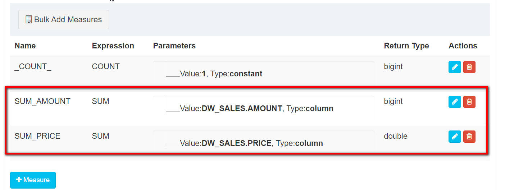

# 1. 基于Kylin的预警分析

## 1.1. Kylin简介


- 1.Kylin 是一款大数据OLAP引擎，由ebay-[**中国团队研发**]()的，是第一个真正由中国人自己主导、从零开始、自主研发、并成为Apache顶级开源项目

- 2.Hive的性能比较慢，支持SQL灵活查询

- 3.HBase的性能快，原生不支持SQL

- 4.Kylin是将先将数据进行[**预处理**]()，将预处理的结果放在HBase中。效率很高

 

## 1.2. 为什么要使用Kylin

​		Kylin 是一个 Hadoop 生态圈下的 MOLAP 系统，是 ebay 大数据部门从2014 年开始研发的支持 TB 到 PB 级别数据量的分布式 Olap 分析引擎。其特点包括:


**优点：**

- 1.可扩展的超快（亚秒级）的 OLAP 引擎

- 2.提供 ANSI-SQL 接口

- 3.交互式查询能力（亚秒级）

- 4.MOLAP Cube 的概念(立方体)（数据预聚合：空间换时间）
- 5.Cube构建好后，会将结果数据保存在hbase里面；
- 6.web查询数据时候，是通过kylin的查询服务，直接查询hbase,所以查询能够实现亚秒级

- 7.与 BI 工具可无缝整合

  

## 1.3. Kylin的应用场景

Kylin 典型的应用场景如下：

- 1.用户数据存在于Hadoop HDFS中，利用Hive将HDFS文件数据以关系数据方式存取，数据量巨大，在500G以上;

- 2.每天有数G甚至数十G的数据增量导入;

- 3.有1**0个以内较为固定**的分析维度;

Kylin 的核心思想是**利用空间换时间**，在数据 ETL 导入 OLAP 引擎时**提前计算各维度的聚合结果并持久化保存**

**** 


## 1.4. Kylin的总体架构

Kylin 依赖于 **Hadoop、Hive、Zookeeper 和 Hbase**

 

 

 

 

# 2. Kylin启动

## 2.1. 启动集群

- 1、启动zookeeper

- 2、启动HDFS
- 3、启动YARN集群
- 4、启动HBase集群
- 5、启动 metastore
  - nohup hive --service metastore &
- 6、启动 hiverserver2
  - nohup hive --service hiveserver2 &
- 7、启动Yarn history server
  - mr-jobhistory-daemon.sh start historyserver
- 8、启动kylin
  - ./kylin.sh start

- 9、登录Kylin
  - [http://node01:7070/kylin](http://node1:7070/kylin)

| **url**    | http://IP:7070/kylin |
| ---------- | -------------------- |
| 默认用户名 | ADMIN                |
| 默认密码   | KYLIN                |

**用户名和密码都必须是大写**


# 3. Kylin实战 - 使用Kylin进行OLAP分析

## 3.1.测试数据表结构介绍

1、（事实表）dw_sales

| **列名**  | **列类型** | **说明**                     |
| --------- | ---------- | ---------------------------- |
| id        | string     | 订单id                       |
| date1     | string     | 订单日期                     |
| channelid | string     | 订单渠道（商场、京东、天猫） |
| productid | string     | 产品id                       |
| regionid  | string     | 区域名称                     |
| amount    | int        | 商品下单数量                 |
| price     | double     | 商品金额                     |

2、（维度表_渠道方式）dim_channel

| **列名**    | **列类型** | **说明** |
| ----------- | ---------- | -------- |
| channelid   | string     | 渠道id   |
| channelname | string     | 渠道名称 |

3、（维度表_产品名称）dim_product

| **列名**    | **列类型** | **说明** |
| ----------- | ---------- | -------- |
| productid   | string     | 产品id   |
| productname | string     | 产品名称 |

4、（维度表_区域）dim_region

| **列名**   | **类类型** | **说明** |
| ---------- | ---------- | -------- |
| regionid   | string     | 区域id   |
| regionname | string     | 区域名称 |

## 3.2.导入测试数据

为了方便后续学习Kylin的使用，需要准备一些测试表、测试数据。

- 1.Hive中创建表

- 2.将数据从本地文件导入到Hive

  

操作步骤

- 1、使用 beeline 连接Hive

  ``` properties
  !connect jdbc:hive2://node01:10000
  ```

- 2、创建并切换到 itcast_dw 数据库

  ``` properties
  create database itcast_dw;use itcast_dw;
  ```

- 3、创建测试数据文件夹，并将测试数据文件上传到该文件夹中

  ``` properties
  mkdir -p /export/servers/tmp/kylin
  将“4.资料\Kylin\4.kylin_实战_hive_建表语句\数据文件”中的数据上传至此目录
  ```

- 4、找到资料中的“4.资料\Kylin\4.kylin_实战_hive_建表语句\hive.sql”文件，执行sql、创建测试表，并导入数据到表中

  - hive.sql

  ``` sql
  -- 1、销售表：dw_sales
  -- id   唯一标识
  -- date1 日期
  -- channelId 渠道 ID
  -- productId 产品 ID
  -- regionId 区域 ID
  -- amount 数量
  -- price 金额
  create table dw_sales(
      id string,
      date1 string,
      channelId string, 
      productId string, 
      regionId string,
      amount int,
      price double)ROW FORMAT DELIMITED FIELDS TERMINATED BY ',' stored as textfile;
  
  -- 2、渠道表：dim_channel
  -- channelId 渠道ID
  -- channelName 渠道名称
  create table dim_channel(
      channelId string, 
      channelName string )ROW FORMAT DELIMITED FIELDS TERMINATED BY ',' stored as textfile;
  
  -- 3、产品表：dim_product
  create table dim_product(
      productId string, 
      productName string )ROW FORMAT DELIMITED FIELDS TERMINATED BY ',' stored as textfile;
  
  --4、区域表：dim_region
  create table dim_region(
      regionId string,
      regionName string)ROW FORMAT DELIMITED FIELDS TERMINATED BY ',' stored as textfile;
  
  -- 导入数据
  LOAD DATA LOCAL INPATH '/export/servers/tmp/kylin/dw_sales_data.txt' OVERWRITE  INTO TABLE dw_sales;
  
  LOAD DATA LOCAL INPATH '/export/servers/tmp/kylin/dim_channel_data.txt' OVERWRITE  INTO TABLE dim_channel;
  
  LOAD DATA LOCAL INPATH '/export/servers/tmp/kylin/dim_product_data.txt' OVERWRITE  INTO TABLE dim_product;
  
  LOAD DATA LOCAL INPATH '/export/servers/tmp/kylin/dim_region_data.txt' OVERWRITE  INTO TABLE dim_region;
  ```

  - -- 查看表是否创建成功show tables;

- 5、执行一条SQL语句，确认数据是否已经成功导入
  - select * from dw_sales;


## **3.3.** 按照日期统计订单总额/总数量（Hive方式）

操作步骤：

- 1、使用beeline连接Hive

- 2、切换到itcast_dw数据库

- 3、编写SQL语句

操作步骤：

- 1、使用beeline连接Hive

- 2、切换到itcast_dw数据库

  ``` properties
  use itcast_dw;
  ```

- 2、在代码目录中创建sql文件，编写SQL语句

  - 缺点： **性能非常慢**

  ``` properties
  select date1, sum(price) as total_money, sum(amount) as total_amount from dw_sales group by date1;
  ```

  


# 4. 按照日期统计订单总额/总数量（Kylin方式）

要使用Kylin进行OLAP分析，需要按照以下方式来进行。

- 1、创建项目（Project）

- 2、创建数据源（DataSource）
  - 指定有哪些数据需要进行数据分析

- 3、创建模型（Model）
  - 指定具体要对哪个事实表、那些维度进行数据分析

- 4、创建立方体（Cube）
  - 指定对哪个数据模型执行数据预处理，生成不同维度的数据

- 5、执行构建、等待构建完成

- 6、再执行SQL查询，获取结果


**从Cube中查询数据**

操作步骤

## **4.1.** 创建项目（Project）

 

## 4.2. 创建数据源（DataSource）

将Hive中的表都导入到Kylin中

在添加表名中，指定数据库名

itcast_dw.dim_channel,

itcast_dw.dim_product,

itcast_dw.dim_region,

itcast_dw.dw_sales

 


## 4.3. 创建模型（Model）

- 1、 指定模型名称

 


- 2、 指定事实表

 

- 3、 **指定维度**

 

- 4、 **指定待分析的指标**

 

- 5、 指定分区和过滤条件

 

## 4.4. 创建立方体（Cube）

1、选择数据模型


 

2、指定维度


 

 

 

3、指定度量


 



4、指定刷新设置

 

5、指定执行引擎

 

## 4.5. 执行构建

 

 

## 4.6. 执行SQL语句分析

 

在Insight选项卡中，执行以下SQL语句

``` sql
select
  date1,
  sum(price) as total_money,
  sum(amount) as total_amount
from
  dw_sales
group by date1;
```


# 5. 按照订单渠道ID、名称统计订单总额/总数量

- 1、创建Model

指定关联表、关联条件

 

指定维度

 

指定聚合字段：

 

- 2、创建Cube

- 3、执行构建、等待构建完成

- 4、执行SQL查询，获取结果

 

 

``` sql
select
	t2.channelid,
	t2.channelname,
	sum(t1.price) as total_money,
	sum(t1.amount) as total_amount
from 
	dw_sales t1
inner join dim_channel t2
on t1.channelid = t2.channelid
group by t2.channelid, t2.channelname
```


 

# 6. **按照日期、区域、产品维度统计订单总额/总数量**

- 1、创建Model

指定关联表、关联条件

 

指定维度字段

 

- 2、创建Cube

**指定cube维度**

 

- 3、执行构建、等待构建完成

- 4、执行SQL查询，获取结果

``` sql
select
	t1.date1, 
	t2.regionid, 
	t2.regionname, 
	t3.productid, 
	t3.productname,
	sum(t1.price) as total_money,
	sum(t1.amount) as total_amount
from
	dw_sales t1
inner join dim_region t2
on t1.regionid = t2.regionid
inner join dim_product t3
on t1.productid = t3.productid
group by 
	t1.date1, 
	t2.regionid, 
	t2.regionname, 
	t3.productid, 
	t3.productname
order by 
	t1.date1
```


 

# 7. **Kylin的工作原理**

Apache Kylin的工作原理本质上是 MOLAP（多维立方体分析）。

## 7.1. 维度和度量

- **维度**就是**观察数据的角度**，例如：
  - 电商的销售数据，可以从时间的维度来观察，也可以细化从时间和地区的维度来观察
  - 统计时，可以把维度值相同的记录聚合在一起，然后应用聚合函数做累加、平均、去重计数等聚合计算

- **度量**就是**被聚合的统计值**，也是聚合运算的结果。

 

| **时间（维度）** | **销售额（度量）** |
| ---------------- | ------------------ |
| 2019 1Q          | 1.7M               |
| 2019 2Q          | 2.1M               |
| 2019 3Q          | 1.6M               |
| 2019 4Q          | 1.8M               |

 

 

| **时间（维度）** | **地区（维度）** | **销售额（度量）** |
| ---------------- | ---------------- | ------------------ |
| 2019 1Q          | 中国             | 1.0M               |
| 2019 1Q          | 北美             | 0.7M               |
| 2019 2Q          | 中国             | 1.5M               |
| 2019 2Q          | 北美             | 0.6M               |
| 2019 3Q          | 中国             | 0.9M               |
| 2019 3Q          | 北美             | 0.7M               |
| 2019 4Q          | 中国             | 0.9M               |
| 2019 4Q          | 北美             | 0.9M               |

 

 

## 7.2. Cube和Cuboid

-  Cube:多维立方体，是一个形象的说法，cube模型称之为多维立方体模型，是由多个cuboid组成；
- cuboid:立方形，也是一个形象说法，任意一组维度进行组合（维度的数量可以是大于等于0），得到的聚合结果，我们称之为cuboid; cuboid的数量取决于维度的数量；对于N个维度来说，**cuboid总数量 = 2 的N 次方种**

- 一个数据表 或 数据模型上的字段 它们要么是**维度**，要么是**度量**（可以被聚合）

- 给定一个数据模型，可以对其上的所有维度进行组合。对于N个维度来说，组合的所有可能性共有**2 的N 次方种**

- 对于每一种维度的组合，将度量做聚合运算，然后将运算的结果保存为一个**物化视图**，称为**Cuboid（立方形）**

- 所有维度组合的Cuboid作为一个整体，被称为**Cube（立方体）**。一个Cube就是许多按维度聚合的物化视图的集合。

 

| **说明** | **维度1地区** | **维度2时间** | **维度3** | **维度4** |
| -------- | ------------- | ------------- | --------- | --------- |
| 取值     | 0或1          | 0或1          | 0或1      | 0或1      |

 

 

 

 

## **7.3.** 了解Cube的概念

 

数据立方体:

- 1.Cube 是所有 dimession 的组合

- 2.每一种 dimession 的组合称之为cuboid（立方形）。某一有 n 个 dimession 的 cube 会有 2^n个 cuboid

- 3.数据立方体只是多维模型的一个形象的说法

**组合示意图**

 

为什么叫立方体？

-  立方体本身只有三维，但多维模型不仅限于三维模型，可以组合更多的维度

- 为了与传统关系型数据库的二维表区别开来，才有了数据立方体的叫法

 

## 7.4. 工作原理

Apache Kylin的工作原理是对数据模型做Cube预计算，并利用计算的结果加速查询。具体工作过程如下。

- 指定**数据模型**，定义维度和度量；

- **build**: 预计算Cube，计算所有Cuboid并保存为物化视图（存储到Hbase中）；

- 执行查询时，读取Cuboid，运算，产生查询结果；

 

高效OLAP分析：

- Kylin的查询过程**不会扫描原始记录**，而是通过预计算预先完成表的关联、聚合等复杂运算;

- **利用预计算的结果来执行查询**，相比非预计算的查询技术，其速度一般要快一到两个数量级，在超大的数据集上优势更明显;

- 数据集达到千亿乃至万亿级别时，Kylin的速度可以超越其他非预计算技术1000倍以上;

  

## 7.5. 技术架构

Apache Kylin系统可以分为在线查询和离线构建两部分。

**kylin架构图**

 

在线查询模式主要处于上半部分，离线构建处于下半部分。以下为Kylin技术架构的具体内容：

 

- 数据源主要是Hadoop Hive，数据以关系表的形式输入，且符合星形模型，保存着待分析的用户数据。根据元数据的定义，构建引擎从数据源抽取数据，并构建Cube

- Kylin可以使用**MapReduce或者Spark作为构建引擎**。构建后的Cube保存在右侧的存储引擎中，一般选用**HBase作为存储**

- 完成了离线构建后，用户可以从上方查询系统发送SQL进行查询分析

- Kylin提供了各种**Rest API、JDBC/ODBC接口**。无论从哪个接口进入，SQL最终都会来到Rest服务层，再转交给查询引擎进行处理

- **SQL语句是基于数据源的关系模型书写的**，而不是Cube
  - (1) Kylin在设计时，**刻意对查询用户屏蔽了Cube的概念**
  - (2) 分析师只需要理解简单的关系模型就可以使用Kylin，没有额外的学习门槛，传统的SQL应用也很容易迁移
  - (3) 查询引擎解析SQL，生成基于关系表的逻辑执行计划，然后将其转译为基于Cube的物理执行计划，最后查询预计算生成的Cube并产生结果，**整个过程不会访问原始数据源**

 

#  8. **JDBC操作Kylin**

​		要将数据以可视化方式展示出来，需要使用Kylin的JDBC方式连接执行SQL，获取Kylin的执行结果

使用Kylin的JDBC与JDBC操作MySQL一致。

 

- 需求

通过JDBC方式，查询证券多指标统计结果

 

``` properties
数据库驱动:org.apache.kylin.jdbc.Driver

url: jdbc:kylin://node01:7070/kylin（数据库名）

用户名:ADMIN

密码:KYLIN
```


## 8.1. 导入依赖

``` xml
<dependencies>
    <dependency>
        <groupId>org.apache.kylin</groupId>
        <artifactId>kylin-jdbc</artifactId>
        <version>2.6.3</version>
    </dependency>
</dependencies>
```


 

## 8.2.代码开发

- 开发步骤：

``` properties
1、加载驱动

2、创建Connection连接对象

3、构建SQL语句

4、创建Statement对象

5、执行查询

6、打印结果

7、关流

 
```


- 代码演示

``` java
public class KylinTest {

    public static void main(String[] args) throws Exception {
        //1、加载驱动
        Class.forName("org.apache.kylin.jdbc.Driver");
        //2、创建Connection连接对象
        Connection connection = DriverManager.getConnection("jdbc:kylin://node01:7070/kylin", "ADMIN", "KYLIN");
        //3、构建SQL语句
        String sql = "SELECT\n" +
                "  sec_code,\n" +
                "  trade_date,\n" +
                "  MAX(high_price) as high_price,\n" +
                "  MIN(low_price) as low_price,\n" +
                "  MAX(trade_vol_day) as  trade_vol_max,\n" +
                "  MIN(trade_vol_day) as  trade_vol_min,\n" +
                "  MAX(trade_amt_day) as  trade_amt_max,\n" +
                "  MIN(trade_amt_day) as  trade_amt_min\n" +
                "FROM itcast_quot_dm.app_sec_quot_stock\n" +
                "GROUP BY sec_code,trade_date \n" +
                "ORDER BY sec_code \n" +
                "LIMIT 10;";
        //4、创建Statement对象
        Statement statement = connection.createStatement();
        //5、执行查询
        ResultSet rs = statement.executeQuery(sql);
        while (rs.next()) {
            String secCode = rs.getString(1);
            String tradeDate = rs.getString(2);
            String high_price = rs.getString(3);
            String low_price = rs.getString(4);
            String trade_vol_max = rs.getString(5);
            String trade_vol_min = rs.getString(6);
            String trade_amt_max = rs.getString(7);
            String trade_amt_min = rs.getString(8);
            //6、打印结果
            System.out.println(secCode + "," + trade_amt_max);
        }
        //7、关流
        rs.close();
        statement.close();
        connection.close();
    }
}
```


# 9- Kylin总结

## 9-1 Kylin介绍

- Kylin 是一款大数据OLAP引擎，由ebay-[**中国团队研发**]()的，是第一个真正由中国人自己主导、从零开始、自主研发、并成为Apache顶级开源项目；
- Kylin是将先将数据进行[**预处理**]()，将预处理的结果放在**HBase**中。**效率很高**；
- **优点：**

  - 1.可扩展的超快（亚秒级）的 OLAP 引擎

  - 2.提供 ANSI-SQL 接口

  - 3.交互式查询能力（**亚秒级**）

  - 4.MOLAP **Cube 的概念(立方体)（数据预聚合：空间换时间）**
  - 5.Cube构建好后，**会将结果数据保存在hbase里面；**
  - 6.**web查询数据时候，是通过kylin的查询服务，直接查询Hbase,所以查询能够实现亚秒级**

  - 7.**与 BI 工具可无缝整合**

## 9-2 Kylin体系架构

- Kylin 依赖于 **Hadoop、Hive、Zookeeper 和 Hbase**
- 步骤：
  - **创建项目;**
  - **创建DataSource;**
  - **加载数据；**
  - **创建Model;**
  - **创建Cube;**
  - **构建Build  Cube;**
  - **Cube结果装载到HBase;**


 

## 9-3 维度与度量

- **维度**就是**观察数据的角度**，例如：
  - 电商的销售数据，可以从时间的维度来观察，也可以细化从时间和地区的维度来观察
  - 统计时，可以把维度值相同的记录聚合在一起，然后应用聚合函数做累加、平均、去重计数等聚合计算

- **度量**就是**被聚合的统计值**，也是聚合运算的结果。

## 9-4 Cube和Cuboid

-  **cube模型称之为多维立方体模型，是由多个cuboid组成**；
-  **任意一组维度进行组合（维度的数量可以是大于等于0），得到的聚合结果**，我们称之为cuboid; 
-  cuboid的数量取决于维度的数量；对于N个维度来说，**cuboid总数量 = 2 的N 次方种**
-  一个数据表 或 数据模型上的字段 它们要么是**维度**，要么是**度量**（可以被聚合）
-  **Cuboid（立方形）也成为 物化视图**
-  所有维度组合的Cuboid作为一个整体，被称为**Cube（立方体）**。一个Cube就是许多按维度聚合的物化视图的集合。

## 9-5 工作原理

Apache Kylin的工作原理是对数据模型做Cube预计算，并利用计算的结果加速查询。具体工作过程如下。

- 指定**数据模型**，定义维度和度量；

- **build**: 预计算Cube，计算所有Cuboid并保存为物化视图（存储到Hbase中）；

- 执行查询时，读取Cuboid，运算，产生查询结果；


## 9-6 全量构建与增量构建

### 9-6-1 全量构建

- 每次构建都是全部数据（**全删全建**）；

- **Cube中只存在唯一的一个Segment**

- **该Segment没有分割时间的概念，也就没有起始时间和结束时间**


### 9-6-2 增量构建

- **只会导入新Segment指定的时间区间内的原始数据**，并只对这部分原始数据进行预计算;
- 每次构建的都是**指定的时间区间**内的原始数据；
- 每次构建**生成一个新的segment**，保存在HBase中；
- segment之间**通过时间分割**；


### 9-6-3 全量 和 增量 对比

| **全量构建**                       | **增量构建**                                                 |
| ---------------------------------- | ------------------------------------------------------------ |
| 每次更新时都需要更新**整个数据集** | 每次只对需要**更新的时间范围进行更新**，因此离线计算量相对较小 |
| 查询时不需要合并不同Segment的结果  | 查询时**需要合并不同Segment的结果，因此查询性能会受影响**    |
| 不需要后续的Segment合并            | 累计一定量的Segment之后，**需要进行合并**                    |
| **适合小数据量或全表更新的Cube**   | **适合大数据量的Cube**                                       |


### 9-6-4 性能对比

- 构建：

  - 全量构建：慢；
  - 增量构建：快；

- 查询：

  - 全量查询：快；（只有一个segment）
  - 增量查询：慢；（会有多个segment，需要合并）

- 应用场景：

  - 增量：数据量大；
  - 全量：数据量小；

## 9-7 增量构建Cube过程

- **指定分割时间列**
  - 增量构建Cube的定义**必须包含一个时间维度**，用来分割不同的Segment，这样的维度称为**分割时间列**（Partition Date Column）。**就是指定一个时间范围**

- **增量构建过程**
  - (1) 在进行增量构建时，将增量部分的**起始时间和结束时间**作为增量构建请求的一部分提交给Kylin的任务引擎；
  - (2) 任务引擎会**根据起始时间和结束时间从Hive中抽取相应时间的数据**，并对这部分数据做预计算处理，并保存在Hbase中；
  - (3) **将预计算的结果封装成为一个新的Segment**，并将相应的信息保存到元数据和存储引擎中。一般来说，**增量部分的起始时间等于Cube中最后一个Segment的结束时间**。

## 9-8 Cube碎片管理(Segment管理)

- 对多个segment进行**合并操作**，也就是多个segment合并成一个segment;

  - **手动**合并；
  - **自动**合并；（合并顺序策略：**从大到小**）
    - **自动合并策略；**
    - **保留策略；**

- 对不需要的segment进行**删除**；

``` properties
假设自动合并阈值设置为7天、28天

如果现在有A-H共9个连续的Segment，它们的时间长度为28天（A）、7天（B）、1天（C）、1天（D）、1天（E）、1天（F）、1天（G）、1天（H）、1天（I）

此时，第9个Segment  加入，时间长度为1天。

自动合并策略为：

1、Kylin判断时候能将连续的Segment合并到28天这个阈值，由于Segment A已经超过28天，会被排除

2、剩下的连续Segment，所有时间加一起 B + C + D + E + F + G + H + I （7 + 1 + 1 + 1 + 1 + 1 + 1 + 1 = 14） < 28天，无法满足28天阈值，开始尝试7天阈值

3、跳过A（28）、B（7）均超过7天，排除

4、剩下的连续Segment，所有时间加一起 C + D + E + F + G + H + I（1 + 1 + 1 + 1 + 1 + 1 + 1 = 7）达到7天阈值，触发合并，提交Merge任务。并构建一个Segment X（7天）

5、合并后，Segment为：A（28天）、B（7天）、X（7天）

6、继续触发检查，A（28天）跳过，B + X（7 + 7 = 14）< 28天，不满足第一阈值，重新使用第二阈值触发

7、跳过B、X，尝试终止
```


## 9-9 Kylin Cube优化

- Cube的剪枝优化是一种**试图减少额外空间占用**的方法；

- 目的就是删除多余的Cuboid;

- 优化方案：
  - 使用衍生维度；
    - 使用衍生维度用于在有效维度内将**维度表上的[非主键]()维度排除掉**，**并使用维度表的主键（其实是事实表上相应的外键）来替代它们**。
    - Kylin会在底层[**记录维度表主键与维度表其他维度之间的映射关系**]()，以便在查询时能够动态地将维度表的主键“翻译”成这些非主键维度，并进行实时聚合。
  - 聚合组
    - 强制维度（Mandatory） 
      -  cuboid直接减半
    - 层级维度（Hierarchy）
      -  如：年月日；国家省份城市。 如果是N维度使用层级 ，cuboid从2^n 减到 n+1
    - 联合维度（Joint）
      - 多个维度要么同时存在，要么同时都没有；如果N个维度使用联合，cuboid = 1；

