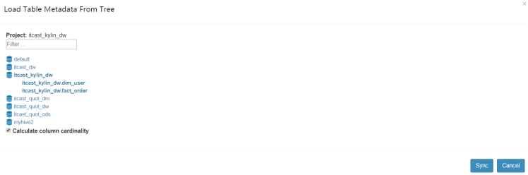
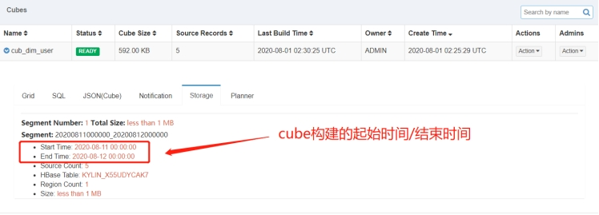
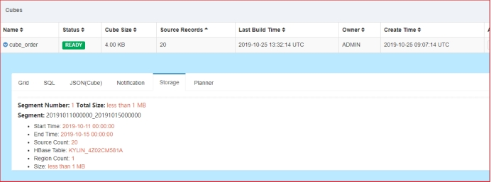

#  1.Kylin增量构建

## **1.1.** 应用场景

- Kylin在每次Cube的构建都会从Hive中批量读取数据，

- 对于大多数业务场景来说，Hive中的数据处于**不断增长的状态**。

- 为了支持Cube中的数据能够不断地得到更新，且无需重复地为已经处理过的历史数据构建Cube，因此对于

Cube引入了增量构建的功能


## **1.2.** 理解Cube、Cuboid与Segment的关系


**segment示意图**

 

​		一个Cube，可以包含多个Cuboid，而Segment是指定时间范围的Cube，可以理解为Cube的分区。对应就是HBase中的一张表。该表中包含了所有的Cuboid。


- 理解segment

  - Kylin将Cube划分为多个Segment（**对应就是HBase中的一个表**）;

  - 每个Segment用**起始时间和结束时间**来标志

  - Segment代表**一段时间内源数据**的预计算结果。

  - 一个Segment的起始时间等于它之前那个Segment的结束时间，同理，它的结束时间等于它后面那个Segment的起始时间。

  - 每个segment 的**数据结构一样**：同一个Cube下不同的Segment除了背后的源数据不同之外，**其他如结构定义、构建过程、优化方法、存储方式等都完全相同**。

    

- **cube 、 cuboid、segment三者关系**

  - 一个Cube 包含多个cuboid;
  - 一个cube 保护多个segment;
  - 一个segment对应HBase中的一张表；
  - 在增量构建的时候，每增量构建一次，形成一个segment;
  - cuboid是**任意维度组合**（2^n 种）之后，**聚合形成的物化视图**（结果数据）;
  - 每一个增量构建下的segment是有起止时间的（通过时间进行分区）；

例如：以下为针对某个Cube的Segment

| **Segment名称**                 | **分区时间** | **HBase表名** |
| ------------------------------- | ------------ | ------------- |
| 201910110000000-201910120000000 | 20191011     | KYLIN_41Z8123 |
| 201910120000000-201910130000000 | 20191012     | KYLIN_5AB2141 |
| 201910130000000-201910140000000 | 20191013     | KYLIN_7C1151  |
| 201910140000000-201910150000000 | 20191014     | KYLIN_811680  |
| 201910150000000-201910160000000 | 20191015     | KYLIN_A11AD1  |

 

## **1.3.** 全量构建与增量构建

### 1.3.1.**全量构建**

- 每次构建都是全部数据；

- Cube中只存在唯一的一个Segment

- 该Segment没有分割时间的概念，也就没有起始时间和结束时间

- 对于全量构建来说，每当需要更新Cube数据的时候，它不会区分历史数据和新加入的数据，也就是说，在构建的时候会**导入并处理所有的原始数据**。

 

### 1.3.2.**增量构建**

- **只会导入新Segment指定的时间区间内的原始数据**，并只对这部分原始数据进行预计算。

- 每次构建的都是指定的时间区间内的原始数据；
- 每次构建生成一个新的segment，保存在HBase中；
- segment之间通过时间分割；


### 1.3.3.**总结：**

**全量构建和增量构建的对比**：

| **全量构建**                      | **增量构建**                                               |
| --------------------------------- | ---------------------------------------------------------- |
| 每次更新时都需要更新整个数据集    | 每次只对需要更新的时间范围进行更新，因此离线计算量相对较小 |
| 查询时不需要合并不同Segment的结果 | 查询时需要合并不同Segment的结果，因此查询性能会受影响      |
| 不需要后续的Segment合并           | 累计一定量的Segment之后，需要进行合并                      |
| 适合小数据量或全表更新的Cube      | 适合大数据量的Cube                                         |


**全量构建与增量构建的Cube查询方式对比：** 

**全量构建Cube**

- 查询引擎只需向存储引擎访问单个Segment所对应的数据，无需进行Segment之间的聚合

- 为了加强性能，单个Segment的数据也有可能被分片存储到引擎的多个分区上，查询引擎可能仍然需要对单个Segment不同分区的数据做进一步的聚合

  

**增量构建Cube**

-  由于不同时间的数据分布在不同的Segment之中，查询引擎需要向存储引擎请求读取各个Segment的数据

- 增量构建的Cube上的查询会比全量构建的**做更多的运行时聚合**，通常来说增量构建的Cube上的查询会比全量构建的Cube上的查询要慢一些

**性能对比**

- 构建：

  - 全量构建：慢；
  - 增量构建：快；

- 查询：

  - 全量查询：快；（只有一个segment）
  - 增量查询：慢；（会有多个segment，需要合并）

- 应用场景：

  - 增量：数据量大；
  - 全量：数据量小；

  

​        对于小数据量的Cube，或者经常需要全表更新的Cube，使用**全量构建**需要更少的运维精力，以少量的重复计算降低生产环境中的维护复杂度。而对于大数据量的Cube，例如，对于一个包含两年历史数据的Cube，如果需要每天更新，那么每天为了新数据而去重复计算过去两年的数据就会变得非常浪费，在这种情况下需要考虑使用增量构建


## **1.4.** 增量构建Cube过程

- 1、**指定分割时间列**
  - 增量构建Cube的定义**必须包含一个时间维度**，用来分割不同的Segment，这样的维度称为分割时间列（Partition Date Column）。

- 2、**增量构建过程**
  - (1) 在进行增量构建时，将增量部分的起始时间和结束时间作为增量构建请求的一部分提交给Kylin的任务引擎
  - (2) 任务引擎会根据起始时间和结束时间从Hive中抽取相应时间的数据，并对这部分数据做预计算处理
  - (3) 将预计算的结果封装成为一个新的Segment，并将相应的信息保存到元数据和存储引擎中。一般来说，增量部分的起始时间等于Cube中最后一个Segment的结束时间。

## **1.5.** 增量Cube的创建

**需求**：

- 根据用户id和日期统计订单总额。

 

### 1.5.1. **加载数据**


- 数据准备

``` properties
mkdir -p /export/servers/tmp/kylin_increment

将“\4.资料\kylin_增量构建\数据文件”目录下的文件copy至/export/servers/tmp/kylin_increment目录。

建库建表可参见“4.资料\kylin_增量构建\1.create_table_loaddata.sql”，也可以按照如下步骤操作：
```

- 创建数据库

``` properties
create database if not exists `itcast_kylin_dw`;
```


- 创建表

``` sql
-- 1. 创建用户维度表
create table `itcast_kylin_dw`.`dim_user`(
    id string,
    name string
)
row format delimited fields terminated by ',';

-- 2. 创建订单事实表
create table `itcast_kylin_dw`.`fact_order`(
    order_id string,
    user_id string,
    price int
)
partitioned by (dt string)
row format delimited fields terminated by ',';
```


- 加载数据

``` sql
-- 装载数据
load data local inpath '/export/servers/tmp/kylin_increment/data_dim_user.txt' overwrite into table `itcast_kylin_dw`.`dim_user`;

load data local inpath '/export/servers/tmp/kylin_increment/data_order_20200811.txt' overwrite into table `itcast_kylin_dw`.`fact_order` partition(dt='20200811');

load data local inpath '/export/servers/tmp/kylin_increment/data_order_20200812.txt' overwrite into table `itcast_kylin_dw`.`fact_order` partition(dt='20200812');

load data local inpath '/export/servers/tmp/kylin_increment/data_order_20200813.txt' overwrite into table `itcast_kylin_dw`.`fact_order` partition(dt='20200813');

load data local inpath '/export/servers/tmp/kylin_increment/data_order_20200814.txt' overwrite into table `itcast_kylin_dw`.`fact_order` partition(dt='20200814');
```


 

### 1.5.2. **增量构建**

创建增量Cube的过程和创建普通Cube的过程基本类似，只是增量Cube会有一些额外的配置要求

 

 

 

1、配置Model

增量构建的Cube需要指定分割时间列。例如：将日期分区字段添加到维度列中

**将日期分区字段添加到维度列中**

 

**在设置中，配置分区列，并指定日期格式**

 

 

注意事项

​		- 注意构建Cube时，选择的分区时间为，起始时间（包含）、结束时间（不包含），对应了从Hive从获取数据源的条件

``` sql
SELECT
    `FACT_ORDER`.`DT` as `FACT_ORDER_DT`
    ,`FACT_ORDER`.`USER_ID` as `FACT_ORDER_USER_ID`
    ,`FACT_ORDER`.`PRICE` as `FACT_ORDER_PRICE`
FROM `ITCAST_KYLIN_DW`.`FACT_ORDER` as `FACT_ORDER`
INNER JOIN `ITCAST_KYLIN_DW`.`DIM_USER` as `DIM_USER`
ON `FACT_ORDER`.`USER_ID` = `DIM_USER`.`ID`
WHERE 1=1 AND (`FACT_ORDER`.`DT` >= '20200811' AND `FACT_ORDER`.`DT` < '20200812');
```


2、查看Segment

 

 

3、构建 20200812、20200813的Cube数据

 

**查看任务名称**

 

2、 查看增量构建Cube对应的Segment

 

## **1.6.** REST API触发增量构建

在Web GUI上进行的所有操作，其背后调用的都是同一套Rest API。将来可以SHELL脚本调度REST API触发构建。

 

| 属性                      | 值                                                           |
| ------------------------- | ------------------------------------------------------------ |
| URL                       | [http://node01:7070/kylin/api/cubes/](http://node1:7070/kylin/api/cubes/){Cube名称}/build |
| 请求方式                  | PUT                                                          |
| RequestBody（JSON字符串） | {"startTime":时间戳, "endTime": "时间戳", "buildType": "BUILD/MERGE/REFRESH"} |

 

**注意：**

​	Kylin中Cube构建的时间采用CST（**北京时间**），而REST提交的时间采用的是UTC（**世界标准时间**）

**CST = UTC + 8**

**startTime、endTime提交到Kylin，应该 +8 个小时**

参考JSON：

``` json
{
	"startTime": "1597276800000",  	// 2020-08-13 08:00:00
	"endTime": "1597363200000",		// 2020-08-14 08:00:00
	"buildType": "BUILD"
}
```


- 时间戳转换工具：

``` html
http://tool.chinaz.com/Tools/unixtime.aspx
```


**postman示意图**


 

## **1.7.** 查询SQL

``` sql
SELECT
  a.dt,
  b.id,
  b.name,
  SUM(price) AS sum_price
FROM fact_order a
  INNER JOIN dim_user b
    ON a.user_id = b.id
GROUP BY 1,2,3
ORDER BY 1,2
```


# 2.Cube碎片管理 (segment管理)


**碎片管理指的是对一个cube下的segment进行管理；**

管理方式：

- 对多个segment进行**合并操作**，也就是多个segment合并成一个segment;

  - **手动**合并；
  - **自动**合并；（合并顺序策略：**从大到小**）
    - 如果自动合并阈值里面包含多个阈值数据；
    - 首先判断一个个的segment把日期合并起来，判断是否满足最大的阈值条件，满足就合并；
    - 当不满足最大的阈值条件，继续判断和比较第二大的阈值条件；以此类推；

- 对不需要的segment进行**删除**；

  

## 2.1. 增量构建的问题


​		日积月累，增量构建的Cube中的Segment越来越多，该Cube的查询性能也会越来越慢，因为需要在单点的查询引擎中完成越来越多的运行时聚合。为了保持查询性能：

- 需要定期地将某些Segment**合并**在一起

- 或者让Cube根据Segment **保留策略自动地淘汰那些不会再被查询到的陈旧Segment**


## 2.2. 管理Cube碎片

​		上述案例，每天都会生成一个Segment，对应就是HBase中的一张表。增量构建的Cube每天都可能会有新的增量。这样的Cube中最终可能包含上百个Segment，这将会导致Kylin性能受到严重的影响。

- 从执行引擎的角度来说，运行时的**查询引擎需要聚合多个Segment**的结果才能返回正确的查询结果

- 从存储引擎的角度来说，大量的Segment会带来大量的文件，给存储空间的多个模块带来巨大的压力，例如Zookeeper、HDFS Namenode等

因此，有必要采取措施控制Cube中Segment的数量。

**segment数量过多**

 


## 2.3. 手动触发合并Segment

​		Kylin提供了一种简单的机制用于控制Cube中Segment的数量：合并Segments。在Web GUI中选中需要进行Segments合并的Cube，

**操作步骤：**

- 1、model 界面 单击Action→Merge

 

 

 

- 2、选中需要合并的Segment，可以同时合并多个Segment，但是这些Segment必须是连续的

  ​	

  ​		单击提交后系统会**提交一个类型为“MERGE”的构建任务**，它以选中的Segment中的数据作为输入，将这些Segment的数据合并封装成为一个新的Segment。新的Segment的起始时间为选中的最早的Segment的起始时间，它的结束时间为选中的最晚的Segment的结束时间。

**查看合并任务**

 


**注意事项:**

- 在MERGE类型的构建完成之前，**系统将不允许提交这个Cube上任何类型的其他构建任务**

- 在MERGE构建结束之前，**所有选中用来合并的Segment仍然处于可用的状态**

- 当MERGE构建结束的时候，系统将选中合并的Segment替换为新的Segment，而被替换下的Segment等待将被**垃圾回收和清理**，以节省系统资源

 


## **2.4.** 删除Segment


### 2.4.1. 手动 WebUI删除segment

- **1、disable Cube**

 

- **2、点击 delete Segment，删除指定的segment**

 

 


### 2.4.2. 自动用Postman删除Segment

 

| **属性** | **值**                                                       |
| -------- | ------------------------------------------------------------ |
| URL      | [http://node01:7070/kylin/api/cubes/](http://node1:7070/kylin/api/cubes/){cubeName}/segs/{segmentName} |
| 请求方式 | DELETE                                                       |

**postman示意图**

 


## 2.5. 自动合并

手动维护Segment很繁琐，人工成本很高，Kylin中是可以支持自动合并Segment。

在Cube Designer的“Refresh Settings”的页面中有：

- Auto Merge Thresholds  **自动合并策略**

- Retention Threshold        **保留策略**

**“Refresh Settings”的页面**

 

两个设置项可以用来帮助管理Segment碎片。这两项设置搭配使用这两项设置可以大大减少对Segment进行管理的麻烦。


### 2.5.1. **Auto Merge Thresholds**

 

-  允许用户设置**几个层级**的时间阈值，层级越靠后，时间阈值就越大

-  每当Cube中有新的Segment状态变为 READY的时候，会自动触发一次系统自动合并

-  合并策略
  - **尝试最大一级的时间阈值**，例如：针对（7天、28天）层级的日志，先检查能否将连续的若干个Segment合并成为一个超过28天的大Segment
  -  如果有个别的Segment的时间长度本身已经超过28天，系统会跳过Segment

  - 如果满足条件的连续Segment还不能够累积超过28天，那么系统会使用下一个层级的时间阈值重复寻找

 

示例1 - 理解Kylin自动合并策略

``` properties
假设自动合并阈值设置为7天、28天

如果现在有A-H共9个连续的Segment，它们的时间长度为28天（A）、7天（B）、1天（C）、1天（D）、1天（E）、1天（F）、1天（G）、1天（H）、1天（I）

此时，第9个Segment  加入，时间长度为1天。

自动合并策略为：

1、Kylin判断时候能将连续的Segment合并到28天这个阈值，由于Segment A已经超过28天，会被排除

2、剩下的连续Segment，所有时间加一起 B + C + D + E + F + G + H + I （7 + 1 + 1 + 1 + 1 + 1 + 1 + 1 = 14） < 28天，无法满足28天阈值，开始尝试7天阈值

3、跳过A（28）、B（7）均超过7天，排除

4、剩下的连续Segment，所有时间加一起 C + D + E + F + G + H + I（1 + 1 + 1 + 1 + 1 + 1 + 1 = 7）达到7天阈值，触发合并，提交Merge任务。并构建一个Segment X（7天）

5、合并后，Segment为：A（28天）、B（7天）、X（7天）

6、继续触发检查，A（28天）跳过，B + X（7 + 7 = 14）< 28天，不满足第一阈值，重新使用第二阈值触发

7、跳过B、X，尝试终止
```


 

### 2.5.2. **配置自动合并的Segment**

操作步骤：

**1、配置自动合并阈值为（4、28）**

 

2、分别按照天构建分区Cube

3、自动触发合并Segment构建

 

 

### 2.5.3. **自动合并测试**

(1) 新建Cube: auto_merge_incre

 

(2) 再Build一天的的任务

 

 

 

(3) 自动触发合并

 

 

 

 


## 2.6. （自动删除）配置保留Segment

- 自动合并是将多个Segment合并为一个Segment，以达到清理碎片的目的。

- 保留Segment则是及时清理不再使用的Segment。


在很多场景中，只会对过去一段时间内的数据进行查询，例如：

- 对于某个只显示过去1年数据的报表

- 支撑它的Cube其实只需要保留过去一年类的Segment即可

- 由于数据在Hive中已经存在备份，则无需在Kylin中备份超过一年的历史数据

 

可以将Retention Threshold设置为365。每当有新的Segment状态变为READY的时候，系统会检查每一个Segment。如果它的结束时间距离最晚的一个Segment的结束时间已经大于等于“Retention Threshold”，那么这个Segment将被视为无需保留。系统会自动地从Cube中删除这个Segment。

**保留策略示意图**

 配置保留Segment的策略为2天

 

 

### 2.6.1. **保留策略测试**

需求：

 配置保留Segment为2天，分别构建增量Segment，测试Segment保留情况

操作步骤：

1、在Cube中设置Retention Range为2

 

2、重新构建Cube

3、测试超过指定保留时间的Segment，是否被自动移除

 

创建cube_retention_threshold

 

再构建一天的数据

 

 

二次构建完成之后，会有两个Segment:

 

再构建第三天的数据：

 

 

构建完成之后，会删除：2020-08-11至2020-08-12的数据

 


# 3. Kylin Cube优化

## 3.1. Cuboid剪枝优化


**以减少Cuboid数量为目的的Cuboid优化统称为Cuboid剪枝。**


- 为什么要进行Cuboid剪枝优化

``` properties
在没有采取任何优化措施的情况下，Kylin会对每一种维度的组合进行预计算，每种维度的组合的预计算结果被称为Cuboid。

1. 如果有4个维度，可能最终会有2^4 = 16个Cuboid需要计算。但在实际开发中，用户的维度数量一般远远大于4个。
2. 如果有10个维度，那么没有经过任何优化的Cube就会存在2^10 =1024个Cuboid
3. 如果有20个维度，那么Cube中总共会存在2^20 =104 8576个Cuboid

这样的Cuboid的数量就足以让人想象到这样的Cube对构建引擎、存储引擎压力非常巨大。因此，在构建维度数量较多的Cube时，尤其要注意Cube的剪枝优化。
```


Cube的剪枝优化是一种**试图减少额外空间占用**的方法，这种方法的前提是不会明显影响查询时间。在做剪枝优化的时候，

- 需要选择跳过那些**“多余”的Cuboid**

- 有的Cuboid因为查询样式的原因永远不会被查询到，因此显得多余

- 有的Cuboid的能力和其他Cuboid接近，因此显得多余

Kylin提供了一系列简单的工具来帮助他们完成Cube的剪枝优化


## 3.2. 检查Cuboid数量

​		Apache Kylin提供了一个简单的工具，检查Cube中哪些Cuboid最终被预计算了，称这些Cuboid为被物化的Cuboid，该工具还能给出每个Cuboid所占空间的估计值。由于该工具需要在对数据进行一定阶段的处理之后才能估算Cuboid的大小，因此一般来说只能在Cube构建完毕之后再使用该工具。

使用如下的命令行工具去检查这个Cube中的Cuboid状态：

``` shell
cd /export/servers/apache-kylin-2.6.3-bin-hbase1x/
bin/kylin.sh org.apache.kylin.engine.mr.common.CubeStatsReader CUBE_NAME 
# CUBE_NAME 想要查看的Cube的名字
```


示例：

``` properties
bin/kylin.sh org.apache.kylin.engine.mr.common.CubeStatsReader cube_order 

============================================================================
Statistics of cube_order[20191011000000_20191015000000]

Cube statistics hll precision: 14
Total cuboids: 3
Total estimated rows: 20
Total estimated size(MB): 1.02996826171875E-4
Sampling percentage:  100
Mapper overlap ratio: 0.0
Mapper number: 0
Length of dimension ITCAST_KYLIN_DW.FACT_ORDER.DT is 1
Length of dimension ITCAST_KYLIN_DW.FACT_ORDER.USER_ID is 1
|---- Cuboid 11, est row: 12, est MB: 0
    |---- Cuboid 01, est row: 4, est MB: 0, shrink: 33.33%
    |---- Cuboid 10, est row: 4, est MB: 0, shrink: 33.33%
----------------------------------------------------------------------------
```


输出结果分析：

``` properties
Cube statistics hll precision: 14
Total cuboids: 3
Total estimated rows: 20
Total estimated size(MB): 1.02996826171875E-4
Sampling percentage:  100
Mapper overlap ratio: 0.0
Mapper number: 0
```


1. 估计Cuboid大小的精度（Hll Precision）
2. 总共的Cuboid数量
3. Segment的总行数估计
4. Segment的大小估计，Segment的大小决定mapper、reducer的数量、数据分片数量等

``` properties
|---- Cuboid 11, est row: 12, est MB: 0
    |---- Cuboid 01, est row: 4, est MB: 0, shrink: 33.33%
    |---- Cuboid 10, est row: 4, est MB: 0, shrink: 33.33%
```


1. 所有的Cuboid及它的分析结果都以树状的形式打印了出来
2. 在这棵树中，每个节点代表一个Cuboid，每个Cuboid都由一连串1或0的数字组成
3. 数字串的长度等于有效维度的数量，从左到右的每个数字依次代表Rowkeys设置中的各个维度。如果数字为**0，则代表这个Cuboid中不存在相应的维度**；**如果数字为1，则代表这个Cuboid中存在相应的维度**
4. 除了最顶端的Cuboid之外，每个Cuboid都有一个父亲Cuboid，且都比父亲Cuboid少了一个“1”。其意义是这个Cuboid就是由它的父亲节点减少一个维度聚合而来的
5. 最顶端的Cuboid称为**Base Cuboid**，它直接由源数据计算而来。**Base Cuboid中包含所有的维度**，因此它的数字串中所有的数字均为1
6. 每行Cuboid的输出中除了0和1的数字串以外，后面还有每个Cuboid的具体信息，包括该Cuboid行数的估计值、该Cuboid大小的估计值，以及这个Cuboid的行数与父亲节点的对比（Shrink值）
7. 所有Cuboid行数的估计值之和应该等于Segment的行数估计值，所有Cuboid的大小估计值应该等于该Segment的大小估计值。每个Cuboid都是在它的父亲节点的基础上进一步聚合而成的


## 3.3. 检查Cube大小

​		在Web GUI的Model页面选择一个READY状态的Cube，当我们把光标移到该Cube的Cube Size列时，Web GUI会提示Cube的源数据大小，以及当前Cube的大小除以源数据大小的比例，称为膨胀率（Expansion Rate）

**查看cube大小**

 

 

一般来说，Cube的膨胀率应该在**0%~1000%**之间，如果一个Cube的膨胀率超过1000%，那么应当开始挖掘其中的原因。通常，膨胀率高有以下几个方面的原因：

1. Cube中的维度数量较多，且没有进行很好的Cuboid剪枝优化，导致Cuboid数量极多
2. Cube中存在较高基数的维度，导致包含这类维度的每一个Cuboid占用的空间都很大，这些Cuboid累积造成整体Cube体积变大
3. 存在比较占用空间的度量，例如Count Distinct，因此需要在Cuboid的每一行中都为其保存一个较大度量数据，最坏的情况将会导致Cuboid中每一行都有数十KB，从而造成整个Cube的体积变大。

对于Cube膨胀率居高不下的情况，管理员需要结合实际数据进行分析，优化。

## **3.4.** 使用衍生维度

示例：

有两张表 用户维度表（dim_user）、订单事实表（fact_order），要根据各个维度建立MOLAP立方体

用户维度表（dim_user）

| **ID** | **姓名** | **出生年份** | **政治面貌** | **职业** | **性别** | **民族** | **省份** | **市** | **区** |
| ------ | -------- | ------------ | ------------ | -------- | -------- | -------- | -------- | ------ | ------ |
| 1      | 张三     | 1999         | 团员         | 程序员   | 男       | 汉族     | 北京     | 北京市 | 东城区 |
| 2      | 李四     | 1989         | 党员         | 学生     | 女       | 回族     | 北京     | 北京市 | 昌平区 |
| 3      | 王五     | 1990         | 党员         | 程序员   | 男       | 汉族     | 北京     | 北京市 | 昌平区 |
| 4      | 赵六     | 1997         | 党员         | 快递员   | 男       | 傣族     | 上海     | 上海市 | 闵行区 |


订单事实表（fact_order）

| **订单id** | **用户ID** | **价格** |
| ---------- | ---------- | -------- |
| O0001      | 1          | 1000     |
| O0002      | 1          | 2000     |
| O0003      | 3          | 3000     |
| O0004      | 4          | 4000     |
| O0005      | 5          | 4000     |
| O0006      | 6          | 3000     |

问题：

生成Cube时，如果指定维度表中的：姓名、出生年份、政治面貌、职业、性别、民族、省份、市、区等维度生成Cube，这些维度相互组合，会造成较大的Cube膨胀率

 

使用衍生维度用于在有效维度内将**维度表上的非主键维度排除掉**，**并使用维度表的主键（其实是事实表上相应的外键）来替代它们**。Kylin会在底层记录维度表主键与维度表其他维度之间的映射关系，以便在查询时能够动态地将维度表的主键“翻译”成这些非主键维度，并进行实时聚合。

 

| **衍生维度** |
| ------------ |
| 姓名         |
| 出生年份     |
| 政治面貌     |
| 职业         |
| 性别         |
| 民族         |
| 省份         |
| 市           |
| 区           |

**选择衍生维度**

 

创建Cube的时候，这些维度如果指定为衍生维度，Kylin将会排除这些维度，而是使用维度表的主键来代替它们创建Cuboid。后续查询的时候，再基于主键的聚合结果，再进行一次聚合。

优化效果：维度表的N个维度组合成的cuboid个数会从2的N次方降为2。

不适用的场景：

如果从维度表主键到某个维度表维度所需要的聚合工作量非常大，此时作为一个普通的维度聚合更合适，否则会影响Kylin的查询性能

## **3.5.** 聚合组


**聚合组介绍**

- **就是将一组字段作为一个维度字段**

1. 聚合组（Aggregation Group）是一种更强大的剪枝工具
2. 聚合组假设一个Cube的所有维度均可以根据业务需求划分成若干组
3. 同一个组内的维度更可能同时被同一个查询用到，每个分组的维度集合均是Cube所有维度的一个子集
4. 不同的分组各自拥有一套维度集合，它们可能与其他分组有相同的维度，也可能没有相同的维度
5. 每个分组各自独立地根据自身的规则贡献出一批需要被物化的Cuboid，所有分组贡献的Cuboid的并集就成为了当前Cube中所有需要物化的Cuboid的集合
6. 不同的分组有可能会贡献出相同的Cuboid，构建引擎会察觉到这点，并且保证每一个Cuboid无论在多少个分组中出现，它都只会被物化一次

 

 

 

 

对于每个分组内部的维度，用户可以使用如下三种可选的方式定义它们之间的关系，具体如下：

 

### 3.5.1 强制维度（Mandatory）

**查询时一定会使用的维度**

-  (1) 如果一个维度被定义为强制维度，那么这个**分组产生的所有Cuboid中每一个Cuboid都会包含该维度**。所有cuboid必须包含的维度，**不会计算不包含强制维度的cuboid**

-  (2) 每个分组中都可以**有0个、1个或多个强制维度**

-  (3) 如果根据这个分组的业务逻辑，则相关的**查询一定会在过滤条件或分组条件中**，因此可以在该分组中把该维度设置为强制维度

-  (4) 适用场景

  - <span style="color:red;background:white;font-size:20px;font-family:楷体;">**可以将确定在查询时一定会使用的维度设为强制维度**</span>。例如，时间维度。

-  (5) 优化效果

  - **将一个维度设为强制维度，[则cuboid个数直接减半]()**

  

### 3.5.2 层级维度（Hierarchy）

-  (1) 每个层级包含两个或更多个维度

-  (2) 假设一个层级中包含D1，D2…Dn这n个维度，那么在该分组产生的任何Cuboid中，这n个维度只会以（），**（D1），（D1，D2）…（D1，D2…Dn）**这n+1种形式中的一种出现

-  (3) 每个分组中可以有0个、1个或多个层级，不同的层级之间不应当有共享的维度

-  (4) 如果根据这个分组的业务逻辑，则多个维度直接存在层级关系，因此可以在该分组中把这些维度设置为层级维度

-  (5) 使用场景
  - **年，月，日；国家，省份，城市这类具有层次关系的维度**
-  (6) 优化效果
  - 将N个维度设置为层次维度，则这N个维度组合成的[**cuboid个数会从2的N次方减少到N+1**]()

### 3.5.3 联合维度（Joint）

**多个维度一起：要么都有，要么都没有**

-  (1) 每个联合中包含两个或更多个维度，如果某些列形成一个联合，那么在该分组产生的任何Cuboid中，这些联合维度**要么一起出现，要么都不出现**

-  (2) 每个分组中可以有0个或多个联合，**但是不同的联合之间不应当有共享的维度**（否则它们可以合并成一个联合）。如果根据这个分组的业务逻辑，**多个维度在查询中总是同时出现**，则可以在该分组中把这些维度设置为联合维度

-  (3) 适用场景
  - <span style="color:red;background:white;font-size:20px;font-family:楷体;">**可以将确定在查询时一定会同时使用的几个维度设为一个联合维度；**</span>
-  (4) 优化效果
  - 将N个维度设置为联合维度，则这N个维度组合成的[**cuboid个数会从2的N次方减少到1**]()

**聚合组设置**

 


## 3.6. 膨胀率测试

需求：

（1）根据地理维度（省、市、区）和时间维度（年、月、日）统计订单总额数据。

（2）对Cube膨胀率进行调优

准备：

1.上传本地文件”4.资料\kylin_Cube调优\数据文件“到linux服务器：/export/servers/tmp/kylin_optimize

2.执行”4.资料\kylin_Cube调优“目录中的SQL脚本

3.导入Kylin中的数据

具体步骤：

### 3.6.1. 创建model

 

 

 

 

 

 

 

 

 

 

### 3.6.2. 创建未优化cube

 

 

 

 

 

 

 

 

 

### 3.6.3. 创建优化cube

 

 

 

 

 

 

 

 

 

 

 

### 3.6.4. 对比结果

 

 

 

