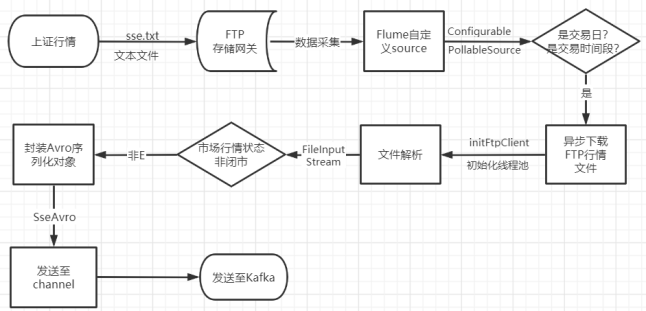

# 1- Apache AVRO

## 定义

avro是apache的一个子项目，是一个高性能的序列化数据传输框架，采用Json数据格式，数据结构丰富。

## 解决的问题

在海量数据传输过程中，能够提升数据传输性能

## 应用场景

接收数据，发送kafka：

（1）序列化数据传输 

​	只传输具体数据，不传输schema

​    原始样例：  {"name":"xiaoli","age":"20","address":"北京}

    avro数据传输样例: xiaoli,20,北京

（2）序列化存储

本身就是字节数据，省去了将数据转换成字节数据存储的操作

## 优点

- 高性能序列化数据传输
- **api友好**
- 采用通用数据交互格式：**json**
- **只传输具体数据，不传输schema**
- **数据结构丰富**
  - 8种基本类型：byte ,int ,float,double,boolean,null,string,long
  - 6种复杂类型：record(组合),map，union,fix，array等

> 项目中主要使用的复杂类型是record

## 复杂类型record介绍

定义一个avsc文件，通过 schema 定义数据结构：

~~~json
{ 
    "namespace":"cn.itcast.avro", //路径
    "name":"User", //类名称
    "type":"record" , //复杂数据类型,可以包含基本数据类型
    "fields":[
        {"name":"age","type":["int","null"]},
        {"name":"name","type":["string","null"]},
        {"name":"address","type":["string","null"]}
    ]
}
~~~

> 如果想使用avro,首先必须先定义一个avro的schema文件,定义的就是一个bean对象,
>
> 这个文件,需要后台编译,生成java bean

必选属性： (1)name:类名称

​                    (2) "type":"record",   =》具体的复杂类型名称                    

​                    (3)“fileds”   =》 包含具体的属性字段，可以包含多个，在这个数组里面，每一个字段的属性名称name和属性类型type,也是必须填写的。

可选择属性："namespace":"cn.itcast", =》 类路径（命名空间）

# 2- avro案例

## 编写schema文件

user.avsc

~~~json
{ 
    "namespace":"cn.itcast.avro", //路径
    "name":"User", //类名称
    "type":"record" , //复杂数据类型,可以包含基本数据类型
    "fields":[
        {"name":"age","type":["int","null"]},
        {"name":"name","type":["string","null"]},
         {"name":"address","type":["string","null"]}
    ]
}
~~~

> 属性字段类型，只能是小写

## 编译schema

有两种方式：

- maven编译

  

- 命令行

  - java -jar avro-tools-1.8.1.jar compile schema user.avsc ./

  

## 案例编写

~~~java
package cn.itcast.avro;

import org.apache.avro.file.DataFileReader;
import org.apache.avro.file.DataFileWriter;
import org.apache.avro.specific.SpecificDatumReader;
import org.apache.avro.specific.SpecificDatumWriter;

import java.io.File;
import java.io.IOException;

/**
 * demo案例:序列化和反序列化
 */
public class AvroDemo {

    /**
     * 开发步骤:
     * 1.构建对象(三种)
     * 2.封装数据
     * 3.序列化
     * 4.反序列化
     */
    public static void main(String[] args) throws IOException {
        // 1.构建对象(三种)
        User user = new User();
        //2.封装数据
        user.setName("唐三");
        user.setAddress("圣魂村");
        user.setAge(20);

        User user1 = new User("小舞", 20, "星斗大森林");

        User user2 = User.newBuilder()
                .setAge(20)
                .setName("唐浩")
                .setAddress("昊天宗")
                .build();

        //3.序列化
        //定义schema
//        SpecificDatumWriter<User> specificDatumWriter = new SpecificDatumWriter<>(User.class);
//        DataFileWriter<User> fileWriter = new DataFileWriter<>(specificDatumWriter);
//        //写文件演示
//        fileWriter.create(user.getSchema(),new File("avro.txt"));
//        //写数据到文件
//        fileWriter.append(user);
//        fileWriter.append(user1);
//        fileWriter.append(user2);
//        fileWriter.close();

        //反序列化
        //定义schema
        SpecificDatumReader<User> datumReader = new SpecificDatumReader<>(User.class);
        DataFileReader<User> res = new DataFileReader<>(new File("avro.txt"), datumReader);
        for (User user3 : res) {
            System.out.println("反序列数据:"+user3);
        }

        res.close();
    }

}

~~~

# 3- 项目中使用avro

## 3-1 深市采集数据流程

## 3-2 沪市采集数据流程

## 3-3 kafka消费数据流程	

- 注意：[**在消费kafka中的数据时，需要使用自定义的avro的反序列化工具**]()；

# 4- Avro总结

## 4-1 介绍  更牛逼的

- 是一个**高性能的序列化数据传输框架**，采用**Json数据格式**；
- 数据结构丰富：
  - 8种基本类型：byte ,int ,float,double,boolean,null,string,long
  - 6种复杂类型：record(组合),map，union,fix，array等

- 开发步骤

  - **编写schema文件**   （**avsc文件**）;

    - 必须字段信息  ： **name type  fields (name type)**

  - **编译schema；** 

    

- 优点：

  - **高性能序列化数据传输**
  - **api友好**
  - 采用通用数据交互格式：**json**
  - **只传输具体数据，不传输schema**
  - **数据结构丰富**
    - 8种基本类型：byte ,int ,float,double,boolean,null,string,long
    - 6种复杂类型：**record**(组合),map，union,fix，array等

  

- 缺点：
  - **使用avro需要自定义序列化和反序列化方法；**

