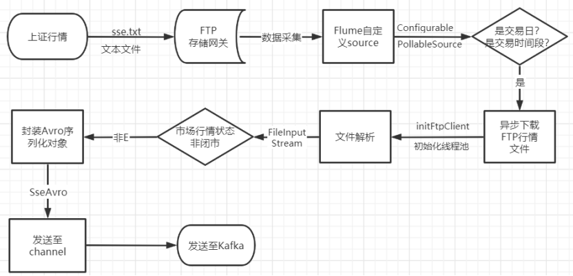
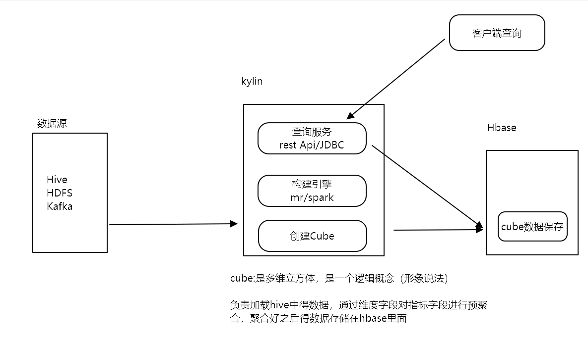

[TOC]


# 0- 逻辑架构图


​	

# 1- 技术架构之数据流程图


# 2- 项目的描述

``` properties
1-我最近做的XXX项目是基于XXX集团旗下XXX业务为了完成XXXX任务实现大数据平台
2-使用了什么技术，达到了什么业务目标，实现了什么指标
3-整个项目数据量多大，集群规模多大，目前项目效果如何
4-接下来跟您讲一讲整个项目架构
5-给您说一下我在项目中负责的点是什么，讲解一个具体的指标，让您更加了解我们的项目
6-整个项目中遇到的哪些难题，如何应对的策略
```

## 2-1 大概描述

​		股票证券实时行情系统是烽火为一个投资理财机构做的一个投资分析项目。主要是为了给投资者在做投资选择时有实际的数据作为基础，对于投资者来说有更直观的实时数据展示大大提高了可信度，以及更直观、方便去分析作出选择。


## 2-2 为什么有这个项目以及需求

​		这个项目的需求是投资机构的业务部门发起的，需要对股市行情交易数据做到实时的大屏监控和展示，该项目也属于监察预警体系的一部分，整体需求包括：预警规则管理，实时预警，历史预警，实时数据大屏展示；


## 2-3 项目体系架构

下面介绍一下该项目的整个体系架构，主要分为两个部分，**实时部分和离线部分**；


### 2-3-1 实时部分-数据采集：

我们都知道证券市场 沪深两大交易所，我们的数据源就是来自沪深两大交易所；


#### 2-3-1-1 沪市数据采集流程

- 沪市：

  沪市数据源是以文件的方式同步给我们，为了系统安全考虑，数据文件每秒发送到FTP服务器上，然后使用Flume 框架自定义source来数据采集，采集到的数据序列化到我们的kafka  的Topic sse 中；当然其中也做了一些过滤操作，比如是否为交易日？ 交易时间是否为闭市状态（9:30--11:30   ， 13:30 -- 15:00）？ 



#### 2-3-1-2 深市数据采集流程

- 深市：

  深市数据是直接通过socket 实时的发送数据，直接使用socket客户端程序接受socket包并封装数据序列化到kafka 的Topic szse 中。同样做了一些过滤操作，比如是否为交易日？ 交易时间是否为闭市状态（9:30--11:30   ， 13:30 -- 15:00）？ 


#### 2-3-2-1 实时数据分析

基于Flink框架去消费kafka中的数据，然后按照各大指标去统计分析，比如：个股、指数、板块、实时预警指标；而个股、指数、板块等大指标下还分有更小的业务，比如：秒级行情，分时行情，K线，数据备份；

- **秒级行情最终的数据保存在Hbase中**；

  - 秒级行情在大屏中只是滚动显示一些简单的数据比如 交易时间-当前交易价-最高价-最低价-换手量等等；
  - 秒级行情中没有复杂的业务逻辑计算，且单个证券5s中保留一条数据， 保留的数据量非常庞大；
  - 如：10000支证券每分钟10000*12 = 120000条数据；1天：120000 * 60 * 4 = 2880w条数据； 一周(5天): 2880w * 5 = 1.44亿条数据； 
  - 数据量非常大 + 无复杂逻辑计算 + 亚秒级实时查询 就使用的HBase 数据库；

  

- **分时行情数据保存在Druid中**；

  - 分时行情数据根据业务分析需要展示很多指标信息，主要是为了做各种指标统计报表、趋势图等，而这些指标统计需要一些简单的SQL 逻辑计算后获取。比如某个指标的topN；
  - 数据量： 如果10000支证券，每分钟保留一条数据；  1天： 1w * 60 * 4 = 240w条数据；3个月： 240 * 60 天 (3个月交易日大概就60天) = 1.44亿条数据；
  - 数据量大 + 简单的业务逻辑计算 + 亚秒级实时查询  我们选择了Druid；
  - Flink 消费kafka中的数据进行实时数仓处理,并基于MapState技术做有状态计算，得到当前分钟的成交量 和 成交金额；并基于**侧边流**的技术将深市与沪市的数据分流生成到kafka中；
    - **分时成交量  = (当前分钟的总成交量 - 上一分钟的总成交量)**
    - **分时成交金额 = (当前分钟的总成交金额 - 上一分钟的总成交金额)**
  - 最后利用ApacheDruid的摄取进程去摄取kafka中的数据存储到Druid数据中；
  - Druid 最大的优点就是做了预聚合的功能，典型的空间换时间的思想；
  - 索引组件 (overload、middleManager) : 摄取数据 创建/销毁表、segment 
  - 存储组件(coordinator、historial) : 数据的存储、删除 按照 chunk 时间范围存储，每个segment包含时间列-指标列-维度列；
  - 查询组件(router、broker)：broker是一个查询服务，**接收查询请求，将结果数据返回给客户端**;

  

  

  

  

- **分时行情数据备份保存在HDFS中**；

  - 就是将分时行情在HDFS中做一个备份工作即可，这个很简单；

- **涨幅榜**；

  - 涨幅榜的数据也是每分钟保存一条数据，保存在Druid中；
  - 计算指标有 涨跌、涨跌幅、振幅；

  ``` properties
  今日涨跌=当前价-前收盘价
  今日涨跌幅（%）=（当前价-前收盘价）/ 前收盘价 x 100%
  今日振幅 =（当日最高点的价格－当日最低点的价格）/昨天收盘价 × 100%
  ```

  

- **K线数据保存在Mysql中**；

  - K 线分为：日K、周K、月K 等；
  - 数据量：如10000支证券,1年 ：1w  * 20 * 12 = 240w条数据；
  - 数据量不大 ， 可以做复杂的逻辑查询比如：各行业务、指标的报表 需要使用SQL各种关联查询；
  - 数据不大 + 复杂的业务逻辑查询 使用Mysql数据库；
  - 日K 比较简单，关键是周K 和 月K 比较复杂， 一些数据需要如何获取；需要将老数据线查询出来缓存到map中，做比较或者累加计算后更新数据再replace 到数据库中；
    - 前收盘价 ： 取同类型K线小于当前日期的最大一个交易日的收盘价
    - 开盘价 ：取当前周期起始日开盘价  （本周或本月第一个交易日的开盘价）
    - **最高价**：取当前周期日K线最大一个最高价 （本周或本月最高价）
    - **最低价**：取当前周期日K线小一个最低价（本周或本月最低价）
    - 收盘价：取当前周期最新价格（本周或本月最新价）
    - **成交量、成交金额**：当前周期类累加；
    - **均价**：周期内成交金额/成交量；

  

- **比较特殊的是板块业务**；

  - 非常复杂， 复杂在需要使用离线中的数据去做计算。计算公式也非常复杂；

  ​	以行业板块为例，需要计算某个行业中所有的个股数据，也就说所有计算的个股必须在板块个股对应表中存在；该表是离线部分每天会更新一次；先将板块个股对应关系表的信息缓存在板块个股列表Map中，在实时窗口计算的时候去遍历板块个股列表，获取板块名称、流通股本、个股代码、前一日板块流通市值；再从实时个股数据中获取事件时间、交易日期、开/收盘价、成交量、金额等信息；

  其中有很多比较复杂的计算公式：

  - 个股流通市值=个股流通股本*个股价格；
  - 当前板块以**开盘价**计算的总流通市值 : 就是该板块下所有个股**开盘价**计算出的总流通市值；
  - 当前板块以**收盘价**计算的总流通市值：就是该板块下所有个股**收盘价**计算出的总流通市值；
  - 板块下所有个股**开盘价**计算出的总流通市值 = sum(个股**开盘价** * 个股流通股本)
  - 板块下所有个股**收盘价**计算出的总流通市值 = sum(个股**收盘价** * 个股流通股本)
  - 板块[**开盘价格**]()=板块前收盘价*当前板块以开盘价计算的总流通市值/当前板块前一交易日板块总流通市值;
  - 板块[**当前价格**]()=板块前收盘价*当前板块以收盘价计算的总流通市值/当前板块前一交易日板块总流通市值;

  

  上面所使用到的个股流通股本、前一日板块流通市值是在离线部分的表中；

  


#### 2-3-2-2 实时预警

基于Flink的CEP模块，实现了实时预警的功能；

涨跌幅、振幅、换手率等指标的预警功能，比如实时计算出某个证券的涨跌幅 达到了10% ， 那么就会触发告警系统，邮件告警、短信通知，涨停或者跌停操作；当然我们这个指标对比值是保存在redis当中的；

Flink CEP 模块 主要有三部分： 

1- 模式匹配 ，对比阈值；

2- 将模式作用到流数据中； 

3- 查询匹配模式的数据，如果有匹配上模式的数据，触发告警系统；


### 2-3-3 离线部分

- 为什么有离线部分呢？ 主要有两个原因：
  - 1- 项目如果第一次上线，需要对历史数据做一次完整的数据处理生成历史数据的个股和指数K线图；
  - 2- 板块业务计算的时候需要每天更新板块个股关系表；因为个股是每天可能新增或者删除的；


#### 2-3-3-1 离线数据分析

- 离线部分是采用的经典分层架构： ODS层，DW层 ， DM层；

- 

  - ODS层

    - 保持业务数据原貌，记录历史数据，可以视为数据的备份。

    ``` properties
    ODS层	交易日历表				itcast_quot_ods	tra_tcc_date
    ODS层	板块基本信息表			   itcast_quot_ods	pd_sector_base_info
    ODS层	万德数据证券基础信息	     itcast_quot_ods	pd_wind_base_info
    ODS层	个股证券基本信息	      itcast_quot_ods	pd_stock_sec_info
    ODS层	上证个股日交易信息表		 itcast_quot_ods	tra_stock_day_info
    ODS层	深证个股日交易信息表		 itcast_quot_ods	tra_stock_day_info_sz
    ODS层	上证指数日交易信息表		 itcast_quot_ods	tra_index_day_info
    ODS层	深证指数日交易信息表		 itcast_quot_ods	tra_index_day_info_sz
    ODS层	指数日流通基本信息		  itcast_quot_ods	pd_index_sec_info
    ```

    

  - DW层

    - 从应用入手建设可能比较片面（尤其是一些公共主题，如证券、账户等），建议根据业务梳理概念数据模型，将ODS层明细数据的简单**加工和整合**放到本层（不需要加工整合的保留在ODS层），逐步扩充，提炼共性，存放细粒度或粗粒度的维度组合及其指标值。

    ``` properties
    DW层	板块个股对应基本信息表	itcast_quot_dw	sum_sector_stock_base_info
    DW层	沪市每日证券收盘明细表	itcast_quot_dw	sum_stock_close_dtl_day
    DW层	深市每日证券收盘明细表	itcast_quot_dw	sum_stock_close_dtl_day_sz
    DW层	沪市指数日收盘明细表	itcast_quot_dw	sum_index_close_dtl_day
    DW层	深市指数日收盘明细表	itcast_quot_dw	sum_index_close_dtl_day_sz
    ```

    

  - DM层

    - 根据具体应用建设，对于明细查询类应用直接访问ODS或基础层，对于汇总类应用如果DW层能满足（无论字段组合或者查询性能）直接访问数据仓库层。当性能上无法满足时，需要通过ODS、DW层预先将数据加工好。

    ``` properties
    DM层	板块成分股对应关系表	itcast_quot_dm	app_sec_sector_stock
    DM层	个股K线表	itcast_quot_dm	app_sec_quot_stock_kline
    DM层	指数K线表	itcast_quot_dm	app_sec_quot_index_kline
    ```

    

- 个人在意的表--板块个股对应关系表-交易日历表

  - 基于 板块基本信息表、万德数据证券基础信息 、个股证券基本信息 经过过滤、清洗、转换后生成最终的板块个股对应关系表；
  - 板块个股对应关系表中做主要是用于在板块业务中计算一些数据使用
    - 个股流通股本；
    - 前一交易日个股流通市值；
    - 前一交易日板块总流通市值；
  - 板块业务中计算公式

  ``` properties
  板块下所有个股 开盘价 计算出的总流通市值 = sum(个股 开盘价 * 个股流通股本)
  板块下所有个股 收盘价 计算出的总流通市值 = sum(个股 收盘价 * 个股流通股本)
  板块 开盘价格=板块前收盘价 * 当前板块以开盘价计算的总流通市值 / 当前板块前一交易日板块总流通市值;
  板块 当前价格=板块前收盘价 * 当前板块以收盘价计算的总流通市值 / 当前板块前一交易日板块总流通市值;
  ```


#### 2-3-3-2 离线预警

- 为什么会有离线预警呢？
  - 查询一定时间范围内的最大成交量和成交金额，通过对数据分析，如果数据量过大，可以根据行情数据追踪查询是否有买家打乱买卖股票，进行投机操作；
  - 这个离线预警功能就是为了提前进行股市监控作业；
  - 比如1：**换手率** 某一段时期内的**成交量/发行总股数×100%** ；
    - 70%的股票的换手率基本在3%以下；
    - 当一支股票的换手率在3%——7%之间时，该股进入相对活跃状态；
    - 7%——10%之间时，则为强势股的出现，股价处于高度活跃当中。（广为市场关注）
  - 比如2：振幅   **(max(最高点位)-min(最低点位))/期初前收盘点位*100%**
    - 它在一定程度上表现股票的活跃程度；
    - 股票振幅分析有**日振幅分析、周振幅分析、月振幅分析**等等类型；

- 项目中离线预警数据来源于实时部分，在实时部分已经将各种指标的数据备份到了HDFS中，所以就可以将HDFS中的数据加载到Hive 中去，做离线的海量数据分析；

- 如 **周振幅、月振幅  ，周换手率、月换手率** 等等。

- 由于前端Web直接查询Hive 运算速度非常慢，

  所以使用Kylin做聚合运算，将预聚合好的数据保存到HBase 中，Web前端就可以定时查询Kylin中的数据实现离线预警的功能。

  Kylin 是一个以空间换时间的思想: 从Hive中将数据导入Kylin--> 创建模型-->创建Cube-->构建Cube;最终将数据保存在Hbase中，而查询的时候直接查Hbase中的数据即可；

  Kylin会将所需要的维度指标以构建cube的方式提前预计算好，预聚合好的数据保存在HBase 中；

  
  
  


## 2-4 个人项目中负责的任务

- 项目初期参加架构设计和讨论；
- 使用Flume 框架自定义source采集FTP中的数据文件，采集到的数据序列化到我们的kafka；
- 后期新增了avro序列化传输框架,需要自定义实现序列化和反序列功能;
- 基于Flink框架实现实时数据流ETL工作，按照各大指标去统计分析，然后Sink到不同的数据库中；
- 基于Flink框架中CEP模块实现实时预警功能；
- 基于Kylin优化离线预警功能；
- 与java 后台对接，封装一些HBase、Kylin查询接口给java后台使用；


## 2-5 开发周期 人员

一期项目

周期: 一年左右；

负责模块人员: 15人左右( 4-5的大数据  2 - 3的java后台 2个运维 2个前端 2个测试)；

总人数：差不多上百号人；


## 2-6 服务器配置

128G 内存  ；  10 * 1.2T

一共30台左右；

# 3- 项目中的难点以及解决策略

- 1- 数据倾斜

- 2- 为了提升传输性能，使用了avro序列化传输框架；

- 3- 离线预警功能 由 Hive 转成 Kylin;

- 4- Kylin的一些剪枝优化；

  - Cube 碎片管理

    Segment 合并(手动或者自动)

    Segmengt 删除(手动或者自动)

  - Cuboid剪枝优化

    使用衍生维度

    聚合组

    强制维度  :	 cuboid直接减半

    层级维度	:	如：年月日；国家省份城市。 如果是N维度使用层级 ，cuboid从2^n 减到 n+1	

    联合维度	: 	多个维度要么同时存在，要么同时都没有；如果N个维度使用联合，cuboid = 1；

     

     

# 4- 项目的亮点

- 1- 由于Flume官方没有集成FTP数据的采集，我们采用了Flume自定义souce源去采集FTP 中的数据；
- 2- 在海量数据传输过程中，为了能够提升数据传输性能。我们使用了avro序列化数据传输框架；
  - 1- 高性能的传输框架；
  - 2- json数据格式；
  - 3- 数据结构丰富；record(组合),map，union,fix，array
  - 4- 最主要的是**只传输具体数据，不传输schema**
- 3- 基于Flink框架对实时数据分析，在Flink中完成数据处理、清洗、格式转换等有状态计算操作；
  - Flink是一个真正的基于事件时间处理数据的框架 
  - 实现了低延迟 和 高吞吐的平衡；
  - 能保证end -to -end 精确一致性（offset + state + checkpoint + 两阶段事务提交）；
- 4- 基于Flink框架中的CEP 模块实现实时预警功能；
  - 继承了 Flink **高吞吐**的特点
  - 查询是静态的，数据是动态的，满足实现和连续查询的需求
  - 擅长解决跨事件的匹配
  - Api友好；
  - 缺点：无法动态更新规则（痛点）
- 5- 基于Kylin框架实现离线预警功能，
  - 由于hive离线处理速度太慢，有期新增了Kylin技术；
  - Kylin是将先将数据进行[**预处理**]()，将预处理的结果放在HBase中。效率很高
  - Cuboid剪枝优化 可以大量的处理数据冗余的问题
    - 强制维度  :	 cuboid直接**减半**
    - 层级维度	:	如：年月日；国家省份城市。 如果是N维度使用层级 ，cuboid从**2^n 减到 n+1**	
    - 联合维度	: 	多个维度要么同时存在，要么同时都没有；如果**N个维度使用联合，cuboid = 1**；


# 5- 项目可优化点


