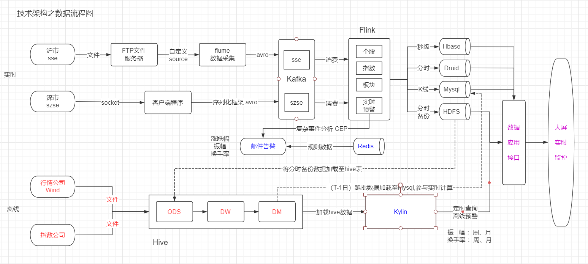
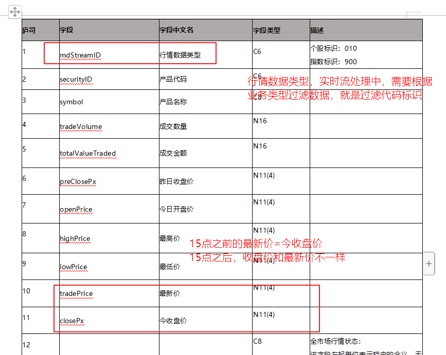
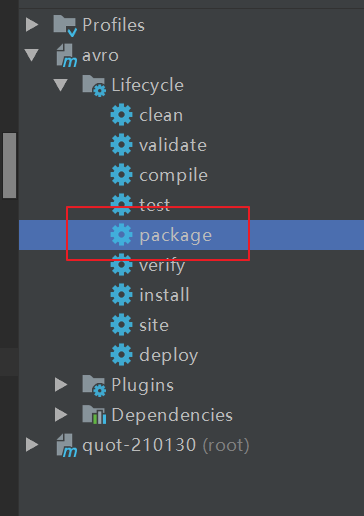

# 第一章 项目介绍和数据采集

# 课程安排

- 项目的整体技术架构
  - 选型
- 整体的数据流程（掌握）
- 数据采集
  - 深市数据采集
    - 序列化数据传输框架avro-字节
    - 发送kafka(整合)(掌握)

# 学习目标

- 掌握数据流程
- 掌握数据采集模块avro的使用
- 掌握与kafka的整合

# 业务模块

- 数据采集
- 数据处理
  - 离线
  - 实时
- 预警
  - 实时
  - 离线
- 应用数据展示

# 技术选型

- 数据采集

  - 实时：flume,avro,socket
  - 离线：sqoop(把rds(rdbms)数据同步到hdfs)

- 消息队列

  - kafka

- 计算引擎

  - flink

- 存储平台

  - 业务：秒级，分时，K线行情，历史数据

  - 秒级行情

    - hbase(业务简单,数据量大,查询性能好(亚秒级))

  - 分时行情

    - apache druid(业务较复杂,数据量大,查询性能好(亚秒级))

  - K线

    - # mysql(数据量小,支持复杂报表分析)

  - 历史数据存储

    - HDFS(Hive)

- 数据应用服务

  - SpringBoot

- 大屏展示

  - VUE

  

# 总体数据流程

# 数据采集

## 接口文档注意事项

## Apache Avro

### 定义

avro是apache的一个子项目，是一个高性能的序列化数据传输框架，采用Json数据格式，数据结构丰富。

### 解决的问题

在海量数据传输过程中，能够提升数据传输性能

### 应用场景

接收数据，发送kafka：

（1）序列化数据传输 

​	只传输具体数据，不传输schema

​    原始样例：  {"name":"xiaoli","age":"20","address":"北京}

    avro数据传输样例: xiaoli,20,北京

（2）序列化存储

本身就是字节数据，省去了将数据转换成字节数据存储的操作

### 优点

- 高性能序列化数据传输
- api友好
- 采用通用数据交互格式：json
- 数据结构丰富
  - 8种基本类型：byte ,int ,float,double,boolean,null,string,long
  - 6种复杂类型：record(组合),map，union,fix，array等

> 项目中主要使用的复杂类型是record

### 复杂类型record介绍

定义一个avro文件，通过 schema 定义数据结构：

~~~json
{ 
    "namespace":"cn.itcast.avro", //路径
    "name":"User", //类名称
    "type":"record" , //复杂数据类型,可以包含基本数据类型
    "fields":[
        {"name":"age","type":["int","null"]},
        {"name":"name","type":["string","null"]},
        {"name":"address","type":["string","null"]}
    ]
}
~~~

> 如果想使用avro,首先必须先定义一个avro的schema文件,定义的就是一个bean对象,
>
> 这个文件,需要后台编译,生成java bean

必选属性： (1)name:类名称

​                    (2) "type":"record",   =》具体的复杂类型名称                    

​                    (3)“fileds”   =》 包含具体的属性字段，可以包含多个，在这个数组里面，每一个字段的属性名称name和属性类型type,也是必须填写的。

可选择属性："namespace":"cn.itcast", =》 类路径（命名空间）

## avro案例

### 编写schema文件

user.avsc

~~~json
{ 
    "namespace":"cn.itcast.avro", //路径
    "name":"User", //类名称
    "type":"record" , //复杂数据类型,可以包含基本数据类型
    "fields":[
        {"name":"age","type":["int","null"]},
        {"name":"name","type":["string","null"]},
         {"name":"address","type":["string","null"]}
    ]
}
~~~

> 属性字段类型，只能是小写

### 编译schema

有两种方式：

- maven编译

  

- 命令行

  - java -jar avro-tools-1.8.1.jar compile schema user.avsc ./

  

### 案例编写

~~~java
package cn.itcast.avro;

import org.apache.avro.file.DataFileReader;
import org.apache.avro.file.DataFileWriter;
import org.apache.avro.specific.SpecificDatumReader;
import org.apache.avro.specific.SpecificDatumWriter;

import java.io.File;
import java.io.IOException;

/**
 * demo案例:序列化和反序列化
 */
public class AvroDemo {

    /**
     * 开发步骤:
     * 1.构建对象(三种)
     * 2.封装数据
     * 3.序列化
     * 4.反序列化
     */
    public static void main(String[] args) throws IOException {
        // 1.构建对象(三种)
        User user = new User();
        //2.封装数据
        user.setName("唐三");
        user.setAddress("圣魂村");
        user.setAge(20);

        User user1 = new User("小舞", 20, "星斗大森林");

        User user2 = User.newBuilder()
                .setAge(20)
                .setName("唐浩")
                .setAddress("昊天宗")
                .build();

        //3.序列化
        //定义schema
//        SpecificDatumWriter<User> specificDatumWriter = new SpecificDatumWriter<>(User.class);
//        DataFileWriter<User> fileWriter = new DataFileWriter<>(specificDatumWriter);
//        //写文件演示
//        fileWriter.create(user.getSchema(),new File("avro.txt"));
//        //写数据到文件
//        fileWriter.append(user);
//        fileWriter.append(user1);
//        fileWriter.append(user2);
//        fileWriter.close();

        //反序列化
        //定义schema
        SpecificDatumReader<User> datumReader = new SpecificDatumReader<>(User.class);
        DataFileReader<User> res = new DataFileReader<>(new File("avro.txt"), datumReader);
        for (User user3 : res) {
            System.out.println("反序列数据:"+user3);
        }

        res.close();
    }

}

~~~

## 深市数据采集

### 创建topic

~~~shell
##启动kafka
bin/kafka-server-start.sh config/server.properties >/dev/null 2>&1 &
~~~

创建topic

~~~shell
bin/kafka-topics.sh --create --zookeeper node01:2181 --replication-factor 1 --partitions 1 --topic szse
~~~

消费topic

~~~shell
 bin/kafka-console-consumer.sh --topic szse --bootstrap-server node01:9092
~~~

### 客户端代码编写

~~~java
package cn.itcast.szse;

import cn.itcast.avro.SzseAvro;
import cn.itcast.kafka.KafkaPro;

import java.io.DataInputStream;
import java.io.InputStream;
import java.net.Socket;
import java.util.Date;

/**
 * 客户端接收服务端的数据
 */
public class SocketClient {
    //1.创建main方法
    public static void main(String[] args) throws Exception {
        //2.建立socket连接，获取流数据
        Socket socket = new Socket("localhost", 4444);
        InputStream ins = socket.getInputStream();
        DataInputStream result = new DataInputStream(ins);

        KafkaPro kafkaPro = new KafkaPro();
        while (true){
            String str = result.readUTF();
            //3.解析行数据，数据转换
            //创建avsc文件,编译生成avro bean对象,并封装数据到bean对象
            //解析字符串数据,并封装到avro
            SzseAvro szseAvro = transfer(str);
            System.out.println(szseAvro);
            //4.发送kafka
            kafkaPro.sendData("szse",szseAvro);
        }
    }

    private static SzseAvro transfer(String str) {
        //900|399361|国证商业|13794097|37392971|4674.72|4705.73|
        // 5646.88|3764.58|4164.51|4164.51|T11|1621346291167
        String[] arr = str.split("\\|");
        SzseAvro szseAvro = new SzseAvro();
        szseAvro.setMdStreamID(arr[0].trim());
        szseAvro.setSecurityID(arr[1].trim());
        szseAvro.setSymbol(arr[2].trim());
        szseAvro.setTradeVolume(Long.valueOf(arr[3].trim()));
        szseAvro.setTotalValueTraded(Long.valueOf(arr[4].trim()));
        szseAvro.setPreClosePx(Double.valueOf(arr[5].trim()));
        szseAvro.setOpenPrice(Double.valueOf(arr[6].trim()));
        szseAvro.setHighPrice(Double.valueOf(arr[7].trim()));
        szseAvro.setLowPrice(Double.valueOf(arr[8].trim()));
        szseAvro.setTradePrice(Double.valueOf(arr[9].trim()));
        szseAvro.setClosePx(Double.valueOf(arr[10].trim()));
        szseAvro.setTradingPhaseCode("T01");//实时阶段标志,表示正在交易期间
        szseAvro.setTimestamp(new Date().getTime()); //事件时间,后面流处理程序,划分时间窗口使用
        return szseAvro;
    }

}
~~~

> SzseAvro对象，编译文件，请参见讲义：
>
> ~~~
> 7.4.4.1.新建avsc文件
> ~~~

### kafka生产者对象

~~~java
package cn.itcast.kafka;

import cn.itcast.avro.AvroSerializer;
import org.apache.avro.specific.SpecificRecordBase;
import org.apache.kafka.clients.producer.KafkaProducer;
import org.apache.kafka.clients.producer.ProducerRecord;
import org.apache.kafka.common.serialization.StringSerializer;

import java.util.Properties;

/**
 * 1.创建类，泛型参数继承avro基类
 * 2.设置生产者参数
 * 3.自定avro序列化
 * 4.添加发送数据方法
 */
public class KafkaPro <T extends SpecificRecordBase> {
    KafkaProducer<String, T> producer = new KafkaProducer<>(getPro());

    public Properties getPro(){
        Properties properties = new Properties();
        properties.setProperty("bootstrap.servers","node01:9092");
        properties.setProperty("acks","1");
        properties.setProperty("retries","0");
        properties.setProperty("batch.size","16384");
        properties.setProperty("linger.ms","1");
        properties.setProperty("buffer.memory","33554432");
        properties.setProperty("key.serializer", StringSerializer.class.getName());
        properties.setProperty("value.serializer", AvroSerializer.class.getName());
        return properties;
    }

    /**
     * 发送数据到kafka
     * @param topic
     * @param data
     */
    public void sendData(String topic,T data){
        producer.send(new ProducerRecord<>(topic,data));
    }
}

~~~

### 自定义序列化

~~~java
package cn.itcast.avro;

import org.apache.avro.io.BinaryEncoder;
import org.apache.avro.io.EncoderFactory;
import org.apache.avro.specific.SpecificDatumWriter;
import org.apache.avro.specific.SpecificRecordBase;
import org.apache.kafka.common.serialization.Serializer;

import java.io.ByteArrayOutputStream;
import java.io.IOException;
import java.util.Map;

/**
 * 开发步骤：
 *  1.泛型参数继承avro基类 SpecificRecordBase ，实现序列化接口 Serializer
 *  2.重写序列化方法 serialize
 *  3.新建字节数组输出流对象
 *  4.获取二进制对象BinaryEncoder
 */
public class AvroSerializer<T extends SpecificRecordBase> implements Serializer<T> {
    @Override
    public void configure(Map<String, ?> configs, boolean isKey) {

    }

    @Override
    public byte[] serialize(String topic, T data) {

        // 设置好schema 约束对象
        SpecificDatumWriter<T> writer = new SpecificDatumWriter<>(data.getSchema());

        // 定义一个输出流程对象
        ByteArrayOutputStream bos = new ByteArrayOutputStream();
        // 通过工厂对象 获取二进制编码对象；
        BinaryEncoder binaryEncoder = EncoderFactory.get().directBinaryEncoder(bos, null);
        try {

            // 通过write方法，会将avro类型数据，编码成字节流，数据会存储到bos字节流输出对象中
            writer.write(data, binaryEncoder);
        } catch (IOException e) {
            e.printStackTrace();
        }

        return bos.toByteArray();
    }

    @Override
    public void close() {

    }
}

~~~

