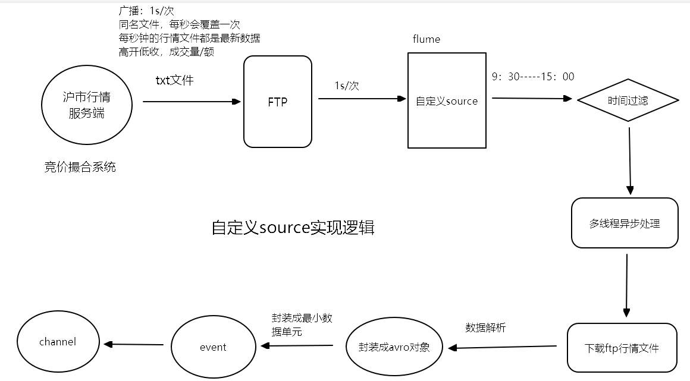
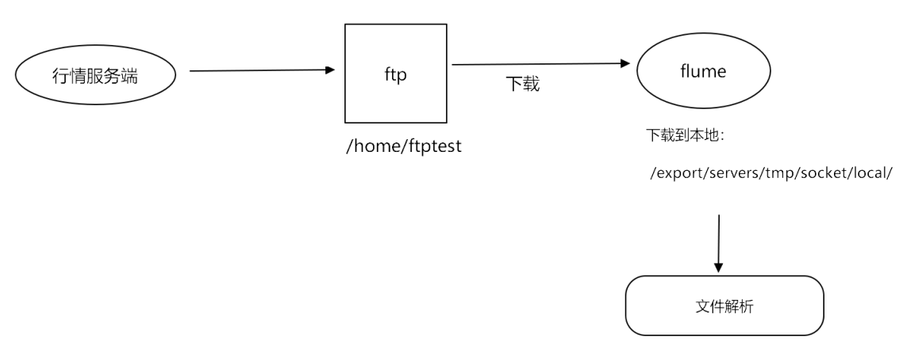
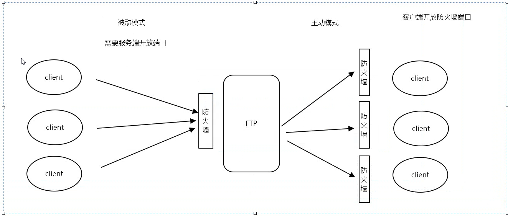

# 第2章 数据业务开发


# 课程安排

- 沪市行情数据采集
  - 从ftp采集数据->flume自定义source
- ETL数据开发
  - hive数据etl加工
    - sql
    - sqoop
    - 调度(oozie)


# 学习目标

- 掌握flume自定义source的使用
- 数据加工(ETL): ODS到DW层和DW到DM层


# 沪市数据采集

## 采集流程




## 下载FTP文件数据流



## FTP主动模式和被动模式




## Kafka命令

创建topic

~~~properties
 bin/kafka-topics.sh --create --partitions 1 --replication-factor 1 --topic sse --zookeeper node01:2181
~~~

消费topic

~~~properties
bin/kafka-console-consumer.sh --topic sse --bootstrap-server node01:9092
~~~

启动flume

~~~properties
 bin/flume-ng agent -c conf -f conf/sse-ftp-source.conf -n client -Dflume.root.logger=INFO,console
~~~


## 配置文件

sse-ftp-source.conf

> 需要将此文件上传至虚拟机： /export/servers/flume-1.6.0-cdh5.14.0-bin/conf

~~~shell
client.sources = ftp
client.sinks = s1
client.channels = ch1

#source
#自定义source接口类
client.sources.ftp.type = cn.itcast.sse.SseQuotSource
#FTP连接参数
#主机名
client.sources.ftp.host = node01
#端口
client.sources.ftp.port = 21
#用户名
client.sources.ftp.userName = ftptest
#密码
client.sources.ftp.password = ftptest
#文件路径
client.sources.ftp.ftpDirectory = /home/ftptest
#文件名
client.sources.ftp.fileName = sse.txt
#本地文件路径
client.sources.ftp.localDirectory = /export/servers/tmp/socket/local
client.sources.ftp.delay = 1000

#线程池参数
#核心连接数
client.sources.ftp.corePoolSize = 50
#最大连接数
client.sources.ftp.maxPoolSize = 100
#线程生存时间
client.sources.ftp.keepAliveTime = 600
#阻塞队列大小
client.sources.ftp.capacity = 1000

client.sources.ftp.channels = ch1
#channels save to memory
#channel采用内存模式
client.channels.ch1.type = memory
client.channels.ch1.capacity = 1000
client.channels.ch1.transactionCapacity = 1000

#channels save to file
#channel采用文件模式
#client.channels.ch1.type = file
#client.channels.ch1.capacity = 1000000
#client.channels.ch1.write-timeout = 1
#client.channels.ch1.transactionCapacity = 612000
#client.channels.ch1.maxFileSize = 2146435071
#client.channels.ch1.minimumRequiredSpace = 524288000
#client.channels.ch1.dataDirs = /tmp/dataDirs
#client.channels.ch1.checkpointDir = /tmp/checkpoint

#sinks
client.sinks.s1.channel = ch1
#写入kafka的类型
client.sinks.s1.type = org.apache.flume.sink.kafka.KafkaSink
#kafka topic
client.sinks.s1.kafka.topic = sse
client.sinks.s1.kafka.bootstrap.servers = node01:9092
client.sinks.s1.kafka.flumeBatchSize = 50
#ack机制
client.sinks.s1.kafka.producer.acks = 1
~~~

## 自定义Source

### SseQuotSource全部代码

~~~java
package cn.itcast.sse;

import cn.itcast.avro.SseAvro;
import cn.itcast.until.TimeUtil;
import org.apache.avro.io.BinaryEncoder;
import org.apache.avro.io.EncoderFactory;
import org.apache.avro.specific.SpecificDatumWriter;
import org.apache.commons.net.ftp.FTPClient;
import org.apache.commons.net.ftp.FTPFile;
import org.apache.commons.net.ftp.FTPReply;
import org.apache.flume.Context;
import org.apache.flume.Event;
import org.apache.flume.EventDeliveryException;
import org.apache.flume.PollableSource;
import org.apache.flume.channel.ChannelProcessor;
import org.apache.flume.conf.Configurable;
import org.apache.flume.event.EventBuilder;
import org.apache.flume.source.AbstractSource;

import java.io.*;
import java.util.Date;
import java.util.concurrent.ArrayBlockingQueue;
import java.util.concurrent.ThreadPoolExecutor;
import java.util.concurrent.TimeUnit;


/**
 * 在 cn.itcast.sse目录下创建SseQuotSource接口
 * （1）实现目标
 * 使用flume自定义source从FTP服务器采集实时行情文本文件
 * （2）实现步骤
 * 1.实现自定义source接口
 * 2.初始化参数（初始化source参数和线程池）
 * 3.判断是否是交易时间段
 * 4.异步处理
 * 5.设置延时时间
 */
public class SseQuoTSource extends AbstractSource implements Configurable, PollableSource {
    private String host            ;
    private Integer port           ;
    private String userName        ;
    private String password        ;
    private String ftpDirectory    ;
    private String fileName        ;
    private String localDirectory  ;
    private Integer delay          ;
    private Integer corePoolSize   ;
    private Integer maxPoolSize    ;
    private Integer keepAliveTime  ;
    private Integer capacity       ;

    private ThreadPoolExecutor threadPoolExecutor;
    /**
     *
     * @return
     * @throws EventDeliveryException
     */
    @Override
    public Status process() throws EventDeliveryException {
        // 3- 判断是否是交易时间段
        long currentTime = new Date().getTime();

        if (currentTime < TimeUtil.endTime && currentTime > TimeUtil.startTime){
            // 业务逻辑处理
            // 4- 异步处理  异步下载文件
            threadPoolExecutor.execute(new AsyncTask());
        }

        return null;
    }

    /**
     * 初始化参数（初始化source参数和线程池）
     * @param context
     */
    @Override
    public void configure(Context context) {
        host           = context.getString("host");
        port           = context.getInteger("port");
        userName       = context.getString("userName");
        password       = context.getString("password");
        ftpDirectory   = context.getString("ftpDirectory");
        fileName       = context.getString("fileName");
        localDirectory = context.getString("localDirectory");
        delay          = context.getInteger("delay");
        corePoolSize   = context.getInteger("corePoolSize");
        maxPoolSize    = context.getInteger("maxPoolSize");
        keepAliveTime  = context.getInteger("keepAliveTime");
        capacity       = context.getInteger("capacity");
        /**
         * 创建线程池
         * int corePoolSize,
         * int maximumPoolSize,
         * long keepAliveTime,
         * TimeUnit unit,
         * BlockingQueue<Runnable> workQueue,
         * ThreadFactory threadFactory,
         * RejectedExecutionHandler handler
         */
        threadPoolExecutor = new ThreadPoolExecutor(corePoolSize,
                maxPoolSize,
                keepAliveTime,
                TimeUnit.SECONDS,
                new ArrayBlockingQueue<>(capacity)
        );

    }

    /**
     * 开发步骤：
     * 1.创建异步线程task
     * 2.下载行情文件
     * 3.解析并发送数据
     *   数据转换成avro
     *   数据序列化
     * 4.发送数据到channel
     */
    private class AsyncTask implements Runnable {
        @Override
        public void run() {
            // 下载行情文件
            download();

            // 解析并封装数据再发送
            try {
                BufferedReader bufferedReader = new BufferedReader(new InputStreamReader(new FileInputStream(new File(localDirectory + "/" + fileName))));

                String str;
                int i = 0 ; // 文件行下标
                while (null != (str = bufferedReader.readLine())){
                    String[] arrStr = str.split("\\|");


                    if ( 0 == i ){
                        // 首行处理
                        // 获取行情标识字段
                        String status = arrStr[8];

                        if (status.startsWith("E")){
                            break;
                        }

                    }else {
                        // 非首行

                        // 数据转换成avro对象
                        SseAvro sseAvro = parseAvro(arrStr);


                        // 序列化
                        byte[] bytes = serializer(sseAvro);

                        // 封装成event
                        Event event = EventBuilder.withBody(bytes);

                        // 发送数据到channel
                        ChannelProcessor channelProcessor = getChannelProcessor();
                        channelProcessor.processEvent(event);
                    }
                    i++;
                }


            } catch (Exception e) {
                e.printStackTrace();
            }

        }

        /**
         * 序列化转换
         * @param sseAvro
         * @return
         */
        private byte[] serializer(SseAvro sseAvro) {
            // 定义Schema
            SpecificDatumWriter<SseAvro> writer = new SpecificDatumWriter<>(SseAvro.class);

            // 获取二进制编码对象
            ByteArrayOutputStream bos = new ByteArrayOutputStream();
            BinaryEncoder binaryEncoder = EncoderFactory.get().directBinaryEncoder(bos, null);

            try {
                // 将avro对象编码成字节输出流
                writer.write(sseAvro,binaryEncoder);
            } catch (IOException e) {
                e.printStackTrace();
            }
            return  bos.toByteArray();
        }

        private SseAvro parseAvro(String[] arr) {
            SseAvro sseAvro = new SseAvro();
            sseAvro.setMdStreamID(arr[0].trim());
            sseAvro.setSecurityID(arr[1].trim());
            sseAvro.setSymbol(arr[2].trim());
            sseAvro.setTradeVolume(Long.valueOf(arr[3].trim()));
            sseAvro.setTotalValueTraded(Long.valueOf(arr[4].trim()));
            sseAvro.setPreClosePx(Double.valueOf(arr[5].trim()));
            sseAvro.setOpenPrice(Double.valueOf(arr[6].trim()));
            sseAvro.setHighPrice(Double.valueOf(arr[7].trim()));
            sseAvro.setLowPrice(Double.valueOf(arr[8].trim()));
            sseAvro.setTradePrice(Double.valueOf(arr[9].trim()));
            sseAvro.setClosePx(Double.valueOf(arr[10].trim()));
            sseAvro.setTradingPhaseCode("T01");
            sseAvro.setTimestamp(new Date().getTime());
            return sseAvro;
        }


        /**
         * 开发步骤：
         * 1.初始化ftp连接
         * （1）设置IP和Port
         * （2）设置登陆用户名和密码
         *  (3) 设置编码格式
         * （4）判断是否连接成功（FTPReply）
         * 2.切换工作目录，设置被动模式
         * 3.获取工作目录的文件信息列表
         * 4.输出文件
         * 5.退出，返回成功状态
         */
        private void download() {
            // 创建 FTPClient
            FTPClient ftpClient = new FTPClient();
            try {
                // 1- ftp连接
                ftpClient.connect(host,port);

                // 2- 设置 用户名 密码
                ftpClient.login(userName,password);

                // 3- 设置编码格式
                ftpClient.setControlEncoding("UTF-8");

                // 4- 判断连接是否成功
                // 获取ftp连接是否成功的返回码
                int replyCode = ftpClient.getReplyCode();
                if (FTPReply.isPositiveCompletion(replyCode)){
                    // 切换工作目录，设置被动模式
                    // 被动模式， 服务端开发防火墙的21端口， 用于数据传输
                    ftpClient.enterLocalPassiveMode();

                    //禁用服务端参与的验证，如果不禁用服务端会获取主机IP与提交的host进行匹配，不一致时会报错
                    ftpClient.setRemoteVerificationEnabled(false);

                    // .获取工作目录的文件信息列表
                    ftpClient.changeWorkingDirectory(ftpDirectory);

                    // 获取工作目录下的文件信息
                    FTPFile[] ftpFiles = ftpClient.listFiles();
                    for (FTPFile ftpFile : ftpFiles) {
                        // 输出文件
                        ftpClient.retrieveFile(
                                ftpFile.getName(),
                                new FileOutputStream(localDirectory + "/" + fileName));

                    }
                }
                ftpClient.logout();


            } catch (Exception e) {
                e.printStackTrace();
            }

        }
    }
}

~~~


## 测试

### 0- 环境启动

``` properties
# 启动zookeeper 
/export/servers/zookeeper-3.4.5-cdh5.14.0/bin/zkServer.sh start

# 启动kafka
nohup /export/servers/kafka_2.11-1.0.0/bin/kafka-server-start.sh /export/servers/kafka_2.11-1.0.0/config/server.properties >/dev/nul* 2>&1 &

```


### 1- sse-server生产数据

``` properties
1- 将sse-server.jar放入/export/servers/tmp/jar/目录下;
2- 使用命令启动sse-server.jar   : java -jar sse-server.jar
```

### 2- 配置文件

``` properties
sse-ftp-source.conf 存放如Flume的 conf 目录下;
```

### 3- topic

``` properties
1- 查看所有topic : ./kafka-topics.sh  --list  --zookeeper node01:2181
2- 创建topic sse : ./kafka-topics.sh  --create  --zookeeper node01:2181  --topic sse --partitions 1  --replication-factor 1


# 生产者
kafka-console-producer.sh  --broker-list node01:9092 --topic sse

# 消费者
kafka-console-consumer.sh  --bootstrap-server node01:9092 --topic sse

```

### 4- sse-client.jar

``` properties

1- 打包producer 工程;
2- 重命名为sse-client.jar;
3- copy  sse-client.jar 存放在Flume 的lib 目录下;
```

### 5- 启动flume

``` properties
cd /export/servers/flume-1.6.0-cdh5.14.0-bin

bin/flume-ng agent -c conf -f conf/sse-ftp-source.conf -n client -Dflume.root.logger=INFO,console
```


# ETL数据开发

## 启动命令

~~~shell
#启动hadoop(hdfs/yarn)
start-all.sh
#启动hive
 cd /export/servers/hive-1.1.0-cdh5.14.0/bin/
 nohup hive --service metastore  &
 nohup hive --service hiveServer2  &
 
#进入hive客户端
beeline
!connect jdbc:hive2://node01:10000
#userName  : root
#passWord  : hadoop
~~~


## 建库

~~~shell
CREATE DATABASE IF NOT EXISTS `itcast_quot_ods`;
CREATE DATABASE IF NOT EXISTS `itcast_quot_dw`;
CREATE DATABASE IF NOT EXISTS `itcast_quot_dm`;
~~~

## 建表

> 建表脚本已上传至服务器目录：/export/servers/tmp/create_table
>
> cd /export/servers/tmp/create_table

执行

~~~shell
hive -f create_table_dm.sql
hive -f create_table_dw.sql
hive -f create_table_ods.sql
~~~

## 加载ODS表数据

源数据（文本文件）已上传至服务器目录：/export/servers/tmp/ods_table_source

加载ODS层，执行脚本路径： /export/servers/tmp/shell

执行：

~~~shell
./load_ods_table.sh
~~~

## 数据加工

### ODS层到DW层

#### 1.沪市每日证券收盘明细表

~~~sql
insert overwrite table itcast_quot_dw.sum_stock_close_dtl_day partition(dt= '20210520')select date_sub(current_date,1) ,a.sec_code ,a.sec_abbr ,a.last_close_price,a.cur_open_price  ,a.cur_high_price  ,a.cur_low_price ,a.cur_close_price ,a.cur_trade_vol ,a.cur_trade_amt ,b.tot_cap ,b.nego_cap ,b.credit_level ,c.if_list ,c.trade_curr_code ,c.exch_code from itcast_quot_ods.tra_stock_day_info a inner join itcast_quot_ods.pd_stock_sec_info b on a.sec_code = b.sec_codeinner join itcast_quot_ods.pd_wind_base_info c on b.sec_code = c.sec_code ;
~~~


#### 2.深市每日证券收盘明细表

~~~sql
insert overwrite table itcast_quot_dw.sum_stock_close_dtl_day_sz partition(dt= '20210520')select date_sub(current_date,1) ,a.sec_code ,a.sec_abbr ,a.last_close_price,a.cur_open_price  ,a.cur_high_price  ,a.cur_low_price ,a.cur_close_price ,a.cur_trade_vol ,a.cur_trade_amt ,b.tot_cap ,b.nego_cap ,b.credit_level ,c.if_list ,c.trade_curr_code ,c.exch_code from itcast_quot_ods.tra_stock_day_info_sz a inner join itcast_quot_ods.pd_stock_sec_info b on a.sec_code = b.sec_codeinner join itcast_quot_ods.pd_wind_base_info c on b.sec_code = c.sec_code ;
~~~


#### 3.板块个股对应基本信息表

~~~sql
insert overwrite table itcast_quot_dw.sum_sector_stock_base_info partition(dt='20210520')select current_timestamp    ,date_sub(current_date,1) ,a.sector_code ,a.sector_name ,a.sector_type,b.sec_code ,c.nego_cap    ,a.sec_abbrfrom itcast_quot_ods.pd_sector_base_info a inner  join itcast_quot_ods.pd_wind_base_info b on a.sec_id = b.sec_idinner join itcast_quot_ods.pd_stock_sec_info c on b.sec_code = c.sec_codewhere a.sector_code like '85%' and  b.sec_type_code = 'A' ;
~~~


#### 4.沪市指数日收盘明细表

~~~sql
insert overwrite table itcast_quot_dw.sum_index_close_dtl_day  partition (dt = '20210520')select date_sub(current_date,1),a.index_code,a.index_name,a.cur_trade_vol,a.cur_trade_amt,a.last_close_price,a.cur_open_price,a.cur_high_price,a.cur_low_price,a.cur_close_price,b.rf_range,b.rf_val,b.swing_range,b.volumn_ratiofrom itcast_quot_ods.tra_index_day_info a inner join itcast_quot_ods.pd_index_sec_info b on a.index_code = b.index_code;
~~~


#### 5.深市指数日收盘明细表

~~~sql
insert overwrite table itcast_quot_dw.sum_index_close_dtl_day_sz  partition (dt = '20210520')select date_sub(current_date,1),a.index_code,a.index_name,a.cur_trade_vol,a.cur_trade_amt,a.last_close_price,a.cur_open_price,a.cur_high_price,a.cur_low_price,a.cur_close_price,b.rf_range,b.rf_val,b.swing_range,b.volumn_ratiofrom itcast_quot_ods.tra_index_day_info_sz a inner join itcast_quot_ods.pd_index_sec_info b on a.index_code = b.index_code;
~~~


