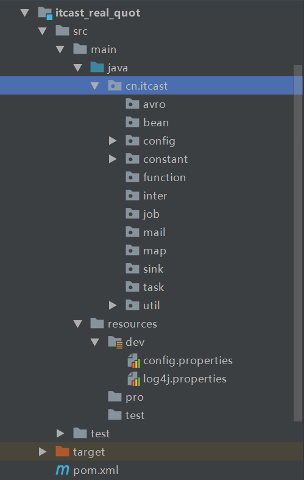
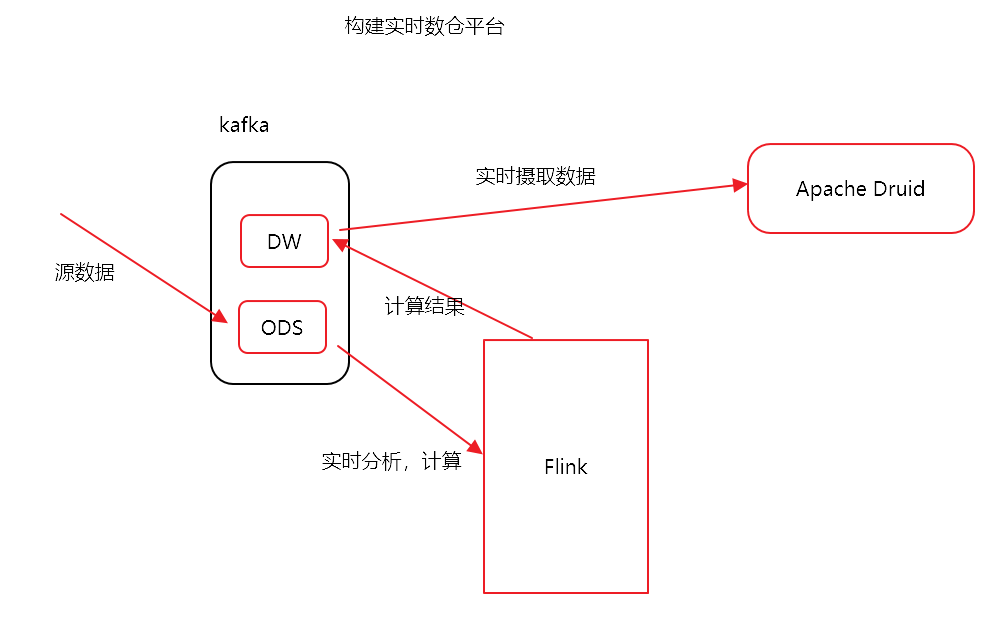
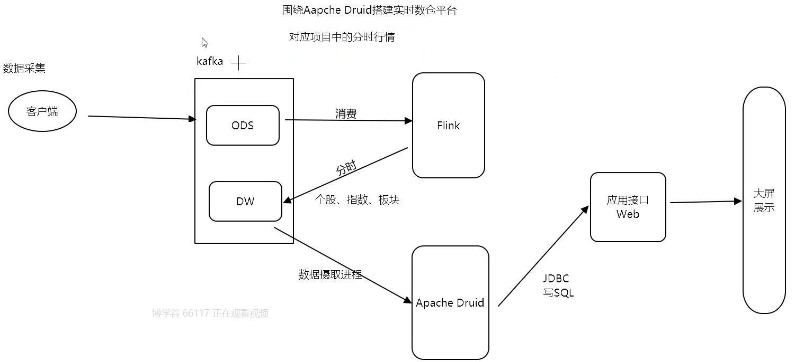
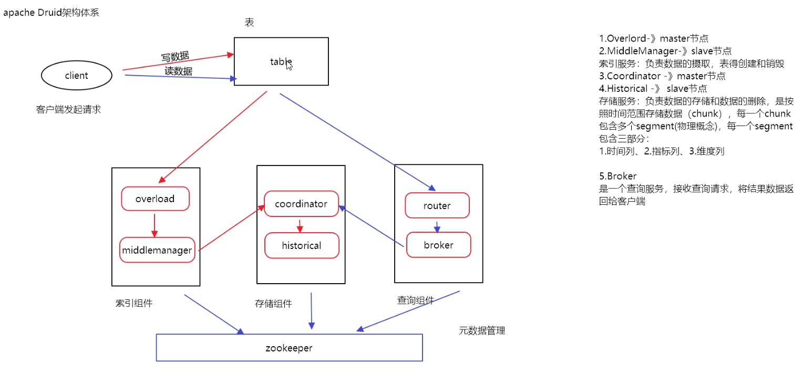
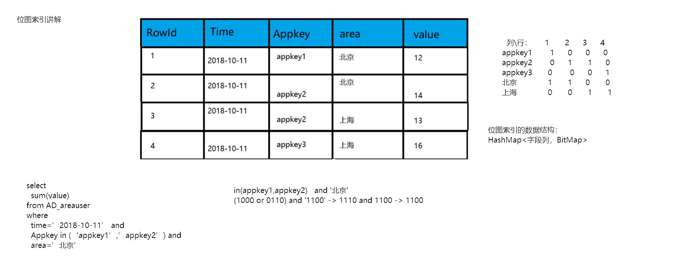
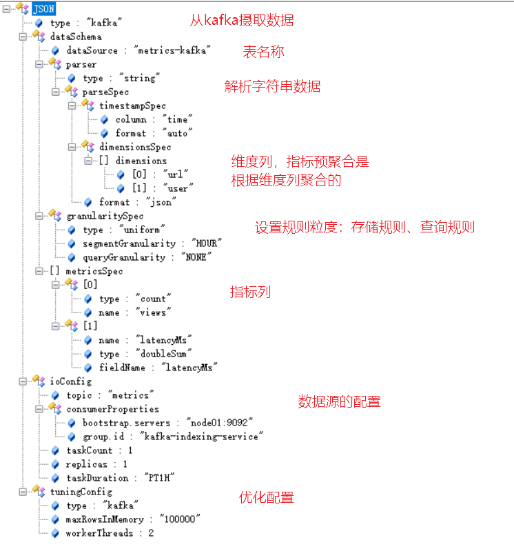

# 第三章 个股行情和Durid讲解


# 课程安排

- 实时流个股业务开发

  - flink消费kafka
    - 对avro数据进行反序列化(掌握)
    - 数据过滤(掌握FileterFunction)
      - 时间过滤(9:30 --15:00)
      - 数据过滤(高开低收都不能为0)
    - 数据合并(掌握Union的使用)
      - 沪深两市行情数据结构一致->union

- Apache Druid

  - 实时数仓平台介绍
  - 系统架构(了解)
  - 能看懂配置文件
  - 了解位图索引
  - 案例使用(掌握)
  - JDBC的使用(掌握)

  


# 实时流项目开发

## 项目环境搭建



> 1.创建子工程：itcast_real_quot
>
> 2.创建源码目录
>
> 3.导入配置文件、常量类和工具类，参见“第3章\4.资料”

## 配置类

> 读取配置文件参数，并加载至内存

~~~java
package cn.itcast.config;

import java.io.IOException;
import java.io.InputStream;
import java.util.Properties;

/**
 * @Date 2021
 */
public class QuotConfig {

    /**
     * 开发步骤：
     * 1.使用类加载器加载配置文件
     *   2.封装进Properties对象
     *   3.添加一个main方法测试，是否能够正确读取出配置项
     */
    public static Properties config = new Properties();
    static {
        //1.使用类加载器加载配置文件
        InputStream in = QuotConfig.class.getClassLoader().getResourceAsStream("config.properties");
       // 2.封装进Properties对象
        try {
            config.load(in);
        } catch (IOException e) {
            e.printStackTrace();
        }
    }

    public static void main(String[] args) {
        System.out.println(config.getProperty("stock.increase.topic"));
    }

}
~~~

## Redis启动命令

cd /export/servers/redis-3.2.8/cluster

~~~shell
 #cd 7001/
 redis-server redis.conf 
 #cd 7002/
  redis-server redis.conf 
 #cd 7003/
 redis-server redis.conf 
~~~

>  ps -ef|grep redis:查看redis进程


## 主类开发

~~~java
package cn.itcast.job;

import cn.itcast.avro.AvroDeserializerSchema;
import cn.itcast.avro.SseAvro;
import cn.itcast.avro.SzseAvro;
import cn.itcast.bean.CleanBean;
import cn.itcast.config.QuotConfig;
import cn.itcast.map.SseMap;
import cn.itcast.map.SzseMap;
import cn.itcast.util.QuotUtil;
import org.apache.flink.api.common.functions.FilterFunction;
import org.apache.flink.streaming.api.TimeCharacteristic;
import org.apache.flink.streaming.api.datastream.DataStream;
import org.apache.flink.streaming.api.datastream.DataStreamSource;
import org.apache.flink.streaming.api.datastream.SingleOutputStreamOperator;
import org.apache.flink.streaming.api.environment.StreamExecutionEnvironment;
import org.apache.flink.streaming.api.functions.timestamps.BoundedOutOfOrdernessTimestampExtractor;
import org.apache.flink.streaming.api.windowing.time.Time;
import org.apache.flink.streaming.connectors.kafka.FlinkKafkaConsumer011;

import java.util.Properties;

/**
 * @Date 2021
 * 个股业务：秒级行情、分时行情、历史数据备份、K线行情、涨跌幅
 */
public class StockStream {

    //1.创建StockStream单例对象，创建main方法
    public static void main(String[] args) throws Exception {
        /**
         * 个股总体开发步骤：
         *  1.创建StockStream单例对象，创建main方法
         *  2.获取流处理执行环境
         *  3.设置事件时间、并行度
         *  4.设置检查点机制
         *  5.设置重启机制
         *  6.整合Kafka(新建反序列化类)
         *  7.数据过滤（时间和null字段）
         *  8.数据转换、合并
         *  9.过滤个股数据
         *  10.设置水位线
         *  11.业务数据处理
         *  12.触发执行
         */
        //2.获取流处理执行环境
        StreamExecutionEnvironment env = StreamExecutionEnvironment.getExecutionEnvironment();
        //3.设置事件时间、并行度
        env.setParallelism(1);//开发环境便于测试，你设置1个，生产环境与kafka的分区数保持一致
        env.setStreamTimeCharacteristic(TimeCharacteristic.EventTime);
//        //4.设置检查点机制
//        env.enableCheckpointing(5000l);//发送检查点的时间间隔
//        env.setStateBackend(new FsStateBackend("hdfs://node01:8020/checkpoint/stock"));//状态后端，保存检查点的路径
//        env.getCheckpointConfig().setCheckpointingMode(CheckpointingMode.EXACTLY_ONCE);//强一致性，保证数据只会消费一次
//        env.getCheckpointConfig().setCheckpointTimeout(60000l);
//        env.getCheckpointConfig().setFailOnCheckpointingErrors(false);//当检查点制作失败的时候，任务继续运行
//        //当任务取消的时候，保留检查点，缺点是：需要手动删除
//        env.getCheckpointConfig().enableExternalizedCheckpoints(CheckpointConfig.ExternalizedCheckpointCleanup.RETAIN_ON_CANCELLATION);

        //5.设置重启机制
//        env.setRestartStrategy(RestartStrategies.fixedDelayRestart(3, Time.seconds(5)));

        //6.整合Kafka(新建反序列化类)
        Properties properties = new Properties();
        properties.setProperty("bootstrap.servers", QuotConfig.config.getProperty("bootstrap.servers"));
        properties.setProperty("group.id",QuotConfig.config.getProperty("group.id"));

        //消费kafka数据
        //消费sse
        FlinkKafkaConsumer011<SseAvro> sseKafkaConsumer = new FlinkKafkaConsumer011<SseAvro>(QuotConfig.config.getProperty("sse.topic"), new AvroDeserializerSchema(QuotConfig.config.getProperty("sse.topic")), properties);
        //消费szse
        FlinkKafkaConsumer011<SzseAvro> szseKafkaConsumer = new FlinkKafkaConsumer011<SzseAvro>(QuotConfig.config.getProperty("szse.topic"), new AvroDeserializerSchema(QuotConfig.config.getProperty("szse.topic")), properties);

        sseKafkaConsumer.setStartFromEarliest();
        szseKafkaConsumer.setStartFromEarliest();

        //沪市
        DataStreamSource<SseAvro> sseSource = env.addSource(sseKafkaConsumer);
        //深市
        DataStreamSource<SzseAvro> szseSource = env.addSource(szseKafkaConsumer);

        //7.数据过滤（时间和null字段）
        //null字段，在我们这里就是数据为0的字段
        //沪市过滤
        SingleOutputStreamOperator<SseAvro> sseFilterData = sseSource.filter(new FilterFunction<SseAvro>() {
            @Override
            public boolean filter(SseAvro value) throws Exception {
                return QuotUtil.checkData(value) && QuotUtil.checkTime(value);
            }
        });
        //深市过滤
        SingleOutputStreamOperator<SzseAvro> szseFilterData = szseSource.filter(new FilterFunction<SzseAvro>() {
            @Override
            public boolean filter(SzseAvro value) throws Exception {
                return QuotUtil.checkData(value) && QuotUtil.checkTime(value);
            }
        });

        //8.数据转换、合并
        DataStream<CleanBean> unionData = sseFilterData.map(new SseMap()).union(szseFilterData.map(new SzseMap()));

        //9.过滤个股数据
        SingleOutputStreamOperator<CleanBean> stockData = unionData.filter(new FilterFunction<CleanBean>() {
            @Override
            public boolean filter(CleanBean value) throws Exception {
                return QuotUtil.isStock(value);
            }
        });

        //10.设置水位线
        DataStream<CleanBean> waterData = stockData.assignTimestampsAndWatermarks(new BoundedOutOfOrdernessTimestampExtractor<CleanBean>(Time.seconds(Long.valueOf(QuotConfig.config.getProperty("delay.time")))) {
            @Override
            public long extractTimestamp(CleanBean element) {
                return element.getEventTime();
            }
        });

        waterData.print();
        /**
         * 1.秒级行情
         * 2.分时行情
         * 3.历史数据备份
         * 4.涨跌幅
         * 5.K线行情
         */

        //12.触发执行
        env.execute("stock stream");
    }

}
~~~


## Kafka反序列化

~~~java
package cn.itcast.avro;

import org.apache.avro.io.BinaryDecoder;
import org.apache.avro.io.DecoderFactory;
import org.apache.avro.specific.SpecificDatumReader;
import org.apache.flink.api.common.serialization.DeserializationSchema;
import org.apache.flink.api.common.typeinfo.TypeInformation;
import org.apache.flink.table.descriptors.Avro;

import java.io.ByteArrayInputStream;
import java.io.IOException;

/**
 * @Date 2021
 * 反序列化kafka数据
 */
//1.创建泛型反序列化类实现反序列化接口
public class AvroDeserializerSchema<T> implements DeserializationSchema<T> {

    /**
     * 开发步骤：
     * 1.创建泛型反序列化类实现反序列化接口
     * 2.创建构造方法
     * 3.avro反序列化数据
     * 4.获取反序列化数据类型
     */
    // 2.创建构造方法
    String topicName;

    public AvroDeserializerSchema(String topicName) {
        this.topicName = topicName;
    }

    //3.avro反序列化数据
    @Override
    public T deserialize(byte[] message) throws IOException {
        SpecificDatumReader<T> reader = null;
        //根据topic确定反序列化类型
        if (topicName.equals("sse")) {
            reader = (SpecificDatumReader<T>) new SpecificDatumReader<SseAvro>(SseAvro.class);
        } else {
            reader = (SpecificDatumReader<T>) new SpecificDatumReader<SzseAvro>(SzseAvro.class);
        }
        ByteArrayInputStream bis = new ByteArrayInputStream(message);
        BinaryDecoder binaryDecoder = DecoderFactory.get().binaryDecoder(bis, null);
        T read = reader.read(null, binaryDecoder);
        return read;
    }

    @Override
    public boolean isEndOfStream(T nextElement) {
        return false;
    }

    @Override
    public TypeInformation<T> getProducedType() {
        TypeInformation<T> of = null;
        if (topicName.equals("sse")) {
            of = (TypeInformation<T>) TypeInformation.of(SseAvro.class);
        }else{
            of = (TypeInformation<T>) TypeInformation.of(SzseAvro.class);
        }
        return of;
    }

}
~~~

## 过滤工具类

~~~java
package cn.itcast.util;

import cn.itcast.avro.SseAvro;
import cn.itcast.avro.SzseAvro;
import cn.itcast.bean.CleanBean;

/**
 * @Date 2021
 */
public class QuotUtil {

    //时间过滤
    //需要的是  9:30-15:00
    public static Boolean checkTime(Object obj) {

        if (obj instanceof SseAvro) {
            return ((SseAvro) obj).getTimestamp() > SpecialTimeUtil.openTime && ((SseAvro) obj).getTimestamp() < SpecialTimeUtil.closeTime;
        } else {
            return ((SzseAvro) obj).getTimestamp() > SpecialTimeUtil.openTime && ((SzseAvro) obj).getTimestamp() < SpecialTimeUtil.closeTime;
        }
    }

    //数据过滤
    //需要的是 高开低收 ！= 0
    public static Boolean checkData(Object obj) {
        if (obj instanceof SseAvro) {
            return ((SseAvro) obj).getHighPrice() != 0 && ((SseAvro) obj).getOpenPrice() != 0 && ((SseAvro) obj).getLowPrice() != 0 && ((SseAvro) obj).getTradePrice() != 0;
        } else {
            return ((SzseAvro) obj).getHighPrice() != 0 && ((SzseAvro) obj).getOpenPrice() != 0 && ((SzseAvro) obj).getLowPrice() != 0 && ((SzseAvro) obj).getTradePrice() != 0;
        }
    }

    //个股数据过滤
    public static Boolean isStock(CleanBean cleanBean){
        return cleanBean.getMdStreamId().equals("010") || cleanBean.getMdStreamId().equals("MD002");
    }
}
~~~


# Apache Druid


## 介绍

- apache druid是一个**实时数仓平台**：
  - 支持亚秒级数据查询；
  - 支持OLAP分析；
  - 支持SQL数据库查询,性能高效；
  - 不支持复杂查询（join）；

- 特点
  - 需要摄取数据，摄取数据的格式是json
  - 高性能：
    - 存储
      - 支持HDFS存储
      - 支持本地磁盘存储
      - 支持Kafka存储
    - 查询
      - 数据预聚合好之后，提供用户查询结果数据
      - 可以作为实时明细数据读写平台
      - 性能是亚秒级


## 实时数仓技术架构




## 对应项目中分时行情业务流程图




## 架构体系



三大组件：

- **索引组件**：
  - 主节点： overload
  - 从节点：middlemanager
  - 索引服务：
    - **负责数据的摄取；** （数据摄取的时候， 一个任务对应一个peon线程）
    - **表的创建和销毁；**
    - **管理segment**；
- **存储组件：**
  - 主节点：coordinator
  - 从节点：historical
  - 存储服务：**负责数据的存储和数据的删除**，
    - 是按照**时间范围**存储数据（**chunk**）；
    - 每一个chunk包含多个**segment**(物理概念)；
    - 每个segment包含三部分：**1-时间列；2-指标列；3-维度列**；
- **查询组件：**
  - 主节点：router（分发请求）
  - 从节点：broker
  - 查询服务：broker是一个查询服务，**接收查询请求，将结果数据返回给客户端**；


## 位图索引 （支持亚秒级查询）

- Druid之所以快的原因：
  - **对数据库中的每个列的每个值做了一个位图定位**：
- **位图的数据结构**：
  - Map<key,BitMap>
    - key ： 就是维度列；
    - bitMap： 就是坐标；




## 启动服务

cd /export/servers/imply-3.0.4

~~~shell
bin/supervise -c conf/supervise/quickstart.conf 
~~~

> 此服务是采用前端方式启动，关闭服务:ctrl+c

> 启动此服务之前，一定要先启动zookeeper


## WEB UI

存储服务：

http://node01:8081/index.html#/

索引服务：

http://node01:8090/console.html

查询服务：

http://node01:8888/


## 查看摄取文件



>   index 		- 拉取本地文件
>
>   index_hadoop - 拉取HDFS文件
>
>   kafka		- 拉取Kafka流数据


## JDBC操作数据库


``` java
//1.加载驱动
Class.forName("org.apache.calcite.avatica.remote.Driver");

//2.创建JDBC连接对象
String url = "jdbc:avatica:remote:url=http://node01:8888/druid/v2/sql/avatica/";
```


~~~java
package cn.itcast;

import java.sql.Connection;
import java.sql.DriverManager;
import java.sql.ResultSet;
import java.sql.Statement;

/**
 * @Date 2021
 */
public class JdbcTest {

    public static void main(String[] args) throws Exception {

        /**
         * 开发步骤：
         * 1.加载驱动
         * 2.创建JDBC连接对象
         * 3.SQL查询
         * 4.获取查询结果
         * 5.关流
         */
        //1.加载驱动
        Class.forName("org.apache.calcite.avatica.remote.Driver");
        //2.创建JDBC连接对象
        String url = "jdbc:avatica:remote:url=http://node01:8888/druid/v2/sql/avatica/";
        Connection conn = DriverManager.getConnection(url);
        Statement st = conn.createStatement();
        //3.SQL查询
        ResultSet rs = st.executeQuery("SELECT * FROM \"wikiticker\"");
        while (rs.next()){
           //4.获取查询结果
            System.out.println(rs.getString(1)+"======"+rs.getString(3));
        }
        //5.关流
        if(rs !=null){
            rs.close();
        }
        if(st !=null){
            st.close();
        }
        if(conn != null){
            conn.close();
        }
    }
}
~~~

# 课程回顾

- 第一章

  - 项目业务介绍

    - 名词:个股,指数,板块,涨跌幅,振幅,换手率
    - 技术架构选型
      - 数据采集flume(自定义source),socket
      - 消息队列:kafka
      - 实时计算:Flink
      - 存储平台
        - hbase:秒级
        - druid:分时
        - mysql:K线(周K,月K,日K)
        - 历史数据存储HDFS(实时,批)->Hive
      - 离线计算:Hive
      - 数据同步:Sqoop
      - 定时调度:oozie
      - 应用接口:SpringBoot
    - 数据流程(需要能够说的出来)

  - 数据采集---深市

    - avro:高性能序列化数据传输框架

      - 支持json

      - 数据结构丰富

        - 8种基本类型
        - 6种复杂类型(record)

      - 性能优秀

        - 数据和schema分离

      - 定义序列化和反序列化(规范约束

      - 需要定义avsc文件

        - ~~~json
          {
          "namespace":"cn.itcast.avro",
          "name":"Demo",
          "type":"record",
          "fields":[
          	{"name":"secCode","type":["string","null"]},
          	{"name":"secName","type":["string","null"]},
          ]
          }
          ~~~

          

- 第二章

  - 沪市数据采集

    - flume自定义source

      - 数据是在ftp上的,官方没有与ftp整合的插件

      - ```
        extends AbstractSource implements PollableSource, Configurable
        ```

  - 离线数据加工

    - 应用层表
      - 个股日K表
      - 指数日K表
      - 板块成分股表(板块与个股的对应关系表)
    - SQL
      - ODS->DW
      - DW->DM
    - 数据同步
    - 数据调度

- 第三章

  - 个股流处理业务开发(部分代码)
    - 反序列化kafka中的avro数据
    - 数据过滤
      - 时间过滤(9:30-15:00)
      - 高开低手=0的数据过滤
      - 个股数据过滤
    - 水位线的设置
  - ApacheDruid
    - 特点
      - 数据预聚合
      - 支持亚秒级数据查询(毫秒级别)
      - 支持海量数据存储
      - 支持SQL
    - 位图索引(了解)
    - 技术架构(了解)
    - 索引配置文件(会看)
    - JDBC(掌握)


