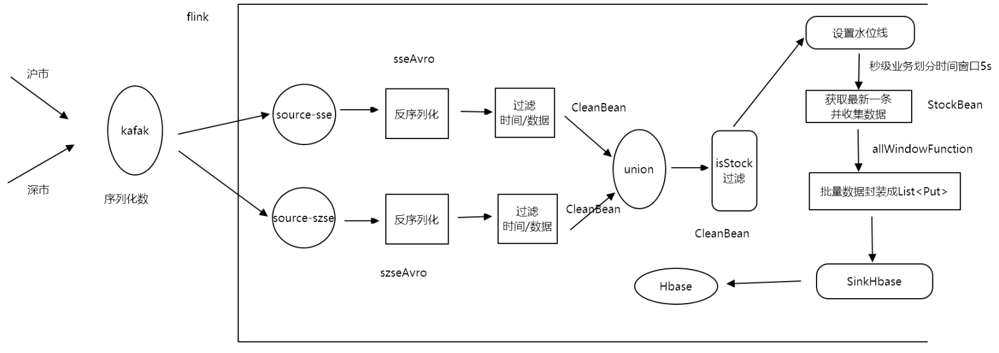
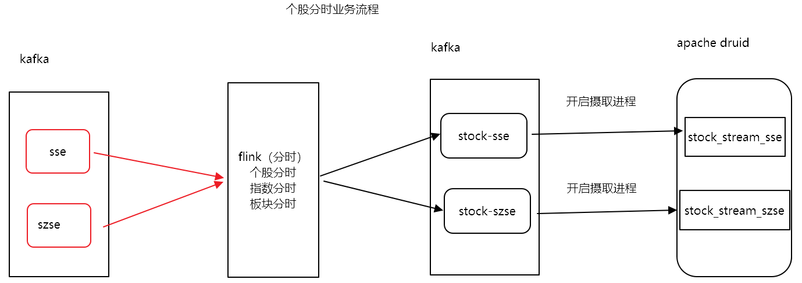
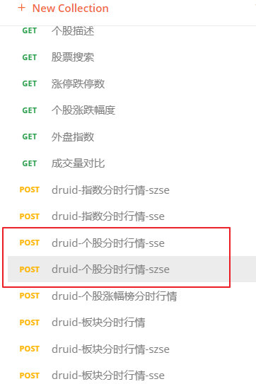
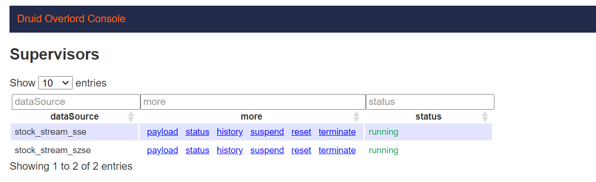
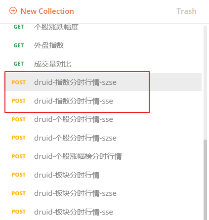

# 第4章 实时计算（个股和指数）


# 课程安排

- 实时流开发
  - 个股 （掌握）：一只只股票，单只股票我们称之为个股
    - 秒级行情： 每只股票，每5s钟一条最新数据 -》 hbase -》只做业务简单的读取
    - 分时行情 ： 每只股票，每分钟一条最新数据 -》 druid  -》会做简单的业务逻辑加工，实现大屏展示
    - 分时数据备份 -》数据存储在hdfs
    - 涨跌幅行情 -》druid  
    - K线行情 ：以日K例举，表示每只股票，每天一条最新行情数据 -》 mysql
  - 指数 （了解） ： 指数是一个加权计算之后得到的结果数据，指数能够反应一个股票市场的总体行情波动情况，比如说上证180，选取上证交易所180家最具代表性的企业。经过一定的加权计算之后，得到的数据，能够反应上证行情市场总体的市场行情状态。
    - 秒级行情（练习）
    - 分时行情 （练习）
    - 分时数据备份（练习）
- 学习目标
  - 掌握各种算子的使用(api)
    - timeWindow
    - map
    - apply窗口函数
    - 侧边流(侧输出流)
    - 状态算子(MapState)
  - 与各种存储平台的整合
    - hbase
    - druid
    - hdfs


# 个股业务

## 主类代码

~~~java
package cn.itcast.job;

import cn.itcast.avro.AvroDeserializerSchema;
import cn.itcast.avro.SseAvro;
import cn.itcast.avro.SzseAvro;
import cn.itcast.bean.CleanBean;
import cn.itcast.config.QuotConfig;
import cn.itcast.map.SseMap;
import cn.itcast.map.SzseMap;
import cn.itcast.task.StockHdfsTask;
import cn.itcast.task.StockMinTask;
import cn.itcast.task.StockSecTask;
import cn.itcast.task.UpDownTask;
import cn.itcast.util.QuotUtil;
import org.apache.flink.api.common.functions.FilterFunction;
import org.apache.flink.streaming.api.TimeCharacteristic;
import org.apache.flink.streaming.api.datastream.DataStream;
import org.apache.flink.streaming.api.datastream.DataStreamSource;
import org.apache.flink.streaming.api.datastream.SingleOutputStreamOperator;
import org.apache.flink.streaming.api.environment.StreamExecutionEnvironment;
import org.apache.flink.streaming.api.functions.timestamps.BoundedOutOfOrdernessTimestampExtractor;
import org.apache.flink.streaming.api.windowing.time.Time;
import org.apache.flink.streaming.connectors.kafka.FlinkKafkaConsumer011;

import java.util.Properties;

/**
 * @Date 2021
 * 个股业务：秒级行情、分时行情、历史数据备份、K线行情、涨跌幅
 */
public class StockStream {

    //1.创建StockStream单例对象，创建main方法
    public static void main(String[] args) throws Exception {
        /**
         * 个股总体开发步骤：
         *  1.创建StockStream单例对象，创建main方法
         *  2.获取流处理执行环境
         *  3.设置事件时间、并行度
         *  4.设置检查点机制
         *  5.设置重启机制
         *  6.整合Kafka(新建反序列化类)
         *  7.数据过滤（时间和null字段）
         *  8.数据转换、合并
         *  9.过滤个股数据
         *  10.设置水位线
         *  11.业务数据处理
         *  12.触发执行
         */
        //2.获取流处理执行环境
        StreamExecutionEnvironment env = StreamExecutionEnvironment.getExecutionEnvironment();
        //3.设置事件时间、并行度
        env.setParallelism(1);//开发环境便于测试，你设置1个，生产环境与kafka的分区数保持一致
        env.setStreamTimeCharacteristic(TimeCharacteristic.EventTime);
//        //4.设置检查点机制
//        env.enableCheckpointing(5000l);//发送检查点的时间间隔
//        env.setStateBackend(new FsStateBackend("hdfs://node01:8020/checkpoint/stock"));//状态后端，保存检查点的路径
//        env.getCheckpointConfig().setCheckpointingMode(CheckpointingMode.EXACTLY_ONCE);//强一致性，保证数据只会消费一次
//        env.getCheckpointConfig().setCheckpointTimeout(60000l);
//        env.getCheckpointConfig().setFailOnCheckpointingErrors(false);//当检查点制作失败的时候，任务继续运行
//        //当任务取消的时候，保留检查点，缺点是：需要手动删除
//        env.getCheckpointConfig().enableExternalizedCheckpoints(CheckpointConfig.ExternalizedCheckpointCleanup.RETAIN_ON_CANCELLATION);

        //5.设置重启机制
//        env.setRestartStrategy(RestartStrategies.fixedDelayRestart(3, Time.seconds(5)));

        //6.整合Kafka(新建反序列化类)
        Properties properties = new Properties();
        properties.setProperty("bootstrap.servers", QuotConfig.config.getProperty("bootstrap.servers"));
        properties.setProperty("group.id", QuotConfig.config.getProperty("group.id"));

        //消费kafka数据
        //消费sse
        FlinkKafkaConsumer011<SseAvro> sseKafkaConsumer = new FlinkKafkaConsumer011<SseAvro>(QuotConfig.config.getProperty("sse.topic"), new AvroDeserializerSchema(QuotConfig.config.getProperty("sse.topic")), properties);
        //消费szse
        FlinkKafkaConsumer011<SzseAvro> szseKafkaConsumer = new FlinkKafkaConsumer011<SzseAvro>(QuotConfig.config.getProperty("szse.topic"), new AvroDeserializerSchema(QuotConfig.config.getProperty("szse.topic")), properties);

        sseKafkaConsumer.setStartFromEarliest();
        szseKafkaConsumer.setStartFromEarliest();

        //沪市
        DataStreamSource<SseAvro> sseSource = env.addSource(sseKafkaConsumer);
        //深市
        DataStreamSource<SzseAvro> szseSource = env.addSource(szseKafkaConsumer);

        //7.数据过滤（时间和null字段）
        //null字段，在我们这里就是数据为0的字段
        //沪市过滤
        SingleOutputStreamOperator<SseAvro> sseFilterData = sseSource.filter(new FilterFunction<SseAvro>() {
            @Override
            public boolean filter(SseAvro value) throws Exception {
                return QuotUtil.checkData(value) && QuotUtil.checkTime(value);
            }
        });
        //深市过滤
        SingleOutputStreamOperator<SzseAvro> szseFilterData = szseSource.filter(new FilterFunction<SzseAvro>() {
            @Override
            public boolean filter(SzseAvro value) throws Exception {
                return QuotUtil.checkData(value) && QuotUtil.checkTime(value);
            }
        });

        //8.数据转换、合并
        DataStream<CleanBean> unionData = sseFilterData.map(new SseMap()).union(szseFilterData.map(new SzseMap()));

        //9.过滤个股数据
        SingleOutputStreamOperator<CleanBean> stockData = unionData.filter(new FilterFunction<CleanBean>() {
            @Override
            public boolean filter(CleanBean value) throws Exception {
                return QuotUtil.isStock(value);
            }
        });

        //10.设置水位线
        DataStream<CleanBean> waterData = stockData.assignTimestampsAndWatermarks(new BoundedOutOfOrdernessTimestampExtractor<CleanBean>(Time.seconds(Long.valueOf(QuotConfig.config.getProperty("delay.time")))) {
            @Override
            public long extractTimestamp(CleanBean element) {
                return element.getEventTime();
            }
        });

        /**
         * 1.秒级行情
         * 2.分时行情
         * 3.历史数据备份
         * 4.涨跌幅
         * 5.K线行情
         */
        //1.秒级行情
//         new StockSecTask().process(waterData);
        //2.分时行情
//        new StockMinTask().process(waterData);
        //3.历史数据备份
//        new StockHdfsTask().process(waterData);

        //4.涨跌幅
        new UpDownTask().process(waterData);

        //12.触发执行
        env.execute("stock stream");
    }

}
~~~


## 业务开发

### 通用接口

~~~java
package cn.itcast.inter;

import cn.itcast.bean.CleanBean;
import org.apache.flink.streaming.api.datastream.DataStream;

/**
 * 通用接口,解耦合
 */
public interface ProcessDataInterface {

    void process( DataStream<CleanBean> waterData);
}
~~~

### KeyFunction

~~~java
package cn.itcast.function;

import cn.itcast.bean.CleanBean;
import org.apache.flink.api.java.functions.KeySelector;

/**
 * @Date 2021
 * 通过分组函数
 */
public class KeyFunction implements KeySelector<CleanBean,String> {
    @Override
    public String getKey(CleanBean value) throws Exception {
        return value.getSecCode();
    }
}

~~~

### 1.个股秒级行情

#### 秒级业务开发流程



hbase创建表：

~~~java
create 'quot_stock','info'
~~~

StockStream中添加task

```java
//1.个股秒级行情
new StockSecTask().process(waterData);
```

#### StockSecTask

~~~java
package cn.itcast.task;

import cn.itcast.bean.CleanBean;
import cn.itcast.bean.StockBean;
import cn.itcast.config.QuotConfig;
import cn.itcast.function.KeyFunction;
import cn.itcast.function.StockPutHbaseWindowFunction;
import cn.itcast.function.StockSecWindowFunction;
import cn.itcast.inter.ProcessDataInterface;
import cn.itcast.sink.SinkHbase;
import cn.itcast.util.HbaseUtil;
import org.apache.flink.api.java.functions.KeySelector;
import org.apache.flink.streaming.api.datastream.DataStream;
import org.apache.flink.streaming.api.functions.sink.SinkFunction;
import org.apache.flink.streaming.api.scala.function.RichWindowFunction;
import org.apache.flink.streaming.api.windowing.time.Time;

/**
 * @Date 2021
 * 个股秒级行情
 */
public class StockSecTask implements ProcessDataInterface {


    @Override
    public void process(DataStream<CleanBean> waterData) {

        /**
         * 开发步骤：
         * 1.数据分组
         * 2.划分时间窗口
         * 3.新建个股数据写入bean对象
         * 4.秒级窗口函数业务处理
         * 5.数据写入操作
         *   * 封装ListPuts
         *   * 数据写入
         */
        //1.数据分组
        waterData.keyBy(new KeyFunction())
                //2.划分时间窗口
                .timeWindow(Time.seconds(5))
                //4.秒级窗口函数业务处理
                .apply(new StockSecWindowFunction())
                //5.数据写入操作
                .timeWindowAll(Time.seconds(5))
                .apply(new StockPutHbaseWindowFunction())
                .addSink(new SinkHbase(QuotConfig.config.getProperty("stock.hbase.table.name")));

    }
}
~~~

#### StockSecWindowFunction

~~~java
package cn.itcast.function;

import cn.itcast.bean.CleanBean;
import cn.itcast.bean.StockBean;
import cn.itcast.constant.Constant;
import cn.itcast.util.DateUtil;
import org.apache.flink.streaming.api.functions.windowing.RichWindowFunction;
import org.apache.flink.streaming.api.windowing.windows.TimeWindow;
import org.apache.flink.util.Collector;

/**
 * @Date 2021
 * 个股秒级窗口函数处理
 * 实现:获取最新一条行情数据,封装stockBean
 */
//1.新建StockSecWindowFunction 窗口函数
public class StockSecWindowFunction extends RichWindowFunction<CleanBean, StockBean,String, TimeWindow> {
    @Override
    public void apply(String s, TimeWindow window, Iterable<CleanBean> input, Collector<StockBean> out) throws Exception {

        /**
         * 开发步骤：
         * 1.新建SecStockWindowFunction 窗口函数
         * 2.记录最新个股
         * 3.格式化日期
         * 4.封装输出数据
         */
        //2.记录最新个股
        CleanBean line = null;
        for (CleanBean cleanBean : input) {

            if(line == null){
                line = cleanBean;
            }
            if(line.getEventTime()<cleanBean.getEventTime()){
                line = cleanBean;
            }
        }

        // 3.格式化日期
        //hbase rowkey设计 :code+timestamp(格式化之后的时间戳)->6000020210202100821
        Long tradeTime = DateUtil.longTimeTransfer(line.getEventTime(), Constant.format_YYYYMMDDHHMMSS);

        //4.封装输出数据
        //eventTime、secCode、secName、preClosePrice、openPrice、highPrice、lowPrice、closePrice、
        //tradeVol、tradeAmt、tradeVolDay、tradeAmtDay、tradeTime、source
        StockBean stockBean = new StockBean();
        stockBean.setEventTime(line.getEventTime());
        stockBean.setSecCode(line.getSecCode());
        stockBean.setSecName(line.getSecName());
        stockBean.setPreClosePrice(line.getPreClosePrice());
        stockBean.setOpenPrice(line.getOpenPrice());
        stockBean.setHighPrice(line.getMaxPrice());
        stockBean.setLowPrice(line.getMinPrice());
        stockBean.setClosePrice(line.getTradePrice());
        stockBean.setTradeAmt(0l);
        stockBean.setTradeVol(0l);
        stockBean.setTradeVolDay(line.getTradeVolumn());
        stockBean.setTradeAmtDay(line.getTradeAmt());
        stockBean.setTradeTime(tradeTime);
        stockBean.setSource(line.getSource());
        out.collect(stockBean);
    }
}

~~~

#### StockPutHbaseWindowFunction

~~~java
package cn.itcast.function;

import cn.itcast.bean.StockBean;
import com.alibaba.fastjson.JSON;
import org.apache.flink.streaming.api.functions.windowing.RichAllWindowFunction;
import org.apache.flink.streaming.api.windowing.windows.TimeWindow;
import org.apache.flink.util.Collector;
import org.apache.hadoop.hbase.client.Put;

import java.util.ArrayList;
import java.util.List;

/**
 * @Date 2021
 */
public class StockPutHbaseWindowFunction extends RichAllWindowFunction<StockBean, List<Put>, TimeWindow> {
    @Override
    public void apply(TimeWindow window, Iterable<StockBean> values, Collector<List<Put>> out) throws Exception {
        /**
         * 1.遍历数据
         * 2.新建put对象
         * 3.将bean对象装换成字符串
         * 4.封装list
         */
        List<Put> list = new ArrayList<>();
        //1.遍历数据
        for (StockBean value : values) {
            //2.新建put对象
            String rowkey = value.getSecCode()+value.getTradeTime();
            Put put = new Put(rowkey.getBytes());
            //3.将bean对象装换成字符
            String str = JSON.toJSONString(value);
            //4.封装list
            put.addColumn("info".getBytes(),"data".getBytes(),str.getBytes());
            list.add(put);
        }
        out.collect(list);
    }
}

~~~

#### SinkHbase

~~~java
package cn.itcast.sink;

import cn.itcast.util.HbaseUtil;
import org.apache.flink.streaming.api.functions.sink.SinkFunction;
import org.apache.hadoop.hbase.client.Put;

import java.util.List;

/**
 * @Date 2021
 * 通用写入hbase操作类
 */
public class SinkHbase implements SinkFunction<List<Put>> {

    /**
     * 1.创建构造方法
     * 2.实现数据插入
     */
    String tableName;
    public SinkHbase(String tableName){
        this.tableName = tableName;
    }

    //2.实现数据插入
    @Override
    public void invoke(List<Put> value, Context context) throws Exception {
        HbaseUtil.putList(tableName,value);
    }
}

~~~

#### StockBean

~~~java
package cn.itcast.bean;

import lombok.AllArgsConstructor;
import lombok.Data;
import lombok.NoArgsConstructor;

import java.math.BigDecimal;


/**
 * 个股Bean
 */
@Data
@AllArgsConstructor
@NoArgsConstructor
public class StockBean {

    private Long eventTime; //事件时间
    private String secCode;
    private String secName;
    private BigDecimal preClosePrice;
    private BigDecimal openPrice;
    private BigDecimal highPrice;
    private BigDecimal lowPrice;
    private BigDecimal closePrice;
    private Long tradeVol;//分时成交量
    private Long tradeAmt;//分时成交金额
    private Long tradeVolDay;//日成交总量量
    private Long tradeAmtDay;//日成交总金额
    private Long tradeTime; //格式化时间
    private String source;


}

~~~


### 2.分时行情

#### 业务流程



> 注意事项：
>
> 写入Druid之前，一定要先创建topic和开启Druid摄取数据的进程

#### 创建topic

~~~
#沪市分时行情topic
./kafka-topics.sh --create --partitions 1 --replication-factor 1 --zookeeper node01:2181 --topic stock-sse
#深市分时行情topic
./kafka-topics.sh --create --partitions 1 --replication-factor 1 --zookeeper node01:2181 --topic stock-szse

~~~

#### 开启个股分时摄取任务

导入“第4章\4.资料\postman脚本\quot.postman_collection.json” 到Postman工具，并发送下图红框中的请求



摄取进程开启成功：



#### StockMinTask

StockStream中添加task

~~~java
//2.分时行情new StockMinTask().process(waterData);
~~~

StockMinTask:

~~~java
package cn.itcast.task;

import cn.itcast.bean.CleanBean;
import cn.itcast.bean.StockBean;
import cn.itcast.config.QuotConfig;
import cn.itcast.function.KeyFunction;
import cn.itcast.function.StockMinWindowFunction;
import cn.itcast.inter.ProcessDataInterface;
import com.alibaba.fastjson.JSON;
import org.apache.flink.api.common.functions.MapFunction;
import org.apache.flink.api.common.serialization.SimpleStringSchema;
import org.apache.flink.api.common.typeinfo.TypeInformation;
import org.apache.flink.streaming.api.datastream.DataStream;
import org.apache.flink.streaming.api.datastream.SingleOutputStreamOperator;
import org.apache.flink.streaming.api.functions.ProcessFunction;
import org.apache.flink.streaming.api.windowing.time.Time;
import org.apache.flink.streaming.connectors.kafka.FlinkKafkaProducer011;
import org.apache.flink.util.Collector;
import org.apache.flink.util.OutputTag;

import java.util.Properties;

/**
 * @Date 2021
 * 个股分时行情
 */
public class StockMinTask implements ProcessDataInterface {
    @Override
    public void process(DataStream<CleanBean> waterData) {

        /**
         * 开发步骤：
         * 1.定义侧边流
         * 2.数据分组
         * 3.划分时间窗口
         * 4.分时数据处理（新建分时窗口函数）
         * 5.数据分流
         * 6.数据分流转换
         * 7.分表存储(写入kafka)
         */
        //1.定义侧边流,接收深市行情数据
        OutputTag<StockBean> szseOpt = new OutputTag<>("szse", TypeInformation.of(StockBean.class));
        //2.数据分组
        SingleOutputStreamOperator<StockBean> processData = waterData.keyBy(new KeyFunction())
                //3.划分时间窗口
                .timeWindow(Time.minutes(1))
                //4.分时数据处理（新建分时窗口函数）
                .apply(new StockMinWindowFunction())
                //5.数据分流
                .process(new ProcessFunction<StockBean, StockBean>() {
                    @Override
                    public void processElement(StockBean value, Context ctx, Collector<StockBean> out) throws Exception {
                        if (value.getSource().equals("sse")) {
                            out.collect(value);
                        } else {
                            ctx.output(szseOpt, value);
                        }
                    }
                });

        //6.数据分流转换
        //sse
        SingleOutputStreamOperator<String> sseStr = processData.map(new MapFunction<StockBean, String>() {
            @Override
            public String map(StockBean value) throws Exception {
                return JSON.toJSONString(value);
            }
        });

        //szse
        SingleOutputStreamOperator<String> szseStr = processData.getSideOutput(szseOpt).map(new MapFunction<StockBean, String>() {
            @Override
            public String map(StockBean value) throws Exception {
                return JSON.toJSONString(value);
            }
        });

        //7.分表存储(写入kafka)
        //获取kafka生产者对象
        Properties properties = new Properties();
        properties.setProperty("bootstrap.servers", QuotConfig.config.getProperty("bootstrap.servers"));
        FlinkKafkaProducer011<String> sseKafkaProducer = new FlinkKafkaProducer011<>(QuotConfig.config.getProperty("sse.stock.topic"), new SimpleStringSchema(), properties);
        FlinkKafkaProducer011<String> szseKafkaProducer = new FlinkKafkaProducer011<>(QuotConfig.config.getProperty("szse.stock.topic"), new SimpleStringSchema(), properties);
        //sse写入kafka
        sseStr.addSink(sseKafkaProducer);
        //szse写入kafka
        szseStr.addSink(szseKafkaProducer);
    }
}

~~~

#### StockMinWindowFunction

~~~java
package cn.itcast.function;

import cn.itcast.bean.CleanBean;
import cn.itcast.bean.StockBean;
import cn.itcast.constant.Constant;
import cn.itcast.util.DateUtil;
import org.apache.flink.api.common.state.MapState;
import org.apache.flink.api.common.state.MapStateDescriptor;
import org.apache.flink.configuration.Configuration;
import org.apache.flink.streaming.api.functions.windowing.RichWindowFunction;
import org.apache.flink.streaming.api.windowing.windows.TimeWindow;
import org.apache.flink.util.Collector;

/**
 * @Date 2021
 * 个股分时窗口函数处理
 */
//1.新建MinStockWindowFunction 窗口函数
public class StockMinWindowFunction extends RichWindowFunction<CleanBean, StockBean, String, TimeWindow> {

    /**
     * 开发步骤：
     * 1.新建MinStockWindowFunction 窗口函数
     * 2.初始化 MapState<String, StockBean>
     * 3.记录最新个股
     * 4.获取分时成交额和成交数量
     * 5.格式化日期
     * 6.封装输出数据
     * 7.更新MapState
     */
    //2.初始化 MapState<String, StockBean>
    MapState<String, StockBean> stockMs = null;

    @Override
    public void open(Configuration parameters) throws Exception {
        stockMs = getRuntimeContext().getMapState(new MapStateDescriptor<String, StockBean>("stockMs", String.class, StockBean.class));
    }

    @Override
    public void apply(String s, TimeWindow window, Iterable<CleanBean> input, Collector<StockBean> out) throws Exception {

        //3.记录最新个股
        CleanBean line = null;
        for (CleanBean cleanBean : input) {
            if(line == null){
                line = cleanBean;
            }
            if(line.getEventTime() < cleanBean.getEventTime()){
                line = cleanBean;
            }
        }

        //4.获取分时成交额和成交数量
        Long tradeVol = 0l;//分时成交量
        Long tradeAmt = 0l;//分时成交金额
        //获取上一分钟的数据
        StockBean stockBeanLast = stockMs.get(line.getSecCode());
        if(stockBeanLast !=null){
            tradeAmt = line.getTradeAmt() - stockBeanLast.getTradeAmtDay();
            tradeVol = line.getTradeVolumn() -stockBeanLast.getTradeVolDay();
        }

        //5.格式化日期
        Long tradeTime = DateUtil.longTimeTransfer(line.getEventTime(), Constant.format_YYYYMMDDHHMMSS);

        //6.封装输出数据
        StockBean stockBean = new StockBean();
        stockBean.setEventTime(line.getEventTime());
        stockBean.setSecCode(line.getSecCode());
        stockBean.setSecName(line.getSecName());
        stockBean.setPreClosePrice(line.getPreClosePrice());
        stockBean.setOpenPrice(line.getOpenPrice());
        stockBean.setHighPrice(line.getMaxPrice());
        stockBean.setLowPrice(line.getMinPrice());
        stockBean.setClosePrice(line.getTradePrice());
        stockBean.setTradeAmt(tradeAmt); //分时成交金额
        stockBean.setTradeVol(tradeVol); //分时成交量
        stockBean.setTradeVolDay(line.getTradeVolumn());
        stockBean.setTradeAmtDay(line.getTradeAmt());
        stockBean.setTradeTime(tradeTime);
        stockBean.setSource(line.getSource());
        out.collect(stockBean);
        //7.更新MapState
        stockMs.put(stockBean.getSecCode(),stockBean);
    }
}
~~~

### 3.分时行情备份至HDFS

StockStream中添加task

```java
//3.分时数据备份
new StockHdfsTask().process(waterData);
```

#### StockHdfsTask

~~~java
package cn.itcast.task;

import cn.itcast.bean.CleanBean;
import cn.itcast.config.QuotConfig;
import cn.itcast.function.KeyFunction;
import cn.itcast.function.StockMinWindowFunction;
import cn.itcast.inter.ProcessDataInterface;
import cn.itcast.map.StockHdfsMap;
import org.apache.flink.streaming.api.datastream.DataStream;
import org.apache.flink.streaming.api.windowing.time.Time;
import org.apache.flink.streaming.connectors.fs.StringWriter;
import org.apache.flink.streaming.connectors.fs.bucketing.BucketingSink;
import org.apache.flink.streaming.connectors.fs.bucketing.DateTimeBucketer;

/**
 * @Date 2021
 * 个股分时数据备份
 */
public class StockHdfsTask implements ProcessDataInterface {
    @Override
    public void process(DataStream<CleanBean> waterData) {
        /**
         * 开发步骤：
         * 1.设置HDFS存储路径
         * 2.设置数据文件参数
         *   （大小、分区、格式、前缀、后缀）
         * 3.数据分组
         * 4.划分时间窗口
         * 5.数据处理
         * 6.转换并封装数据
         * 7.写入HDFS
         */
        //1.设置HDFS存储路径
        //BucketingSink 此对象是实时写入文件的对象
        BucketingSink<String> bucketingSink = new BucketingSink<>(QuotConfig.config.getProperty("stock.sec.hdfs.path"));
        //2.设置数据文件参数
        //  （大小、分区、格式、前缀、后缀）
        bucketingSink.setBucketer(new DateTimeBucketer<>(QuotConfig.config.getProperty("hdfs.bucketer")));
        bucketingSink.setWriter(new StringWriter<>());//写入字符串数据
        bucketingSink.setBatchSize(Long.valueOf(QuotConfig.config.getProperty("hdfs.batch")));
        bucketingSink.setPendingPrefix("stock2-"); //文件写入完成之后变成pending状态
        bucketingSink.setInProgressPrefix("stock-"); //表示正在写入的文件
        bucketingSink.setPendingSuffix(".txt");
        bucketingSink.setInProgressSuffix(".txt");

        //3.数据分组
        waterData.keyBy(new KeyFunction())
                //4.划分时间窗口
                .timeWindow(Time.minutes(1))
                // 5.数据处理
                .apply(new StockMinWindowFunction())
                //6.转换并封装数据
                .map(new StockHdfsMap())
                // 7.写入HDFS
                .addSink(bucketingSink);
    }
}
~~~


#### StockHdfsMap

~~~java
package cn.itcast.map;

import cn.itcast.bean.StockBean;
import cn.itcast.config.QuotConfig;
import cn.itcast.constant.Constant;
import cn.itcast.util.DateUtil;
import org.apache.flink.api.common.functions.RichMapFunction;

import java.sql.Timestamp;

/**
 * @Date 2021
 */
public class StockHdfsMap extends RichMapFunction<StockBean, String> {
    //1.定义字符串字段分隔符
    String sp = QuotConfig.config.getProperty("hdfs.seperator");

    /**
     * 开发步骤:
     * 1.定义字符串字段分隔符
     * 2.日期转换和截取：date类型
     * 3.新建字符串缓存对象
     * 4.封装字符串数据
     * <p>
     * 字符串拼装字段顺序：
     * Timestamp|date|secCode|secName|preClosePrice|openPirce|highPrice|
     * lowPrice|closePrice|tradeVol|tradeAmt|tradeVolDay|tradeAmtDay|source
     */
    @Override
    public String map(StockBean value) throws Exception {

        //2.日期转换和截取：date类型
        String tradeDate = DateUtil.longTimeToString(value.getEventTime(), Constant.format_yyyy_mm_dd);
        //3.新建字符串缓存对象
        StringBuffer buffer = new StringBuffer();
        //4.封装字符串数据
        StringBuffer bf = buffer.append(new Timestamp(value.getEventTime())).append(sp)
                .append(tradeDate).append(sp)
                .append(value.getSecCode()).append(sp)
                .append(value.getSecName()).append(sp)
                .append(value.getPreClosePrice()).append(sp)
                .append(value.getOpenPrice()).append(sp)
                .append(value.getHighPrice()).append(sp)
                .append(value.getLowPrice()).append(sp)
                .append(value.getTradeVol()).append(sp)
                .append(value.getTradeAmt()).append(sp)
                .append(value.getTradeVolDay()).append(sp)
                .append(value.getTradeAmtDay()).append(sp)
                .append(value.getSource());

        return bf.toString();
    }
}
~~~


### 4.涨跌幅行情

StockStream中添加task

```java
//4.涨跌幅new UpDownTask().process(waterData);
```

#### UpDownTask

~~~java
package cn.itcast.task;

import cn.itcast.bean.CleanBean;
import cn.itcast.bean.StockIncrBean;
import cn.itcast.config.QuotConfig;
import cn.itcast.function.KeyFunction;
import cn.itcast.function.StockUpDownWindowFunction;
import cn.itcast.inter.ProcessDataInterface;
import com.alibaba.fastjson.JSON;
import org.apache.flink.api.common.functions.MapFunction;
import org.apache.flink.api.common.serialization.SimpleStringSchema;
import org.apache.flink.streaming.api.datastream.DataStream;
import org.apache.flink.streaming.api.windowing.time.Time;
import org.apache.flink.streaming.connectors.kafka.FlinkKafkaProducer011;

import java.util.Properties;

/**
 * @Date 2021
 * 个股涨跌幅行情
 */
public class UpDownTask implements ProcessDataInterface {
    @Override
    public void process(DataStream<CleanBean> waterData) {

        /**
         * 开发步骤：
         * 1.数据分组
         * 2.划分时间窗口
         * 3.创建bean对象
         * 4.分时数据处理（新建分时窗口函数）
         * 5.数据转换成字符串
         * 6.数据存储(单表)
         */

        Properties properties = new Properties();
        properties.setProperty("bootstrap.servers", QuotConfig.config.getProperty("bootstrap.servers"));
        FlinkKafkaProducer011<String> kafkaProducer = new FlinkKafkaProducer011<>(QuotConfig.config.getProperty("stock.increase.topic"), new SimpleStringSchema(), properties);

        //1.数据分组
        waterData.keyBy(new KeyFunction())
                //2.划分时间窗口
                .timeWindow(Time.minutes(1))
                //4.分时数据处理（新建分时窗口函数）
                .apply(new StockUpDownWindowFunction())
                //5.数据转换成字符串
                .map(new MapFunction<StockIncrBean, String>() {
                    @Override
                    public String map(StockIncrBean value) throws Exception {
                        return JSON.toJSONString(value);
                    }
                }).addSink(kafkaProducer);// 6.数据存储(单表)
    }
}
~~~

#### StockUpDownWindowFunction

~~~java
package cn.itcast.function;

import cn.itcast.bean.CleanBean;
import cn.itcast.bean.StockIncrBean;
import cn.itcast.constant.Constant;
import cn.itcast.util.DateUtil;
import org.apache.flink.streaming.api.functions.windowing.RichWindowFunction;
import org.apache.flink.streaming.api.windowing.windows.TimeWindow;
import org.apache.flink.util.Collector;

import java.math.BigDecimal;
import java.math.RoundingMode;

/**
 * @Date 2021
 * 个股涨跌幅窗口函数处理
 */
//1.新建StockUpDownWindowFunction 窗口函数
public class StockUpDownWindowFunction extends RichWindowFunction<CleanBean, StockIncrBean,String, TimeWindow> {
    @Override
    public void apply(String s, TimeWindow window, Iterable<CleanBean> input, Collector<StockIncrBean> out) throws Exception {
        /**
         * 2.记录最新个股
         * 3.格式化日期
         * 4.指标计算
         *   涨跌、涨跌幅、振幅
         * 5.封装输出数据
         */
        //2.记录最新个股
        CleanBean line = null;
        for (CleanBean cleanBean : input) {
            if(line == null){
                line = cleanBean;
            }
            if(line.getEventTime() < cleanBean.getEventTime()){
                line = cleanBean;
            }
        }
        //3.格式化日期
        Long tradeTime = DateUtil.longTimeTransfer(line.getEventTime(), Constant.format_YYYYMMDDHHMMSS);

        //4.指标计算
        //涨跌、涨跌幅、振幅
        /**
         * 今日涨跌=当前价-前收盘价
         * 今日涨跌幅（%）=（当前价-前收盘价）/ 前收盘价 * 100%
         * 今日振幅 =（当日最高点的价格－当日最低点的价格）/昨天收盘价×100%
         */
        //对金额的计算,要考虑精度,一般都是采用BigDecimal类型
        //今日涨跌=当前价-前收盘价
        BigDecimal upDown = line.getTradePrice().subtract(line.getPreClosePrice());
        //保留两位小数,四舍五入
        //日涨跌幅（%）=（当前价-前收盘价）/ 前收盘价 * 100%
        BigDecimal increase = upDown.divide(line.getPreClosePrice(),2,BigDecimal.ROUND_HALF_UP);
        //今日振幅 =（当日最高点的价格－当日最低点的价格）/昨天收盘价×100%
        BigDecimal amplitude = (line.getMaxPrice().subtract(line.getMinPrice())).divide(line.getPreClosePrice(),2, RoundingMode.HALF_UP);

        //5.封装输出数据
        //eventTime、secCode、secName、increase、tradePrice、updown、tradeVol、amplitude、
        //preClosePrice、tradeAmt、tradeTime、source
        StockIncrBean stockIncrBean = new StockIncrBean();
        stockIncrBean.setEventTime(line.getEventTime());
        stockIncrBean.setSecCode(line.getSecCode());
        stockIncrBean.setSecName(line.getSecName());
        stockIncrBean.setIncrease(increase);
        stockIncrBean.setTradePrice(line.getTradePrice());
        stockIncrBean.setUpdown(upDown);
        stockIncrBean.setTradeVol(line.getTradeVolumn());
        stockIncrBean.setAmplitude(amplitude);
        stockIncrBean.setPreClosePrice(line.getPreClosePrice());
        stockIncrBean.setTradeAmt(line.getTradeAmt());
        stockIncrBean.setTradeTime(tradeTime);
        stockIncrBean.setSource(line.getSource());
        out.collect(stockIncrBean);
    }
}
~~~


# 指数业务

## 主类代码

IndexStream

~~~java
package cn.itcast.job;

import cn.itcast.avro.AvroDeserializerSchema;
import cn.itcast.avro.SseAvro;
import cn.itcast.avro.SzseAvro;
import cn.itcast.bean.CleanBean;
import cn.itcast.config.QuotConfig;
import cn.itcast.map.SseMap;
import cn.itcast.map.SzseMap;
import cn.itcast.task.IndexHdfsTask;
import cn.itcast.task.IndexMinTask;
import cn.itcast.task.IndexSecTask;
import cn.itcast.util.QuotUtil;
import org.apache.flink.api.common.functions.FilterFunction;
import org.apache.flink.streaming.api.TimeCharacteristic;
import org.apache.flink.streaming.api.datastream.DataStream;
import org.apache.flink.streaming.api.datastream.DataStreamSource;
import org.apache.flink.streaming.api.datastream.SingleOutputStreamOperator;
import org.apache.flink.streaming.api.environment.StreamExecutionEnvironment;
import org.apache.flink.streaming.api.functions.timestamps.BoundedOutOfOrdernessTimestampExtractor;
import org.apache.flink.streaming.api.windowing.time.Time;
import org.apache.flink.streaming.connectors.kafka.FlinkKafkaConsumer011;

import java.util.Properties;

/**
 * @Date 2021
 * 指数业务:秒级,分时,分时数据备份
 */
public class IndexStream {

    public static void main(String[] args) throws Exception {
        /**
         * 个股总体开发步骤：
         *  1.创建IndexStream单例对象，创建main方法
         *  2.获取流处理执行环境
         *  3.设置事件时间、并行度
         *  4.设置检查点机制
         *  5.设置重启机制
         *  6.整合Kafka(新建反序列化类)
         *  7.数据过滤（时间和null字段）
         *  8.数据转换、合并
         *  9.过滤个股数据
         *  10.设置水位线
         *  11.业务数据处理
         *  12.触发执行
         */
        //2.获取流处理执行环境
        StreamExecutionEnvironment env = StreamExecutionEnvironment.getExecutionEnvironment();
        //3.设置事件时间、并行度
        env.setParallelism(1);//开发环境便于测试，你设置1个，生产环境与kafka的分区数保持一致
        env.setStreamTimeCharacteristic(TimeCharacteristic.EventTime);
//        //4.设置检查点机制
//        env.enableCheckpointing(5000l);//发送检查点的时间间隔
//        env.setStateBackend(new FsStateBackend("hdfs://node01:8020/checkpoint/index"));//状态后端，保存检查点的路径
//        env.getCheckpointConfig().setCheckpointingMode(CheckpointingMode.EXACTLY_ONCE);//强一致性，保证数据只会消费一次
//        env.getCheckpointConfig().setCheckpointTimeout(60000l);
//        env.getCheckpointConfig().setFailOnCheckpointingErrors(false);//当检查点制作失败的时候，任务继续运行
//        //当任务取消的时候，保留检查点，缺点是：需要手动删除
//        env.getCheckpointConfig().enableExternalizedCheckpoints(CheckpointConfig.ExternalizedCheckpointCleanup.RETAIN_ON_CANCELLATION);

        //5.设置重启机制
//        env.setRestartStrategy(RestartStrategies.fixedDelayRestart(3, Time.seconds(5)));

        //6.整合Kafka(新建反序列化类)
        Properties properties = new Properties();
        properties.setProperty("bootstrap.servers", QuotConfig.config.getProperty("bootstrap.servers"));
        properties.setProperty("group.id", QuotConfig.config.getProperty("group.id"));

        //消费kafka数据
        //消费sse
        FlinkKafkaConsumer011<SseAvro> sseKafkaConsumer = new FlinkKafkaConsumer011<SseAvro>(QuotConfig.config.getProperty("sse.topic"), new AvroDeserializerSchema(QuotConfig.config.getProperty("sse.topic")), properties);
        //消费szse
        FlinkKafkaConsumer011<SzseAvro> szseKafkaConsumer = new FlinkKafkaConsumer011<SzseAvro>(QuotConfig.config.getProperty("szse.topic"), new AvroDeserializerSchema(QuotConfig.config.getProperty("szse.topic")), properties);

        sseKafkaConsumer.setStartFromEarliest();
        szseKafkaConsumer.setStartFromEarliest();

        //沪市
        DataStreamSource<SseAvro> sseSource = env.addSource(sseKafkaConsumer);
        //深市
        DataStreamSource<SzseAvro> szseSource = env.addSource(szseKafkaConsumer);

        //7.数据过滤（时间和null字段）
        //null字段，在我们这里就是数据为0的字段
        //沪市过滤
        SingleOutputStreamOperator<SseAvro> sseFilterData = sseSource.filter(new FilterFunction<SseAvro>() {
            @Override
            public boolean filter(SseAvro value) throws Exception {
                return QuotUtil.checkData(value) && QuotUtil.checkTime(value);
            }
        });
        //深市过滤
        SingleOutputStreamOperator<SzseAvro> szseFilterData = szseSource.filter(new FilterFunction<SzseAvro>() {
            @Override
            public boolean filter(SzseAvro value) throws Exception {
                return QuotUtil.checkData(value) && QuotUtil.checkTime(value);
            }
        });

        //8.数据转换、合并
        DataStream<CleanBean> unionData = sseFilterData.map(new SseMap()).union(szseFilterData.map(new SzseMap()));

        //9.过滤指数数据
        SingleOutputStreamOperator<CleanBean> stockData = unionData.filter(new FilterFunction<CleanBean>() {
            @Override
            public boolean filter(CleanBean value) throws Exception {
                return QuotUtil.isIndex(value);
            }
        });

        //10.设置水位线
        DataStream<CleanBean> waterData = stockData.assignTimestampsAndWatermarks(new BoundedOutOfOrdernessTimestampExtractor<CleanBean>(Time.seconds(Long.valueOf(QuotConfig.config.getProperty("delay.time")))) {
            @Override
            public long extractTimestamp(CleanBean element) {
                return element.getEventTime();
            }
        });

        /**
         * 1.秒级行情
         * 2.分时行情
         * 3.分时数据备份
         */
        //1.秒级行情
//        new IndexSecTask().process(waterData);
        //2.分时行情
        //new IndexMinTask().process(waterData);
        //3.分时数据备份
        new IndexHdfsTask().process(waterData);

        // 12.触发执行
        env.execute("index stream");
    }
}
~~~


## 1.指数秒级行情

hbase创建表：

~~~java
create 'quot_index','info'
~~~


IndexStream中添加task

```java
//1.秒级行情
new IndexSecTask().process(waterData);
```

### IndexSecTask

~~~java
package cn.itcast.task;

import cn.itcast.bean.CleanBean;
import cn.itcast.config.QuotConfig;
import cn.itcast.function.IndexPutHbaseWindowFunction;
import cn.itcast.function.IndexSecWindowFunction;
import cn.itcast.function.KeyFunction;
import cn.itcast.inter.ProcessDataInterface;
import cn.itcast.sink.SinkHbase;
import org.apache.flink.streaming.api.datastream.DataStream;
import org.apache.flink.streaming.api.windowing.time.Time;

/**
 * @Date 2021
 * 指数秒级行情
 */
public class IndexSecTask implements ProcessDataInterface {
    @Override
    public void process(DataStream<CleanBean> waterData) {
        /**
         * 开发步骤：
         * 1.数据分组
         * 2.划分时间窗口
         * 3.秒级数据处理（新建数据写入Bean和秒级窗口函数）
         * 4.数据写入操作
         *   * 封装ListPuts
         *   * 数据写入
         */
        //1.数据分组
        waterData.keyBy(CleanBean::getSecCode)
                //2.划分时间窗口
                .timeWindow(Time.seconds(5))
                //3.秒级数据处理（新建数据写入Bean和秒级窗口函数）
                .apply(new IndexSecWindowFunction())
                .timeWindowAll(Time.seconds(5))
                //4.数据写入操作
                .apply(new IndexPutHbaseWindowFunction())//封装ListPuts
                .addSink(new SinkHbase(QuotConfig.config.getProperty("index.hbase.table.name")));
    }
}
~~~

### IndexSecWindowFunction

~~~~java
package cn.itcast.function;

import cn.itcast.bean.CleanBean;
import cn.itcast.bean.IndexBean;
import cn.itcast.constant.Constant;
import cn.itcast.util.DateUtil;
import org.apache.flink.streaming.api.functions.windowing.RichWindowFunction;
import org.apache.flink.streaming.api.windowing.windows.TimeWindow;
import org.apache.flink.util.Collector;

/**
 * @Date 2021
 * 指数秒级窗口函数处理
 */
public class IndexSecWindowFunction extends RichWindowFunction<CleanBean, IndexBean,String, TimeWindow> {
    @Override
    public void apply(String s, TimeWindow window, Iterable<CleanBean> input, Collector<IndexBean> out) throws Exception {

        /**
         * 开发步骤:
         * 1.获取最新一条数据
         * 2.格式化时间,拼接rowkey
         * 3.封装数据
         */
        //1.获取最新一条数据
        CleanBean line = null;
        for (CleanBean cleanBean : input) {
            if(line == null){
                line = cleanBean;
            }
            if(line.getEventTime() < cleanBean.getEventTime()){
                line = cleanBean;
            }
        }

        // 2.格式化时间,拼接rowkey
        Long tradeTime = DateUtil.longTimeTransfer(line.getEventTime(), Constant.format_YYYYMMDDHHMMSS);

        //3.封装数据
        //eventTime、indexCode、indexName、preClosePrice、openPrice、highPrice、lowPrice、closePrice、
        //tradeVol、tradeAmt、tradeVolDay、tradeAmtDay、tradeTime、source
        IndexBean indexBean = new IndexBean(
                line.getEventTime(),
                line.getSecCode(),
                line.getSecName(),
                line.getPreClosePrice(),
                line.getOpenPrice(),
                line.getMaxPrice(),
                line.getMinPrice(),
                line.getTradePrice(),
                0l,0l,
                line.getTradeVolumn(),
                line.getTradeAmt(),
                tradeTime,
                line.getSource()
        );

        out.collect(indexBean);
    }
}
~~~~

### IndexPutHbaseWindowFunction

~~~java
package cn.itcast.function;

import cn.itcast.bean.IndexBean;
import com.alibaba.fastjson.JSON;
import org.apache.flink.streaming.api.functions.windowing.RichAllWindowFunction;
import org.apache.flink.streaming.api.windowing.windows.TimeWindow;
import org.apache.flink.util.Collector;
import org.apache.hadoop.hbase.client.Put;

import java.util.ArrayList;
import java.util.List;

/**
 * @Date 2021
 * 封装写入hbase的集合数据
 */
public class IndexPutHbaseWindowFunction extends RichAllWindowFunction<IndexBean, List<Put>, TimeWindow> {
    @Override
    public void apply(TimeWindow window, Iterable<IndexBean> values, Collector<List<Put>> out) throws Exception {

        /**
         * 1.新建list
         * 2.轮询窗口集合数据
         * 3.封装put对象
         * 4.bean转字符串
         * 5.并封装集合数据
         */
        //1.新建list
        List<Put> list = new ArrayList<>();
        //2.轮询窗口集合数据
        for(IndexBean indexBean:values){
            // 3.封装put对象
            String rowkey = indexBean.getIndexCode()+indexBean.getTradeTime();
            Put put = new Put(rowkey.getBytes());
            //4.bean转字符串
            String str = JSON.toJSONString(indexBean);
            //5.并封装集合数据
            put.addColumn("info".getBytes(),"data".getBytes(),str.getBytes());
            list.add(put);
        }
        out.collect(list);
    }
}
~~~


## 2.指数分时行情

IndexStream中添加task

```java
  //2.分时行情
  new IndexMinTask().process(waterData);
```


> 注意事项：
>
> 写入Druid之前，一定要先创建topic和开启Druid摄取数据的进程

### 创建topic

~~~
#沪市分时行情topic
./kafka-topics.sh --create --partitions 1 --replication-factor 1 --zookeeper node01:2181 --topic index-sse
#深市分时行情topic
./kafka-topics.sh --create --partitions 1 --replication-factor 1 --zookeeper node01:2181 --topic index-szse
~~~

### 数据摄取

执行指数分时摄取任务：

导入“第4章\4.资料\postman脚本\quot.postman_collection.json” 到Postman工具，并发送下图红框中的请求



### IndexMinTask

~~~java
package cn.itcast.task;

import cn.itcast.bean.CleanBean;
import cn.itcast.bean.IndexBean;
import cn.itcast.config.QuotConfig;
import cn.itcast.function.IndexMinWindowFunction;
import cn.itcast.inter.ProcessDataInterface;
import com.alibaba.fastjson.JSON;
import org.apache.flink.api.common.functions.MapFunction;
import org.apache.flink.api.common.serialization.SimpleStringSchema;
import org.apache.flink.api.common.typeinfo.TypeInformation;
import org.apache.flink.streaming.api.datastream.DataStream;
import org.apache.flink.streaming.api.datastream.SingleOutputStreamOperator;
import org.apache.flink.streaming.api.functions.ProcessFunction;
import org.apache.flink.streaming.api.windowing.time.Time;
import org.apache.flink.streaming.connectors.kafka.FlinkKafkaProducer011;
import org.apache.flink.util.Collector;
import org.apache.flink.util.OutputTag;

import java.util.Properties;

/**
 * @Date 2021
 * 指数分时行情
 */
public class IndexMinTask implements ProcessDataInterface {
    @Override
    public void process(DataStream<CleanBean> waterData) {

        /**
         * 开发步骤：
         * 1.定义侧边流
         * 2.数据分组
         * 3.划分时间窗口
         * 4.分时数据处理（新建分时窗口函数）
         * 5.数据分流
         * 6.数据分流转换
         * 7.分表存储(写入kafka)
         */
        //1.定义侧边流
        OutputTag<IndexBean> szseOpt = new OutputTag<>("szseOpt", TypeInformation.of(IndexBean.class));
        //2.数据分组
        SingleOutputStreamOperator<IndexBean> processData = waterData.keyBy(CleanBean::getSecCode)
                //3.划分时间窗口
                .timeWindow(Time.minutes(1))
                // 4.分时数据处理（新建分时窗口函数）
                .apply(new IndexMinWindowFunction())
                //5.数据分流
                .process(new ProcessFunction<IndexBean, IndexBean>() {
                    @Override
                    public void processElement(IndexBean value, Context ctx, Collector<IndexBean> out) throws Exception {
                        if (value.getSource().equals("sse")) {
                            out.collect(value);
                        } else {
                            ctx.output(szseOpt, value);
                        }
                    }
                });

        //6.数据分流转换
        //sse 数据转换
        SingleOutputStreamOperator<String> sseStr = processData.map(new MapFunction<IndexBean, String>() {
            @Override
            public String map(IndexBean value) throws Exception {
                return JSON.toJSONString(value);
            }
        });
        //szse数据转换
        SingleOutputStreamOperator<String> szseStr = processData.getSideOutput(szseOpt).map(new MapFunction<IndexBean, String>() {
            @Override
            public String map(IndexBean value) throws Exception {
                return JSON.toJSONString(value);
            }
        });

        //7.分表存储(写入kafka)
        //先获取kafka生产者对象,通过自定义sink将数据写入kafka
        Properties properties = new Properties();
        properties.setProperty("bootstrap.servers", QuotConfig.config.getProperty("bootstrap.servers"));

        FlinkKafkaProducer011<String> sseKafkaPro = new FlinkKafkaProducer011<>(QuotConfig.config.getProperty("sse.index.topic"), new SimpleStringSchema(), properties);
        FlinkKafkaProducer011<String> szseKafkaPro = new FlinkKafkaProducer011<>(QuotConfig.config.getProperty("szse.index.topic"), new SimpleStringSchema(), properties);
        //通过自定义sink将数据写入kafka
        sseStr.addSink(sseKafkaPro);
        szseStr.addSink(szseKafkaPro);
    }
}
~~~

### IndexMinWindowFunction

~~~java
package cn.itcast.function;

import cn.itcast.bean.CleanBean;
import cn.itcast.bean.IndexBean;
import cn.itcast.constant.Constant;
import cn.itcast.util.DateUtil;
import org.apache.flink.api.common.state.MapState;
import org.apache.flink.api.common.state.MapStateDescriptor;
import org.apache.flink.configuration.Configuration;
import org.apache.flink.streaming.api.functions.windowing.RichWindowFunction;
import org.apache.flink.streaming.api.windowing.windows.TimeWindow;
import org.apache.flink.util.Collector;

/**
 * @Date 2021
 */
//1.新建IndexMinWindowFunction 窗口函数
public class IndexMinWindowFunction extends RichWindowFunction<CleanBean, IndexBean,String, TimeWindow> {

    /**
     * 开发步骤：
     * 1.新建MinIndexWindowFunction 窗口函数
     * 2.初始化 MapState<String, IndexBean>
     * 3.记录最新指数
     * 4.获取分时成交额和成交数量
     * 5.格式化日期
     * 6.封装输出数据
     * 7.更新MapState
     */
    MapState<String, IndexBean> indexMs = null;
    @Override
    public void open(Configuration parameters) throws Exception {
        indexMs = getRuntimeContext().getMapState(new MapStateDescriptor<String, IndexBean>("indexMs", String.class, IndexBean.class));
    }


    @Override
    public void apply(String s, TimeWindow window, Iterable<CleanBean> input, Collector<IndexBean> out) throws Exception {
        //3.记录最新指数
        CleanBean line = null;
        for (CleanBean cleanBean : input) {
            if(line == null){
                line = cleanBean;
            }
            if(line.getEventTime() < cleanBean.getEventTime()){
                line = cleanBean;
            }
        }

        //4.获取分时成交额和成交数量
        Long minTradeVol = 0l;
        Long minTradeAmt = 0l;
        IndexBean indexBeanLast = indexMs.get(line.getSecCode());
        if(indexBeanLast != null){
            minTradeVol = line.getTradeVolumn() - indexBeanLast.getTradeVolDay();
            minTradeAmt = line.getTradeAmt() - indexBeanLast.getTradeAmtDay();
        }

        //5.格式化日期
        Long tradeTime = DateUtil.longTimeTransfer(line.getEventTime(), Constant.format_YYYYMMDDHHMMSS);

        //6.封装输出数据
        IndexBean indexBean = new IndexBean(
                line.getEventTime(),
                line.getSecCode(),
                line.getSecName(),
                line.getPreClosePrice(),
                line.getOpenPrice(),
                line.getMaxPrice(),
                line.getMinPrice(),
                line.getTradePrice(),
                minTradeVol,minTradeAmt,
                line.getTradeVolumn(),
                line.getTradeAmt(),
                tradeTime,
                line.getSource()
        );

        //收集输出数据
        out.collect(indexBean);
        //7.更新MapState
        indexMs.put(indexBean.getIndexCode(),indexBean);
    }
}
~~~


## 3.分时行情备份至HDFS

IndexStream中添加task

```java
//3.分时数据备份
new IndexHdfsTask().process(waterData);
```

### IndexHdfsTask

~~~java
package cn.itcast.task;

import cn.itcast.bean.CleanBean;
import cn.itcast.config.QuotConfig;
import cn.itcast.function.IndexMinWindowFunction;
import cn.itcast.inter.ProcessDataInterface;
import cn.itcast.map.IndexHdfsMap;
import org.apache.flink.streaming.api.datastream.DataStream;
import org.apache.flink.streaming.api.windowing.time.Time;
import org.apache.flink.streaming.connectors.fs.StringWriter;
import org.apache.flink.streaming.connectors.fs.bucketing.BucketingSink;
import org.apache.flink.streaming.connectors.fs.bucketing.DateTimeBucketer;

/**
 * @Date 2021
 * 指数分时数据备份
 */
public class IndexHdfsTask implements ProcessDataInterface {
    @Override
    public void process(DataStream<CleanBean> waterData) {

        /**
         * 1.设置HDFS存储路径
         * 2.设置数据文件参数
         *   （大小、分区、格式、前缀、后缀）
         * 3.数据分组
         * 4.划分时间窗口
         * 5.数据处理
         * 6.转换并封装数据
         * 7.写入HDFS
         */
        //1.设置HDFS存储路径
        //BucketingSink 此对象是实时写入文件的对象
        BucketingSink<String> bucketingSink = new BucketingSink<>(QuotConfig.config.getProperty("index.sec.hdfs.path"));
        //2.设置数据文件参数
        //  （大小、分区、格式、前缀、后缀）
        //bucketingSink.setBucketer(new DateTimeBucketer<>(QuotConfig.config.getProperty("hdfs.bucketer"))); //分区 yyyyMMdd
        bucketingSink.setBucketer(new DateTimeBucketer<>("yyyy/MM/dd")); //分区
        bucketingSink.setWriter(new StringWriter<>());//写入字符串数据
        bucketingSink.setBatchSize(Long.valueOf(QuotConfig.config.getProperty("hdfs.batch"))); //文件大小
        bucketingSink.setPendingPrefix("index2-"); //文件写入完成之后变成pending状态
        bucketingSink.setInProgressPrefix("index-"); //表示正在写入的文件
        bucketingSink.setPendingSuffix(".txt");
        bucketingSink.setInProgressSuffix(".txt");

        //3.数据分组
        waterData.keyBy(CleanBean::getSecCode)
                .timeWindow(Time.minutes(1))
                .apply(new IndexMinWindowFunction())
                .map(new IndexHdfsMap())
                .addSink(bucketingSink);
    }
}
~~~

### IndexHdfsMap

~~~java
package cn.itcast.map;

import cn.itcast.bean.IndexBean;
import cn.itcast.config.QuotConfig;
import cn.itcast.constant.Constant;
import cn.itcast.util.DateUtil;
import org.apache.flink.api.common.functions.MapFunction;

import java.sql.Timestamp;

/**
 * @Date 2021
 * 将indexBean转成string
 */
public class IndexHdfsMap implements MapFunction<IndexBean,String> {

    //1.定义字符串字段分隔符
    String sp = QuotConfig.config.getProperty("hdfs.seperator");

    @Override
    public String map(IndexBean value) throws Exception {
        //2.日期转换和截取：date类型
        String tradeDate = DateUtil.longTimeToString(value.getEventTime(), Constant.format_yyyy_mm_dd);

        //字符串拼装字段顺序：
        //Timestamp|date|indexCode|indexName|preClosePrice|openPirce|highPrice|
        //lowPrice|closePrice|tradeVol|tradeAmt|tradeVolDay|tradeAmtDay|source
        StringBuffer buffer = new StringBuffer();
        buffer.append(new Timestamp(value.getEventTime())).append(sp)
                .append(tradeDate).append(sp)
                .append(value.getIndexCode()).append(sp)
                .append(value.getIndexName()).append(sp)
                .append(value.getPreClosePrice()).append(sp)
                .append(value.getOpenPrice()).append(sp)
                .append(value.getHighPrice()).append(sp)
                .append(value.getLowPrice()).append(sp)
                .append(value.getClosePrice()).append(sp)
                .append(value.getTradeVol()).append(sp)
                .append(value.getTradeAmt()).append(sp)
                .append(value.getTradeVolDay()).append(sp)
                .append(value.getTradeAmtDay()).append(sp)
                .append(value.getSource());
        return buffer.toString();
    }
}
~~~


