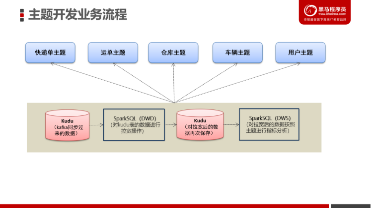

# 1- 离线主题开发业务流程图

# 2- 快递单主题

## 2-1 背景与需求

- 快递单量的统计主要是从多个不同的维度计算快递单量，从而[**监测快递公司业务运营情况**]()。

## 2-2 指标与维度

- 指标
  - 快递单总数  ，最大快递单数，最小快递单数，平均快递单数
- 维度
  - 各类客户，各渠道，各网点，各终端类型

# 3- 运单主题

## 3-1背景与需求

​		“**运单是运输合同的证明,是承运人已经接收货物的收据**。一份运单,填写一个托运人、收货人、起运港、到达港。如同一托运人的货物分别属到达港的两个或两个以上收货人,则应分别填制运单。”

​		**运单统计根据[区域、公司、网点、线路、运输工具]()等维度进行统计，可以对各个维度运单数量进行排行，如对网点运单进行统计可以[反映该网点的运营情况]()，对线路运单进行统计可以观察每个[线路的运力情况]()**；

## 3-2 指标与维度

- 指标
  - 运单总数  ，最大运单数，最小运单数，平均运单数
- 维度
  - 各区域，各分公司，各网点，各线路，各运输工具，各类客户

# 4- 客户主题

## 4-1 背景与需求

- 客户主题主要是通过分析用户的下单情况构建用户画像