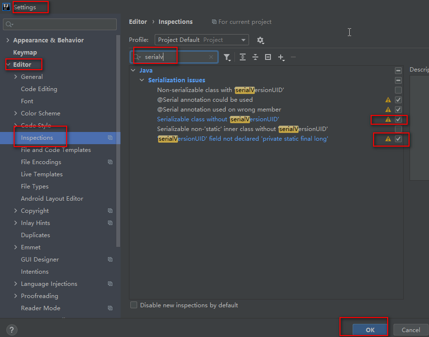
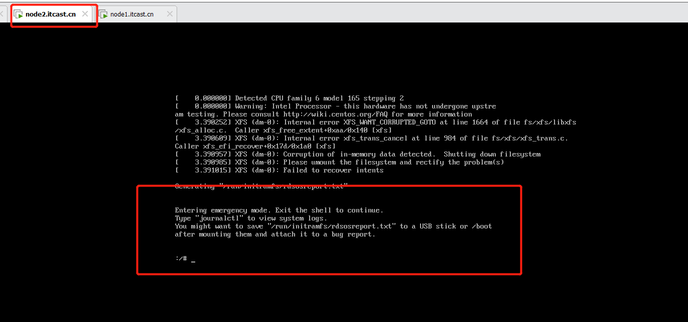
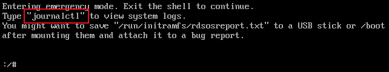
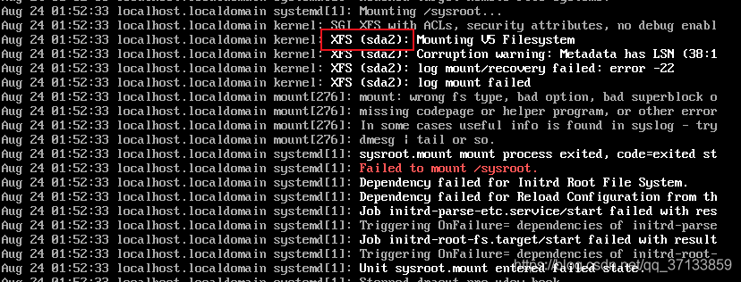
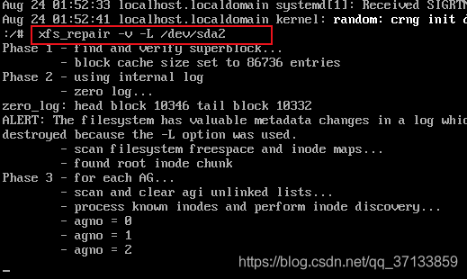
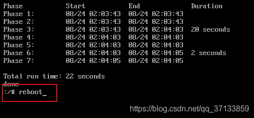

# 1- CRT无法连接虚拟机

1- ip addr

2- systemctl stop firewalld

3- systemctl restart network

4- 关闭本机的防火墙

# 2- 做数仓项目大概思路

## 2-1 倒推法

**[明确主题要啥-> 出个指标需要哪些数据->数据再那些表->确定表->采集表->做维度宽表->做维度聚合->出指标](https://github.com/th9195/Notes/blob/master/大数据/12-项目03-客快物流)**


# 3- IDEA 序列化无法自动生成UID




# 4- Centos7开机失败

- 报错：Entering emergency mode.Exit the shell to continue



Centos7开机失败，提示Entering emergency mode.Exit the shell to continue



输入journalctl

```
journalctl
```

然后一直按**空格键**跳转到最后一页查看下图中红色部分的内容，查看XFS后面括号里的内容，看里面是sda2还是sda3




我的是sda2 

**输入：xfs_repair -v -L /dev/sda2**

```
xfs_repair -v -L /dev/sda2
```




修复完成后输入reboot重启

```
reboot
```

