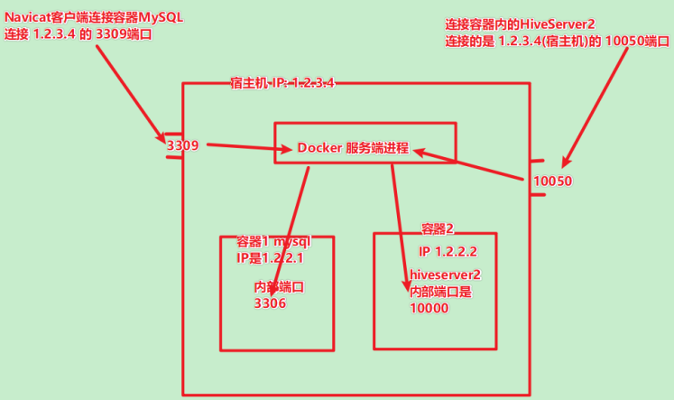
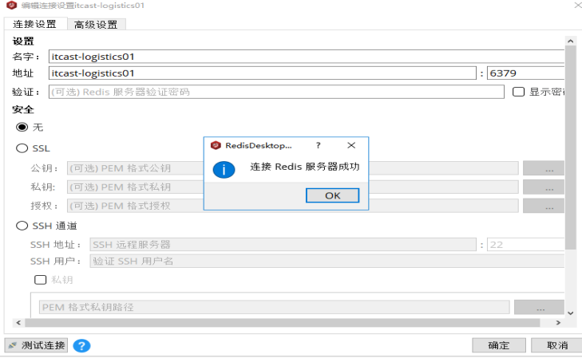
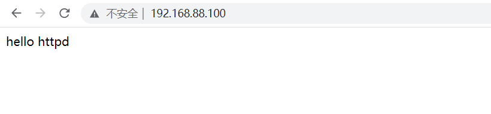

[TOC]


# 1- Docker的启动和停止

| 操作               | 指令                     |
| ------------------ | ------------------------ |
| 启动docker         | systemctl start docker   |
| 停止docker         | systemctl stop docker    |
| 重启docker         | systemctl restart docker |
| 查看docker状态     | systemctl status docker  |
| 开机启动           | systemctl enable docker  |
| 查看docker概要信息 | docker info              |
| 查看docker帮助文档 | docker --help            |


# 2- 帮助命令

## 2-1 查看Docker版本 version
``` shell
## 查看Docker版本
docker version
```


## 2-2 查看docker概要信息 info

``` shell
## 查看docker概要信息
docker info
```


## 2-3 查看docker帮助文档 help
```shell
## 查看docker帮助文档
docker --help
```

# 3- 镜像相关

## 3-1 搜索 search

``` shell
# 搜索
docker search [OPTIONS] XXX
docker search 某个XXX镜像名字
--no-trunc : 显示完整的镜像描述
```

## 3-2 拉取 pull

``` shell
# 拉取
docker pull [OPTIONS] NAME[:TAG|@DIGEST]
docker pull 镜像名字
```

## 3-3 列出 images

``` shell
# 列出
docker images [OPTIONS] [REPOSITORY[:TAG]]
docker images
-a :列出本地所有的镜像（含中间映像层）
-q :只显示镜像ID。
--digests :显示镜像的摘要信息
--no-trunc :显示完整的镜像信息
```

## 3-4 删除镜像 rmi

``` shell
# 删除
docker rmi [OPTIONS] IMAGE [IMAGE...]
docker rmi 镜像ID
  -f, --force      强制
      --no-prune   不要删除未标记的父镜像
# 删除多个
docker rmi -f 镜像名1:TAG 镜像名2:TAG
# 删除全部
docker rmi -f $(docker images -qa)
```


# 4- 容器相关

## 4-1 查看容器 ps 

``` shell
# 正在运行
docker ps
# 查看所有容器
docker ps -a
# 查看最后一次运行的容器
docker ps -l
# 查看停止的容器
docker ps -f status=exited
```

## 4-2 创建容器 run

``` shell
# 创建容器
docker run
    --name="容器新名字": 为容器指定一个名称；
    -d: 在run后面加上参数-d，会创建一个守护式容器在后台运行（这样创建容器后不会自动登录容器，如果只加-i-t两个参数，创建后会自动进入容器），并返回容器ID，也即启动守护式容器；
    -i：以交互模式运行容器，通常与 -t 同时使用；
    -t：TTY:表示容器启动后会进入其命令行，为容器重新分配一个伪输入终端，通常与 -i 同时使用；
    -p: 表示端口映射
        有以下四种格式
        ip:hostPort:containerPort
        ip::containerPort
        hostPort:containerPort
        containerPort
    前者表示宿主机端口，后者是容器内的映射端口，可以使用多个-p做多个端口映射

# 启动交互式容器
docker run -it --name=自定义名称(可省略) 镜像名称:标签 /bin/bash

# 退出交互式界面
exit

# 后台启动
docker run -di --name=xxx 镜像名称:标签
```


## 4-3 登陆容器 exec

``` shell
# 登陆容器
docker exec -it 容器名称（或者容器id） /bin/bash
```


## 4-4 停止容器 stop

``` shell
# 停止容器
docker stop 容器名称（或者容器id）
```


## 4-5 删除容器 rm

``` shell
# 删除容器
docker rm 容器名称（或者容器id）
```


## 4-6 重启容器 restart

``` shell
# 重启容器
docker restart 容器名称（或者容器id）
```


## 4-7 强制 kill

``` shell
# 强制kill
docker kill 容器名称（或者容器id）
```


## 4-8 拷贝 cp 

``` shell
# cp, 本地 to 容器
docker cp 本地路径 容器名称或ID:容器路径


# cp, 容器 to 本地
docker cp 容器名称或ID:容器路径 本地路径
```


## 4-9 挂载目录 -v 

``` shell
# 挂载目录
docker run -di -v 本地目录:容器目录 --name=容器名称 镜像名称:镜像tag
# 权限不足 可以--privileged=true
docker run -di --privileged=true -v /usr/local/myhtml:/usr/local/myhtml --name=mycentos3 centos:latest
```


## 4-10 查看容器详细信息 inspect

- [**可以获取ip Gateway 等相关详细信息**]()

```shell
# 查看容器详细信息
docker inspect 容器名称（容器id）

# 查看容器IP
docker inspect --format={{.NetworkSettings.IPAddress}} 容器名称（容器id）
```


# 5- 部署MySQL示例

```shell
docker search mysql

docker pull centos/mysql-57-centos7

## 端口映射
docker run -di --name=tensquare_mysql -p 3309:3306 -e MYSQL_ROOT_PASSWORD=123456 centos/mysql-57-centos7
```


## 5-1 端口映射 -p

``` shell
## 端口映射
docker run -di --name=tensquare_mysql -p 3309:3306 -e MYSQL_ROOT_PASSWORD=123456 centos/mysql-57-centos7
```

- 原理：



# 6- 部署Nginx示例

``` shell
## Docker hub上查找nginx镜像
docker search nginx

## 拉取nginx镜像到本地
docker pull nginx

## 创建nginx容器
docker run -di --name=mynginx -p 80:80 nginx

## 打开浏览器访问
http://node1.itcast.cn/
```


# 7- 部署Redis示例

``` shell
## Docker hub上查找redis镜像
docker search redis:4.0

## 拉取redis镜像到本地
docker pull redis:4.0

## 创建redis容器
docker run -di --name=myredis -p 6379:6379 redis:4.0
-p 代表端口映射，格式为宿主机映射端口:容器运行端口

## 使用redis-cli连接
docker exec -it myredis redis-cli


```

## 7-1 打开redis客户端连接redis服务器




# 8- 迁移备份 commit-save-load

```shell
# 将容器保存为镜像
docker commit 容器ID或name 镜像name

# 以新镜像创建容器
docker run -di -v /root/myredis/data:/data -v /root/myredis/redis.conf:/usr/local/etc/redis/redis.conf redis-my redis-server /usr/local/etc/redis/redis.conf --appendonly yes

# 将镜像保存为tar压缩包
docker save -o xxx.tar xxx_image

# 从压缩包恢复镜像
docker load -i xxx.tar
```


# 9- DockerFile

```shell
# 指明构建的新镜像是来自于哪个基础镜像，例如：
FROM centos: latest

# 指明镜像维护着及其联系方式（一般是邮箱地址），例如：
MAINTAINER C Y <caoyu@itcast.cn>
# 不过，MAINTAINER并不推荐使用，更推荐使用LABEL来指定镜像作者，例如：
LABEL maintainer="caoyu@itcast.cn"

# 构建镜像时运行的Shell命令，例如：
RUN ["yum", "install", "httpd"]
# 或
RUN yum install httpd

# 启动容器时执行的Shell命令，例如：
CMD ["-C", "/start.sh"] 
CMD ["/usr/sbin/sshd", "-D"] 
CMD /usr/sbin/sshd -D

# 声明容器运行的服务端口，例如：
EXPOSE 80 443

# 设置环境内环境变量，例如：
ENV MYSQL_ROOT_PASSWORD 123456
ENV JAVA_HOME /usr/local/jdk1.8.0_45

# 拷贝文件或目录到镜像中，例如：PS：如果是URL或压缩包，会自动下载或自动解压。
ADD <src>...<dest>
ADD html.tar.gz /var/www/html
ADD https://xxx.com/html.tar.gz /var/www/html

# 拷贝文件或目录到镜像中，用法同ADD，只是不支持自动下载和解压，例如：
COPY ./start.sh /start.sh

# ENTRYPOINT
# 启动容器时执行的Shell命令，同CMD类似，只是由ENTRYPOINT启动的程序不会被docker run命令行指定的参数所覆盖，而且，这些命令行参数会被当作参数传递给ENTRYPOINT指定指定的程序，例如：
ENTRYPOINT ["/bin/bash", "-C", "/start.sh"]
ENTRYPOINT /bin/bash -C '/start.sh'
# PS：Dockerfile文件中也可以存在多个ENTRYPOINT指令，但仅有最后一个会生效。

# 指定容器挂载点到宿主机自动生成的目录或其他容器，例如：
VOLUME ["/var/lib/mysql"]
# PS：一般不会在Dockerfile中用到，更常见的还是在docker run的时候指定-v数据卷。

# 为RUN、CMD、ENTRYPOINT以及COPY和AND设置工作目录，例如：
WORKDIR /data
```


# 10- CMD VS ENTRYPOINT

```shell
# CMD 2种格式
Exec 格式：CMD ["执行命令","参数1","参数N"]（推荐格式）, 如: CMD ["ls", "/tmp"]
	同时, 单纯的:
	CMD ["参数1","参数N"] 可以将参数传递给ENTRYPOINT,作为它的默认参数，此时 ENTRYPOINT 必须使用 Exec 格式。
	如: CMD ["heihei"]
Shell 格式：CMD command param1 param2 如: CMD ls /tmp
```

```shell
# ENTRYPOINT用于容器启动以后执行的命令，支持两种格式，多条ENTRYPOINT仅最后一条生效。
Exec 格式：ENTRYPOINT ["executable", "param1", "param2"]（推荐格式）

Shell 格式：ENTRYPOINT command param1 param2
```

```shell
CMD ["heihei"]
ENTRYPOINT ["echo"]
# heihei作为echo的默认参数, 如果docker run后有参数, heihei被替换
CMD echo "heihei"
ENTRYPOINT ["echo"]
# CMD完全没用了. docker run后的参数提供给echo
```


如:

```shell
FROM centos:7

CMD ["heihei"]
ENTRYPOINT ["echo"]

# 执行
docker run -it test
# 输出
heihei

# 执行
docker run -it test hahaha
# 输出
hahaha

# -------------------
FROM centos:7

CMD echo "heihei"
ENTRYPOINT ["echo"]
[root@localhost ~]# docker run -it test
/bin/sh -c echo "heihei"
[root@localhost ~]# docker run -it test hahaha
hahaha
```


# 11- 自定义JDK8环境镜像 - DockerFile示例

## 11-1 DockerFile 代码

```shell
#依赖镜像名称和id
FROM centos:7

# 作者
LABEL maintainer="htang103@fiberhome.com"

# 工作目录
WORKDIR /usr/local

# 执行
RUN mkdir /usr/local/jdk8

# 添加资源 自动解压
ADD jdk-8u221-linux-x64.tar.gz /usr/local/jdk8/

# 配置环境变量
ENV JAVA_HOME=/usr/local/jdk8/jdk1.8.0_221
ENV JRE_HOME=$JAVA_HOME/jre
ENV CLASSPATH=$JAVA_HOME/lib/dt.jar:$JAVA_HOME/lib/tools.jar:$JRE_HOME:$CLASSPATH
ENV PATH=$JAVA_HOME/bin:$PATH
```

## 11-2 构建镜像 build

``` shell
docker build -t myjdk:1 .
##注意后面的空格和点，不要省略，点表示当前目录
```


# 12- 自定义Apache服务器镜像

## 12-1 DockerFile 代码

```shell
#依赖镜像名称和id
FROM centos:7

# 作者
LABEL maintainer="caoyu@itcast.cn"

# RUN
RUN yum install -y net-tools
RUN yum install -y httpd
# RUN systemctl enable httpd

# WORKDIR
WORKDIR /var/www/html

# RUN
RUN echo "hello httpd" >> /var/www/html/index.html

# 入口
ENTRYPOINT /usr/sbin/apachectl -DFOREGROUND

# 端口
EXPOSE 80
```

## 12-2 构建镜像 build

```
docker build -t myApache:1 .


## 12-3 启动镜像

``` shell
docker run -d -p 80:80 749ccfa6ab67
```

- 网页访问

