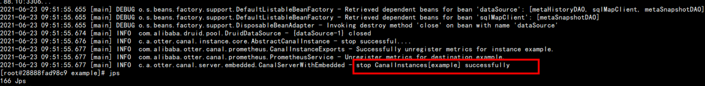

# 1- node1容器列表

- [**canal-server**]()
  - canal
- [**mysql**]()
  - mysql
- [**myoracle**]()
  - oracle 和 ogg

也就是4个组件([**oracle + ogg + mysql + canal )**]() 跑在3个容器中


# 2- 启动node1上的容器

## 2-1 启动oracle + ogg容器

1. 启动容器

   ``` shell
   docker start myoracle
   
   ## 注意: 启动了oracle的容器 不代表里面的服务也启动了,我们要登录进去 手动启动服务
   ```

   

2. 登录oracle容器

   ``` shell
   docker exec -it myoracle /bin/bash
   ```

   

3. 切换到oracle用户: 

   ``` shell
   su - oracle
   ```

   

4. 启动oracle的监听服务

   ``` shell
   source ~/.bash_profile
   
   lsnrctl start
   ```

   

5. 启动oracle进程

   ```shell
   sqlplus "/as sysdba"
   startup
   # 测试连接是否可以
   conn itcast/itcast
   ```

   

6. 启动ogg组件

   **[必须使用oracle容器内的oracle用户执行]()**，需要打开[**两个Shell**]()会话窗口（分别用于启动源端和目标端）

   源端: 表示[**ogg的采集**]()的端

   目标端:[**ogg发送**]()的端

   ```shell
   # 在shell 1 (源端)中
   
   ctrl + D 先退出SQL窗口
   
   cd $OGG_SRC_HOME
   ./ggsci
   
   # 在shell 2 (目标端)中
   # 先进入:
   	 docker exec -it myoracle /bin/bash
   	 su - oracle
   	 lsnrctl start
   	 
   cd $OGG_TGR_HOME
   ./ggsci
   
   # 在shell 1 (源端) 中启动ogg的管理进程
   start mgr
   # 在shell 2 (目标端) 中启动ogg的管理进程
   start mgr
   
   # 在shell 1 (源端) 中启动抽取数据进程
   start extkafka
   
   # 在shell 1 (源端) 中启动
   start pukafka
   
   # 在shell 2 (目标端) 中启动
   start rekafka
   ```
   
   `到此, oracle 和 ogg 就启动完成了`
   
   


## 2-2 启动MySQL和canal的容器

``` shell
docker start mysql
docker start canal-server
```

- canal

``` shell
docker start canal-server

# 有可能开机启动失败
[root@node1 ~]# docker exec  -it 2888 /bin/bash
[root@28888fad98c9 admin]# cat ./canal-server/logs/example/example.log  有停止canal信息

## kill 掉 canalserver 重新启动app.sh即可

[root@28888fad98c9 admin]# kill -9 92
[root@28888fad98c9 admin]# jps
179 Jps
92 -- process information unavailable
[root@28888fad98c9 admin]# ls
app.sh  bin  canal-server  health.sh
[root@28888fad98c9 admin]# ./app.sh 
==> START ...
start canal ...
start canal successful
==> START SUCCESSFUL ...
```




# 3- oracle 和 mysql的账户

- oracle:

  ``` properties
  账号: itcast
  
  密码: itcast
  
  角色: Normal
  ```

- mysql:

  ``` properties
  账号: root  
  密码: 123456
  ```

  